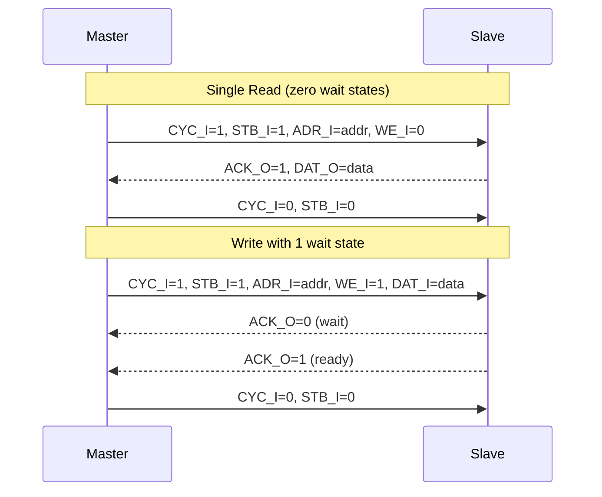
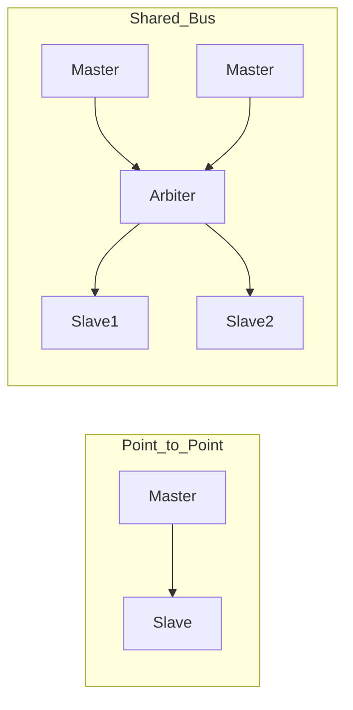
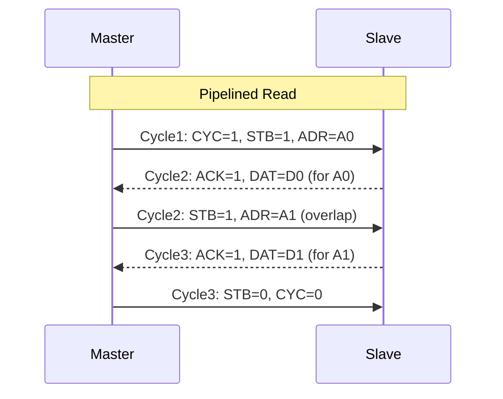

# Wishbone基础认知与架构

[B] [I]

---

### 为什么Wishbone像"乡村土路"

片上总线协议中，AMBA家族占据商用SoC主流，TileLink绑定RISC-V生态。
 
Wishbone由OpenCores社区设计，追求极致简单——信号最少、规范最短、实现最容易。
 
它不是为手机SoC准备的，而是为FPGA原型验证、教学实验、开源IP互连而生。
 

类比：乡村土路——
 
没有红绿灯（无仲裁器）、没有分道线（无字节掩码）、没有收费站（无需授权）。
 
只要两辆车（主从）互相挥手（STB+ACK）就能通行，路窄但人人会修。
 

---

### 信号全集

Wishbone采用极简的主从握手（Master-Slave Handshake）架构。
 
B.4版本信号仅11根，B.3版本更少：

| 信号 | 方向 | 位宽 | 功能 |
|------|------|------|------|
| CLK_I | 输入 | 1 | 时钟，上升沿采样 |
| RST_I | 输入 | 1 | 同步复位，高电平有效 |
| ADR_I | 输入 | 32 | 目标地址 |
| DAT_I | 输入 | 32 | 写数据（Master→Slave） |
| DAT_O | 输出 | 32 | 读数据（Slave→Master） |
| WE_I | 输入 | 1 | 1=写，0=读 |
| SEL_I | 输入 | 4 | 字节选择（B.4新增） |
| STB_I | 输入 | 1 | 选通，表示有效周期 |
| ACK_O | 输出 | 1 | 确认，从机响应完成 |
| CYC_I | 输入 | 1 | 总线周期，标志传输正在进行 |
| ERR_O | 输出 | 1 | 错误响应（B.3可选/B.4标准） |
| RTY_O | 输出 | 1 | 重试（B.3可选） |

关键认知：CYC_I和STB_I是Wishbone的精髓——CYC_I标志"我在用总线"，STB_I标志"这拍是给你的"。 

---

### 传输时序：STB+ACK握手

Wishbone的握手只有一条规则：Master拉高STB_I，Slave在准备好后拉高ACK_O。
 
与APB的固定2周期不同，Wishbone可以1周期完成（零等待状态），也可以多周期。
 

典型单周期读操作：
 
T1：CYC_I=1, STB_I=1, ADR_I=目标地址, WE_I=0。
 
T1（同拍）：Slave发现STB_I且地址命中，立回ACK_O=1和DAT_O。
 
T2：Master拉低CYC_I/STB_I，传输结束。
 

结论：Wishbone单周期传输只需1个时钟沿，比APB的Setup+Access更快——前提是从机能即时响应。 

---

### B.3与B.4版本差异

| 特性 | Wishbone B.3 | Wishbone B.4 |
|------|-------------|--------------|
| SEL_I | 无（必须全字） | 有（字节掩码） |
| ERR_O | 可选 | 标准 |
| RTY_O | 可选 | 可选 |
| 块传输 | 有（增量/回环） | 有（更灵活） |
| TAG扩展 | TGA/TGD/TGC | 保持兼容 |
| 规范页数 | ~15页 | ~35页 |

扩展：B.3规范发布于2002年，B.4于2010年。实际项目中B.3仍大量使用，因为FPGA IP库多基于B.3实现。 

---

### 与APB的对比

Wishbone和APB都面向低速外设，但设计理念迥异：

| 维度 | APB | Wishbone |
|------|-----|----------|
| 规范来源 | ARM | OpenCores |
| 授权 | 需ARM授权 | 完全开源 |
| 规范页数 | ~40页 | ~15-35页 |
| 信号数量 | 9-15根 | 11-13根 |
| 传输周期 | 固定2+拍 | 1+拍（可变） |
| 流水线 | 无 | 可选 |
| 突发传输 | 无 | 块传输（B.3起） |
| 字节掩码 | APB4起 | B.4起 |
| 生态规模 | 商用SoC主流 | FPGA/开源为主 |
| 参考IP | ARM CMSDK | OpenCores库 |

结论：APB是"企业级标准"——规范严谨、生态庞大、实现复杂；Wishbone是"草根方案"——够用就行、自由修改、即学即用。 

---

### Wishbone互连拓扑

Wishbone规范定义了三种互连方式，适应不同规模：

| 拓扑 | 结构 | 适用场景 | 特点 |
|------|------|----------|------|
| 点对点 | 1 Master + 1 Slave | 最小系统 | 无仲裁，直接连线 |
| 数据流 | Master→Slave→Slave… | 流水线 | 像串珠，数据逐级传递 |
| 共享总线 | 多Master + 仲裁器 + 多Slave | 中等规模 | 需仲裁，类似AHB |
| 交叉开关 | 任意Master→任意Slave | 大规模 | 并行度高，面积代价大 |

关键认知：Wishbone的"共享总线"拓扑需要外部仲裁器，规范本身不定义仲裁算法。常见实现是轮询（Round-Robin）或固定优先级。 

---

### 流水线模式（Registered Feedback）

Wishbone B.3起支持流水线传输，把地址和数据周期错开：

流水线模式要求Slave有地址锁存，能提前准备下一拍数据。
 
吞吐量提升：单周期模式每2拍1事务，流水线模式每1拍1事务。
 

扩展：流水线模式在FPGA中几乎零成本（利用寄存器本就存在），是提升Wishbone性能的首选手段。 

---

**学习路径提示**： 
- [B] 读者：记住Wishbone只有一条规则——"我选通（STB），你确认（ACK）"。 
- [I] 读者：对比Wishbone与APB的时序差异，理解"可变周期"vs"固定周期"的取舍。
