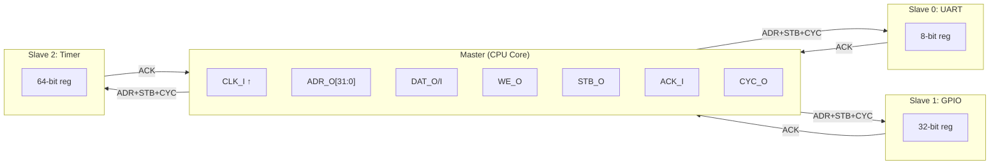
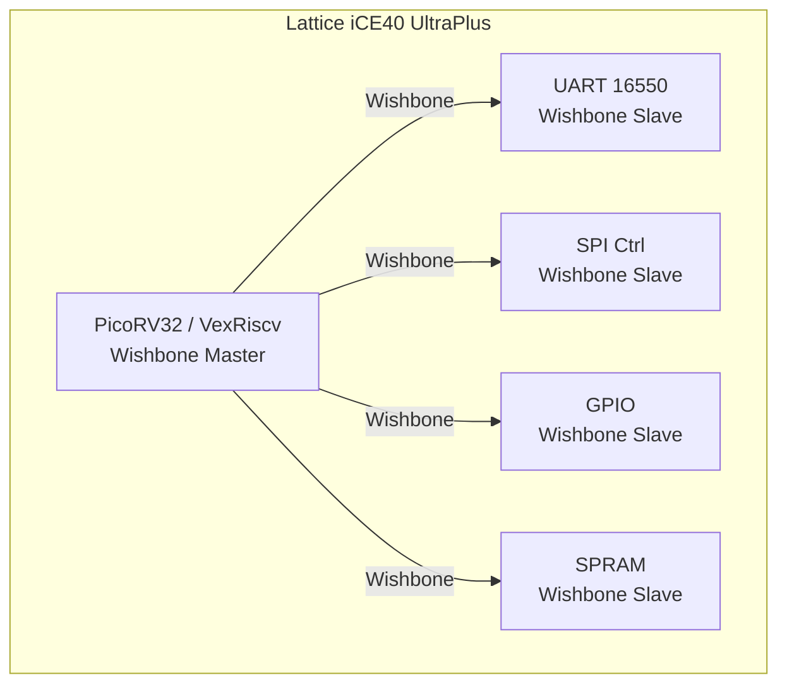

# Wishbone是什么——OpenCores 极简开源总线

<span class="badge-b">[B]</span> <span class="badge-i">[I]</span> <span class="badge-e">[E]</span> <span class="badge-m">[M]</span>

<span class="red">Wishbone 是 OpenCores 项目于 1999 年提出的开源片上总线标准，以"最简单够用"为设计哲学，成为 FPGA 和小规模 ASIC 设计中最广泛使用的开源互连方案。</span>

---

## 核心定义与价值

### <strong>Wishbone 的定位</strong>

Wishbone 由 Richard Herveille 在 OpenCores 社区设计，目标是"任何人都能理解和实现的 SoC 总线"。

<br>

| 维度 | Wishbone | AMBA APB | AXI4-Lite |
|------|----------|----------|-----------|
| 发起方 | OpenCores 社区 | ARM | ARM |
| 信号数 | 12+（基础） | 10+ | 30+ |
| 流水线 | 无 | 无 | 无 |
| 多主支持 | 需外部仲裁器 | 单主 | 需 Interconnect |
| 一致性 | 无 | 无 | 无 |
| 生态规模 | 数百个开源 IP | ARM 官方 IP | ARM 全生态 |
| 实现难度 | 极简单 | 简单 | 中等 |

<br>

<span class="blue">Wishbone 的核心价值是"零门槛接入开源 IP 生态"。</span>
<br>
OpenCores 提供了数百个 Wishbone 兼容的 IP 核（UART、SPI、SDRAM、VGA 等），
<br>
开发者可以直接组合这些 IP 构建完整 SoC，无需购买商业授权。

### <strong>类比：乡村小路 vs 高速公路</strong>

想象你需要在不同村庄之间运输货物。

<br>

- <span class="green">AMBA AXI</span> = 高速公路：
<br>
多车道、匝道、ETC、服务区——吞吐量大，但建设成本高，需要专业团队维护

- <span class="green">Wishbone</span> = 乡村小路：
<br>
一条土路，没有红绿灯，没有收费站——够用就行，任何人都能修

<br>

这个类比的关键是：<span class="blue">Wishbone 不是低性能的代名词，而是"适当复杂"的典范。</span>
<br>
对于只需要串口、SPI、GPIO 的嵌入式系统，Wishbone 的信号数量和时序复杂度恰到好处。

---

## 核心机制原理解析

### <strong>1. 信号全集：精确到每个引脚</strong>

<span class="red">Wishbone B.4 版本定义了 13 个核心信号，全部以 _I（输入）和 _O（输出）区分方向。</span>

<br>

| 信号名 | 方向 | 位宽 | 说明 |
|--------|------|------|------|
| CLK_I | 输入 | 1 | 时钟，上升沿采样 |
| RST_I | 输入 | 1 | 复位，高电平有效 |
| ADR_I | 输入 | 32 | 地址总线（字节寻址） |
| DAT_I | 输入 | 8/16/32/64 | Master 写入的数据 |
| DAT_O | 输出 | 8/16/32/64 | Slave 读出的数据 |
| WE_I | 输入 | 1 | 写使能，1=写，0=读 |
| SEL_I | 输入 | n | 字节选择（n = DAT 宽度/8） |
| STB_I | 输入 | 1 | 选通信号，1=有效事务 |
| ACK_O | 输出 | 1 | 应答，1=事务完成 |
| CYC_I | 输入 | 1 | 周期信号，1=总线占用 |
| ERR_O | 输出 | 1 | 错误，1=总线错误 |
| RTY_O | 输出 | 1 | 重试，1=请求重试 |
| LOCK_I | 输入 | 1 | 锁定（B.4 新增，可选） |

<br>

<span class="blue">核心握手信号只有 STB_I + ACK_O，这是 Wishbone 极简哲学的体现。</span>
<br>
Master 置 STB_I=1 发起请求，Slave 置 ACK_O=1 表示完成，仅此而已。

### <strong>2. 与 AMBA APB 的对比</strong>

<br>

| 特性 | Wishbone | APB |
|------|----------|-----|
| 时钟 | 单沿触发（上升沿） | 单沿触发 |
| 地址阶段 | 1 周期（STB+ACK 同时有效） | 2 周期（SETUP + ACCESS） |
| 写选通 | WE_I + SEL_I | PWRITE + PSTRB |
| 错误处理 | ERR_O + RTY_O | PSLVERR |
| 多主 | 需外部仲裁 | 单主 |
| TAG 扩展 | TGA/TGD/TGC（B.4） | 无 |

<br>

<span class="blue">Wishbone 单周期完成 vs APB 两周期完成，是两者最本质的区别。</span>
<br>
在相同时钟频率下，Wishbone 的理论吞吐量是 APB 的两倍（假设无等待状态）。

### <strong>3. Wishbone B.3 vs B.4 版本差异</strong>

<br>

| 特性 | B.3 | B.4 |
|------|-----|-----|
| 信号数量 | 12 | 13（+LOCK_I） |
| TAG 信号 | 无 | TGA（地址）、TGD（数据）、TGC（周期） |
| 突发传输 | 隐含支持 | 显式支持（增量/回绕地址） |
| 流水线 | 无 | 可选流水线模式 |
| 推荐使用 | 向后兼容项目 | 新设计首选 |

<br>

<span class="blue">B.4 的 TAG 信号是 Wishbone 最重要的扩展机制。</span>
<br>
通过 TGA_O/TGA_I 传递地址阶段的附加信息（如特权级别、安全域），
<br>
通过 TGD_O/TGD_I 传递数据阶段的附加信息（如 ECC、校验），
<br>
使 Wishbone 在不增加核心信号的前提下支持复杂场景。

---

## 技术教学与实战

### <strong>最小 Wishbone 系统连接</strong>

<br>



<br>

地址译码逻辑（Verilog）：

```verilog
// 最小 Wishbone 地址译码
assign sel_uart  = (adr_i[31:28] == 4'h0);  // 0x0000_0000 - 0x0FFF_FFFF
assign sel_gpio  = (adr_i[31:28] == 4'h1);  // 0x1000_0000 - 0x1FFF_FFFF
assign sel_timer = (adr_i[31:28] == 4'h2);  // 0x2000_0000 - 0x2FFF_FFFF

// UART Slave 的 ACK
assign uart_ack = sel_uart & stb_i & cyc_i;
```

---

## 嵌入式专属实战场景

### <strong>场景：在 Lattice iCE40 FPGA 上构建 Wishbone SoC</strong>

iCE40 是最小成本的 FPGA（约 1 美元），Wishbone 的轻量级特性使其成为理想选择。

<br>



<br>

**关键资源占用：**

| 模块 | LUT | FF | 备注 |
|------|-----|----|------|
| PicoRV32 | 1500 | 500 | RISC-V 核心 |
| Wishbone Xbar (3 Slave) | 200 | 50 | 交叉开关 |
| UART 16550 | 300 | 100 | 串口 |
| SPI Ctrl | 200 | 80 | 闪存/传感器 |
| GPIO | 100 | 64 | 16 个 IO |
| 总计 | ~2300 | ~800 | iCE40 UP5K 有 5280 LUT |

<br>

<span class="blue">整个 SoC 仅占 iCE40 UP5K 的 43% LUT，Wishbone 的极简功不可没。</span>

---

## 历史演进与前沿

### <strong>Wishbone 的版本与生态演进</strong>

<br>

| 年份 | 事件 | 意义 |
|------|------|------|
| 1999 | Wishbone B.1 发布 | OpenCores 社区诞生 |
| 2002 | Wishbone B.3 发布 | 广泛采用的事实标准 |
| 2010 | Wishbone B.4 发布 | 增加 TAG 和流水线 |
| 2015 | LiteX 项目启动 | 用 Wishbone 替代/扩展 Migen |
| 2018 | litex-vexriscv | Wishbone + RISC-V 经典组合 |
| 2022 | cocotb 支持 | Wishbone 进入 Python 验证时代 |

<br>

<span class="purple">扩展阅读：</span>
<br>
OpenCores Wishbone 规范：https://opencores.org/howto/wishbone
<br>
Wishbone B.4 规范 PDF（WISHBONE_b4.pdf）是必读文档。

---

## 本章小结

| 主题 | 核心要点 |
|------|----------|
| Wishbone 定位 | OpenCores 提出，最简开源 SoC 总线 |
| 核心信号 | CLK_I, RST_I, ADR_I, DAT_I/O, WE_I, SEL_I, STB_I, ACK_O, CYC_I |
| 握手机制 | STB_I + ACK_O，单周期完成 |
| 与 APB 对比 | 单周期 vs 两周期，12 信号 vs 10 信号 |
| B.3 vs B.4 | B.4 增加 TAG（TGA/TGD/TGC）和 LOCK_I |
| 典型应用 | FPGA 开源 SoC（PicoRV32 + UART + SPI + GPIO） |
| 类比 | 乡村土路 vs 高速公路 |

---

## 练习

1. **概念题**：列出 Wishbone 的 12 个核心信号（不含 B.4 新增），并说明 CLK_I、RST_I、STB_I、ACK_O 的作用。

2. **对比题**：Wishbone 和 APB 都是面向低性能外设的总线，从时序角度比较两者的本质区别。

3. **设计题**：用 Verilog 写一个最小 Wishbone Slave（32-bit 寄存器），支持读和写。

4. **分析题**：为什么 Wishbone 不需要像 AXI 那样复杂的通道分离？从应用场景和信号数量两个角度分析。
