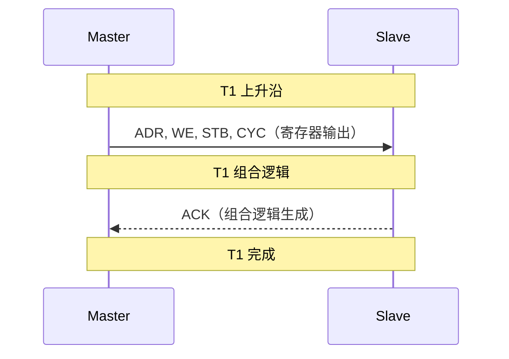
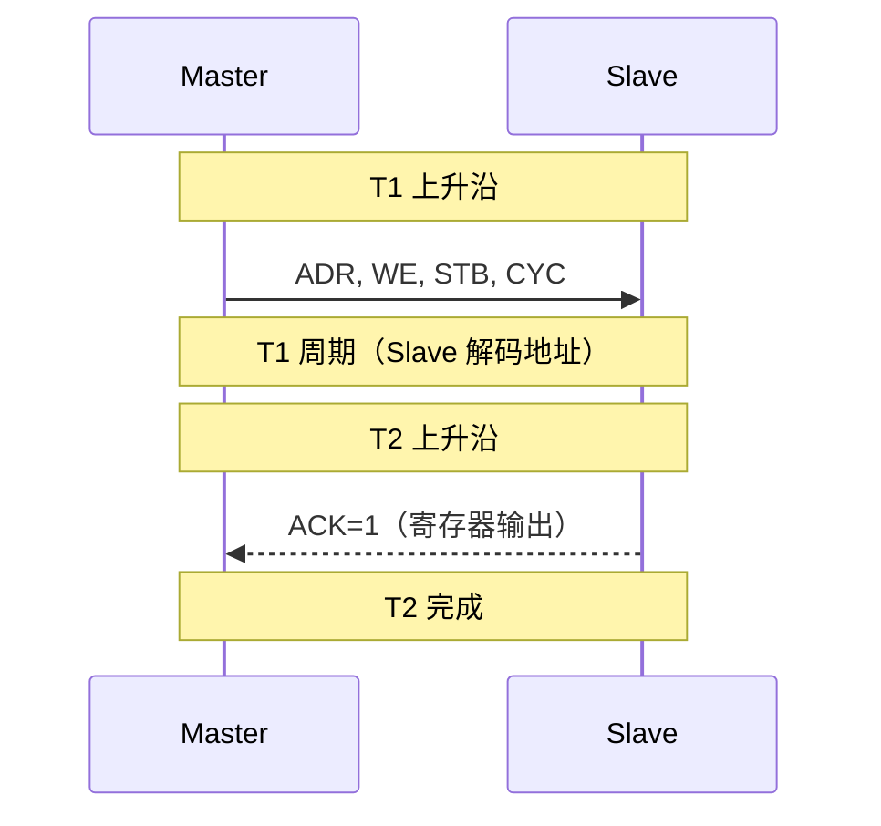

# Wishbone 传输时序与变体 [B→I]

> **本章学习目标**：
003cbr>
> - 理解 Wishbone <span class="red">Classic 与 Registered 时序</span> 的差异
> - 掌握 Wishbone <span class="red">块传输与突发传输</span> 的信号序列
> - 了解 Wishbone <span class="red">仲裁机制</span> 与多主共享

---

<span class="blue">从何而来 → 为什么需要 → 哪里用：</span><br>
<span class="red">Wishbone 时序变体</span>随 FPGA 和 ASIC 的不同需求而发展。<br>
早期 Wishbone 只有 Classic 时序（单周期），但 <span class="green">FPGA</span> 中组合逻辑延迟导致 ACK 难以在单周期内生成。<br>
<span class="blue">Registered 时序将 ACK 推迟一拍，用寄存器输出换取时序裕量，成为 FPGA 实现的首选。</span><br>
如今，Wishbone Classic 用于 <span class="green">ASIC</span>（时序裕量充足），Registered 用于 <span class="green">FPGA</span>（组合逻辑受限）。<br>

---

## Wishbone Classic 与 Registered 时序

---

### <strong>Classic 时序：组合逻辑输出</strong>

<span class="red">Classic 时序</span>中，Slave 用组合逻辑生成 ACK。<br>
ACK 在 CLK 上升沿后<span class="blue">立即</span>响应。<br>



<span class="blue">Classic 时序要求 Slave 的地址解码到 ACK 的路径是纯组合逻辑，延迟必须 < 1 个周期。</span><br>

---

### <strong>Registered 时序：寄存器输出 ACK</strong>

<span class="red">Registered 时序</span>中，Slave 在 CLK 上升沿锁存 STB，<br>
下一周期才输出 ACK。<br>



<span class="blue">Registered 时序用 2 个周期完成一次传输，但 Slave 可以用寄存器输出，FPGA 实现更友好。</span><br>

---

## 块传输与突发传输

---

### <strong>块传输（Block Transfer）</strong>

<span class="red">块传输</span>允许连续读写多个地址相邻的数据。<br>
Master 保持 CYC=1，通过多次 STB=1 传输连续地址。<br>

```verilog
// Wishbone 块传输 Master（Verilog）
always @(posedge CLK_I) begin
  if (state == BLOCK) begin
    ADR_O <= base_addr + block_cnt;
    WE_O  <= 1'b1;
    STB_O <= 1'b1;
    CYC_O <= 1'b1;
    if (ACK_I) begin
      block_cnt <= block_cnt + 1;
      if (block_cnt == BLOCK_LEN - 1)
        state <= IDLE;
    end
  end
end
```

<span class="blue">块传输无需突发控制信号，Master 只需递增地址并等待 ACK。</span><br>

---

### <strong>突发传输（Burst Transfer）</strong>

<span class="red">突发传输</span>是 Wishbone B4 版本新增的特性。<br>
通过 <span class="green">CTI_O</span>（Cycle Type Identifier）和 <span class="green">BTE_O</span>（Burst Type Extension）信号控制。<br>

| CTI 值 | 含义 |
| --- | --- |
| 000 | Classic 周期（默认值） |
| 001 | 常量地址突发（FIFO） |
| 010 | 递增突发 |
| 111 | 突发结束 |

<span class="blue">Wishbone B4 的突发传输与 AXI 的 INCR 突发类似，但控制信号更简单。</span><br>

---

## Wishbone 仲裁机制

---

### <strong>多主共享：CYC 信号的作用</strong>

<span class="red">Wishbone</span> 的多主仲裁通过 <span class="green">CYC_O</span> 信号实现。<br>
Master 在发起传输前拉高 CYC，传输结束后拉低 CYC。<br>
Arbiter 根据 CYC 和优先级决定哪个 Master 获得总线。<br>

```verilog
// 2-Master 轮询仲裁器
module wb_arbiter (
  input         CLK_I, RST_I,
  input         CYC0, CYC1,
  output reg    GNT0, GNT1
);

  reg last_grant;
  
  always @(posedge CLK_I) begin
    if (RST_I) begin
      GNT0 <= 1'b1;
      GNT1 <= 1'b0;
      last_grant <= 1'b0;
    end else if (CYC0 && CYC1) begin
      GNT0 <= !last_grant;
      GNT1 <= last_grant;
      last_grant <= !last_grant;
    end else if (CYC0) begin
      GNT0 <= 1'b1;
      GNT1 <= 1'b0;
    end else if (CYC1) begin
      GNT0 <= 1'b0;
      GNT1 <= 1'b1;
    end
  end
endmodule
```

<span class="blue">Wishbone 仲裁器通常用 CYC 作为请求信号，比 AHB 的 HBUSREQ 更简单。</span><br>

---

## 本章小结

| 概念 | 一句话总结 |
| --- | --- |
| Classic 时序 | 组合逻辑 ACK，1 周期完成 |
| Registered 时序 | 寄存器 ACK，2 周期完成，FPGA 友好 |
| 块传输 | CYC 保持，多次 STB+ACK 连续地址 |
| 突发传输 | CTI/BTE 控制，Wishbone B4 新增 |
| CYC 仲裁 | Master 拉高 CYC 请求总线，Arbiter 授权 |
| 轮询仲裁 | CYC0 && CYC1 时切换授权，公平无饿死 |

---

## 练习

1. 为什么 FPGA 实现 Wishbone 时推荐使用 Registered 时序？<br>
2. 对比 Wishbone 块传输和 AXI 突发传输，说明控制信号的差异。<br>
3. 设计一个 3-Master 固定优先级 Wishbone 仲裁器，优先级：Master0 > Master1 > Master2。
