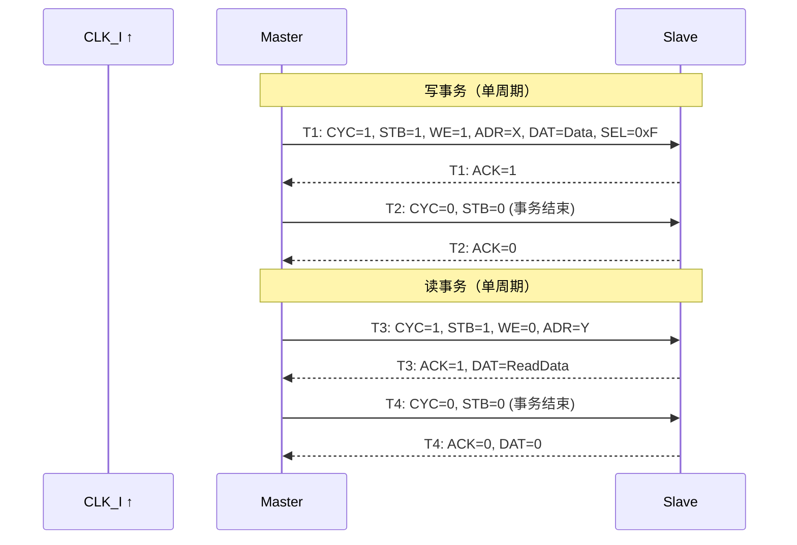
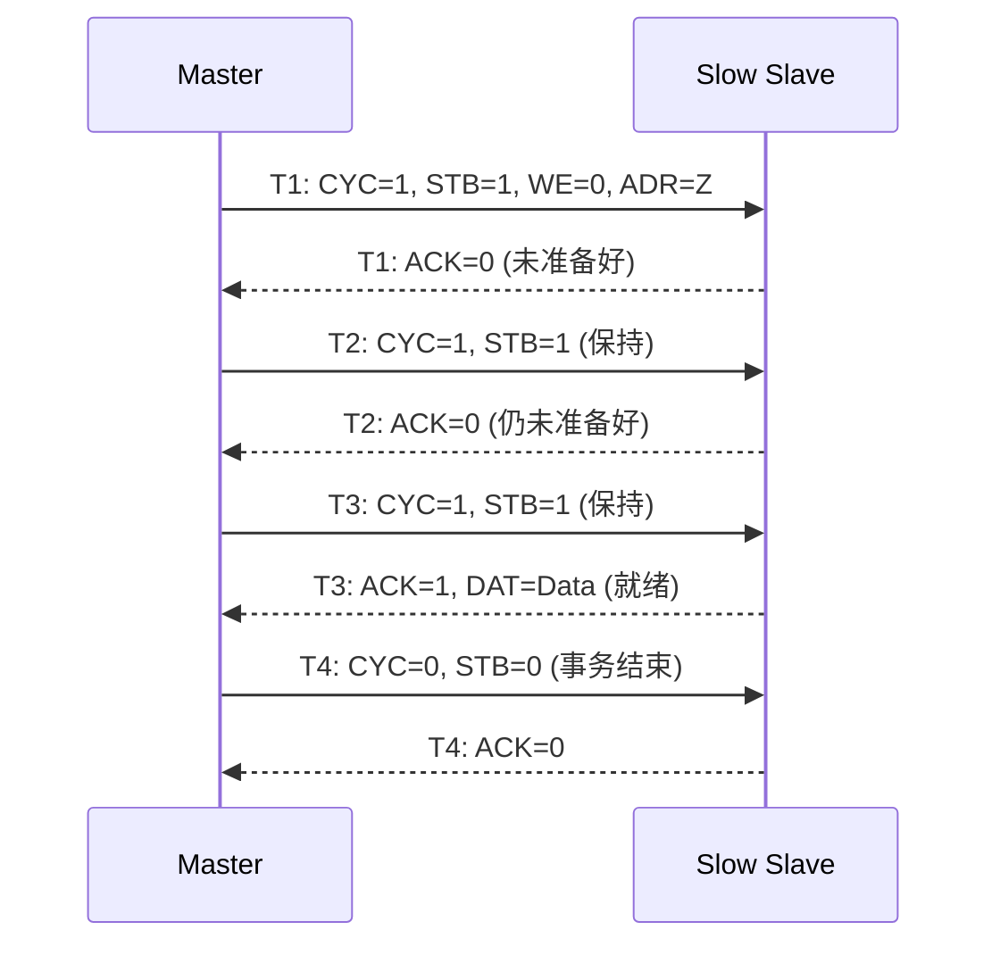
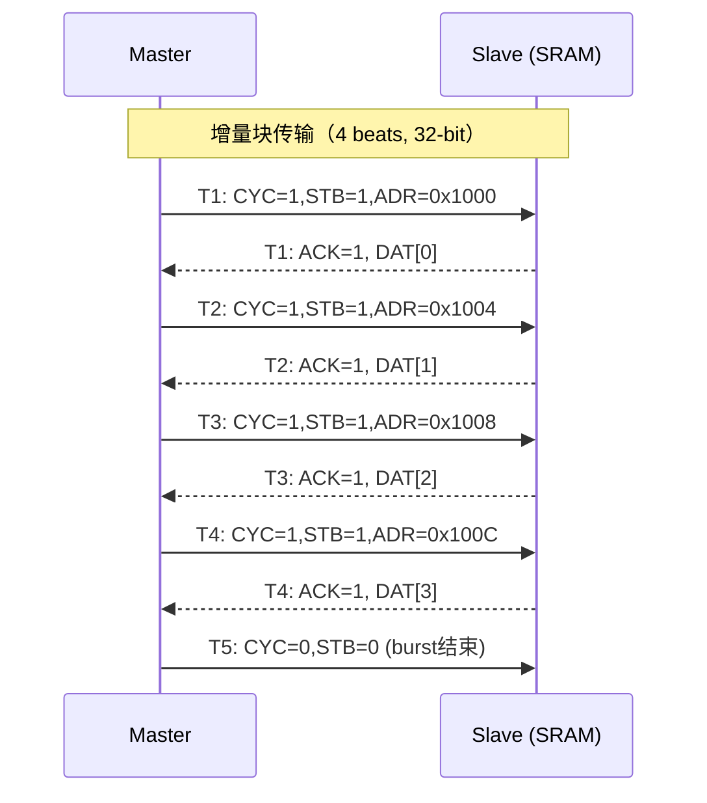

# Wishbone怎么做——传输时序与块传输模式

<span class="badge-b">[B]</span> <span class="badge-i">[I]</span> <span class="badge-e">[E]</span> <span class="badge-m">[M]</span>

<span class="red">Wishbone 的时序是其"极简"哲学的直接体现——单周期 STB+ACK 握手完成一次读写，块传输和 TAG 扩展则在基础之上提供额外能力。</span>

---

## 核心定义与价值

### <strong>标准单周期读写时序</strong>

Wishbone 的读写事务在单个时钟周期内完成，前提是从设备（Slave）能够立即响应。

<br>



<br>

<span class="blue">单周期完成的关键是 CYC_I 和 STB_I 在同时置位时，ACK_O 在同一周期返回。</span><br>
如果 Slave 无法在单周期内响应，它会保持 ACK_O=0，Master 继续等待——这就是"等待状态"机制。

---

## 核心机制原理解析

### <strong>1. 等待状态（Wait States）</strong>

<span class="red">当 Slave 需要多个周期准备数据时，通过延迟 ACK_O 的置位实现等待。</span>

<br>



<br>

等待状态的规则：

- Master 必须保持 CYC_I=1 和 STB_I=1 直到收到 ACK_O=1<br>
- Slave 可以随时插入等待状态，无需事先通知<br>
- ADR_I、DAT_I、WE_I、SEL_I 在等待期间必须保持稳定<br>

<span class="blue">等待状态使得 Wishbone 能连接 SRAM、Flash 等慢速设备，而无需复杂的流控机制。</span>

### <strong>2. 块传输（Block Transfer / Burst）模式</strong>

Wishbone 支持两种块传输模式：增量（Incrementing）和回绕（Wrap）。

<br>

| 模式 | 地址变化 | 典型应用 |
|------|----------|----------|
| 增量（Incrementing） | 每次 + beatBytes | DMA 线性传输、内存拷贝 |
| 回绕（Wrap） | 在边界内循环 | Cache line fill、FIFO 环形缓冲 |

<br>



<br>

块传输的关键规则：

- <span class="green">CYC_I 在整个块传输期间保持为 1</span><br>
- <span class="green">STB_I 在每个 beat 上独立置位/等待</span><br>
- <span class="green">ADR_I 按 SEL_I 宽度递增</span>（如 SEL=4'b1111，地址 +4）<br>
- Slave 可以在任意 beat 上插入等待状态

### <strong>3. SEL_I 字节选择机制</strong>

SEL_I 是 Wishbone 实现字节/半字/全字访问的关键。

<br>

| 数据宽度 | SEL_I 位宽 | 全字写 | 半字写 | 字节写 |
|----------|-----------|--------|--------|--------|
| 8-bit | 1 | 1'b1 | 1'b1 | 1'b1 |
| 16-bit | 2 | 2'b11 | 2'b01 或 2'b10 | 2'b01 等 |
| 32-bit | 4 | 4'b1111 | 4'b0011, 4'b1100 | 4'b0001 等 |
| 64-bit | 8 | 8'hFF | 8'h0F, 8'hF0 等 | 8'h01 等 |

<br>

```verilog
// Wishbone Slave 中 SEL_I 的使用示例
always @(posedge CLK_I) begin
    if (STB_I && CYC_I && WE_I && !ACK_reg) begin
        if (SEL_I[0]) reg0[ 7: 0] <= DAT_I[ 7: 0];
        if (SEL_I[1]) reg0[15: 8] <= DAT_I[15: 8];
        if (SEL_I[2]) reg0[23:16] <= DAT_I[23:16];
        if (SEL_I[3]) reg0[31:24] <= DAT_I[31:24];
        ACK_reg <= 1'b1;
    end else begin
        ACK_reg <= 1'b0;
    end
end
```

<br>

<span class="blue">SEL_I 的设计让 Wishbone 天然支持不对齐访问（unaligned access）的部分写入。</span><br>
但不对齐的全字访问需要 Master 拆分为两次部分写入。

### <strong>4. TAG 信号扩展（B.4）</strong>

B.4 版本引入 TAG 信号，在不改变核心握手的前提下扩展功能。

<br>

| TAG 信号 | 阶段 | 用途 |
|----------|------|------|
| TGA_O/I | 地址 | 地址标签（如特权级别、安全域、缓存属性） |
|TGD_O/I | 数据 | 数据标签（如 ECC 校验位、 poisoning 标记） |
| TGC_O/I | 周期 | 周期标签（如原子操作类型、事务 ID） |

<br>

```verilog
// TAG 信号在 Wishbone B.4 中的使用
module wb_slave_tag (
    input CLK_I, RST_I,
    input [31:0] ADR_I,
    input [31:0] DAT_I, output reg [31:0] DAT_O,
    input WE_I, STB_I, CYC_I,
    input [3:0] SEL_I,
    output reg ACK_O,
    // B.4 TAG signals
    input [3:0] TGC_I,   // 周期标签：0=正常, 1=原子操作
    input [7:0] TGA_I,   // 地址标签：0=用户, 1=特权
    output reg ERR_O
);
    // 安全域检查
    always @(*) begin
        if (STB_I && TGA_I[0] && !security_enabled)
            ERR_O = 1'b1;  // 特权访问拒绝
        else
            ERR_O = 1'b0;
    end
endmodule
```

---

## 技术教学与实战

### <strong>Wishbone 从机 RTL 模板（Verilog）</strong>

以下是一个完整的 32-bit Wishbone B.3 Slave 模板，支持读、写、等待状态和错误响应。

```verilog
module wb_reg_slave (
    input  wire        CLK_I,
    input  wire        RST_I,
    input  wire [31:0] ADR_I,
    input  wire [31:0] DAT_I,
    output reg  [31:0] DAT_O,
    input  wire        WE_I,
    input  wire [3:0]  SEL_I,
    input  wire        STB_I,
    input  wire        CYC_I,
    output reg         ACK_O,
    output wire        ERR_O,
    output wire        RTY_O
);
    // 内部寄存器
    reg [31:0] ctrl_reg;
    reg [31:0] status_reg;
    reg [31:0] data_reg [0:3];

    // 地址译码（简化：4 个寄存器映射到 0x00-0x0F）
    wire [3:0] reg_sel = ADR_I[3:0];
    wire [31:0] reg_rdata;

    // 读数据选择
    assign reg_rdata = (reg_sel == 4'h0) ? ctrl_reg :
                       (reg_sel == 4'h4) ? status_reg :
                       (reg_sel == 4'h8) ? data_reg[0] :
                       (reg_sel == 4'hC) ? data_reg[1] : 32'hDEADBEEF;

    // 错误信号：非法地址
    assign ERR_O = STB_I && CYC_I && (ADR_I[31:4] != 28'h0);
    assign RTY_O = 1'b0;  // 本 Slave 不支持重试

    // Wishbone 状态机
    localparam IDLE  = 2'b00;
    localparam WRITE = 2'b01;
    localparam READ  = 2'b10;
    localparam ACK   = 2'b11;

    reg [1:0] state;

    always @(posedge CLK_I or posedge RST_I) begin
        if (RST_I) begin
            state   <= IDLE;
            ACK_O   <= 1'b0;
            ctrl_reg <= 32'h0;
            status_reg <= 32'h0;
        end else begin
            case (state)
                IDLE: begin
                    ACK_O <= 1'b0;
                    if (STB_I && CYC_I && !ERR_O) begin
                        if (WE_I)
                            state <= WRITE;
                        else
                            state <= READ;
                    end
                end

                WRITE: begin
                    // 字节选择性写入
                    if (SEL_I[0]) ctrl_reg[7:0]   <= DAT_I[7:0];
                    if (SEL_I[1]) ctrl_reg[15:8]  <= DAT_I[15:8];
                    if (SEL_I[2]) ctrl_reg[23:16] <= DAT_I[23:16];
                    if (SEL_I[3]) ctrl_reg[31:24] <= DAT_I[31:24];
                    ACK_O <= 1'b1;
                    state <= ACK;
                end

                READ: begin
                    DAT_O <= reg_rdata;
                    ACK_O <= 1'b1;
                    state <= ACK;
                end

                ACK: begin
                    // 等待 Master 撤销 STB
                    if (!STB_I || !CYC_I) begin
                        ACK_O <= 1'b0;
                        state <= IDLE;
                    end
                end
            endcase
        end
    end
endmodule
```

<br>

<span class="blue">这个模板的关键设计：单周期完成（WRITE/READ 到 ACK 在一个周期），错误检测独立于状态机。</span>

---

## 嵌入式专属实战场景

### <strong>场景：Wishbone 块传输 SRAM 控制器</strong>

为 FPGA 片内 Block RAM 设计一个支持块传输的 Wishbone Slave。

<br>

```verilog
module wb_sram_controller (
    input         CLK_I, RST_I,
    input  [31:0] ADR_I,
    input  [31:0] DAT_I,
    output reg [31:0] DAT_O,
    input         WE_I,
    input  [3:0]  SEL_I,
    input         STB_I,
    input         CYC_I,
    output reg    ACK_O
);
    // FPGA Block RAM 实例化（Xilinx/Altera 风格）
    reg [31:0] sram [0:1023];  // 4KB SRAM
    wire [9:0] sram_addr = ADR_I[11:2];  // 字地址

    always @(posedge CLK_I) begin
        if (RST_I) begin
            ACK_O <= 1'b0;
        end else begin
            if (CYC_I && STB_I) begin
                // Block RAM 天然单周期读写
                if (WE_I) begin
                    if (SEL_I[0]) sram[sram_addr][7:0]   <= DAT_I[7:0];
                    if (SEL_I[1]) sram[sram_addr][15:8]  <= DAT_I[15:8];
                    if (SEL_I[2]) sram[sram_addr][23:16] <= DAT_I[23:16];
                    if (SEL_I[3]) sram[sram_addr][31:24] <= DAT_I[31:24];
                end
                DAT_O <= sram[sram_addr];
                ACK_O <= 1'b1;
            end else begin
                ACK_O <= 1'b0;
            end
        end
    end
endmodule
```

<br>

**块传输优化技巧：**

- 对于连续地址的 burst，FPGA Block RAM 支持单周期连续读写<br>
- Master 保持 CYC_I=1，逐 beat 改变 ADR_I，无需重新建立事务<br>
- ACK_O 在每个 beat 的下一周期返回（Block RAM 的单周期延迟）

---

## 历史演进与前沿

### <strong>Wishbone 时序模式的演进</strong>

<br>

| 版本 | 时序模式 | 特点 |
|------|----------|------|
| B.1 | 单周期 | STB+ACK 握手，无等待状态 |
| B.2 | 单周期 + 等待 | 引入 ACK 延迟，支持慢速设备 |
| B.3 | 标准模式 | 稳定的单周期/等待/块传输定义 |
| B.4 | 流水线模式 | Master 可以在收到 ACK 前发起新请求 |

<br>

<span class="blue">B.4 的流水线模式是 Wishbone 最重要的性能增强。</span><br>
在标准模式下，Master 必须等到 ACK 才能发起下一个请求；<br>
在流水线模式下，Master 可以预取下一个地址，收到前一个 ACK 后立即开始新事务。

---

## 本章小结

| 主题 | 核心要点 |
|------|----------|
| 单周期时序 | STB_I + ACK_O 握手，CYC_I 标识事务周期 |
| 等待状态 | Slave 延迟 ACK，Master 保持信号稳定 |
| 块传输 | CYC_I=1 持续，STB_I 每 beat 置位，ADR_I 递增 |
| SEL_I | 字节选择，支持 8/16/32/64-bit 宽度 |
| TAG 扩展 | TGA/TGD/TGC，B.4 新增，支持安全/ECC/原子操作 |
| 流水线 | B.4 可选模式，Master 可提前发起新请求 |
| RTL 模板 | 状态机实现单周期读写 + 字节选择 + 错误检测 |

---

## 练习

1. **时序题**：画出 Wishbone 读事务的波形图，包含两个等待状态（Slave 延迟 2 周期才置 ACK）。

2. **编码题**：写出一个 Wishbone 64-bit Slave 的 SEL_I 处理逻辑，支持任意字节组合的部分写入。

3. **设计题**：为 FIFO 设计一个 Wishbone 接口，地址 0x00=读数据，0x04=写数据，0x08=状态寄存器。画出块传输读的时序。

4. **对比题**：Wishbone 的块传输与 AXI 的 burst 传输在时序上有何本质区别？为什么 Wishbone 的 burst 更简单？

5. **分析题**：在 FPGA 上，为什么 Wishbone 块传输 SRAM 控制器比单周期模式更适合 DMA 引擎？
