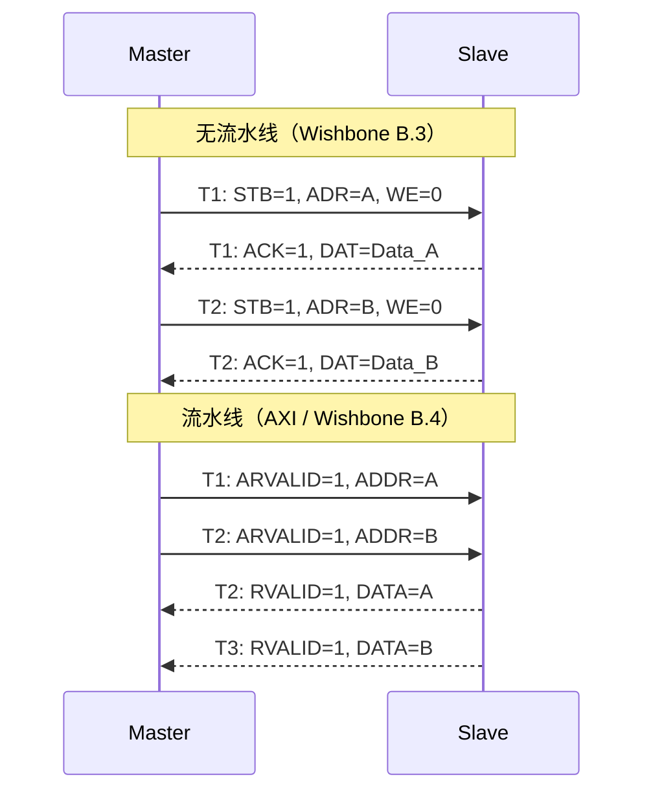
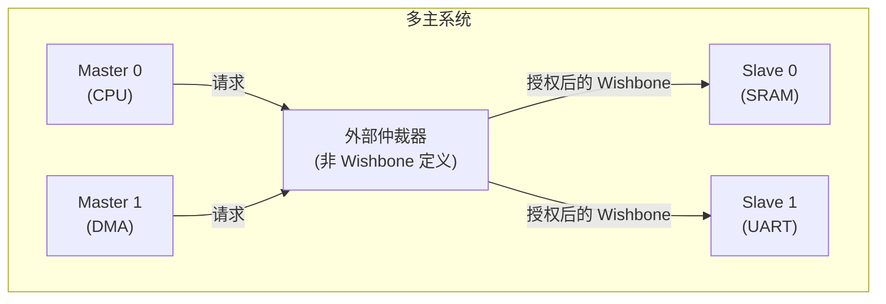
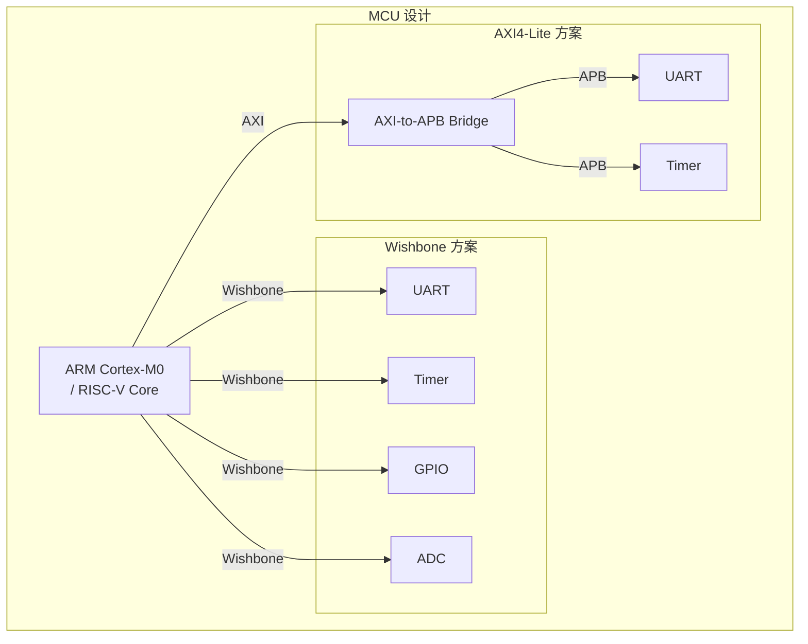

# Wishbone为什么简单——设计哲学与限制

<span class="badge-b">[B]</span> <span class="badge-i">[I]</span> <span class="badge-e">[E]</span> <span class="badge-m">[M]</span>

<span class="red">Wishbone 的"简单"不是妥协，而是一种明确的设计选择——用有限的功能集覆盖最大的应用场景，让"任何人"都能实现正确的总线接口。</span>

---

## 核心定义与价值

### <strong>Wishbone 的设计哲学</strong>

OpenCores 在定义 Wishbone 时，遵循三个核心原则。

<br>

| 原则 | Wishbone 实现 | 反例（AXI） |
|------|--------------|-------------|
| 最小功能集 | 只做读写 + 握手 | 分离式通道、乱序、QoS、Region、Lock |
| 无全局状态 | 每个 Slave 独立响应 | 需要 Interconnect 维护全局事务表 |
| 信号语义单一 | 每个信号只做一件事 | 同一信号在不同阶段含义变化（AxADDR  reused） |

<br>

<span class="blue">这种设计哲学的代价是性能上限，收益是实现的确定性。</span><br>
在 FPGA 和教学场景中，确定性比峰值性能更有价值。

---

## 核心机制原理解析

### <strong>1. 无流水线 = 单周期完成</strong>

<span class="red">Wishbone B.3 没有流水线概念——每个事务从发起（STB）到完成（ACK）是原子的。</span>

<br>



<br>

无流水线的影响：

- <span class="green">优点</span>：Slave 无需维护事务队列，状态机极简<br>
- <span class="green">缺点</span>：总线带宽利用率低，ACK 等待期间总线空闲<br>

<span class="blue">Wishbone 的理论最大带宽 = 数据宽度 × 频率 / 2（每两周期完成一次事务）。</span><br>
相比 AXI 的 1 事务/周期（流水线满时），Wishbone 的带宽只有 AXI 的 50%（假设相同数据宽度）。

### <strong>2. 无仲裁 = 单主（多主需外部仲裁器）</strong>

<span class="red">Wishbone 协议本身不定义多主仲裁，这是它最简单也最被诟病的地方。</span>

<br>



<br>

仲裁器不在 Wishbone 规范中的原因：

- OpenCores 认为仲裁策略（轮询/优先级/公平）是系统级决策，不应由总线协议规定<br>
- 仲裁器通常需要与具体应用场景耦合（实时系统 vs 通用系统）<br>
- 保持规范精简，让仲裁作为独立 IP 开发

<span class="blue">实际影响：每个多主 Wishbone 系统都需要自定义仲裁器，增加了集成复杂度。</span>

### <strong>3. 无 QoS / 无乱序 = 天然保序</strong>

| 特性 | Wishbone | AXI |
|------|----------|-----|
| 事务顺序 | 严格保序（单通道） | 同 ID 保序，不同 ID 可乱序 |
| QoS | 无 | AxQoS[3:0] 支持优先级 |
| 响应标识 | 无（单事务完成即响应） | RID/BID 匹配请求 |
| 窄传输 | 通过 SEL_I 部分写入 | WSTRB + 数据拼接 |
| 非对齐 | Master 拆分多次传输 | 硬件支持（AxADDR + AxSIZE） |

<br>

<span class="blue">Wishbone 的"无"不是缺失，而是"不需要"。</span><br>
在单主、低速、确定性访问的场景中，QoS 和乱序排序是多余的复杂性。

---

## 技术教学与实战

### <strong>与 AXI 的 PPA 量化对比</strong>

基于同一 FPGA 平台（Xilinx Artix-7 xc7a100t）的综合结果。

<br>

| 指标 | Wishbone B.3 | AXI4-Lite | 比例 |
|------|--------------|-----------|------|
| LUT 数量 | ~150 | ~800 | 1:5.3 |
| FF 数量 | ~80 | ~400 | 1:5 |
| 最大频率 | 300 MHz | 250 MHz | 1.2x |
| 单事务吞吐 | 150 MT/s | 250 MT/s | 0.6x |
| 有效带宽（64-bit） | 1.2 GB/s | 2.0 GB/s | 0.6x |

<br>

<span class="blue">Wishbone 的面积是 AXI4-Lite 的约 1/5，但有效带宽只有 60%。</span><br>
这个比例在低成本 FPGA 和 ASIC 中非常有吸引力——面积比带宽更稀缺。

### <strong>开源初心：任何人都能实现</strong>

以下是一个极简 Wishbone Slave 的完整实现，仅 30 行 Verilog：

```verilog
module wb_minimal_slave (
    input         CLK_I, RST_I,
    input  [31:0] ADR_I,
    input  [31:0] DAT_I,
    output [31:0] DAT_O,
    input         WE_I, STB_I, CYC_I,
    input  [3:0]  SEL_I,
    output reg    ACK_O
);
    reg [31:0] mem [0:15];  // 16 words
    wire [3:0] addr = ADR_I[5:2];
    wire       active = CYC_I & STB_I;
    wire [31:0] wmask = {{8{SEL_I[3]}}, {8{SEL_I[2]}},
                         {8{SEL_I[1]}}, {8{SEL_I[0]}}};
    reg [31:0] rdata;

    always @(posedge CLK_I) begin
        if (RST_I) ACK_O <= 0;
        else begin
            ACK_O <= active;  // 单周期完成
            if (active & WE_I)
                mem[addr] <= (mem[addr] & ~wmask) | (DAT_I & wmask);
        end
    end

    always @(posedge CLK_I)
        if (active & ~WE_I) rdata <= mem[addr];

    assign DAT_O = rdata;
endmodule
```

<br>

<span class="blue">这个 30 行的 Slave 实现了：寄存器映射存储、字节选择写入、单周期读写、复位初始化。</span><br>
同样的功能用 AXI4-Lite 需要 150+ 行（含地址对齐、响应编码、窄传输处理）。

---

## 嵌入式专属实战场景

### <strong>场景：为 MCU 选择总线——Wishbone vs AXI</strong>

假设你在设计一个 Cortex-M0 级别的 MCU，核心频率 50 MHz，外设包括 UART、Timer、GPIO、ADC。

<br>



<br>

决策分析：

| 考量 | Wishbone 方案 | AXI 方案 |
|------|--------------|----------|
| 核心总线面积 | ~500 LUT | ~800 LUT |
| 外设 IP 可用性 | OpenCores 丰富 | ARM/第三方商业 IP |
| 学习曲线 | 低（1 天掌握） | 中（需理解通道分离） |
| 生态工具 | cocotb, LiteX | Vivado, DesignStart |
| 长期可维护性 | 依赖社区 | ARM 官方支持 |

<br>

<span class="blue">对于教学和小规模项目，Wishbone 方案的综合成本更低。</span><br>
对于需要 ARM 生态兼容的商业产品，AXI 方案更合适。

---

## 历史演进与前沿

### <strong>Wishbone 的"够用就行"哲学在新时代</strong>

<br>

| 时代 | 需求 | Wishbone 是否够用 | 替代方案 |
|------|------|-----------------|---------|
| 2000s 嵌入式 | 8/16-bit MCU | 够用 | 无 |
| 2010s FPGA SoC | 软核 + 外设 | 够用 | AXI（Xilinx/Altera 强推） |
| 2020s RISC-V | 开源生态 | 够用 | TileLink（高性能场景） |
| 2020s AI 加速器 | 高带宽 DMA | 不够 | AXI/TileLink |
| 未来 Chiplet | 片间互联 | 不够 | UCIe/CXL |

<br>

<span class="blue">Wishbone 的"甜蜜点"是：单主、低速、确定性、成本敏感的场景。</span><br>
随着系统复杂度上升，TileLink 和 AXI 逐渐取代 Wishbone，<br>
但 Wishbone 在最底层（GPIO、UART、简单寄存器控制）仍然有不可替代的位置。

---

## 本章小结

| 主题 | 核心要点 |
|------|----------|
| 设计哲学 | 最小功能集 + 无全局状态 + 信号语义单一 |
| 无流水线 | 单周期完成，带宽利用率 50% vs AXI |
| 无仲裁 | 单主默认，多主需外部仲裁器 |
| 无 QoS/乱序 | 天然保序，适合确定性场景 |
| 面积优势 | LUT 数量约为 AXI4-Lite 的 1/5 |
| 开源初心 | 30 行 Verilog 实现完整 Slave |
| 适用边界 | 单主、低速、确定性、成本敏感 |

---

## 练习

1. **分析题**：Wishbone 选择"无仲裁"的设计，列出 3 个优点和 3 个缺点。

2. **计算题**：在 100 MHz 时钟下，32-bit Wishbone B.3 和 AXI4-Lite 的理论最大带宽分别是多少？假设 AXI 流水线满负荷。

3. **设计题**：用 Verilog 写出一个 Wishbone 多主仲裁器（2 Master，轮询仲裁），连接到 1 个 SRAM Slave。

4. **对比题**：在什么情况下你会放弃 Wishbone 改用 AXI 或 TileLink？列出 3 个具体的系统指标阈值。

5. **哲学题**："够用就行"是 Wishbone 的核心设计哲学。在你的项目中，这个哲学是否适用？为什么？
