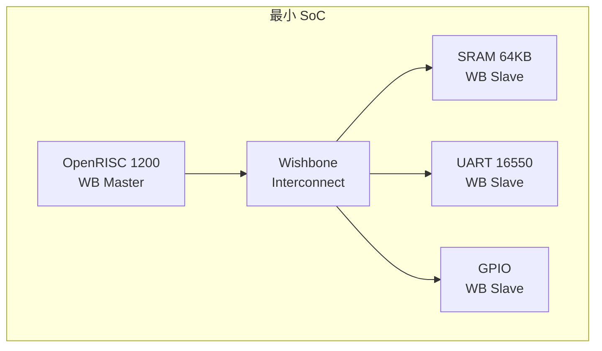

# Wishbone 实战与 FPGA 应用 [I→E]

> **本章学习目标**：
003cbr>
> - 完成一次 <span class="red">Wishbone FPGA SoC</span> 设计流程
> - 对比 <span class="red">Wishbone 与 AXI/AHB</span> 的选型逻辑
> - 了解 <span class="red">开源 Wishbone IP 生态</span>（OpenCores、LibreCores）
> - 掌握 Wishbone <span class="red">历史演进</span>与版本差异

---

<span class="blue">从何而来 → 为什么需要 → 哪里用：</span><br>
<span class="red">Wishbone 实战</span>是 FPGA 工程师的基础技能。<br>
从 <span class="green">1999 年</span> OpenCores 发布至今，Wishbone 积累了大量开源 IP 核。<br>
<span class="blue">OpenCores 网站上有 1000+ 个 Wishbone 兼容 IP（CPU、DMA、UART、SPI、以太网等），工程师可以像搭积木一样快速构建 FPGA SoC。</span><br>
如今，Wishbone 仍是 <span class="green">Lattice</span>、<span class="green">Microsemi</span> 和大学 FPGA 教学的首选总线。<br>

---

## 实战一：Wishbone FPGA SoC 设计

---

### <strong>设计目标：基于 OpenRISC 的最小 SoC</strong>

<span class="red">本实战</span>设计一个运行在 <span class="green">Lattice iCE40</span> FPGA 上的最小 SoC：<br>
* <span class="green">OpenRISC 1200</span> CPU（Wishbone Master）<br>
* <span class="green">On-chip SRAM</span> 64KB（Wishbone Slave）<br>
* <span class="green">UART 16550</span>（Wishbone Slave）<br>
* <span class="green">GPIO</span>（Wishbone Slave）<br>

<span class="blue">类比理解：Wishbone SoC 如同"乐高积木城堡"</span><br>
每个 IP 核是一块积木（Wishbone 接口是统一的凸起/凹槽）。<br>
OpenRISC CPU 是"主塔"，UART 是"城门"，SRAM 是"城墙"。<br>
工程师只需将积木按接口插在一起，无需关心每块积木内部的复杂结构。<br>



---

### <strong>Verilog 顶层连接</strong>

```verilog
// Wishbone SoC 顶层模块
module wb_soc (
  input         clk, rst,
  output        uart_tx,
  input         uart_rx,
  output [7:0]  gpio_out,
  input  [7:0]  gpio_in
);

  // 总线信号
  wire [31:0] wb_adr;
  wire [31:0] wb_dat_m2s, wb_dat_s2m;
  wire        wb_we, wb_stb, wb_cyc;
  wire        wb_ack;
  wire [3:0]  wb_sel;

  // CPU Master
  or1200_top cpu (
    .clk_i(clk), .rst_i(rst),
    .wb_adr_o(wb_adr), .wb_dat_o(wb_dat_m2s),
    .wb_dat_i(wb_dat_s2m), .wb_we_o(wb_we),
    .wb_stb_o(wb_stb), .wb_cyc_o(wb_cyc),
    .wb_ack_i(wb_ack), .wb_sel_o(wb_sel)
  );

  // Wishbone Interconnect（地址解码）
  wire ram_cyc = wb_cyc & (wb_adr[31:16] == 16'h0000);
  wire uart_cyc = wb_cyc & (wb_adr[31:16] == 16'h1000);
  wire gpio_cyc = wb_cyc & (wb_adr[31:16] == 16'h2000);

  // 读数据选择
  assign wb_dat_s2m = ram_cyc ? ram_dat :
                      uart_cyc ? uart_dat :
                      gpio_cyc ? gpio_dat : 32'h0;
  assign wb_ack     = ram_cyc ? ram_ack :
                      uart_cyc ? uart_ack :
                      gpio_cyc ? gpio_ack : 1'b0;

  // SRAM Slave
  wb_ram #(.SIZE(64*1024)) ram (
    .clk_i(clk), .rst_i(rst),
    .adr_i(wb_adr[15:0]), .dat_i(wb_dat_m2s),
    .dat_o(ram_dat), .we_i(wb_we),
    .stb_i(ram_cyc), .ack_o(ram_ack),
    .sel_i(wb_sel)
  );
endmodule
```

---

## 对比：Wishbone 与 AXI/AHB

---

### <strong>FPGA 场景下的选型逻辑</strong>

| 维度 | Wishbone | AHB-Lite | AXI4-Lite |
| --- | --- | --- | --- |
| 信号数量 | ~10 | ~15 | ~30 |
| LUT 消耗 | ~50 | ~80 | ~200 |
| 开源 IP 数量 | 1000+ | 中等 | 较少 |
| FPGA 厂商支持 | Lattice/Microsemi | ARM/主流 | Xilinx/Intel |
| 时序裕量 | Registered 友好 | 流水线复杂 | 多通道复杂 |
| 学习曲线 | 平缓 | 中等 | 陡峭 |

<span class="blue">关键结论：小规模 FPGA SoC 选 Wishbone，大规模 ARM 生态选 AXI，中等规模选 AHB-Lite。</span><br>

---

## 开源 Wishbone 生态

---

### <strong>OpenCores 与 LibreCores</strong>

<span class="red">Wishbone</span> 的开源生态主要依托两个平台：<br>

| 平台 | 特点 | 代表 IP |
| --- | --- | --- |
| OpenCores | 最老牌，IP 数量多 | OpenRISC、UART 16550、SPI |
| LibreCores | 新一代，质量审查 | PicoRV32、Serv、FuseSoC |

<span class="blue">FuseSoC 是 LibreCores 推出的 SoC 构建工具，支持 Wishbone 和 AXI，可自动生成仿真和综合脚本。</span><br>

---

### <strong>常用 Wishbone IP 核清单</strong>

| IP 名称 | 功能 | 来源 |
| --- | --- | --- |
| OpenRISC 1200 | 32-bit RISC CPU | OpenCores |
| mor1kx | 改进版 OpenRISC | OpenCores |
| UART 16550 | 兼容 16550 串口 | OpenCores |
| SPI Master | QSPI Flash 控制器 | OpenCores |
| ETH MAC 10/100 | 以太网控制器 | OpenCores |
| VGA/LCD 控制器 | 显示控制器 | OpenCores |
| AC97 控制器 | 音频控制器 | OpenCores |

---

## 历史演进：Wishbone B1 到 B4

---

### <strong>版本演进脉络</strong>

<span class="red">Wishbone</span> 已演进 4 个主要版本：<br>

| 版本 | 年份 | 核心变化 |
| --- | --- | --- |
| B1 | 1999 | 初始版本，Classic 时序 |
| B2 | 2001 | 增加 Registered 时序 |
| B3 | 2002 | 增加流水线传输 |
| B4 | 2010 | 增加突发传输（CTI/BTE） |

<span class="blue">当前主流使用 B3/B4，B1 仅用于最简单的 ASIC 设计。</span><br>

---

## 本章小结

| 概念 | 一句话总结 |
| --- | --- |
| OpenRISC | OpenCores 开源 32-bit RISC 处理器，Wishbone Master |
| Wishbone Interconnect | 地址解码 + 读数据选择 + ACK 合并 |
| OpenCores | 最老牌开源 IP 平台，1000+ Wishbone IP |
| LibreCores | 新一代开源平台，FuseSoC 构建工具 |
| FuseSoC | SoC 构建工具，自动生成仿真/综合脚本 |
| 选型逻辑 | FPGA 小 SoC 选 Wishbone，ARM 生态选 AXI |

---

## 练习

1. 在 Lattice iCE40 上实现一个 Wishbone SoC：OpenRISC + SRAM + UART，计算所需 LUT 数量。<br>
2. 对比 Wishbone B3 流水线传输和 AHB 两级流水线，说明信号复杂度的差异。<br>
3. 如果你要设计一个面向教学的 FPGA SoC，选择 Wishbone 还是 AXI？说明教育价值。
