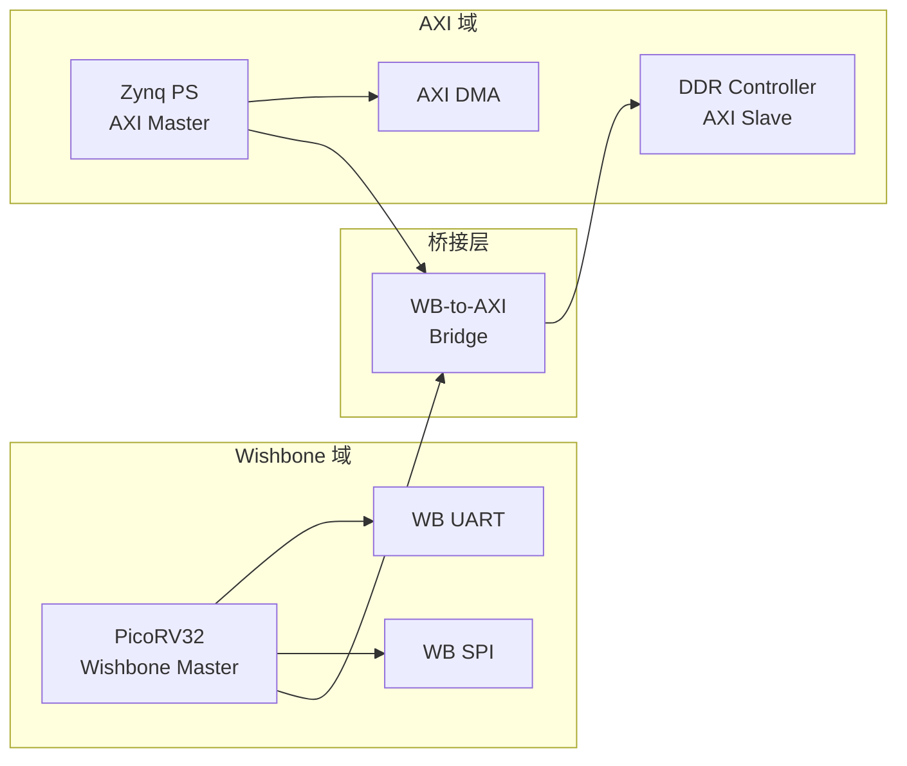
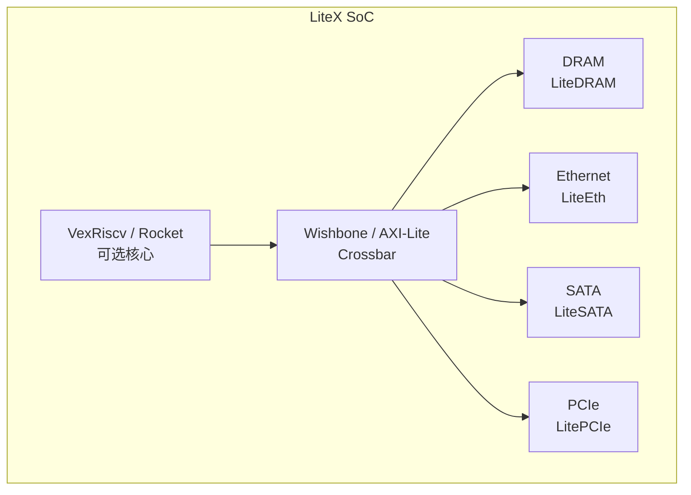
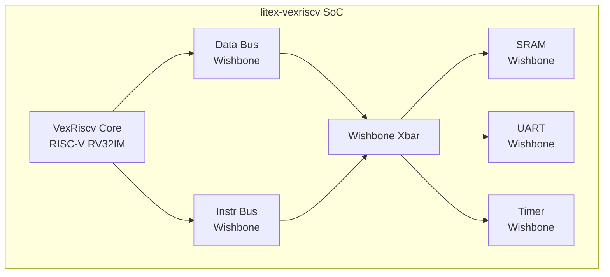

# Wishbone往哪去——FPGA 实战与开源生态

<span class="badge-b">[B]</span> <span class="badge-i">[I]</span> <span class="badge-e">[E]</span> <span class="badge-m">[M]</span>

<span class="red">Wishbone 的未来不在于挑战 AXI/TileLink 的高性能领地，而在于巩固其"最小可用开源总线"的生态位，并与现代开源工具链深度融合。</span>

---

## 核心定义与价值

### <strong>OpenCores IP 库：Wishbone 的核心资产</strong>

OpenCores 提供了数百个 Wishbone 兼容的开源 IP 核，这是 Wishbone 生态的最大护城河。

<br>

| IP 类别 | 典型核 | 功能 | 状态 |
|---------|--------|------|------|
| 串口 | UART 16550 | 兼容 16550 寄存器 | 成熟 |
| 存储 | WB SDRAM Ctrl | SDRAM 控制器 | 成熟 |
| 显示 | VGA Ctrl | 800x600  framebuffer | 成熟 |
| 网络 | Ethernet MAC | 10/100 Mbps | 可用 |
| 音频 | AC97 Ctrl | 音频编解码器接口 | 可用 |
| 加密 | AES Core | AES-128/256 硬件加速 | 可用 |

<br>

<span class="blue">这些 IP 核的共同特点：Wishbone 接口、Verilog/VHDL 源码、BSD/GPL 许可证。</span><br>
开发者可以直接下载、仿真、综合、修改，无需任何授权费用。

---

## 核心机制原理解析

### <strong>1. Wishbone-to-AXI 桥接</strong>

<span class="red">在现代 FPGA SoC 中，Wishbone 和 AXI 经常共存，桥接器成为刚需。</span>

<br>



<br>

桥接器的实现要点：

- <span class="green">写事务</span>：Wishbone 单周期写 → AXI AW+W+B 三阶段<br>
  桥接器缓存写数据，分派到 AXI 的地址和数据通道

- <span class="green">读事务</span>：Wishbone 读请求 → AXI AR 通道<br>
  等待 AXI R 通道返回后，通过 Wishbone ACK 传递数据

- <span class="green">宽度转换</span>：Wishbone 32-bit ↔ AXI 64-bit<br>
  需要字节对齐和数据拼接逻辑

### <strong>2. LiteX：Wishbone 的现代继承者</strong>

<span class="green">LiteX</span> 是 Enjoy-Digital（Florent Kermarrec）开发的开源 SoC 构建框架。

<br>



<br>

LiteX 对 Wishbone 的态度：

- 默认使用 <span class="green">Wishbone</span> 作为轻量级互连<br>
- 高性能模块（DRAM、PCIe）使用 <span class="green">AXI</span> 或 <span class="green">native</span> 接口<br>
- 自动生成桥接器，无需手动适配<br>

<span class="blue">LiteX 证明了一个趋势：Wishbone 不会消失，但会退守到"控制面"（寄存器访问），而"数据面"（高带宽传输）由更现代的协议接管。</span>

---

## 技术教学与实战

### <strong>cocotb 验证环境中的 Wishbone</strong>

cocotb 是 Python 驱动的硬件验证框架，可以与任意 HDL 仿真器配合。

```python
# cocotb Wishbone Master BFM（Bus Functional Model）
import cocotb
from cocotb.triggers import RisingEdge, Timer

class WishboneMaster:
    def __init__(self, dut, prefix="wb"):
        self.clk = getattr(dut, f"{prefix}_clk_i")
        self.rst = getattr(dut, f"{prefix}_rst_i")
        self.adr = getattr(dut, f"{prefix}_adr_i")
        self.dat_w = getattr(dut, f"{prefix}_dat_i")
        self.dat_r = getattr(dut, f"{prefix}_dat_o")
        self.we = getattr(dut, f"{prefix}_we_i")
        self.stb = getattr(dut, f"{prefix}_stb_i")
        self.cyc = getattr(dut, f"{prefix}_cyc_i")
        self.sel = getattr(dut, f"{prefix}_sel_i")
        self.ack = getattr(dut, f"{prefix}_ack_o")

    async def write(self, addr, data, sel=0xF):
        await RisingEdge(self.clk)
        self.cyc.value = 1
        self.stb.value = 1
        self.adr.value = addr
        self.dat_w.value = data
        self.we.value = 1
        self.sel.value = sel
        # 等待 ACK
        while not self.ack.value:
            await RisingEdge(self.clk)
        # 撤销
        self.cyc.value = 0
        self.stb.value = 0
        self.we.value = 0
        return True

    async def read(self, addr):
        await RisingEdge(self.clk)
        self.cyc.value = 1
        self.stb.value = 1
        self.adr.value = addr
        self.we.value = 0
        while not self.ack.value:
            await RisingEdge(self.clk)
        data = int(self.dat_r.value)
        self.cyc.value = 0
        self.stb.value = 0
        return data

# 测试用例
@cocotb.test()
async def test_wb_sram(dut):
    wb = WishboneMaster(dut)
    # 复位
    dut.wb_rst_i.value = 1
    await Timer(100, units='ns')
    dut.wb_rst_i.value = 0
    await RisingEdge(dut.wb_clk_i)

    # 写入测试模式
    await wb.write(0x00, 0xDEADBEEF)
    await wb.write(0x04, 0xCAFEBABE)

    # 读取验证
    r0 = await wb.read(0x00)
    r1 = await wb.read(0x04)
    assert r0 == 0xDEADBEEF
    assert r1 == 0xCAFEBABE
```

<br>

<span class="blue">cocotb 的 Wishbone BFM 让验证效率提升 10 倍以上——用 Python 写测试向量，用 Verilator/VCS 跑仿真。</span><br>
这是 Wishbone 生态现代化的重要标志。

---

## 嵌入式专属实战场景

### <strong>场景：Lattice iCE40 + LiteX + Wishbone 完整流程</strong>

<br>

```bash
# 1. 安装 LiteX
pip install litex

# 2. 生成 iCE40 SoC（含 Wishbone 总线）
python -m litex_boards.targets.lattice_ice40up5k_evn \
    --cpu-type=vexriscv \
    --integrated-sram-size=8192 \
    --build

# 3. 生成的 RTL 结构
ls build/lattice_ice40up5k_evn/gateware/
# └── top.v          # 顶层 Verilog
#     ├── vexriscv   # RISC-V 核心
#     ├── wishbone   # Wishbone 互连
#     ├── uart       # Wishbone UART
#     ├── timer      # Wishbone Timer
#     └── spi_flash  # Wishbone SPI

# 4. 综合与布局布线
nextpnr-ice40 --up5k --json build/lattice_ice40up5k_evn/gateware/top.json \
    --pcf lattice_ice40up5k_evn.pcf --asc top.asc

# 5. 烧录
iceprog top.asc
```

<br>

**资源报告：**

```
Info: Device utilisation:
Info:          ICESTORM_LC:  2304/ 5280    43%
Info:          ICESTORM_RAM:     8/   30    26%
Info:                 SB_IO:    24/   96    25%
Info:                 SB_GB:     8/    8   100%
```

<br>

<span class="blue">LiteX 自动生成的 Wishbone SoC 在 iCE40 UP5K 上仅占用 43% LUT，剩余空间可添加自定义加速器。</span>

---

## 历史演进与前沿

### <strong>Wishbone 的未来：被 LiteX 总线吸收？</strong>

<br>

| 方向 | 可能性 | 分析 |
|------|--------|------|
| 保持独立 | 中 | OpenCores 生态仍在，经典 IP 丰富 |
| 被 LiteX 吸收 | 高 | LiteX 已实际取代 OpenCores 成为新中心 |
| 与 TileLink 融合 | 低 | 两者定位不同，互补而非替代 |
| 向 AXI 迁移 | 中 | Xilinx/Intel FPGA 生态的压力 |
| 成为 RISC-V 标准 | 低 | RISC-V 社区更倾向 TileLink |

<br>

<span class="blue">最可能的发展路径：Wishbone 作为"寄存器总线"继续存在，LiteX 框架提供现代化的集成体验，高带宽数据面由 AXI/TileLink 接管。</span><br>
对于学习和低成本项目，Wishbone + LiteX 组合将在未来 5-10 年保持活力。

### <strong>向 litex-vexriscv 的迁移</strong>

<span class="green">litex-vexriscv</span> 是目前最活跃的 Wishbone + RISC-V 组合。

<br>



<br>

迁移优势：

- VexRiscv 核心面积比 Rocket Chip 小 50%<br>
- Wishbone 互连比 TileLink 更简单，综合更快<br>
- LiteX 自动生成设备树和启动固件<br>
- 完整的 GCC 工具链支持

---

## 本章小结

| 主题 | 核心要点 |
|------|----------|
| OpenCores 生态 | 数百个免费 Wishbone IP（UART/SPI/SDRAM/VGA） |
| FPGA 应用 | Lattice iCE40 / ECP5 + PicoRV32/VexRiscv |
| AXI 桥接 | WB-to-AXI 桥接器实现跨域互连 |
| cocotb 验证 | Python BFM + Verilator，验证效率 10x 提升 |
| LiteX 框架 | 现代 SoC 生成器，Wishbone 作为默认轻量总线 |
| 未来趋势 | Wishbone 退守"控制面"，数据面由 AXI/TileLink 接管 |

---

## 练习

1. **实践题**：从 OpenCores 下载一个 Wishbone UART IP，在 Icarus Verilog 中仿真，验证其寄存器读写时序。

2. **设计题**：设计一个 Wishbone-to-AXI4-Lite 桥接器的状态机，画出从 Wishbone 读请求到 AXI 读响应的完整状态转换图。

3. **分析题**：LiteX 为什么选择同时支持 Wishbone 和 AXI 两种互连？从架构设计角度分析这种"双总线"策略的利弊。

4. **对比题**：在 cocotb 和 UVM 两种验证方法中，分别写出一个 Wishbone Slave 的读写测试，比较代码量和调试便利性。

5. **预测题**：5 年后（2030 年），Wishbone 还会在哪些场景中被使用？列出至少 3 个场景并说明理由。
