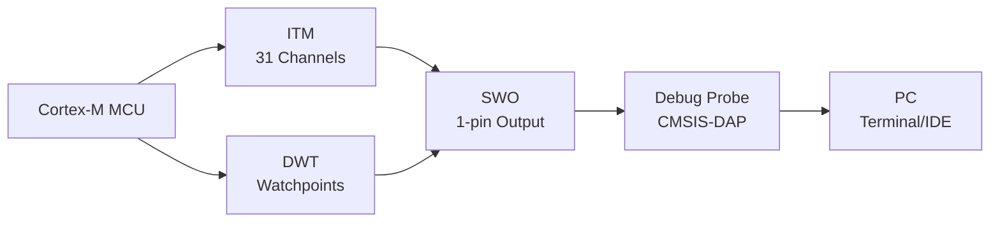

# ITM 与 DWT 调试 [E]

> **本章学习目标**：
> - 理解 <span class="red">ITM 数据包格式</span> 的 header + payload 结构与编码规则
> - 掌握 DWT 观察点的地址/数据/PC 匹配配置
> - 了解 DWT 性能计数器的使用场景与统计方法

---


---

## 需求分析：为什么需要 ITM 与 DWT

---

### <strong>为什么 ITM 与 DWT 成为行业刚需</strong>

<span class="red">ITM 与 DWT</span>解决了 MCU 调试中的资源与实时性痛点。传统 printf 调试依赖 UART，占用至少两根引脚且波特率有限；软件断点在时序敏感的嵌入式系统中会破坏实时性。
<br>

<span class="blue">为何选择 ITM/DWT：DWT 提供硬件观察点与性能计数器，零开销监控内存访问与指令周期；ITM 通过 SWO 单线输出 31 路虚拟通道日志，不占用 UART 引脚，且支持 printf 与 RTT 级实时性。</span>
<br>


### <strong>ITM/SWO 数据通道</strong>



## ITM 数据包格式

---

### <strong>ITM 协议层</strong>

<span class="badge-e">E</span><br>
<span class="red">ITM（Instrumentation Trace Macrocell）</span> 的数据包采用紧凑的变长编码，通过 SWO 引脚串行输出。<br>

<span class="blue">ITM 包如同"压缩信封"——信封上标注类型（Header），里面装的东西（Payload）可多可少，取决于你寄的是明信片（1 字节）还是挂号信（4 字节）。</span><br>

**表 3-1：ITM 包 Header 编码**

| Header 格式 | 类型 | Payload 长度 | 说明 |
| --- | --- | --- | --- |
| 0b0SSSXXXX | 软件源（端口 SSS） | 1/2/4 Byte | XXXX ≠ 0，SSS=端口 1~7 |
| 0b00000000 | 协议保留 | — | 填充/对齐 |
| 0b1000000T | 硬件源：时间戳 | 1~5 Byte | T=类型（0=本地，1=全局） |
| 0b1000001T | 硬件源：溢出 | 0 Byte | 缓冲区溢出事件 |
| 0b1000010T | 硬件源：PC 采样 | 4 Byte | 周期性 PC 值 |
| 0b1000011T | 硬件源：异常事件 | 2 Byte | 进入/退出异常 |
| 0b1000100T | 硬件源：DWT 数据 | 1~4 Byte | DWT 观察点匹配 |

<span class="orange"><strong>1. 软件源包结构</strong></span><br>
* Header：1 Byte，高 bit=0，bit[6:4]=端口号，bit[3:0]=大小编码。
* Payload：1/2/4 Byte，由 bit[3:0] 决定（0x1=1B, 0x2=2B, 0x4=4B）。
* ITM 端口 0 通常用于 printf 输出，端口 31 用于 RTOS 事件追踪。

```c
示例：向端口 0 发送 4 Byte 数据 0x12345678
Header = 0b00000100 = 0x04  (端口0, 4 Byte)
Payload = 0x78 0x56 0x34 0x12  (小端序)
完整包 = [0x04] [0x78] [0x56] [0x34] [0x12]
```

---

## DWT 观察点

---

### <strong>数据观察点配置</strong>

<span class="badge-e">E</span><br>
<span class="red">DWT（Data Watchpoint and Trace）</span> 提供 4 组比较器，可配置为地址匹配、数据匹配或 PC 采样。<br>

**表 3-2：DWT 比较器功能**

| 功能 | 配置值 | 触发条件 | 用途 |
| --- | --- | --- | --- |
| 数据地址 | FUNCTION=1/2/3 | 读/写/读写匹配 | 内存访问监控 |
| 数据值 | FUNCTION=4~11 | 数据值+地址匹配 | 变量值追踪 |
| PC 采样 | FUNCTION=12~14 | 周期性 PC 捕获 | 热点分析 |
| 中断事件 | FUNCTION=15 | 异常进入/退出 | 中断延迟测量 |

<span class="orange"><strong>2. 观察点配置代码</strong></span><br>

```c
// DWT 数据观察点配置
// 文件：dwt_watchpoint.c

#define DWT_BASE        0xE0001000
#define DWT_CTRL        (DWT_BASE + 0x000)
#define DWT_COMP0       (DWT_BASE + 0x020)
#define DWT_MASK0       (DWT_BASE + 0x024)
#define DWT_FUNCTION0   (DWT_BASE + 0x028)

// 监控全局变量 g_sensor_data 的写入
extern uint32_t g_sensor_data;

void DWT_Watchpoint_Init(void) {
    // 使能 DWT
    CoreDebug->DEMCR |= CoreDebug_DEMCR_TRCENA_Msk;
    DWT->CTRL |= DWT_CTRL_CYCCNTENA_Msk;
    
    // 配置比较器 0：地址匹配
    DWT->COMP[0] = (uint32_t)&g_sensor_data;
    DWT->MASK[0] = 0;   // 精确匹配 4 Byte
    
    // FUNCTION = 2：数据写匹配，触发 ITM 事件
    DWT->FUNCTION[0] = 0x402;  // DATAVSIZE=Word, DATAVMATCH=0, FUNCTION=2
}
```

<span class="orange"><strong>3. PC 采样配置</strong></span><br>
* DWT->COMP[0] 不设置地址（全 0）。
* DWT->FUNCTION[0] = 0xC（PC 采样，每 1024 个时钟采样一次）。
* DWT->CTRL 的 POSTCNT/POSTPRESET 配置采样周期。

---

## 性能计数

---

### <strong>DWT 性能计数器</strong>

<span class="badge-e">E</span><br>
<span class="red">DWT 性能计数器</span> 提供 CPU 周期计数、 Folded 指令计数、 LSU 操作计数、睡眠周期计数和分支开销计数。<br>

**表 3-3：DWT 计数器寄存器**

| 寄存器 | 地址偏移 | 功能 | 事件 |
| --- | --- | --- | --- |
| CYCCNT | 0x004 | 32-bit 周期计数器 | CPU 时钟周期 |
| CPICNT | 0x008 | CPI 计数器 | 每条指令额外周期 |
| EXCCNT | 0x00C | 异常计数器 | 异常开销周期 |
| SLEEPCNT | 0x010 | 睡眠计数器 | 睡眠周期（/16） |
| LSUCNT | 0x014 | LSU 计数器 | Load/Store 开销 |
| FOLDCNT | 0x018 | Folded 指令计数 | 零周期指令数 |

<span class="orange"><strong>4. 性能分析代码</strong></span><br>

```c
// DWT 性能计数器使用
// 文件：dwt_perf.c

void DWT_Performance_Start(void) {
    // 使能 DWT
    CoreDebug->DEMCR |= CoreDebug_DEMCR_TRCENA_Msk;
    DWT->CTRL |= DWT_CTRL_CYCCNTENA_Msk;
    
    // 重置所有计数器
    DWT->CYCCNT = 0;
    DWT->CPICNT = 0;
    DWT->EXCCNT = 0;
    DWT->SLEEPCNT = 0;
    DWT->LSUCNT = 0;
    DWT->FOLDCNT = 0;
    
    // 使能所有计数器
    DWT->CTRL |= DWT_CTRL_CPIEVTENA_Msk
               | DWT_CTRL_EXCEVTENA_Msk
               | DWT_CTRL_SLEEPEVTENA_Msk
               | DWT_CTRL_LSUEVTENA_Msk
               | DWT_CTRL_FOLDEVTENA_Msk;
}

void DWT_Performance_Stop(uint32_t *results) {
    results[0] = DWT->CYCCNT;   // 总周期
    results[1] = DWT->CPICNT;   // CPI 开销
    results[2] = DWT->EXCCNT;   // 异常开销
    results[3] = DWT->LSUCNT;   // LSU 开销
    results[4] = DWT->FOLDCNT;  // 折叠指令数
}

// 使用示例
uint32_t perf[5];
DWT_Performance_Start();
critical_function();  // 被测函数
DWT_Performance_Stop(perf);
printf("Cycles: %lu, CPI: %lu, LSU: %lu\n", perf[0], perf[1], perf[3]);
```

<span class="blue">DWT 计数器如同汽车仪表盘——CYCCNT 是"总里程"，CPICNT 是"油耗"，LSUCNT 是"刹车次数"，综合判断程序运行效率。</span><br>

---

## 本章小结

| 小节 | 核心要点 |
| --- | --- |
| ITM 数据包格式 | 变长编码，Header 标识端口/类型/长度，Payload 小端序，端口 0 用于 printf |
| DWT 观察点 | 4 组比较器，地址/数据/PC 匹配，FUNCTION 寄存器配置触发条件 |
| 性能计数 | CYCCNT/CPICNT/EXCCNT/SLEEPCNT/LSUCNT/FOLDCNT 六类计数器，DWT_CTRL 使能 |

---

## 练习

1. **包解析**：给定 ITM 原始字节流 `0x04 0x41 0x42 0x43 0x44 0x84 0x01 0x02`。解析每个包的类型、端口、payload 含义。

2. **观察点设计**：配置 DWT 观察点，当全局变量 `threshold` 的值从 0 变为非 0 时触发 ITM 事件。写出完整的寄存器配置序列。

3. **性能分析**：某函数执行后 DWT 读数：CYCCNT=10000, CPICNT=2000, LSUCNT=1500, FOLDCNT=500。计算有效 CPI 并分析可能的优化方向。


---

## 历史演进与发展趋势

<span class="red">ITM</span>（Instrumentation Trace Macrocell）与 DWT（Data Watchpoint and Trace）是 ARM Cortex-M 系列引入的轻量级调试组件。DWT 最早出现在 Cortex-M3（2004 年）中，提供硬件断点、数据观察点与性能计数器。ITM 随后加入，允许通过软件写入寄存器输出 printf 风格的调试信息，无需占用 UART 资源。2010 年代，ITM 与 DWT 的组合使 MCU 开发者能在无串口引脚的情况下完成实时日志输出与性能剖析。CMSIS-DAP 调试器的普及进一步降低了 ITM/SWO 单线跟踪的使用门槛。这一发展历史反映了嵌入式调试从重型工具向轻量级方案演进的趋势。
<br>

<span class="blue">未来趋势：ITM 与 DWT 将继续在 Cortex-M33/M55 等新一代 MCU 中标配；与 TrustZone 安全扩展的协同调试也在成为新的需求场景。</span>
<br>