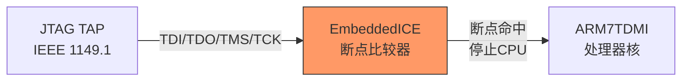
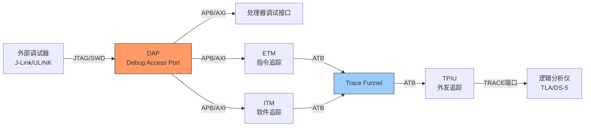

# CoreSight历史演进

<span class="badge-e">[Expert]</span>

<span class="red">CoreSight</span>是ARM定义的片上调试与追踪架构，定义了从MCU调试到SoC级追踪的完整规范族。
<br>
从早期的EmbeddedICE到今天的CoreSight SoC-400，ARM调试架构的演进映射了嵌入式系统从单核到多核、从裸机到Linux的复杂化历程。
<br>

---

## <strong>从EmbeddedICE到CoreSight SoC-400</strong>

### <strong>EmbeddedICE：ARM7/9时代的调试基石</strong>

<span class="red">EmbeddedICE</span>是ARM7TDMI和ARM9系列处理器内置的调试逻辑。
<br>
它通过JTAG接口（IEEE 1149.1）提供断点设置、单步执行和寄存器访问能力。
<br>
EmbeddedICE的断点单元使用<span class="green">比较器</span>监控地址总线，当PC值匹配时触发断点。
<br>



EmbeddedICE的局限：
<br>
- 仅支持2个硬件断点（受比较器数量限制）
<br>
- 无法追踪程序流（只能停止-检查-继续）
<br>
- 调试逻辑集成在处理器核内，无法复用于其他核
<br>

<span class="blue">关键认知：EmbeddedICE的"处理器内嵌调试"模式是简单高效的，但当SoC包含多个异构核时，每个核都复制一套调试逻辑变得不可接受。
</span><br>

### <strong>CoreSight的诞生：调试架构的平台化</strong>

<span class="green">CoreSight</span>在2004年随ARM11系列推出，核心理念是<span class="red">"调试逻辑与处理器解耦"</span>。
<br>
CoreSight将调试组件抽象为可复用的IP，通过标准的<span class="green">ATB（AMBA Trace Bus）</span>互联。
<br>

| 组件类别 | 代表 | 功能 |
|----------|------|------|
| 调试访问端口 | DAP（Debug Access Port） | 将外部JTAG/SWD转换为内部APB访问 |
| 处理器调试 | debug logic | 断点、观察点、单步 |
| 追踪源 | ETM, ITM, STM | 程序流追踪、软件事件、系统事件 |
| 追踪缓冲 | ETB, TPIU | 片上缓冲或外发追踪 |
| 追踪漏斗 | FUNNEL | 多路追踪源复用 |
| 交叉触发 | CTI, CTM | 多核/多组件间的触发同步 |



<span class="blue">关键认知：CoreSight的架构创新在于"调试总线"（APB/ATB）——调试组件像外设一样挂在总线上，可以被独立配置、组合和扩展。
</span><br>

### <strong>CoreSight SoC-400：多核时代的调试平台</strong>

<span class="green">CoreSight SoC-400</span>是ARM在2010年前后推出的旗舰调试架构，专为复杂SoC设计。
<br>
SoC-400的关键增强：
<br>
- 支持<span class="green">多核交叉触发（CTI/CTM）</span>——一个核断点命中可以同步停止其他核
<br>
- 支持<span class="green">系统级追踪（STM）</span>——追踪总线事件（如DMA传输、中断分发）
<br>
- 支持<span class="green">嵌入式跟踪缓冲（ETB）</span>——片上SRAM缓存追踪数据
<br>

---

## <strong>ETM/ITM/PTM：三类追踪源的演进</strong>

### <strong>ETM：嵌入式跟踪宏单元</strong>

<span class="green">ETM（Embedded Trace Macrocell）</span>是ARM最经典的指令流追踪组件。
<br>
ETM通过监控处理器的取指地址和流水线状态，压缩输出程序执行轨迹。
<br>

ETM的版本演进：
<br>
| 版本 | 处理器 | 追踪能力 |
|------|--------|----------|
| ETM7 | ARM7/9 | 指令地址追踪，4位压缩 |
| ETM9 | ARM9 | 添加数据追踪 |
| ETMv3 | Cortex-A8/A9 | 程序流追踪+数据追踪 |
| ETMv4 | Cortex-A53/A57 | 64位支持，更高级压缩 |
| ETE | Cortex-A78/X2 | 与ARMv9架构同步 |

ETM的压缩原理：<br>
- 顺序执行不输出地址（通过离线重建）
<br>
- 仅输出分支目标地址和异常入口
<br>
- 压缩率可达<span class="blue">10:1 到 100:1</span>
<br>

### <strong>ITM：仪器化跟踪宏单元</strong>

<span class="green">ITM（Instrumentation Trace Macrocell）</span>是Cortex-M系列的软件追踪利器。
<br>
与ETM的"被动观察"不同，ITM允许软件主动"printf式"输出调试信息。
<br>

```c
// ITM 软件追踪示例（Cortex-M）
// 使用 ITM_SendChar 输出调试信息到SWO端口

#include "core_cm4.h"  // CMSIS头文件

// ITM端口0输出字符（类似printf）
static inline void ITM_SendChar_Port0(uint8_t ch) {
    // ITM->PORT[0] 是 stimulus port 0
    // 当调试器连接时，数据通过SWO引脚输出
    if (((ITM->TCR & ITM_TCR_ITMENA_Msk) != 0UL) &&
        ((ITM->TER[0] & 1UL) != 0UL)) {
        ITM->PORT[0].u8 = ch;
    }
}

// 调试输出函数（替代printf，零开销当调试器未连接时）
void debug_printf(const char *fmt, ...) {
    char buf[128];
    va_list args;
    va_start(args, fmt);
    vsnprintf(buf, sizeof(buf), fmt, args);
    va_end(args);
    
    for (int i = 0; buf[i] != '\0'; i++) {
        ITM_SendChar_Port0(buf[i]);
    }
}

// 使用示例
void sensor_read_task(void) {
    int16_t temp = read_temperature_sensor();
    debug_printf("Temp=%d.%d°C at tick=%lu\n",
                 temp / 10, abs(temp) % 10,
                 HAL_GetTick());
}
```

<span class="blue">关键认知：ITM的精妙之处在于"零开销条件输出"——当调试器未连接时，ITM_SendChar的检查在几纳秒内失败返回，不会阻塞系统。
</span><br>

### <strong>PTM：程序跟踪宏单元与ETM的合并</strong>

<span class="green">PTM（Program Trace Macrocell）</span>是为Cortex-A系列设计的追踪组件，功能与ETM类似但针对超标量流水线优化。
<br>
从ARMv7架构开始，PTM的功能被并入ETMv3.5/ETMv4，PTM作为独立产品逐步退出。
<br>

---

## <strong>为什么需要片上调试架构</strong>

### <strong>软件调试的物理边界</strong>

<span class="red">嵌入式系统的调试面临物理约束</span>——当芯片封装在设备内部，没有屏幕、没有键盘、没有网络时，如何理解系统行为？
<br>
CoreSight架构通过以下方式突破物理边界：<br>
1. <span class="green">JTAG/SWD接口</span>：仅需4-5根线即可连接外部调试器
<br>
2. <span class="green">SWO（Serial Wire Output）</span>：仅需1根线即可输出追踪数据
<br>
3. <span class="green">ETB（Embedded Trace Buffer）</span>：无需外部引脚，片上缓存追踪数据后批量读取
<br>

| 调试场景 | 物理约束 | CoreSight解决方案 |
|----------|----------|-------------------|
| 封装后调试 | 无法接触芯片引脚 | 预留测试点或连接器 |
| 高温环境 | 调试器无法工作 | ETB缓存，事后读取 |
| 实时系统 | 断点破坏时序 | ETM追踪，非侵入式观察 |
| 低功耗模式 | 调试器连接增加功耗 | 离线ETB，批量上传 |
| 多核系统 | 单核调试干扰其他核 | CTI交叉触发，同步控制 |

<span class="blue">关键认知：CoreSight不是"让调试更方便"，而是"让调调试成为可能"——在物理约束和资源约束下，CoreSight是嵌入式系统可维护性的基础设施。
</span><br>

---

## <strong>历史演进：ARM调试架构二十年</strong>

### <strong>从单核断点到系统级追踪</strong>

| 年代 | 技术 | 代表 | 关键能力 |
|------|------|------|----------|
| 1990s | EmbeddedICE | ARM7TDMI | JTAG断点，2个硬件断点 |
| 2000s | ETM7/ETM9 | ARM9系列 | 指令流追踪，4位压缩 |
| 2004 | CoreSight v1 | ARM11 | 调试逻辑与核解耦，ATB总线 |
| 2005 | ETMv3 | Cortex-A8 | 程序流+数据追踪 |
| 2008 | CoreSight SoC-400 | Cortex-A9 | 多核交叉触发，系统追踪 |
| 2010 | ITM/DWT | Cortex-M3 | 软件printf，数据观察点 |
| 2012 | ETMv4 | Cortex-A53 | 64位支持，高级压缩 |
| 2015 | CoreSight SoC-600 | ARMv8-A | 系统IP追踪，安全调试 |
| 2020 | ETE | Cortex-A78 | ARMv9追踪，SPE融合 |
| 2025+ | CoreSight未来 | 下一代 | AI加速调试，云调试 |

<span class="blue">演进逻辑：ARM调试架构从"处理器附属品"演进到"SoC基础设施"——调试组件的独立性和互连性让复杂SoC的可观察性成为可能。
</span><br>

---

## <strong>本章小结</strong>

| 要点 | 内容 |
|------|------|
| EmbeddedICE | ARM7/9内嵌调试，JTAG接口，2个硬件断点 |
| CoreSight架构 | 调试逻辑与处理器解耦，ATB/APB总线互联 |
| ETM | 指令流追踪，压缩输出，版本从ETM7到ETEv4 |
| ITM | 软件主动追踪，Cortex-M的"零开销printf" |
| 多核调试 | CTI/CTM交叉触发，同步停止多核 |
| SoC-400 | 复杂SoC调试平台，系统级追踪 |

## <strong>练习</strong>

1. 为什么CoreSight选择将调试逻辑从处理器核内移到独立的SoC组件中？这种架构在功耗、面积和可扩展性方面各有什么优劣？
2. ETM的指令流压缩追踪是如何工作的？为什么顺序执行不需要输出地址？在什么情况下压缩率会显著下降？
3. 在一个包含Cortex-A72应用核和Cortex-M4实时核的异构SoC中，如何设计CoreSight调试架构以满足"应用核Linux调试"和"实时核硬实时追踪"的双重需求？

---

## <strong>学习路径</strong>

- <span class="badge-e">[Expert]</span> CoreSight的精髓在于"可观察性架构"——理解DAP/ETM/ITM/CTI的分工与协作，是掌握嵌入式系统调试的关键。
- <span class="purple">扩展阅读：ARM CoreSight SoC-400技术参考手册、ARM调试接口架构规范ADIv5/ADIv6、CMSIS-DAP开源调试器源码。
</span><br>