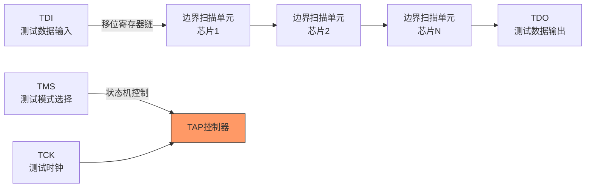
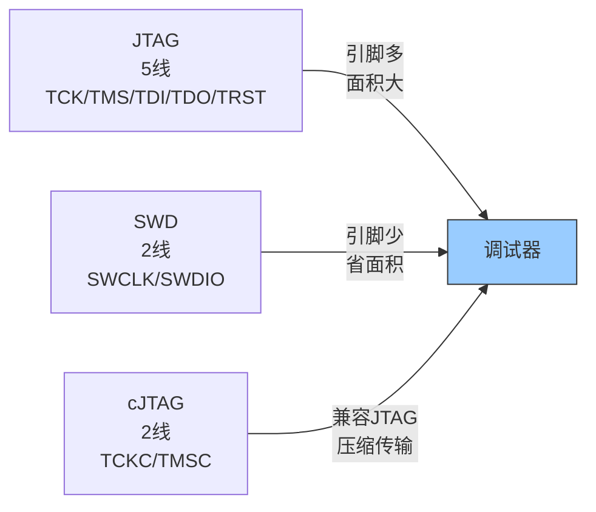
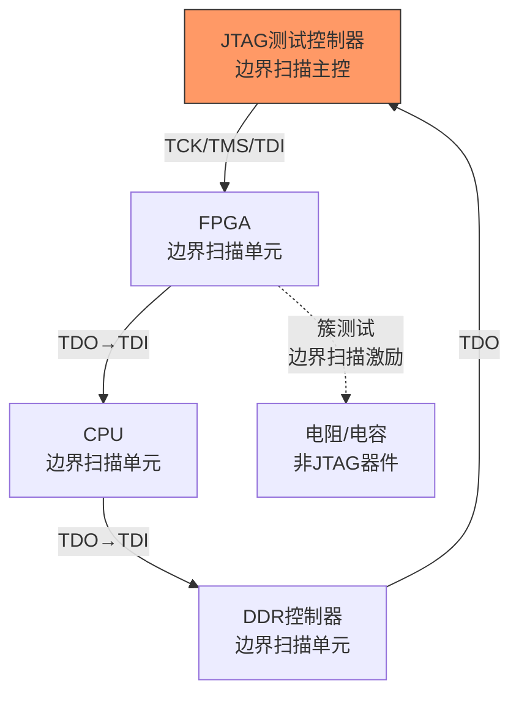

# JTAG历史演进与替代方案

<span class="badge-i">[Intermediate]</span> <span class="badge-e">[Expert]</span>

<span class="red">JTAG</span>（Joint Test Action Group）是电子行业最基础的边界扫描和调试接口标准。
<br>
从1990年IEEE 1149.1标准发布到今天的cJTAG、IJTAG和SWD竞争，JTAG用5根线统治了芯片测试和调试领域三十余年。
<br>
然而，引脚数量的限制、新兴调试需求和系统级测试的复杂度正推动替代方案的发展。
<br>
理解JTAG从IEEE 1149.1到cJTAG/IJTAG的演进、与SWD的竞争格局，以及边界扫描的未来方向，是掌握现代芯片调试生态的前提。
<br>

---

## <strong>从IEEE 1149.1到cJTAG：标准的三十年演进</strong>

### <strong>IEEE 1149.1：边界扫描的诞生</strong>

<span class="red">IEEE 1149.1</span>（Standard Test Access Port and Boundary-Scan Architecture）1990年发布。
<br>
它的初衷是解决<strong>高密度封装芯片的可测试性</strong>问题——当BGA封装的焊球在封装底部无法接触时，传统的探针测试不再可行。
<br>
JTAG通过在每个I/O引脚旁边插入<strong>边界扫描单元（Boundary Scan Cell）</strong>，将引脚状态串行移入移出，实现了无需物理探针的"虚拟接触"。
<br>



JTAG的5个标准信号：
<br>
| 信号 | 方向 | 功能 |
|------|------|------|
| TCK | 输入 | 测试时钟 |
| TMS | 输入 | 测试模式选择（TAP状态机） |
| TDI | 输入 | 测试数据输入 |
| TDO | 输出 | 测试数据输出 |
| TRST | 输入 | 测试复位（可选） |

<span class="blue">关键认知：JTAG的核心创新不是物理接口，而是<strong>TAP状态机</strong>——16个状态的有序转移让单一接口承载了测试、调试、编程等多种功能。</span><br>

### <strong>IEEE 1149.7：cJTAG的压缩革命</strong>

<span class="green">cJTAG</span>（compact JTAG，IEEE 1149.7）2009年发布，将JTAG从5线压缩到<strong>2线</strong>（TCKC + TMSC）。
<br>
cJTAG的压缩原理是在单根数据线上通过时分复用传输TMS和TDI信息，同时支持双向数据传输。
<br>

| 特性 | IEEE 1149.1 | IEEE 1149.7 (cJTAG) |
|------|-------------|---------------------|
| 信号线数 | 4-5线 | 2线 |
| 引脚开销 | 大（小型封装负担重） | 小（节省60%引脚） |
| 传输模式 | 串行移位 | 串行+突发（类DDR） |
| 多核支持 | 有限 | 原生支持（Star-2拓扑） |
| 功耗 | 较高（TCK持续运行） | 较低（可门控时钟） |
| 兼容性 | 原始标准 | 向后兼容1149.1 |

<span class="blue">关键认知：cJTAG的价值在于"引脚即成本"——对于引脚数小于32的MCU封装，节省2-3个引脚可能意味着选用更便宜的封装或增加2-3个可用GPIO。</span><br>

### <strong>IEEE 1687：IJTAG的内部仪器革命</strong>

<span class="green">IEEE 1687</span>（IJTAG，Internal JTAG）2014年发布，是边界扫描架构的重大演进。
<br>
IJTAG允许通过"仪器化网络"动态配置扫描路径——芯片内部的测试和调试仪器可以按需接入或旁路。
<br>

| 标准 | 年代 | 核心能力 | 局限 |
|------|------|----------|------|
| IEEE 1149.1 | 1990 | 固定边界扫描链 | 无法访问内部仪器 |
| IEEE 1500 | 2005 | 可测试性核心包装 | 仅针对IP核 |
| IEEE 1687 | 2014 | 动态扫描路径配置 | 配置复杂度 |
| IEEE 1149.10 | 2018 | 高速边界扫描 | 带宽有限 |

<span class="blue">关键认知：IJTAG（1687）让边界扫描从"测试I/O"扩展到"访问片上仪器"——这对于包含成百上千个内部传感器的现代SoC至关重要。</span><br>

---

## <strong>JTAG与SWD的竞争：调试接口的双寡头</strong>

### <strong>ARM SWD的崛起</strong>

<span class="red">SWD</span>（Serial Wire Debug）是ARM在Cortex-M系列中力推的2线调试接口。
<br>
SWD仅使用<strong>SWCLK + SWDIO</strong>两根线，在功能上完全替代了JTAG的调试能力。
<br>



JTAG vs SWD的竞争格局：
<br>
| 维度 | JTAG | SWD | cJTAG |
|------|------|-----|-------|
| 信号线 | 5（4必需+1可选） | 2 | 2 |
| 边界扫描 | 原生支持 | 不支持 | 原生支持 |
| 调试能力 | 完整 | 完整（ARM专用） | 完整 |
| 菊花链 | 支持（TDI→TDO串联） | 不支持 | 支持（Star-2） |
| 厂商支持 | 全行业 | ARM生态主导 | 德州仪器主导 |
| 多核调试 | 通过菊花链 | 通过DAP多AP选择 | 通过Star拓扑 |
| 典型应用 | FPGA, 复杂SoC | Cortex-M MCU | 低引脚MCU |

<span class="blue">关键认知：SWD不是"比JTAG更好"，而是"比JTAG更适合ARM Cortex-M"——在引脚受限、无需边界扫描、单核为主的场景中，SWD是更务实的选择。</span><br>

### <strong>为什么ARM力推SWD</strong>

ARM推动SWD而非JTAG的根本原因是<strong>Cortex-M的市场定位</strong>。
<br>
Cortex-M系列面向低成本、低引脚数的MCU市场（从16引脚到100+引脚）。
<br>
对于32引脚以下的封装，5线JTAG意味着15%的引脚被调试功能占用，这在成本敏感的市场不可接受。
<br>

```c
// SWD 协议层操作示例（概念性伪代码）
// SWD通过"请求-确认-数据"三阶段传输

// SWD请求头格式（8位）：
// [Start=1][APnDP][RnW][A[2:3]][A[2:3]][Parity][Stop=0][Park=1]
//  APnDP: 0=DP(Debug Port), 1=AP(Access Port)
//  RnW: 0=Write, 1=Read
//  A[2:3]: 寄存器地址位[2:3]

// 发送SWD请求帧
typedef struct {
    uint8_t start    : 1;  // 固定为1
    uint8_t apndp    : 1;  // 0=DP, 1=AP
    uint8_t rnw      : 1;  // 0=Write, 1=Read
    uint8_t addr_hi  : 2;  // 地址[3:2]
    uint8_t addr_lo  : 2;  // 地址[3:2]重复（奇偶校验的一部分）
    uint8_t parity   : 1;  // APnDP ^ RnW ^ addr_hi 的奇偶校验
    uint8_t stop     : 1;  // 固定为0
    uint8_t park     : 1;  // 固定为1
} SwdRequest;

// 读取DAP IDR寄存器（DP寄存器0x0的读操作）
// 请求头: 0b1_0_1_00_00_1_0_1 = 0xA5
// SWDIO方向: 主机输出请求头(8个时钟)，输入确认+数据(33个时钟)
```

<span class="blue">关键认知：SWD协议的精妙之处在于"Park位"——主机在传输结束时主动驱动SWDIO为高，确保总线进入已知状态，防止总线冲突。</span><br>

---

## <strong>边界扫描的未来：从测试到系统级应用</strong>

### <strong>为什么边界扫描不会消失</strong>

尽管SWD在MCU调试领域侵蚀了JTAG的市场份额，但边界扫描在以下领域不可替代：
<br>
| 应用场景 | 技术实现 | 价值 |
|----------|----------|------|
| 板级测试 | 通过JTAG链访问板上所有芯片 | 无需测试夹具 |
| 在系统编程 | 通过JTAG烧录Flash/FPGA | 生产简化 |
| 故障诊断 | 读取芯片边界状态定位开路/短路 | 现场维修 |
| 安全启动 | JTAG作为信任根的一部分 | 供应链安全 |
| 功能验证 | 通过边界扫描注入测试向量 | 覆盖率提升 |

### <strong>系统级测试中的JTAG角色扩展</strong>

现代PCB的复杂度使得传统ICT（In-Circuit Test）失效——BGA封装、高密过孔和多层板让物理探针无法接触。
<br>
JTAG边界扫描成为<strong>唯一可行的非侵入式板级测试手段</strong>：
<br>
- 通过JTAG链读取所有芯片的边界状态，检测开路、短路和虚焊
<br>
- 通过"互连测试"（Interconnect Test）验证板上走线的连通性
<br>
- 通过"簇测试"（Cluster Test）测试非JTAG器件（如电阻、电容）
<br>



<span class="blue">关键认知：边界扫描的应用早已超越芯片测试，演变为"板级ICT替代方案"——在5G基站、服务器主板等高密度PCB中，JTAG测试是生产良率保障的最后一道关卡。</span><br>

### <strong>安全领域的新挑战</strong>

JTAG的安全风险日益凸显：攻击者可以通过JTAG接口读取芯片固件、绕过安全启动、注入恶意代码。
<br>
现代芯片的JTAG安全机制：
<br>
| 机制 | 实现 | 效果 |
|------|------|------|
| 熔丝锁定 | 烧断JTAG熔丝永久禁用 | 不可逆 |
| 密码保护 | JTAG访问前需输入密码 | 可恢复 |
| 安全调试 | 仅允许特定认证调试器 | 可控 |
| 生命周期管理 | 生产/调试/出厂阶段不同权限 | 分阶段 |

<span class="blue">关键认知：JTAG的双刃剑特性——它是开发者的利器，也是攻击者的通道。现代芯片设计必须在"调试便利性"和"安全性"之间做出权衡。</span><br>

---

## <strong>历史演进：调试接口的四十五年</strong>

### <strong>从探针到片上调试的范式转移</strong>

| 年代 | 技术 | 代表 | 关键演进 |
|------|------|------|----------|
| 1980s | 物理探针 | 逻辑分析仪 | 接触式测试 |
| 1990 | IEEE 1149.1 | 边界扫描 | 无需物理接触 |
| 1995 | 处理器JTAG | ARM7 EmbeddedICE | 调试+测试统一接口 |
| 2000 | cJTAG研究 | 德州仪器 | 2线压缩JTAG |
| 2004 | ARM SWD | Cortex-M3 | 2线ARM专用调试 |
| 2009 | IEEE 1149.7 | cJTAG标准 | 2线标准化 |
| 2014 | IEEE 1687 | IJTAG | 动态扫描路径 |
| 2020+ | 云调试 | ARM DSTREAM | 远程调试，追踪分析 |
| 2025+ | 无线调试 | 研究阶段 | 消除物理连接器 |

<span class="blue">演进逻辑：调试接口从"测试专用"演进到"调试+测试+编程"通用接口，再演进到"引脚最小化"和"功能内部化"——趋势是调试逻辑越来越嵌入芯片，外部接口越来越精简。</span><br>

---

## <strong>本章小结</strong>

| 要点 | 内容 |
|------|------|
| IEEE 1149.1 | 5线JTAG，TAP状态机，边界扫描 |
| cJTAG | IEEE 1149.7，2线压缩，向后兼容 |
| IJTAG | IEEE 1687，动态扫描路径，片上仪器访问 |
| SWD | ARM 2线调试，SWCLK+SWDIO，Cortex-M主流 |
| 竞争格局 | JTAG（全行业）vs SWD（ARM生态）vs cJTAG（TI生态） |
| 边界扫描未来 | 板级ICT替代、安全启动、系统级测试 |
| 安全挑战 | JTAG熔丝锁定、密码保护、生命周期管理 |
| 未来趋势 | 引脚最小化、无线调试、云调试 |

## <strong>练习</strong>

1. JTAG的TAP状态机有16个状态，为什么需要这么多状态？请画出TAP状态机的核心状态转移路径，并解释每个状态的功能。
2. SWD相比JTAG在物理层上减少了3根信号线，这种减少带来了哪些功能上的牺牲？在多核调试场景中，SWD如何弥补菊花链功能的缺失？
3. 假设你正在设计一款48引脚的Cortex-M4 MCU，需要同时支持SWD调试和边界扫描测试。如何在引脚复用和成本之间做权衡？请给出具体的引脚分配方案，并分析安全调试机制的设计。

| 题目 | 考查点 | 难度 |
|------|--------|------|
| 1 | TAP状态机设计原理，状态转移路径 | Intermediate |
| 2 | SWD协议架构，多核调试方案 | Intermediate |
| 3 | MCU引脚规划，调试安全机制 | Expert |

---

## <strong>学习路径</strong>

- <span class="badge-i">[Intermediate]</span> 从JTAG的TAP状态机和边界扫描原理入手，用开源工具（OpenOCD）实践芯片编程和调试。
<br>
- <span class="badge-e">[Expert]</span> 深入研究SWD协议细节、DAP架构、IJTAG动态扫描路径配置，以及JTAG安全调试机制。
<br>
- <span class="purple">扩展阅读：IEEE 1149.1-2013标准、ARM SW-DP规范、OpenOCD源码中的SWD驱动实现、IEEE 1687（IJTAG）标准文档。
</span><br>