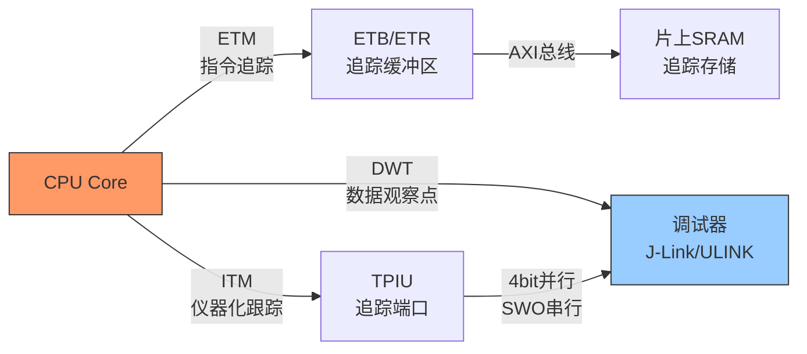

# 调试与跟踪专用总线

[Intermediate] [Master]

调试与跟踪专用总线是嵌入式开发者的"X光"和"显微镜"——它们让不可见的芯片内部状态变得可观测、可控制。
 
从JTAG的边界扫描到SWD的串行调试，从CoreSight的片上跟踪到ETM的程序流追踪，这些协议定义了芯片调试和系统分析的完整工具链。
 
理解调试接口的协议细节、工具生态和选型约束，是高效嵌入式开发的必备技能。
 

---

## <strong>本类别总线总览</strong>

| 总线 | 信号线数 | 最大速率 | 功能范围 | 典型应用 |
|------|----------|----------|----------|----------|
| JTAG | 5（4必需+1可选） | 100MHz | 测试+调试+编程 | 芯片测试、FPGA编程、边界扫描 |
| SWD | 2 | 50MHz | 调试 | Cortex-M MCU调试 |
| cJTAG | 2 | 100MHz | 测试+调试 | 低引脚MCU |
| CoreSight | 可变 | 600MHz+ | 片上跟踪 | 程序流追踪、数据追踪 |
| ETM | 4-16 | 与CPU时钟同频 | 指令追踪 | 代码覆盖率、性能分析 |
| ITM | 1-4 | 与CPU时钟同频 | 仪器化跟踪 | printf调试、事件标记 |

---

## <strong>调试接口选型与生态</strong>

### <strong>JTAG vs SWD：如何选择</strong>

| 维度 | JTAG | SWD | cJTAG |
|------|------|-----|-------|
| 信号线 | 5 | 2 | 2 |
| 边界扫描 | 支持 | 不支持 | 支持 |
| 调试能力 | 完整 | 完整（ARM） | 完整 |
| 菊花链 | 支持 | 不支持 | 支持 |
| 厂商支持 | 全行业 | ARM生态 | TI生态 |
| 典型芯片 | FPGA, 复杂SoC | Cortex-M MCU | 低引脚MCU |
| 开源工具 | OpenOCD | OpenOCD, pyOCD | OpenOCD |

关键认知：调试接口的选型核心不是"功能最强"，而是"引脚最少够用"——对于32引脚的Cortex-M4，SWD是最佳选择；对于BGA封装的FPGA，JTAG是唯一选择。
 

### <strong>CoreSight生态系统</strong>

---

## <strong>为什么调试总线越来越重要</strong>

随着芯片复杂度指数级增长，调试和跟踪能力成为芯片设计的核心竞争力：
 
- 现代SoC包含数十个CPU核心、数百个IP模块，没有片上跟踪根本无法定位问题
 
- 软件定义汽车要求OTA更新后的故障诊断，需要远程调试能力
 
- 功能安全标准（ISO 26262）要求芯片提供故障注入和诊断接口
 

| 调试需求 | 传统方案 | 现代方案 | 演进原因 |
|----------|----------|----------|----------|
| 单步调试 | JTAG halt | SWD + 非侵入式 | 不影响实时性 |
| 代码覆盖 | 插桩 | ETM指令追踪 | 零开销 |
| 数据观察 | 断点 | DWT数据观察点 | 硬件触发 |
| 性能分析 | 软件计时 | ITM时间戳 | 纳秒级精度 |
| 远程诊断 | 无 | CoreSight + 云端 | 软件定义 |

关键认知：调试总线从"开发工具"演进到"系统基础设施"——现代芯片必须内建调试能力，否则无法满足功能安全和远程运维的要求。
 

---

## <strong>小结</strong>

| 要点 | 内容 |
|------|------|
| 调试总线 | JTAG、SWD、cJTAG、CoreSight、ETM、ITM |
| JTAG定位 | 全行业通用，5线，支持边界扫描和菊花链 |
| SWD定位 | ARM专用，2线，引脚最少 |
| CoreSight定位 | 片上跟踪系统，非侵入式分析 |
| ETM定位 | 指令级追踪，代码覆盖和性能分析 |
| 选型核心 | 引脚数 vs 功能需求 vs 芯片生态 |
| 演进趋势 | 从侵入式调试到非侵入式跟踪 |

## <strong>练习</strong>

1. 在设计一款64引脚的Cortex-M7 MCU时，需要同时支持SWD调试、JTAG边界扫描和ETM指令追踪。设计引脚分配方案，说明如何在有限引脚下满足三种调试需求。
2. CoreSight的ITM（Instrumentation Trace Macrocell）如何实现"零开销printf"？比较ITM与传统UART printf在延迟和资源占用方面的差异。
3. 为什么JTAG的安全风险日益受到关注？分析JTAG接口可能的安全攻击面，并提出至少三种防护机制。

| 题目 | 考查点 | 难度 |
|------|--------|------|
| 1 | MCU调试引脚规划 | Intermediate |
| 2 | ITM零开销跟踪原理 | Expert |
| 3 | JTAG安全攻击与防护 | Expert |

---

## <strong>学习路径</strong>

- [Intermediate] 从JTAG的TAP状态机入手，用OpenOCD实践芯片编程和边界扫描测试。
 
- [Master] 深入研究CoreSight组件（ETM、ITM、DWT、TPIU）的配置和使用，掌握非侵入式跟踪分析。
 
- 扩展阅读：IEEE 1149.1-2013标准、ARM CoreSight Technology System Design Guide、ARM ETM Architecture Specification v4.0、OpenOCD User Guide。
 
