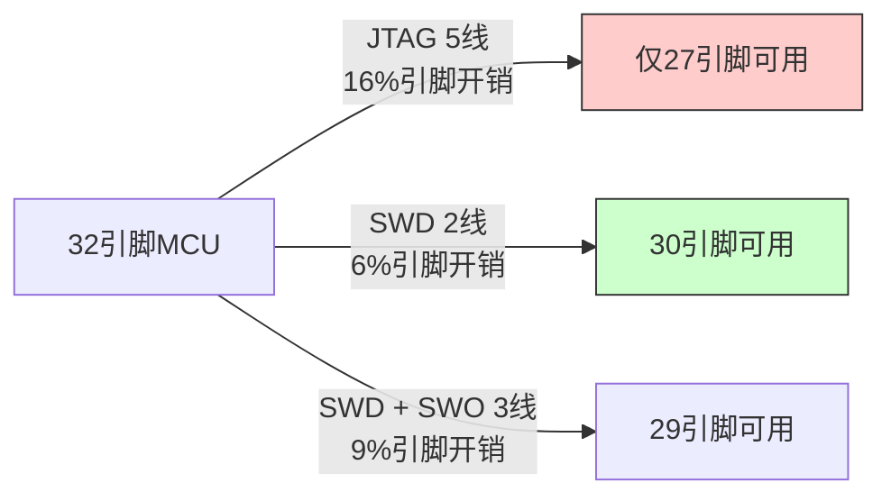
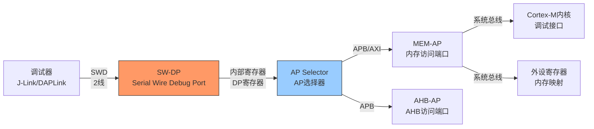

# SWD历史演进

<span class="badge-i">[Intermediate]</span> <span class="badge-e">[Expert]</span>

<span class="red">SWD</span>（Serial Wire Debug）是ARM为Cortex-M系列量身打造的2线调试接口。
<br>
从JTAG的5线瘦身到2线，SWD用极简的物理层实现了完整的调试能力，成为ARM MCU生态的事实标准。
<br>
SWD与CoreSight-DAP的配合，定义了现代嵌入式调试的"低成本、高效率"范式。
<br>

---

## <strong>ARM Serial Wire：替代JTAG的极简之路</strong>

### <strong>为什么ARM需要新的调试接口</strong>

<span class="red">ARM Cortex-M系列的定位是"低成本、低功耗、小封装"MCU。</span>
<br>
传统的5线JTAG对这类设备是沉重的负担：
<br>
- 32引脚封装中，JTAG占用5引脚意味着15%的I/O资源被调试功能占用
<br>
- 2线SWD仅占用6%的引脚，为应用功能留出更多空间
<br>
- JTAG的TDI/TDO/TMS分离设计在简单调试场景中过于冗余
<br>



<span class="blue">关键认知：SWD的设计起点不是"技术先进性"，而是"市场适应性"——ARM Cortex-M要占领8位MCU市场，必须在引脚数量上与8051/PIC竞争。
</span><br>

### <strong>SWD的物理层设计</strong>

SWD仅使用两根信号线：
<br>
| 信号 | 方向 | 功能 |
|------|------|------|
| SWCLK | 输入 | 时钟（由调试器驱动） |
| SWDIO | 双向 | 数据（请求/响应/数据） |

SWDIO的双向传输通过<span class="green">"线或"（Wired-OR）</span>机制实现：
<br>
1. 主机（调试器）发送请求时驱动SWDIO
<br>
2. 目标（MCU）发送响应时驱动SWDIO
<br>
3. 空闲时双方均释放（上拉电阻保持高电平）
<br>

```c
// SWD 位传输时序（概念性伪代码）
// 每个SWD操作由"请求期(8clk) + 周转期(1clk) + 响应期(3clk) + 数据期(32clk)"组成

// 请求阶段：主机发送8位请求头
typedef struct {
    uint8_t start : 1;   // 固定为1
    uint8_t apndp : 1;   // 0=DP(Debug Port), 1=AP(Access Port)
    uint8_t rnw   : 1;   // 0=Write, 1=Read
    uint8_t a2    : 1;   // 地址位[2]
    uint8_t a3    : 1;   // 地址位[3]
    uint8_t parity: 1;   // APnDP ^ RnW ^ A[3:2] 的奇偶校验
    uint8_t stop  : 1;   // 固定为0
    uint8_t park  : 1;   // 固定为1（主机驱动为高）
} SwdRequestHdr;

// 写操作总线事务：
// 主机发送请求(8clk) -> 周转期(1clk, 主机释放SWDIO) -> 
// 目标发送ACK(3clk) -> 周转期(1clk, 目标释放SWDIO) -> 
// 主机发送数据(32clk) -> 主机发送奇偶校验(1clk)

// 读操作总线事务：
// 主机发送请求(8clk) -> 周转期(1clk, 主机释放SWDIO) -> 
// 目标发送ACK(3clk) + 数据(32clk) + 奇偶校验(1clk)
```

<span class="blue">关键认知：SWD的"Park位"（请求头最后一位固定为1）是协议设计的关键细节——它确保主机在请求结束时主动驱动总线为高，避免总线冲突和未知状态。
</span><br>

---

## <strong>SWD与CoreSight-DAP配合</strong>

### <strong>DAP（Debug Access Port）的架构</strong>

<span class="green">DAP</span>是ARM CoreSight架构中的调试访问端口，是SWD/JTAG与内部调试总线之间的桥梁。
<br>
DAP由两部分组成：
<br>
- <span class="green">DP（Debug Port）</span>：处理外部SWD/JTAG协议，映射到内部寄存器
<br>
- <span class="green">AP（Access Port）</span>：将DP的访问转换为内部总线事务（APB/AXI）
<br>



DP的关键寄存器：
<br>
| 寄存器 | 地址 | 功能 |
|--------|------|------|
| DPIDR | 0x0 | DAP ID（标识DAP版本和能力） |
| CTRL/STAT | 0x4 | 控制和状态（调试电源、错误标志） |
| SELECT | 0x8 | AP选择和AP寄存体选择 |
| RDBUFF | 0xC | 读缓冲（优化连续读） |

<span class="blue">关键认知：DAP的"DP+AP分层"是架构优雅的体现——DP处理物理层协议（SWD/JTAG），AP处理协议层转换（到APB/AXI），两者独立演进、灵活组合。
</span><br>

### <strong>SWD访问Cortex-M调试寄存器的实战</strong>

```c
// 通过SWD访问Cortex-M4调试寄存器（概念性代码）
// 基于CMSIS-DAP/DAPLink风格伪代码

// 步骤1：读取DPIDR，确认DAP连接
// 请求：APnDP=0(DP), RnW=1(Read), A[3:2]=00
// SWD请求头：0b1_0_1_00_00_1_0_1 = 0xA5
uint32_t dpidr;
swd_read_dp(0x0, &dpidr);  // 读取DPIDR
// 期望返回值：0x2BA01477 (Cortex-M4 DAP) 或类似ID

// 步骤2：选择AP和AP寄存体
// SELECT寄存器：APSEL[31:24] | APBANKSEL[7:4]
// 选择AP0，BANK0（AP的寄存器组0）
swd_write_dp(0x8, 0x00000000);  // SELECT = AP0, BANK0

// 步骤3：通过AP读取Cortex-M DHCSR（调试控制和状态寄存器）
// DHCSR地址：0xE000EDF0（在系统总线地址空间）
// AP TAR寄存器：设置传输地址
swd_write_ap(0x0, 0xE000EDF0);  // TAR = DHCSR地址
// AP DRW寄存器：读取数据
swd_read_ap(0xC, &dhcsr);       // DRW读取DHCSR值
// DHCSR位含义：
// [0] C_DEBUGEN: 调试使能
// [1] C_HALT: 请求停止
// [2] C_STEP: 请求单步
// [16] S_REGRDY: 寄存器访问就绪
// [17] S_HALT: 已停止
// [18] S_SLEEP: 处于睡眠
// [19] S_LOCKUP: 处于锁定

// 步骤4：请求停止CPU
uint32_t new_dhcsr = 0xA05F0003;  // 密钥(0xA05F) + C_DEBUGEN(1) + C_HALT(1)
swd_write_ap(0xC, new_dhcsr);     // 写入DHCSR

// 步骤5：轮询S_HALT位，等待CPU停止
uint32_t status;
do {
    swd_read_ap(0xC, &status);
} while ((status & (1 << 17)) == 0);
printf("CPU已停止，DHCSR=0x%08X\n", status);
```

<span class="blue">关键认知：SWD调试的核心是"停止-检查-修改-继续"循环——DHCSR寄存器是这个循环的控制中枢，C_DEBUGEN位是调试的"总开关"。
</span><br>

---

## <strong>2线调试趋势：SWD的普及与扩展</strong>

### <strong>SWD的生态系统</strong>

SWD已成为ARM Cortex-M生态的事实标准：
<br>
| 调试器 | 厂商 | 支持协议 | 特点 |
|--------|------|----------|------|
| J-Link | SEGGER | SWD/JTAG/cJTAG | 高速，商业软件 |
| DAPLink | ARM/开源 | SWD | CMSIS-DAP标准，开源 |
| ST-Link | ST | SWD/JTAG | STM32标配，低成本 |
| ULINK | Keil/ARM | SWD/JTAG | Keil MDK集成 |
| Black Magic Probe | 开源 | SWD/JTAG | GDB服务器内嵌 |

<span class="green">CMSIS-DAP</span>是ARM推出的开源调试器固件标准，定义了USB-HID到SWD的协议转换。
<br>
任何符合CMSIS-DAP标准的调试器都可以被Keil MDK、IAR、OpenOCD等工具识别和使用。
<br>

### <strong>SWD的扩展：SWO和Trace</strong>

在2线SWD基础上，增加1根<span class="green">SWO（Serial Wire Output）</span>线即可实现追踪功能。
<br>
SWO使用单线异步串行协议（类似UART），输出ITM和DWT的追踪数据。
<br>

| 模式 | 信号线 | 功能 | 带宽 |
|------|--------|------|------|
| SWD | SWCLK + SWDIO | 调试读写 | ~10Mbps |
| SWD+SWO | +SWO | 调试+软件追踪 | SWO: 600kbps-12Mbps |
| SWD+SWO+TRACE | +TRACE[0:3] | 调试+指令追踪 | 4线并行追踪 |

<span class="purple">扩展阅读：SWO的曼彻斯特编码模式和NRZ模式是带宽与可靠性之间的权衡——NRZ模式带宽更高（可达12Mbps），但需要更精确的时钟同步。
</span><br>

---

## <strong>历史演进：ARM调试接口的瘦身之路</strong>

### <strong>从5线到2线的二十年</strong>

| 年代 | 接口 | 信号线 | 代表处理器 | 关键演进 |
|------|------|--------|------------|----------|
| 1995 | JTAG | 5线 | ARM7TDMI | 行业标准调试 |
| 2004 | SWD | 2线 | Cortex-M3 | ARM专有极简接口 |
| 2005 | JTAG + ETM | 5+线 | Cortex-M3 | 增加追踪 |
| 2008 | SWD + SWO | 2+1线 | Cortex-M0 | 单线追踪 |
| 2010 | cJTAG | 2线 | MSP430 | 压缩JTAG标准 |
| 2014 | SWD + Serial Wire Viewer | 2+1线 | Cortex-M4 | 高级追踪 |
| 2018 | DAPLink/CMSIS-DAP | USB→SWD | 全系列 | 开源调试器固件 |
| 2020+ | 无线调试 | BLE/WiFi | 研究阶段 | 消除物理连接 |
| 2025+ | 安全调试 | 加密SWD | ARMv8-M | 调试安全加固 |

<span class="blue">演进逻辑：ARM调试接口的演进轨迹是"功能不变、引脚减半"——从JTAG的5线到SWD的2线，再到可能的无线调试0线，每一步都在降低物理连接的代价。
</span><br>

---

## <strong>本章小结</strong>

| 要点 | 内容 |
|------|------|
| SWD信号 | SWCLK + SWDIO，2线双向传输 |
| 协议层 | 请求(8bit) + 周转(1clk) + ACK(3bit) + 数据(32bit) + 奇偶校验(1bit) |
| DAP架构 | DP（Debug Port）处理SWD协议，AP（Access Port）访问系统总线 |
| CMSIS-DAP | ARM开源调试器标准，USB-HID到SWD转换 |
| SWO扩展 | 增加1线实现ITM/DWT追踪输出 |
| 生态 | J-Link/DAPLink/ST-Link/ULINK/BMP等主流调试器 |

## <strong>练习</strong>

1. SWD协议中的"Park位"为什么固定为1？如果主机在请求结束后不主动驱动SWDIO为高，可能发生什么样的总线冲突？
2. DAP的DP（Debug Port）和AP（Access Port）是如何分工的？为什么需要AP Selector？在一个包含Cortex-M4应用核和Cortex-M0+协处理器核的SoC中，DAP架构会如何设计？
3. 比较SWD+SWO（3线）和JTAG+ETM（5+线）在调试一个运行FreeRTOS的Cortex-M4时的体验差异。在什么场景下，SWO的单线追踪能力会成为瓶颈？

---

## <strong>学习路径</strong>

- <span class="badge-i">[Intermediate]</span> 从CMSIS-DAP开源固件入手，理解SWD协议层和DAP寄存器操作。
- <span class="badge-e">[Expert]</span> 深入研究SWD时序、DAP的多AP设计、以及SWO的曼彻斯特/NRZ编码机制。
- <span class="purple">扩展阅读：ARM SW-DP规范（ARM IHI 0031A）、CMSIS-DAP源码、OpenOCD target/swd.c实现。
</span><br>
