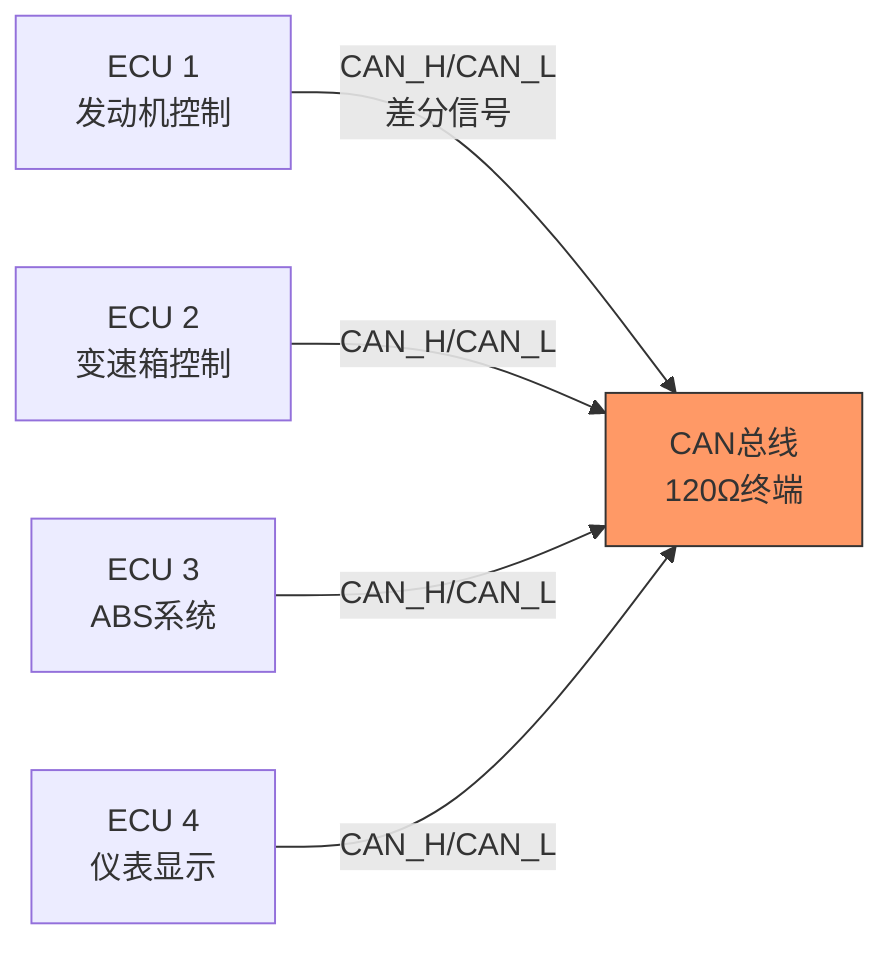
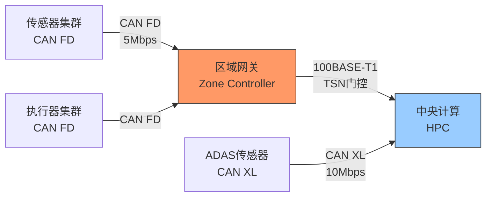

# CAN历史演进与CAN-XL

<span class="badge-i">[Intermediate]</span> <span class="badge-e">[Expert]</span>

<span class="red">CAN</span>（Controller Area Network）是汽车电子系统的神经中枢。
<br>
从1986年博世发布CAN 2.0到今天的CAN FD和CAN XL，CAN总线用三十余年的演进证明了"简单可靠"在工业通信中的持久价值。
<br>
在车载网络架构向域控制器和中央计算平台转型的时代，CAN依然在传感器和执行器通信中扮演着不可替代的角色。
<br>

---

## <strong>博世标准路线：CAN 2.0到CAN FD到CAN XL</strong>

### <strong>CAN 2.0：车载通信的奠基者</strong>

<span class="red">CAN 2.0</span>于1991年发布（ISO 11898），是CAN总线的经典形态。
<br>
其核心设计包括：
<br>
- <span class="green">多主仲裁</span>：基于优先级的非破坏性位仲裁
<br>
- <span class="green">事件触发</span>：无总线主控，任何节点可在空闲时发送
<br>
- <span class="green">错误检测</span>：CRC + 位填充 + ACK + 位监控
<br>
- <span class="green">最大速率</span>：1Mbps（ISO高速CAN）
<br>
- <span class="green">最大数据</span>：8字节/帧
<br>



CAN 2.0帧结构（标准帧）：
<br>
| 字段 | 长度 | 说明 |
|------|------|------|
| SOF | 1 bit | 帧起始（显性位） |
| 仲裁段 | 11 bit ID + RTR | 标识符 + 远程帧标志 |
| 控制段 | 6 bit | IDE, r0, DLC(4bit) |
| 数据段 | 0-8 byte | 有效载荷 |
| CRC | 15 bit + 1 bit界定 | 循环冗余校验 |
| ACK | 2 bit | 应答槽 + 应答界定 |
| EOF | 7 bit | 帧结束（隐性位） |

<span class="blue">关键认知：CAN的位仲裁是其最精妙的设计——当两个节点同时发送时，ID位较低（显性位更多）的节点赢得仲裁，高ID节点自动退避，无需重传开销。
</span><br>

### <strong>CAN FD：带宽与数据量的双重突破</strong>

<span class="green">CAN FD</span>（Flexible Data-rate）2012年发布（ISO 11898-1:2015），是CAN 2.0的升级版本。
<br>
CAN FD解决了CAN 2.0的两大痛点：
<br>
1. 数据段速率可提升到<span class="green">5Mbps</span>（甚至8Mbps），而仲裁段保持1Mbps
<br>
2. 有效载荷从8字节扩展到<span class="green">64字节</span>
<br>

| 特性 | CAN 2.0 | CAN FD |
|------|---------|--------|
| 仲裁段速率 | 最大1Mbps | 最大1Mbps |
| 数据段速率 | 1Mbps | 最大8Mbps |
| 数据长度 | 8字节 | 64字节 |
| DLC编码 | 0-8 | 0-8, 12, 16, 20, 24, 32, 48, 64 |
| CRC | CRC-15 | CRC-17（数据≤16B）或CRC-21（数据>16B） |
| 兼容性 | - | CAN FD节点可接收CAN 2.0帧 |

```c
// CAN FD 帧配置示例（基于SocketCAN/Linux）
#include <linux/can.h>
#include <linux/can/raw.h>

// CAN FD帧结构体（Linux内核定义）
struct canfd_frame {
    canid_t can_id;    // 32位CAN ID + 标志位
    __u8    len;       // 数据长度（CAN FD支持0-64）
    __u8    flags;     // CAN FD标志
    __u8    __res0;    // 保留
    __u8    __res1;    // 保留
    __u8    data[64];  // 数据缓冲区（CAN FD扩展至64字节）
} __attribute__((aligned(8)));

// 关键标志位
#define CANFD_BRS  0x01  // Bit Rate Switch：数据段使用高速率
#define CANFD_ESI  0x02  // Error State Indicator：错误被动状态标志
#define CANFD_FDF  0x04  // FD Format：CAN FD帧标志

// 创建CAN FD套接字
int create_canfd_socket(const char *ifname) {
    int s = socket(PF_CAN, SOCK_RAW, CAN_RAW);
    
    // 启用CAN FD模式
    int enable_canfd = 1;
    setsockopt(s, SOL_CAN_RAW, CAN_RAW_FD_FRAMES,
               &enable_canfd, sizeof(enable_canfd));
    
    struct ifreq ifr;
    strncpy(ifr.ifr_name, ifname, IFNAMSIZ - 1);
    ioctl(s, SIOCGIFINDEX, &ifr);
    
    struct sockaddr_can addr = {
        .can_family = AF_CAN,
        .can_ifindex = ifr.ifr_ifindex
    };
    bind(s, (struct sockaddr *)&addr, sizeof(addr));
    
    return s;
}

// 发送CAN FD帧（64字节数据，启用BRS）
void send_canfd_frame(int s, canid_t id, uint8_t *data, uint8_t len) {
    struct canfd_frame frame = {
        .can_id = id | CAN_EFF_FLAG,  // 扩展帧
        .len = len,
        .flags = CANFD_BRS | CANFD_FDF  // CAN FD + 数据段加速
    };
    memcpy(frame.data, data, len);
    
    write(s, &frame, sizeof(struct canfd_frame));
}
```

<span class="blue">关键认知：CAN FD的"双速率"设计是其核心创新——仲裁段保持低速以确保可靠性，数据段切换到高速以提升带宽，两者无缝衔接。
</span><br>

### <strong>CAN XL：面向未来的车载骨干</strong>

<span class="green">CAN XL</span>（Extra Long）2018年提出，2021年标准化（CiA 610-1），将CAN的演进推向新高度。
<br>
CAN XL的关键参数：
<br>
- 数据段速率：<span class="green">10Mbps或20Mbps</span>
<br>
- 有效载荷：<span class="green">2048字节</span>
<br>
- 帧格式：保持CAN的位仲裁，兼容CAN FD
<br>

| 规格 | CAN 2.0 | CAN FD | CAN XL |
|------|---------|--------|--------|
| 仲裁速率 | 1Mbps | 1Mbps | 1Mbps |
| 数据速率 | 1Mbps | 8Mbps | 10/20Mbps |
| 数据长度 | 8B | 64B | 2048B |
| 适用场景 | 车身控制 | 动力系统 | ADAS/域控制器 |
| 标准状态 | 成熟 | 主流 | 新兴 |

<span class="purple">扩展阅读：CAN XL的2048字节帧使其能够传输完整的以太网帧（含MAC头），这意味着CAN XL可以作为车载以太网的备份链路或低成本替代方案。
</span><br>

---

## <strong>CAN与TSN的互补：车载网络的混合架构</strong>

### <strong>为什么CAN不能被以太网完全替代</strong>

车载网络架构正向"域控制器+中央计算"演进，但CAN不会被完全淘汰。
<br>
原因如下：
<br>
| 维度 | CAN/CAN FD | 车载以太网 |
|------|------------|------------|
| 成本 | 极低（收发器<$1） | 较高（PHY+交换机） |
| 可靠性 | 内置错误检测和容错 | 依赖上层协议 |
| 确定性 | 原生优先级仲裁 | 依赖TSN门控 |
| 节点数 | 理论上无上限 | 交换机端口有限 |
| 布线 | 简单总线 | 星型/树型 |
| 功耗 | 低（睡眠模式成熟） | 较高 |
| 带宽 | CAN FD 5Mbps | 100Mbps/1Gbps |

### <strong>CAN与TSN的桥接架构</strong>

在 zone architecture（区域架构）中，CAN/CAN FD连接本地传感器和执行器，通过区域网关桥接到TSN骨干网。
<br>



<span class="blue">关键认知：CAN与以太网不是"替代"关系，而是"分层"关系——CAN负责低速高可靠的边缘通信，以太网负责高带宽的骨干传输，两者通过智能网关融合。
</span><br>

---

## <strong>历史演进：三十八年车载通信简史</strong>

### <strong>从车身控制到自动驾驶的通信需求变迁</strong>

| 年代 | 技术 | 代表应用 | 数据速率 |
|------|------|----------|----------|
| 1986 | CAN 2.0原型 | 博世内部研发 | - |
| 1991 | CAN 2.0标准化 | 车身控制模块 | 125kbps |
| 1994 | ISO 11898发布 | 动力系统CAN | 500kbps |
| 2003 | LIN补充低速场景 | 车门/座椅 | 20kbps |
| 2012 | CAN FD发布 | 新一代动力系统 | 5Mbps |
| 2015 | CAN FD标准化 | 大众/宝马采用 | 2Mbps |
| 2018 | CAN XL提出 | ADAS数据融合 | 10Mbps |
| 2021 | CAN XL标准化 | 域控制器骨干 | 20Mbps |
| 2025+ | CAN XL + TSN混合 | 中央计算架构 | 多速率协同 |

<span class="blue">演进逻辑：CAN的演进始终遵循"向后兼容的渐进增强"——CAN XL节点可以接收CAN FD和CAN 2.0帧，CAN FD节点可以接收CAN 2.0帧，这种兼容性保护了数十年的车载软件投资。
</span><br>

---

## <strong>本章小结</strong>

| 要点 | 内容 |
|------|------|
| CAN 2.0 | 经典CAN，1Mbps，8字节数据，非破坏性仲裁 |
| CAN FD | 双速率（仲裁1Mbps+数据5-8Mbps），64字节数据 |
| CAN XL | 数据段10/20Mbps，2048字节数据，兼容CAN FD |
| 仲裁机制 | ID优先级位仲裁，显性位覆盖隐性位 |
| TSN互补 | CAN负责边缘低速高可靠，以太网负责骨干高带宽 |
| 向后兼容 | CAN XL → CAN FD → CAN 2.0，向下兼容接收 |

## <strong>练习</strong>

1. CAN的非破坏性位仲裁是如何工作的？当两个节点同时发送不同ID的帧时，总线上会发生什么？请用显性位（0）和隐性位（1）的电平变化来解释仲裁过程。
2. CAN FD的"双速率"机制（仲裁段低速+数据段高速）在物理层上是如何实现的？为什么不能在仲裁段使用高速率？
3. 在一个zone architecture（区域架构）的车载网络中，如何设计CAN FD与车载以太网（100BASE-T1 + TSN）之间的网关策略？请考虑实时性、带宽和故障隔离三个维度。

---

## <strong>学习路径</strong>

- <span class="badge-i">[Intermediate]</span> 从SocketCAN实践入手，理解CAN ID过滤、错误帧处理和CAN FD双速率配置。
- <span class="badge-e">[Expert]</span> 深入研究CAN XL的帧格式、CAN与TSN网关设计、以及车载网络安全（SecOC/DTSec）。
- <span class="purple">扩展阅读：ISO 11898系列标准、CiA（CAN in Automation）规范、Bosch CAN FD/CAN XL技术白皮书、Linux SocketCAN文档。
</span><br>
