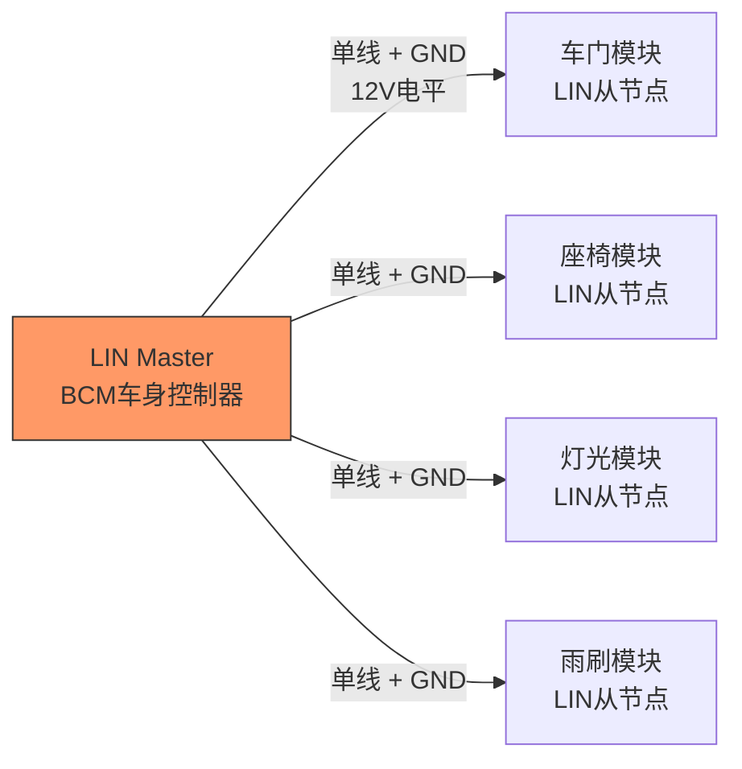
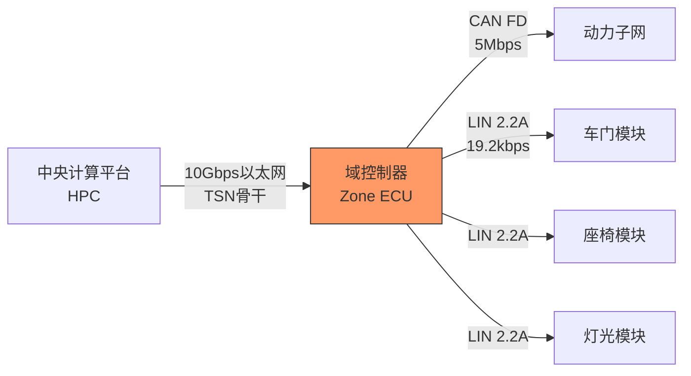

# LIN历史演进与自动驾驶

<span class="badge-b">[Beginner]</span> <span class="badge-i">[Intermediate]</span>

<span class="red">LIN</span>（Local Interconnect Network）是汽车领域最低成本的串行通信总线。
<br>
从1998年LIN 1.0发布到今天的LIN 2.2A和即将推出的LIN 3.0，LIN用单根线实现了车身控制模块的低成本互联。
<br>
在自动驾驶时代，LIN依然在车门、座椅、灯光等子系统中扮演着"低成本神经末梢"的角色。
<br>

---

## <strong>LIN从1.0到2.2A：低成本的坚持</strong>

### <strong>LIN的诞生：弥补CAN的成本缺口</strong>

<span class="red">LIN</span>由宝马、大众、奥迪、沃尔沃、戴姆勒等车企和Volcano、摩托罗拉等供应商于1998年联合制定。
<br>
其设计目标是<span class="red">"用单根线实现CAN 20%的成本"</span>。
<br>
LIN的核心简化包括：
<br>
- <span class="green">单线传输</span>：基于UART的半双工通信（不是差分信号）
<br>
- <span class="green">单主多从</span>：无需仲裁，主节点轮询从节点
<br>
- <span class="green">低成本收发器</span>：基于标准UART/SCI硬件
<br>
- <span class="green">低速率</span>：1-20kbps（典型19.2kbps）
<br>



LIN的帧结构极简：
<br>
| 字段 | 长度 | 说明 |
|------|------|------|
| 同步间隔 | 13+位显性 | 帧起始标志 |
| 同步字节 | 0x55 | 时钟同步（01010101模式） |
| PID（受保护ID） | 8位 | ID(6bit) + 奇偶校验(2bit) |
| 数据 | 0-8字节 | 有效载荷 |
| 校验和 | 8位 | 经典校验或增强校验 |

<span class="blue">关键认知：LIN的"单主轮询"架构省去了CAN复杂的位仲裁逻辑，但代价是带宽利用率低——总线空闲时从节点不能主动发送，必须等待主节点轮询。
</span><br>

### <strong>LIN版本演进</strong>

| 版本 | 年份 | 关键特性 | 现状 |
|------|------|----------|------|
| LIN 1.0 | 1998 | 初始规范 | 已淘汰 |
| LIN 1.1 | 1999 | 修正版 | 已淘汰 |
| LIN 1.2 | 1999 | 增加诊断 | 已淘汰 |
| LIN 1.3 | 2002 | 增加从节点配置 | 已淘汰 |
| LIN 2.0 | 2003 | 重大升级：诊断层、配置规范 | 过渡版本 |
| LIN 2.1 | 2006 | 增强诊断、节点配置协议 | 主流 |
| LIN 2.2 | 2010 | 错误修正 | 主流 |
| LIN 2.2A | 2016 | 最终修正版 | 当前主流 |
| LIN 3.0 | 预计2025+ | 更高速率、安全特性 | 规划中 |

<span class="blue">关键认知：LIN的版本演进极其保守——从2.0到2.2A跨越13年仅做错误修正，因为LIN的应用场景（车门、座椅、灯光）对协议变化极度敏感，任何不兼容都会导致供应商体系的混乱。
</span><br>

---

## <strong>车门/座椅/灯光控制：LIN的典型应用场景</strong>

### <strong>车门模块的LIN网络</strong>

现代汽车每个车门都是一个LIN子网：
<br>
| 节点 | 功能 | 数据方向 |
|------|------|----------|
| 主节点（车门控制器） | 集中管理 | 发送/接收 |
| 从节点1（车窗电机） | 升降控制 | 接收指令，上报状态 |
| 从节点2（门锁执行器） | 锁定/解锁 | 接收指令，上报状态 |
| 从节点3（后视镜调节） | 角度控制 | 接收指令，上报状态 |
| 从节点4（门灯） | 开关控制 | 接收指令 |

```c
// LIN主节点轮询逻辑（伪代码）
// 基于S32K/LPC等汽车MCU的LIN驱动

typedef struct {
    uint8_t id;           // LIN帧ID (0-59)
    uint8_t length;       // 数据长度 (1-8)
    uint8_t data[8];      // 数据缓冲区
    uint8_t checksum;     // 校验和
    uint16_t period_ms;   // 发送周期
} LinFrame;

// 车门LIN网络帧表
LinFrame door_lin_schedule[] = {
    {0x10, 4, {0}, 0, 50},    // 车窗位置查询 (50ms周期)
    {0x11, 2, {0}, 0, 50},    // 门锁状态查询 (50ms周期)
    {0x12, 4, {0}, 0, 100},   // 后视镜位置查询 (100ms周期)
    {0x20, 1, {0}, 0, 0},     // 车窗控制命令 (事件触发)
    {0x21, 1, {0}, 0, 0},     // 门锁控制命令 (事件触发)
};

void lin_master_task(void) {
    static uint8_t slot = 0;
    
    // 按调度表轮询从节点
    LinFrame *frame = &door_lin_schedule[slot];
    
    if (frame->period_ms == 0) {
        // 事件触发帧：检查是否有待发数据
        if (has_pending_command(frame->id)) {
            lin_send_header(frame->id);      // 发送帧头
            lin_send_response(frame);           // 发送响应（主节点发数据）
        }
    } else {
        // 周期触发帧：发送帧头，等待从节点响应
        lin_send_header(frame->id);
        if (lin_receive_response(frame)) {
            process_door_data(frame);
        }
    }
    
    slot = (slot + 1) % ARRAY_SIZE(door_lin_schedule);
}
```

<span class="blue">关键认知：LIN的"调度表"概念是其确定性保障——主节点按固定时隙轮询，每个从节点的响应延迟是可预测的，这种简单性在车身控制中恰恰是优势。
</span><br>

---

## <strong>自动驾驶时代的LIN角色</strong>

### <strong>LIN不会被淘汰，但会重新定义</strong>

自动驾驶对车载网络提出了新需求：
<br>
- 更多传感器（雷达、激光雷达、摄像头）
<br>
- 更高带宽（数Gbps）
<br>
- 更低延迟（<1ms）
<br>
- 功能安全（ASIL-D）
<br>

这些需求似乎与LIN无关——LIN的20kbps在ADAS面前不值一提。
<br>
但LIN在自动驾驶时代依然有明确角色：
<br>
| 角色 | 说明 | 趋势 |
|------|------|------|
| 执行器末梢 | 座椅/后视镜/灯光的执行控制 | 持续存在 |
| 传感器聚合 | 低成本传感器（温度、雨量）的采集 | 轻微增长 |
| 安全冗余 | 当高速网络故障时，LIN维持基本功能 | 新增需求 |
| 网关隔离 | LIN子网通过网关与骨干网隔离，提升安全 | 架构强化 |



<span class="blue">关键认知：LIN在自动驾驶时代的角色不是"被升级"，而是"被隔离"——LIN子网作为低安全等级（QM）的网络域，通过网关与高速高安全网络（ASIL-D）物理隔离，这种隔离本身就是安全设计。
</span><br>

### <strong>LIN的安全增强趋势</strong>

传统LIN没有安全机制——任何可以物理访问LIN总线的攻击者都可以模拟主节点或从节点。
<br>
AUTOSAR和LIN联盟正在推动安全扩展：
<br>
| 安全机制 | 实现方式 | 成熟度 |
|----------|----------|--------|
| 认证帧 | 基于对称密钥的MAC | 研究中 |
| 加密传输 | AES-128帧加密 | 研究中 |
| 安全引导 | 从节点固件签名验证 | 部分实现 |
| 入侵检测 | 监控异常帧时序和ID | 概念阶段 |

<span class="purple">扩展阅读：LIN 3.0规范预计将引入原生安全特性，包括认证帧和加密传输选项，但会增加收发器成本和MCU处理开销。
</span><br>

---

## <strong>历史演进：二十七年低成本的胜利</strong>

### <strong>LIN从补充到基础设施的历程</strong>

| 年代 | 事件 | 意义 |
|------|------|------|
| 1998 | LIN联盟成立 | 车企联合制定低成本标准 |
| 1999 | LIN 1.0-1.2发布 | 技术原型验证 |
| 2002 | LIN 1.3发布 | 增加配置能力 |
| 2003 | LIN 2.0发布 | 诊断层标准化 |
| 2006 | LIN 2.1发布 | 主流版本稳定 |
| 2010 | LIN 2.2发布 | 错误修正 |
| 2016 | LIN 2.2A发布 | 最终稳定版 |
| 2020 | LIN与AUTOSAR深度集成 | 软件标准化 |
| 2025+ | LIN 3.0（规划） | 安全增强，速率提升 |

<span class="blue">演进逻辑：LIN的生存之道是"成本优先的足够好"——它不做任何事比CAN更好，但它在成本维度上做到了极致，这使得任何试图替代它的技术都必须先跨越成本门槛。
</span><br>

---

## <strong>本章小结</strong>

| 要点 | 内容 |
|------|------|
| 设计目标 | 单线通信，成本为CAN的20% |
| 拓扑 | 单主多从，主节点轮询 |
| 物理层 | 单线+GND，12V电平，19.2kbps典型 |
| 帧结构 | 同步间隔+同步字节+PID+数据+校验和 |
| 版本演进 | 1.0→2.0→2.2A，变化极小，稳定性优先 |
| 自动驾驶角色 | 执行器末梢、网关隔离、安全冗余 |
| 安全趋势 | LIN 3.0预计引入认证和加密 |

## <strong>练习</strong>

1. LIN的"单主多从"架构与CAN的"多主仲裁"架构在总线利用率和故障容错方面各有什么优劣？在什么场景下LIN的架构反而更安全？
2. LIN帧的PID字段中包含2位奇偶校验，这种设计能在多大程度上防止ID传输错误？如果PID的奇偶校验失败，从节点应该如何响应？
3. 在一个zone architecture（区域架构）中，LIN子网通过区域网关连接到车载以太网骨干。如何设计网关的"安全降级"策略，使得当以太网骨干遭受网络攻击时，LIN子网仍能维持车身基本功能？

---

## <strong>学习路径</strong>

- <span class="badge-b">[Beginner]</span> 从LIN帧格式和主从轮询机制入手，用低成本MCU（如S32K144）实践车门模块通信。
- <span class="badge-i">[Intermediate]</span> 掌握LIN 2.2A诊断层（UDS on LIN）和AUTOSAR LIN Stack配置。
- <span class="purple">扩展阅读：LIN Specification Package 2.2A（LIN联盟官方）、AUTOSAR LIN驱动规范、ISO 17987（LIN标准化）。
</span><br>