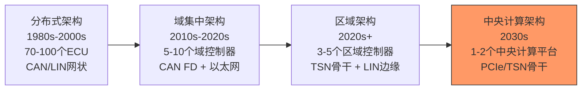

# 车载与网络互联总线

[Intermediate] [Expert]

车载与网络互联总线是汽车电子电气架构的核心通信基础设施。
 
从CAN的差分仲裁到LIN的低成本车身控制，从TSN的时间敏感调度到车载以太网的多媒体传输，这些协议定义了现代车辆的"神经系统"。
 
理解车载总线的分层架构、功能安全等级和演进方向，是设计下一代智能汽车电子架构的前提。
 
本类别覆盖五种核心总线：CAN、CAN-FD、LIN、车载以太网和TSN。
 

---

## <strong>本类别总线总览</strong>

| 总线 | 最大速率 | 拓扑 | 确定性 | 安全等级 | 典型应用 |
|------|----------|------|--------|----------|----------|
| CAN | 1Mbps | 多主总线 | 高 | ASIL-B/D | 动力、底盘、安全 |
| CAN-FD | 5Mbps | 多主总线 | 高 | ASIL-B/D | 新一代车辆网络 |
| LIN | 20kbps | 单主总线 | 中 | QM | 车门、座椅、灯光 |
| 车载以太网 | 1Gbps | 星型/Switch | 中 | ASIL-B | ADAS、信息娱乐 |
| TSN | 1Gbps+ | 星型/Switch | 极高 | ASIL-D | 确定性骨干网络 |

---

## <strong>汽车电子架构演进</strong>

### <strong>各代架构的总线组合</strong>

| 架构代际 | 骨干网络 | 域内网络 | 边缘网络 | ECU数量 |
|----------|----------|----------|----------|---------|
| 分布式 | CAN 500kbps | CAN 125kbps | LIN 19.2kbps | 70-100 |
| 域集中 | 车载以太网 100Mbps | CAN FD 2Mbps | LIN 19.2kbps | 30-50 |
| 区域架构 | TSN 1Gbps | CAN FD 5Mbps | LIN 19.2kbps | 10-20 |
| 中央计算 | TSN 10Gbps+ | PCIe/TSN | LIN 19.2kbps | 5-10 |

关键认知：汽车电子架构的演进趋势是"集中化"——计算能力从分布式ECU向中央计算平台集中，总线速率从Mbps向Gbps演进，但LIN作为低成本边缘总线始终保留。
 

---

## <strong>总线选型与功能安全</strong>

### <strong>为什么不同安全等级需要不同总线</strong>

| ASIL等级 | 适用总线 | 典型应用 | 安全机制 |
|----------|----------|----------|----------|
| ASIL-D | CAN/CAN-FD + TSN | 制动、转向、安全气囊 | CRC、ACK、冗余通道 |
| ASIL-B | CAN-FD + 车载以太网 | 车身控制、灯光 | CRC、错误计数器 |
| QM | LIN + 车载以太网 | 信息娱乐、氛围灯 | 简单校验或无 |

关键认知：LIN的QM等级不是"不安全"，而是"安全要求低"——车门、座椅的故障不会导致生命危险，因此不需要复杂的错误检测和冗余机制。这种分级设计大幅降低了成本。
 

### <strong>CAN的位仲裁机制为什么适合安全系统</strong>

CAN的核心创新是<strong>非破坏性位仲裁</strong>：当两个节点同时发送时，优先级高的消息（ID值小）自动赢得仲裁，低优先级消息在下一个总线空闲时重发。
 
这种机制确保了高优先级安全消息（如制动请求）永远不会被延迟——即使总线满载，制动消息的延迟也是有上界的。
 

| 场景 | CAN行为 | 安全意义 |
|------|---------|----------|
| 总线空闲 | 任何节点立即发送 | 最小延迟 |
| 总线忙碌 | 新消息在帧结束后仲裁 | 确定性等待 |
| 仲裁失败 | 低优先级自动后退 | 高优先级优先 |
| 错误帧 | 全局通知，自动重发 | 数据完整性 |

---

## <strong>小结</strong>

| 要点 | 内容 |
|------|------|
| 核心总线 | CAN、CAN-FD、LIN、车载以太网、TSN |
| 架构演进 | 分布式 → 域集中 → 区域架构 → 中央计算 |
| 骨干趋势 | CAN 1Mbps → CAN FD 5Mbps → TSN 10Gbps |
| 边缘保留 | LIN 19.2kbps始终存在（成本优势） |
| 安全匹配 | ASIL-D用CAN+TSN，QM用LIN |
| 选型核心 | 安全等级 vs 带宽需求 vs 成本约束 |

## <strong>练习</strong>

1. 在一个区域架构中，区域控制器需要同时连接TSN骨干（1Gbps）、CAN FD子网（5Mbps）和LIN子网（19.2kbps）。设计网关的帧转发策略，说明如何保障TSN时间敏感流的确定性。
2. 为什么CAN-FD没有完全取代CAN？从硬件兼容性、供应链和改造成本三个角度分析。
3. 比较车载以太网的100BASE-T1和传统以太网100BASE-TX在物理层上的差异。为什么汽车需要专用的物理层标准？

| 题目 | 考查点 | 难度 |
|------|--------|------|
| 1 | 多协议网关设计，TSN流量整形 | Expert |
| 2 | CAN vs CAN-FD生态分析 | Intermediate |
| 3 | 车载以太网物理层特殊性 | Intermediate |

---

## <strong>学习路径</strong>

- [Intermediate] 从CAN帧格式和位仲裁入手，理解CAN-FD的灵活数据速率和错误处理机制。
 
- [Expert] 深入研究TSN的Qbv门控调度、gPTP时间同步和车载网络的分层安全架构。
 
- 扩展阅读：ISO 11898（CAN标准）、ISO 17987（LIN标准）、IEEE 802.1Qbv/AS（TSN）、OPEN Alliance TC1（车载以太网）、AUTOSAR通信栈规范。
 