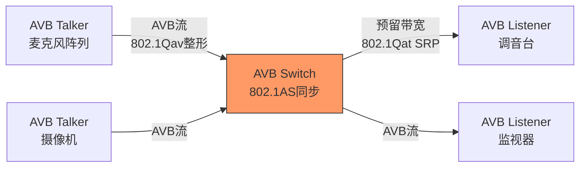
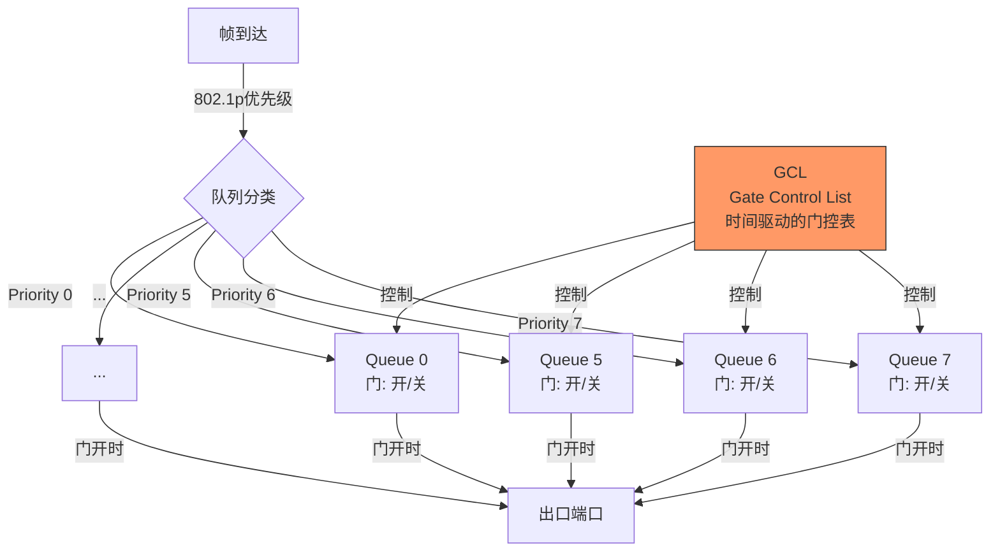
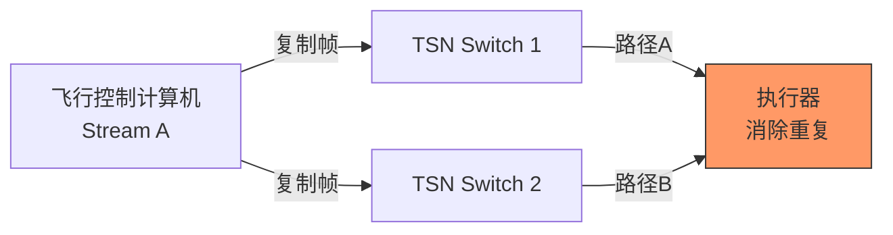

# TSN历史演进与前沿

<span class="badge-e">[Expert]</span>

<span class="red">TSN</span>（Time-Sensitive Networking，时间敏感网络）是IEEE 802.1标准族中为以太网添加确定性传输能力的技术集合。
<br>
从2005年AVB（Audio Video Bridging）的诞生到今天的TSN全标准族，TSN正在重新定义工业、汽车和航空三大领域的网络架构。
<br>
IEEE 802.1Qbv时间门控机制让标准以太网首次获得了<span class="blue">微秒级确定性</span>。
<br>

---

## <strong>从AVB到TSN：标准以太网的实时化之路</strong>

### <strong>AVB：音视频桥接的起点</strong>

<span class="red">AVB</span>（Audio Video Bridging）是TSN的前身，由IEEE 802.1BA于2011年发布。
<br>
AVB的目标是为专业音视频设备提供"即插即用"的以太网互联，解决传统音频网络（如MADI、CobraNet）的复杂配置问题。
<br>
AVB的核心技术包括：<br>
- <span class="green">802.1AS</span>：精确时间同步（gPTP，基于IEEE 1588）
<br>
- <span class="green">802.1Qav</span>：流量整形（Credit-Based Shaper）
<br>
- <span class="green">802.1Qat</span>：流预留协议（SRP）
<br>
- <span class="green">802.1BA</span>：音视频桥接系统配置
<br>



AVB的局限：<br>
- 仅支持最多7个优先级（实际有效2-3个）
<br>
- Credit-Based Shaper的带宽保障是"软"的，存在 worst-case 延迟
<br>
- 流预留协议SRP配置复杂，扩展性差
<br>

<span class="blue">关键认知：AVB证明了标准以太网可以支持时间敏感应用，但AVB的"尽力保障"模型无法满足工业控制对最坏情况延迟的严格约束。
</span><br>

### <strong>TSN的诞生：从"尽力"到"保证"</strong>

<span class="green">TSN</span>在2012年由IEEE 802.1工作组正式定义，将AVB扩展为更全面的确定性网络技术族。
<br>
TSN的核心增强是引入了<span class="red">"时间门控"</span>机制——交换机端口在精确的时间窗口内仅允许特定优先级的帧通过。
<br>

| TSN标准 | 功能 | 关键机制 |
|---------|------|----------|
| 802.1AS-rev | 时间同步 | gPTP增强，支持多域 |
| 802.1Qbv | 时间门控 | 时间感知整形器（TAS） |
| 802.1Qbu | 帧抢占 | 高优先级帧中断低优先级帧 |
| 802.1Qca | 路径控制 | SRP增强，路径冗余 |
| 802.1Qci | 逐流过滤 | 入口 policing |
| 802.1CB | 帧复制消除 | 无缝冗余（PRP/HSR风格） |
| 802.1Qch | 循环队列转发 | 确定性转发 |
| 802.1Qcr | 异步流量整形 | ATS，面向异步流 |

<span class="blue">关键认知：TSN不是单一协议，而是<strong>"协议工具箱"</strong>——不同行业根据需求选择子集组合使用，工业控制侧重Qbv+Qbu+Qci，汽车侧重Qbv+CB+AS，航空侧重CB+AS+冗余。
</span><br>

---

## <strong>IEEE 802.1Qbv时间门控：确定性传输的核心</strong>

### <strong>时间感知整形器（TAS）的工作原理</strong>

<span class="red">802.1Qbv</span>是TSN最核心的标准，定义了"时间门控"机制。
<br>
Qbv在每个交换机出口端口维护<span class="green">8个队列</span>（对应8个802.1p优先级），每个队列有一个"门"（Gate）。
<br>
门的开关状态由<span class="green">GCL（Gate Control List）</span>控制——GCL是一个时间序列，精确指定在每个时刻哪些队列的门是开的。
<br>



GCL的时间精度由<span class="green">802.1AS</span>提供的gPTP同步保障。
<br>
整个网络中的交换机通过gPTP共享一个亚微秒级精度的全局时钟，确保所有GCL同步执行。
<br>

```c
// IEEE 802.1Qbv GCL配置概念（Linux tc-taprio示意）
// 注意：真实配置通过tc命令或专用TSN交换机管理接口完成

// GCL周期：1ms（1000us）
// 时间槽分配：
// 0-100us:  队列7开（最高优先级，控制流量）
// 100-500us: 队列6开（中等优先级，传感器数据）
// 500-900us: 队列5开（低优先级，日志/诊断）
// 900-1000us: 队列0开（尽力而为，普通以太网）

// tc taprio命令示例（Linux TSN支持）
// sudo tc qdisc add dev eth0 parent root handle 100 taprio \
//   num_tc 8 \
//   map 0 1 2 3 4 5 6 7 \
//   queues 1@0 1@1 1@2 1@3 1@4 1@5 1@6 1@7 \
//   base-time 0 \
//   sched-entry S 01 100000  # 100us内仅队列0开（bitmask 0x01）
//   sched-entry S 02 100000  # 接下来100us仅队列1开
//   sched-entry S 04 100000  # 接下来100us仅队列2开
//   ...
//   flags 0x2  # 启用TXTIME_ASSIST

// 802.1AS gPTP时间同步（Linux ptp4l配置）
// ptp4l -i eth0 -f /etc/linuxptp/gPTP.cfg
// 关键配置：
// [global]
// priority1 248          # 时钟优先级
// clockClass 6           # 主时钟类
// domainNumber 0         # gPTP域号
```

<span class="blue">关键认知：Qbv的"时间门控"不是"优先级抢占"，而是"时间隔离"——在门控关闭的时段，即使最高优先级的帧也必须等待，这彻底消除了排队延迟的不确定性。
</span><br>

---

## <strong>工业/汽车/航空三大场景</strong>

### <strong>工业控制：确定性以太网替代现场总线</strong>

TSN在工业领域的目标是替代PROFINET IRT、EtherCAT等专用工业以太网。
<br>
工业TSN的典型架构：<br>
| 层级 | 协议 | TSN应用 |
|------|------|---------|
| 现场层 | OPC UA Pub/Sub over TSN | 传感器/执行器实时通信 |
| 控制层 | OPC UA Client/Server + TSN | PLC/HMI通信 |
| 信息层 | TCP/IP over TSN | MES/ERP数据交换 |

<span class="blue">关键认知：工业TSN的愿景是"一个网络承载所有流量"——控制流量通过Qbv门控获得确定性，信息流量在同一物理网络上尽力传输。</span><br>

### <strong>汽车电子：TSN作为车载骨干网</strong>

汽车领域是TSN增长最快的应用场景。
<br>
<span class="green">100BASE-T1</span>和<span class="green">1000BASE-T1</span>（车载单对以太网）与TSN的结合正在定义新一代车载网络架构。
<br>

| 车载网络域 | 传统方案 | TSN方案 | 优势 |
|-----------|----------|---------|------|
| ADAS | CAN XL + 专用FPD-Link | 1000BASE-T1 + TSN | 带宽+同步 |
| 信息娱乐 | MOST/MediaLB | 100BASE-T1 + AVB | 标准以太网 |
| 动力总成 | CAN FD + FlexRay | 100BASE-T1 + Qbv | 统一网络 |
| OTA更新 | 独立CAN + DoIP | 同一TSN网络 | 简化架构 |

### <strong>航空航天：确定性飞行控制</strong>

航空领域对确定性和可靠性的要求最高。
<br>
TSN的<span class="green">802.1CB</span>（帧复制和消除）提供无缝冗余——关键帧通过两条独立路径传输，接收端自动消除重复。<br>



<span class="blue">关键认知：航空TSN的独特需求是"双重确定性"——不仅要保证延迟上界，还要保证帧到达率（通过冗余）。802.1CB的PRP/HSR风格冗余是为此而生。</span><br>

---

## <strong>历史演进：二十年的时间敏感网络之路</strong>

### <strong>从音视频到工业控制的范式扩展</strong>

| 年代 | 事件 | 技术影响 |
|------|------|----------|
| 2005 | IEEE 1588-2002（PTP） | 精密时间同步基础 |
| 2007 | IEEE 802.1AS启动 | AVB时间同步标准化 |
| 2011 | IEEE 802.1BA（AVB） | 音视频桥接系统 |
| 2012 | TSN工作组成立 | 从AVB扩展到通用确定性 |
| 2015 | 802.1Qbv发布 | 时间门控，核心突破 |
| 2016 | 802.1Qbu发布 | 帧抢占 |
| 2018 | 802.1CB发布 | 无缝冗余 |
| 2019 | 802.1Qci发布 | 逐流过滤 |
| 2020 | IEC/IEEE 60802 | 工业TSN行规 |
| 2022 | 802.1Qcr发布 | 异步流量整形 |
| 2025+ | TSN与5G融合 | 无线确定性扩展 |

<span class="blue">演进逻辑：TSN从"音视频专用"演进到"通用确定性网络"，驱动力是IEEE 802.1工作组的开放标准策略——不锁定任何行业，提供工具箱让各行业自行组合。</span><br>

---

## <strong>本章小结</strong>

| 要点 | 内容 |
|------|------|
| AVB起源 | IEEE 802.1BA，音视频桥接，Credit-Based Shaper |
| TSN核心 | 802.1Qbv时间门控，GCL控制队列开关 |
| 时间同步 | 802.1AS gPTP，亚微秒级全网同步 |
| 帧抢占 | 802.1Qbu，高优先级中断低优先级 |
| 无缝冗余 | 802.1CB，帧复制+消除 |
| 工业场景 | OPC UA over TSN，替代专用现场总线 |
| 汽车场景 | 100/1000BASE-T1 + TSN，车载骨干 |
| 航空场景 | TSN + 802.1CB冗余，飞行控制 |

## <strong>练习</strong>

1. IEEE 802.1Qbv的GCL时间门控与802.1Qbu的帧抢占有什么区别？在什么场景下两者需要同时使用？请用时间线图示一个高优先级帧在低优先级帧传输过程中被抢占和门控的交互过程。
2. gPTP时间同步如何在交换机级联拓扑中保持亚微秒精度？请解释"透明时钟"（Transparent Clock）和"边界时钟"（Boundary Clock）在同步链中的作用。
3. 比较TSN与EtherCAT在工业实时控制场景中的优劣。在什么条件下TSN可以替代EtherCAT？什么条件下EtherCAT仍然是更好的选择？

---

## <strong>学习路径</strong>

- <span class="badge-e">[Expert]</span> TSN的精髓在于"时间即资源"——理解gPTP同步、Qbv门控和CB冗余的协同，是掌握确定性网络的关键。
- <span class="purple">扩展阅读：IEEE 802.1Qbv-2015标准、IEC/IEEE 60802工业TSN行规、Linux内核tc-taprio实现、OpenAVB开源项目。
</span><br>