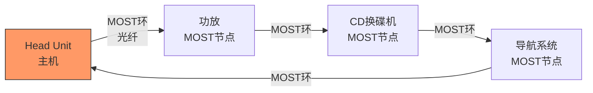
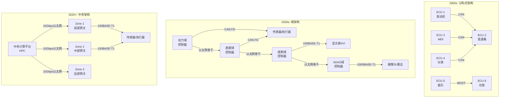

# 车载以太网历史演进

[Intermediate] [Expert]

车载以太网正从MOST时代的封闭总线演进到基于标准IEEE以太网的开放网络架构。
 
从BroadR-Reach的专有创新到100BASE-T1/1000BASE-T1的标准化，车载以太网用单对非屏蔽双绞线实现了100Mbps到1Gbps的传输。
 
这是车载网络架构从分布式ECU到域控制器、再到中央计算平台的物理基础。
 

---

## <strong>从MOST到100BASE-T1：车载网络的带宽革命</strong>

### <strong>MOST：封闭时代的王者</strong>

MOST（Media Oriented Systems Transport）是1990年代末至2010年代车载信息娱乐系统的主流总线。
 
MOST采用光纤环形拓扑，速率为25Mbps（MOST25）、50Mbps（MOST50）或150Mbps（MOST150）。
 
MOST的封闭性是其最大特征——由MOST Cooperation控制，芯片和协议栈授权费用高昂。
 

MOST的局限： 
- 光纤成本高，安装维护困难
 
- 封闭生态，供应商锁定
 
- 带宽增长受限（最高150Mbps）
 
- 无法与IT网络互联互通
 

关键认知：MOST的衰落证明了"封闭标准"在开放竞争中的脆弱性——当标准以太网进入车载领域，MOST的成本和生态劣势使其迅速边缘化。
 

### <strong>BroadR-Reach：单对以太网的先驱</strong>

BroadR-Reach由博通（Broadcom）和NXP于2004年提出，是车载以太网的先驱技术。
 
BroadR-Reach用单对非屏蔽双绞线（UTP）实现100Mbps全双工通信，同时满足汽车EMC要求。
 
核心技术是80B/81B编码 + PAM3调制 + 回声消除。
 

| 技术 | MOST150 | BroadR-Reach | 100BASE-T1 |
|------|---------|--------------|------------|
| 介质 | 光纤 | 单对UTP | 单对UTP |
| 速率 | 150Mbps | 100Mbps | 100Mbps |
| 拓扑 | 环形 | 点对点 | 点对点 |
| 标准化 | MOST Coop | 专有 | IEEE 802.3bw |
| 成本 | 高 | 中 | 低 |
| 生态 | 封闭 | 半开放 | 完全开放 |

关键认知：BroadR-Reach的价值不在于技术创新（回声消除在DSL中早已成熟），而在于证明了"标准以太网可以适应车载环境"——这是IEEE接手的信心来源。
 

### <strong>100BASE-T1标准化（IEEE 802.3bw）</strong>

2015年，IEEE 802.3bw将BroadR-Reach技术标准化为100BASE-T1。
 
100BASE-T1的关键参数： 
- 物理介质：单对非屏蔽双绞线（100Ω）
 
- 线缆长度：最长15米（车内足够）
 
- 连接器：小型化汽车级连接器
 
- EMC：满足CISPR 25汽车EMC标准
 
- 功耗：典型<300mW每端口
 

---

## <strong>1000BASE-T1与下一代车载骨干</strong>

### <strong>IEEE 802.3bp：千兆车载以太网</strong>

1000BASE-T1（IEEE 802.3bp，2016年发布）将车载以太网速率提升到1Gbps。
 
1000BASE-T1采用更高级的PAM3调制 + 4D-PAM16 + THP（Tomlinson-Harashima Precoding）。
 

| 规格 | 100BASE-T1 | 1000BASE-T1 |
|------|------------|-------------|
| 标准 | IEEE 802.3bw | IEEE 802.3bp |
| 速率 | 100Mbps | 1Gbps |
| 调制 | PAM3 | PAM3 (4D-PAM16) |
| 线缆 | 单对UTP | 单对UTP |
| 最大长度 | 15m | 15m |
| 典型应用 | 信息娱乐、诊断 | ADAS、骨干网 |
| 芯片可用性 | 成熟 | 成熟 |

关键认知：1000BASE-T1的1Gbps不是"为了更快"，而是"为了够用"——一个前置摄像头的原始数据（2MP @ 30fps，YUV422）约为150MB/s，接近1.2Gbps，千兆以太网是底线。
 

### <strong>Multi-Gig车载以太网展望</strong>

IEEE 802.3ch（Multi-Gig Automotive Ethernet）2020年发布，定义了2.5G/5G/10Gbps的车载速率。
 
Multi-Gig车载以太网采用PAM4调制，在更高信噪比要求下实现更高速率。
 

| 速率 | 标准 | 调制 | 应用 |
|------|------|------|------|
| 100Mbps | 802.3bw | PAM3 | 车身控制、信息娱乐 |
| 1Gbps | 802.3bp | PAM3 | ADAS传感器、域控制器 |
| 2.5Gbps | 802.3ch | PAM4 | 高分辨率摄像头 |
| 5Gbps | 802.3ch | PAM4 | 多摄像头融合 |
| 10Gbps | 802.3ch | PAM4 | 中央计算平台 |

扩展阅读：10Gbps车载以太网将使用屏蔽双绞线（STP）或同轴电缆以满足EMC要求，IEEE正在研究光纤作为更长距离和更高带宽的替代方案。
 

---

## <strong>车载网络架构演进</strong>

### <strong>从分布式到中央计算的架构变迁</strong>

| 架构 | 年代 | 总线技术 | ECU数量 | 特点 |
|------|------|----------|---------|------|
| 分布式 | 2000s | CAN + MOST | 70-100+ | 每个功能一个ECU |
| 域架构 | 2020s | CAN FD + 以太网骨干 | 30-50 | 功能域集中 |
| 中央架构 | 2025+ | 多Gig以太网骨干 | 10-20 | 中央HPC + 区域网关 |

关键认知：车载以太网的引入不是"替换CAN"，而是"提供骨干"——CAN/CAN FD继续负责低速高可靠的边缘通信，以太网负责高速大带宽的骨干传输。
 

---

## <strong>为什么车载需要专用以太网</strong>

### <strong>标准以太网无法满足车载需求</strong>

传统以太网（100BASE-TX、1000BASE-T）不能直接用于汽车： 
| 维度 | 标准以太网 | 车载以太网 |
|------|------------|------------|
| 线缆 | 4对UTP（100BASE-TX） | 1对UTP |
| 重量 | 重（4对线+屏蔽） | 轻（单对线） |
| 成本 | 高 | 低（省线+省连接器） |
| EMC | 不满足CISPR 25 | 满足汽车EMC |
| 辐射 | 高 | 低（PAM3调制优化） |
| 连接器 | RJ45 | 小型汽车级 |
| 温度 | 0-40°C | -40°C ~ +105°C |

关键认知：车载以太网的创新不是"更快"，而是"更省"——省线、省重量、省空间、省成本，同时满足汽车EMC和温度要求。
 

---

## <strong>历史演进：二十五年车载网络变迁</strong>

### <strong>从光纤到铜缆，从封闭到开放</strong>

| 年代 | 技术 | 代表 | 带宽 | 特点 |
|------|------|------|------|------|
| 1998 | MOST25 | 宝马/奔驰 | 25Mbps | 光纤环网，封闭 |
| 2004 | MOST150 | 奥迪 | 150Mbps | 光纤升级 |
| 2004 | BroadR-Reach | 博通/NXP | 100Mbps | 单对UTP，专有 |
| 2010 | 100BASE-TX | 诊断接口 | 100Mbps | 标准以太网，OBD-II |
| 2015 | 100BASE-T1 | IEEE 802.3bw | 100Mbps | 标准化车载以太网 |
| 2016 | 1000BASE-T1 | IEEE 802.3bp | 1Gbps | 千兆车载骨干 |
| 2020 | Multi-Gig | IEEE 802.3ch | 2.5/5/10Gbps | ADAS/中央计算 |
| 2025+ | 光纤以太网 | 研究阶段 | 10Gbps+ | 长距离/高带宽 |

演进逻辑：车载网络从"专用封闭"（MOST）演进到"标准开放"（IEEE以太网），驱动力是ADAS和自动驾驶对带宽的渴求，以及标准以太网生态的成本优势。
 

---

## <strong>本章小结</strong>

| 要点 | 内容 |
|------|------|
| MOST | 光纤环网，封闭生态，25-150Mbps |
| BroadR-Reach | 单对UTP先驱，博通/NXP专有技术 |
| 100BASE-T1 | IEEE 802.3bw，100Mbps，PAM3调制 |
| 1000BASE-T1 | IEEE 802.3bp，1Gbps，4D-PAM16 |
| Multi-Gig | IEEE 802.3ch，2.5/5/10Gbps，PAM4 |
| 架构演进 | 分布式→域架构→中央计算 |
| 与CAN关系 | 互补而非替代，以太网骨干+CAN边缘 |

## <strong>练习</strong>

1. 100BASE-T1为什么能用单对UTP实现100Mbps全双工通信？请解释PAM3调制和回声消除（Echo Cancellation）在其中的作用。
2. 比较车载以太网从分布式架构到中央计算架构的演进中，网络拓扑、交换机角色和网关功能发生了哪些根本性变化。
3. 为什么传统100BASE-TX不能直接用于汽车环境？除了线缆数量差异，EMC和温度适应性方面还有哪些关键差异？

---

## <strong>学习路径</strong>

- [Intermediate] 从100BASE-T1物理层原理入手，理解PAM3调制和汽车EMC要求。
- [Expert] 深入研究车载以太网交换机架构、TSN门控在车载场景的配置、以及中央计算平台的网络拓扑设计。
- 扩展阅读：IEEE 802.3bw/bp/ch标准、OPEN Alliance TC规范、汽车以太网书籍《Automotive Ethernet》by Kirsten Matheus。
 