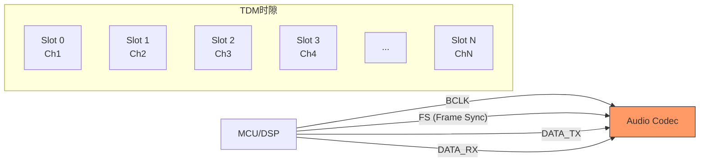
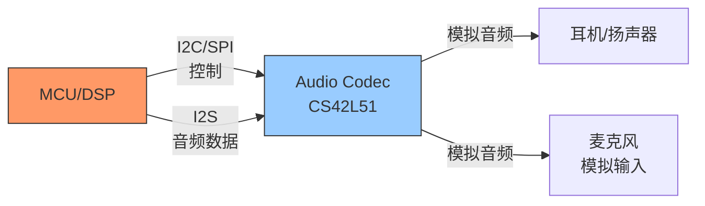

# I2S历史演进与前沿

<span class="badge-i">[Intermediate]</span> <span class="badge-e">[Expert]</span>

<span class="red">I2S</span>（Inter-IC Sound）是嵌入式音频系统最基础的数字音频接口。

从1986年Philips的原始规范到今天的TDM（Time Division Multiplexing）扩展，I2S用三根线定义了芯片间音频传输的基本范式。

在HDMI、USB Audio和SoundWire的时代，I2S依然在MCU、DSP和Codec之间扮演着"最后一公里"音频接口的角色。

---

## <strong>从Philips到现代TDM：I2S的三十年演进</strong>

### <strong>I2S原始规范：三线的优雅</strong>

<span class="red">I2S</span>由Philips（现NXP）在1986年定义，用于CD播放器中DAC与数字滤波器之间的音频数据传输。

其核心设计仅使用三根信号线：

| 信号 | 名称 | 功能 |
|------|------|------|
| BCLK | Bit Clock | 位时钟，每个数据位一个周期 |
| LRCLK | Left/Right Clock | 帧时钟，区分左右声道 |
| DATA | Serial Data | 串行音频数据（MSB-first） |

```mermaid
waveform
    title I2S时序（16bit/sample，44.1kHz）
    LRCLK : __|||||____|||||____|||||____|||||__
    BCLK  : _|_|_|_|_|_|_|_|_|_|_|_|_|_|_|_|_|_
    DATA  : ========R========L========R=======
    
    note: LRCK高=右声道，低=左声道
    note: DATA在BCLK下降沿改变，上升沿采样
```

<span class="blue">关键认知：I2S的极简设计是其持久生命力的根源——三根线、一种时序、无边带信号，任何MCU的SPI或GPIO都可以软件模拟I2S。
</span><br>

### <strong>I2S的时序变体：PCM模式与对齐方式</strong>

Philips I2S标准定义了一种特定的时序对齐方式，但实际应用中存在多种变体：

| 模式 | LRCLK对齐 | 数据偏移 | 典型应用 |
|------|-----------|----------|----------|
| I2S Philips | 50%占空比 | DATA延迟BCLK 1个周期 | 通用Codec |
| Left Justified | 50%占空比 | DATA与LRCLK同步 | DSP |
| Right Justified | 50%占空比 | DATA在LRCLK边缘对齐到LSB | 日本厂商 |
| PCM Mode A | 1 BCLK脉宽 | DATA延迟1 BCLK | DSP |
| PCM Mode B | 1 BCLK脉宽 | DATA与同步脉冲同步 | DSP |

```c
// I2S时序配置示例（基于STM32 HAL）
// 不同Codec可能要求不同的I2S标准

void i2s_config_variants(void) {
    // Philips I2S标准（最常见）
    hi2s1.Init.Standard = I2S_STANDARD_PHILIPS;
    // 数据延迟1个BCLK周期
    // 48kHz采样率，16bit/采样，立体声
    // BCLK = 48000 * 16 * 2 = 1.536MHz
    
    // Left Justified（DSP常用）
    hi2s1.Init.Standard = I2S_STANDARD_MSB;
    // 数据与LRCK边缘同步，无延迟
    
    // Right Justified（某些日本Codec）
    hi2s1.Init.Standard = I2S_STANDARD_LSB;
    // 数据LSB在LRCK切换前的最后一个BCLK对齐
    
    // PCM模式（A律/u律编解码器）
    hi2s1.Init.Standard = I2S_STANDARD_PCM_SHORT;
    // LRCLK变为1 BCLK宽度的同步脉冲
}
```

<span class="blue">关键认知：I2S的"标准不标准"是工程师的永恒烦恼——不同厂商的Codec对时序的理解不同，配置前必须仔细阅读Codec datasheet的I2S时序图。
</span><br>

---

## <strong>TDM：从双声道到多声道的扩展</strong>

### <strong>为什么需要TDM</strong>

当音频系统需要超过2个声道（立体声）时，I2S的双声道设计成为瓶颈。

<span class="red">TDM（Time Division Multiplexing）</span>扩展了I2S的时序，将一帧划分为多个时隙（slot），每个时隙承载一个声道的数据。

| 参数 | I2S立体声 | TDM 8声道 | TDM 16声道 |
|------|-----------|-----------|------------|
| 声道数 | 2 | 8 | 16 |
| LRCLK功能 | 左右切换 | 帧同步（FS） | 帧同步（FS） |
| BCLK速率 | Fs * 32 | Fs * 256 | Fs * 512 |
| 数据线 | 1 | 1-4 | 2-8 |
| 典型应用 | 立体声Codec | 多麦克风阵列 | 专业调音台 |



### <strong>PDM：I2S的数字前端替代</strong>

<span class="green">PDM（Pulse Density Modulation）</span>是MEMS麦克风的主流输出格式，与I2S有密切关系。

PDM麦克风输出1bit过采样数据（典型3.072MHz），需要经过滤波器抽取（decimate）为I2S/TDM兼容的PCM数据。

| 接口 | 数据宽度 | 时钟速率 | 距离 | 应用场景 |
|------|----------|----------|------|----------|
| PDM | 1bit | 3.072MHz | 短（板级） | MEMS麦克风 |
| I2S | 16-32bit | 1.536MHz | 中（设备间） | Codec/DSP |
| TDM | 16-32bit | 1.536-12.288MHz | 中 | 多声道系统 |
| SoundWire | 命令+数据 | 可配置 | 长（多设备） | 智能手机 |

<span class="purple">扩展阅读：TDM的slot分配由Codec的寄存器配置决定，常见配置有I2S/TDM1/TDM2/TDM4/TDM8等模式，每个slot可以是TX（发送）、RX（接收）或空置。
</span><br>

---

## <strong>I2S与PCM/I2C/SPI的关系</strong>

### <strong>I2S vs PCM：命名的混乱</strong>

"PCM"在音频领域有两个含义：

1. <span class="green">PCM音频数据</span>：Pulse Code Modulation，即标准的采样量化编码数字音频
2. <span class="green">PCM接口</span>：某些厂商（如德州仪器）用"PCM"命名其I2S变体，特点是1-bit宽度的帧同步脉冲

| 语境 | "PCM"含义 | 对应接口 |
|------|-----------|----------|
| 音频编解码 | 采样数据格式 | 与接口无关 |
| 德州仪器 | I2S变体（短帧同步） | PCM Mode A/B |
| 高通/联发科 | 通用数字音频接口 | 常等同于I2S |
| 嵌入式Linux | ASoC PCM子流 | ALSA软件概念 |

<span class="blue">关键认知：在Datasheet中看到"PCM接口"时，不要假设它是什么——必须查看时序图，确认是Philips I2S、Left/Right Justified、还是PCM短帧同步。
</span><br>

### <strong>I2S vs I2C vs SPI：命名相似，本质不同</strong>

| 总线 | 全名 | 用途 | 信号线 | 时钟源 |
|------|------|------|--------|--------|
| I2S | Inter-IC Sound | 音频数据传输 | BCLK/LRCLK/DATA | 主设备 |
| I2C | Inter-Integrated Circuit | 控制寄存器配置 | SDA/SCL | 主设备 |
| SPI | Serial Peripheral Interface | 通用高速数据 | MOSI/MISO/SCK/CS | 主设备 |

典型音频系统中三者的协作：



```c
// Linux ASoC音频设备树配置示例
// 展示I2C（控制）+ I2S（数据）的分离

// Codec设备树节点
&i2c1 {
    cs42l51: audio-codec@4a {
        compatible = "cirrus,cs42l51";
        reg = <0x4a>;  // I2C地址
        // 控制接口：I2C
        // 音频数据接口：I2S，通过sound节点关联
    };
};

// ASoC sound card节点
/ {
    sound {
        compatible = "simple-audio-card";
        simple-audio-card,name = "CS42L51 Audio";
        
        // CPU端（MCU的I2S控制器）
        simple-audio-card,cpu {
            sound-dai = <&sai1>;  // STM32 SAI/I2S控制器
        };
        
        // Codec端
        simple-audio-card,codec {
            sound-dai = <&cs42l51>;  // 引用上面的Codec节点
            clocks = <&cs42l51_mclk>;   // Codec主时钟
        };
    };
};
```

<span class="blue">关键认知：音频系统的"控制面"和"数据面"分离是最佳实践——I2C/SPI负责Codec的配置（采样率、音量、电源管理），I2S负责实时音频流的传输，两者互不干扰。
</span><br>

---

## <strong>HDMI音频嵌入：I2S的高速替代</strong>

### <strong>HDMI音频子包的I2S根源</strong>

HDMI的音频传输底层是<span class="green">IEC 60958</span>（S/PDIF）或<span class="green">IEC 61937</span>（压缩音频），其串行编码本质上是I2S的高速变体。

| 接口 | 速率 | 声道数 | 采样率 | 位深 | 距离 |
|------|------|--------|--------|------|------|
| I2S | 3.1Mbps | 2 | 48kHz | 16bit | 板级 |
| TDM | 12.3Mbps | 8 | 48kHz | 32bit | 板级 |
| S/PDIF | 3.1Mbps | 2 | 96kHz | 24bit | 数米 |
| HDMI ARC | 1-3Mbps | 2 | 48kHz | 24bit | 数米 |
| HDMI | 36.9Mbps | 8 | 192kHz | 24bit | 数米 |

<span class="blue">关键认知：HDMI的音频嵌入不是"替代I2S"，而是"扩展I2S"——HDMI内部的音频数据包本质上是用I2S格式编码的，只是在外层包裹了TMDS视频传输协议。
</span><br>

---

## <strong>历史演进：三十八年音频接口简史</strong>

### <strong>从模拟到数字，从专用到通用</strong>

| 年代 | 技术 | 代表 | 特点 |
|------|------|------|------|
| 1982 | CD数字音频 | Philips/Sony | 44.1kHz/16bit标准化 |
| 1986 | I2S发布 | Philips | 芯片间音频传输标准 |
| 1990 | S/PDIF普及 | 消费电子产品 | 光纤/同轴数字音频 |
| 1995 | AC'97 | Intel | PC音频标准 |
| 2004 | Intel HD Audio | Intel | 取代AC'97 |
| 2008 | TDM扩展 | 专业音频 | 多声道I2S |
| 2012 | SoundWire | MIPI | 移动设备音频 |
| 2015 | USB Audio 2.0 | USB-IF | 高分辨率音频 |
| 2020+ | A2B (Automotive Audio Bus) | Analog Devices | 车载音频 |
| 2025+ | MIPI SoundWire v2.0 | MIPI | 更低功耗 |

<span class="blue">演进逻辑：音频接口从"专用总线"（I2S）演进到"通用总线"（USB/HDMI），但在嵌入式领域，I2S/TDM因其简洁性和低延迟依然是不可替代的。
</span><br>

---

## <strong>本章小结</strong>

| 要点 | 内容 |
|------|------|
| I2S信号 | BCLK + LRCLK + DATA，三根线 |
| 时序变体 | Philips I2S、Left/Right Justified、PCM Mode A/B |
| TDM扩展 | 多slot时分复用，支持8/16/32声道 |
| PDM | 1bit过采样，MEMS麦克风输出，需抽取为PCM |
| I2C控制 | 音频系统"控制面"（配置）与"数据面"（I2S）分离 |
| HDMI音频 | IEC 60958编码，I2S的高速远距离变体 |

## <strong>练习</strong>

1. 计算48kHz采样率、24bit位深、立体声I2S接口的BCLK频率。如果改用TDM8模式（8个声道，每声道32bit），BCLK频率是多少？为什么TDM模式的BCLK远高于普通I2S？
2. Philips I2S标准中，为什么DATA要延迟BCLK一个周期？如果Codec要求Left Justified模式，DATA与LRCLK同步，这种差异对MCU的I2S控制器配置有什么影响？
3. 在一个同时需要模拟麦克风输入、数字MEMS麦克风输入（PDM）和立体声耳机输出的嵌入式音频系统中，如何设计Codec与MCU之间的接口组合？请画出接口框图并说明I2C、I2S和PDM各自的角色。

---

## <strong>学习路径</strong>

- <span class="badge-i">[Intermediate]</span> 从Linux ASoC框架的DAPM（Dynamic Audio Power Management）入手，理解I2S/I2C在音频子系统中的分工。
- <span class="badge-e">[Expert]</span> 深入研究TDM slot配置、多Codec级联、以及I2S时钟域 crossing 和抖动（jitter）对音频质量的影响。
- <span class="purple">扩展阅读：Philips I2S总线规范（1986）、I2S时序变体应用笔记、Linux ASoC文档、Codec datasheet（如CS42L51、WM8960）。
</span><br>