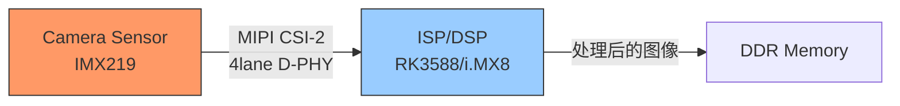

# MIPI历史演进与生态

<span class="badge-i">[Intermediate]</span> <span class="badge-e">[Expert]</span>

<span class="red">MIPI Alliance</span>（Mobile Industry Processor Interface Alliance）是移动设备接口标准的制定者。

从2003年成立到今天的DSI/CSI-2/D-PHY/C-PHY标准族，MIPI定义了智能手机、平板和嵌入式设备的摄像头、显示屏和射频接口。

MIPI标准的成功在于"为移动优化"——低功耗、小引脚、高带宽，这些特性同样适用于广泛的嵌入式应用场景。

---

## <strong>MIPI Alliance成立与标准化历程</strong>

### <strong>从移动需求到嵌入式扩展</strong>

<span class="red">MIPI Alliance</span>成立于2003年，由ARM、Nokia、Sony、Texas Instruments等公司联合创立。

其初衷是解决移动设备处理器与外设之间的接口标准化问题——在功能机时代，每家厂商的摄像头、显示屏接口各不相同，导致高昂的定制成本。

| 年份 | 标准 | 应用领域 | 关键特性 |
|------|------|----------|----------|
| 2003 | MIPI Alliance成立 | - | 移动行业接口标准化 |
| 2005 | D-PHY v1.0 | 摄像头/显示 | 1.5Gbps/lane |
| 2005 | CSI-1 | 摄像头接口 | 首个摄像头标准 |
| 2006 | DSI v1.0 | 显示接口 | 显示串行接口 |
| 2009 | CSI-2 v1.0 | 摄像头接口 | 基于D-PHY，4lane |
| 2009 | D-PHY v1.1 | 物理层 | 1.5Gbps→2.5Gbps |
| 2011 | D-PHY v1.2 | 物理层 | 2.5Gbps，低功耗 |
| 2013 | C-PHY v1.0 | 物理层 | 3pin/trio，2.5Gsps |
| 2014 | CSI-2 v1.3 | 摄像头接口 | RAW-16/20，DPCM |
| 2015 | D-PHY v2.0 | 物理层 | 4.5Gbps/lane |
| 2016 | CSI-2 v2.0 | 摄像头接口 | 虚拟通道扩展 |
| 2017 | D-PHY v2.1 | 物理层 | 4.5Gbps，测试优化 |
| 2019 | C-PHY v2.0 | 物理层 | 5.7Gsps/trio |
| 2021 | DSI-2 v1.0 | 显示接口 | 4K显示支持 |
| 2023 | A-PHY v1.0 | 车载长距离 | 16Gbps，15米 |

<span class="blue">关键认知：MIPI的成功不是因为它"技术最先进"，而是因为它"生态最成熟"——从IP核到模组到测试设备，MIPI提供了端到端的供应链支持。
</span><br>

---

## <strong>DSI/CSI-2：显示与摄像头的串行接口</strong>

### <strong>CSI-2：摄像头串行接口</strong>

<span class="green">MIPI CSI-2</span>（Camera Serial Interface 2）是当前最主流的摄像头接口标准。

CSI-2基于D-PHY物理层，使用<span class="green">1-4条数据lane</span>加1条时钟lane。

| 参数 | 典型配置 | 说明 |
|------|----------|------|
| Lane数 | 1-4 | 可配置，更多lane=更高带宽 |
| 每lane速率 | 1.0-4.5Gbps | 取决于D-PHY版本 |
| 总带宽 | 1-18Gbps | 4lane × 4.5Gbps |
| 像素格式 | RAW8-20, YUV422, RGB888 | 灵活支持 |
| 虚拟通道 | 最多16路 | 多摄像头共享物理lane |
| 功耗 | ~1mW @ 休眠 | 支持超低功耗状态 |



### <strong>DSI：显示串行接口</strong>

<span class="green">MIPI DSI</span>（Display Serial Interface）是面向显示屏的串行接口。

DSI与CSI-2共享D-PHY物理层，但协议层针对显示应用优化——支持命令模式（类似SPI）和视频模式（实时流）。

```c
// DSI 命令模式 vs 视频模式
// 命令模式（Command Mode）：显示控制器有内部帧缓冲
// - 主机仅在需要更新时发送数据
// - 低功耗，适合静态UI
// - 类似"显存写入"操作

// 视频模式（Video Mode）：实时像素流
// - 主机持续发送像素数据
// - 类似HDMI/VGA的实时扫描
// - 适合视频播放和游戏

// DSI 短包格式（命令传输）
// [Data ID: 8bit] [Word Count: 16bit] [ECC: 8bit] [Payload: 0-65535字节] [Checksum: 16bit]
// Data ID 定义命令类型：
//   0x01: VSYNC Start
//   0x11: HSYNC Start
//   0x21: Color Mode Off
//   0x39: DCS Long Write
//   ...

// DSI DCS命令示例（初始化LCD）
static const uint8_t lcd_init_commands[] = {
    // Soft Reset
    0x01, 0x00,
    // Sleep Out
    0x11, 0x00,
    // Delay 120ms
    0xFF, 120,
    // Display On
    0x29, 0x00,
    // Normal Mode
    0x13, 0x00,
};
```

| 模式 | 特点 | 适用场景 |
|------|------|----------|
| Command Mode | 有帧缓冲，低功耗，仅更新变化区域 | 智能手表，电子书 |
| Video Mode | 实时流，无帧缓冲，持续传输 | 手机，平板，车载 |
| Adaptive Mode | 动态切换Command/Video | 高端手机 |

<span class="blue">关键认知：DSI的Command Mode和Video Mode选择是功耗与实时性的权衡——Command Mode省功耗但刷新延迟不可控，Video Mode实时但持续耗电。
</span><br>

---

## <strong>D-PHY/C-PHY：物理层的双线竞争</strong>

### <strong>D-PHY：四线 lane 的成熟方案</strong>

<span class="green">MIPI D-PHY</span>是MIPI最成熟的物理层标准，每条数据lane使用2根差分线（D+ / D-）。

4lane D-PHY + 1条时钟lane = 总共10根线。

| 版本 | 每lane速率 | 4lane总带宽 | 特点 |
|------|------------|-------------|------|
| v1.0 | 1.5Gbps | 6Gbps | 初始版本 |
| v1.1 | 2.5Gbps | 10Gbps | 主流手机 |
| v1.2 | 2.5Gbps | 10Gbps | 低功耗优化 |
| v2.0 | 4.5Gbps | 18Gbps | 4K视频 |
| v2.1 | 4.5Gbps | 18Gbps | 测试优化 |

```mermaid
waveform
    title D-PHY HS传输时序
    CLK : ======________========________========
    D0+ : __________========________========____
    D0- : __________________========________====
    
    note: HS模式：差分高速传输
    note: LP模式：单端低功耗控制
```

D-PHY的独特设计是<span class="red">"双模式"</span>——每条lane可在高速模式（HS，差分）和低功耗模式（LP，单端）之间切换：

- **HS模式**：差分信号，100mV幅度，Gbps级速率，用于数据传输
- **LP模式**：单端信号，1.2V幅度，10Mbps速率，用于控制和低功耗待机

### <strong>C-PHY：三线 trio 的密度革命</strong>

<span class="green">MIPI C-PHY</span>用3根线组成一个"trio"（而非D-PHY的2线差分对），使用<span class="green">3-phase编码</span>。

C-PHY的优势是引脚效率——3线trio传输2.28bit每symbol，比D-PHY的2线差分对的1bit/symbol更高效。

| 参数 | D-PHY v2.1 | C-PHY v2.0 |
|------|------------|------------|
| 每通道引脚 | 2（差分对） | 3（trio） |
| 编码方式 | 不归零（NRZ） | 3-phase编码 |
| 每通道速率 | 4.5Gbps | 5.7Gsps ≈ 13.03Gbps等效 |
| 4通道总带宽 | 18Gbps | ~39Gbps等效 |
| 引脚总数 | 10（4data+1clk） | 12（4trio） |
| 面积效率 | 基准 | 更高 |
| 成熟度 | 非常高 | 中等 |

<span class="blue">关键认知：C-PHY的3-phase编码让每根线的状态利用率最大化——3根线有6种合法状态转换，每symbol携带log2(6)≈2.58bit信息，比D-PHY的1bit提升158%。
</span><br>

---

## <strong>移动显示摄像头生态</strong>

### <strong>MIPI在嵌入式中的扩展应用</strong>

MIPI标准虽然起源于移动设备，但其低功耗、高带宽、小尺寸的特性使其广泛适用于嵌入式系统：

| 应用领域 | MIPI接口 | 典型设备 |
|----------|----------|----------|
| 机器视觉 | CSI-2 + D-PHY | 工业相机，机器人视觉 |
| 车载显示 | DSI + D-PHY | 仪表盘，中控屏 |
| 无人机 | CSI-2 | 航拍相机 |
| 医疗内窥镜 | CSI-2 | 微型摄像头 |
| AR/VR | DSI-2 + D-PHY | 头戴显示器 |
| 车载长距离 | A-PHY | ADAS摄像头 |

<span class="green">MIPI A-PHY</span>是MIPI向车载领域的关键扩展，支持15米传输距离和16Gbps速率，解决车载摄像头长距离布线问题。

<span class="purple">扩展阅读：MIPI I3C（Improved Inter-Integrated Circuit）是MIPI联盟对I2C的升级，向后兼容I2C的同时支持更高的速率（12.5MHz）和动态地址分配，正在逐步取代I2C在传感器接口中的地位。
</span><br>

---

## <strong>历史演进：二十年移动接口标准化</strong>

### <strong>从分散到统一，从移动到通用</strong>

| 年代 | 技术 | 代表 | 关键演进 |
|------|------|------|----------|
| 2003 | MIPI Alliance成立 | ARM/Nokia等 | 移动接口标准化 |
| 2005 | D-PHY + CSI/DSI v1.0 | 首批手机 | 串行接口替代并行 |
| 2009 | CSI-2 v1.0 | 智能手机 | 统一摄像头接口 |
| 2012 | 4K手机出现 | 索尼/三星 | 驱动带宽需求 |
| 2015 | D-PHY v2.0 | 高端手机 | 4.5Gbps/lane |
| 2016 | C-PHY v1.0 | 旗舰手机 | 3线trio，更高密度 |
| 2018 | CSI-2 v2.0 | 多摄像头手机 | 虚拟通道扩展 |
| 2021 | DSI-2 v1.0 | 高刷手机 | 支持120Hz+ |
| 2023 | A-PHY v1.0 | 车载 | 15米长距离 |
| 2025+ | MIPI未来 | AI/AR/车载 | 更高带宽，更低功耗 |

<span class="blue">演进逻辑：MIPI的演进始终遵循"移动优先，生态扩展"——先在智能手机中验证和成熟，再向相邻领域（平板、车载、IoT）扩展，每次扩展都保持向后兼容。
</span><br>

---

## <strong>本章小结</strong>

| 要点 | 内容 |
|------|------|
| MIPI Alliance | 2003年成立，移动行业接口标准化组织 |
| CSI-2 | 摄像头串行接口，1-4lane D-PHY/C-PHY |
| DSI/DSI-2 | 显示串行接口，Command/Video双模式 |
| D-PHY | 2线差分lane，HS/LP双模式，4.5Gbps/lane |
| C-PHY | 3线trio，3-phase编码，5.7Gsps/trio |
| 嵌入式扩展 | 机器视觉、车载显示、医疗内窥镜 |
| A-PHY | 车载长距离扩展，15米，16Gbps |

## <strong>练习</strong>

1. D-PHY的HS模式和LP模式在电气特性上有什么区别？为什么同一条物理线路可以在这两种模式之间切换？这种设计在功耗和功能性之间如何权衡？
2. C-PHY的3-phase编码相比D-PHY的NRZ编码在引脚效率和抗噪声能力方面各有什么优劣？在什么场景下C-PHY是更优选择？
3. 在一个需要同时连接前置摄像头（13MP）、后置摄像头（48MP）和6.7英寸OLED显示屏的嵌入式系统中，如何设计MIPI lane分配方案？请考虑带宽需求、ISP处理能力和引脚约束三个维度。

---

## <strong>学习路径</strong>

- <span class="badge-i">[Intermediate]</span> 从D-PHY的HS/LP模式切换和lane配置入手，理解CSI-2的数据类型（DT）和虚拟通道机制。
- <span class="badge-e">[Expert]</span> 深入研究D-PHY/C-PHY的物理层时序、CSI-2的长包/短包格式、以及MIPI接口的SI/PI信号完整性设计。
- <span class="purple">扩展阅读：MIPI Alliance官方规范文档、D-PHY/C-PHY/CSI-2/DSI标准、RK3588/i.MX8参考设计中的MIPI布线指南。
</span><br>