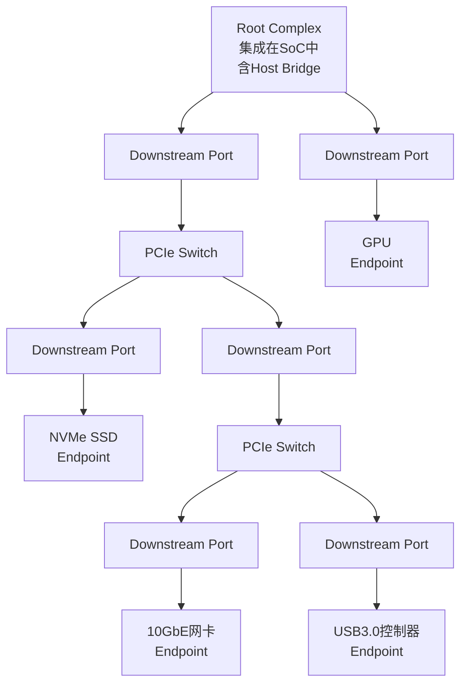

# PCIe基础认知与架构演进

<span class="badge-i">[Intermediate]</span>

<span class="red">PCI Express（PCIe）是点对点的串行差分总线，通过独立Lane的全双工传输替代了传统PCI的并行共享总线架构，实现了高带宽、低延迟、可热插拔的外设互联标准。</span> 从PCI到PCIe的演进，不仅是速度的提升，更是总线架构从并行到串行、从共享到点对点的范式转换。

<br>在嵌入式系统中，PCIe是连接高性能外设（如NVMe SSD、网卡、GPU）的核心总线。理解其架构演进，是掌握现代SoC设计的必经之路。

---

## <strong>基础认知</strong>

<span class="green">PCIe</span> 全称为Peripheral Component Interconnect Express，由PCI-SIG（PCI Special Interest Group）制定标准。它与PCI最本质的区别在于：PCI是并行共享总线，所有设备分时复用地址/数据/控制线；而PCIe是点对点串行链路，每个设备拥有独立的Lane与Root Complex通信。

<br>PCIe采用分层架构，自上而下分为：

| 层级 | 功能 | 类比理解 |
|------|------|----------|
| 事务层（Transaction Layer） | 封装TLP（Transaction Layer Packet），处理请求/完成事务 | 应用层协议 |
| 数据链路层（Data Link Layer） | 可靠传输，ACK/NACK机制、CRC校验、重传 | TCP传输层 |
| 物理层（Physical Layer） | 串并转换、编码、时钟恢复、电气驱动 | 物理介质 |

<br>这种分层设计使得上层协议与底层物理实现解耦。事务层无需关心信号走线，物理层升级（如从Gen3到Gen4）对上层透明。

### <strong>PCI与PCIe核心对比</strong>

<span class="blue">PCI总线的并行架构存在同步困难、信号串扰、引脚过多等问题。</span> PCIe通过串行化解决了这些痛点。

| 特性 | PCI 3.3V/5V | PCIe Gen3 x16 |
|------|-------------|---------------|
| 总线类型 | 并行共享 | 点对点串行 |
| 最大引脚数 | 120+ | 36（x1）/164（x16） |
| 时钟 | 33/66 MHz | 嵌入式时钟（8b/10b编码） |
| 带宽（单向） | 266 MB/s | 15.75 GB/s |
| 传输模式 | 半双工 | 全双工 |
| 仲裁方式 | 总线仲裁 | 无仲裁，独立链路 |
| 热插拔 | 不支持 | 支持（ surprise removal） |
| 错误检测 | 奇偶校验 | CRC + LCRC双重校验 |

<br>PCI的并行总线中，所有设备挂在同一组AD线上，Host必须通过仲裁决定哪个设备当前获得总线使用权。而PCIe中，每个Endpoint通过独立的Link连接到Switch或Root Complex，天然消除了总线竞争。

### <strong>拓扑结构</strong>

<span class="red">PCIe拓扑是一棵由Root Complex为根的树形结构。</span> 典型拓扑包含三类节点：Root Complex（RC）、Switch、Endpoint（EP）。



<br>Root Complex是PCIe树的根节点，通常集成在SoC内部，负责将CPU的内存/IO访问转换为PCIe事务。Switch是路由设备，包含一个Upstream Port和多个Downstream Port，用于扩展总线扇出。Endpoint是叶子节点，即实际的外设设备。

<br><span class="green">BDF（Bus-Device-Function）</span> 三元组用于唯一标识拓扑中的每个功能单元。一个设备最多支持8个Function，每个Function拥有独立的配置空间。

---

## <strong>原理解析</strong>

### <strong>为什么PCIe选择串行而非更宽的并行总线</strong>

<span class="blue">并行总线的瓶颈不在于理论带宽，而在于物理实现。</span> PCI的32位总线在33 MHz下理论带宽为133 MB/s，但实际有效带宽远低于此。原因在于：

<br>第一，并行信号存在skew（偏移）问题。32根数据线长度不可能完全一致，信号到达时间差异在高速下变得不可忽略。当频率超过100 MHz时，skew修正成本急剧上升。

<br>第二，并行信号存在crosstalk（串扰）。相邻导线间的电磁耦合导致信号质量劣化，引脚越多问题越严重。

<br>第三，并行总线需要大量引脚。PCI需要32位地址+32位数据+控制线共120+引脚，而PCIe x1仅需2对差分发送+2对差分接收=4条信号线，加上辅助信号也不超过20条。

<br>PCIe通过串行化将并行总线转换为多条独立的高速Lane，每条Lane以Gbps速率传输。x1/x4/x8/x16等lane数配置让带宽可灵活扩展，同时保持引脚数量的可控性。

### <strong>Lane与Link的全双工传输</strong>

<span class="green">Lane</span> 是PCIe的最小物理传输单元，由一对差分发送线（TX+/-）和一对差分接收线（RX+/-）组成。<span class="green">Link</span> 是两个PCIe端口之间的一组Lane集合。

<br>PCIe采用全双工传输：发送和接收同时在独立的差分对上发生。这意味着x1 Link的理论双向带宽是单向的两倍。例如Gen3 x1的单向带宽为~1 GB/s，双向总吞吐可达~2 GB/s。

<br><span class="blue">Lane数量与引脚数的线性关系是PCIe可扩展的关键。</span> x16配置需要16×4=64条信号线（不含辅助信号），相比PCI的120+引脚，在带宽提升60倍的同时引脚数反而减少。

### <strong>分层架构的数据流</strong>

当CPU需要读取PCIe设备寄存器时，数据流自上而下穿透三层：

<br>1. **事务层**：CPU发出Memory Read请求，事务层封装为MRd TLP，填入目标地址、请求者ID、Tag等字段
<br>2. **数据链路层**：为TLP附加12-bit LCRC和序列号，存入重传缓冲区（Replay Buffer），通过ACK/NAK协议保证可靠传输
<br>3. **物理层**：将字节流串行化，通过8b/10b或128b/130b编码后驱动差分信号

<br>接收端逆向执行：物理层解码→数据链路层CRC校验、序列号检查→事务层解析TLP→提交至设备核心逻辑。

---

## <strong>技术教学</strong>

### <strong>Linux下查看PCIe拓扑与设备信息</strong>

<span class="green">lspci</span> 命令是PCIe设备探测的首选工具，源自pciutils工具包。

```bash
# 以树形结构显示PCIe拓扑
lspci -tv

# 查看特定设备的详细信息（以xx:xx.x为BDF格式）
lspci -vv -s 01:00.0

# 查看PCIe链路速度和Lane数
lspci -vv | grep -E "LnkCap|LnkSta"
```

<br>输出示例中的关键字段解读：

```
LnkCap: Port #0, Speed 8GT/s, Width x4, ASPM L0s L1, Exit Latency L0s <1us
LnkSta: Speed 8GT/s, Width x4, TrErr- Train- SlotClk+ DLActive- ...
```

<br><span class="blue">LnkCap表示链路能力（Capability），LnkSta表示链路当前状态（Status）。</span> 若LnkSta的Width小于LnkCap，说明物理连接存在lane降级（如x4插槽只接了x1的线），这是嵌入式板级设计中的常见问题。

### <strong>PCIe版本与带宽速查</strong>

```bash
# 脚本：批量检查所有PCIe设备的链路协商状态
#!/bin/bash
for dev in $(lspci | awk '{print $1}'); do
    echo "=== Device $dev ==="
    lspci -vv -s "$dev" 2>/dev/null | grep -E "LnkCap|LnkSta|Speed|Width"
done
```

<br>Gen1到Gen6的编码与速率对比：

| 版本 | 编码方式 | 线速率 | x1单向带宽 | x16单向带宽 |
|------|----------|--------|------------|-------------|
| Gen1 | 8b/10b | 2.5 GT/s | ~250 MB/s | ~4 GB/s |
| Gen2 | 8b/10b | 5.0 GT/s | ~500 MB/s | ~8 GB/s |
| Gen3 | 128b/130b | 8.0 GT/s | ~1 GB/s | ~16 GB/s |
| Gen4 | 128b/130b | 16.0 GT/s | ~2 GB/s | ~32 GB/s |
| Gen5 | 128b/130b | 32.0 GT/s | ~4 GB/s | ~64 GB/s |
| Gen6 | PAM4 1b/1b | 64.0 GT/s | ~8 GB/s | ~128 GB/s |

<br><span class="blue">注意：GT/s是Giga Transfers per second，不等于GByte/s。</span> 编码开销（如8b/10b有20%开销）和协议开销使实际有效带宽低于线速率。

---

## <strong>软硬件实战</strong>

### <strong>场景一：ARM SoC中确认PCIe控制器与RC配置</strong>

在嵌入式Linux中，PCIe Root Complex通常集成在SoC内部。以Rockchip RK3588为例，其PCIe3.0控制器通过设备树（Device Tree）描述：

```dts
// arch/arm64/boot/dts/rockchip/rk3588.dtsi
pcie3x4: pcie@fe150000 {
    compatible = "rockchip,rk3588-pcie";
    reg = <0x0 0xfe150000 0x0 0x10000>,   /* DWC core registers */
          <0x0 0xfe800000 0x0 0x100000>;  /* Configuration Space */
    reg-names = "pcie-dbi", "config";
    bus-range = <0x0 0xf>;                  /* 支持16条Bus */
    max-link-speed = <3>;                   /* Gen3 (8GT/s) */
    num-lanes = <4>;                        /* x4 Lane配置 */
    msi-parent = <&its_gic>;                /* MSI中断父节点 */
    #address-cells = <3>;
    #size-cells = <2>;
    ranges = <0x83000000 0x0 0x40000000 0x0 0x40000000 0x0 0x40000000>;
    /* 0x83000000 = Memory空间 + prefetchable */
};
```

<br><span class="blue">ranges属性的含义需结合PCI地址格式理解。</span> 第一个cell（0x83000000）的高8位0x83表示prefetchable内存空间，其余字段分别代表PCI总线地址、CPU物理地址和长度。错误配置ranges会导致设备BAR映射失败。

### <strong>场景二：排查PCIe链路协商降速问题</strong>

嵌入式系统中，PCB走线质量、时钟源抖动、连接器接触不良均可能导致链路降速协商。某项目中x4 SSD插槽只能以Gen1 x1运行：

```bash
# 步骤1：确认当前协商状态
$ lspci -vv -s 02:00.0 | grep -A2 "LnkSta"
LnkSta:	Speed 2.5GT/s (downgraded), Width x1 (downgraded)
	TrErr- Train- SlotClk+ DLActive- BWMgmt- ABWMgmt-

# 步骤2：读取链路训练状态（LTSSM）——需要内核调试支持
# 通过debugfs查看LTSSM状态（部分驱动支持）
cat /sys/kernel/debug/pcie/debug/status

# 步骤3：强制重训练至目标速度（临时测试）
echo 2 > /sys/bus/pci/devices/0000:02:00.0/link/target_speed
# 然后触发重训练
echo 1 > /sys/bus/pci/devices/0000:02:00.0/link/retrain
```

<br>降速根因分析流程：

<br>1. 检查硬件：确认BOM是否匹配目标速率，Gen3+需要更高质量的PCB板材和连接器
<br>2. 检查时钟：PCIe REFCLK的抖动容限在Gen3下为1 ps RMS，劣质晶振会触发Fallback
<br>3. 检查固件：部分RC需要更新PHY固件才能支持Gen3/Gen4
<br>4. 检查信号完整性：用示波器测量眼图，确认插入损耗和回波损耗达标

---

## <strong>历史演进</strong>

<span class="red">PCIe的演进史是一部串行总线不断提速、编码效率持续优化的工程传奇。</span>

<br>2003年，PCI-SIG发布PCIe 1.0，以2.5 GT/s的线速率和8b/10b编码正式取代并行PCI。8b/10b编码虽保证了足够的跳变密度用于时钟恢复，但20%的开销限制了有效带宽。

<br>2007年，PCIe 2.0将线速率翻倍至5.0 GT/s，编码方式不变。这一代是简单的"频率提升"，为市场争取了时间。

<br>2010年，PCIe 3.0是技术分水岭。线速率提升至8.0 GT/s的同时，编码从8b/10b切换到128b/130b，编码开销从20%骤降至1.54%。这一改变使得Gen3的单Lane有效带宽首次突破1 GB/s。128b/130b编码引入了Scrambler（扰码器）替代前代编码的DC平衡功能，同时保持足够的信号跳变。

<br>2017年，PCIe 4.0线速率再次翻倍至16.0 GT/s。此时信号完整性成为最大挑战，PCI-SIG引入了更严格的电气规范和抖动预算。在嵌入式领域，Gen4的普及相对缓慢，因为PCB成本显著上升。

<br>2019年，PCIe 5.0达到32.0 GT/s。此时NRZ（Non-Return-to-Zero）编码的物理极限开始显现，眼图裕量急剧收窄。

<br>2022年，PCIe 6.0彻底转向PAM4（Pulse Amplitude Modulation 4-level）信号调制，每符号传输2 bit数据，线速率达64.0 GT/s。同时引入了FLIT（Fixed Latency Interface Transmission）模式替代传统TLP流式传输，配合轻量级FEC（Forward Error Correction）纠错。这是PCIe架构自诞生以来最深刻的物理层变革。

<br><span class="purple">CXL（Compute Express Link）协议基于PCIe 5.0/6.0物理层构建，在缓存一致性（cache coherency）和内存扩展方向上延伸了PCIe生态，是未来数据中心和高端嵌入式系统的重要演进方向。</span>

---

## 小结与练习

| 要点 | 说明 |
|------|------|
| 核心概念 | PCIe是点对点串行差分总线，三层架构（事务层/数据链路层/物理层）实现协议与物理解耦 |
| 关键技能 | 掌握lspci工具解读链路状态，理解BDF寻址与拓扑树形结构 |
| 常见误区 | 误将GT/s等同于GB/s（编码开销需扣除）；忽视LnkSta与LnkCap的差异 |
| 版本演进 | Gen1→Gen3的编码变革（8b/10b→128b/130b）是关键分水岭；Gen6引入PAM4和FLIT |
| 设计要点 | Lane数配置需匹配PCB走线能力；REFCLK质量直接决定最高可达Gen速率 |

**练习**

1. 某设备LnkCap显示Gen3 x4，但LnkSta显示Gen2 x2。列出至少3种可能原因并给出排查优先级。

2. 解释为什么PCIe Gen3在8 GT/s线速率下单Lane有效带宽约为1 GB/s而非1 GB/s（精确计算128b/130b编码的实际效率并扣除协议开销）。

3. 对比CXL与PCIe的关系：CXL是基于PCIe物理层还是独立物理层？CXL协议在哪些方面扩展了PCIe的能力（至少列举2个方向）？
