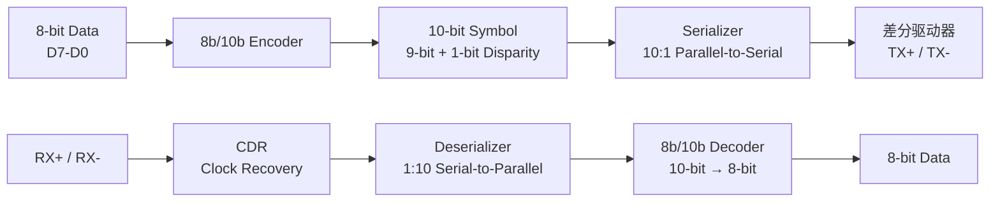

# PCIe物理层与电气规范

<span class="badge-i">[Intermediate]</span>

<span class="red">PCIe物理层负责比特流的串并转换、时钟嵌入、信号编码与电气驱动，通过差分信号对实现高速、低噪声的全双工数据传输。</span> 物理层的设计直接决定了PCIe链路的最高速率、信号完整性和功耗表现，是理解PCIe的硬件基础。

<br>物理层分为两个子层：逻辑子层（Physical Layer Logical，PLL）负责编码/解码、字节对齐、链路训练状态机（LTSSM）；电气子层（Physical Layer Electrical，PLE）负责驱动器、接收器、时钟恢复电路和阻抗匹配。

---

## <strong>基础认知</strong>

<span class="green">Lane</span> 是PCIe的最小物理传输单元，由两对差分线组成：TX+/-（发送）和RX+/-（接收）。多Lane设备（如x4、x8）的所有Lane以相同的速率同时工作，实现带宽的线性扩展。

<br><span class="blue">差分信号是PCIe抗干扰能力的核心。</span> 差分对传输互为反相的两个信号，接收端检测两者的电压差。共模噪声（同时作用于两根线的噪声）在差分检测中被抵消。这使得PCIe能在低电压摆幅（800 mV峰值）下实现高速传输。

### <strong>Lane与Link的定义</strong>

| 术语 | 定义 | 组成 |
|------|------|------|
| Symbol | 物理层传输的最小编码单元 | Gen1/2：10-bit Symbol；Gen3+：1-bit Symbol（128b/130b） |
| Lane | 一对差分发送+一对差分接收 | TX+、TX-、RX+、RX-，共4条信号线 |
| Link | 两个PCIe端口之间的Lane集合 | x1 Link含1 Lane；x16 Link含16 Lane |
| PHY | 物理层收发器集成电路 | 每个Lane对应一个独立的PHY通道 |

<br>Lane的绑定遵循严格的极性规则。在正常连接中，A端的TX必须连接到B端的RX，反之亦然。PCIe规范定义了极性翻转（Polarity Inversion）和Lane翻转（Lane Reversal）机制，允许PCB走线交叉时仍自动协商建立正确链路。

### <strong>差分信号的电气基础</strong>

PCIe使用AC耦合的差分信令（AC-Coupled Differential Signaling）。发送端通过电容耦合驱动差分对，消除了DC分量，接收端使用终端电阻（100 Ω差分匹配）吸收信号能量。

<br>Gen1/Gen2的电压摆幅（V<sub>id</sub>，差分输入电压）典型值为800 mV峰峰值，最小检测门限为175 mV。Gen3+由于速率翻倍，电压摆幅降低至约600 mV峰峰值，对信号完整性要求更苛刻。

<br><span class="blue">AC耦合电容的容值直接影响低频截止频率。</span> 容值过小会导致长串0/1的基线漂移（Baseline Wander）；容值过大增加面积和成本。PCIe规范要求AC耦合电容为75 nF至200 nF，典型值100 nF。

---

## <strong>原理解析</strong>

### <strong>为什么PCIe需要嵌入式时钟编码</strong>

<span class="blue">高速串行链路中，独立的时钟线无法与数据线保持精确的相位关系。</span> 信号经过PCB走线、连接器、线缆后，数据与时钟的传播延迟差异（skew）随频率升高而恶化。当skew超过半个UI（Unit Interval，即一个比特周期）时，接收端将无法正确采样。

<br>PCIe采用嵌入式时钟策略：将时钟信息编码到数据流中，接收端通过CDR（Clock Data Recovery）电路从数据中恢复时钟。这消除了发送端与接收端之间的时钟布线约束。

<br>CDR的核心是PLL（Phase-Locked Loop）环路。接收端PLL不断调整本地振荡器相位，使其与输入数据的跳变沿对齐。若数据流出现长串0或长串1，跳变消失，PLL将失去锁定参考。因此编码方案必须保证足够的跳变密度。

### <strong>8b/10b编码机制（Gen1/Gen2）</strong>

<span class="green">8b/10b编码</span> 由IBM于1983年发明，PCIe Gen1/Gen2沿用此方案。每8-bit数据映射为一个10-bit Symbol，保证：

<br>1. **DC平衡**：每个Symbol中0和1的数量差（Disparity）不超过±2，累计Disparity被跟踪并控制在有限范围内。这避免了AC耦合电容上的电荷积累导致的基线漂移。
<br>2. **跳变密度**：每10-bit Symbol至少有3次跳变，确保CDR能够持续锁定。
<br>3. **控制符号**：部分10-bit Symbol被定义为控制字（如COMMA、SKP、SDP），用于链路训练、时钟补偿和包定界。



<br>编码开销为20%（每10-bit Symbol只有8-bit有效数据）。Gen1的2.5 GT/s线速率下，有效带宽为2.5 × (8/10) = 2.0 Gbps ≈ 250 MB/s每Lane。

### <strong>128b/130b编码机制（Gen3+）</strong>

<span class="blue">Gen3的速率从5 GT/s跃升至8 GT/s，若继续使用8b/10b，20%编码开销将使有效带宽增长远低于线速率增长。</span> PCI-SIG在Gen3引入128b/130b编码，将开销降至1.54%。

<br>128b/130b不再对每字节独立编码，而是以128-bit数据块为单位，仅在块首附加2-bit Sync Header（01b表示数据块，10b表示Ordered Set块）。128-bit数据本身不做线路编码，而是送入Scrambler进行伪随机化。

<br><span class="green">Scrambler（扰码器）</span> 使用LFSR（Linear Feedback Shift Register）生成伪随机序列并与数据XOR。扰码后的数据具有统计意义上的DC平衡和跳变密度，无需额外的比特开销。Gen3使用16阶LFSR，多项式为G(x) = x<sup>16</sup> + x<sup>5</sup> + x<sup>4</sup> + x<sup>3</sup> + 1。

<br>Sync Header的设计 intentionally 使用2-bit而非更多，因为130-bit块在8 GT/s下的UI约为97 ps，任何额外开销都会显著降低效率。2-bit Header提供：
<br>- 块边界对齐标记（比Gen1/2的COMMA更简洁）
<br>- 数据块 vs Ordered Set块的区分
<br>- 足够的跳变（01/10本身含跳变）支持CDR

### <strong>Ordered Set与链路控制</strong>

Ordered Set是物理层在训练、时钟补偿和电源管理中使用的特殊控制序列。Gen1/2的Ordered Set由1个COMMA Symbol + 3个Data Symbol组成；Gen3+的Ordered Set嵌入在128b/130b的Ordered Set块中。

<br>关键Ordered Set类型：

| Ordered Set | 功能 | 出现场景 |
|-------------|------|----------|
| TS1/TS2（Training Sequence） | 链路训练，交换参数 | LTSSM的Polling/Configuration状态 |
| SKP Ordered Set | 时钟补偿，弹性缓冲区管理 | 周期性插入，补偿时钟频偏 |
| EIOS（Electrical Idle Ordered Set） | 进入低功耗状态 | L0s/L1电源状态入口 |
| EIEOS（Exit Electrical Idle OS） | 退出低功耗状态 | 从L0s/L1唤醒 |
| SDS（Start Data Stream） | 数据流起始标记 | 进入L0状态后首次发送 |

<br><span class="blue">SKP Ordered Set是解决收发端时钟频偏的关键机制。</span> 发送端和接收端使用独立晶振，存在±300 ppm的频差。若无补偿，弹性缓冲区（Elastic Buffer）将逐渐溢出或下溢。SKP定期插入，接收端可根据缓冲区水位决定删除或保留SKP Symbol，实现时钟域平滑过渡。

---

## <strong>技术教学</strong>

### <strong>使用示波器测量PCIe信号完整性</strong>

```bash
# 软件辅助：读取PCIe PHY寄存器获取眼图信息（部分平台支持）
# 以Intel平台为例，通过内核调试接口读取SerDes状态
sudo cat /sys/kernel/debug/intel_pmc_core/pcie/eye_diag 2>/dev/null || \
    echo "Eye diagram debugfs not available"

# 查看PHY固件版本（某些PCIe控制器支持）
sudo lspci -vv -s 00:01.0 | grep -i "phy\|firmware"
```

<br>硬件测量要点：
<br>1. 使用差分探头（≥8 GHz带宽）探测SMA测试点或PCB焊盘
<br>2. 眼图模板测试（Eye Mask Test）：Gen3要求眼图高度≥25 mV，宽度≥0.3 UI
<br>3. 插入损耗（Insertion Loss）：Gen3要求8 GHz下≤-20 dB
<br>4. 回波损耗（Return Loss）：Gen3要求≥12 dB

### <strong>编码效率的量化计算</strong>

```c
/* PCIe各代编码效率计算 */
#include <stdio.h>

int main() {
    // Gen1/Gen2: 8b/10b
    double gen1_rate = 2.5;   // GT/s
    double gen1_eff  = 8.0 / 10.0;
    double gen1_bw   = gen1_rate * gen1_eff / 8.0;  // GB/s per lane
    printf("Gen1 x1: %.3f GT/s * %.0f%% = %.3f GB/s\n",
           gen1_rate, gen1_eff * 100, gen1_bw);

    // Gen3/Gen4/Gen5: 128b/130b
    double gen3_rate = 8.0;
    double gen3_eff  = 128.0 / 130.0;
    double gen3_bw   = gen3_rate * gen3_eff / 8.0;
    printf("Gen3 x1: %.3f GT/s * %.2f%% = %.3f GB/s\n",
           gen3_rate, gen3_eff * 100, gen3_bw);

    // Gen6: PAM4 + 1b/1b with FEC overhead
    double gen6_rate = 64.0;
    double gen6_eff  = 1.0;  // 1b/1b no encoding overhead
    double fec_oh    = 0.9375; // FLIT with FEC, 242/256 data
    double gen6_bw   = gen6_rate * gen6_eff * fec_oh / 8.0;
    printf("Gen6 x1: %.3f GT/s * %.2f%%(FEC) = %.3f GB/s\n",
           gen6_rate, fec_oh * 100, gen6_bw);

    return 0;
}
```

<br><span class="blue">Gen6的PAM4信号虽然每UI传输2 bit，但SNR需求更高，需要FEC补偿误码。</span> 因此不能简单按2×NRZ速率计算，需考虑FEC带来的约6%额外开销。

---

## <strong>软硬件实战</strong>

### <strong>场景一：嵌入式板级设计中PCIe REFCLK布局与抖动要求</strong>

PCIe REFCLK是100 MHz差分时钟，为链路的收发两端提供频率基准。REFCLK的抖动（Jitter）直接决定链路的BER（Bit Error Rate）。

```
        ┌──────────────────────────────────────┐
        │              SoC (Root Complex)      │
        │  ┌──────────┐      ┌──────────┐     │
        │  │  REFCLK  │──────│ PCIe PHY │     │
        │  │  Buffer  │      │          │     │
        │  └──────────┘      └──────────┘     │
        │         │                          │
        │    ┌────┴────┐                     │
        │    │ 100MHz  │←── 外部晶振输入      │
        │    │  HCSL   │                     │
        │    └─────────┘                     │
        └──────────────────────────────────────┘
                      │
                ┌─────┴─────┐
                │ 100Ω差分  │  ← PCB走线：等长、
                │  AC耦合   │    阻抗85-100Ω
                └─────┬─────┘
                      │
        ┌─────────────┴──────────────────────┐
        │         NVMe SSD (Endpoint)        │
        │      ┌──────────┐                 │
        │      │ PCIe PHY │                 │
        │      └──────────┘                 │
        └──────────────────────────────────────┘
```

<br>关键设计约束：
<br>1. **抖动容限**：Gen3要求RMS相位抖动<1 ps（12 kHz~20 MHz积分），Gen5要求<0.5 ps
<br>2. **展频时钟（SSC）**：PCIe支持0.5%向下展频以降低EMI，但要求收发两端SSC模式一致（同展频或同非展频）
<br>3. **独立时钟（SRNS）**：部分低功耗场景支持无REFCLK的独立时钟模式，但兼容性受限

### <strong>场景二：通过寄存器读取PCIe PHY链路状态</strong>

在裸机或RTOS环境中，调试PCIe PHY需要直接访问内部寄存器。以Synopsys DesignWare PCIe IP为例：

```c
/* 读取PCIe PHY链路状态 — 基于DWC PCIe v4.70 */
#include <stdint.h>

/* PHY register base通过RC的DBI接口访问 */
#define PCIE_PHY_BASE   0xFD000000
#define PHY_LINK_STAT   (PCIE_PHY_BASE + 0x718) /* PHY Status Register */
#define PHY_LANE_SKEW   (PCIE_PHY_BASE + 0x71C) /* Lane Deskew Status */

/* 链路状态字段位定义 */
#define PHY_LINK_UP     (1 << 0)
#define PHY_LINK_SPEED  (0x7 << 1)  /* 001=Gen1, 010=Gen2, 011=Gen3 */
#define PHY_LINK_WIDTH  (0x3F << 4) /* 000001=x1, 000100=x4 */

uint32_t read_link_status(void) {
    volatile uint32_t *stat = (uint32_t *)PHY_LINK_STAT;
    uint32_t val = *stat;

    printf("PHY Link Status: 0x%08X\n", val);
    printf("  Link Up: %s\n", (val & PHY_LINK_UP) ? "YES" : "NO");

    uint32_t speed = (val & PHY_LINK_SPEED) >> 1;
    const char *speed_str[] = {"", "Gen1", "Gen2", "Gen3", "Gen4", "Gen5", "Gen6"};
    printf("  Negotiated Speed: %s\n", speed_str[speed]);

    uint32_t width = (val & PHY_LINK_WIDTH) >> 4;
    printf("  Negotiated Width: x%d\n", width);

    return val;
}

/* 检查Lane deskew状态 — 多Lane链路必须完成deskew才能正常传输 */
void check_lane_deskew(void) {
    volatile uint32_t *skew = (uint32_t *)PHY_LANE_SKEW;
    uint32_t val = *skew;
    printf("Lane Deskew Status: 0x%08X\n", val);

    for (int i = 0; i < 4; i++) {
        int deskew_done = (val >> (8 + i)) & 1;
        printf("  Lane %d Deskew: %s\n", i, deskew_done ? "OK" : "PENDING");
    }
}
```

<br><span class="blue">Lane Deskew是多Lane链路训练的关键步骤。</span> 各Lane的走线长度差异导致信号到达时间不同，接收端必须对齐各Lane的Symbol边界。Deskew未完成时，即使单个Lane正常，整个Link也无法进入L0。

---

## <strong>历史演进</strong>

<span class="red">PCIe物理层的演进史，本质是一部对抗信号衰减、不断突破NRZ极限的工程史。</span>

<br>PCIe Gen1（2003）和Gen2（2007）使用成熟的8b/10b编码，这是从InfiniBand和Fibre Channel借鉴的方案。20%的编码开销在当时是可接受的代价，因为它提供了无条件的DC平衡和跳变密度。

<br>Gen3（2010）面临关键抉择：线速率从5 GT/s提升至8 GT/s，若沿用8b/10b，有效带宽增长仅为(8/5)×(8/10)/(5/2.5×8/10)=1.6倍，而非线速率倍率1.6倍。实际上，PCI-SIG选择了更激进的方案——128b/130b，使有效带宽增长与线速率增长一致。这一决策使Gen3 x16的带宽首次突破15 GB/s，足以应对当时的高端GPU需求。

<br>Gen4（2017）和Gen5（2019）延续128b/130b，NRZ信号调制达到32 GT/s。此时接收端的眼图几乎闭合，需要DFE（Decision Feedback Equalization）和CTLE（Continuous Time Linear Equalizer）配合才能恢复信号。

<br>Gen6（2022）是物理层的范式转换。NRZ在32 GT/s下每UI仅31.25 ps，继续提速的功耗和信号完整性代价不可承受。PAM4将每UI传输的比特数翻倍，以64 GT/s的线速率实现等效128 GT/s的NRZ带宽。代价是SNR降低9.5 dB，需要FEC纠错和更复杂的接收端均衡。FLIT模式将数据包切分为固定长度块，简化了FEC和链路重传的设计。

<br><span class="purple">PCIe 7.0（预计2025年发布）计划将线速率提升至128 GT/s，继续基于PAM4并引入更先进的FEC和均衡算法。CXL 3.0基于PCIe 6.0/7.0物理层，将推动缓存一致性互联进入新的性能层级。</span>

---

## 小结与练习

| 要点 | 说明 |
|------|------|
| 核心概念 | Lane由TX+/-和RX+/-差分对组成；Link是两端Lane的集合；物理层分为逻辑子层和电气子层 |
| 关键技能 | 理解8b/10b与128b/130b编码原理，掌握CDR和弹性缓冲区的工作机制 |
| 常见误区 | 混淆GT/s与GB/s；忽视REFCLK抖动对链路协商的影响；忽略SKP Ordered Set的时钟补偿作用 |
| 编码演进 | Gen1/2: 8b/10b（20%开销）；Gen3+: 128b/130b（1.54%开销）；Gen6: PAM4 + FLIT |
| 设计约束 | Gen3 REFCLK抖动<1 ps；AC耦合电容100 nF；差分阻抗100 Ω；Lane deskew必须完成 |

**练习**

1. 某嵌入式板卡使用Gen3 x4 SSD，实测传输速率仅为2.5 GB/s（理论值~4 GB/s）。列出物理层可能的3个瓶颈原因，并说明如何通过lspci和寄存器读取区分是链路降速还是协议层问题。

2. 128b/130b编码中的Scrambler与8b/10b编码的DC平衡机制有何本质区别？为什么Gen3+不再需要对每个字节做显式编码，而Gen1/2必须这样做？

3. Gen6引入PAM4调制后，相比NRZ的眼图高度预计降低多少dB？为什么这要求引入FEC？请估算PAM4在相同发射功率下BER相对于NRZ的变化趋势。
