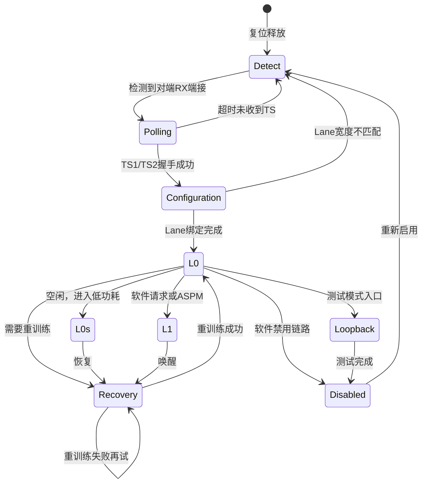

# PCIe链路训练与LTSSM状态机

<span class="badge-i">[Intermediate]</span>

<span class="red">链路训练状态机（LTSSM，Link Training and Status State Machine）是PCIe物理层的核心控制逻辑，负责从设备上电到链路完全就绪的全流程管理，包括速率协商、Lane宽度协商、极性检测和位锁定。</span> LTSSM的正确运行是PCIe设备正常通信的前提，任何状态的异常滞留都会导致链路无法建立。

<br>LTSSM包含11个主要状态，分为5个阶段：检测与发现、训练与协商、配置与绑定、正常工作和低功耗管理。理解每个状态的进入条件和退出条件，是排查链路故障的关键。

---

## <strong>基础认知</strong>

<span class="green">LTSSM</span> 是物理层逻辑子层的核心状态机，以Ordered Set为状态转换的握手信令。每个状态定义了允许发送和接收的Ordered Set类型，以及超时条件和错误处理策略。

<br>PCIe链路训练的本质是两端PHY的"握手"过程：检测对端存在→协商最高共同速率→确定Lane数量→对齐各Lane的极性和位边界→进入正常工作状态。

### <strong>LTSSM状态概览</strong>



<br>LTSSM的5个阶段划分：

| 阶段 | 包含状态 | 核心任务 |
|------|----------|----------|
| 检测阶段 | Detect | 检测对端是否存在，判断RX端接状态 |
| 轮询阶段 | Polling | 速率协商，Bit Lock，Symbol Lock/Block Lock |
| 配置阶段 | Configuration | Lane数量协商，Polarity翻转检测，Lane Reversal |
| 工作阶段 | L0 | 正常收发TLP/DLLP |
| 低功耗阶段 | L0s, L1, L2/L3 | 按需降功耗，保持链路上下文 |

---

## <strong>原理解析</strong>

### <strong>为什么链路训练需要分阶段进行</strong>

<span class="blue">链路训练是一个"由粗到细"的逐步协商过程，每一阶段建立的前提依赖前一阶段的成果。</span> 试图在单一步骤中完成所有协商将使状态空间爆炸，增加设计复杂度和失败概率。

<br>Detect阶段回答最基本的问题："对端是否存在？"通过检测RX端的端接电阻（Receiver Detection）实现。发送端驱动一个已知电压并观察RC时间常数：若对端存在，寄生电容较大，电压衰减慢；若对端未连接，衰加快。此阶段不需要时钟同步，甚至不需要对端供电。

<br>Polling阶段建立最基础的通信能力："我们以什么速率通信？"两端从最低速率（Gen1 2.5 GT/s）开始，互相发送TS1/TS2 Ordered Set，交换Link/Lane编号、支持的速率、Lane数量等信息。Bit Lock和Symbol Lock在此阶段完成——接收端CDR锁定数据时钟，并找到Symbol边界。

<br>Configuration阶段解决多Lane的协同问题："哪些Lane可用？它们的极性对吗？"在多Lane链路中，可能存在PCB布线交叉导致Lane顺序颠倒，或极性接反。PCIe支持Lane Reversal和Polarity Inversion，通过比较TS中的Link/Lane编号自动协商正确的映射关系。

### <strong>Detect状态：RX端接检测原理</strong>

当PCIe链路复位释放后，LTSSM首先进入Detect状态。此时发送端尚未驱动正常数据，而是执行Receiver Detection序列：

<br>1. 发送端将TX输出切换到高阻抗态
<br>2. 驱动一个短暂的充电脉冲到TX+
<br>3. 观察TX+电压的衰减曲线
<br>4. 若对端RX存在，其AC耦合电容和输入阻抗形成较大的RC常数，电压衰减慢
<br>5. 若对端未连接，仅PCB寄生电容，电压衰减快

<br><span class="blue">Detect.Active子状态中，若在12 ms超时内检测到对端存在，则进入Polling；否则返回Detect.Quiet并周期性重试。</span> 某些嵌入式平台的PCIe控制器在上电时序不当会导致Detect阶段反复超时，典型原因是Endpoint的电源或REFCLK晚于RC启动。

### <strong>Polling状态：速率协商与锁定</strong>

Polling状态包含两个子状态：Polling.Active和Polling.Configuration。

<br>在Polling.Active中，两端以Gen1速率（2.5 GT/s）持续发送TS1 Ordered Set。TS1包含以下关键字段：

| 字段 | 大小 | 含义 |
|------|------|------|
| Link Number | 8-bit | 链路标识，Switch下游端口固定为0 |
| Lane Number | 8-bit | 当前Lane在Link中的编号 |
| Rate ID | 8-bit | 支持的速率位图（bit0=Gen1, bit1=Gen2...） |
| Training Control | 8-bit | 链路控制标志（Loopback、Disable、Hot Reset等） |
| TS1 ID | 8-bit | 固定为0x4A，用于识别Ordered Set类型 |

<br><span class="green">Bit Lock</span> 是指接收端CDR锁定输入数据的相位，能稳定采样每个bit。<span class="green">Symbol Lock/Block Lock</span> 是指找到Symbol或Block的边界。对于Gen1/2，需要识别COMMA Symbol（0xBC，K28.5）以确定10-bit Symbol边界；对于Gen3+，需要识别Sync Header（01b/10b）以确定130-bit Block边界。

<br>Polling.Configuration子状态中，双方确认已收到连续的TS1/TS2，交换的Link/Lane编号一致。收到8个连续的TS2后，LTSSM进入Configuration。

### <strong>Configuration状态：Lane绑定与极性协商</strong>

Configuration状态包含多个子状态，处理多Lane链路的核心配置：

<br>1. **Configuration.Linkwidth.Start**：主端（Downstream Port）发送TS1，Link Number=0，Lane Number=集合（如x4链路发送Lane 0,1,2,3）
<br>2. **Configuration.Linkwidth.Accept**：从端（Upstream Port）回复TS1，Link Number=接收到的值，Lane Number报告其检测到的Lane集合
<br>3. **Configuration.Lanenum.Wait**：主端发送TS1，Lane Number改为从端报告的交集
<br>4. **Configuration.Lanenum.Accept**：从端确认Lane Number匹配
<br>5. **Configuration.Complete**：双方发送TS2，最终确认配置

<br><span class="blue">Polarity Inversion检测在此阶段自动完成。</span> 若某Lane的TX+/-极性与对端RX+/-接反，接收端检测到的数据将是反相的。PCIe通过在TS1/TS2中加入极性指示位，接收端发现Polarity Inversion后会自动翻转采样逻辑。

<br>Lane Reversal机制允许PCB布线时将Lane顺序交叉。例如主端期望Lane 0→1→2→3，但PCB实际连接为3→2→1→0。从端通过比较发送和接收的Lane Number，自动调整内部映射。

### <strong>L0状态与Recovery</strong>

L0是PCIe链路的正常工作状态，TLP和DLLP在此状态下自由传输。进入L0后，物理层向上层报告Link Up事件，数据链路层开始发送ACK/NAK和Flow Control更新。

<br>Recovery状态用于链路重训练，触发条件包括：
<br>1. 链路出现不可恢复的误码（如连续CRC错误）
<br>2. 软件请求改变链路速率或宽度
<br>3. 从L0s/L1低功耗状态唤醒后需要重新锁定
<br>4. 收到来自对端的Recovery请求

<br><span class="blue">Recovery状态不同于从Detect开始的完整训练，它保留了速率协商的结果，仅需重新建立Bit/Symbol Lock和Deskew。</span> 因此Recovery耗时通常短于完整训练。

---

## <strong>技术教学</strong>

### <strong>Linux下查看LTSSM状态</strong>

```bash
# 方法1：通过debugfs（需内核CONFIG_PCIE_DEBUG=y）
find /sys/kernel/debug -name "*pcie*" -type d 2>/dev/null

# 方法2：读取ASPM和链路状态（通用）
lspci -vv -s 00:01.0 | grep -E "ASPM|LnkCtl|LnkCap|LnkSta"

# 方法3：使用setpci直接读取配置空间链路能力寄存器
# 读取链路状态寄存器（偏移0x12在链路能力块中，需先定位能力指针）
sudo setpci -s 00:01.0 0x82.b    # 读取Link Capabilities低字节
sudo setpci -s 00:01.0 0x92.b    # 读取Link Status低字节（具体偏移因设备而异）
```

<br>链路控制寄存器关键位：

| 位域 | 名称 | 功能 |
|------|------|------|
| [1:0] | ASPM Control | 00=Disabled, 01=L0s Enabled, 10=L1 Enabled, 11=Both |
| [4]   | Retrain Link | 写1触发链路重训练（自动清0） |
| [6]   | Common Clock | 1=使用公共REFCLK，0=异步时钟 |
| [8]   | Extended Synch | 1=扩展同步（增加TS间隔，利于调试） |

<br><span class="blue">通过设置Retrain Link位（bit4）可强制触发Recovery重训练，用于排查链路稳定性问题。</span>

### <strong>LTSSM调试脚本</strong>

```bash
#!/bin/bash
# pcie_link_diag.sh — PCIe链路诊断脚本

DEV="${1:-00:01.0}"

echo "=== PCIe Link Diagnostics for $DEV ==="
echo "--- Link Capabilities ---"
lspci -vv -s "$DEV" | grep -A5 "LnkCap"

echo "--- Link Status ---"
lspci -vv -s "$DEV" | grep -A5 "LnkSta"

echo "--- Link Control ---"
lspci -vv -s "$DEV" | grep -A5 "LnkCtl"

echo "--- ASPM Status ---"
lspci -vv -s "$DEV" | grep -A2 "ASPM"

echo "--- Device Power Management ---"
cat /sys/bus/pci/devices/0000:$DEV/power/control 2>/dev/null

# 触发重训练并观察
echo "--- Triggering Link Retrain ---"
echo "Before: $(lspci -vv -s "$DEV" | grep LnkSta | head -1)"
# 需要root权限写入配置空间
# sudo setpci -s "$DEV" 0x90.b=0x20:0x20  # 设置Retrain Link bit
sleep 1
echo "After:  $(lspci -vv -s "$DEV" | grep LnkSta | head -1)"
```

---

## <strong>软硬件实战</strong>

### <strong>场景一：排查嵌入式设备PCIe链路反复训练失败</strong>

某ARM SoC开发板上的NVMe SSD在冷启动时偶尔无法识别，dmesg显示：

```
pcieport 0000:00:01.0: pciehp: Slot(1): Link Down event
pcieport 0000:00:01.0: Refused to change power state..."
```

<br>排查流程：

```bash
# 步骤1：查看LTSSM是否卡在Detect
dmesg | grep -i "pcie\|pci"
# 若反复出现"Link Up"和"Link Down"交替，说明训练不稳定

# 步骤2：检查REFCLK稳定性
# 使用示波器测量REFCLK抖动，确认是否满足Gen3 < 1 ps RMS要求

# 步骤3：检查电源时序
# 确认Endpoint（SSD）的3.3V/aux电源是否在PERST#释放前稳定
# 典型要求：PERST# deassert时，Endpoint电源和REFCLK均已稳定100ms+

# 步骤4：固件层面增加 training timeout
# 在设备树中增加link-up-delay-ms
```

```dts
/* 设备树增加链路训练延时 */
pcie@fe150000 {
    /* ... 其他属性 ... */
    link-up-delay-ms = <200>;  /* 默认100ms，增加到200ms */
    num-lanes = <4>;
};
```

<br><span class="blue">PERST#（PCIe Reset）信号是LTSSM的硬件触发器。</span> PERST# asserted时，设备必须进入LTSSM的Detect状态。若PERST#释放时Endpoint尚未完成内部初始化，LTSSM可能卡在Polling或Configuration。适当延长link-up-delay-ms是嵌入式平台常见的解决方案。

### <strong>场景二：通过设备树配置PCIe链路速率和ASPM策略</strong>

```dts
/* Rockchip平台示例：限制PCIe为Gen2并配置ASPM */
&pcie3x4 {
    max-link-speed = <2>;        /* 限制为Gen2 (5GT/s) */
    num-lanes = <4>;
    
    /* ASPM配置 */
    aspm-no-l0s;                 /* 禁用L0s，仅使用L1 */
    
    /* 针对特定Endpoint的电源管理 */
    ep-dev {
        compatible = "nvme-ssd";
        power-domains = <&power_pcie>;
    };
};
```

<br>某些SSD在L0s下存在唤醒延迟过长的问题，禁用L0s（强制使用L1或完全禁用ASPM）可避免性能抖动。L0s的进入/退出时间通常在纳秒级，但对延迟敏感的应用（如实时数据采集）仍可能构成问题。

---

## <strong>历史演进</strong>

<span class="red">LTSSM自PCIe 1.0以来保持核心框架稳定，但每个新版本都增加了与速率协商和信号完整性相关的状态扩展。</span>

<br>PCIe 1.0的LTSSM定义了Detect、Polling、Configuration、L0、L0s、L1、L2/L3 Ready、Disabled、Loopback和Hot Reset状态。这一框架沿用至今，证明了分层状态机设计的生命力。

<br>PCIe 2.0在Polling和Recovery中增加了速率切换支持，但核心状态转换不变。

<br>PCIe 3.0的LTSSM引入了重大的变化：由于Gen3使用128b/130b编码替代8b/10b，Polling状态需要完成Block Lock而非Symbol Lock。Gen3链路必须从Gen1开始训练，在Polling.Configuration阶段协商升级到Gen3。这被称为"Backward Compatible Training"——所有PCIe链路必须以Gen1起步，逐步协商最高共同速率。

<br>PCIe 4.0和5.0在Recovery状态中增强了Equalization子状态序列。高速信号需要发送端和接收端协同调整均衡器参数（Tx EQ和Rx EQ）。PCIe定义了 presets（预定义均衡参数集）和full EQ流程，链路训练时间因此增加。

<br>PCIe 6.0的LTSSM需要支持FLIT模式切换。在Recovery.Equalization之后，链路可能需要进入Recovery.RcvrCfg以协商FLIT参数。此外，PAM4信号的同步检测与传统NRZ不同，Polling状态的Block Lock机制需要适配新的眼图特征。

<br><span class="purple">CXL协议复用PCIe的LTSSM进行物理层训练，但在进入L0后通过Alternative Protocol Negotiation（APN）切换到CXL协议层。这要求LTSSM的Recovery状态能处理协议切换需求。</span>

---

## 小结与练习

| 要点 | 说明 |
|------|------|
| 核心概念 | LTSSM管理PCIe链路从Detect到L0的全生命周期，包含速率/宽度协商、极性/位锁定 |
| 关键技能 | 掌握TS1/TS2 Ordered Set的字段含义，能通过lspci/setpci诊断链路状态 |
| 常见误区 | 混淆LTSSM状态顺序；忽视PERST#时序对Detect阶段的影响；不了解Lane Reversal/Polarity自动协商 |
| 训练流程 | Detect→Polling→Configuration→L0，Gen3+必须从Gen1起步协商升级 |
| 调试要点 | 链路反复UP/DOWN多因电源时序或REFCLK抖动；增加link-up-delay-ms是常用 workaround |

**练习**

1. 某x4 PCIe设备在Configuration阶段后仅协商为x1。列出3种可能的硬件原因和2种软件/固件原因，并说明如何通过TS1/TS2中的Lane Number字段区分。

2. 解释为什么PCIe Gen3链路必须从Gen1速率开始训练，而不是直接从8 GT/s起步。这 backward-compatible 设计带来了什么好处和代价？

3. 对比L0s和L1两种低功耗状态的进入条件、退出延迟和对软件可见性的差异。在什么场景下应选择L0s而非L1，反之亦然？
