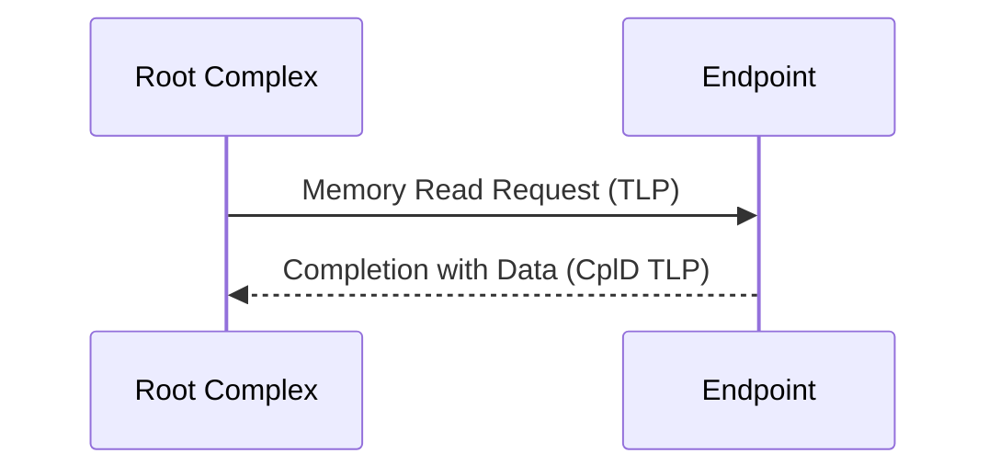

# 事务层与TLP

<span class="badge-i">[Intermediate]</span>

<span class="red">事务层（Transaction Layer）</span> 是PCIe协议栈的最高层，负责将上层请求封装为 <span class="green">TLP（Transaction Layer Packet）</span> 并在链路两端可靠传输。

---

## <strong>基础认知</strong>

### <strong>为什么需要事务层</strong>

PCIe采用 <span class="blue">分层架构</span>：事务层负责请求/完成语义，数据链路层负责可靠传输，物理层负责电气信号。

<span class="blue">事务层的核心职责</span> 是屏蔽底层细节，为软件提供与PCI兼容的内存读写、IO访问、配置访问和中断投递机制。

---

## <strong>原理解析</strong>

### <strong>TLP 包格式</strong>

<span class="green">TLP</span> 由 Header、Data Payload（可选）和 ECRC（可选）组成：

```
+--------+----------+-------------+
| Header |  Data    |   ECRC      |
|  3-4DW | 0-1024DW |   1DW       |
+--------+----------+-------------+
```

<span class="blue">Header 固定为 3DW（12字节）或 4DW（16字节）</span>，取决于是32位还是64位地址格式。

### <strong>Header 字段详解</strong>

| 字段 | 位宽 | 说明 |
|------|------|------|
| Fmt[2:0] | 3 | 格式：有无数据、32/64位地址 |
| Type[4:0] | 5 | 类型：MRd/MWr/IORd/IOWr/CfgRd/CfgWr/Msg |
| TC[2:0] | 3 | 流量类别：0-7，用于QoS |
| TD | 1 | TLP Digest 存在位（ECRC） |
| EP | 1 | 毒化位，标记数据错误 |
| Attr[2:0] | 3 | 属性：_relaxed_ordering、_no_snoop |
| Length[9:0] | 10 | Data Payload 长度（以DW计） |

<span class="red">Fmt + Type 组合决定 TLP 的完整语义</span>，例如 `Fmt=0b001, Type=0b00000` 表示 64位地址 Memory Read。

### <strong>四种路由机制</strong>

<span class="green">PCIe 定义了四种 TLP 路由方式</span>，设备根据 Header 中的路由信息决定包去向：

| 路由方式 | 判定依据 | 适用场景 |
|----------|----------|----------|
| 地址路由 | TLP 中的目标地址 | Memory/IO 请求 |
| ID 路由 | Bus:Device:Function（BDF） | 配置请求、完成包 |
| 隐式路由 | Type 字段编码 | 消息报文（如INTx、PME） |
| 广播路由 | 特殊地址/类型 | 部分消息报文 |

<span class="blue">Root Complex 必须同时支持四种路由</span>；Switch 主要使用地址路由和 ID 路由。

### <strong>BAR 空间映射</strong>

<span class="red">BAR（Base Address Register）</span> 是配置空间中用于声明设备所需地址资源的寄存器。

<span class="blue">BAR 探测算法</span>：

```c
// Linux 内核中的 BAR 探测逻辑
pci_read_config_dword(dev, PCI_BASE_ADDRESS_0, &l);
pci_write_config_dword(dev, PCI_BASE_ADDRESS_0, 0xffffffff);
pci_read_config_dword(dev, PCI_BASE_ADDRESS_0, &sz);
sz = pci_size(l, sz, PCI_BASE_ADDRESS_MEM_MASK);
```

向 BAR 写入全1后回读，得到的是该 BAR 所需地址空间大小的 <span class="green">补码掩码</span>。

### <strong>Split Transaction</strong>

<span class="red">PCIe 采用 Split Transaction 模型</span>，彻底解决了 PCI 的周转周期浪费问题：



<span class="blue">Requester 发送请求后可立即释放总线</span>，Completer 准备好数据后异步返回 Completion TLP。

---

## <strong>技术教学</strong>

### <strong>lspci 查看 TLP 相关能力</strong>

```bash
# 查看设备的 Max Payload Size
lspci -vv -s 00:01.0 | grep -E "DevCap:|DevCtl:"
# DevCap: MaxPayload 256 bytes, PhantFunc 0
# DevCtl: CorrErr+ NonFatalErr+ FatalErr+ UnsupReq+
#         RlxdOrd+ ExtTag+ PhantFunc- AuxPwr- NoSnoop+
#         MaxPayload 128 bytes, MaxReadReq 512 bytes
```

<span class="blue">MaxPayloadSize 决定单次 TLP 最大数据量</span>，需与链路两端协商一致。

### <strong>设置 Max Payload Size</strong>

```bash
# 通过 setpci 调整 MaxPayload（以 00:01.0 为例）
setpci -s 00:01.0 CAP_EXP+8.B=0x40  # 设为 256 bytes
```

<span class="red">MaxPayloadSize 影响吞吐量和延迟</span>：越大吞吐量越高，但延迟抖动增大。

---

## <strong>软硬件实战</strong>

### <strong>场景一：PCIe BAR 映射调试</strong>

```bash
# 查看某设备的 BAR 资源分配
lspci -vv -s 01:00.0 | grep -A4 "Region"
# Region 0: Memory at f1000000 (64-bit, non-prefetchable) [size=16M]
# Region 2: Memory at e0000000 (64-bit, prefetchable) [size=256M]
# Region 4: I/O ports at 3000 [size=256]
```

<span class="blue">Region 0/2 为 Memory BAR，Region 4 为 I/O BAR</span>；prefetchable 标志表示是否可预取。

### <strong>场景二：TLP 路由故障排查</strong>

```bash
# 检查 TLP 是否被正确路由
# 查看 AER 日志中的 Unsupported Request
 dmesg | grep -i "aer\|unsupported request"
# [ 123.456] pcieport 0000:00:01.0: AER: Uncorrected (Non-Fatal) error received
# [ 123.456] device 0000:01:00.0: PCIe Bus Error: severity=Uncorrected (Non-Fatal)
```

<span class="red">Unsupported Request 通常意味着 TLP 路由失败</span>，目标地址不在任何设备的 BAR 范围内。

---

## <strong>历史演进</strong>

<span class="red">PCIe 的事务层设计深受 PCI 传统影响。</span>

- <span class="green">1992 年 PCI 1.0</span> — 引入配置空间和 BAR 机制，奠定枚举基础<br>
- <span class="green">2003 年 PCIe 1.0</span> — 串行化替代并行总线，保留 PCI 软件模型<br>
- <span class="green">2010 年 PCIe 3.0</span> — 128b/130b 编码提升效率，事务层不变<br>
- <span class="green">2017 年 PCIe 4.0</span> — 16GT/s，事务层引入 LRR（Latency Reduction Request）<br>
- <span class="green">2022 年 PCIe 6.0</span> — FLIT 模式重构事务层，引入 LD-FEEC（轻量级差错检测）

<span class="blue">软件兼容性贯穿始终</span>：从 PCI 到 PCIe 6.0，配置空间头部、BAR 机制、INTx 中断模型保持不变。

---

## 小结与练习

| 要点 | 说明 |
|------|------|
| 核心概念 | TLP 是 PCIe 事务层的基本传输单元，Header 决定路由和语义 |
| 关键技能 | 理解 Fmt/Type 编码、掌握四种路由机制、熟练 BAR 探测 |
| 常见误区 | 混淆 MaxPayloadSize 与 MaxReadReqSize；忽视 TC 优先级 |

**练习**

1. 画出 Memory Read TLP 的 Header 格式（32位地址），标注各字段位宽。
2. 某设备 BAR0 写入 0xffffffff 后回读为 0xfffff000，该 BAR 需要多大的地址空间？
3. 分析为什么 PCIe 使用 Split Transaction 而非 PCI 的周转周期模型。

---

## 学习路径

- **小白**：先理解 TLP 基本结构，用 `lspci` 查看 BAR 分配。
- **高手**：深入 Fmt/Type 编码，掌握四种路由机制的实现细节。
- **专家**：研究 FLIT 模式对事务层的重构，参与 PCIe SIG 标准制定。
