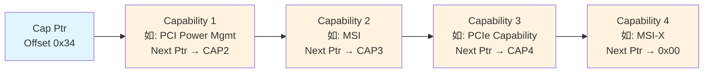

# PCIe配置空间与Capability链表

<span class="badge-i">[Intermediate]</span>

<span class="red">PCIe配置空间是设备的"寄存器身份证"，前256字节为Header（Type0用于Endpoint，Type1用于Switch/Bridge），通过ECAM（Enhanced Configuration Access Mechanism）映射到CPU内存空间，由固件在枚举阶段填充总线号、地址窗口和中断路由。</span> 配置空间是操作系统识别设备、加载驱动、分配资源的基础，其Capability链表结构支持新功能的平滑扩展。

<br>每个PCIe Function拥有独立的4 KB配置空间。前64字节（0x00~0x3F）是预定义Header，所有PCI兼容设备必须实现；0x40~0xFF为标准Capability区域；PCIe设备还有0x100~0xFFF的Extended Configuration Space。

---

## <strong>基础认知</strong>

<span class="green">ECAM</span> 将配置空间映射为内存地址，使CPU通过Memory Read/Write访问配置空间。ECAM基地址和大小由固件（ACPI MCFG表或设备树）报告给操作系统。

<br>传统PCI使用IO端口访问配置空间（CONFIG_ADDRESS 0xCF8 / CONFIG_DATA 0xCFC），每次访问需两次IO操作且只能访问前256字节。ECAM一次Memory访问即可读写32-bit配置寄存器，且支持Extended Space到4 KB。

### <strong>Type0与Type1 Header对比</strong>

| 偏移 | Type0 (Endpoint) | Type1 (Switch/Bridge) |
|------|-------------------|-----------------------|
| 0x00 | Device ID / Vendor ID | Device ID / Vendor ID |
| 0x02 | Status / Command | Status / Command |
| 0x04 | Class Code / Revision ID | Class Code / Revision ID |
| 0x08 | BIST / Header Type / Latency / Cache | BIST / Header Type / Latency / Cache |
| 0x09 | Header Type = 0x00 | Header Type = 0x01 |
| 0x0C | CardBus / Subsystem IDs | CardBus / Subsystem IDs |
| 0x10 | BAR0 | BAR0 |
| 0x14 | BAR1 | BAR1 |
| 0x18 | BAR2 | Primary Bus / Secondary Bus / Subordinate Bus |
| 0x1C | BAR3 | Secondary Status / IO Base / IO Limit |
| 0x20 | BAR4 | Memory Base / Memory Limit |
| 0x24 | BAR5 | Prefetchable Base / Limit |
| 0x28 | CardBus CIS | Prefetchable Base / Limit (Upper) |
| 0x2C | Subsystem ID / Vendor ID | IO Base / Limit (Upper) |
| 0x30 | ROM BAR | ROM BAR |
| 0x34 | Reserved | Reserved |
| 0x38 | Reserved | Bridge Control |
| 0x3C | Interrupt Pin / Line / Min_Gnt / Max_Lat | Interrupt Pin / Line / Bridge Control |

<br><span class="blue">Type1 Header的核心差异在于偏移0x18~0x24的桥接寄存器：Primary/Secondary/Subordinate Bus Number定义了桥接的下游总线范围，Memory/IO Base/Limit定义了地址路由窗口。</span> 这些寄存器由枚举算法在扫描总线时计算并写入。

### <strong>Capability链表结构</strong>

配置空间偏移0x34的Capability Pointer指向第一个Capability结构，每个Capability以链表形式串联。



<br>每个Capability结构的前2字节固定：
- Byte 0: Capability ID（唯一标识Capability类型）
- Byte 1: Next Capability Pointer（下一个Capability的偏移，0x00表示链表结束）

<br>常见Capability ID：

| ID | Capability | 功能 |
|----|-----------|------|
| 0x01 | PCI Power Management | 电源状态管理D0/D1/D2/D3 |
| 0x05 | MSI | Message Signaled Interrupts |
| 0x10 | PCI Express | PCIe基本能力（链路速度/宽度、ASPM） |
| 0x11 | MSI-X | 扩展MSI中断，最多2048个向量 |
| 0x18 | SR-IOV | Single Root I/O Virtualization |
| 0x1E | ARI | Alternative Routing-ID Interpretation |

---

## <strong>原理解析</strong>

### <strong>为什么PCIe保留配置空间并扩展至4 KB</strong>

<span class="blue">配置空间的存在使设备在没有任何地址空间分配的情况下仍可被识别和配置。</span> 在操作系统枚举之前，设备无法响应Memory或IO事务（因为BAR尚未编程）。配置空间通过专用的ID路由机制（与地址无关）解决了"先有鸡还是先有蛋"的问题。

<br>从PCI到PCIe，配置空间从256字节扩展到4 KB的原因：
<br>1. **Capability链表增长**：随着功能增加，Power Management、MSI、MSI-X、AER、SR-IOV、ATS、PASID等Capability需要更多空间
<br>2. **Extended Capability结构**：PCIe引入的Extended Capability使用双字对齐，支持更大的寄存器块（如AER Extended Capability占约40字节）
<br>3. **多Function设备**：每个Function独立4 KB，方便寄存器隔离

<br>PCIe的Extended Configuration Space（0x100~0xFFF）通过Extended Capability链表管理。与标准Capability不同，Extended Capability的Header为4 DW（16字节），Next Pointer为12-bit，支持更大的偏移范围。

### <strong>枚举算法如何填充Type1 Header</strong>

当枚举算法扫描到Switch时，需要为其Type1 Header编程总线号和地址窗口：

<br>1. **Bus Number分配**：Primary Bus = 上游总线号；Secondary Bus = 新分配的总线号；Subordinate Bus = 下游最大总线号（在扫描完所有子树后回填）
<br>2. **Memory窗口**：Base = 子树中最小的BAR基址；Limit = 子树中最大的BAR末址
<br>3. **Prefetchable Memory窗口**：同理，用于分配Prefetchable BAR空间
<br>4. **IO窗口**：Base/Limit以16-bit对齐格式编码

<br><span class="blue">Subordinate Bus Number的回填是枚举算法的精妙之处。</span> 算法先递归扫描Switch的每个Downstream Port，为下游分配总线号，扫描完成后才能确定该Port下游的最大总线号。因此Subordinate Bus的写入发生在子树扫描完毕后。

### <strong>ECAM地址映射公式</strong>

ECAM将(Bus, Device, Function, Offset)四元组映射为物理内存地址：

```
ECAM地址 = ECAM基址
         + (Bus << 20)        /* 每个Bus 1 MB */
         + (Device << 15)     /* 每个Device 32 KB */
         + (Function << 12)   /* 每个Function 4 KB */
         + Offset
```

<br>验证：256 Bus × 32 Device × 8 Function × 4 KB = 256 MB，与(Bus << 20) = 256 × 1 MB一致。

<br><span class="blue">ECAM区域在ACPI中通过MCFG表描述，每个Segment（PCI Segment Group）对应一个ECAM基址。x86平台通常为Segment 0，ARM平台可能多个Segment。</span>

---

## <strong>技术教学</strong>

### <strong>读取和解析配置空间</strong>

```bash
# 读取完整配置空间前256字节
sudo lspci -xxxx -s 01:00.0

# 仅读取Header前64字节
sudo lspci -x -s 01:00.0

# 使用setpci读取特定寄存器
# 读取Vendor ID + Device ID（偏移0x00）
sudo setpci -s 01:00.0 0x00.w

# 读取Class Code（偏移0x08的高24位）
sudo setpci -s 01:00.0 0x0B.b  # Base Class (如0x01=Mass Storage)
sudo setpci -s 01:00.0 0x0A.b  # Sub Class (如0x08=NVMe)
sudo setpci -s 01:00.0 0x09.b  # Programming Interface

# 读取Capability Pointer
sudo setpci -s 01:00.0 0x34.b
```

<br>解析Class Code识别设备类型：

| Base Class | Sub Class | 含义 |
|------------|-----------|------|
| 0x01 | 0x08 | Mass Storage Controller - NVMe |
| 0x02 | 0x00 | Network Controller - Ethernet |
| 0x03 | 0x00 | Display Controller - VGA |
| 0x04 | 0x03 | Multimedia - Audio |
| 0x0C | 0x03 | Serial Bus - USB |

### <strong>Capability链表遍历脚本</strong>

```bash
#!/bin/bash
# pci_capability_walk.sh — 遍历指定设备的Capability链表

DEV="${1:-01:00.0}"

echo "=== Capability Walk for $DEV ==="

# 读取Status寄存器，检查Capabilities List位(bit4)
status=$(sudo setpci -s "$DEV" 0x06.w)
if (((0x$status >> 4) & 1) == 0); then
    echo "No Capabilities List supported"
    exit 1
fi

# 从Capability Pointer开始遍历
ptr=$(sudo setpci -s "$DEV" 0x34.b)
ptr=$((0x$ptr))

while [ "$ptr" -ne 0 ] && [ "$ptr" -lt 256 ]; do
    cap_id=$(sudo setpci -s "$DEV" $(printf "0x%02x.b" $ptr))
    cap_id=$((0x$cap_id))
    
    # Capability名称映射
    case $cap_id in
        1)  name="PCI Power Management" ;;
        2)  name="AGP" ;;
        3)  name="VPD" ;;
        4)  name="Slot ID" ;;
        5)  name="MSI" ;;
        6)  name="CompactPCI" ;;
        7)  name="PCI-X" ;;
        8)  name="HyperTransport" ;;
        9)  name="Vendor Specific" ;;
        10) name="Debug Port" ;;
        11) name="Resource Control" ;;
        13) name="Hot-Plug" ;;
        16) name="PCI Express" ;;
        17) name="MSI-X" ;;
        18) name="SATA" ;;
        19) name="AFI" ;;
        24) name="SR-IOV" ;;
        30) name="ARI" ;;
        *)  name="Unknown (ID=$cap_id)" ;;
    esac
    
    echo "  Offset 0x$(printf '%02x' $ptr): $name (ID=0x$(printf '%02x' $cap_id))"
    
    # 读取Next Pointer
    next=$(sudo setpci -s "$DEV" $(printf "0x%02x.b" $(($ptr + 1))))
    ptr=$((0x$next))
done

echo "  Capability list end"
```

---

## <strong>软硬件实战</strong>

### <strong>场景一：ARM嵌入式Linux中ECAM映射与设备树配置</strong>

```dts
/* ARM64平台ECAM映射示例 — 以ACPI MCFG或设备树实现 */
&pcie {
    /* ECAM基地址映射 */
    reg = <0x0 0x40000000 0x0 0x10000000>;  /* 256 MB ECAM空间 */
    
    /* 对于Segment 0，Bus 0~255 */
    bus-range = <0x0 0xff>;
    
    /* 内部桥接寄存器通过DBI（Doorbell Interface）访问 */
    reg-names = "config", "dbi";
};
```

<br>在裸机RTOS中手动访问配置空间：

```c
/* ARM64裸机访问PCIe ECAM */
#include <stdint.h>

#define ECAM_BASE       0x40000000UL
#define ECAM_SIZE       0x10000000UL  /* 256 MB */

/* 构建ECAM地址 */
static inline volatile uint32_t *ecam_addr(uint8_t bus, uint8_t dev,
                                            uint8_t fn, uint16_t off)
{
    /* 设备号范围0~31，Function 0~7 */
    uintptr_t addr = ECAM_BASE
                   + ((uintptr_t)bus << 20)
                   + ((uintptr_t)(dev & 0x1F) << 15)
                   + ((uintptr_t)(fn & 0x07) << 12)
                   + (off & 0xFFC);   /* 双字对齐 */
    return (volatile uint32_t *)addr;
}

uint32_t pci_conf_read(uint8_t bus, uint8_t dev, uint8_t fn, uint16_t off)
{
    return *ecam_addr(bus, dev, fn, off);
}

void pci_conf_write(uint8_t bus, uint8_t dev, uint8_t fn,
                    uint16_t off, uint32_t val)
{
    *ecam_addr(bus, dev, fn, off) = val;
}

/* 扫描Bus 0的所有设备 */
void pci_scan_bus0(void)
{
    for (int dev = 0; dev < 32; dev++) {
        uint32_t id = pci_conf_read(0, dev, 0, 0x00);
        if (id == 0xFFFFFFFF) continue;  /* 空插槽 */
        
        uint16_t vendor = id & 0xFFFF;
        uint16_t device = (id >> 16) & 0xFFFF;
        printf("Bus0/Dev%d/Fn0: Vendor=0x%04X Device=0x%04X\n",
               dev, vendor, device);
        
        /* 读取Header Type，检查是否为Multi-Function */
        uint8_t hdr_type = (pci_conf_read(0, dev, 0, 0x0C) >> 16) & 0xFF;
        if (hdr_type & 0x80) {
            /* Multi-Function设备，扫描Fn1~Fn7 */
            for (int fn = 1; fn < 8; fn++) {
                uint32_t fn_id = pci_conf_read(0, dev, fn, 0x00);
                if (fn_id != 0xFFFFFFFF) {
                    printf("  Function %d present\n", fn);
                }
            }
        }
    }
}
```

<br><span class="blue">ECAM访问必须保证4字节对齐。未对齐访问可能触发CPU异常（如ARM的Alignment Fault）。配置空间偏移末两位始终为0。</span>

### <strong>场景二：修改Switch的Secondary/Subordinate Bus Number</strong>

在枚举算法的中间阶段，需要为Switch的Type1 Header写入Bus Number：

```c
/* 枚举算法中为Switch编程Bus Number */
void pci_setup_bridge(uint8_t pri_bus, uint8_t sec_bus,
                      struct pci_dev *bridge)
{
    /* 偏移0x18: Primary Bus (8-bit) | Secondary Bus (8-bit) */
    uint32_t bus_reg = (sec_bus << 8) | pri_bus;
    pci_conf_write(pri_bus, bridge->dev, bridge->fn, 0x18, bus_reg);
    
    /* 偏移0x1A: Subordinate Bus (8-bit) */
    /* 初始写入sec_bus，扫描完子树后更新为实际最大值 */
    pci_conf_write(pri_bus, bridge->dev, bridge->fn,
                   0x1A, sec_bus << 16);  /* 注意字节位置 */
}

/* 扫描完子树后，回填Subordinate Bus Number */
void pci_update_subordinate(uint8_t pri_bus, struct pci_dev *bridge,
                            uint8_t max_bus)
{
    uint32_t val = pci_conf_read(pri_bus, bridge->dev, bridge->fn, 0x18);
    val = (val & 0x0000FFFF) | ((uint32_t)max_bus << 24);
    pci_conf_write(pri_bus, bridge->dev, bridge->fn, 0x18, val);
}
```

---

## <strong>历史演进</strong>

<span class="red">PCI配置空间从PCI 2.0的64字节Header + 192字节Device-specific，演进为PCIe的4 KB Extended Space， Capability链表机制是这一扩展的核心架构。</span>

<br>传统PCI（1992）定义了64-byte Header，包含Vendor ID、Device ID、Command、Status、BAR等基础字段。设备通过IO端口0xCF8/0xCFC访问配置空间，这是为了兼容当时的x86 IO端口模型。

<br>PCI 2.2（1998）引入Power Management Capability（ID=0x01）和MSI Capability（ID=0x05），首次采用链表结构。标准配置空间从64字节扩展到256字节，0x34作为Capability Pointer。

<br>PCI Express 1.0（2003）将配置空间扩展至4 KB，新增0x100~0xFFF的Extended Configuration Space。PCIe Capability（ID=0x10）成为标准链路能力描述符。ECAM取代IO端口访问，这是为了支持更大的地址空间和更高效的访问方式。

<br>PCIe 2.0和3.0持续增加Extended Capability类型：AER（Advanced Error Reporting）、ACS（Access Control Services）、ARI、SR-IOV、ATS、PASID等。每个新功能通过Extended Capability ID注册，向后兼容。

<br>PCIe 4.0/5.0/6.0在配置空间层面无重大结构性变化，新功能通过Capability/Extended Capability扩展。例如PCIe 6.0的FLIT机制通过PCIe Capability寄存器中的新位控制。

<br><span class="purple">CXL协议在PCIe配置空间框架下新增了CXL Capability Extended Capability（ID=0x27E1），用于声明设备支持的CXL协议版本和功能（CXL.io / CXL.cache / CXL.memory）。这证明配置空间的扩展机制具有极强的生命力。</span>

---

## 小结与练习

| 要点 | 说明 |
|------|------|
| 核心概念 | 配置空间前256B含Type0/Type1 Header；Capability链表从偏移0x34遍历；ECAM将BDF映射为内存地址 |
| 关键技能 | 掌握setpci读写配置寄存器，理解Type1的Bus Number和Base/Limit含义，能遍历Capability链表 |
| 常见误区 | 混淆标准Capability（2字节Header）与Extended Capability（16字节Header）；ECAM未4字节对齐访问 |
| 枚举要点 | Secondary Bus分配后扫描子树，完成后回填Subordinate Bus；Memory/IO窗口需覆盖所有下游BAR |
| 扩展机制 | 新功能通过Capability/Extended Capability ID注册，保持向后兼容 |

**练习**

1. 某Switch的Type1 Header中，Primary Bus=0x00, Secondary Bus=0x01, Subordinate Bus=0x03。分析：(a) 该Switch下游有多少条总线？(b) 若其下游又有一个Switch，该子Switch的Primary Bus应是多少？(c) 描述ID路由时，TLP的Bus Number如何与此寄存器对比以决定转发方向。

2. 编写一段伪代码，从偏移0x34开始遍历标准Capability链表，打印每个Capability的ID、名称和偏移地址。要求处理Next Pointer为0x00的终止条件，并检查偏移是否越界（>0xFF）。

3. 对比x86的CONFIG_ADDRESS/CONFIG_DATA端口访问（0xCF8/0xCFC）与ECAM内存映射访问：从访问效率（指令数/操作）、可访问空间大小和OS驱动实现复杂度三个维度分析各自的优劣。
