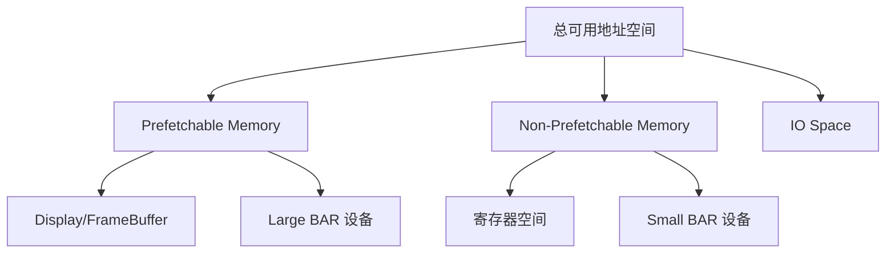

# 地址空间与枚举

<span class="badge-i">[Intermediate]</span>

<span class="red">地址空间管理</span> 与 <span class="red">拓扑枚举</span> 是PCIe系统初始化的核心任务，固件/操作系统必须正确分配资源才能驱动设备。

---

## <strong>基础认知</strong>

### <strong>PCIe 三大地址空间</strong>

| 空间 | 位宽 | 用途 |
|------|------|------|
| Memory Space | 32/64位 | 设备寄存器、BAR 映射 |
| IO Space | 32位 | 传统兼容（x86 特有） |
| Configuration Space | 32位 | 设备配置、枚举、能力发现 |

<span class="blue">现代系统主要使用 Memory Space 和 Configuration Space</span>，IO Space 逐渐废弃。

### <strong>BDF 寻址</strong>

<span class="green">Bus:Device:Function（BDF）</span> 是 PCIe 拓扑的基本坐标：

```
0000:01:00.0  =  Bus 0, Device 1, Function 0
        │  │  │
        │  │  └── Function (3 bits, 0-7, ARI扩展至0-255)
        │  └───── Device  (5 bits, 0-31)
        └──────── Bus     (8 bits, 0-255)
```

---

## <strong>原理解析</strong>

### <strong>深度优先枚举算法</strong>

```c
void pci_scan_bus(int bus) {
    for (dev = 0; dev < 32; dev++) {
        for (func = 0; func < 8; func++) {
            read_bdf(bus, dev, func, &hdr);
            if (hdr.vendor == 0xFFFF) continue; // 无设备
            
            if (hdr.header_type == 1) { // Bridge
                int sec = assign_bus_number();
                write_config(bus, dev, func, 0x19, sec); // Secondary
                write_config(bus, dev, func, 0x1A, sec); // Subordinate (temp)
                pci_scan_bus(sec);
                write_config(bus, dev, func, 0x1A, max_subordinate);
            }
        }
    }
}
```

<span class="blue">关键技巧：先临时写入 Subordinate = Secondary，递归完成后再回填真实最大值</span>。

### <strong>BAR 探测与资源分配</strong>

```c
// BAR 探测：写入全1，回读获取大小掩码
pci_write_config_dword(dev, bar_offset, 0xFFFFFFFF);
pci_read_config_dword(dev, bar_offset, &mask);
size = ~(mask & 0xFFFFFFF0) + 1; // 清除低4位，取补码

// 分配对齐地址
aligned_addr = ALIGN(free_base, size);
pci_write_config_dword(dev, bar_offset, aligned_addr);
```

<span class="red">BAR 要求分配的地址必须按 BAR 大小对齐</span>，例如 16MB 的 BAR 必须对齐到 16MB 边界。

### <strong>地址空间分配策略</strong>



<span class="blue">Prefetchable 区域通常分配给 FrameBuffer 和大型 DMA 缓冲区</span>，Non-Prefetchable 用于有副作用的寄存器访问。

---

## <strong>技术教学</strong>

### <strong>查看系统枚举结果</strong>

```bash
# 查看 PCIe 拓扑树
lspci -tv
# -[0000:00]-+-00.0  Intel Host Bridge
#             +-01.0-[01]--+-00.0  NVIDIA GPU
#             |            +-00.1  NVIDIA Audio
#             +-1c.0-[02]----00.0  Intel Ethernet
```

### <strong>查看地址分配</strong>

```bash
# 查看 BAR 和桥窗口分配
cat /proc/iomem | grep -i pci
# e0000000-f1ffffff : PCI Bus 0000:01
# f2000000-f20fffff : 0000:01:00.0
```

---

## <strong>软硬件实战</strong>

### <strong>场景一：枚举冲突排查</strong>

```bash
# 检查是否有设备无法枚举
dmesg | grep -i "pci.*failed\|pci.*error"
# [    0.456] pci 0000:00:1c.0: PCI bridge to [bus 02]
# [    0.456] pci 0000:00:1c.0:   bridge window [mem 0xf2000000-0xf20fffff]
```

### <strong>场景二：手动分配 BAR</strong>

```bash
# 通过 setpci 修改 BAR（谨慎操作）
setpci -s 01:00.0 BASE_ADDRESS_0=0xf2000000
```

<span class="red">手动分配 BAR 需确保不与现有设备冲突</span>，且满足对齐要求。

---

## <strong>历史演进</strong>

- <span class="green">1992 年 PCI</span> — 引入 BDF 寻址、BAR 机制、Type1 Bridge 窗口<br>
- <span class="green">2003 年 PCIe</span> — 保留 PCI 枚举模型，仅改为串行传输<br>
- <span class="green">2010 年 PCIe 3.0</span> — ARI 扩展 BDF 至 256 Function<br>
- <span class="green">2022 年 PCIe 6.0</span> — 枚举算法不变，但 FLIT 模式引入新时序约束

---

## 小结与练习

| 要点 | 说明 |
|------|------|
| 核心概念 | BDF 寻址 + BAR 探测 + 深度优先枚举 = PCIe 初始化三部曲 |
| 关键技能 | 理解 Bridge 窗口配置、掌握对齐规则、排查枚举失败 |
| 常见误区 | Subordinate Bus 回填过早；BAR 对齐计算错误 |

**练习**

1. 画出深度优先枚举一棵三层 PCIe 树的流程图。
2. 某设备 BAR0 写入 0xffffffff 后回读为 0xffffc000，计算所需地址空间和对齐要求。
3. 分析为什么 Prefetchable 和 Non-Prefetchable 内存必须分开分配。

---

## 学习路径

- **小白**：用 `lspci -tv` 看懂 PCIe 拓扑树。
- **高手**：分析 Linux `pci_scan_bus()` 实现，理解递归枚举和对齐逻辑。
- **专家**：在嵌入式平台（如Zynq）手动配置 PCIe 控制器，实现自定义枚举。
