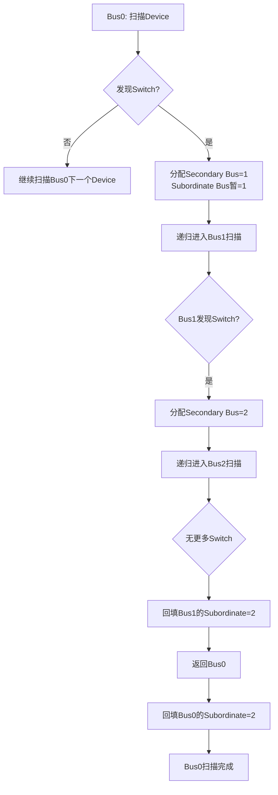

# PCIe地址空间与枚举算法

<span class="badge-i">[Intermediate→Advanced]</span>

<span class="red">PCIe地址空间分为内存空间（Memory Space）、IO空间（I/O Space）和配置空间（Configuration Space），通过Bus-Device-Function（BDF）三级编号唯一标识拓扑中的每个Function，枚举算法以深度优先方式扫描总线树并分配地址资源。</span> 枚举是PCIe子系统启动的基石，没有正确的枚举，操作系统将无法识别设备，更无法加载驱动程序。

<br>枚举过程由固件（UEFI/BIOS）或操作系统内核在启动早期执行。嵌入式系统中，设备树或ACPI表可能预描述部分拓扑，但内核仍需执行完整的资源分配。

---

## <strong>基础认知</strong>

<span class="green">BDF（Bus-Device-Function）</span> 是PCIe的层次化寻址体系。Bus编号标识一条总线（Segment内唯一），Device编号标识总线上的一个物理插槽（0~31），Function编号标识设备内的一个独立逻辑功能（0~7）。

<br>一条PCIe总线最多挂接32个Device，每个Device最多8个Function，因此每条Bus最多256个Function。一个Segment最多256条Bus，总计65,536个Function。

### <strong>地址空间类型与用途</strong>

| 空间类型 | 位宽 | 访问方式 | 典型用途 |
|----------|------|----------|----------|
| Memory Space | 32-bit或64-bit | Memory Read/Write TLP | 设备BAR寄存器、DMA缓冲区 |
| I/O Space | 32-bit（低16-bit有效） | IO Read/Write TLP | 兼容遗留ISA/PCI设备 |
| Configuration Space | — | Configuration Read/Write TLP | 枚举、设备配置、Capability访问 |

<br><span class="blue">PCIe IO空间在现代系统中已逐渐淘汰。</span> x86平台保留IO空间用于兼容老设备，ARM平台通常完全不实现IO空间，所有外设通过Memory-mapped IO（MMIO）访问。Linux内核中，若设备树未声明IO资源，IO BAR将被忽略。

### <strong>地址空间的对齐与粒度</strong>

BAR所需空间大小通过对齐粒度体现。设备通过BAR的低位保留位声明所需的对齐方式。枚举算法按对齐要求分配基址，确保无重叠。

| BAR值（写全1后读回） | 含义 |
|----------------------|------|
| 0xFFFFF000 | 4 KB对齐，4 KB空间 |
| 0xFFFFC000 | 16 KB对齐，16 KB空间 |
| 0xFFFF0000 | 64 KB对齐，64 KB空间 |
| 0xFFF00000 | 1 MB对齐，1 MB空间 |

---

## <strong>原理解析</strong>

### <strong>为什么枚举算法采用深度优先策略</strong>

<span class="blue">深度优先（DFS）枚举保证Switch的Subordinate Bus Number能在子树扫描完成后正确回填。</span> 若采用广度优先（BFS），需要二次遍历才能确定每个Switch下游的最大Bus号。

<br>DFS枚举流程：
<br>1. 从Bus 0开始扫描所有Device
<br>2. 遇到Switch（Type1 Header）时，为其分配Secondary Bus = 下一个可用Bus号
<br>3. 递归进入Secondary Bus，继续扫描
<br>4. 该Switch的子树完全扫描后，将当前最大Bus号回填为Subordinate Bus
<br>5. 返回上一级继续扫描



### <strong>资源分配的顺序约束</strong>

<span class="green">资源分配遵循先分配总线号、再分配IO/内存地址的顺序。</span> 原因是：地址窗口（Memory Base/Limit）需要在子树所有BAR大小确定后才能计算。

<br>分配顺序：
<br>1. **Bus Number**：自顶向下分配，确保每个Switch的Secondary/Subordinate正确
<br>2. **BAR探测**：自底向上读取每个Type0设备的BAR，计算所需空间大小
<br>3. **地址分配**：自底向上为每个BAR分配基址，更新上游Switch的Base/Limit窗口
<br>4. **写入BAR**：自底向上将分配地址写入各BAR

<br><span class="blue">Prefetchable Memory空间与非Prefetchable Memory空间必须分开分配。</span> 这是因为两者的缓存策略不同：Prefetchable空间允许推测预取（如帧缓冲区），非Prefetchable空间（如设备控制寄存器）的副作用不允许预取。

### <strong>64-bit BAR与地址空间扩展</strong>

64-bit BAR由两个相邻的32-bit BAR组成，低BAR的bit 1:2=10b表示64-bit，高BAR存储地址的高32位。

<br>64-bit BAR的探测流程：
<br>1. 向低BAR写入0xFFFFFFFF，读回
<br>2. 向高BAR写入0xFFFFFFFF，读回
<br>3. 计算低BAR的空间大小（对齐要求）
<br>4. 高BAR的读回值决定是否需要分配64-bit地址（若高BAR读回非0）

<br>在32-bit地址受限的系统中，64-bit BAR可能被分配在低于4 GB的区域（高BAR=0x00000000）。只有当设备需要超过4 GB的空间时，才必须分配64-bit地址。

---

## <strong>技术教学</strong>

### <strong>使用lspci查看地址资源分配</strong>

```bash
# 以树形结构显示完整的拓扑和资源分配
lspci -tv

# 查看特定设备的BAR分配详情
lspci -vv -s 01:00.0 | grep -E "Region|Memory|I/O|BAR"

# 查看Switch的下游地址窗口
lspci -vv -s 00:01.0  # 假设这是Root Port

# 查看Kernel日志中的枚举记录
dmesg | grep -i "pci\|pcie"
```

<br>典型输出解读：

```
01:00.0 Non-Volatile memory controller: Samsung NVMe SSD
	Region 0: Memory at f4100000 (64-bit, non-prefetchable) [size=16K]
	Region 4: Memory at f4104000 (64-bit, non-prefetchable) [size=256]
```

<br><span class="blue">"64-bit"表示BAR为64-bit类型，但基址f4100000位于32-bit空间内。高32位为0x00000000。</span>

### <strong>枚举算法伪代码实现</strong>

```c
/* PCIe深度优先枚举算法 — 简化版 */
#include <stdint.h>

static uint8_t next_bus = 1;       /* 下一个可用Bus号 */
static uint64_t mem_base = 0xF0000000;  /* 非Prefetchable基址 */
static uint64_t pref_base = 0xC0000000; /* Prefetchable基址 */

void pci_scan_bus(uint8_t bus)
{
    uint8_t max_subordinate = bus;
    
    for (int dev = 0; dev < 32; dev++) {
        for (int fn = 0; fn < 8; fn++) {
            if (fn > 0 && !is_multifunction(bus, dev, fn))
                break;  /* 非Multi-Function设备，跳过后续Function */
            
            uint32_t id = pci_conf_read(bus, dev, fn, 0x00);
            if (id == 0xFFFFFFFF) continue;
            
            uint8_t hdr_type = pci_get_hdr_type(bus, dev, fn);
            
            if ((hdr_type & 0x7F) == 0x01) {
                /* Type1: Switch/Bridge */
                uint8_t sec_bus = next_bus++;
                max_subordinate = sec_bus;
                
                /* 设置Secondary Bus */
                pci_conf_write(bus, dev, fn, 0x18,
                              (sec_bus <> 8) | bus);
                
                /* 递归扫描下游 */
                uint8_t sub = pci_scan_bus(sec_bus);
                if (sub > max_subordinate)
                    max_subordinate = sub;
                
                /* 回填Subordinate Bus */
                uint32_t val = pci_conf_read(bus, dev, fn, 0x18);
                val = (val & 0x00FFFFFF) | (max_subordinate << 24);
                pci_conf_write(bus, dev, fn, 0x18, val);
                
                /* 分配地址窗口 */
                pci_setup_bridge_windows(bus, dev, fn);
                
            } else if ((hdr_type & 0x7F) == 0x00) {
                /* Type0: Endpoint */
                pci_setup_endpoint_bars(bus, dev, fn);
            }
        }
    }
    
    return max_subordinate;
}

void pci_setup_endpoint_bars(uint8_t bus, uint8_t dev, uint8_t fn)
{
    for (int bar = 0; bar < 6; bar++) {
        uint16_t off = 0x10 + bar * 4;
        
        /* 探测BAR大小 */
        uint32_t orig = pci_conf_read(bus, dev, fn, off);
        pci_conf_write(bus, dev, fn, off, 0xFFFFFFFF);
        uint32_t mask = pci_conf_read(bus, dev, fn, off);
        pci_conf_write(bus, dev, fn, off, orig);  /* 恢复原值 */
        
        if (mask == 0 || mask == 0xFFFFFFFF) continue; /* 未实现 */
        
        uint32_t flags = mask & 0xF;  /* 低4位为属性 */
        uint32_t size = ~(mask & ~0xF) + 1;
        
        if (flags & 0x01) {
            /* IO BAR — 在现代系统中通常不分配 */
            continue;
        } else if ((flags & 0x06) == 0x04) {
            /* 64-bit BAR */
            bar++;  /* 跳过下一个BAR（高32位） */
            uint64_t addr = alloc_mem_64(size, flags & 0x08);
            pci_conf_write(bus, dev, fn, off, addr & 0xFFFFFFFF);
            pci_conf_write(bus, dev, fn, off + 4, addr >> 32);
        } else {
            /* 32-bit BAR */
            uint64_t addr = alloc_mem_32(size, flags & 0x08);
            pci_conf_write(bus, dev, fn, off, addr & 0xFFFFFFFF);
        }
    }
}
```

---

## <strong>软硬件实战</strong>

### <strong>场景一：嵌入式Linux内核中的PCIe枚举流程</strong>

Linux内核的PCI枚举由`pci_scan_root_bus()`发起，最终调用架构特定的`pcibios_scan_bus()`或`pci_scan_child_bus()`。

```bash
# 查看内核PCI枚举日志
dmesg | grep -E "pci|PCIe"

# 典型输出：
# pci 0000:00:00.0: [1a03:1150] type 01 class 0x060400
# pci 0000:00:01.0: [1a03:1151] type 01 class 0x060400
# pci 0000:01:00.0: [1b21:0612] type 00 class 0x010601
# pci 0000:02:00.0: [10ec:8125] type 00 class 0x020000
```

<br>在ARM64嵌入式平台（如Rockchip、NXP i.MX）上，枚举通常由设备树触发：

```dts
/* 设备树中PCIe Host控制器描述 */
pcie: pcie@fe000000 {
    compatible = "rockchip,rk3568-pcie";
    reg = <0x0 0xfe000000 0x0 0x00400000>;  /* 4MB DBI区域 */
    ranges = <0x83000000 0x0 0x40000000 0x0 0x40000000 0x0 0x40000000>,
             <0x82000000 0x0 0x30000000 0x0 0x30000000 0x0 0x10000000>;
    /* 0x83 = prefetchable memory, 0x82 = non-prefetchable memory */
    
    /* 地址翻译窗口 */
    dma-ranges = <0x83000000 0x0 0x40000000 0x0 0x40000000 0x0 0x40000000>;
};
```

<br><span class="blue">ranges属性的六个cell含义：
<br>cell 0: PCI地址空间类型标志
<br>cell 1-2: PCI总线地址（64-bit）
<br>cell 3-4: CPU物理地址（64-bit）
<br>cell 5-6: 空间大小（64-bit）
<br>这建立了PCI地址到CPU物理地址的一一映射。</span>

### <strong>场景二：手动分配BAR并解决地址冲突</strong>

在资源受限的嵌入式系统中，自动枚举可能因地址池不足而失败。手动干预示例：

```bash
# 查看当前所有BAR分配
lspci -vv | grep "Region" | sort -k3

# 发现两个设备的BAR重叠（罕见但可能发生在固件bug时）
# 通过 sysfs 手动重新分配（需卸载驱动）

# 1. 卸载目标设备的驱动
sudo modprobe -r nvme

# 2. 手动写入BAR（危险操作，仅用于调试）
# 首先关闭设备的Command寄存器的Memory Space Enable位
sudo setpci -s 01:00.0 0x04.w=0x0000  # 清除bit1 (Bus Master) 和 bit2 (Memory)

# 3. 写入新BAR值
sudo setpci -s 01:00.0 0x10.l=0xF4200000  # 新的BAR0基址

# 4. 重新使能Memory Space
sudo setpci -s 01:00.0 0x04.w=0x0006  # 设置Bus Master + Memory Space Enable

# 5. 重新加载驱动
sudo modprobe nvme
```

<br><span class="blue">手动修改BAR可能导致系统崩溃或硬件损坏。操作前必须确保新地址不与任何其他设备或系统内存重叠，且驱动已完全卸载。</span>

---

## <strong>历史演进</strong>

<span class="red">PCIe枚举算法直接继承自PCI时代的bus scanning和资源分配机制，其核心逻辑三十年来几乎未变。</span>

<br>PCI 2.0（1995）定义了标准的枚举算法：通过CONFIG_ADDRESS/DATA端口扫描Bus 0~255，为Type1 Bridge分配Bus Number，为Type0 Device分配IO/Memory空间。这一算法被所有操作系统沿用。

<br>PCI Express 1.0（2003）引入了ECAM，枚举从IO端口访问切换为内存映射访问。算法逻辑不变，但访问效率提升。由于ECAM支持4 KB配置空间，枚举过程还需扫描Extended Capability。

<br>PCIe 3.0时代，64-bit BAR成为高端设备（GPU、网卡）的标配，枚举算法需要处理超过4 GB的地址分配。这推动了操作系统PCI子系统对64-bit资源池的支持。

<br>PCIe 4.0/5.0引入Resizable BAR（RBAR）Capability，允许设备在枚举后动态调整BAR大小。传统BAR大小在枚举时固定，RBAR允许驱动程序在运行时重新协商BAR大小（如为GPU分配更大的显存窗口）。枚举算法因此需要支持BAR resize请求。

<br>PCIe 6.0的FLIT模式不直接影响枚举算法，但FLIT块的地址对齐要求（256-byte对齐）可能在DMA地址分配中产生影响。

<br><span class="purple">ACPI 6.0+的_CRS（Current Resource Settings）和_PRS（Possible Resource Settings）方法提供了固件层面对PCI资源的高级描述，操作系统可以部分依赖固件预分配的资源，减少自主枚举的复杂度。这在ARM服务器的ACPI实现中尤为常见。</span>

---

## 小结与练习

| 要点 | 说明 |
|------|------|
| 核心概念 | BDF三级寻址；Memory/IO/Configuration三类地址空间；BAR声明设备所需资源 |
| 关键技能 | 理解深度优先枚举顺序，掌握BAR探测算法（写全1读回），能解析lspci的资源分配 |
| 常见误区 | 混淆Prefetchable与非Prefetchable空间的分配池；64-bit BAR的高32位未正确处理；
| 枚举顺序 | 先分配Bus号（自顶向下），再探测BAR（自底向上），最后分配地址并写入 |
| 资源约束 | IO空间在现代平台逐渐淘汰；64-bit地址空间避免4 GB边界问题；RBAR支持动态调整 |

**练习**

1. 某设备BAR0原始值为0xF4100000，向其写入0xFFFFFFFF后读回0xFFFFF004。计算该BAR所需空间大小，并说明在枚举算法中如何确定分配的基址（考虑对齐要求和与其他BAR的不重叠约束）。

2. 深度优先枚举与广度优先枚举在PCIe总线扫描中的关键差异是什么？为什么PCIe选择深度优先？用伪代码对比两种策略对Subordinate Bus Number回填时机的影响。

3. 在ARM嵌入式Linux中，设备树的ranges属性声明了PCI地址到CPU物理地址的映射。假设ranges中声明了0x83000000类型的prefetchable窗口[0x40000000, 0x80000000)。若某GPU设备的64-bit BAR需要2 GB空间，枚举算法应如何从此窗口中分配地址？若该BAR标记为prefetchable，但固件错误地将其分配到了non-prefetchable窗口，会导致什么问题？
