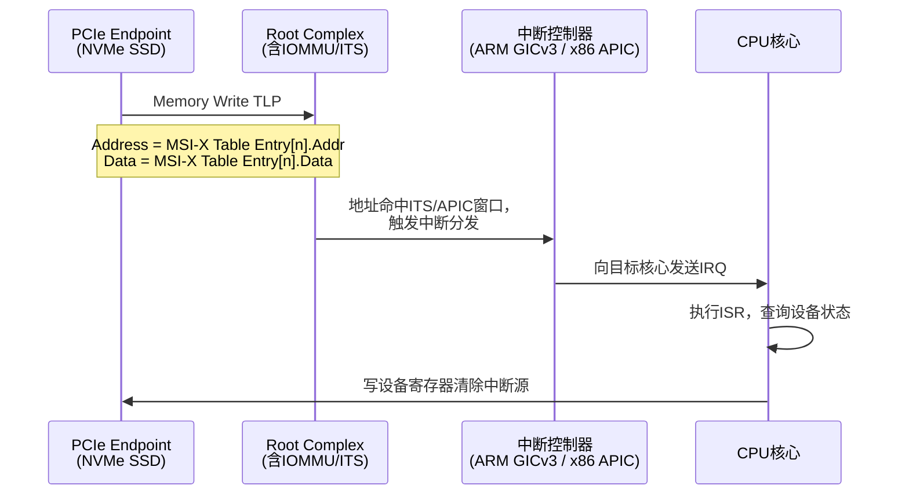

# PCIe中断机制与MSI-X

<span class="badge-i">[Intermediate]</span>

<span class="red">PCIe中断机制经历了从传统INTx线中断到MSI（Message Signaled Interrupts）再到MSI-X的演进，MSI-X通过独立的Message Table支持多达2048个中断向量，配合中断亲和性配置实现了精确的中断分发和负载均衡。</span> 中断机制的选择直接影响设备驱动的性能、延迟和CPU负载分布，是现代高性能外设（NVMe、网卡、GPU）必须深入理解的主题。

<br>PCIe设备在配置空间的Interrupt Pin寄存器中声明其INTx引脚（INTA~INTD），但更现代的方式是通过MSI或MSI-X Capability实现基于消息的中断，无需物理引脚。

---

## <strong>基础认知</strong>

<span class="green">INTx</span> 是传统PCI的边沿/电平触发中断，PCIe通过Message事务模拟INTx信号（Assert_INTx / Deassert_INTx Message），称为"INTx Emulation"。每个Function仅支持1个INTx中断源，所有中断事件复用同一引脚，驱动需通过寄存器轮询确定中断原因。

<br><span class="green">MSI</span> 使用Memory Write TLP向预编程的CPU中断控制器地址写入数据，触发中断。最多支持32个向量，但多个向量共享同一Message Data（写入值），由中断控制器区分。

<br><span class="green">MSI-X</span> 是MSI的扩展，通过独立的Table和PBA（Pending Bit Array）结构，支持最多2048个向量。每个向量有独立的Message Address和Message Data，支持独立屏蔽，配合中断亲和性实现单设备的多队列负载均衡。

| 特性 | INTx | MSI | MSI-X |
|------|------|-----|-------|
| 物理引脚 | 需要（或Message模拟） | 无 | 无 |
| 最大向量数 | 1 | 32 | 2048 |
| 每向量独立地址 | 无 | 无 | 有 |
| 每向量独立屏蔽 | 无 | 无 | 有 |
| 中断亲和性 | 不支持 | 有限 | 完整支持 |
| 触发方式 | 电平/边沿 | Memory Write | Memory Write |
| TLP类型 | Message | Memory Write | Memory Write |

### <strong>MSI-X Table结构</strong>

MSI-X Capability指向一个BAR中的Table结构，每个Entry 16字节：

| 字段 | 偏移 | 大小 | 说明 |
|------|------|------|------|
| Message Address (Low) | 0x00 | 4B | 目标内存地址低32位 |
| Message Address (High) | 0x04 | 4B | 目标内存地址高32位（64-bit系统） |
| Message Data | 0x08 | 4B | 写入该地址的数据值 |
| Vector Control | 0x0C | 4B | bit 0: Mask位（1=屏蔽此向量） |

<br>PBA（Pending Bit Array）与Table位于同一BAR或不同BAR，每bit表示对应向量是否有挂起的中断。若某向量被Mask且中断事件发生，Pending bit置位，解Mask后立即可见。

---

## <strong>原理解析</strong>

### <strong>为什么PCIe从INTx转向MSI/MSI-X</strong>

<span class="blue">INTx中断的根本问题是共享和串行化。</span> 多个设备共享同一INTx引脚时，中断控制器无法区分中断源，必须逐个查询ISR（Interrupt Service Routine）确定真正的中断设备。这种"中断风暴"下，CPU浪费大量时间在虚假中断处理上。

<br>MSI的优势在于：
<br>1. **专用向量**：每个MSI/MSI-X向量有独立的IRQ号，无需共享
<br>2. **无限扩展**：INTx受限于4条物理引脚（INTA~INTD），MSI-X理论上可达2048个向量
<br>3. **亲和性绑定**：不同向量可绑定不同CPU核心，实现NUMA感知的中断分发
<br>4. **消除电平触发问题**：MSI是边沿触发（Memory Write），无需ACK/EIO周期

<br>MSI-X相比MSI的关键改进是每个向量独立的Message Address。MSI的所有向量共享同一Address，仅通过Data区分；MSI-X每个向量可指向不同的中断控制器Redistributor（ARM GICv3）或IO-APIC条目（x86），实现真正的亲和性。

### <strong>MSI-X中断的硬件流程</strong>



<br><span class="blue">MSI-X中断清除的关键是：写设备寄存器清除内部中断源，而非写中断控制器。</span> 与INTx不同，MSI-X无需发送EOI（End of Interrupt），因为MSI是边沿触发。但设备内部的Pending状态必须通过寄存器操作清除，否则可能立即触发新的MSI。

### <strong>中断亲和性配置原理</strong>

中断亲和性（IRQ Affinity）决定了中断向量由哪个（哪些）CPU核心处理。Linux通过`smp_affinity`和`smp_affinity_list`控制。

<br>MSI-X的亲和性配置流程：
<br>1. 驱动读取MSI-X Capability，确认设备支持N个向量
<br>2. 驱动请求Linux内核分配N个IRQ号
<br>3. 内核通过中断控制器（如ARM GIC ITS）为每个IRQ分配唯一的DeviceID/EventID，生成Translation Table条目
<br>4. 内核将翻译后的物理地址和Data值写入设备的MSI-X Table
<br>5. 驱动通过`/proc/irq/XXX/smp_affinity`设置每个IRQ的目标CPU掩码

<br>在ARM GICv3 ITS（Interrupt Translation Service）中，DeviceID标识PCIe设备，EventID标识MSI-X向量索引。ITS将(DeviceID, EventID)对翻译为物理INTID，再分发到目标Redistributor。

---

## <strong>技术教学</strong>

### <strong>Linux下查看和配置MSI-X中断</strong>

```bash
# 查看设备的MSI/MSI-X状态
lspci -vv -s 01:00.0 | grep -E "MSI|Interrupt"

# 查看所有PCIe设备的IRQ分配
lspci -vv | grep -E "Interrupt:|MSI"

# 查看特定IRQ的亲和性
# 先找到设备的IRQ号（如通过/proc/interrupts）
cat /proc/interrupts | grep nvme
# 输出示例：  156: ... PCI-MSI 0000:01:00.0    nvme0q0, nvme0q1

# 查看IRQ 156的亲和性
cat /proc/irq/156/smp_affinity_list
# 输出：0-7  (表示可分发到CPU 0~7)

# 将IRQ 156绑定到CPU 2和3
echo "2-3" | sudo tee /proc/irq/156/smp_affinity_list

# 查看MSI-X Table详情（需debugfs支持）
find /sys/kernel/debug -name "*msi*" -o -name "*irq*" 2>/dev/null
```

<br>/proc/interrupts的关键列解读：

| 列 | 含义 |
|----|------|
| 第一列 | IRQ号 |
| 后续N列 | 每个CPU上该中断的触发次数 |
| 倒数第二列 | 中断源类型（PCI-MSI / PCI-MSI-X / IO-APIC等） |
| 最后一列 | 设备/驱动名称 |

### <strong>强制使用MSI-X并禁用INTx的脚本</strong>

```bash
#!/bin/bash
# enable_msix.sh — 为指定设备启用MSI-X

DEV="${1:-01:00.0}"
DEVPATH="/sys/bus/pci/devices/0000:$DEV"

echo "=== MSI/MSI-X Configuration for $DEV ==="

# 查看当前中断模式
cat "$DEVPATH"/msi_bus 2>/dev/null || echo "msi_bus not available"

# 查看msi_irqs
cat "$DEVPATH"/msi_irqs 2>/dev/null

# 通过驱动模块参数控制（如ixgbe网卡）
# modprobe ixgbe InterruptThrottleRate=0

# 查看设备的MSI-X Capability偏移和Table配置
lspci -vv -s "$DEV" | grep -A20 "MSI-X"
```

<br>Linux内核的PCI子系统在探测设备时自动选择最优中断模式：MSI-X优先，其次MSI，最后INTx。驱动可通过`pci_enable_msix_range()`或`pci_alloc_irq_vectors()`显式请求向量数量。

---

## <strong>软硬件实战</strong>

### <strong>场景一：NVMe SSD的MSI-X多队列与中断亲和性</strong>

NVMe规范定义了Submission Queue和Completion Queue的1:1映射关系，每个队列对可绑定独立的MSI-X向量。

```c
/* NVMe驱动中配置MSI-X与队列亲和性 — 简化示例 */
#include <linux/pci.h>
#include <linux/interrupt.h>
#include <linux/irq.h>

static int nvme_setup_irqs(struct pci_dev *pdev, struct nvme_ctrl *ctrl)
{
    int nr_queues = ctrl->nr_io_queues;  /* 例如16个I/O队列 */
    int nr_vectors = nr_queues + 1;     /* +1 for admin queue */
    int rc, i;

    /* 请求分配MSI-X向量，优先分配nr_vectors，最少1个 */
    rc = pci_alloc_irq_vectors_affinity(pdev, 1, nr_vectors,
                                        PCI_IRQ_MSIX | PCI_IRQ_AFFINITY,
                                        NULL);
    if (rc < 0)
        return rc;
    
    ctrl->nr_vectors = rc;
    
    /* 为每个队列注册IRQ处理函数 */
    for (i = 0; i < ctrl->nr_queues; i++) {
        int irq = pci_irq_vector(pdev, i);  /* 获取第i个MSI-X向量对应的IRQ号 */
        
        rc = request_irq(irq, nvme_irq_handler, 0,
                         "nvme", &ctrl->queues[i]);
        if (rc)
            goto err;
        
        ctrl->queues[i].irq = irq;
    }
    
    /* 配置中断亲和性：队列i绑定到CPU i % num_online_cpus() */
    for (i = 0; i < ctrl->nr_queues; i++) {
        int cpu = i % num_online_cpus();
        irq_set_affinity_hint(ctrl->queues[i].irq, cpumask_of(cpu));
    }
    
    return 0;

err:
    /* 清理已注册的IRQ */
    while (--i >= 0)
        free_irq(ctrl->queues[i].irq, &ctrl->queues[i]);
    pci_free_irq_vectors(pdev);
    return rc;
}
```

<br><span class="blue">`irq_set_affinity_hint()`是亲和性"建议"而非强制绑定。</span> 内核调度器会尽量遵循hint，但在负载均衡或CPU离线时可能迁移。驱动可通过`irq_set_affinity()`强制绑定，但降低了灵活性。

### <strong>场景二：ARM GICv3 ITS中配置MSI-X翻译表</strong>

在ARM64嵌入式平台（如NXP i.MX8、Rockchip RK3588），PCIe MSI-X通过GICv3 ITS翻译为物理中断。

```dts
/* 设备树中GIC ITS与PCIe MSI的关联 */
its: interrupt-controller@f9080000 {
    compatible = "arm,gic-v3-its";
    msi-controller;
    #msi-cells = <1>;  /* 1 cell = EventID (MSI-X向量索引) */
    reg = <0x0 0xf9080000 0x0 0x20000>;
};

pcie: pcie@fe000000 {
    /* ... */
    msi-parent = <&its>;
    #msi-cells = <1>;
};
```

<br>内核在初始化ITS时，为每个PCIe设备分配DeviceID，建立Device Table条目。当驱动启用MSI-X时，内核为每个向量分配EventID，写入Interrupt Translation Table（ITT）：

```c
/* 内核ITS MSI-X配置流程（概念性伪代码） */
void its_setup_msix(struct pci_dev *pdev, int nvec)
{
    struct its_device *its_dev = pdev->msi_controller_data;
    
    /* 1. 分配N个EventID */
    for (int i = 0; i < nvec; i++) {
        int event_id = its_alloc_event_id(its_dev);
        
        /* 2. 在ITT中建立映射：EventID -> Collection (目标Redistributor) */
        its_write_itt_entry(its_dev, event_id,
                           its_get_collection(cpu));
        
        /* 3. 计算MSI-X Table的Address和Data */
        u64 addr = its_get_msi_addr(its_dev);
        u32 data = its_get_msi_data(event_id);
        
        /* 4. 写入设备的MSI-X Table */
        writel(addr & 0xFFFFFFFF, pdev->msix_table + i*16 + 0);
        writel(addr >> 32,        pdev->msix_table + i*16 + 4);
        writel(data,               pdev->msix_table + i*16 + 8);
        writel(0,                  pdev->msix_table + i*16 + 12); /* Unmask */
    }
}
```

<br><span class="blue">ITS的DeviceID通常与PCIe Requester ID（BDF）存在固定映射关系。</span> 例如DeviceID = Bus << 5 | Device，这使得ITS能在收到MSI Write TLP后根据源BDF快速查表。

---

## <strong>历史演进</strong>

<span class="red">PCIe中断机制的演进反映了计算机体系结构从共享资源到专用资源、从集中控制到分布式处理的范式转换。</span>

<br>传统PCI（1992）定义了4条物理中断引脚INTA~INTD，所有设备共享这些引脚。INTB/INTC/INTD的存在是为了缓解INTA的拥堵，但在多功能设备中仍需复杂的引脚轮转。PCI设备插入不同插槽时，中断引脚可能通过Switch交叉映射，增加了系统集成的复杂度。

<br>MSI（2002）作为PCI 2.2的可选特性引入，通过Memory Write TLP替代物理引脚。这是"带内信令"思想的应用：中断信号通过数据通路传输，无需额外的引脚和布线。但MSI标准仅支持32个向量，且共享Message Address，亲和性配置受限。

<br>MSI-X（2004）在PCI 3.0中标准化，将向量数提升至2048，引入独立的Table和PBA结构。每个向量独立的Message Address使中断控制器（如x86的IO-APIC或ARM的GIC ITS）能为每个向量分配不同的目标，为多队列设备的负载均衡奠定基础。

<br>PCIe 4.0/5.0/6.0在MSI-X层面无结构性变化，但随Lane速率提升，单个设备的中断频率急剧增加。高端网卡（100GbE+）和NVMe SSD需要数百甚至上千个MSI-X向量，每个队列对应一个向量，配合CPU核心绑定实现无锁数据处理。

<br><span class="purple">ARM GICv3/v4引入的LPI（Locality-specific Peripheral Interrupt）和ITS架构专为PCIe MSI-X优化。ITS的间接翻译机制支持数千个EventID，而GICv4的直接注入（Direct Injection）允许设备将MSI直接送达vPE（虚拟CPU），无需Hypervisor介入，这对虚拟化场景意义重大。CXL.mem设备可能继承并扩展这一中断模型。</span>

---

## 小结与练习

| 要点 | 说明 |
|------|------|
| 核心概念 | INTx通过Message模拟；MSI使用Memory Write TLP触发中断；MSI-X支持2048个独立向量，每向量独立Address/Data/Mask |
| 关键技能 | 掌握/proc/interrupts解读，理解MSI-X Table结构，能配置中断亲和性（smp_affinity） |
| 常见误区 | MSI-X向量解Mask后需清除设备Pending位；MSI-X的亲和性通过写入不同Table Address实现；INTx与MSI不可混用 |
| 中断分发 | ARM GIC ITS将(DeviceID, EventID)翻译为物理INTID；x86 IO-APIC通过RTE条目路由 |
| 性能要点 | 多队列设备每队列绑定独立CPU核心；hint亲和性优于强制亲和性；避免所有向量集中到单一CPU |

**练习**

1. 某NVMe SSD的MSI-X Capability显示Table Size=63（实际64个向量）。驱动为16个I/O队列各请求1个向量，外加Admin队列1个向量。分析：(a) 内核如何为这17个向量分配IRQ号和中断控制器条目？(b) 若驱动错误地将所有Completion Queue的中断向量都解Mask，但只注册了前8个向量的ISR，其余向量触发中断时会发生什么？

2. 对比MSI与MSI-X在亲和性配置上的根本差异。为什么MSI的所有向量共享同一Message Address会限制中断分发能力？用GIC ITS的翻译机制说明MSI-X如何通过独立Address实现精确分发。

3. 在/proc/interrupts中观察到某MSI-X设备的某个向量在CPU 0上的计数远高于其他CPU。分析可能的原因（至少3个），并给出排查和优化步骤（包括命令和代码层面）。
