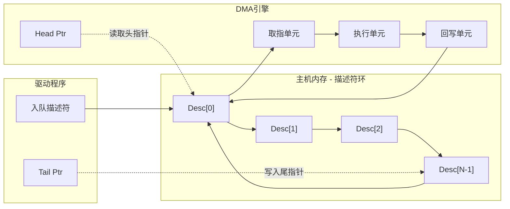

# PCIe DMA与数据传输

<span class="badge-i">[Intermediate]</span>

在高速外设与主机内存之间搬运大量数据时，CPU逐字节复制的开销不可接受。
<span class="red">PCIe DMA（Direct Memory Access）引擎</span>允许外设在不占用CPU的情况下直接读写系统内存，是现代嵌入式存储、网络与加速器设计的核心机制。
<br>
PCIe DMA的设计涉及描述符环管理、Scatter-Gather列表解析、地址转换以及嵌入式SoC中的AXI-PCIe桥接，理解这些要素是构建高性能数据通道的前提。

---

## <strong>DMA引擎架构</strong>

<span class="green">DMA引擎</span>是PCIe端点（Endpoint）或Root Complex内部的可编程硬件模块，负责将TLP（Transaction Layer Packet）读写请求从外设发起至主机内存。
<br>
一个典型的PCIe DMA引擎包含以下子模块：通道仲裁器、地址生成单元、描述符取指器、数据缓冲FIFO以及TLP组装器。
<br>
引擎通过BAR（Base Address Register）映射的控制寄存器暴露给驱动程序，驱动配置源地址、目的地址、传输长度后即可启动一次DMA事务。

```c
// 典型PCIe DMA引擎寄存器布局（BAR0偏移）
#define DMA_CTRL_REG      0x00  // 启动/停止控制
#define DMA_STATUS_REG    0x04  // 完成与错误状态
#define DMA_SRC_ADDR_LO   0x08  // 源地址低32位
#define DMA_SRC_ADDR_HI   0x0C  // 源地址高32位（64位寻址）
#define DMA_DST_ADDR_LO   0x10  // 目的地址低32位
#define DMA_DST_ADDR_HI   0x14  // 目的地址高32位
#define DMA_LENGTH_REG    0x18  // 传输字节数

// 启动一次H2C（Host-to-Card）DMA
void dma_start_h2c(struct pcie_dev *pdev, dma_addr_t host_addr, u64 dev_addr, u32 len)
{
    iowrite32(lower_32_bits(host_addr), pdev->bar0 + DMA_SRC_ADDR_LO);
    iowrite32(upper_32_bits(host_addr), pdev->bar0 + DMA_SRC_ADDR_HI);
    iowrite32(lower_32_bits(dev_addr), pdev->bar0 + DMA_DST_ADDR_LO);
    iowrite32(upper_32_bits(dev_addr), pdev->bar0 + DMA_DST_ADDR_HI);
    iowrite32(len, pdev->bar0 + DMA_LENGTH_REG);
    iowrite32(DMA_CTRL_START | DMA_CTRL_IRQ_EN, pdev->bar0 + DMA_CTRL_REG);
}
```

DMA引擎通常支持两种工作模式：
<span class="green">Register Mode</span>（寄存器直接配置单次传输）和<span class="green">Descriptor Mode</span>（描述符环驱动批量传输）。
<br>
Register Mode适合小数据量或控制命令；Descriptor Mode则在视频流、NVMe队列、网络包处理等高吞吐场景下成为必需。
<br>
<span class="blue">嵌入式SoC中的PCIe DMA引擎常与AXI总线桥接，需特别注意AXI与PCIe的地址宽度差异以及Cache一致性协议映射。</span>

---

### <strong>描述符环设计</strong>

描述符环（Descriptor Ring）是DMA引擎批量传输的核心数据结构。
<span class="red">描述符</span>是存储在主机内存中的定长记录，每个描述符定义一次DMA子传输的源地址、目的地址、长度和控制标志。
<br>
DMA引擎通过PCIe读取描述符，解析后发起数据搬运，完成后再写回状态，形成"取指-执行-回写"的流水线。

```c
// 典型PCIe DMA描述符结构（64字节对齐）
struct dma_desc {
    u64 src_addr;      // 数据源物理地址
    u64 dst_addr;      // 数据目的物理地址
    u32 length;        // 本次传输字节数
    u32 ctrl;          // 控制位：SOF/EOF/IRQ等
    u64 next_desc;     // 下一个描述符物理地址
    u64 user_data;     // 驱动私有数据，硬件透传
} __attribute__((aligned(64)));
```

描述符环的硬件实现通常采用<span class="green">生产者-消费者模型</span>：驱动程序作为生产者写入待处理的描述符，更新尾指针（Tail Pointer）；DMA引擎作为消费者读取并执行，更新头指针（Head Pointer）。
<br>
当头指针追上尾指针时，环为空，引擎进入等待状态；当尾指针绕回头指针时，环为满，驱动需等待或分配更大的环。



环形缓冲（Ring Buffer）的优势在于避免了动态内存分配的开销，且在连续数据流场景下具有确定性的延迟。
<br>
<span class="blue">描述符环大小需权衡延迟与吞吐量：过小的环在突发流量下容易溢出，过大的环则增加内存占用和Cache失效概率。</span>
<br>
典型嵌入式系统中描述符环大小配置为256至4096个条目，每个条目64字节，总计16KB至256KB。

---

## <strong>Scatter-Gather机制</strong>

<span class="red">Scatter-Gather（SG）</span>允许DMA引擎将分散在物理内存中的多个不连续页聚合为一次逻辑传输，或将一次逻辑传输拆分到多个物理页中。
<br>
操作系统中用户态缓冲区通常通过<span class="green">vmalloc</span>或<span class="green">mmap</span>分配，物理页不连续，SG是支持这些缓冲区直接DMA的关键技术。

```c
// Linux Scatter-Gather列表示例
struct scatterlist sg[4];
sg_init_table(sg, 4);
sg_set_buf(&sg[0], buf0, 4096);   // 第一页
sg_set_buf(&sg[1], buf1, 4096);   // 第二页（物理不连续）
sg_set_buf(&sg[2], buf2, 2048);   // 第三页
sg_set_buf(&sg[3], buf3, 6144);   // 第四页

// 映射SG列表至DMA可访问地址
int nents = dma_map_sg(dev, sg, 4, DMA_FROM_DEVICE);
for (int i = 0; i < nents; i++) {
    // 填充描述符：sg_dma_address(&sg[i]) 和 sg_dma_len(&sg[i])
}
```

SG列表的DMA映射依赖<span class="green">IOMMU</span>或<span class="green">SWIOTLB</span>完成地址转换。
<br>
若系统无IOMMU，<span class="green">dma_map_sg()</span>仅将内核虚拟地址转换为物理地址；若存在IOMMU，则进一步将物理页映射为连续的IOVA（I/O Virtual Address），DMA引擎看到的仍是连续地址空间。
<br>
<span class="blue">在嵌入式系统中启用IOMMU会引入额外延迟（约200-500ns/TLP），但对于安全性要求高的场景（如虚拟化）不可或缺。</span>

Scatter-Gather描述符与简单描述符的区别在于控制标志。SG描述符通常包含<span class="green">First Segment</span>和<span class="green">Last Segment</span>位，指示当前描述符在逻辑传输中的位置。
<br>
DMA引擎在读取到Last Segment标志后，触发完成中断，通知驱动整个逻辑传输已结束。
<br>
对于支持<span class="green">MSI-X</span>的高端控制器，每个描述符环队列可绑定独立的中断向量，避免多队列间的中断争用。

---

## <strong>嵌入式SoC中的PCIe DMA实现</strong>

### <strong>Zynq UltraScale+ MPSoC</strong>

Xilinx Zynq UltraScale+ MPSoC集成了<span class="green">AXI-PCIe Bridge</span>和独立的<span class="green">XDMA</span>或<span class="green">CDMA</span>硬核。
<br>
AXI-PCIe Bridge将PL（Programmable Logic）侧的AXI4/AXI4-Lite事务转换为PCIe TLP，XDMA则提供多通道的H2C（Host-to-Card）和C2H（Card-to-Host）DMA引擎。
<br>
XDMA支持最大256个描述符的环形队列，且每个通道具有独立的AXI Stream接口，可直接连接至定制加速器。

```dts
// Zynq UltraScale+ 设备树中XDMA PCIe节点配置示例
&pcie {
    compatible = "xlnx,nwl-pcie-2.11";
    reg = <0x0 0xFD0E0000 0x0 0x1000>,  /* 控制器寄存器 */
          <0x0 0xFD0E0100 0x0 0x1000>;  /* Bridge寄存器 */
    #address-cells = <3>;
    #size-cells = <2>;
    bus-range = <0x0 0x1>;
    ranges = <0x02000000 0x00 0xE0000000 0x0 0xE0000000 0x00 0x10000000>;
    dma-coherent;  // 启用Cache一致性，避免显式Cache维护
};
```

<span class="blue">Zynq中启用dma-coherent属性后，DMA引擎与CPU共享Cache一致性域，无需在传输前后执行cache_flush/cache_invalidate操作。</span>
<br>
但需注意，若PL逻辑跨越Cache行边界写入数据，CPU可能在Cache行的非更新部分读到旧值，必须通过barrier指令确保顺序。

### <strong>TI AM62x与AM64x</strong>

Texas Instruments AM6x系列SoC集成了<span class="green">PCIe Gen2/3控制器</span>，配合<span class="green">UDMAP（Unified DMA）</span>完成外设与内存间的高速搬运。
<br>
UDMAP采用Packet DMA架构，描述符称为<span class="green">TR（Transfer Request）</span>，支持链接式TR链和环模式。
<br>
AM6x的PCIe控制器通过<span class="green">Navigator</span>子系统与UDMAP交互，支持最大16个独立通道，每个通道可配置为单向（RX或TX）。

---

## <strong>为什么PCIe需要专用DMA引擎而非依赖CPU memcpy</strong>

表面上看，CPU执行<span class="green">memcpy()</span>也能完成数据搬运，但在嵌入式系统中存在三个根本性瓶颈。
<br>
第一，PCIe事务包（TLP）的封装需要PCIe Root Complex参与，CPU memcpy通过内存读写触发Root Complex生成TLP，但CPU并非为流水线化的TLP组装优化，每个Cache行访问都会引入完整的Load/Store流水线延迟。
<br>
第二，现代CPU的Cache层次结构使得外设数据必须经由L1/L2/L3 Cache，形成"内存-Cache-CPU-Cache-内存"的冗余路径，严重污染Cache。
<br>
第三，CPU memcpy是同步阻塞操作，传输千兆字节级数据时会独占CPU核心数毫秒，而DMA引擎将CPU释放出来执行协议解析或业务逻辑。

专用DMA引擎的优势体现在硬件并行性上：DMA引擎直接访问PCIe SerDes和链路层，以流水线方式连续发送TLP，无需经过CPU的Load/Store单元。
<br>
在x86架构中，现代DMA引擎（如Intel DSA/IAA）甚至支持<span class="green">内存到内存</span>的DMA，绕过PCIe总线，但嵌入式SoC中仍以<span class="green">外设到内存</span>的DMA为主。
<br>
<span class="blue">对于嵌入式Linux开发者，关键结论是：任何涉及批量外设数据传输的场景都应优先使用DMA，仅在数据量小于Cache行（通常64-128字节）时考虑CPU轮询。</span>

---

## <strong>历史演进</strong>

PCI时代的DMA由<span class="green">Bus Mastering</span>实现，即PCI设备在获得总线所有权后直接发起读写，无中央DMA控制器协调。
<br>
PCI总线的并行仲裁机制限制了多主设备的并发效率，且32位/33MHz的总线带宽（约133MB/s）很快成为瓶颈。
<br>
2003年PCIe 1.0发布，基于点对点串行链路的架构让每个设备独享链路带宽，DMA引擎的设计从"总线仲裁"转向"描述符流水线优化"。

PCIe 2.0（2007年）将单lane速率提升至5GT/s，DMA引擎开始支持<span class="green">MSI</span>替代传统INTx中断，减少中断延迟。
<br>
PCIe 3.0（2010年）引入8GT/s和128b/130b编码，DMA引擎的数据缓冲FIFO深度从KB级扩展到MB级，以隐藏更大的链路延迟。
<br>
PCIe 4.0（2017年）和5.0（2019年）分别达到16GT/s和32GT/s，高端SSD控制器（如Samsung PM1735）内置16通道DMA引擎，每通道128队列深度，总IOPS突破百万。

2022年PCIe 6.0引入<span class="green">FLIT</span>和<span class="green">PAM4</span>编码，DMA引擎的设计面临新的挑战：PAM4的信噪比恶化要求更强的FEC（Forward Error Correction），增加了链路层延迟，DMA引擎的FIFO需要更深以吸收抖动。
<br>
同时，<span class="green">CXL（Compute Express Link）</span>在PCIe 6.0物理层之上定义了内存语义，DMA引擎的地址空间从传统的IOVA扩展到CXL.cache一致性域，为嵌入式加速器开辟了新的编程模型。

---

## <strong>小结</strong>

PCIe DMA引擎是现代嵌入式系统实现高速数据搬运的基石。从描述符环的设计到Scatter-Gather的地址映射，从Zynq的AXI-PCIe桥接至TI的UDMAP架构，理解DMA的硬件机制是优化外设性能的前提。
<br>
核心要点包括：描述符环的大小与延迟权衡、SG列表的IOMMU映射开销、Cache一致性对嵌入式SoC的影响，以及专用DMA引擎相比CPU memcpy的硬件并行性优势。

| 练习题 | 难度 | 答案要点 |
|--------|------|----------|
| 描述符环的头指针由谁更新，尾指针由谁更新？若驱动错误地同时更新两者，会导致什么后果？ | 基础 | 头指针由DMA引擎（消费者）更新，尾指针由驱动（生产者）更新。同时更新会导致竞争条件，可能产生重复传输或描述符丢失。 |
| Scatter-Gather列表在存在IOMMU和无IOMMU时，dma_map_sg()的行为有何不同？嵌入式系统中何时应禁用IOMMU？ | 进阶 | 有IOMMU时映射为连续IOVA，无IOMMU时仅返回物理地址。实时性要求极高且安全性可控的嵌入式场景可考虑禁用IOMMU以降低延迟。 |
| Zynq UltraScale+中启用dma-coherent后，PL逻辑跨越Cache行写入时CPU为何可能读到旧数据？应如何解决？ | 深入 | 因为CPU读取时只命中Cache行中未被更新的部分，旧Cache数据仍有效。应使用dmb/isb屏障指令或分配对齐的DMA缓冲区。 |

---

<span class="purple">扩展阅读：</span> Xilinx PG195（XDMA Product Guide）、Linux Kernel Documentation on DMA Engine API（drivers/dma/dmaengine.c）、PCIe Base Specification Rev 5.0 Chapter 2（Architecture）、CXL 2.0 Specification（CXL.cache Protocol）。
