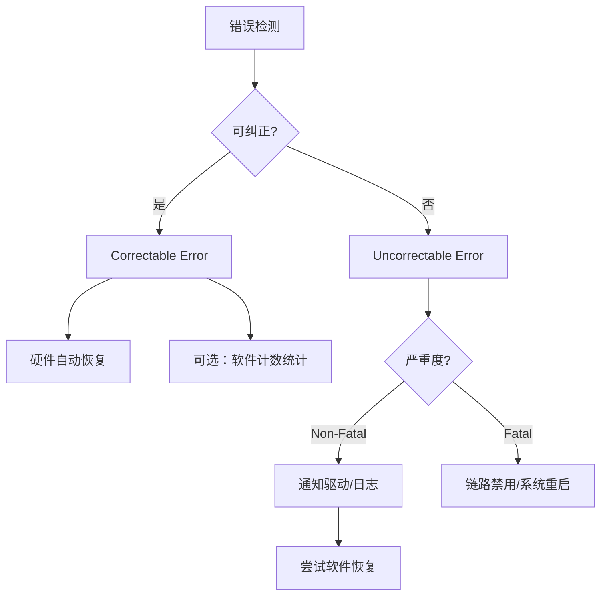

# PCIe高级错误报告AER

<span class="badge-i">[Intermediate]</span>

PCIe链路的物理层、数据链路层和事务层均可能在传输过程中检测到异常，如CRC校验失败、流量控制违规或TLP格式错误。
<span class="red">PCIe高级错误报告（Advanced Error Reporting，AER）</span>是PCIe规范定义的精细错误检测与报告机制，相比传统PCI的粗糙中断方式，AER提供了逐层分类、逐位追踪的可见性。
<br>
理解AER的错误分类体系、Root Port的角色以及Linux内核中AER驱动的处理流程，是调试PCIe硬件问题与保障系统可靠性的必要技能。

---

## <strong>AER机制概述</strong>

AER通过PCIe配置空间中的扩展配置空间寄存器实现，位于<span class="green">Extended Capability ID 0x0001</span>。
<br>
每个支持AER的设备（Endpoint、Switch Upstream/Downstream Port、Root Port）都拥有一组AER寄存器，包括错误状态寄存器、错误掩码寄存器、错误严重度寄存器以及TLP前缀日志寄存器。
<br>
错误检测发生后，硬件首先判断错误的严重度：Correctable（可纠正）或Uncorrectable（不可纠正），再根据掩码寄存器决定是否向软件报告。

```c
// PCIe AER Capability 寄存器偏移（相对于Capability基址）
#define PCI_ERR_UNCOR_STATUS    0x04  // Uncorrectable Error Status
#define PCI_ERR_UNCOR_MASK       0x08  // Uncorrectable Error Mask
#define PCI_ERR_UNCOR_SEVER      0x0C  // Uncorrectable Error Severity
#define PCI_ERR_COR_STATUS       0x10  // Correctable Error Status
#define PCI_ERR_COR_MASK         0x14  // Correctable Error Mask
#define PCI_ERR_CAP              0x18  // Advanced Error Capabilities and Control
#define PCI_ERR_HEADER_LOG       0x1C  // Header Log Register (16 bytes)
#define PCI_ERR_ROOT_COMMAND     0x2C  // Root Error Command (Root Port only)
#define PCI_ERR_ROOT_STATUS      0x30  // Root Error Status (Root Port only)

// 读取Root Port的Uncorrectable Error Status
u32 uncor_status = readl(root_port->aer_base + PCI_ERR_UNCOR_STATUS);
if (uncor_status & PCI_ERR_UNC_COMP_ABORT) {
    // Completion Abort 错误处理
}
```

<span class="blue">AER与传统PCI错误处理的根本区别在于：PCI仅通过INTx中断线通知"有错误"，而AER可以精确告知错误的类型、发生层、涉及的事务头部甚至数据载荷的前缀字节。</span>
<br>
这种可见性使得固件和驱动程序能够实施差异化的恢复策略，而非简单重启设备或系统。

---

## <strong>错误分类体系</strong>

AER将错误分为两大类：<span class="green">Correctable Errors</span>（可纠正错误）和<span class="green">Uncorrectable Errors</span>（不可纠正错误）。
<br>
分类标准基于硬件是否能在不丢失数据且不中断链路的前提下自动恢复。

### <strong>Correctable错误</strong>

Correctable错误指PCIe硬件能够自动纠正而无需软件干预的异常，典型类型包括：

- <span class="green">Receiver Error</span>：物理层接收到的符号违反8b/10b或128b/130b编码规则，硬件自动丢弃并重训练链路
- <span class="green">Bad TLP</span>：事务层CRC校验失败，数据链路层自动请求重传（ACK/NAK机制）
- <span class="green">Bad DLLP</span>：数据链路层包CRC校验失败，硬件丢弃并忽略
- <span class="green">Replay Timeout</span>：发送方在超时窗口内未收到ACK，自动重传TLP
- <span class="green">Replay Rollover</span>：序列号计数器回绕，属于正常操作的一部分



<span class="blue">Correctable错误虽然硬件已自行恢复，但频繁出现预示物理链路质量劣化，如信号完整性不足、时钟抖动过大或连接器接触不良。</span>
<br>
Linux内核通过EDAC（Error Detection and Correction）框架和PCIe AER sysfs接口暴露Correctable错误计数，运维人员可据此实施预防性维护。

### <strong>Uncorrectable错误</strong>

Uncorrectable错误指硬件无法自动恢复、可能导致数据丢失或链路中断的异常，进一步按严重度分为<span class="green">Non-Fatal</span>和<span class="green">Fatal</span>两类。

| 错误类型 | 严重度 | 说明 |
|----------|--------|------|
| Training Error | Fatal | 链路训练失败，无法建立稳定连接 |
| Data Link Protocol Error | Fatal | 数据链路层协议违规（如非法序列号） |
| Surprise Down | Fatal | 链路意外断开（ Surprise Removal ） |
| Poisoned TLP | Non-Fatal | TLP中的EP（Error-Poisoned）位被置位，数据已损坏但链路完好 |
| Flow Control Protocol Error | Non-Fatal | 流量控制信用违规，可能导致数据丢失 |
| Completion Timeout | Non-Fatal | 请求方在超时内未收到Completion TLP |
| Completer Abort | Non-Fatal | 接收方主动Abort请求 |
| Unexpected Completion | Non-Fatal | 收到未匹配的Completion TLP |

```c
// Linux AER驱动中错误严重度映射
static const char *aer_uncor_error_string[] = {
    [0]  = "Undefined",
    [4]  = "Data Link Protocol",
    [12] = "Poisoned TLP",
    [13] = "Flow Control Protocol",
    [14] = "Completion Timeout",
    [15] = "Completer Abort",
    [16] = "Unexpected Completion",
    [17] = "Receiver Overflow",
    [18] = "Malformed TLP",
    [19] = "ECRC Error",
    [20] = "Unsupported Request",
};
```

Non-Fatal错误通常保留链路连接，由软件决定是否重试事务、重置设备或仅记录日志。
<br>
Fatal错误则强制链路进入<span class="green">Link Down</span>状态，Root Port禁用下游端口，需系统层面介入恢复。

---

## <strong>Root Port错误处理</strong>

<span class="red">Root Port</span>是PCIe拓扑的根节点，是所有错误消息的最终汇聚点。
<br>
当Endpoint或Switch检测到Uncorrectable错误时，通过<span class="green">Error Message TLP</span>（ERR_COR、ERR_NONFATAL、ERR_FATAL）向Root Port报告。
<br>
Root Port接收Error Message后，更新自身的<span class="green">Root Error Status</span>寄存器，并根据<span class="green">Root Error Command</span>寄存器配置决定是否向CPU发起中断（MSI/MSI-X/INTx）。

```c
// Root Error Command 寄存器位定义
#define PCI_ERR_ROOT_CMD_COR_EN    0x01  // Correctable Error Reporting Enable
#define PCI_ERR_ROOT_CMD_NONFATAL_EN 0x02  // Non-Fatal Error Reporting Enable
#define PCI_ERR_ROOT_CMD_FATAL_EN  0x04  // Fatal Error Reporting Enable

// 启用Root Port的所有AER报告
void aer_enable_root_port(struct pci_dev *rp)
{
    u32 cmd = PCI_ERR_ROOT_CMD_COR_EN |
              PCI_ERR_ROOT_CMD_NONFATAL_EN |
              PCI_ERR_ROOT_CMD_FATAL_EN;
    pci_write_config_dword(rp, rp->aer_cap + PCI_ERR_ROOT_COMMAND, cmd);
}
```

Root Port的AER处理流程涉及三层协作：硬件层记录错误寄存器、固件层（ACPI/UEFI）初始化AER能力、操作系统层读取日志并执行恢复。
<br>
<span class="blue">在多Root Port系统（如NUMA架构）中，AER中断可能路由至不同的CPU核心，内核需保证错误处理线程与受影响的PCIe域绑定，避免跨NUMA节点的低效处理。</span>
<br>
对于致命错误，Root Port通常执行<span class="green">Secondary Bus Reset</span>重置下游总线，若重置失败则触发内核的PCIe错误处理回调，由设备驱动尝试更激进的恢复或隔离设备。

---

## <strong>Linux AER驱动实现</strong>

Linux内核的AER支持由<span class="green">drivers/pci/pcie/aer.c</span>实现，该驱动在PCIe核心初始化时自动加载。
<br>
AER驱动的核心职责包括：注册Root Port中断处理程序、解析错误寄存器、通过printk/printk_ratelimited输出日志，以及调用受影响设备的错误回调函数。

```c
// Linux AER中断处理核心流程（简化）
static irqreturn_t aer_irq(int irq, void *context)
{
    struct pcie_device *adev = context;
    struct pci_dev *pdev = adev->port;
    struct aer_err_info info;

    // 1. 读取Root Error Status
    info.root_status = readl(pdev->aer_cap + PCI_ERR_ROOT_STATUS);
    if (!(info.root_status & PCI_ERR_ROOT_STATUS_SEVERITY_MASK))
        return IRQ_NONE;  // 非本中断源

    // 2. 解析错误来源（First/Second Error Pointer）
    info.id = info.root_status >> 27;  // First Error Pointer

    // 3. 读取Header Log（若存在）
    if (info.root_status & PCI_ERR_ROOT_STATUS_LOG_RDY) {
        for (int i = 0; i < 4; i++)
            info.header_log[i] = readl(pdev->aer_cap + PCI_ERR_HEADER_LOG + i*4);
    }

    // 4. 调用设备注册的回调
    if (pdev->err_handler && pdev->err_handler->error_detected)
        pdev->err_handler->error_detected(pdev, info.severity);

    // 5. 清除状态寄存器
    writel(info.root_status, pdev->aer_cap + PCI_ERR_ROOT_STATUS);
    return IRQ_HANDLED;
}
```

设备驱动可通过<span class="green">pci_enable_pcie_error_reporting()</span>和<span class="green">pci_disable_pcie_error_reporting()</span>启用或禁用本设备的AER报告。
<br>
更细粒度的控制通过<span class="green">sysfs</span>接口实现：每个PCIe设备在<span class="green">/sys/bus/pci/devices/xxx/aer_</span>*下暴露错误计数和掩码文件。
<br>
<span class="purple">扩展阅读：通过echo值至aer_mask文件，可临时屏蔽特定错误类型的报告，这在排除硬件干扰时有用，但不应用于生产环境。</span>

---

## <strong>为什么PCIe需要独立的错误报告机制而非复用传统中断</strong>

传统PCI的错误处理依赖INTx中断线，但PCI总线的共享中断特性使得"错误源定位"成为噩梦：一条INTx线上可能挂接多个设备，任何一个设备触发中断都需要轮询所有设备的状态寄存器。
<br>
PCIe的串行点对点架构虽然天然消除了总线竞争，但链路层引入了全新的错误类型（如Replay Timeout、DLLP CRC错误），这些错误需要链路层和事务层协同处理，传统PCI的简单中断模型无法承载这种多层语义。

AER的设计哲学是"分层、分类、可追溯"。分层意味着物理层、数据链路层和事务层各自维护独立的错误状态；分类意味着Correctable与Uncorrectable的区分使软件能够区分"正常老化"和"致命故障"；可追溯意味着Header Log寄存器保存了触发错误的TLP前16字节，让调试人员可以还原出错的内存地址或请求ID。
<br>
<span class="blue">在嵌入式系统中，AER的另一个不可替代之处在于其低延迟特性：错误消息通过带内TLP传输，无需额外的边带信号线，这在引脚受限的SoC封装中尤为重要。</span>
<br>
如果复用传统GPIO中断报告PCIe错误，不仅增加布线复杂度，更使得错误类型信息必须通过辅助寄存器轮询获取，延长了故障响应时间。

---

## <strong>历史演进</strong>

PCI时代（1992-2003）的错误报告极其简单：仅通过PERR#和SERR#两条边带信号线指示奇偶校验错误。
<br>
设备检测到地址或数据奇偶校验失败后置位PERR#，系统错误（如非法配置访问）则触发SERR#。
<br>
这种机制没有错误分类，没有事务追溯能力，调试人员只能通过逐设备轮询配置空间的<span class="green">Status Register</span>（偏移0x06）定位问题。

PCI-X（1998年）引入了更复杂的分割事务和64位扩展，但错误报告模型仍停留在PCI框架内，仅增加了Message Signaled Interrupt（MSI）作为INTx的替代。
<br>
直到2003年PCIe 1.0发布，AER作为可选的Extended Capability首次出现，标志着PCIe从"总线"到"网络"的范式转变——点对点链路需要独立的错误检测和恢复机制。

PCIe 2.0（2007年）将AER从可选提升为推荐实现，并增加了<span class="green">TLP Prefix Log</span>支持，使得错误追溯可以记录带有前缀的TLP。
<br>
PCIe 3.0（2010年）引入了<span class="green">ECRC（End-to-End CRC）</span>，允许Optional TLP Digest字段覆盖整个TLP路径的完整性校验，AER的Uncorrectable错误类型因此新增了ECRC Error位。
<br>
PCIe 4.0（2017年）和5.0（2019年）在链路速率倍增的同时，对AER的FPGA和SoC实现提出了时序挑战：更高的SerDes速率意味着更窄的眼图裕量，Receiver Error的发生概率上升，AER的Correctable错误计数器成为信号完整性监控的关键指标。

PCIe 6.0（2022年）的FLIT模式改变了TLP/DLLP的封装粒度，AER规范相应调整了错误检测边界：FLIT级别的CRC取代了传统的TLP LCRC，数据链路层的错误报告单元从TLP变为FLIT。
<br>
同时，PCIe 6.0增强了AER与<span class="green">IDE（Integrity and Data Encryption）</span>的交互，当检测到加密报文的完整性校验失败时，AER会记录特定的IDE Error类型，为安全关键系统提供审计线索。

---

## <strong>小结</strong>

PCIe AER机制通过分层检测、精确分类和事务追溯，为嵌入式系统提供了远超传统PCI的错误可见性。
<br>
Correctable错误是硬件自愈能力的体现，但频繁出现预示物理链路退化；Uncorrectable错误中的Non-Fatal和Fatal区分则指导软件实施差异化的恢复策略。
<br>
Linux AER驱动通过Root Port中断聚合设备错误报告，配合sysfs接口实现用户态监控和调试。

| 练习题 | 难度 | 答案要点 |
|--------|------|----------|
| 为什么Receiver Error属于Correctable错误而Data Link Protocol Error属于Fatal？两者在链路层的行为差异是什么？ | 基础 | Receiver Error是物理层信号噪声导致的单个符号错误，硬件可通过重训练或重传恢复；Data Link Protocol Error涉及序列号或状态机违规，无法自动恢复，链路必须重置。 |
| Root Port的Root Error Status寄存器中，First Error Pointer字段的作用是什么？为什么需要Second Error Pointer？ | 进阶 | First Error Pointer指向最先发生的Uncorrectable错误位，Second Error Pointer指向后续不同类的错误。两者并存是因为错误可能并发，软件需按时间顺序处理。 |
| 在Linux内核中，若某PCIe设备频繁报告Completion Timeout（Non-Fatal），驱动应如何设计恢复策略以避免影响系统稳定性？ | 深入 | 驱动应在error_detected回调中增加超时计数器，超过阈值后调用pci_disable_device()隔离设备，或尝试Warm Reset。同时需排查是否是固件Bug导致的虚假超时。 |

---

<span class="purple">扩展阅读：</span> PCI Express Base Specification Rev 6.0 Chapter 6（Error Detection and Handling）、Linux Kernel Source drivers/pci/pcie/aer.c、Intel VT-d Specification Chapter 7（Fault Recording）、ARM SMMUv3 Specification Section 6.2（Event Queue Error Reporting）。
