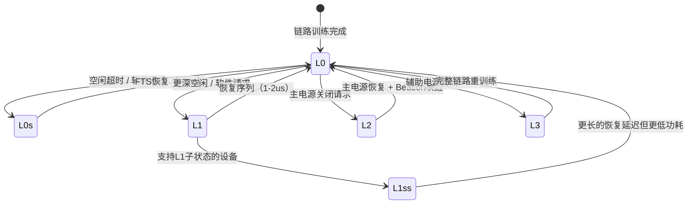

# PCIe电源管理与热插拔

<span class="badge-i">[Intermediate]</span>

移动嵌入式设备对功耗的苛刻要求使得PCIe链路的动态电源管理成为必选项。
<span class="red">PCIe活动状态电源管理（Active State Power Management，ASPM）</span>定义了从全速运行（L0）到完全关闭（L3）的多级链路状态，允许系统在性能与能耗之间动态权衡。
<br>
与此同时，服务器和工业控制场景对PCIe设备的在线更换需求催生了热插拔（Hot Plug）规范，其复杂度远超传统PCI的机械开关方案，涉及电气隔离、信号完整性保护和 Surprise Removal 的软件容错。

---

## <strong>ASPM链路状态机</strong>

PCIe链路在物理层定义了五个主要电源状态：
<span class="green">L0</span>（全速运行）、
<span class="green">L0s</span>（快速唤醒低功耗）、
<span class="green">L1</span>（深度低功耗）、
<span class="green">L2</span>（辅助电源维持）和
<span class="green">L3</span>（完全断电）。
<br>
状态转换由链路两端的组件（Root Port和Endpoint）协商完成，协商通过TS（Training Sequence）有序集合中的FTS（Fast Training Sequence）和电气空闲（Electrical Idle）信号实现。



L0s和L1是ASPM的核心动态管理状态，均可在链路空闲时自动进入，区别在于退出延迟和功耗节省程度。
<br>
L2/L3则属于系统级电源管理，通常在系统挂起或设备移除时进入，需要辅助电源（Aux Power）维持配置空间内容。

### <strong>L0s状态</strong>

L0s是ASPM中最轻量的低功耗状态，链路两端在检测到无待发送TLP/DLLP时主动进入电气空闲。
<br>
从L0s恢复至L0仅需发送少量FTS有序集合，典型退出延迟小于1微秒，因此对吞吐量的影响极小。
<br>
<span class="blue">L0s的局限在于仅关闭发送器（Tx）或接收器（Rx）的一侧时钟，链路参考时钟仍保持运行，因此功耗节省有限（约节省10-20%链路功耗）。</span>
<br>
L0s适用于间歇性突发流量的场景，如NVMe SSD的随机I/O负载。

### <strong>L1与L1子状态</strong>

L1是比L0s更深的低功耗状态，链路两端同时关闭SerDes发送器和PLL（Phase-Locked Loop），仅保留参考时钟或Beacon检测电路。
<br>
L1的退出延迟约为1-2微秒，虽比L0s长两个数量级，但在面向突发大包的场景（如视频采集）仍可接受。
<br>
PCIe 3.1引入了<span class="green">L1子状态（L1 Substates，L1ss）</span>，包括L1.1（关闭PLL但保留参考时钟）和L1.2（关闭参考时钟，仅保留Beacon唤醒检测）。

```c
// Linux ASPM配置示例：通过setpci启用L1和L1ss
// 读取Link Control Register（偏移0x10于PCIe Capability）
$ setpci -s 00:01.0 0x10.W
// 写入：启用ASPM L0s和L1（位1:0 = 11b）
$ setpci -s 00:01.0 0x10.W=0x43

// 内核命令行关闭ASPM（用于调试时序问题）
// pci=pcie_bus_perf,disable_aspm
```

L1ss的引入使ASPM的功耗节省从链路级扩展到平台级。
<span class="blue">在嵌入式ARM SoC中，启用L1.2可使PCIe控制器从数百毫安降至数十微安，是电池供电设备（如边缘AI相机）的关键优化手段。</span>
<br>
但L1.2的退出延迟可达数十至数百微秒，对于延迟敏感的实时控制应用（如工业以太网）不可接受。

### <strong>L2/L3状态</strong>

L2状态要求链路两端维持辅助电源（Vaux，通常为3.3V），以保留配置空间内容和唤醒逻辑（Beacon或WAKE#信号）。
<br>
L3是完全断电状态，所有链路状态丢失，恢复时必须执行完整的链路训练（LTSSM）。
<br>
在嵌入式Linux系统中，L2/L3转换通常由ACPI或Device Tree的电源管理节点控制，驱动程序通过<span class="green">pci_set_power_state()</span>请求状态变更。

---

## <strong>热插拔协议</strong>

PCIe热插拔（Native Hot Plug）定义了一套标准化的硬件信号和软件协议，用于在系统运行时安全地插入或移除PCIe设备。
<br>
与PCI的机械卡扣和共享总线不同，PCIe的点对点链路使得每个插槽拥有独立的电气隔离能力，热插拔的实现与Root Port的电源和复位控制紧密耦合。

### <strong>Attention Button与指示灯</strong>

标准PCIe热插拔插槽配备<span class="green">Attention Button</span>（物理按钮，通知系统用户意图移除设备）、
<span class="green">Power Indicator</span>（LED指示插槽电源状态）和
<span class="green">Attention Indicator</span>（LED指示错误或等待操作）。
<br>
用户按下Attention Button后，系统发起有序移除流程：通知驱动程序停止I/O、卸载设备、关闭插槽电源，最后允许物理拔出。

```c
// Linux PCI热插拔核心流程（简化）
static void pciehp_remove(struct controller *ctrl)
{
    // 1. 通过 Attention Button 按下触发
    ctrl_info(ctrl, "Slot(%s): Link Down attention\n", slot_name(ctrl));

    // 2. 通知设备驱动执行 .remove()
    pci_stop_root_bus(ctrl->pcie->port->subordinate);
    pci_remove_root_bus(ctrl->pcie->port->subordinate);

    // 3. 关闭插槽电源（通过Slot Control寄存器）
    pcie_write_cmd(ctrl, PCI_EXP_SLTCTL_PWR_OFF, PCI_EXP_SLTCTL_PWR_CTRL);

    // 4. 等待电源稳定后允许物理拔出
    msleep(1000);
    ctrl->state = OFF_STATE;
}
```

### <strong>Surprise Removal处理</strong>

<span class="red">Surprise Removal</span>指用户在没有按下Attention Button的情况下直接拔出设备。
<br>
这种情况下链路在物理层突然断开，Root Port通过接收到的链路状态变化（Link Down）或Surprise Down错误检测到移除事件。
<br>
Surprise Removal对软件栈的冲击远大于有序移除：正在进行的DMA事务会突然中断，TLP可能在链路中断时丢失，设备驱动必须处理不完整的Scatter-Gather传输和悬挂的Completion。

```c
// Linux Surprise Removal 处理路径
// 当Root Port检测到Link Down时，调用已注册的错误回调
static pci_ers_result_t pcie_surprise_remove(struct pci_dev *pdev)
{
    // 标记设备已移除，阻止后续I/O操作
    set_bit(__PCI_REMOVED, &pdev->state);

    // 取消所有未完成的DMA映射，释放IOMMU页表
    dma_unmap_sg_attrs(pdev->dev.parent, sg, nents, dir, attrs);

    // 调用驱动的 .remove() 清理资源
    if (pdev->driver && pdev->driver->remove)
        pdev->driver->remove(pdev);

    // 从PCI总线树中注销设备节点
    pci_stop_and_remove_bus_device(pdev);
    return PCI_ERS_RESULT_DISCONNECT;
}
```

<span class="blue">Surprise Removal 在嵌入式系统中尤为危险：工业现场的振动、车载环境的颠簸均可能导致M.2或Mini-PCIe模块接触不良，驱动程序必须设计幂等的超时和重试机制。</span>
<br>
现代操作系统（Linux 5.10+）通过引入<span class="green">device_link</span>机制，将PCIe设备与其依赖的电源域和时钟域绑定，Surprise Removal触发时自动级联释放下游资源，避免 orphaned IRQ handler 和内存泄漏。

---

## <strong>Linux PCI热插拔实现</strong>

Linux内核的热插拔子系统由三层构成：
<span class="green">pciehp</span>（原生PCIe热插拔驱动）、
<span class="green">shpchp</span>（标准热插拔控制器驱动，遗留兼容）和
<span class="green">ACPI</span>（平台固件代理的热插拔事件）。
<br>
pciehp直接操作Root Port的<span class="green">Slot Capability/Control/Status</span>寄存器（PCIe Capability偏移0x14/0x18/0x1A），是最推荐的原生实现。

```c
// PCIe Slot Control 寄存器关键位
#define PCI_EXP_SLTCTL_PWR_CTRL    0x0400  // Power Control（bit10）
#define PCI_EXP_SLTCTL_PWR_IND     0x0800  // Power Indicator Control
#define PCI_EXP_SLTCTL_ATTEN_IND   0x1000  // Attention Indicator Control
#define PCI_EXP_SLTCTL_EIC         0x0008  // Electromechanical Interlock Control
#define PCI_EXP_SLTCTL_DLLSCE      0x0100  // Data Link Layer State Changed Enable

// 启用Slot状态变化中断
pcie_capability_set_word(port, PCI_EXP_SLTCTL, PCI_EXP_SLTCTL_DLLSCE);
```

pciehp驱动注册一个内核线程监听Slot Status寄存器的变化，包括Attention Button按下、Power Fault检测、MRL（Manually Retained Latch）状态变化以及Data Link Layer State Changed事件。
<br>
当检测到事件时，pciehp通过<span class="green">uevent</span>通知用户态（systemd/udev），用户态脚本可执行自定义操作如卸载驱动、同步文件系统或记录审计日志。

---

## <strong>为什么PCIe热插拔比传统PCI更复杂</strong>

传统PCI的总线架构是共享并行总线，所有设备挂接在同一组地址/数据/控制线上。
<br>
热插拔的实现相对简单：插槽电源关闭后，物理移除设备不会影响总线上其他设备的信号完整性，因为总线驱动器在插槽层面隔离。
<br>
但PCIe的点对点串行链路意味着每个设备独占一组差分对，移除设备时链路的突然断开会在电气层产生反射和瞬态噪声，可能影响相邻链路的信号完整性。

PCIe热插拔的复杂性还体现在软件栈的深度上。
<br>
传统PCI设备的热插拔仅涉及总线枚举和资源重新分配；PCIe设备则可能承载复杂的软件依赖：NVMe设备背后有块设备层、文件系统、分区表、逻辑卷管理；GPU设备涉及DRM/KMS子系统、CUDA上下文和显存分配。
<br>
有序移除需要从上到下逐层卸载，任何一层的阻塞都会导致热插拔失败。
<br>
<span class="blue">对于嵌入式系统，更现实的挑战是热插拔与电源管理的耦合：设备移除后其供电轨可能由PMIC（Power Management IC）统一管理，驱动需与regulator框架交互才能安全切断电源。</span>

---

## <strong>历史演进</strong>

PCI总线（1992年）本身不支持热插拔，扩展槽的电气设计是静态的。
<br>
1997年PCI Hot-Plug Specification作为PCI SIG的扩展文档发布，引入了共享总线上的机械隔离和电源控制，但实现笨重且依赖专用热插拔桥接芯片。
<br>
PC Card（PCMCIA）标准在笔记本领域率先实现了成熟的热插拔，但其16位/CardBus 32位的并行架构与PCIe无直接继承关系。

PCIe 1.0（2003年）将原生热插拔作为规范的一部分，定义了Slot Capability寄存器和Attention Button/Power Indicator信号。
<br>
早期实现（如Intel 915芯片组）热插拔可靠性差，主要因为SerDes收发器对链路瞬态敏感，电源时序控制不成熟。
<br>
PCIe 2.0（2007年）改善了链路训练的鲁棒性，缩短了从Link Down到可用状态的时间，使热插拔在服务器领域开始普及。

PCIe 3.0（2010年）和4.0（2017年）的速率倍增对热插拔提出了信号完整性挑战：更高的SerDes速率意味着更短的眼图裕量，热插拔时的瞬态反射更容易导致比特错误。
<br>
硬件设计上开始采用<span class="green">Pre-shoot</span>和<span class="green">De-emphasis</span>补偿技术，以及更严格的电源时序控制（Power Good信号的上升时间要求）。
<br>
PCIe 5.0（2019年）和6.0（2022年）进一步将热插拔的电气规范收紧，要求插槽连接器具备更好的接地屏蔽和更短的Stub长度，以控制插入损耗。

在软件层面，Linux内核对PCIe热插拔的支持经历了从shpchp到pciehp的演进。
<br>
Linux 2.6时代主要依赖ACPI的ACPIPHP驱动，由BIOS/UEFI代理热插拔事件，可靠性和一致性差。
<br>
Linux 3.x引入了原生的pciehp驱动，直接操作PCIe配置空间。
<br>
Linux 5.x将热插拔与Device Link、PM Domain框架深度整合，实现了更优雅的 Surprise Removal 资源回收。

---

## <strong>小结</strong>

PCIe电源管理通过ASPM的多级链路状态实现了动态功耗优化，从L0s的亚微秒恢复到L1.2的数十微安静态电流，满足不同嵌入式场景的能效需求。
<br>
热插拔协议则在电气隔离和软件卸载之间建立了标准化流程，Surprise Removal的容错处理是衡量系统鲁棒性的关键指标。
<br>
Linux内核的pciehp驱动与错误处理回调共同构成了完整的运行时设备管理框架。

| 练习题 | 难度 | 答案要点 |
|--------|------|----------|
| ASPM的L0s和L1状态在退出延迟和功耗节省上有何差异？为什么嵌入式实时系统可能禁用L1.2？ | 基础 | L0s恢复<1us但仅省10-20%功耗；L1恢复1-2us但省更多。L1.2的恢复延迟达数十至数百微秒，超出实时控制要求的确定性响应边界。 |
| Surprise Removal时，Root Port如何检测到设备已拔出？驱动程序应如何防止悬挂的DMA造成内存损坏？ | 进阶 | Root Port检测到Link Down或Surprise Down AER错误。驱动应取消未完成DMA映射、设置PCI_REMOVED标志、并释放IOMMU页表。 |
| 在ARM嵌入式SoC中，PCIe设备的电源域通常由PMIC管理。若热插拔移除NVMe设备后PMIC未及时关闭供电轨，会导致什么后果？应如何设计驱动与regulator框架的交互？ | 深入 | 未关闭的供电轨导致漏电、热量积聚，可能损坏连接器或影响相邻设备。驱动应在.remove()中调用regulator_disable()，并通过device_link确保PMIC的电源域与PCIe设备生命周期同步。 |

---

<span class="purple">扩展阅读：</span> PCI Express Base Specification Rev 6.0 Chapter 5（Power Management）、PCI Express Card Electromechanical Specification Rev 4.0 Chapter 8（Thermal and Power）、Linux Kernel Documentation PCI/PCIe-hotplug.rst、ACPI Specification 6.4 Chapter 6（Device Power Management）。
