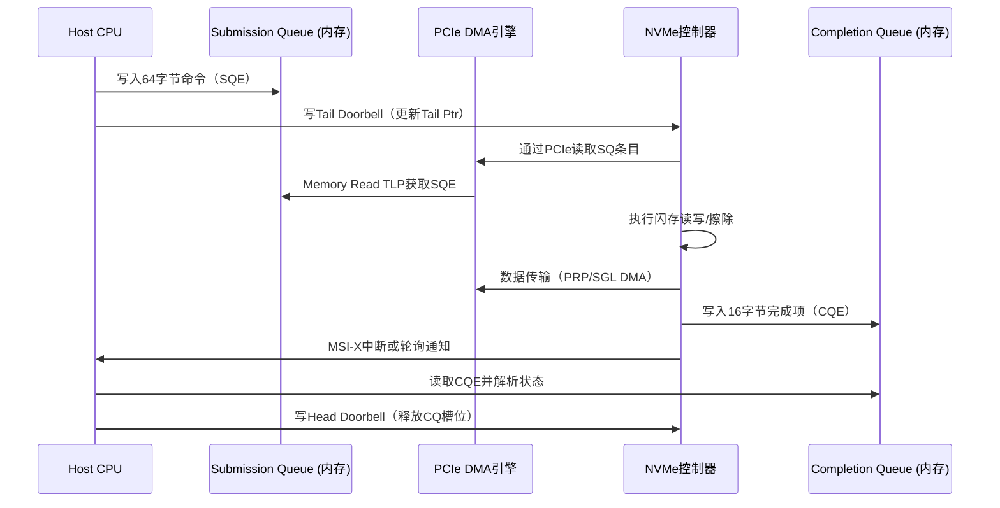

# 实战NVMe与嵌入式存储

<span class="badge-e">[Expert]</span>

嵌入式系统的存储需求正从传统的SATA SSD和eMMC向NVMe PCIe SSD迁移。
<span class="red">NVMe（Non-Volatile Memory Express）</span>协议专为NAND闪存和PCIe物理层设计，通过并行多队列、精简指令集和主机侧逻辑优化，在嵌入式NVMe控制器上实现了数倍于SATA的IOPS和带宽。
<br>
理解NVMe的提交队列（SQ）与完成队列（CQ）机制、嵌入式控制器的硬件约束以及Linux内核中的性能调优参数，是构建高性能嵌入式存储系统的核心能力。

---

## <strong>NVMe架构概述</strong>

NVMe规范将存储命令的处理从传统的IDE/SATA单队列模型彻底重构。
<span class="green">NVMe 1.4规范</span>定义了64K个独立的提交队列（Submission Queue，SQ），每个队列深度可达64K个命令槽位，总计理论支持超过40亿个并发命令。
<br>
在嵌入式场景中，这种极端并行度虽不需要，但多队列设计仍然关键：它允许多个CPU核心独立提交I/O而无需跨核锁竞争。

```c
// NVMe Controller寄存器布局（BAR0，按规范定义）
#define NVME_REG_CAP    0x0000  // Controller Capabilities（64位）
#define NVME_REG_CC     0x0014  // Controller Configuration
#define NVME_REG_CSTS   0x001C  // Controller Status
#define NVME_REG_SQ0TDB 0x1000  // Submission Queue 0 Tail Doorbell
#define NVME_REG_CQ0HDB 0x1004  // Completion Queue 0 Head Doorbell

// 读取控制器能力：队列深度、仲裁机制等
u64 cap = readq(nvme_dev->bar + NVME_REG_CAP);
u32 mqes = (cap & 0xFFFF) + 1;  // Maximum Queue Entries Supported
u8  ams  = (cap >> 17) & 0x3;    // Arbitration Mechanism Supported
```

NVMe的软件栈高度精简：从主机应用层到SSD固件仅经过文件系统（ext4/f2fs）、块层（blk-mq）、NVMe驱动层和PCIe DMA引擎。
<br>
相比SATA的AHCI协议栈，NVMe消除了Serial ATA寄存器接口的冗余，命令格式固定为64字节，Completion Entry固定为16字节，全部通过PCIe TLP的Memory Read/Write传输。

---

## <strong>提交队列与完成队列</strong>

### <strong>SQ/CQ的1:1与多对一映射</strong>

NVMe的队列对（Queue Pair，QP）由一个SQ和一个CQ组成。
<span class="red">SQ是主机到SSD的单向命令通道</span>，CQ是SSD到主机的单向完成通知通道。
<br>
队列在主机内存中分配，物理地址通过Admin命令Create I/O Queue注册到SSD控制器，后续SQ/CQ的访问通过PCIe Memory Read/Write TLP完成。



SQ与CQ的映射关系支持两种模式：
<span class="green">1:1映射</span>（每个SQ绑定独立的CQ，适合多核负载均衡）和
<span class="green">N:1映射</span>（多个SQ共享一个CQ，减少中断向量消耗）。
<br>
在嵌入式Linux中，blk-mq默认将每个CPU核心的软件队列映射到一个硬件队列（SQ）， Completion则按NUMA节点汇聚，形成N:1结构。

```c
// Linux blk-mq与NVMe队列映射配置
// 通过sysfs查看当前I/O队列数
$ cat /sys/block/nvme0n1/queue/nr_requests
// 查看NVMe设备的硬件队列数
$ cat /sys/class/nvme/nvme0/queue_count

// NVMe驱动中创建I/O队列对
static int nvme_create_queue(struct nvme_queue *nvmeq, int qid)
{
    struct nvme_command c;
    memset(&c, 0, sizeof(c));
    c.create_sq.opcode = nvme_admin_create_sq;
    c.create_sq.prp1 = cpu_to_le64(nvmeq->sq_dma_addr);
    c.create_sq.sqid = cpu_to_le16(qid);
    c.create_sq.qsize = cpu_to_le16(nvmeq->q_depth - 1);
    c.create_sq.cqid = cpu_to_le16(qid);  // 1:1映射
    c.create_sq.sq_flags = NVME_QUEUE_PHYS_CONTIG;
    return nvme_submit_sync_cmd(adminq, &c, NULL, 0);
}
```

### <strong>门铃机制</strong>

<span class="green">Doorbell</span>是NVMe队列同步的核心机制，本质上是位于设备BAR空间的内存映射寄存器。
<br>
主机写入Tail Doorbell通知SSD有新的命令待处理；SSD处理完成后通过中断通知主机，主机读取CQ后写入Head Doorbell释放完成槽位。
<br>
<span class="blue">Doorbell的写操作对主机是"昂贵"的PCIe TLP事务，因为每次写入都需要完成一次完整的PCIe请求-响应握手。Linux内核通过coalescing技术（如Delay Doorbell Update）将多个命令的Tail更新批量发送，减少Doorbell写频率。</span>

---

## <strong>嵌入式NVMe控制器实例</strong>

### <strong>Phison PS5012-E12S</strong>

Phison PS5012-E12S是面向嵌入式和工业应用的PCIe 3.0 x4 NVMe控制器，采用28nm工艺，集成双核ARM Cortex-R5处理器。
<br>
该控制器支持4个NAND通道，每通道8个CE（Chip Enable），理论顺序读取速度达3.5GB/s，顺序写入3.0GB/s，4K随机读取IOPS达700K。
<br>
PS5012支持NVMe 1.3规范，具备完整的SR-IOV能力（1个PF+7个VF），在虚拟化嵌入式网关场景中可将物理SSD划分为多个虚拟盘。

```c
// 嵌入式系统中通过Device Tree配置NVMe控制器
// 典型的PCIe Root Port节点，NVMe作为下游Endpoint自动枚举
&pcie {
    status = "okay";
    reset-gpio = <&gpio0 12 GPIO_ACTIVE_LOW>;  // PERST#信号
    clkreq-gpio = <&gpio0 13 GPIO_ACTIVE_LOW>; // CLKREQ#（ASPM L1）
};

// 在nvme-cli中查看控制器识别信息
$ nvme id-ctrl /dev/nvme0 | grep -E "(vid|ssvid|sn|mn|fr)"
vid     : 0x1987    // Phison Vendor ID
mn      : 'E12S-256GB-IND'  // Model Name
fr      : 'ECFM12.3'        // Firmware Revision
```

<span class="blue">PS5012的工业级版本支持-40°C至85°C温度范围，具备掉电保护（Power Loss Protection，PLP）电路，通过超级电容或钽电容阵列在掉电瞬间完成DRAM缓存中的数据落盘。</span>
<br>
对于车载和轨交嵌入式系统，这种PLP能力是合规认证（如EN 50155）的硬性要求。

### <strong>国产替代方案</strong>

国内NVMe控制器厂商如<span class="green">得一微（YEESTOR）</span>、<span class="green">联芸科技（Maxio）</span>和<span class="green">英韧科技（InnoGrit）</span>已推出多款PCIe 3.0/4.0控制器。
<br>
得一微的YS9203面向工业级嵌入式应用，支持PCIe 3.0 x2和4通道TLC/QLC NAND，集成LDPC纠错引擎，支持TCG Opal 2.0自加密。
<br>
联芸的MAP1202主打消费级嵌入式（如Mini-PC和瘦客户端），PCIe 3.0 x4接口，在价格和功耗上与Phison E12形成直接竞争。

---

## <strong>性能调优实践</strong>

嵌入式NVMe的性能调优涉及硬件配置、内核参数和应用层优化三个层面。

| 优化维度 | 参数/配置 | 嵌入式影响 |
|----------|-----------|------------|
| 队列深度 | nvmeq->q_depth（默认1024） | 深度过小限制并发，过大消耗内存；嵌入式通常设为64-256 |
| I/O调度器 | none/mq-deadline/kyber | NVMe设备通常禁用调度器（none），减少合并延迟 |
| 请求合并 | queue/max_sectors_kb | 增大至1024KB提升顺序吞吐量，但对随机I/O无益 |
| 中断亲和 | /proc/irq/xxx/smp_affinity | 将NVMe MSI-X向量绑定至处理I/O的CPU核心 |
| 预读窗口 | /sys/block/nvmeX/queue/read_ahead_kb | 嵌入式流媒体场景可增大至4096KB |

```bash
# 嵌入式NVMe调优脚本示例
# 1. 禁用I/O调度器
echo none > /sys/block/nvme0n1/queue/scheduler

# 2. 增大最大请求段数（减少SG列表开销）
echo 256 > /sys/block/nvme0n1/queue/max_segments

# 3. 绑定MSI-X中断至CPU2和CPU3
echo 0x0C > /proc/irq/$(grep nvme0 /proc/interrupts | head -1 | cut -d: -f1 | tr -d ' ')/smp_affinity

# 4. 增大预读窗口以优化顺序读取
echo 4096 > /sys/block/nvme0n1/queue/read_ahead_kb
```

<span class="blue">嵌入式NVMe调优的一个常见误区是盲目增大队列深度：在ARM Cortex-A53等低功耗核心上，过深的队列增加了内核路径的锁竞争和Cache失效，实测反而降低IOPS。建议从64开始逐步测试至甜点值。</span>
<br>
对于QLC NAND的NVMe SSD，还需关注<span class="green">SLC Cache</span>策略：嵌入式工作负载若以顺序写为主，SLC Cache耗尽后的直接QLC写入速度会骤降两个数量级，需通过fio等工具验证持续负载下的稳态性能。

---

## <strong>为什么NVMe选择多队列而非单队列共享</strong>

传统SATA AHCI协议只有一个命令队列，深度通常为32（NCQ），所有I/O请求通过单一的生产者-消费者模型串行化处理。
<br>
在多核CPU系统中，这造成了严重的<span class="green">锁竞争（Lock Contention）</span>：多个核心同时向队列尾部写入命令时需要获取自旋锁，CPU核心数越多竞争越剧烈，性能无法线性扩展。

NVMe的多队列设计从根本上消除了这一瓶颈。
<br>
每个CPU核心拥有独立的SQ，核心间的I/O提交无需同步；SSD固件的队列仲裁器（Round Robin或Weighted Round Robin）并行地从多个SQ取指，将命令分发至内部的多个NAND通道和闪存Die。
<br>
这种"主机并行化+设备并行化"的双层并行模型使得NVMe的随机I/O性能能够随CPU核心数和闪存通道数线性增长。
<br>
<span class="blue">对于嵌入式系统，多队列的另一隐性优势是降低延迟抖动：单队列模型中一个大数据块请求可能阻塞其后所有小请求，而多队列模型中短队列的请求总能得到及时服务。</span>

---

## <strong>历史演进</strong>

嵌入式存储的接口历史从并行ATA（PATA）的IDE总线开始，经历了SATA 1.0（2003年，1.5Gbps）、SATA 3.0（2009年，6Gbps）的串行化演进。
<br>
PATA和SATA均基于旋转硬盘的设计假设：顺序访问为主、延迟以毫秒计、命令以简单的读写扇区为单位。
<br>
当NAND闪存在2010年前后大规模替代机械硬盘时，这些假设不再成立：闪存的微秒级延迟、内部并行架构和磨损均衡需求暴露了SATA协议的结构性瓶颈。

2011年，Intel主导的NVMe 1.0规范发布，首次定义了基于PCIe的多队列存储命令集。
<br>
NVMe 1.1（2012年）增加了多Namespace支持；NVMe 1.2（2014年）引入SR-IOV和Endurance Group，为数据中心虚拟化铺路；NVMe 1.3（2017年）增加了Sanitize、Boot Partition和Namespace Write Protect特性，这些都是嵌入式安全启动的关键功能。
<br>
NVMe 1.4（2019年）和2.0（2021年）进一步规范了Zoned Namespace（ZNS）、Key-Value（KV）命令集和NVMe-oF（NVMe over Fabrics），将NVMe从单纯的块设备接口扩展为通用存储协议栈。

PCIe速率的演进与NVMe性能同步提升：PCIe 3.0 x4提供约4GB/s带宽，PCIe 4.0 x4约8GB/s，PCIe 5.0 x4约16GB/s。
<br>
当前嵌入式NVMe控制器主要停留在PCIe 3.0/4.0，因为PCIe 5.0的更高信号完整性要求和功耗在边缘设备中难以承受。
<br>
<span class="green">NVMe M.2 2230和2242</span>外形尺寸已成为嵌入式标准，而BGA封装的NVMe（如<span class="green">BGA SSD</span>）直接焊接在主板上，适用于空间极度受限的IoT设备。

---

## <strong>小结</strong>

NVMe协议通过多队列架构将PCIe的高带宽转化为存储I/O的高并发和高吞吐，是嵌入式存储从SATA迈向PCIe的技术转折点。
<br>
SQ/CQ的门铃机制、PRP/SGL的地址映射、Phison等控制器的嵌入式特性以及Linux blk-mq的队列调优，构成了从硬件到软件的完整性能优化链条。
<br>
关键要点包括：队列深度与内存占用的权衡、I/O调度器的选择、MSI-X中断亲和配置，以及QLC NAND的SLC Cache策略对持续写入性能的影响。

| 练习题 | 难度 | 答案要点 |
|--------|------|----------|
| NVMe的Doorbell机制中，为什么SSD不主动轮询SQ内存而是依赖主机写Tail Doorbell？嵌入式系统中是否存在例外？ | 基础 | 主动轮询消耗PCIe带宽和SSD功耗，Doorbell是事件驱动的高效通知。某些超低延迟嵌入式SSD可能采用混合轮询（Hybrid Polling）以降低中断开销。 |
| Phison E12S的SR-IOV能力如何在嵌入式虚拟化网关中被利用？VF与PF在I/O隔离上有何限制？ | 进阶 | 可将物理SSD划分为多个虚拟盘供不同VM使用。但VF共享底层NAND通道和DRAM缓存，一个VF的密集I/O可能影响其他VF的延迟。 |
| 嵌入式ARM SoC上，将NVMe MSI-X中断绑定至处理I/O的CPU核心时，为何仍需关注Cache一致性和NUMA拓扑？ | 深入 | 绑定中断后，CQ内存的更新与CPU读取涉及Cache行状态转换，跨Cluster绑定可能导致CCI/CMN互连拥塞。NUMA拓扑决定了PCIe Root Complex与CPU的内存访问延迟差异。 |

---

<span class="purple">扩展阅读：</span> NVM Express Base Specification 2.0b（nvmexpress.org）、Linux Kernel Documentation block/blk-mq.rst、Phison E12S Product Brief、PCIe 4.0 Physical Layer Test Specification Chapter 12（M.2 Connector）。
