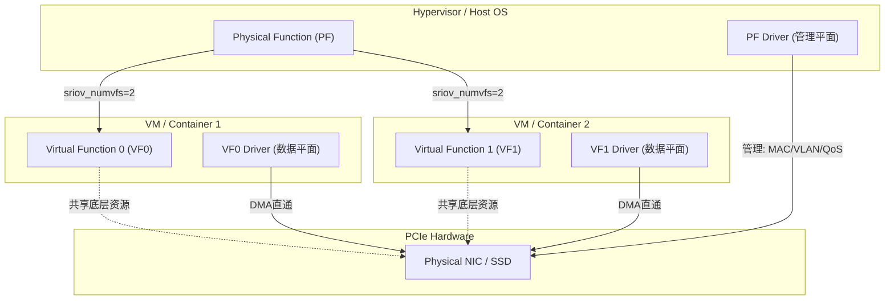

# PCIe虚拟化与SR-IOV

<span class="badge-e">[Expert]</span>

嵌入式系统正从单一操作系统向多租户、多容器和虚拟化环境演进，而PCIe外设的I/O虚拟化是其中的核心技术挑战。
<span class="red">SR-IOV（Single Root I/O Virtualization）</span>允许单个物理PCIe设备在硬件层面呈现为多个独立的轻量功能（VF），每个VF可直接分配给虚拟机，绕过Hypervisor的软件模拟层。
<br>
理解SR-IOV的PF/VF架构、BAR映射机制以及在嵌入式ARM/x86虚拟化场景中的部署约束，是设计高效I/O直通方案的前提。

---

## <strong>SR-IOV基本原理</strong>

SR-IOV是PCI-SIG定义的硬件I/O虚拟化规范，作为PCIe Extended Capability（Capability ID 0x0010）实现。
<span class="green">SR-IOV Capability</span>位于物理功能（Physical Function，PF）的配置空间中，定义了虚拟功能的总数（TotalVFs）、初始数量（InitialVFs）以及每个VF的BAR布局和资源需求。
<br>
PF是完整功能的PCIe设备，拥有完整的配置空间、BAR和扩展能力；VF是精简的PCIe功能，仅包含I/O操作所需的配置空间字段，无管理员权限。

```c
// SR-IOV Capability 寄存器偏移（相对于Capability基址）
#define PCI_SRIOV_CAP_HDR        0x00  // Capability Header (ID=0x0010)
#define PCI_SRIOV_TOTAL_VF       0x0E  // Total VFs supported by hardware
#define PCI_SRIOV_INITIAL_VF     0x10  // VFs allocated at boot time
#define PCI_SRIOV_NUM_VF         0x12  // Current number of enabled VFs
#define PCI_SRIOV_FUNCTION_DEP   0x14  // Function Dependency Link
#define PCI_SRIOV_FIRST_VF       0x16  // First VF Offset (RID offset)
#define PCI_SRIOV_VF_STRIDE      0x18  // VF Stride (RID increment)
#define PCI_SRIOV_RSV_CAP        0x1A  // Reserved / Supported Page Sizes
#define PCI_SRIOV_BAR_BASE       0x24  // VF BAR0-BAR5 (6 x 4 bytes)

// 读取SR-IOV配置
u16 total_vf = pci_read_config_word(pf_dev, sriov_cap + PCI_SRIOV_TOTAL_VF);
u16 num_vf   = pci_read_config_word(pf_dev, sriov_cap + PCI_SRIOV_NUM_VF);
```

SR-IOV的关键设计思想是将设备资源的分配从"物理独占"变为"逻辑分区"。
<br>
以NIC为例：PF拥有完整的网卡管理权（MAC地址配置、VLAN设置、流量控制），每个VF获得独立的TX/RX队列对、独立的MSI-X中断向量组以及独立的MAC地址。
<br>
VF之间在硬件层面隔离，一个VF的网络风暴不会直接影响其他VF的数据平面。

---

## <strong>PF与VF的硬件关系</strong>

### <strong>PF的管理职责</strong>

<span class="red">PF是SR-IOV架构中的控制平面中枢</span>，拥有对所有VF的配置、启停和监控权限。
<br>
PF的驱动程序（通常在Host OS或Hypervisor中运行）负责初始化SR-IOV Capability、分配VF数量、配置每个VF的资源配额，以及处理不属于任何VF的全局事件（如链路断开、温度过高）。

```c
// Linux内核中启用VF的API
// 通过sysfs接口启用VF（用户态）
echo 4 > /sys/bus/pci/devices/0000:01:00.0/sriov_numvfs  // 启用4个VF

// 内核态通过PCI核心API启用
int pci_enable_sriov(struct pci_dev *dev, int nr_virtfn);
int pci_disable_sriov(struct pci_dev *dev);

// PF驱动注册VF设备回调
static struct pci_driver pf_driver = {
    .name       = "my_pf_driver",
    .id_table   = pf_id_table,
    .probe      = pf_probe,
    .remove     = pf_remove,
    .sriov_configure = pf_sriov_configure,  // SR-IOV配置入口
};
```

PF通过<span class="green">Mailbox机制</span>与VF通信：VF向PF发送请求（如请求MAC地址变更），PF处理后通过Mailbox回写应答。
<br>
这种设计确保VF不直接访问全局配置，保持安全隔离。
<br>
在嵌入式场景中，PF驱动通常运行于Linux Host，VF则直通至KVM/QEMU虚拟机或Docker容器。

### <strong>VF的I/O直通</strong>

VF是SR-IOV架构中的数据平面实体，其配置空间是PF配置空间的子集，仅包含必要的Base、Limit、Status和BAR寄存器。
<br>
VF没有自己的Expansion ROM、Subsystem ID或部分电源管理寄存器，这些由PF统一管理。
<br>
VF的Bus:Device:Function（BDF）编号通过<span class="green">Function Level Reset（FLR）</span>与PF隔离，确保VF被重置时不影响PF或其他VF。



---

## <strong>BAR在虚拟化中的映射</strong>

PCIe设备的BAR（Base Address Register）定义了设备寄存器空间在主机内存/IO地址空间中的映射位置。
<br>
在SR-IOV中，PF和VF各自拥有独立的BAR集合：PF的BAR0-BAR5在PF配置空间中定义；VF的BAR0-BAR5在SR-IOV Capability的<span class="green">VF BAR</span>字段中定义，这些字段规定了每个VF的BAR大小和类型（32位/64位，Prefetchable/Non-Prefetchable）。

```c
// VF BAR布局示例：每个VF拥有4KB的寄存器空间
// PF的SR-IOV Capability中配置：
// VF BAR0 = 0x00000004 (32-bit, 4KB)
// VF BAR1 = 0x00000000 (未使用)
// VF BAR2 = 0x0000000C (64-bit, 16MB DMA窗口)

// 在IOMMU/SMMU中，每个VF的DMA地址空间独立映射
// VF0: IOVA 0x10000000 -> 物理地址 0x80000000 (16MB)
// VF1: IOVA 0x20000000 -> 物理地址 0x90000000 (16MB)
```

当VF直通给VM时，Hypervisor（如KVM/QEMU）将VF的BAR通过<span class="green">VFIO</span>框架映射至VM的物理地址空间（实际上是Guest Physical Address）。
<br>
VFIO通过IOMMU确保VF的DMA操作仅能访问分配给该VM的内存页，实现DMA隔离。
<br>
<span class="blue">嵌入式SoC中的SMMU（ARM）或VT-d（x86）是VFIO-SR-IOV方案的安全基石：没有IOMMU/SMMU，VF的恶意DMA将直接破坏Host或其他VM的内存。</span>

```bash
# VFIO绑定VF并直通至QEMU/KVM
# 1. 解绑VF的当前驱动
echo "0000:01:00.1" > /sys/bus/pci/drivers/ixgbevf/unbind

# 2. 绑定至VFIO
modprobe vfio-pci
echo "8086 10ed" > /sys/bus/pci/drivers/vfio-pci/new_id

# 3. QEMU启动参数直通VF
qemu-system-x86_64 \
  -device vfio-pci,host=01:00.1 \
  -device vfio-pci,host=01:00.2 \
  ...
```

---

## <strong>嵌入式虚拟化场景</strong>

### <strong>ARM SoC上的SR-IOV</strong>

ARM嵌入式虚拟化主要基于<span class="green">KVM/ARM</span>和<span class="green">Xen</span>，SR-IOV NIC（如Mellanox ConnectX-5/6）通过PCIe连接至ARM服务器SoC（如Ampere Altra、NVIDIA BlueField）。
<br>
BlueField DPU本身就是嵌入式SR-IOV的典型实现：一个ARM SoC集成了Mellanox NIC的PF和多个VF，通过内部PCIe Switch连接，VF可直通给Host x86 CPU上的VM。
<br>
<span class="blue">BlueField的设计体现了SR-IOV在嵌入式领域的演进方向：将I/O虚拟化卸载至专用DPU，释放Host CPU的计算资源。</span>

### <strong>车载多域控制器</strong>

现代车载电子电气架构从分布式ECU向中央计算平台演进，PCIe SR-IOV用于隔离不同安全域的I/O。
<br>
例如，智驾域（ASIL-D）和座舱域（QM）共享同一PCIe SSD时，通过SR-IOV将SSD划分为两个VF，分别直通给各自的VM，避免座舱娱乐应用的崩溃影响驾驶数据记录。
<br>
但车载环境的温度范围（-40°C至125°C）和振动对PCIe连接器的可靠性提出挑战，SR-IOV的热插拔和错误恢复机制必须满足ISO 26262的故障处理要求。
<br>
在车载以太网网关（Automotive Gateway）中，SR-IOV可将单个物理CAN-FD或以太网MAC控制器虚拟化为多个VF，分别服务于信息娱乐域、ADAS域和动力系统域，实现不同ASIL等级软件栈的硬件级网络隔离。

---

## <strong>为什么SR-IOV优于软件模拟I/O</strong>

传统的I/O虚拟化通过软件模拟（如QEMU的virtio-net、VMware的VMXNET）实现：Hypervisor截获Guest OS的I/O操作，在Host侧代为执行真实的硬件访问。
<br>
这种模式的优点是设备无关性强，Guest无需专用驱动；缺点是每次I/O操作都触发VM Exit/Entry，延迟增加数微秒至数十微秒，吞吐量受限于Host CPU的处理能力。

SR-IOV的硬件直通消除了VM Exit开销：Guest OS的VF驱动直接与VF的BAR寄存器交互，DMA引擎直接访问分配给VM的内存，Hypervisor仅在VF初始化和异常处理时介入。
<br>
实测数据显示，SR-IOV直通的网络延迟可降至1-2微秒（接近物理网卡），而virtio-net的延迟通常在10-50微秒量级。
<br>
<span class="blue">对于嵌入式实时系统（如工业控制、车载ADAS），SR-IOV的确定性延迟特性是软件模拟无法替代的核心优势。</span>
<br>
但SR-IOV的代价是设备依赖性强：每个VF需要Guest OS中对应的设备驱动，且VF数量受限于硬件设计（通常为64-256个），灵活性不如软件模拟。

---

## <strong>历史演进</strong>

I/O虚拟化的历史始于IBM大型机的通道架构，但x86世界的软件模拟起步较晚。
<br>
2005年，Intel发布VT-x（虚拟化扩展）的同时，意识到I/O虚拟化是性能瓶颈，推出了<span class="green">VT-d（Virtualization Technology for Directed I/O）</span>，首次在芯片组层面支持DMA重映射和设备直通。
<br>
2007年，PCI-SIG发布SR-IOV 1.0规范，定义了PF/VF架构和配置空间扩展，标志着I/O虚拟化从软件模拟走向硬件辅助。

早期SR-IOV实现（如Intel 82576千兆网卡）仅支持8个VF，每个VF的队列深度有限，主要用于数据中心的轻量虚拟化。
<br>
2012年，Mellanox ConnectX-3引入128个VF支持，配合PCIe 3.0 x8接口，使得10GbE/40GbE网卡的SR-IOV在云计算中普及。
<br>
2017年，NVMe 1.2将SR-IOV纳入存储控制器规范，Samsung PM1725 SSD支持63个VF，实现了存储I/O的硬件虚拟化。

嵌入式领域对SR-IOV的采纳相对滞后。
<br>
传统嵌入式虚拟化（如Jailhouse、X Jailhouse）采用静态分区而非动态VF分配，因为嵌入式设备的资源（VF数量、内存、中断向量）通常远少于数据中心服务器。
<br>
但2020年后，随着<span class="green">DPU（Data Processing Unit）</span>和<span class="green">SmartNIC</span>的兴起，嵌入式虚拟化重新关注SR-IOV：NVIDIA BlueField-2将ConnectX-6 Dx NIC与ARM Cortex-A72集成，实现板级SR-IOV卸载，无需Host CPU参与I/O虚拟化。

---

## <strong>小结</strong>

SR-IOV通过硬件层面的PF/VF划分，实现了接近物理设备性能的I/O直通，是嵌入式虚拟化从"能用"走向"高效"的关键技术。
<br>
核心要点包括：PF的管理平面职责、VF的数据平面隔离、BAR和DMA的独立映射、VFIO-IOMMU的安全保障，以及SR-IOV在车载多域控制器和DPU中的新兴应用。
<br>
理解SR-IOV的设计权衡（性能 vs 灵活性）有助于在嵌入式项目中做出合理的I/O虚拟化架构决策。

| 练习题 | 难度 | 答案要点 |
|--------|------|----------|
| SR-IOV中，PF的BAR和VF的BAR在配置空间中如何组织？为什么VF不能拥有独立的Expansion ROM？ | 基础 | PF的BAR在标准配置空间0x10-0x24；VF的BAR在SR-IOV Capability的VF BAR字段。Expansion ROM包含固件和初始化代码，由PF统一管理以避免版本不一致和安全漏洞。 |
| 在ARM嵌入式SoC中，SMMU如何配合VFIO实现VF的DMA隔离？若SMMU页表配置错误，攻击者VF可能利用什么漏洞？ | 进阶 | SMMU为每个VF维护独立的Stream ID和页表，将VF的DMA请求翻译至分配给对应VM的物理页。若SMMU配置错误，攻击者VF可通过DMA越界读写Host或其他VM的内存。 |
| 车载场景中，将SR-IOV SSD的VF直通给不同ASIL等级的VM时，硬件层面的隔离是否足以满足ISO 26262的故障独立性要求？为什么？ | 深入 | 不足够。虽然VF在配置空间隔离，但底层NAND控制器、DRAM缓存和电源管理电路仍共享，一个域的故障（如电压异常）可能通过共享硬件传播。需配合FMEDA分析和额外的软件监控实现ASIL分解。 |

---

<span class="purple">扩展阅读：</span> PCI-SIG SR-IOV Specification 1.1、Linux Kernel Documentation driver-api/vfio.rst、ARM SMMUv3 Specification Section 5.2（PCIe ATS and PASID）、NVIDIA BlueField-2 DPU User Manual、ISO 26262-5:2018（Hardware Level Safety Requirements）。
