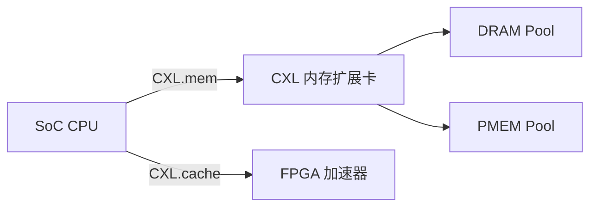

# 前沿趋势：CXL与PCIe 6.0

<span class="badge-m">[Master]</span>

<span class="red">CXL（Compute Express Link）</span> 和 <span class="red">PCIe 6.0</span> 代表数据中心互连技术的两大演进方向：内存扩展与超高带宽。

---

## <strong>基础认知</strong>

### <strong>CXL 是什么</strong>

<span class="blue">CXL 是基于 PCIe 物理层的缓存一致性互连协议</span>，允许 CPU 与加速器/内存设备共享统一地址空间。

| CXL 子协议 | 用途 |
|-----------|------|
| CXL.io | 兼容 PCIe 事务（配置、IO、消息） |
| CXL.cache | 缓存一致性事务（类似 AMD Infinity Fabric） |
| CXL.mem | 内存扩展事务（加载/存储语义） |

---

## <strong>原理解析</strong>

### <strong>PCIe 6.0 的关键变革</strong>

| 特性 | PCIe 5.0 | PCIe 6.0 |
|------|----------|----------|
| 速率 | 32GT/s | 64GT/s |
| 编码 | 128b/130b | PAM4 + FLIT |
| 前向纠错 | 无 | FEC + CRC |
| TLP 模式 | 变长包 | 固定 256B FLIT |

<span class="red">FLIT（Flow Control Unit）模式</span> 是 PCIe 6.0 的最大变革：

```
传统 PCIe TLP: [Header][Data][ECRC]  变长
PCIe 6.0 FLIT: [256B Fixed Block]     固定
```

<span class="blue">固定长度 FLIT 简化流水线设计</span>，配合 PAM4 编码实现 64GT/s。

### <strong>嵌入式中的 CXL 应用</span>



<span class="blue">CXL 使嵌入式系统突破物理内存限制</span>，通过外部内存池动态扩展容量。

---

## <strong>历史演进</strong>

- <span class="green">2019 年 CXL 1.0</span> — Intel 主导发布，基于 PCIe 5.0 物理层<br>
- <span class="green">2022 年 CXL 2.0</span> — 引入内存池化、Switch 架构<br>
- <span class="green">2024 年 CXL 3.0</span> — 支持多级 Switch、Fabrics 扩展<br>
- <span class="green">2022 年 PCIe 6.0</span> — 64GT/s，PAM4+FLIT<br>
- <span class="green">2028 年 PCIe 7.0（预计）</span> — 128GT/s，光电混合

---

## 小结与练习

| 要点 | 说明 |
|------|------|
| 核心概念 | CXL 重构内存架构，PCIe 6.0 重构物理层编码 |
| 关键技能 | 理解 FLIT 模式、CXL 协议切换、内存池设计 |

**练习**

1. 比较 CXL.mem 与 DDR5 直连在延迟和带宽上的差异。
2. 分析 PCIe 6.0 FLIT 模式对嵌入式 SoC 设计的影响。
3. 预测 CXL 在自动驾驶域控制器中的潜在应用场景。
