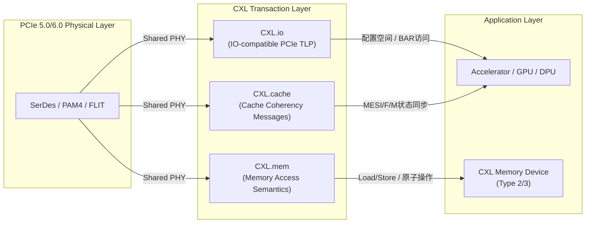

# 前沿趋势CXL与PCIe 6.0

<span class="badge-e">[Expert]</span>

PCIe总线在过去二十年中从133MB/s的并行总线演进至64GT/s的串行链路，但面向AI加速器、内存池化和异构计算的负载暴露了传统PCIe的结构性限制。
<span class="red">CXL（Compute Express Link）</span>在PCIe 5.0/6.0物理层之上定义了缓存一致性和内存语义，而<span class="green">PCIe 6.0</span>的PAM4编码和FLIT模式将单lane速率推至64GT/s，两者共同构成了下一代嵌入式系统互连的技术底座。
<br>
理解CXL的三类协议、PCIe 6.0的物理层革新以及它们在嵌入式场景中的应用潜力，是把握未来SoC设计方向的关键。

---

## <strong>CXL协议体系</strong>

CXL Consortium（2019年成立，成员包括Intel、AMD、Google、Microsoft等）定义了CXL 1.0/1.1/2.0/3.0规范。
<br>
CXL的核心设计决策是<span class="green">复用PCIe 5.0/6.0物理层和链路层</span>，在事务层之上引入三种新的协议类型：CXL.io、CXL.cache和CXL.mem。



### <strong>CXL.io</strong>

CXL.io是PCIe TLP的CXL扩展子集，用于设备的发现、枚举、配置空间访问和I/O BAR操作。
<br>
CXL设备在系统启动时首先以PCIe设备身份被枚举，BIOS/UEFI通过标准的PCIe配置空间读写识别CXL Capability（Capability ID 0x0001）。
<br>
CXL.io兼容现有的PCIe设备驱动模型，这意味着NVMe SSD、NIC或GPU在CXL链路上无需修改驱动即可正常工作。

### <strong>CXL.cache</strong>

<span class="red">CXL.cache</span>是CXL最具颠覆性的协议，定义了主机CPU与加速器之间的缓存一致性接口。
<br>
加速器（如GPU、FPGA、AI NPU）通过CXL.cache将自身的私有缓存接入CPU的全局Cache一致性域，共享MESI（Modified/Exclusive/Shared/Invalid）状态机。
<br>
这消除了传统PCIe DMA中显式的内存拷贝：CPU写入内存的数据对加速器缓存立即可见，加速器修改的数据对CPU也立即可见。

```c
// CXL.cache 语义对比：传统PCIe DMA vs CXL.cache
// 传统PCIe DMA（需要显式同步）
void gpu_compute_legacy(struct gpu_dev *gpu, void *cpu_buf)
{
    dma_addr_t dma_addr = dma_map_single(gpu->dev, cpu_buf, SIZE, DMA_TO_DEVICE);
    gpu_submit_dma(gpu, dma_addr, SIZE);        // 拷贝至GPU显存
    gpu_wait_complete(gpu);
    dma_unmap_single(gpu->dev, dma_addr, SIZE, DMA_FROM_DEVICE);
}

// CXL.cache（零拷贝，Cache一致性自动维护）
void gpu_compute_cxl(struct gpu_dev *gpu, void *shared_buf)
{
    // shared_buf位于CXL.mem扩展内存区
    // CPU和GPU通过CXL.cache协议自动同步Cache行状态
    gpu_submit_kernel(gpu, shared_buf, SIZE);     // 直接操作共享内存
    gpu_wait_complete(gpu);
    // 无需dma_map/unmap！
}
```

### <strong>CXL.mem</strong>

CXL.mem定义了主机对CXL内存设备（Type 2或Type 3设备）的Load/Store语义访问。
<br>
Type 3设备是纯内存扩展器（如Intel CXL Memory Buffer、三星CXL DIMM），无本地计算能力，仅响应主机的内存读写请求。
<br>
Type 2设备兼具计算和内存能力（如智能SSD或近内存加速器），既通过CXL.cache参与一致性域，又通过CXL.mem暴露本地内存给主机。
<br>
<span class="blue">在嵌入式场景中，CXL.mem的潜力巨大：ARM SoC可通过CXL扩展至TB级内存，突破片上DDR控制器的通道数限制，而CXL内存的 pooled 架构允许多个SoC共享同一内存池，实现嵌入式集群的内存解耦。</span>

---

## <strong>PCIe 6.0技术革新</strong>

### <strong>PAM4信号编码</strong>

PCIe 6.0放弃了从PCIe 1.0沿用至今的NRZ（Non-Return-to-Zero，每符号1比特）编码，改用<span class="green">PAM4（Pulse Amplitude Modulation 4-level，每符号2比特）</span>编码。
<br>
PAM4在同一波特率下传输两倍的数据量，使PCIe 6.0在16GHz时钟下实现64GT/s的等效速率。
<br>
代价是信噪比（SNR）显著恶化：PAM4的四个电平之间的裕量仅为NRZ的1/3，对信道损耗、串扰和反射的容忍度大幅降低。

```c
// PCIe 6.0 PAM4 眼图概念示意（非代码）
// NRZ: 两个电平（0V, 1V）表示0/1
// PAM4: 四个电平（0V, 0.33V, 0.67V, 1V）表示00/01/10/11
//
// 信号完整性挑战：
// - 插入损耗要求：-28dB @ 8GHz（PCIe 5.0为-36dB @ 16GHz）
// - 需要更复杂的CTLE（Continuous Time Linear Equalization）
// - 需要DFE（Decision Feedback Equalization）消除ISI
```

为补偿PAM4的噪声敏感性，PCIe 6.0引入了<span class="green">轻量级FEC（Forward Error Correction）</span>，采用3-way交错和CRC校验，可纠正随机比特错误而无需重传。
<br>
<span class="blue">嵌入式系统中，PAM4的物理层设计要求更严格的PCB布局：走线长度匹配、过孔stub控制和层叠介电常数均成为信号完整性的关键因素，嵌入式多层板（8-12层）的设计难度显著增加。</span>

### <strong>FLIT模式</strong>

PCIe 6.0的另一重大变革是引入<span class="red">FLIT（Flow Control Unit）模式</span>，替代了自PCIe 1.0以来的TLP/DLLP/Ordered Set分层模型。
<br>
在FLIT模式下，链路层不再区分TLP和DLLP，所有信息（数据、信用、错误校验）封装在固定256字节的FLIT包中，通过专用逻辑传输。

```
PCIe 6.0 FLIT 结构（256 Bytes）
+-----------------------+-----------------------+
|  FLIT Header (2B)     |  FLIT Type / Length   |
+-----------------------+-----------------------+
|  Payload (236B)       |  TLP Data / DLLP /  |
|                       |  NOP / Link Mgmt    |
+-----------------------+-----------------------+
|  FEC / CRC (18B)      |  3-way FLIT interlace |
+-----------------------+-----------------------+
```

FLIT模式的优势包括：消除了TLP变长带来的解析开销、简化了Credit-Based流量控制、降低了事务层与链路层之间的耦合。
<br>
FLIT模式还使得PCIe 6.0原生支持<span class="green">Multi-Stream</span>和<span class="green">Multipathing</span>，一条逻辑链路可在多个物理通道间动态负载均衡，提升可靠性和吞吐量。
<br>
<span class="blue">对于嵌入式SoC，FLIT模式的固定包长简化了DMA引擎的缓冲管理：不再需要处理跨TLP边界的奇数长度数据，FIFO深度设计更加规整。</span>

---

## <strong>嵌入式中的内存扩展</strong>

CXL在嵌入式领域最直接的应用是内存扩展和池化。
<br>
传统嵌入式SoC的内存容量受限于片上DDR控制器通道数（通常为1-4通道）和单通道最大容量（64GB/128GB DDR5 DIMM）。
<br>
CXL.mem允许SoC通过PCIe/CXL链路连接外部内存设备，理论可将内存容量扩展至TB级别，同时保持Cache一致性的Load/Store语义。

| 内存扩展方案 | 带宽 | 延迟 | Cache一致性 | 嵌入式适用性 |
|-------------|------|------|-------------|-------------|
| 片上DDR5 | 高 | 低（~100ns） | 原生支持 | 容量受限 |
| PCIe DMA扩展 | 中 | 高（~1us+） | 需显式同步 | 复杂度高 |
| CXL.mem Type 3 | 高 | 中（~200-300ns） | 原生支持 | 最佳 |
| NVMe SSD分页 | 低 | 极高（~10us） | 不支持 | 仅冷数据 |

<span class="blue">CXL在嵌入式落地的关键障碍是功耗和尺寸：CXL内存控制器、Retimer和Redriver增加了板级功耗，而嵌入式设备的散热和电源预算有限。</span>
<br>
为此，CXL Consortium正在制定<span class="green">CXL Lite</span>子集，针对边缘设备和嵌入式控制器裁剪协议复杂度，降低实现门槛。

---

## <strong>为什么CXL选择兼容PCIe物理层而非独立总线</strong>

CXL Consortium面临的一个设计抉择是：像Gen-Z或CCIX一样定义独立的物理层和电气规范，还是复用已成熟的PCIe基础设施。
<br>
最终CXL选择了后者，这一决策的技术和商业逻辑值得深入分析。

技术上，PCIe 5.0/6.0的SerDes和链路层经过十余年验证，其信号完整性、训练状态机和错误恢复机制已经非常成熟。
<br>
独立定义物理层意味着CXL需要重新建立从芯片IP到测试设备的完整生态，开发周期和成本不可估量。
<br>
复用PCIe物理层使得CXL控制器可直接集成至现有PCIe PHY（如Synopsys DesignWare PCIe PHY），SoC厂商只需修改事务层逻辑即可支持CXL。

商业上，PCIe生态的庞大体量（从消费级SSD到数据中心GPU）意味着CXL天然继承了供应链和互操作性测试体系。
<br>
服务器主板上的CXL Slot与PCIe Slot物理兼容，BIOS/UEFI的PCIe枚举代码只需增加CXL Capability解析即可支持CXL设备发现。
<br>
<span class="blue">对嵌入式系统而言，CXL兼容PCIe的最大意义在于设计复用：嵌入式SoC通常引脚受限，CXL/PCIe复用引脚可在不增加封装尺寸的情况下提供内存扩展能力。</span>

---

## <strong>历史演进</strong>

处理器-内存互连的历史可追溯到冯·诺依曼架构本身，但专用高速互连的发展脉络更为具体。
<br>
2001年，AMD发布HyperTransport，首次在x86世界引入点对点处理器互连，为后续串行总线革命奠定基础。<br>
2004年，Intel发布PCIe 1.0，取代并行PCI总线，成为外设互连的事实标准，但PCIe的设计初衷是外设I/O而非内存语义。

2016年，AMD、ARM、Huawei、IBM、Qualcomm和Xilinx联合发布<span class="green">CCIX（Cache Coherent Interconnect for Accelerators）</span>，首次尝试在PCIe物理层之上实现处理器与加速器之间的缓存一致性。
<br>
CCIX的技术路线与后来的CXL高度相似，但生态推进缓慢，成员分散，最终未能形成规模效应。
<br>
同年，IBM在POWER9处理器中实现<span class="green>OpenCAPI</span>，提供内存语义和缓存一致性，但局限于IBM生态。

2019年，Intel主导成立CXL Consortium并发布CXL 1.0，明确将CXL定位为"基于PCIe的缓存一致性和内存扩展协议"。
<br>
Intel的Dominance确保了CXL的快速生态建设：至强可扩展处理器（Ice Lake及以后）原生支持CXL，Intel FPGA（Agilex/Stratix 10 DX）集成了CXL硬核。
<br>
2020年，CXL 2.0引入CXL Switch和内存池化（Memory Pooling），允许多主机共享CXL内存设备，标志着CXL从单主机扩展走向多机协同。

2022年，CXL 3.0发布，支持多级Switch拓扑、增强的一致性模型和更细粒度的内存共享。
<br>
同年，PCIe 6.0规范定稿，CXL Consortium宣布将CXL 3.0基于PCIe 6.0物理层，实现64GT/s的缓存一致性传输。
<br>
2024年后，CXL内存设备（如三星CXL Memory Module、Microchip SMC 2000系列CXL控制器）开始量产，嵌入式CXL应用从概念走向原型验证。

---

## <strong>小结</strong>

CXL和PCIe 6.0代表了高性能互连的两个互补方向：CXL在协议层引入缓存一致性和内存语义，解决异构计算中的数据搬运瓶颈；PCIe 6.0在物理层通过PAM4和FLIT将带宽推至新高度，同时简化链路层实现。
<br>
对于嵌入式系统，CXL.mem的内存扩展能力打破了片上DDR的容量天花板，PCIe 6.0的FLIT模式简化了低功耗DMA引擎的设计。
<br>
但两者的落地均面临功耗、信号完整性和生态成熟的挑战，嵌入式开发者应在项目初期评估CXL Lite或PCIe 5.0的过渡方案。

| 练习题 | 难度 | 答案要点 |
|--------|------|----------|
| CXL.cache的MESI一致性协议如何在PCIe物理层上传输？CXL.io与CXL.cache是否共享同一链路带宽？ | 基础 | CXL.cache消息封装在PCIe TLP的特殊Vendor Defined Message中传输。两者共享物理链路带宽，通过仲裁器（Arbiter）分时复用。 |
| PCIe 6.0的PAM4编码相比NRZ增加了哪些信号完整性挑战？嵌入式系统应如何通过PCB设计缓解这些挑战？ | 进阶 | PAM4的电平裕量缩小至1/3，对插入损耗、串扰和反射更敏感。应缩短走线长度、控制过孔stub、采用低损耗介电材料和增强端接匹配。 |
| 在边缘AI推理设备中，CXL.mem扩展内存相比传统PCIe DMA+GPU显存方案，在延迟和功耗上有何优劣？边缘部署CXL的主要障碍是什么？ | 深入 | CXL.mem避免了显式拷贝，延迟降低但增加了Cache一致性开销（约200-300ns）。功耗上CXL控制器和Retimer增加了静态功耗。边缘部署障碍包括：控制器芯片尺寸、散热限制、CXL Lite生态不成熟以及成本。 |

---

<span class="purple">扩展阅读：</span> CXL Consortium Specification 3.0（cxlconsortium.org）、PCI Express Base Specification Rev 6.0 Chapter 4（Physical Layer）、Intel Agilex FPGA CXL Hard IP User Guide、Samsung CXL Memory Module White Paper、IEEE Micro 2024 "CXL for Edge Computing: Opportunities and Challenges"。
