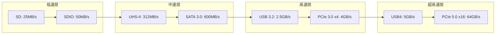
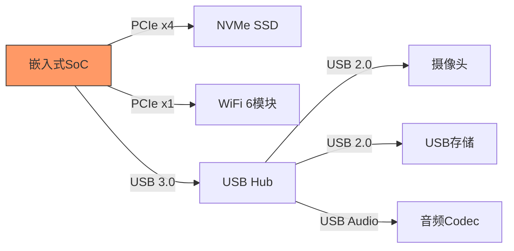

# 高速外设扩展总线

[Intermediate] [Expert]

高速外设扩展总线是嵌入式系统中用于连接高速外设和扩展存储的核心接口家族。
 
从SD卡的可插拔存储到PCIe的高带宽扩展，从USB的通用即插即用到SATA的硬盘互联，这些总线决定了嵌入式系统的数据吞吐能力和扩展灵活性。
 
理解每种高速总线的协议层次、速度等级、电源管理和Linux驱动架构，是设计高性能嵌入式平台的前提。
 
本类别覆盖四种核心总线：SD/MMC/SDIO、SATA、PCIe和USB。
 

---

## <strong>本类别总线总览</strong>

| 总线 | 最大速率 | 拓扑 | 热插拔 | 供电能力 | 典型应用 |
|------|----------|------|--------|----------|----------|
| SD/MMC/SDIO | UHS-II 312MB/s | 点对点 | 支持 | 3.3V/1.8V | 存储卡、WiFi模块 |
| SATA | 6Gbps | 点对点 | 支持（部分） | 无 | 2.5寸SSD/HDD |
| PCIe | Gen5 64GT/s | 树型/Switch | 支持 | 75W/300W | NVMe SSD、GPU、网卡 |
| USB | USB4 40Gbps | 星型/Hub | 支持 | 5V/100W（PD） | 摄像头、音频、存储 |

---

## <strong>速度对比与演进</strong>

### <strong>各代速率演进表</strong>

| 总线 | 第一代 | 第二代 | 第三代 | 第四代 | 第五代 |
|------|--------|--------|--------|--------|--------|
| SD | SD 25MB/s | SDHC 25MB/s | SDXC UHS-I 104MB/s | UHS-II 312MB/s | SD Express 1GB/s |
| SATA | SATA 1.5Gbps | SATA 3Gbps | SATA 6Gbps | — | — |
| PCIe | Gen1 2.5GT/s | Gen2 5GT/s | Gen3 8GT/s | Gen4 16GT/s | Gen5 32GT/s |
| USB | USB 1.1 12Mbps | USB 2.0 480Mbps | USB 3.0 5Gbps | USB 3.1 10Gbps | USB4 40Gbps |

---

## <strong>嵌入式中的高速接口选择</strong>

### <strong>为什么嵌入式系统偏好某些高速总线</strong>

嵌入式系统的选型逻辑与PC不同——成本、功耗、PCB面积和可靠性的权重远高于峰值带宽。
 

| 场景 | 首选总线 | 备选方案 | 选型理由 |
|------|----------|----------|----------|
| 工业平板存储扩展 | SD | eMMC | SD可插拔，eMMC板载焊接 |
| 边缘计算服务器 | PCIe NVMe | SATA SSD | PCIe性能高5-10倍 |
| 车载信息娱乐 | USB | PCIe | USB连接器更可靠，支持热插拔 |
| 网络设备扩展 | PCIe | USB | PCIe低延迟，支持SR-IOV虚拟化 |
| 无人机图传 | USB3 | PCIe | USB线缆更轻更灵活 |
| 医疗成像设备 | PCIe | USB4 | PCIe确定性延迟，实时性更好 |
| 工业相机 | USB3 Vision | GigE Vision | USB供电+数据一体化 |
| 存储服务器 | PCIe NVMe | SATA SSD | 高并发IOPS需求 |

关键认知：嵌入式高速总线的选型不是"选最快的"，而是"选最合适的"——在带宽需求、功耗预算、连接器可靠性和供应链可用性之间取得平衡。
 

### <strong>PCIe与USB的嵌入式博弈</strong>

PCIe和USB是嵌入式高速扩展的两大主力，但它们的生态位截然不同：
 
- PCIe：面向板级扩展，确定性延迟，支持DMA和MSI-X中断，适合NVMe SSD、GPU、高性能网卡
 
- USB：面向外部设备，即插即用，供电能力（PD 100W），适合摄像头、存储、音频
 

### <strong>SD与SDIO的特殊定位</strong>

SD卡是嵌入式系统中唯一支持用户可插拔的存储介质。
 
而SDIO将SD接口扩展为非存储外设（如WiFi、蓝牙、GPS）的连接通道，利用SD的物理层和协议层传输非存储数据。
 
SDIO的优势在于：一个物理插槽既可以做存储扩展，也可以做无线通信，灵活性极高。
 

| 模式 | 数据宽度 | 最大速率 | 适用场景 |
|------|----------|----------|----------|
| SD 1-bit | 1 | 25MB/s | 低速外设 |
| SD 4-bit | 4 | 100MB/s | 标准存储 |
| SDIO 1-bit | 1 | 25MB/s | WiFi模块 |
| SDIO 4-bit | 4 | 100MB/s | 高速WiFi/蓝牙 |
| UHS-I | 4 | 104MB/s | 高速存储 |
| UHS-II | 8 | 312MB/s | 专业存储 |

---

## <strong>为什么SATA正在被淘汰</strong>

SATA作为硬盘接口的标准，在嵌入式领域正被NVMe（PCIe SSD）快速取代。
 
原因如下：
 
- <strong>性能差距</strong>：SATA 6Gbps的理论带宽为600MB/s，而PCIe 3.0 x4 NVMe可达3.5GB/s，差距近6倍
 
- <strong>协议开销</strong>：SATA基于AHCI，每次I/O都需要CPU介入；NVMe支持最多64K个队列，无需CPU轮询
 
- <strong>物理尺寸</strong>：M.2 NVMe比2.5寸SATA更适合紧凑型嵌入式设备
 
- <strong>功耗</strong>：NVMe在低功耗模式（L1.2）下的功耗已低于SATA
 

| 指标 | SATA 6G SSD | PCIe 3.0 x4 NVMe | PCIe 4.0 x4 NVMe |
|------|-------------|-------------------|------------------|
| 顺序读 | 550MB/s | 3,500MB/s | 7,000MB/s |
| 顺序写 | 520MB/s | 3,000MB/s | 5,500MB/s |
| 随机读IOPS | 90K | 500K | 1,000K |
| 延迟 | 100μs | 10μs | 10μs |
| 功耗（活跃） | 2-4W | 3-7W | 5-10W |
| 物理尺寸 | 2.5寸/100mm | M.2 2280/80mm | M.2 2280/80mm |

关键认知：SATA在嵌入式领域的保留价值仅在"低成本大容量存储"场景——对于需要2TB+存储且预算有限的边缘服务器，SATA SSD仍有价格优势。
 

---

## <strong>小结</strong>

| 要点 | 内容 |
|------|------|
| 核心总线 | SD/MMC/SDIO、SATA、PCIe、USB |
| 速度层级 | SD 25MB/s → SATA 600MB/s → USB3 5Gbps → PCIe5 64GT/s |
| 选型核心 | 带宽需求 vs 功耗 vs 连接器可靠性 |
| PCIe优势 | 板级扩展、DMA、低延迟、SR-IOV |
| USB优势 | 即插即用、热插拔、供电、生态庞大 |
| SD优势 | 可插拔、低成本、存储卡标准化 |
| SDIO优势 | 同一插槽支持存储和通信 |
| SATA现状 | 被NVMe替代，但在低成本大容量场景保留 |

## <strong>练习</strong>

1. 设计一个边缘AI网关的高速接口方案：需要连接1个NVMe SSD（AI模型存储）、2个USB摄像头（视频采集）、1个WiFi 6模块和1个4G模块。画出PCIe和USB的拓扑图，说明每个设备的接口选择和PCIe lane分配。
2. 为什么在嵌入式系统中，USB3.0的理论速率5Gbps很少能实际达到？从协议开销、Hub延迟和线缆质量三个角度分析。
3. 比较PCIe Gen4和USB4在40Gbps带宽下的关键差异：延迟、DMA能力、供电能力和生态系统。

| 题目 | 考查点 | 难度 |
|------|--------|------|
| 1 | 多高速接口拓扑设计 | Intermediate |
| 2 | USB3实际速率限制因素 | Intermediate |
| 3 | PCIe vs USB4架构对比 | Expert |

---

## <strong>学习路径</strong>

- [Intermediate] 从SD协议和USB枚举入手，理解描述符结构和设备配置流程。
 
- [Expert] 深入研究PCIe配置空间、BAR映射、MSI-X中断和SR-IOV虚拟化。
 
- 扩展阅读：SD Specifications Part 1 Physical Layer Simplified Spec v8.0、PCI Express Base Specification 5.0、USB 3.2 Specification、Serial ATA International Organization规范、NVMe Specification v1.4。 