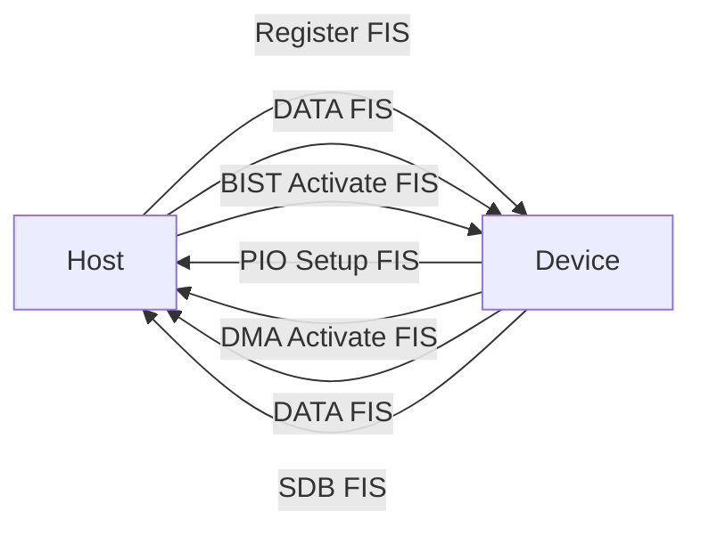

# SATA逻辑层原语与硬件RAID

<span class="badge-i">[Intermediate]</span>

<span class="red">SATA链路层通过原语（Primitive）实现帧定界、流控与链路状态管理，NCQ原生命令队列将随机IO并发度从1提升至32；硬件RAID offload将XOR校验与条带映射下沉到专用芯片，释放嵌入式CPU算力。</span> SATA-AHCI模式下主机需逐个提交命令并轮询完成，而NCQ允许磁盘自主重排命令序列，是嵌入式存储从"机械思维"走向并发优化的分水岭。

<br>硬件RAID 0/1/5在工业NAS、边缘视频存储、医疗影像归档等场景仍广泛存在，但NVMe与软件定义存储正在重塑嵌入式存储架构选型逻辑。

---

## <strong>基础认知</strong>

<span class="green">SATA链路层原语</span> 是4字节特殊控制字，以K28.5开头，区别于普通数据字符，用于构建帧边界、传递时钟补偿与电源管理握手。

<br>每个SATA帧由SOF原语、FIS（Frame Information Structure）载荷、CRC32和EOF原语组成。原语流在8b/10b编码后注入物理层，确保接收端能可靠识别帧起始与结束。

### <strong>关键原语速查</strong>

| 原语 | 编码 | 功能 |
|------|------|------|
| ALIGN | K28.5 D10.2 | 时钟补偿，每256字发送 |
| SOF | K28.5 D23.7 | 帧起始定界符 |
| EOF | K28.5 D29.7 | 帧结束定界符 |
| HOLD | K28.5 D21.5 | 流量控制暂停 |
| HOLDA | K28.5 D21.6 | 暂停应答 |
| X_RDY | K28.5 D23.4 | 发送端准备就绪 |
| R_RDY | K28.5 D23.2 | 接收端准备就绪 |
| SYNC | K28.5 D21.5 | 链路空闲，维持位同步 |
| WTRM | K28.5 D24.2 | 等待帧终止确认 |
| R_IP | K28.5 D21.4 | 接收端正在处理 |
| R_ERR | K28.5 D22.2 | 接收端检测到CRC错误 |

<br><span class="blue">ALIGN原语的周期性插入是SATA物理层时钟恢复的核心机制。</span> 当链路空闲时，发送端以Dword为单位发送SYNC原语，维持8b/10b解码器与CDR（Clock Data Recovery）的锁相环稳定。

### <strong>FIS类型与传输方向</strong>



<br><span class="green">Register FIS</span> 用于传递ATA命令寄存器值；<span class="green">DMA Activate FIS</span> 通知主机开始DMA传输；<span class="green">SDB FIS</span>（Set Device Bits）在NCQ模式下批量上报多个命令完成状态。

---

## <strong>原理解析</strong>

### <strong>为什么NCQ能提升机械硬盘随机性能</strong>

<span class="blue">传统ATA模式下，命令严格按FIFO顺序执行，磁盘必须"走到哪算哪"。</span> NCQ允许磁盘内部队列缓存最多32个待执行命令，由固件根据磁头当前位置、旋转延迟和寻道距离进行重排优化，将寻道总距离最小化。

<br>例如，当队列中存在LBA 100、5000、200的命令时，若磁头当前位于150，NCQ可能选择先执行LBA 200，再折返100，最后远跳5000。这种电梯调度（Elevator Sorting）将随机读IOPS提升15%-35%。

<br>NCQ的完成状态通过SDB FIS批量上报，其中<span class="green">SActive</span>位图（32 bit）每个bit对应一个Tag，置位表示该Tag的命令已完成。主机无需逐个轮询，降低了中断频率和CPU开销。

### <strong>硬件RAID 0/1/5的嵌入式实现差异</strong>

<span class="red">硬件RAID控制器通过专用XOR引擎和条带映射表将冗余计算offload到芯片级。</span> 在嵌入式场景，这决定了CPU能否专注于业务逻辑而非存储parity。

| 级别 | 原理 | 空间利用率 | 容错 | 嵌入式适用性 |
|------|------|-----------|------|-------------|
| RAID 0 | 条带分片写入N盘 | 100% | 无 | 高，追求极致带宽 |
| RAID 1 | 镜像双写 | 50% | 单盘故障 | 高，关键数据保护 |
| RAID 5 | 条带+分布式parity | (N-1)/N | 单盘故障 | 中，需XOR引擎 |
| RAID 6 | 双parity | (N-2)/N | 双盘故障 | 低，嵌入式少用 |

<br><span class="blue">RAID 5的写惩罚（Write Penalty）是嵌入式选型的隐性成本。</span> 一次随机写需要"读旧数据→读旧parity→写新数据→写新parity"4次IO。无硬件XOR引擎时，CPU需逐字节计算parity，延迟剧增。

<br>嵌入式硬件RAID芯片（如Marvell 88SE9220、JMB393）通过PCIe x1/x2连接到SoC，对外暴露虚拟SATA端口，操作系统看到的是一块逻辑盘，条带宽度、缓存策略和rebuild进度由固件管理。

### <strong>AHCI与硬件RAID的端口映射</strong>

AHCI规范定义了最多32个端口，每个端口独立维护Command List和Received FIS结构。

<br>硬件RAID控制器在AHCI模式下通常以"端口乘数器"（Port Multiplier）或PCIe AHCI设备形式出现：
<br>1. **FakeRAID（BIOS RAID）**：依靠驱动层软件实现RAID，无硬件XOR加速，性能与纯软RAID无异
<br>2. **真实硬件RAID**：板载专用RAID SoC，带DDR缓存和XOR引擎，通过PCIe枚举为SCSI HBA或AHCI兼容控制器

<br><span class="blue">嵌入式Linux识别真实硬件RAID的关键是lspci输出的Class Code 0x0104（RAID bus controller）而非0x0106（SATA AHCI）。</span>

---

## <strong>实战教学</strong>

### <strong>分析SATA链路原语流</strong>

```bash
# 使用sata_link_trace（需内核CONFIG_SATA_DEBUG=y）
# 抓取链路层原语计数
cat /sys/kernel/debug/sata_pm/status

# 查看特定端口的NCQ深度和命令Tag分布
cat /sys/class/ata_device/dev*/ncq_depth

# 统计SDB FIS触发的中断频率
awk '/sdb_fis/{print $1}' /sys/kernel/debug/ata/ata1/trace
```

### <strong>检测硬件RAID真伪</strong>

```bash
# 查看PCI设备类别
lspci -nn | grep RAID
# 真实硬件RAID显示 0104
# 示例输出：
# 02:00.0 RAID bus controller [0104]: Marvell Technology Group Ltd. 88SE9235

# 查看是否暴露为SCSI设备（硬件RAID常见）
lsscsi
# [0:0:0:0]    disk    ATA      Samsung SSD 850   /dev/sda
# 若为AHCI模式，通常显示为ata设备而非SCSI

# dmidecode查看BIOS RAID信息
dmidecode -t 204
```

### <strong>NCQ性能对比实验</strong>

```bash
# 关闭NCQ后测试随机读
sudo hdparm -W 0 /dev/sda   # 关闭写缓存（简化实验）
sudo hdparm -Q 0 /dev/sda   # 关闭NCQ
fio --name=randread --rw=randread --bs=4k --iodepth=32 \
    --numjobs=1 --runtime=60 --filename=/dev/sda

# 重新启用NCQ
sudo hdparm -Q 32 /dev/sda
fio --name=randread ... # 对比IOPS提升
```

<br><span class="blue">注意：某些消费级SSD在SATA接口下NCQ收益有限，因为闪存本身的并行度已足够高；NCQ对机械硬盘的优化效果远优于SSD。</span>

---

## <strong>历史演进</strong>

<span class="red">SATA逻辑层原语体系从PATA的并行总线握手信号演进而来，NCQ和硬件RAID则是ATA存储架构向并发化、专用化发展的两个关键节点。</span>

<br>2000年，Intel与行业伙伴定义Serial ATA 1.0，用4线差分对替代PATA的40/80线排线，链路层引入8b/10b编码和原语机制，物理层信号完整性大幅提升。

<br>2003年，SATA 1.0a定稿，传输速率1.5 Gbps（150 MB/s），同时引入NCQ，但早期主板ICH芯片AHCI支持不完善，多数系统运行于Legacy IDE模式，NCQ形同虚设。

<br>2008年，SATA 3.0将速率提升至6 Gbps（600 MB/s），NCQ成为AHCI标准配置的标配功能。此时期硬件RAID卡（3ware、LSI MegaRAID）在服务器市场普及，嵌入式领域开始出现板载FakeRAID。

<br>2011年，SATA Express试图通过PCIe物理层承载SATA协议，以应对NVMe的竞争压力，但市场接受度极低。此后SATA在嵌入式中的角色逐渐退守至低成本大容量存储（NAS硬盘、监控存储）。

<br>2015年后，NVMe全面接管高性能嵌入式存储，但SATA凭借生态成熟度和成本优势，在工业控制、车载DVR、网络录像机等场景持续存在。硬件RAID 1因其实现简单、可靠性高，仍是关键嵌入式系统的默认选项。

<br><span class="purple">CXL 2.0/3.0带来的内存池化概念，正在将嵌入式存储从"本地盘"思维转向" fabric-attached memory"，这预示着未来5年硬件RAID的形态可能发生根本性变化——存储控制器不再局限于本地SATA端口，而是通过CXL.mem访问远端闪存池。</span>

---

## 小结与练习

| 要点 | 说明 |
|------|------|
| 核心概念 | SATA链路层原语实现帧定界与流控；NCQ通过SDB FIS批量上报32个Tag完成状态 |
| 关键技能 | 区分硬件RAID（Class 0x0104，含XOR引擎）与FakeRAID；配置AHCI端口与Command List |
| 常见误区 | RAID 5写惩罚4x并非理论值而是真实IO放大；NCQ对SSD收益远低于机械盘 |
| 性能调优 | 嵌入式RAID需关注XOR引擎延迟和rebuild带宽，避免业务高峰触发rebuild |
| 前沿演进 | SATA Express失败、NVMe接棒；CXL.mem可能重构嵌入式RAID形态 |

**练习**

1. 某嵌入式系统使用RAID 5阵列，条带大小64 KB，写入一个4 KB随机块。计算此次写操作在理想情况下触发多少次底层磁盘IO，并说明为什么写惩罚在RAID 5中是不可避免的。

2. 对比NCQ的SDB FIS批量中断模式与传统PIO轮询模式的CPU开销差异：当队列深度为32、每秒1000次命令完成时，分别估算两种模式的中断次数或轮询开销。

3. 某板载"RAID控制器"在lspci中显示Class Code 0x0106（AHCI），且dmidecode无RAID固件信息。分析其真实实现方式，并评估将其用于关键数据保护的可靠性风险。
