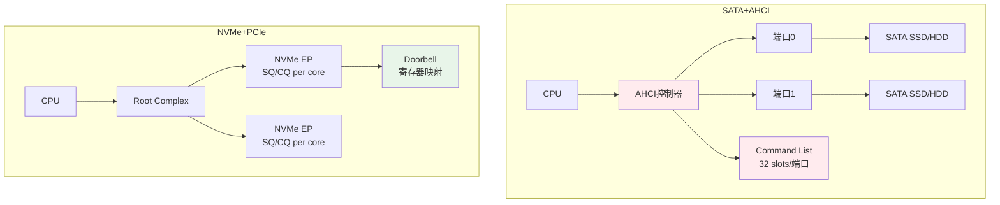

# SATA历史演进与嵌入式存储接口决策

<span class="badge-b">[Beginner]</span>

<span class="red">从PATA的80针排线到SATA的4线差分对，再到SATA Express的双模接口，最终NVMe以PCIe原生姿态接管高性能存储——这条演进路线本质上是用串行化、专用化和协议卸载三条主线，不断将存储总线从"通用并行总线附属品"解放为独立的高速数据管道。</span> 嵌入式工程师的接口选型决策，必须建立在对这条历史脉络的深刻理解之上。

<br>PATA（Parallel ATA）在2000年前后达到性能天花板：133 MB/s的传输率、40/80根信号线、5 V TTL电平、不支持热插拔。SATA的诞生不是简单的"线缆变细"，而是ATA架构的一次彻底重构。

---

## <strong>基础认知</strong>

<span class="green">PATA</span> 采用16位并行数据总线，与ISA总线电气兼容，使用5 V单端信号。最高模式UDMA-6（ATA/133）理论带宽133 MB/s，实际有效带宽受DMA协议开销制约约为100 MB/s。

<br><span class="green">SATA</span> 将并行总线改为串行差分对，物理层采用8b/10b编码，1.5 Gbps（Gen1）实际有效带宽约150 MB/s，与PATA/133持平，但线缆从80线缩减为7线（2对差分+3地线），信号完整性提升两个数量级。

### <strong>历代SATA规范速查</strong>

| 规范 | 年份 | 速率 | 有效带宽 | 关键特性 |
|------|------|------|---------|---------|
| SATA 1.0 | 2003 | 1.5 Gbps | ~150 MB/s | 串行化、NCQ、AHCI |
| SATA 2.0 | 2004 | 3.0 Gbps | ~300 MB/s | 端口乘数、外部eSATA |
| SATA 3.0 | 2008 | 6.0 Gbps | ~600 MB/s | 6 Gbps、NCQ深度优化 |
| SATA 3.2 | 2013 | 6.0 Gbps | ~600 MB/s | 引入SATA Express |
| SATA 3.3 | 2016 | 6.0 Gbps | ~600 MB/s | SMR通知、Power Disable |

<br>SATA Express试图用PCIe物理层同时承载SATA和PCIe协议，提供SATA（6 Gbps）和PCIe（8 Gbps x2）双模，但市场反响冷淡，2014年后几乎无芯片支持，被NVMe直接碾压。

---

## <strong>原理解析</strong>

### <strong>为什么SATA Express失败了而NVMe成功了</strong>

<span class="blue">SATA Express的失败根因是"兼容包袱"与"定位模糊"。</span> 它试图让一颗控制器同时跑SATA和PCIe两种协议，导致PHY设计复杂、成本上升，却未给用户提供明确的性能跃迁理由。

<br>NVMe的成功则遵循了"专用架构匹配专用介质"的铁律：
<br>1. **协议栈精简**：NVMe命令集仅13条admin命令和2条IO命令，对比ATA的28条命令和冗长的taskfile寄存器
<br>2. **PCIe原生**：跳过AHCI的Command List/FIS翻译层，TLP直达控制器寄存器，延迟降低60%
<br>3. **多队列并行**：64K队列×64K深度 vs SATA NCQ的1队列×32深度
<br>4. **MSI-X中断**：每CQ独立中断向量 vs SATA的单一端口中断

<br><span class="blue">嵌入式选型的核心启示是：接口演进不是"越新越好"，而是"匹配介质特性与系统约束"。</span> 对于机械硬盘和低成本SSD，SATA 3.0的600 MB/s仍不构成瓶颈；对于高端NVMe SSD，PCIe x4才是正确归宿。

### <strong>AHCI到NVMe的控制器架构跃迁</strong>



<br>AHCI的Command List和Received FIS是软件可见的结构体，位于系统内存，每次提交命令需要"写命令头→写指针→触发"三步。NVMe的Doorbell机制只需一次MMIO写Tail Doorbell，控制器直接从Host Memory中取走命令，减少了CPU介入次数。

### <strong>嵌入式存储接口决策矩阵</strong>

| 场景 | 推荐接口 | 理由 | 典型产品 |
|------|---------|------|---------|
| 工业PLC数据记录 | SATA SSD | 耐温、成本低、容量大 | 研华SATA DOM |
| 车载ADAS缓存 | NVMe PCIe | 4K随机读IOPS>100K | 车规级NVMe |
| 网络录像机NVR | SATA HDD RAID 1 | 大容量、顺序写优化 | 希捷SkyHawk |
| 医疗设备影像 | NVMe + 10GbE | 高吞吐+低延迟 | DELL Edge网关 |
| 无人机日志 | eMMC 5.1 | 小尺寸、低功耗 | 64 GB eMMC |
| 5G基站边缘 | NVMe + CXL.mem | 内存扩展+持久化 | 即将上市 |

---

## <strong>实战教学</strong>

### <strong>识别系统当前SATA模式</strong>

```bash
# 查看SATA控制器工作模式
lspci -nn | grep SATA
# 输出示例：
# 00:1f.2 SATA controller [0106]: Intel Corporation 82801JI ...
# Class Code 0106 = AHCI模式
# Class Code 0101 = IDE模式（Legacy，无NCQ）

# 查看Kernel日志中的SATA链路训练结果
dmesg | grep -i sata | head -20
# [    2.341] ata1: SATA max UDMA/133 abar m2048@0xf7c36000 port 0xf7c36100 irq 28
# [    2.652] ata1.00: ATA-9: Samsung SSD 860 EVO, RVT01B6Q, max UDMA/133

# 确认NCQ是否启用
cat /sys/class/ata_device/dev*/queue_depth
# 若显示1，则NCQ未启用；显示32则NCQ正常
```

### <strong>嵌入式Linux切换AHCI与IDE模式</strong>

```bash
# 在GRUB/UEFI中切换（x86平台）
# /etc/default/grub
GRUB_CMDLINE_LINUX="libata.force=noncq"   # 强制关闭NCQ（调试）
GRUB_CMDLINE_LINUX="libata.dma=0"         # 强制PIO模式（兼容性测试）

# ARM嵌入式平台通过设备树控制
cat /proc/device-tree/sata@xxx/compatible
# 检查是否绑定了ahci-platform驱动
```

### <strong>为什么某些嵌入式ARM平台不支持SATA原生AHCI</strong>

<span class="blue">ARM SoC的SATA控制器大多通过AHCI-compatible IP（如Synopsys DWC_ahci）实现，但固件初始化往往不完整。</span>

<br>常见陷阱：
<br>1. **PHY未上电**：SATA PHY需要独立的模拟电源和参考时钟，设备树缺少`phy-supply`节点时驱动probe失败
<br>2. **Clock未配置**：AHCI需要AHB总线时钟和SATA参考时钟（通常为100 MHz），DT中缺少`clocks`属性
<br>3. **DMA coherency**：某些旧ARMv7 SoC的AHCI控制器不支持snooping，需在内核中设置`dma-coherent`或显式cache flush

---

## <strong>历史演进</strong>

<span class="red">ATA存储总线的演进史，是一部"串行化替代并行化、专用化替代通用化"的技术史。</span>

<br>1986年，Western Digital和Compaq推出IDE（Integrated Drive Electronics）接口，将硬盘控制器集成到盘体，外部只需简单总线。此时采用16位并行+TTL电平，与ISA总线电气兼容。

<br>1994年，ATA-2（EIDE）引入LBA寻址和多字DMA模式，突破504 MB容量限制。此后ATA标准由T13委员会维护，每1-2年迭代一次，速率从16 MB/s逐步爬升至133 MB/s。

<br>2000年，Intel牵头成立Serial ATA工作组。核心动机不是速度，而是信号完整性——PATA的80线排线在高频下串扰严重，无法突破133 MB/s。串行化后，差分对的抗干扰能力使速率提升路线豁然开朗。

<br>2003-2013年，SATA以每3年翻倍的速度从1.5 Gbps演进到6 Gbps，同时AHCI驱动模型成为Linux内核标配。此时期SATA在PC和服务器市场完全取代PATA。

<br>2011年，NVMe 1.0发布，明确瞄准PCIe SSD。NVMe不是SATA的"下一代"，而是彻底抛弃ATA架构的平行业态。此后SATA退守至大容量冷存储和低成本场景。

<br>2016年，SATA 3.3发布Power Disable特性，允许通过Pin 3/Pin 1供电控制实现硬盘强制断电，这是SATA在数据中心（如SMR硬盘管理）的最后挣扎。

<br><span class="purple">2024年，SATA接口在新设计中的采用率已低于15%，但在存量嵌入式系统中仍占40%以上。理解SATA-AHCI的遗产，是维护 legacy 系统和做向下兼容设计的必备知识。未来5年，CXL.mem与NVMe-oF将共同定义下一代嵌入式存储互联范式。</span>

---

## 小结与练习

| 要点 | 说明 |
|------|------|
| 核心概念 | SATA将PATA并行总线串行化，通过差分对+8b/10b编码解决信号完整性问题 |
| 关键技能 | 通过lspci Class Code区分AHCI/IDE模式；识别NCQ启用状态；切换libata参数 |
| 常见误区 | SATA Express≠SATA 4.0，它已被市场淘汰；NVMe不是SATA的升级版而是替代路线 |
| 选型原则 | 机械盘/低成本SSD选SATA；高性能低延迟选NVMe；小尺寸低功耗选eMMC/UFS |
| 未来趋势 | CXL.mem实现内存级存储互联，可能彻底消解"存储接口"的传统边界 |

**练习**

1. 对比PATA UDMA-133（16位并行，50 MHz时钟）与SATA 3.0（6 Gbps串行，8b/10b编码）的引脚数和理论带宽利用率。计算两者每根数据线的有效带宽，并解释为什么SATA能用更少的线实现更高的有效吞吐。

2. 某嵌入式ARM平台移植Linux后，SATA SSD只能以PIO模式运行，dmesg显示"ahci: probe failed"。列出3个可能的硬件/固件原因，并给出对应的设备树或内核配置排查步骤。

3. 假设你需要为一个网络录像机（NVR）设计存储子系统：8路4K摄像头同时写入，要求7×24连续运行，单盘故障可恢复。在SATA HDD RAID 5、SATA SSD RAID 1、NVMe SSD RAID 1三种方案中，从成本、功耗、可靠性、可维护性四个维度做决策分析并给出推荐。
