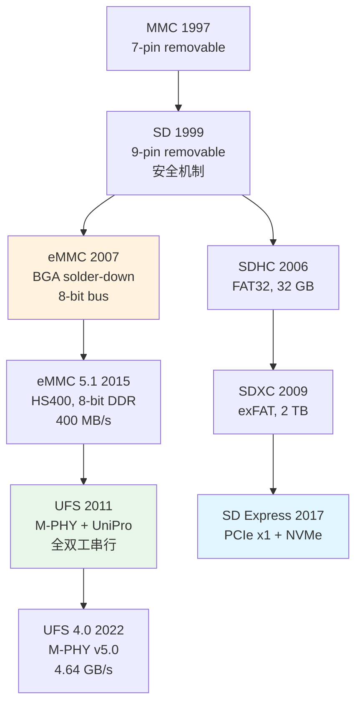

# SD历史演进与未来趋势

<span class="badge-i">[Intermediate]</span>

<span class="red">SD卡从1999年128 MB的MMC衍生体，演进到2024年SD Express 8.0的4 GB/s PCIe原生接口，用25年时间完成了容量提升4万倍、速率提升3个数量级的跨越。这条路线深刻反映了嵌入式存储从"可移动介质"向"系统级存储"的范式转移。</span> 同时，eMMC和UFS从SD/MMC标准中分化出来，分别占据中低端和高端嵌入式存储市场，形成了三足鼎立之势。

<br>对于嵌入式工程师而言，SD卡的选型已不仅是容量和速率，更需要理解UHS、A/V速度等级、SD Express、以及eMMC/UFS替代路线图。

---

## <strong>基础认知</strong>

<span class="green">SD</span>（Secure Digital）由松下、东芝和SanDisk于1999年联合推出，基于MMC（MultiMediaCard）物理层扩展了版权保护机制（CPRM）。SD卡保持与MMC的电气兼容性，但命令集和寄存器定义独立演进。

<br><span class="green">MMC</span> 由西门子（现英飞凌）和SanDisk于1997年定义，采用7-pin串行接口（CMD、CLK、DAT0、VDD×2、VSS×2），是SD、eMMC、UFS的共同祖先。

### <strong>SD规范演进时间线</strong>

| 年份 | 规范 | 关键特性 | 最大容量 | 速率 |
|------|------|---------|---------|------|
| 1999 | SD 1.0 | 基于MMC，引入安全机制 | 2 GB | 12.5 MB/s |
| 2003 | SD 1.1 | SDHC（FAT32），4 GB+ | 32 GB | 25 MB/s |
| 2006 | SD 2.0 | SDHC标准，Class 2/4/6 | 32 GB | 25 MB/s |
| 2009 | SD 3.0 | SDXC（exFAT），UHS-I | 2 TB | 104 MB/s |
| 2011 | UHS-II | 第二排金手指，全双工 | 2 TB | 312 MB/s |
| 2016 | UHS-III | 全双工LVDS | 2 TB | 624 MB/s |
| 2017 | SD Express | PCIe x1 + NVMe | 2 TB | 985 MB/s |
| 2020 | SD Express 7.0 | PCIe 3.0 x1 | 128 TB | 985 MB/s |
| 2024 | SD Express 8.0 | PCIe 4.0 x2 | 128 TB | 4 GB/s |

<br>速度等级体系独立于物理接口版本：
<br>**Class等级**（2/4/6/10）：以MB/s为单位的最小持续写速率
<br>**UHS等级**（U1/U3）：对应10/30 MB/s写入
<br>**Video等级**（V6/V10/V30/V60/V90）：视频录制专用
<br>**Application等级**（A1/A2）：IOPS指标，A2要求4000读/2000写IOPS

---

## <strong>原理解析</strong>

### <strong>为什么SD需要UHS-II的第二排金手指</strong>

<span class="blue">UHS-I仍使用半双工SD总线，在104 MHz时钟下达到104 MB/s已是单线极限。</span> UHS-II引入第二排8个触点（共17 pin），支持差分对全双工，将接口从"分时复用CMD/DAT"升级为"独立上行/下行通道"。

<br>UHS-II的物理层特性：
<br>1. **全双工**：上行和下行同时使用各自的差分对
<br>2. **LVDS电平**：降低信号摆幅以减少功耗和EMI
<br>3. **Scrambling**：避免长串0/1导致CDR失锁
<br>4. **链式拓扑**：支持通过卡串联实现总线共享（罕见）

<br>但UHS-II/UHS-III在嵌入式领域几乎未普及，原因是：
<br>- eMMC以BGA封装直接焊接到主板，可靠性远超插拔式SD
<br>- UFS通过M-PHY提供全双工串行，性能远超UHS-III
<br>- 相机市场（UHS-II的主场）与嵌入式市场交集有限

### <strong>eMMC与UFS从SD/MMC标准中分化的必然性</strong>



<br><span class="blue">eMMC的诞生是"将SD卡协议移植到BGA封装"的工程需求，UFS的诞生则是"eMMC并行总线已无法满足闪存并发度"的技术必然。</span>

<br>eMMC保留了MMC的并行总线（1/4/8-bit）和命令/响应协议，但将控制器与NAND封装在同一BGA中，Host只需关注MMC接口，NAND管理（FTL、磨损均衡、坏块管理）完全offload到eMMC内部控制器。

<br>UFS的革命性在于抛弃并行总线，改用M-PHY差分对（与MIPI同源）和UniPro协议栈（L1.5/L2/L3层）。全双工、SCSI命令集、深度队列（32 cmd/queue，32 queue）使其性能接近NVMe，而功耗和面积远小于NVMe方案。

### <strong>SD Express对嵌入式系统的意义</strong>

<span class="red">SD Express是SD协会对NVMe的回应，试图用PCIe物理层+NVMe协议栈复活SD卡的可移动存储定位。</span>

<br>技术架构：
<br>1. **PCIe物理层**：x1或x2 Lane，速率与PCIe规范同步
<br>2. **NVMe协议栈**：完整NVMe命令集，SQ/CQ机制
<br>3. **向后兼容**：金手指保留传统SD引脚，可降级为UHS-I

<br>嵌入式意义：
<br>- **可移动NVMe**：允许嵌入式设备使用可插拔的NVMe介质，兼顾高性能与可维护性
<br>- **容量扩展**：SD Express 8.0支持128 TB，远超eMMC/UFS的板载上限
<br>- **成本曲线**：NVMe BGA在256 GB+时成本低于eMMC，SD Express卡将填补这一空白

<br><span class="blue">但SD Express在嵌入式领域的真正落地仍面临挑战：卡槽机械可靠性、PCIe REFCLK布线的EMI敏感性、以及热插拔对NVMe驱动栈的复杂要求。</span>

---

## <strong>实战教学</strong>

### <strong>识别SD卡真实性能等级</strong>

```bash
# Linux下读取SD卡寄存器信息（通过mmc-utils）
mmc extcsd read /dev/mmcblk0 | grep -E "SEC_COUNT|BUS_WIDTH|HS_TIMING"

# 查看Card Identification寄存器
cat /sys/class/mmc_host/mmc0/mmc0:0001/cid
# 解析CID：
# 字节0-2: Manufacturer ID（0x02=SanDisk, 0x11=Toshiba, 0x13=Micron）
# 字节3-7: OEM/Application ID + Product Name

# 检测UHS模式是否激活
cat /sys/kernel/debug/mmc0/ios
# clock:        208000000 Hz   <-- UHS-I SDR104模式
# bus mode:     2 (push-pull)
# signal:       3 (1.8 V)
```

### <strong>eMMC与SD卡命令集对比</strong>

```c
/* eMMC 命令示例：发送EXT_CSD读取 */
// CMD8 发送，参数为0，等待R1响应
mmc_send_cmd(MMC_SEND_EXT_CSD, 0, MMC_RSP_R1, ext_csd_buf);
// EXT_CSD[196] = Bus Width（支持位）
// EXT_CSD[185] = HS_TIMING（高速时序模式）
// EXT_CSD[192..199] = SEC_COUNT（总扇区数）

/* SD卡命令示例：发送ACMD6切换总线宽度 */
// 先发送CMD55（APP_CMD），再发送ACMD6（SET_BUS_WIDTH）
mmc_send_cmd(MMC_APP_CMD, rca << 16, MMC_RSP_R1, NULL);
mmc_send_cmd(SD_APP_SET_BUS_WIDTH, 0x02, MMC_RSP_R1, NULL);  // 4-bit
```

### <strong>为什么某些嵌入式平台不支持SDXC exFAT</strong>

<span class="blue">exFAT是微软专利文件系统，Linux内核直到5.4（2019）才内置exFAT驱动（由微软开源）。</span>

<br>嵌入式平台常见问题：
<br>1. **内核版本过旧**：Android 4.x/5.x时代的BSP使用fuse-exfat，性能和稳定性差
<br>2. **授权风险**：早期设备需向微软支付exFAT授权费，部分厂商干脆屏蔽64 GB+支持
<br>3. **分区对齐**：SDXC的exFAT默认簇大小与NAND page size不对齐，导致写放大

<br>解决方案：将SDXC卡重新格式化为FAT32（通过第三方工具突破32 GB限制）或ext4（Linux专用）。

---

## <strong>历史演进</strong>

<span class="red">SD/MMC的历史是"从可移动存储到系统级存储"的25年长征，eMMC和UFS的分化标志着嵌入式存储进入专用化时代。</span>

<br>1997年，MMC以7-pin串行接口诞生，定位数码相机和音乐播放器。其简单协议和低成本使其迅速普及。

<br>1999年，SD卡加入DRM版权保护，尺寸增大以容纳9个触点。SD与MMC的电气兼容性是SanDisk等企业推动的兼容性策略。

<br>2006年，SDHC将FAT32作为强制文件系统，容量上限提升至32 GB。Class速度等级（2/4/6/10）的引入，使消费者首次有了明确的性能预期。

<br>2009年，SDXC引入exFAT，容量上限飙升至2 TB。UHS-I通过提升时钟到208 MHz（SDR104），将速率推至104 MB/s。

<br>2011年，JEDEC发布eMMC 4.41，将MMC协议封装为BGA芯片。同年UFS 1.0由JEDEC和MIPI联盟联合发布，目标直指高端智能手机。

<br>2017年，SD Express发布，首次在SD卡中引入PCIe和NVMe。这是SD协会对"高端市场被UFS蚕食"的防御性回应。

<br>2022年，UFS 4.0达到4.64 GB/s，M-PHY v5.0每lane速率11.6 Gbps。同期SD Express 7.0以PCIe 3.0 x1提供985 MB/s，差距仍然明显。

<br><span class="purple">2024年的嵌入式存储选型图景已清晰：小容量/超低成本用SPI NOR/NAND，中容量用eMMC 5.1，大容量高性能用UFS 4.0，可移动扩展用SD Express或NVMe BGA。SD/MMC的"原始形态"（可插拔卡）正在从系统主存储退位为辅助扩展介质。</span>

---

## 小结与练习

| 要点 | 说明 |
|------|------|
| 核心概念 | SD从MMC分化，保留电气兼容但独立演进；eMMC是SD协议的BGA焊封版；UFS是全双工串行替代 |
| 关键技能 | 通过CID解析SD卡厂商信息；识别UHS-I/II/express模式；区分Class/UHS/Video/App速度等级 |
| 常见误区 | SD Express≠普通SD卡，需PCIe控制器支持；exFAT在旧内核无原生驱动；UHS-II在嵌入式几乎未普及 |
| 选型原则 | 嵌入式主存储首选eMMC/UFS BGA；可移动扩展选SD Express；旧系统兼容选标准SDHC |
| 演进趋势 | UFS在性能上碾压SD Express，但后者在可移动性上不可替代；两者将在嵌入式领域长期共存 |

**练习**

1. 某SD卡标注"A2 V30 U3"，分别解释这三个速度等级的测试条件和适用场景。计算该卡理论上在4K随机写场景下的最小IOPS，并说明为什么实际IOPS通常远高于此最小值。

2. 对比eMMC 5.1（HS400，8-bit DDR，52 MHz）与UFS 3.1（M-PHY v4.1，2lane）的理论带宽。计算两者在NAND介质本身支持1 GB/s时，接口协议分别构成多大比例的性能瓶颈。

3. 某工业嵌入式设备需要可现场更换的存储介质，容量需求512 GB，性能需求>500 MB/s顺序读。在SD Express 7.0（PCIe 3.0 x1，985 MB/s）、NVMe M.2 2230（PCIe 3.0 x4，3.5 GB/s）、以及标准UHS-I SD卡（104 MB/s）中做选型分析，并评估各自的机械可靠性和EMI设计复杂度。
