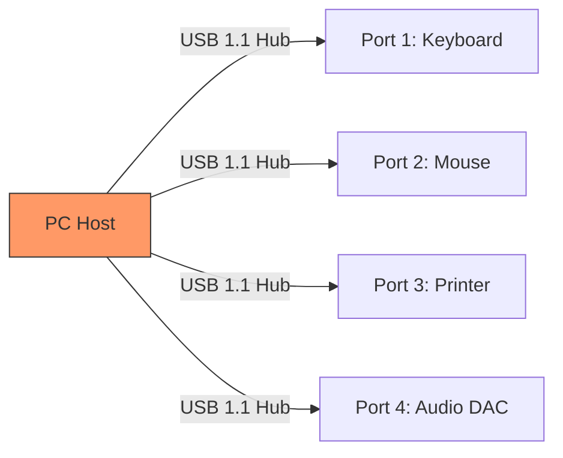
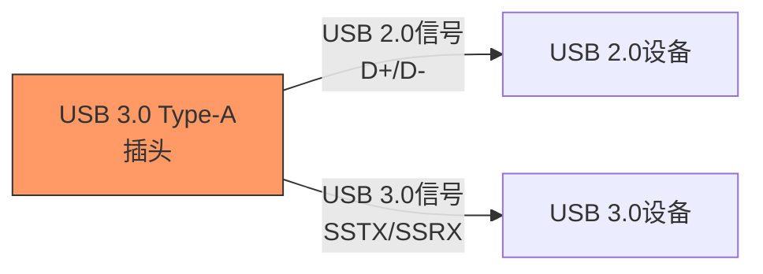
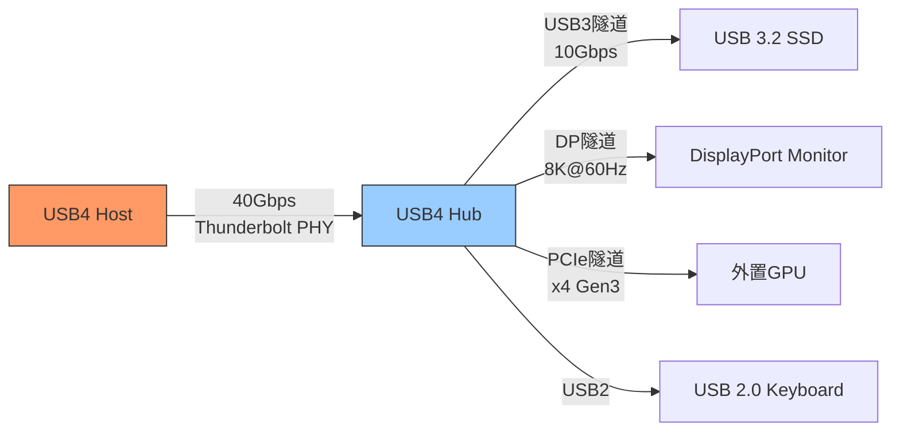

# USB历史演进与USB4

<span class="badge-i">[Intermediate]</span> <span class="badge-e">[Expert]</span>

<span class="red">USB</span>（Universal Serial Bus）是现代计算设备最通用的外设接口。

从1996年USB 1.0的1.5Mbps到USB4的40Gbps，USB用二十八年的演进证明了"统一接口"愿景的可行性。

Type-C连接器的出现和Thunderbolt/USB4的融合，正在将USB从"外设接口"重新定义为"通用互联协议"。

---

## <strong>从USB 1.0到4.0：速率跃迁的五代演进</strong>

### <strong>USB 1.x：低速与全速的起点</strong>

<span class="red">USB 1.0</span>于1996年发布，由Intel、Microsoft、Compaq、DEC、IBM、NEC、Northern Telecom七家公司联合制定。

USB 1.0定义了两种速率模式：

| 模式 | 速率 | 应用场景 | 电缆要求 |
|------|------|----------|----------|
| Low Speed | 1.5Mbps | 鼠标、键盘 | 非屏蔽 |
| Full Speed | 12Mbps | 音频、打印 | 屏蔽 |

USB 1.0的设计哲学——"即插即用、统一连接器、总线供电"——在当时是革命性的。



<span class="blue">关键认知：USB 1.0的1.5Mbps低速模式不是为了性能，而是为了成本——低速设备不需要昂贵的屏蔽电缆和晶振，用RC振荡器即可满足时序要求。
</span><br>

### <strong>USB 2.0：高速时代</strong>

<span class="green">USB 2.0</span>2000年发布，新增<span class="green">480Mbps High Speed</span>模式。

USB 2.0的480Mbps（实际约35-40MB/s有效吞吐量）满足了早期外置硬盘、数码相机和扫描仪的需求。

| 版本 | 发布年份 | 新增速率 | 标志 |
|------|----------|----------|------|
| USB 1.0 | 1996 | 1.5/12Mbps | - |
| USB 1.1 | 1998 | 修正1.0错误 | - |
| USB 2.0 | 2000 | 480Mbps | Hi-Speed |
| USB 3.0 | 2008 | 5Gbps | SuperSpeed |
| USB 3.1 | 2013 | 10Gbps | SuperSpeed+ |
| USB 3.2 | 2017 | 20Gbps | SuperSpeed++ |
| USB4 | 2019 | 40Gbps | USB4 |

USB 2.0的物理层关键变化是使用了更复杂的信号编码——从USB 1.x的NRZI编码升级到<span class="green">8b/10b编码</span>（USB 3.0起），以支持更高频率的信号传输。

### <strong>USB 3.x：SuperSpeed与双总线架构</strong>

<span class="green">USB 3.0</span>引入了<span class="red">"双总线架构"</span>——在保留USB 2.0 D+/D-信号对的同时，新增了两对差分线（SSTX+/SSTX-和SSRX+/SSRX-）。

这种设计的核心考量是向后兼容——USB 3.0端口可以插入USB 2.0设备，反之亦然。



USB 3.x的速率演进：

| 版本 | 速率 | 编码 | 有效吞吐量 |
|------|------|------|------------|
| USB 3.0 | 5Gbps | 8b/10b | ~450MB/s |
| USB 3.1 Gen2 | 10Gbps | 128b/132b | ~1.1GB/s |
| USB 3.2 Gen2x2 | 20Gbps | 128b/132b | ~2GB/s |

<span class="blue">关键认知：USB 3.x的编码效率提升（8b/10b=80% → 128b/132b=97%）是速率增长超越时钟增长的原因——USB 3.1 Gen2的10Gbps仅需要约5GHz的模拟带宽，而非10GHz。
</span><br>

### <strong>USB4：Thunderbolt融合与40Gbps</strong>

<span class="green">USB4</span>2019年发布，是USB历史上最大的架构变革。

USB4的关键特性：

- <span class="green">基于Thunderbolt 3协议</span>——Intel向USB-IF捐赠了Thunderbolt 3规范
- <span class="green">40Gbps</span>最大速率（使用双lane模式）
- <span class="green">隧道化</span>——USB3、DisplayPort、PCIe协议共享同一物理层
- <span class="green">动态带宽分配</span>——根据连接的设备自动分配带宽



| 协议隧道 | 最大带宽 | 应用场景 |
|----------|----------|----------|
| USB 3.2 Gen2 | 10Gbps | 存储、外设 |
| DisplayPort 1.4a | 32.4Gbps (HBR3) | 8K显示 |
| PCIe 3.0 x4 | 32Gbps | 外置GPU/扩展坞 |
| PCIe 4.0 x4 | 64Gbps | 未来扩展 |

<span class="blue">关键认知：USB4的"隧道化"是架构层面的质变——USB不再是"一种传输协议"，而是"一种承载多种协议的通用管道"，这种灵活性让扩展坞可以同时将视频、数据、网络和外设连接到单个端口。
</span><br>

---

## <strong>Type-C统一接口：一个连接器统治所有</strong>

### <strong>为什么需要Type-C</strong>

USB接口的历史是连接器混乱的历史：

| 连接器 | 速率 | 供电 | 正反插 | 视频 | 典型用途 |
|--------|------|------|--------|------|----------|
| Type-A | 最大USB 3.2 | 5V/0.9A | 否 | 否 | PC主机端 |
| Type-B | 最大USB 3.2 | 5V/0.9A | 否 | 否 | 打印机、外置硬盘 |
| Mini-USB | USB 2.0 | 5V/0.5A | 否 | 否 | 早期手机、相机 |
| Micro-USB | USB 2.0/3.0 | 5V/1.8A | 否 | 否 | 安卓手机（旧） |
| Type-C | USB4/Thunderbolt4 | 240W | 是 | DP/PCIe | 现代统一接口 |

<span class="green">USB Type-C</span>2014年发布，核心设计目标：

- <span class="green">正反可插</span>：24个引脚对称排列
- <span class="green">功率升级</span>：支持USB PD，最高240W
- <span class="green">Alternate Mode</span>：支持DP、PCIe、Thunderbolt复用
- <span class="green">尺寸紧凑</span>：8.4mm × 2.6mm

```c
// USB Type-C CC（Configuration Channel）检测
// CC引脚用于检测连接方向、角色（DFP/UFP）和供电能力

// Type-C连接状态机（简化）
typedef enum {
    TC_UNATTACHED,       // 未连接
    TC_ATTACH_WAIT,      // 等待稳定
    TC_ATTACHED,         // 已连接
    TC_ORIENTED,         // 方向确定
    TC_ROLE_RESOLVED,    // 主从角色确定
    TC_POWER_CONTRACT,   // 供电协议协商完成
    TC_ALT_MODE_ENTRY    // 进入Alternate Mode（DP/PCIe）
} TypeCState;

// CC引脚检测逻辑（硬件自动完成）
// - CC1/CC2上的Rd/Rp电阻用于检测连接和方向
// - 上拉电阻（Rp）端 = Source/DFP（下行端口，如充电器）
// - 下拉电阻（Rd）端 = Sink/UFP（上行端口，如手机）
// - 两者都有Rp = DRP（双角色端口，如笔记本电脑）

// 供电能力广播（通过Rp值）
// Rp = 56kΩ : Default USB Power (5V/0.5A)
// Rp = 22kΩ : Medium Power (5V/1.5A)
// Rp = 10kΩ : High Power (5V/3A, USB PD前)
```

<span class="blue">关键认知：Type-C的"CC引脚"是其智能的核心——两根5.1kΩ下拉电阻让手机告诉充电器"我需要5V/3A"，而充电器通过CC上的上拉电阻强度告诉手机"我能提供多少功率"。
</span><br>

---

## <strong>嵌入式OTG：USB的双角色能力</strong>

### <strong>USB OTG在嵌入式中的应用</strong>

<span class="green">USB OTG</span>（On-The-Go）2001年发布，允许USB设备在Host和Device角色之间动态切换。

这在嵌入式系统中极其重要——一个工业平板可以作为Host连接U盘，也可以作为Device连接到PC进行固件更新。

| 模式 | 角色 | 典型应用 |
|------|------|----------|
| Host Mode | DFP（下行端口） | 连接U盘、键盘、传感器 |
| Device Mode | UFP（上行端口） | 连接到PC充电/通信 |
| OTG Mode | DRP（双角色） | 动态切换主从 |
| OTG + HNP | 角色交换 | 协商切换主从权 |
| OTG + SRP | 会话请求 | 从设备唤醒主机 |

```c
// Linux USB Gadget 配置示例
// 嵌入式Linux设备作为USB Device（Gadget Mode）

#include <linux/usb/composite.h>
#include <linux/usb/gadget.h>

// 配置Gadget功能：复合设备（大容量存储 + CDC ACM串口）
static struct usb_function_instance *fi_acm;
static struct usb_function_instance *fi_mass_storage;

int setup_gadget(struct usb_composite_dev *cdev) {
    // 创建ACM（CDC Abstract Control Model）串口功能
    fi_acm = usb_get_function_instance("acm");
    if (IS_ERR(fi_acm)) return PTR_ERR(fi_acm);

    // 创建大容量存储功能
    fi_mass_storage = usb_get_function_instance("mass_storage");
    if (IS_ERR(fi_mass_storage)) return PTR_ERR(fi_mass_storage);

    // 绑定到USB Gadget框架
    // 当连接到PC主机时，设备同时表现为：
    // 1. USB串口（/dev/ttyACM0）
    // 2. U盘（LUN0指向板载eMMC分区）

    return 0;
}

// 典型嵌入式OTG控制器配置（以STM32为例）
// OTG_FS/OTG_HS支持：
// - Host Mode: 连接外部设备（通过A型转接）
// - Device Mode: 作为外设连接到PC
// - OTG Mode: 通过ID引脚检测角色（Mini-AB/Type-C时代）
// - Type-C时代：通过CC引脚和PD控制器协商角色
```

### <strong>USB PD在嵌入式供电中的角色</strong>

<span class="green">USB PD</span>（Power Delivery）让Type-C接口可以提供最高240W（48V/5A）的功率。

| 电压 | 最大电流 | 最大功率 | 典型应用 |
|------|----------|----------|----------|
| 5V | 3A | 15W | 手机充电 |
| 9V | 3A | 27W | 快充 |
| 15V | 3A | 45W | 笔记本 |
| 20V | 5A | 100W | 高性能笔记本 |
| 48V | 5A | 240W | 游戏本/工作站 |

<span class="blue">关键认知：USB PD的"供电角色协商"是双向的——笔记本电脑可以给手机充电，也可以从显示器获取供电（DisplayPort Alt Mode + PD供电），这种灵活性正在改变桌面布线方式。
</span><br>

---

## <strong>历史演进：二十八年通用串行总线之路</strong>

### <strong>从外设接口到通用互联协议</strong>

| 年代 | 技术 | 代表 | 关键演进 |
|------|------|------|----------|
| 1996 | USB 1.0 | Intel/Microsoft | 统一外设接口愿景 |
| 1998 | USB 1.1 | 修正错误 | 真正可用 |
| 2000 | USB 2.0 | 480Mbps | 高速时代 |
| 2001 | USB OTG | 手机/平板 | 双角色能力 |
| 2008 | USB 3.0 | 5Gbps SuperSpeed | 蓝色接口时代 |
| 2012 | USB 3.0 renamed | USB 3.1 Gen1 | 命名混乱开始 |
| 2013 | USB 3.1 Gen2 | 10Gbps | Type-C酝酿 |
| 2014 | USB Type-C | 正反插 | 连接器革命 |
| 2017 | USB 3.2 | 20Gbps | 双lane |
| 2017 | USB PD 3.0 | 100W | 供电革命 |
| 2019 | USB4 | 40Gbps | Thunderbolt融合 |
| 2021 | USB PD 3.1 | 240W | 扩展功率范围 |
| 2025+ | USB4 v2 | 80Gbps | 下一代速率 |

<span class="blue">演进逻辑：USB从"外设接口"（USB 1.0-2.0）演进到"高速数据接口"（USB 3.x）再演进到"通用互联协议"（USB4/Type-C），每一次跃迁都扩展了USB的应用边界。
</span><br>

---

## <strong>本章小结</strong>

| 要点 | 内容 |
|------|------|
| USB 1.0-2.0 | Low(1.5M)/Full(12M)/High(480M)bps，D+/D-信号 |
| USB 3.x | SuperSpeed 5/10/20Gbps，新增SSTX/SSRX差分对 |
| USB4 | 40Gbps，Thunderbolt融合，协议隧道化 |
| Type-C | 24pin，正反插，USB PD供电，Alternate Mode |
| OTG | 嵌入式Host/Device双角色动态切换 |
| USB PD | 5V-48V，最大240W，双向供电协商 |
| 命名混乱 | USB 3.2 Gen2x2 = 20Gbps，注意区分 |

## <strong>练习</strong>

1. USB 3.x的"双总线架构"（保留USB 2.0 D+/D-同时新增SuperSpeed差分对）在物理层上是如何实现的？为什么USB 3.0端口插入USB 2.0设备时仍能正常工作？
2. USB4的"隧道化"架构允许在同一物理链路上同时传输USB3、DisplayPort和PCIe数据。请解释动态带宽分配是如何工作的，以及当同时连接外置SSD（需要10Gbps）和8K显示器（需要DP HBR3）时，40Gbps总带宽如何分配。
3. USB Type-C的CC引脚除了检测连接方向外，还承载了哪些功能？在一个支持USB PD的嵌入式设备中，Type-C控制器和PD控制器之间如何协作完成供电角色协商？

---

## <strong>学习路径</strong>

- <span class="badge-i">[Intermediate]</span> 从Linux USB Gadget框架入手，理解Device Mode的配置和复合设备功能（ACM + Mass Storage + RNDIS）。
- <span class="badge-e">[Expert]</span> 深入研究USB4协议栈、Type-C PD状态机、以及USB PHY的信号完整性设计。
- <span class="purple">扩展阅读：USB-IF官方规范、USB 2.0/3.2/4.0协议规范、USB PD 3.1规范、Linux内核drivers/usb子系统源码。
</span><br>