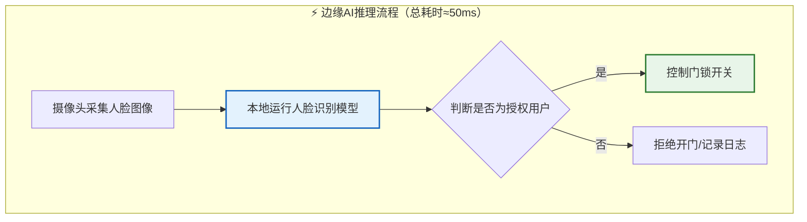
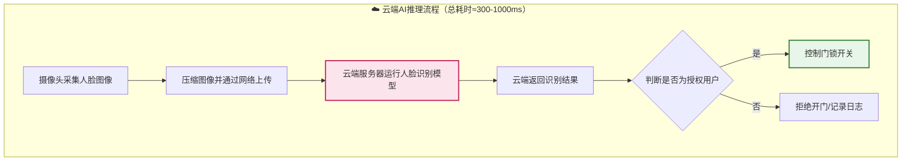

## 核心定义与价值
### 小节定位说明
- 难度：B（入门）
- 设计思路：先建立"AI推理"与"AI训练"的核心区分，再定义边缘AI推理，通过同一任务的两种实现方式对比本质差异，最后用工程化数据和案例论证嵌入式场景的独特价值，全程避免公式和代码，用生活化类比降低理解门槛

---

### 边缘AI推理的标准定义
首先需要明确两个最基础的AI概念： 
AI训练 是指用海量标注数据"教"AI模型学习规律的过程，通常在高性能服务器集群上完成，耗时从几小时到几个月不等，消耗大量算力和电力。 
AI推理 是指用训练好的模型对新数据进行预测和判断的过程，是AI技术真正落地产生价值的环节。

边缘AI推理 就是将AI推理过程部署在数据产生的终端设备本地，直接完成计算并输出结果，无需将原始数据上传至云端服务器。 
与之相对的是云端AI推理：设备只负责采集数据，所有计算都在远程数据中心完成，设备仅接收最终结果。

> 💡 【通俗类比】AI训练就像老师在学校里教学生知识，需要很长时间和很多资源；AI推理就像学生毕业后用学到的知识解决实际问题。边缘AI推理就是学生在现场直接解决问题，云端AI推理就是学生把问题带回家问老师，等老师解答后再回来处理。

### 与云端AI推理的本质差异
我们用同一个"人脸识别开门"任务来对比两种模式的完整流程：

两者的核心差异源于计算位置的不同，进而衍生出一系列关键特性：

| 对比维度 | 边缘AI推理 | 云端AI推理 |
|----------|------------|------------|
| 计算位置 | 终端设备本地 | 远程数据中心 |
| 数据传输量 | 仅传输最终结果（几KB） | 全量原始数据（几MB-几十MB） |
| 典型响应时延 | 1-100毫秒 | 100-1000毫秒 |
| 网络依赖 | 断网可正常工作 | 无网络完全失效 |
| 隐私风险 | 数据不出本地，风险极低 | 存在传输和存储泄露风险 |
| 算力上限 | 受设备硬件限制 | 可无限扩展集群算力 |
| 长期成本 | 一次性硬件投入 | 持续的服务器和带宽费用 |

### 嵌入式场景四大不可替代价值
边缘AI推理并非要完全取代云端AI，而是解决云端AI在嵌入式场景中无法满足的四个核心痛点：

1. **低时延** 
工业控制、车载安全等硬实时场景对响应时间有严格要求，云端传输的网络延迟会直接导致安全事故。 
例如汽车自动紧急制动系统，要求从发现障碍物到完成制动的总时间不超过100毫秒。如果采用云端推理，仅网络传输就需要200毫秒以上，根本无法满足要求。

2. **高隐私** 
医疗、安防、工业等领域的数据包含大量敏感信息，绝对不允许离开设备。 
例如医院的床边监护设备，采集的患者生命体征数据属于医疗隐私，任何上传行为都可能违反《个人信息保护法》；工厂的产线缺陷检测数据包含核心工艺机密，一旦泄露会造成巨大经济损失。

3. **低带宽** 
视频、激光雷达等传感器产生的数据量极大，全量上传会产生难以承受的带宽成本。 
例如一个普通的2K安防摄像头，每秒产生4Mbps数据，一天就是43GB。如果100个摄像头全部上传云端，仅带宽费用每年就超过50万元。而边缘AI推理只在发现异常时上传几KB的告警信息，带宽成本降低99%以上。

4. **高可靠性** 
嵌入式系统通常部署在偏远、网络不稳定的环境中，必须保证在断网情况下也能正常工作。 
例如野外的油气管道监测设备，经常会出现数天甚至数周的网络中断。如果依赖云端推理，这段时间内设备将完全失效，无法及时发现管道泄漏等安全隐患。

> 核心结论：当你的应用场景需要低时延、高隐私、低带宽或高可靠性中的任意一项时，边缘AI推理就是必然选择。只有当任务需要极大算力、且对时延和隐私没有要求时，才适合采用云端AI推理。
{: .conclusion }

---

## 典型商用落地场景
### 小节定位说明
- 难度：B（入门）
- 设计思路：从"解决什么实际问题"切入，每个场景先讲传统方案的痛点，再讲边缘AI推理的解决方案，最后用真实商用数据和案例量化价值，避免泛泛而谈。所有案例均基于嵌入式Linux平台实现，贴合本书定位。

---

### 工业视觉质检与预测性维护
这是边缘AI推理在工业领域渗透率最高、商业价值最明确的应用，几乎所有离散制造和流程制造行业都在大规模落地。

传统工业质检完全依赖人工肉眼检查，存在三个无法解决的痛点： 
- 效率低：一个熟练工人每分钟最多检查3-5个产品，无法匹配产线每秒1-2个的生产速度 
- 准确率不稳定：工人连续工作2小时后，准确率会从95%下降到70%以下 
- 成本高：一条产线需要配备3-5名质检工人，年人力成本超过50万元

边缘AI视觉质检系统通过工业摄像头实时采集产品图像，在本地嵌入式Linux设备上运行缺陷检测模型，能在50毫秒内识别出划痕、裂纹、缺料、变形等几十种缺陷，准确率稳定在99.5%以上。 
> 【真实案例】某汽车零部件厂的轴承缺陷检测项目，采用基于RK3588的嵌入式Linux边缘盒子，部署YOLOv5缺陷检测模型。改造后，一条产线仅需1名工人复核异常结果，质检效率提升10倍，漏检率从5%降至0.1%，每年节省人力成本和返工成本超过200万元。

预测性维护是工业领域另一大核心应用。传统的设备维护采用"定期检修"模式，要么过度维护造成浪费，要么维护不及时导致设备故障停机。 
边缘AI系统通过振动、温度、电流等传感器实时采集设备运行数据，在本地运行故障预测模型，能提前数天甚至数周预测出轴承磨损、电机老化等潜在故障，安排计划性维修。 
> 【数据对比】某钢铁厂的轧机设备，一次非计划停机平均造成300万元损失。部署边缘AI预测性维护系统后，非计划停机次数减少80%，设备综合效率（OEE）提升15%。

### 安防智能分析与人脸识别
传统安防系统只能实现"视频录制+事后回放"，需要人工24小时监控，不仅效率极低，而且很容易遗漏重要事件。

边缘AI智能摄像头和NVR（网络视频录像机）基于嵌入式Linux平台，能本地实现人脸识别、车牌识别、行为分析、异常事件检测等功能，只有在发现异常时才上传告警信息和截图，大大降低了带宽成本和人工成本。

典型应用场景包括： 
- **小区门禁**：本地人脸识别实现无感通行，不需要联网，既保护了业主隐私，又提高了通行效率。即使小区网络中断，门禁系统也能正常工作。 
- **园区周界防范**：边缘AI摄像头能本地识别翻越围墙、闯入禁区等异常行为，实时发出声光告警，同时将告警信息推送到安保人员手机。 
- **加油站安全监控**：边缘AI系统能本地识别吸烟、打电话、未穿工作服等违规行为，立即发出语音提醒，避免安全事故。

> 【成本对比】一个100路摄像头的园区监控系统，如果采用云端AI分析，每年的带宽和服务器费用超过30万元；而采用边缘AI方案，仅需一次性投入10万元购买边缘设备，后续几乎没有运营成本。

### 车载ADAS与舱内感知
车载领域是边缘AI推理对时延要求最苛刻的应用场景，任何网络延迟都可能导致严重的安全事故，因此所有核心功能都必须在本地完成。

ADAS（高级驾驶辅助系统）通过摄像头、毫米波雷达、激光雷达等传感器感知周围环境，在车载嵌入式Linux系统上运行AI模型，实现车道保持、自动紧急制动、自适应巡航、交通标志识别等功能。 
> 【关键要求】汽车自动紧急制动系统要求从发现障碍物到完成制动的总时间不超过100毫秒。如果采用云端推理，仅网络传输就需要200毫秒以上，根本无法满足安全要求。

舱内感知是近年来快速发展的车载应用，通过车内摄像头和麦克风，本地运行AI模型实现： 
- 驾驶员状态监测：识别疲劳驾驶、分心驾驶、闭眼等危险行为，及时发出语音告警 
- 乘客检测：识别乘客数量和位置，自动调整安全气囊和空调系统 
- 遗留物检测：车辆熄火后，检测车内是否有儿童或宠物遗留，发出提醒

目前，绝大多数量产车型的ADAS和舱内感知系统都基于嵌入式Linux平台开发。

### 智能家居语音与视觉交互
智能家居是边缘AI推理最贴近普通消费者的应用，几乎所有智能家电都在集成边缘AI功能。

智能音箱的语音唤醒功能是最典型的边缘AI应用：音箱本地运行唤醒词检测模型，只有检测到"小度小度"、"小爱同学"等唤醒词后，才会将后续的语音上传到云端进行语义理解。 
> 【设计考量】如果语音唤醒功能放在云端实现，音箱需要24小时不间断上传语音数据，不仅会消耗大量带宽和电力，还会严重侵犯用户隐私。

其他典型的智能家居边缘AI应用包括： 
- **智能门锁**：本地人脸识别解锁，不需要联网，响应时间小于1秒 
- **智能摄像头**：本地移动侦测和人形检测，只有检测到人时才录像和上传告警 
- **扫地机器人**：本地运行SLAM（同步定位与地图构建）算法和路径规划算法，实现自主导航和清洁 
- **智能电视**：本地手势识别和语音控制，不需要遥控器

> 核心结论：边缘AI推理已经从"锦上添花"变成了智能家居产品的"标配"，没有边缘AI功能的智能家电将逐渐被市场淘汰。
{: .conclusion }

---

