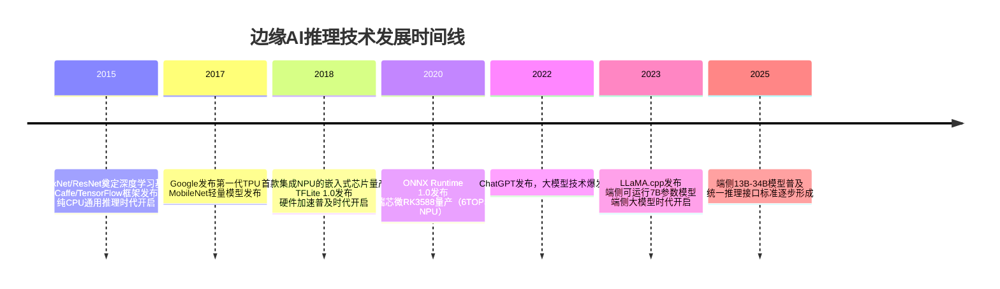
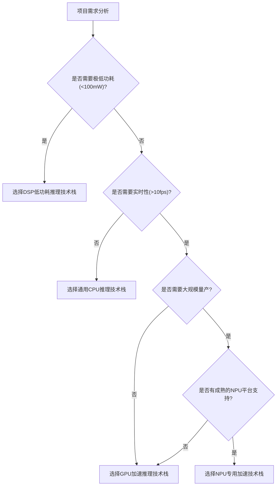

## 技术发展历程
### 小节定位说明
- 难度：B（入门）
- 设计思路：以时间为轴，清晰划分边缘AI推理的三个技术时代，每个时代重点讲解"技术背景-核心特征-代表产品-应用边界-历史局限"，通过前后对比展现技术演进的内在逻辑。增加时间线图直观呈现关键里程碑，帮助建立完整的技术发展认知。

---

边缘AI推理的发展历程，本质上是**硬件算力提升**与**软件生态成熟**相互驱动的过程。过去十年间，技术路线经历了三次重大变革，每一次变革都极大地拓展了边缘AI的应用边界，也重新定义了嵌入式Linux系统的能力上限。

### CPU通用推理时代（2015-2018）
这是边缘AI推理的萌芽阶段，核心特征是**"能用但不好用"**。

2012年AlexNet在ImageNet图像识别比赛中取得突破性成绩，标志着深度学习技术的成熟。2015年ResNet的提出进一步解决了深度模型训练困难的问题，深度学习开始从学术研究走向工业落地。但此时的嵌入式芯片还没有任何专用的AI加速单元，所有AI计算都只能依靠通用CPU完成。

这个时代的技术栈非常简单：
- 模型：以大型CNN模型为主，如VGG16、ResNet50，参数量通常在千万级以上
- 框架：Caffe、TensorFlow早期版本，主要面向服务器端设计，没有针对嵌入式平台优化
- 硬件：通用ARM Cortex-A系列CPU，主频1GHz-1.5GHz

受限于CPU性能，这个时代的边缘AI推理只能实现非常基础的功能：
- 只能运行极小的模型，处理320×240分辨率的图像
- 推理帧率通常在0.1-1fps之间，完全无法满足实时性要求
- 功耗极高，CPU满负载运行时功耗超过5W

> 【历史案例】2017年的树莓派3B+，搭载四核ARM Cortex-A53 CPU，主频1.4GHz。运行ResNet50模型进行图像分类，单张图像推理耗时约2秒，帧率仅0.5fps，只能用于非实时的离线分析场景。

这个时代的历史局限在于：纯CPU计算的能效比极低，无法满足大多数嵌入式场景的实时性和功耗要求，边缘AI只能停留在原型验证阶段，无法大规模商用落地。

### 硬件加速普及时代（2018-2023）
这是边缘AI推理的爆发式增长阶段，核心特征是**"专用硬件成为标配，大规模商用落地"**。

2017年Google发布第一代TPU，证明了专用硬件在AI计算上的巨大优势。随后，各大芯片厂商纷纷推出集成专用NPU的嵌入式芯片，边缘AI推理的性能得到了数量级的提升。与此同时，轻量模型和嵌入式推理框架也快速成熟，形成了完整的技术生态。

这个时代的核心技术突破包括：
1. **硬件层面**：NPU成为嵌入式芯片的标配，算力从0.5TOPS提升到100TOPS以上，能效比提升了100倍
2. **模型层面**：MobileNet、YOLOv3-nano等轻量模型发布，在保证精度的前提下将参数量降低了一个数量级
3. **框架层面**：TFLite、ONNX Runtime等专门针对嵌入式平台优化的推理框架发布，大幅降低了开发门槛

典型的代表产品和技术：
- 芯片：瑞芯微RK3399Pro（2018）、RK3588（2020），地平线旭日3（2021），英伟达Jetson Xavier NX（2020）
- 框架：TFLite 2.0（2019）、ONNX Runtime 1.0（2020）、各芯片厂商的专用SDK（RKNN、TensorRT）
- 模型：MobileNetV2、YOLOv5-nano、EfficientNet-Lite

到2023年，边缘AI推理已经在工业、安防、车载、家居等领域实现了大规模商用：
- 工业视觉质检系统可以实现50ms内的实时缺陷检测
- 安防摄像头可以本地实现人脸识别和行为分析
- 车载ADAS系统可以实现车道保持和自动紧急制动

这个时代的历史局限在于：不同芯片厂商的NPU生态相互隔离，模型转换困难，算子支持不统一，开发者需要为不同平台编写不同的代码，增加了开发和维护成本。

### 端侧大模型时代（2023-至今）
这是边缘AI推理的全新阶段，核心特征是**"从感知到认知，从单任务到多任务"**。

2022年底ChatGPT的发布，标志着大模型技术的成熟。大模型展现出的强大的自然语言理解、逻辑推理和多模态能力，彻底改变了人们对AI的认知。随后，大模型轻量化技术快速突破，使得原本只能在云端运行的大模型，现在可以在嵌入式Linux设备上本地运行。

2023年3月，LLaMA.cpp项目发布，首次实现了在普通CPU上运行7B参数的LLaMA模型，开启了端侧大模型的时代。随后，Qwen.cpp、MLC-LLM等项目相继出现，端侧大模型的推理速度和精度不断提升。

这个时代的核心技术特点：
- 模型规模：从千万级参数提升到十亿级参数，端侧可运行7B-13B甚至34B参数的模型
- 能力边界：从单一的图像识别、语音识别，扩展到自然语言理解、逻辑推理、多模态交互
- 技术路线：量化技术从INT8向INT4/INT2演进，在保证精度的前提下大幅降低模型体积和内存占用

> 【当前技术水平】2025年的主流嵌入式平台，如瑞芯微RK3588，搭载6TOPS NPU，可以实现7B参数INT4量化模型的本地推理，文本生成速度达到15-20token/s，基本满足日常交互需求。

端侧大模型的出现，将边缘AI的应用边界从"感知"拓展到了"认知"和"决策"：
- 智能音箱可以实现自然流畅的多轮对话，理解复杂的指令
- 工业机器人可以自主理解任务要求，规划执行路径
- 车载助手可以实现全场景的语音交互，提供个性化的服务

目前，端侧大模型技术仍处于快速发展阶段，未来几年将继续向更大模型、更快速度、更低功耗的方向演进。

> 核心结论：三个技术时代不是完全替代的关系，而是并存互补的。简单的传感器数据处理仍然可以用CPU，计算机视觉任务用NPU，复杂的交互和决策任务用端侧大模型。开发者需要根据具体的应用场景和需求，选择最合适的技术路线。
{: .conclusion }

---

## 主流技术路线对比
### 小节定位说明
- 难度：I（中级）
- 设计思路：从工程实践角度出发，逐一拆解四大技术路线的核心原理、技术栈组成、优缺点和适用边界，通过多维度对比表格和选型决策树，帮助读者根据项目需求快速做出技术选择。所有分析均基于嵌入式Linux平台的实际落地经验，避免纯理论空谈。

---

边缘AI推理没有"万能"的技术路线，不同技术路线在性能、功耗、开发难度、生态成熟度和成本之间存在不同的权衡。四大主流技术路线不是相互替代的关系，而是互补共存的，分别适用于不同的应用场景和需求。

### 通用CPU推理技术栈
这是最基础、最通用的技术路线，所有嵌入式Linux平台都原生支持，不需要任何专用硬件加速单元。

**核心原理**：利用CPU的通用指令集（ARM NEON、x86 SSE/AVX）来实现神经网络算子的计算，所有计算都在CPU核心上串行或少量并行执行。

**完整技术栈**：
- 模型层：轻量CNN模型（MobileNetV1/V2、YOLOv5-nano）
- 框架层：TFLite、ONNX Runtime CPU版、OpenCV-DNN
- 优化层：NEON指令集优化、多线程并行、算子融合

**核心优势**：
- 通用性极强，代码可以在所有ARM/x86平台上无缝运行
- 开发难度最低，生态最成熟，资料最丰富
- 不需要依赖任何厂商专用SDK，没有供应商锁定风险
- 调试方便，可以使用GDB等通用调试工具

**核心劣势**：
- 性能最低，只能运行极小的模型
- 功耗最高，CPU满负载运行时会产生大量热量
- 无法满足大多数实时性要求高于1fps的场景

**适用场景**：
- 非实时、低复杂度的任务，如离线数据分析、简单传感器数据处理
- 没有专用硬件加速资源的老旧平台
- 需要快速验证算法可行性的原型阶段
- 对跨平台兼容性要求极高的项目

> 【工程参考】基于i.MX6ULL（单核Cortex-A7，800MHz）平台，运行MobileNetV1图像分类模型，单张224×224图像推理耗时约300ms，帧率约3fps，CPU占用率100%，系统功耗约2W。

### GPU加速推理技术栈
GPU最初是为图形渲染设计的通用并行处理器，拥有大量简单的计算核心，非常适合神经网络这种高度并行的计算任务。

**核心原理**：将神经网络中的卷积、矩阵乘法等并行度高的算子卸载到GPU上执行，CPU只负责调度和后处理，充分利用GPU的并行计算能力。

**完整技术栈**：
- 模型层：中等复杂度模型（YOLOv5s、ResNet50）
- 框架层：TensorRT（NVIDIA）、TFLite GPU、ONNX Runtime GPU版
- 驱动层：NVIDIA CUDA驱动、高通Adreno驱动

**核心优势**：
- 性能高，比同功耗CPU快10-20倍
- 生态成熟，算子支持最全面，几乎所有模型都能直接运行
- 开发难度中等，有完善的工具链和文档
- 支持动态图和自定义算子，灵活性高

**核心劣势**：
- 功耗高，比NPU高2-3倍
- 成本高，集成GPU的芯片通常比纯CPU芯片贵很多
- 散热要求高，长时间满负载运行需要良好的散热设计

**适用场景**：
- 复杂模型推理，如语义分割、实例分割
- 多任务并行处理，如同时运行目标检测、人脸识别和行为分析
- 需要快速原型验证的项目
- 对功耗要求不严格的场景，如桌面级边缘盒子

> 【工程参考】基于NVIDIA Jetson Xavier NX（384 CUDA核心，21TOPS INT8）平台，运行YOLOv5s目标检测模型，640×640分辨率推理帧率约50fps，系统功耗约10W。

### NPU专用加速技术栈
这是当前嵌入式边缘AI的主流技术路线，也是性能和功耗平衡最好的选择。

**核心原理**：通过专用硬件电路直接实现神经网络的核心算子（卷积、池化、激活、全连接），不需要通用CPU的指令解码和调度，能效比是CPU的100倍以上。

**完整技术栈**：
- 模型层：中大型模型（YOLOv5m、YOLOv8、Transformer轻量版）
- 转换层：厂商专用模型转换工具（RKNN Toolkit、地平线NNIE工具链）
- 推理层：厂商专用SDK（RKNN API、地平线Hobot SDK）
- 驱动层：厂商提供的NPU内核驱动

**核心优势**：
- 能效比最高，相同算力下功耗仅为GPU的1/3-1/5
- 性能强，主流嵌入式NPU算力可达6-100TOPS INT8
- 性价比高，集成NPU的芯片价格已经非常亲民
- 适合大规模商用量产

**核心劣势**：
- 生态碎片化严重，不同厂商的NPU和SDK完全不兼容
- 算子支持有限，很多自定义算子无法在NPU上运行
- 开发难度高，需要学习厂商专用的工具链和API
- 调试困难，缺乏通用的调试工具

**适用场景**：
- 大规模商用量产项目
- 实时计算机视觉任务，如工业视觉质检、安防智能分析
- 对功耗和成本敏感的嵌入式设备
- 车载ADAS、机器人等高性能低功耗场景

> 【工程参考】基于瑞芯微RK3588（6TOPS INT8 NPU）平台，运行YOLOv5s目标检测模型，640×640分辨率推理帧率约30fps，系统功耗约3W，能效比是Jetson Xavier NX的3倍以上。

### DSP低功耗推理技术栈
DSP是专门为数字信号处理设计的处理器，擅长处理一维信号，如语音、音频、雷达信号等，功耗极低。

**核心原理**：利用DSP的专用指令集（如TI VLIW、高通Hexagon HVX）来加速语音识别、音频处理等一维信号的AI计算。

**完整技术栈**：
- 模型层：极小语音模型（关键词检测、声纹识别）
- 框架层：TFLite Micro、厂商专用DSP推理框架
- 工具链：厂商提供的DSP交叉编译工具链

**核心优势**：
- 功耗极低，通常只有几十毫瓦，甚至几毫瓦
- 适合处理语音、音频、雷达等一维信号
- 可以在设备待机时持续运行，不影响系统功耗

**核心劣势**：
- 算力非常有限，只能运行极小的模型
- 开发难度极高，需要掌握DSP架构和专用指令集
- 生态极差，资料和工具链都非常匮乏
- 不适合处理图像、视频等二维信号

**适用场景**：
- 语音唤醒、关键词检测
- 低功耗音频处理
- 雷达信号处理
- 电池供电的可穿戴设备

> 【工程参考】基于高通Hexagon DSP平台，运行"小爱同学"语音唤醒模型，功耗仅5mW，唤醒准确率99%以上，可以在手机待机时持续运行。

---

### 四大技术路线综合对比
| 技术路线 | 相对性能 | 相对功耗 | 开发难度 | 生态成熟度 | 跨平台性 | 适用场景 |
|----------|----------|----------|----------|------------|----------|----------|
| 通用CPU推理 | ★☆☆☆☆ | ★★★★★ | ★☆☆☆☆ | ★★★★★ | ★★★★★ | 非实时简单任务、原型验证 |
| GPU加速推理 | ★★★★☆ | ★★★☆☆ | ★★☆☆☆ | ★★★★☆ | ★★☆☆☆ | 复杂模型、多任务并行、原型验证 |
| NPU专用加速 | ★★★★★ | ★☆☆☆☆ | ★★★☆☆ | ★★☆☆☆ | ★☆☆☆☆ | 大规模商用、实时计算机视觉 |
| DSP低功耗推理 | ★☆☆☆☆ | ★☆☆☆☆ | ★★★★★ | ★☆☆☆☆ | ★☆☆☆☆ | 语音唤醒、低功耗音频处理 |

---

### 技术路线选型决策树

> 核心结论：对于绝大多数实时计算机视觉商用项目，NPU专用加速是首选；对于需要快速原型验证或复杂模型推理的项目，GPU加速是更好的选择；对于低功耗语音音频任务，DSP是唯一选择；只有在没有硬件加速资源或任务极简单的情况下，才考虑纯CPU推理。
{: .conclusion }

---

## 未来3年技术趋势
### 小节定位说明
- 难度：M（大师）
- 设计思路：基于2025年当前技术现状，聚焦2025-2028年可落地的技术趋势，每个趋势先讲当前行业痛点，再讲核心技术突破方向，最后给出明确的工程落地时间节点和对开发者的影响。所有预判均基于主流芯片厂商、框架社区和行业联盟的公开路线图，避免纯科幻式预测。

---

> ⚠️ 【说明】本小节内容为2025年视角下的技术趋势预判，随着技术快速发展，部分时间节点和技术路线可能会发生调整。建议读者定期关注行业动态，更新技术认知。
{: .warning }

### 端侧大模型轻量化与量化技术
这是未来3年边缘AI领域最核心、最确定的技术趋势，将彻底改变边缘AI的能力边界和应用形态。

**当前痛点**：目前端侧大模型主要集中在7B参数规模，13B及以上模型在大多数嵌入式平台上运行仍然存在内存不足、速度慢、功耗高的问题。同时，量化过程中的精度损失仍然是制约大模型端侧落地的主要瓶颈。

**核心技术突破方向**：
1. **超低位量化技术**：从当前主流的INT4量化向INT2/INT1量化演进，通过改进量化算法和校准方法，将精度损失控制在可接受范围内。预计2026年INT2量化将成为主流，可将7B模型压缩到2GB以内，推理速度提升3倍以上。
2. **结构化剪枝与稀疏化**：通过移除模型中不重要的神经元和权重，在不损失精度的前提下将模型参数量减少50%-70%。结合NPU硬件对稀疏计算的支持，可进一步提升推理速度和能效比。
3. **知识蒸馏与模型压缩**：用云端超大模型（如GPT-4o、Qwen2-72B）作为教师模型，蒸馏出更小、更快的学生模型，同时保留大部分能力。预计2027年可蒸馏出性能接近7B模型的1B参数模型。
4. **专用硬件支持**：新一代嵌入式NPU将原生支持大模型算子（如注意力机制、Transformer块）和低位宽计算，能效比将比当前NPU提升5-10倍。

**2025-2028年落地预期**：
- 2026年：主流嵌入式平台（如RK3588下一代产品）可流畅运行13B参数INT4量化模型，文本生成速度达到30-40token/s
- 2027年：高端嵌入式平台可运行34B参数模型，多模态大模型（支持文本、图像、语音）实现端侧落地
- 2028年：端侧大模型成为嵌入式设备的标配，所有智能设备都将具备自然语言交互和认知能力

**工程影响**：边缘AI将从"感知时代"进入"认知时代"，应用场景从单一的图像识别、语音识别拓展到自然语言交互、智能决策、自主规划等复杂任务。开发者需要掌握大模型推理、微调、提示工程等新技能。

### 自适应推理与算力动态调度
这是解决嵌入式平台资源受限与AI需求不断增长之间矛盾的关键技术，未来将成为所有推理框架的标配功能。

**当前痛点**：目前大多数边缘AI应用都采用固定精度、固定帧率的推理方式，无法适应动态变化的场景和硬件负载。例如，在简单场景下仍然运行高精度大模型，造成资源浪费；而在复杂场景下又因为算力不足导致推理延迟增加。

**核心技术突破方向**：
1. **输入感知自适应推理**：根据输入数据的复杂度自动调整推理精度和模型大小。例如，对于清晰、简单的图像使用INT2量化的小模型，对于模糊、复杂的图像自动切换到INT8量化的大模型。
2. **负载感知动态调度**：实时监控CPU、NPU、内存的负载情况，动态调整推理任务的优先级和资源分配。例如，当系统有其他高优先级任务时，自动降低AI推理的帧率和精度，保证核心功能的正常运行。
3. **功耗感知算力调节**：根据电池电量和功耗预算，动态调整硬件工作频率和推理性能。例如，电池电量低于20%时，自动降低推理帧率，延长设备续航时间。
4. **端云协同推理**：将复杂的推理任务拆分为端侧和云端两部分，简单的部分在端侧处理，复杂的部分上传到云端处理，兼顾低时延和高精度。

**2025-2028年落地预期**：
- 2026年：主流推理框架（TFLite、ONNX Runtime）将原生支持自适应推理功能
- 2027年：端云协同推理成为行业标准，50%以上的边缘AI应用将采用端云混合架构
- 2028年：智能算力调度系统将成为嵌入式Linux系统的核心组件，可实现多任务、多硬件的全局最优资源分配

**工程影响**：开发者不再需要为每个场景手动调优模型和参数，系统将自动根据环境和需求调整到最优状态。同时，端云协同架构将成为主流，开发者需要掌握端云协同开发和部署技术。

### 统一推理接口与硬件抽象标准
这是解决当前NPU生态碎片化问题的唯一途径，也是行业上下游共同的迫切需求。

**当前痛点**：不同芯片厂商的NPU和SDK完全不兼容，开发者需要为每个平台重新进行模型转换、调试和优化，开发和维护成本极高。一个支持3种以上NPU平台的项目，开发周期会增加2-3倍。

**核心技术突破方向**：
1. **模型格式标准化**：ONNX（开放神经网络交换格式）将成为事实上的模型标准，所有主流训练框架和推理框架都将原生支持ONNX格式。模型一次训练，即可部署到所有平台。
2. **统一硬件抽象层**：行业联盟和开源社区将推动建立统一的硬件抽象层（HAL），屏蔽不同NPU平台的底层差异。开发者只需要编写一次代码，即可在所有支持该标准的平台上运行。
3. **算子标准化**：制定统一的神经网络算子标准，明确每个算子的输入输出格式和计算行为。所有NPU厂商都将支持标准算子，解决算子不兼容的问题。
4. **统一性能基准**：MLCommons（机器学习性能基准联盟）的MLPerf Tiny基准将成为衡量边缘AI性能的统一标准，帮助开发者客观对比不同平台的性能和能效比。

**2025-2028年落地预期**：
- 2026年：所有主流芯片厂商都将支持ONNX Runtime的Execution Provider接口，实现一次开发多平台部署
- 2027年：行业统一的硬件抽象标准将正式发布，主流NPU厂商将率先支持
- 2028年：NPU生态碎片化问题将得到根本解决，开发者可以像使用CPU一样使用NPU，不需要关心底层硬件细节

**工程影响**：开发成本将降低70%以上，开发周期将大幅缩短。开发者将从繁琐的平台适配工作中解放出来，专注于算法和应用本身的创新。同时，跨平台的边缘AI应用将成为主流，产品可以快速切换不同的芯片平台，降低供应商锁定风险。

> 核心结论：未来3年，边缘AI将迎来三大变革：大模型带来的能力革命、自适应推理带来的效率革命、统一标准带来的生态革命。这三大变革将共同推动边缘AI进入大规模普及的新阶段，嵌入式Linux系统将成为智能世界的核心基础设施。
{: .conclusion }

---
