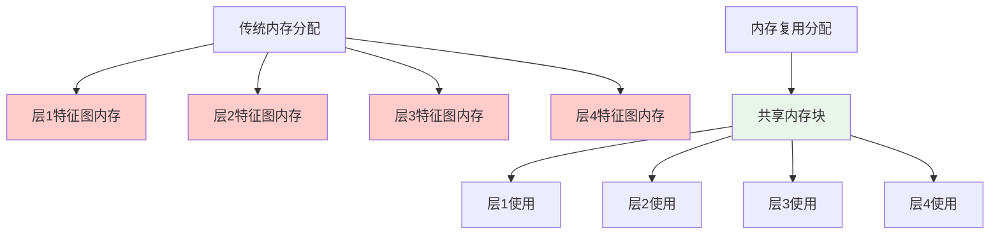
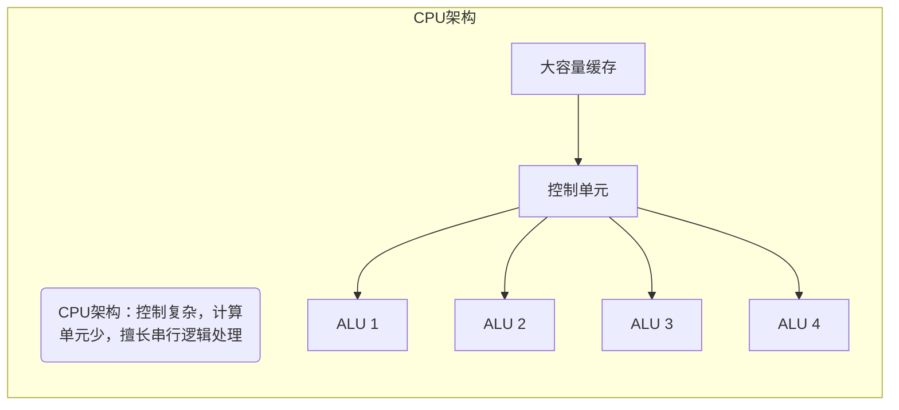
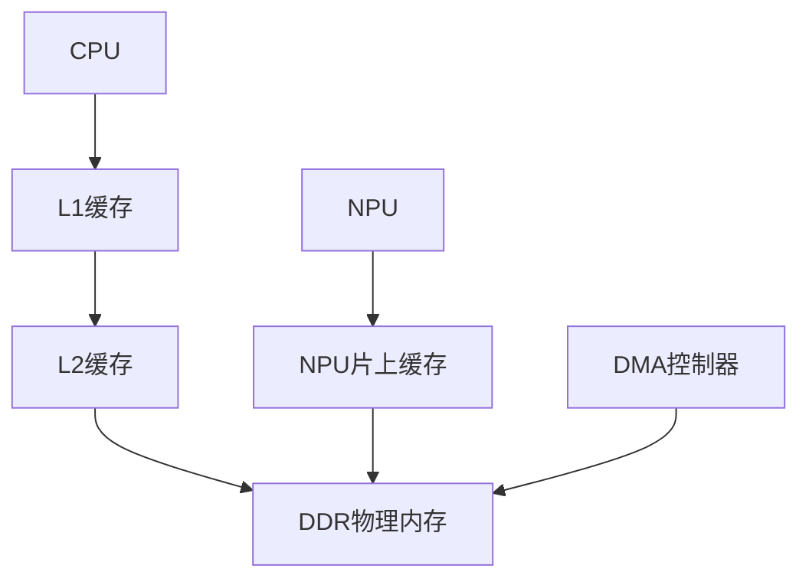
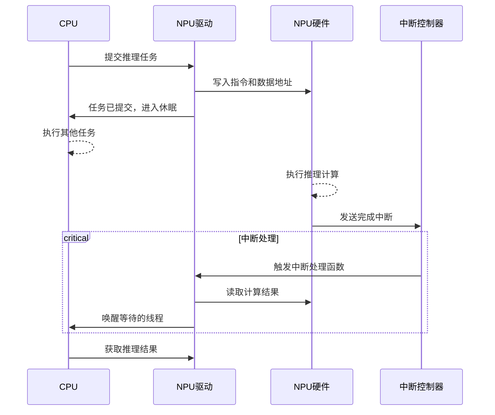

## 推理执行全流程
### 小节定位说明
- 难度：I（中级）
- 设计思路：从"一个完整的推理请求从输入到输出经历了什么"出发，按时间顺序拆解推理全流程的四个核心阶段。每个阶段重点讲解"做什么、为什么这么做、嵌入式场景下有什么特殊问题、常见坑是什么"，增加全流程时序图和性能占比分析，帮助读者建立完整的执行认知，为后续的性能优化和问题排查奠定基础。

---

<span class="red">推理执行全流程</span>是指从应用程序发起推理请求，到得到最终业务结果的完整执行过程。理解这个流程的每一个环节，是进行性能优化、问题排查和工程化落地的前提。很多开发者在遇到推理慢、精度低、崩溃等问题时，往往只关注模型本身，而忽略了流程中其他环节的影响。

一个标准的端到端推理流程分为四个不可缺少的阶段，它们按顺序执行，任何一个环节出现问题都会影响最终的推理结果和性能：


> 【工程数据】在典型的嵌入式计算机视觉应用中，四个阶段的时间占比大致为：模型加载与初始化（首次执行占比90%，后续执行占比0%）、输入预处理（20%-30%）、模型推理计算（50%-70%）、输出后处理（10%-20%）。很多时候，预处理和后处理的总耗时甚至会超过模型推理本身的耗时。

### 模型加载与初始化
这是推理流程的第一个阶段，也是最容易被忽略但对系统启动速度影响最大的阶段。它只在程序启动后第一次执行推理时运行一次，后续推理会复用初始化好的模型实例。

**核心执行步骤**：
1. **模型文件读取**：从存储介质（eMMC、SD卡、Flash）中读取模型文件到内存。不同框架的模型文件格式不同，如TFLite的`.tflite`、ONNX的`.onnx`、RKNN的`.rknn`。
2. **模型解析与验证**：解析模型文件的结构，验证模型的完整性和版本兼容性，提取模型的输入输出信息（维度、数据类型、张量名称）。
3. **计算图优化**：推理框架会对模型的计算图进行一系列优化，包括算子融合、常量折叠、死代码消除、冗余节点移除等，目的是减少计算量和内存访问次数。
4. **算子注册与初始化**：根据模型中的算子类型，注册对应的算子实现（CPU算子或硬件加速算子），并初始化算子所需的资源（如NPU上下文、GPU显存）。
5. **内存分配**：为模型的权重、偏置、输入输出张量、中间特征图分配内存空间。

**嵌入式场景特殊问题**：
- **启动速度慢**：嵌入式设备的存储介质读写速度慢（eMMC顺序读通常只有50-100MB/s），大模型文件加载会占用大量启动时间。例如一个100MB的RKNN模型，加载耗时可能超过1秒。
- **内存不足**：模型加载时需要同时存储原始模型文件和解析后的计算图，内存峰值会比运行时高很多。很多时候程序崩溃不是因为运行时内存不够，而是因为加载时内存不足。
- **版本兼容性**：厂商专用SDK的模型格式通常不向后兼容，用旧版本工具转换的模型在新版本SDK上可能无法加载或运行结果错误。

**常见优化手段**：
- 模型预加载：在程序启动时提前加载模型，而不是在第一次推理时才加载
- 内存映射（mmap）：直接将模型文件映射到内存，避免数据拷贝，同时减少内存占用
- 模型裁剪：移除模型中不需要的算子和节点，减小模型文件体积
- 模型序列化：将优化后的计算图序列化保存，下次启动时直接加载，跳过解析和优化步骤

### 输入数据预处理
这是将原始输入数据转换为模型要求格式的过程。**80%以上的推理精度问题都源于预处理错误**，而不是模型本身的问题。

**核心执行步骤**：
1. **数据格式转换**：将原始数据转换为模型要求的格式。例如，OpenCV读取的图像是BGR格式，而大多数模型要求RGB格式；摄像头输出的是NV12格式，需要转换为RGB格式。
2. **尺寸调整**：将原始数据的尺寸调整为模型要求的输入尺寸。例如，将1920×1080的图像缩放为640×640。
3. **归一化与标准化**：将数据的值域转换为模型要求的范围。例如，将0-255的像素值转换为0-1或-1到1之间的浮点数，或者减去均值除以标准差。
4. **数据类型转换**：将数据转换为模型要求的数据类型，如FP32、FP16、INT8。
5. **维度重排**：将数据的维度顺序转换为模型要求的顺序。例如，将HWC（高度、宽度、通道）格式转换为NCHW（批次、通道、高度、宽度）格式。

**嵌入式场景特殊问题**：
- **预处理耗时高**：纯CPU实现的预处理算法效率很低，尤其是大尺寸图像的缩放和格式转换，耗时可能超过模型推理本身。
- **精度损失**：不同的缩放算法（双线性插值、最近邻插值）会导致不同程度的精度损失，需要根据模型的训练方式选择对应的算法。
- **数据拷贝频繁**：原始数据通常存储在摄像头缓冲区、文件缓冲区等地方，需要多次拷贝才能转换为模型要求的格式，增加了耗时和内存占用。

**常见优化手段**：
- 硬件加速预处理：利用ISP、GPU、NPU的硬件单元完成格式转换、缩放、归一化等操作
- NEON指令优化：用ARM NEON指令集加速CPU上的预处理算法，速度可提升3-5倍
- 零拷贝预处理：直接在原始数据缓冲区上进行预处理，避免不必要的数据拷贝
- 预处理与推理并行：将预处理和推理放在不同的线程中执行，流水线作业

> 【实战避坑】预处理的每一个参数都必须与模型训练时完全一致，包括均值、标准差、缩放比例、插值算法、通道顺序等。任何一个参数的微小差异，都可能导致推理结果完全错误。

### 模型推理计算
这是整个推理流程的核心阶段，也是耗时最长的阶段。它的执行过程由推理框架和硬件加速器共同完成。

**核心执行步骤**：
1. **输入张量拷贝**：将预处理好的输入数据拷贝到模型的输入张量缓冲区。如果是硬件加速推理，还需要将数据从CPU内存拷贝到加速器的专用内存。
2. **计算图执行**：推理框架按照优化后的计算图顺序，依次执行每个算子。对于硬件加速的算子，框架会将算子和数据提交给硬件加速器执行；对于不支持硬件加速的算子，会回退到CPU执行。
3. **硬件调度与执行**：硬件加速器接收到任务后，会进行任务调度和指令生成，然后并行执行计算。计算完成后，通过中断通知CPU。
4. **输出张量拷贝**：将推理结果从模型的输出张量缓冲区拷贝出来。如果是硬件加速推理，还需要将数据从加速器的专用内存拷贝回CPU内存。

**嵌入式场景特殊问题**：
- **算子不支持**：硬件加速器通常只支持常见的标准算子，对于自定义算子或不常见的算子，会回退到CPU执行，导致性能大幅下降。
- **推理耗时波动**：由于系统调度、中断、硬件资源竞争等原因，推理耗时会出现波动。在实时性要求高的场景中，这种波动可能会导致系统不稳定。
- **硬件资源竞争**：如果多个应用同时使用硬件加速器，会导致任务排队，推理耗时增加。

**常见优化手段**：
- 算子替换：将硬件不支持的算子替换为等效的、硬件支持的算子组合
- 异步推理：使用异步推理接口，避免CPU等待硬件执行完成，提高CPU利用率
- 多线程推理：将多个推理任务并行提交给硬件加速器，提高吞吐量
- 硬件资源隔离：将硬件加速器的资源分配给特定的应用，避免资源竞争

### 输出结果后处理
这是将模型的原始输出转换为业务可用结果的过程。不同的AI任务有不同的后处理逻辑，复杂度差异很大。

**典型任务的后处理步骤**：
- **图像分类**：对模型输出的概率分布进行softmax归一化，然后取top-k个概率最高的类别作为结果
- **目标检测**：对模型输出的候选框进行置信度过滤，然后执行<span class="green">NMS（非极大值抑制）</span>去除重复的候选框，最后输出最终的检测框和类别
- **语义分割**：对模型输出的每个像素的类别概率进行argmax操作，得到每个像素的类别，然后生成分割掩码
- **语音识别**：对模型输出的声学特征进行解码，转换为文本

**嵌入式场景特殊问题**：
- **后处理耗时高**：复杂的后处理算法（如NMS）耗时可能很长，尤其是当候选框数量很多时。例如，YOLOv5模型的原始输出有25200个候选框，NMS处理耗时可能超过10ms。
- **阈值设置困难**：置信度阈值和NMS阈值的设置直接影响检测结果的精度和召回率，需要根据具体场景进行调优。
- **内存占用大**：后处理过程中需要存储大量的候选框和中间结果，内存占用较高。

**常见优化手段**：
- 硬件加速后处理：利用NPU或GPU加速NMS等复杂的后处理算法
- 算法优化：使用更高效的后处理算法，如Fast NMS、Soft NMS等
- 提前过滤：在模型输出阶段就过滤掉置信度很低的候选框，减少后处理的计算量
- 内存复用：复用后处理过程中的内存缓冲区，避免频繁的内存分配和释放

---

### 推理全流程时序与性能瓶颈分析

```mermaid
gantt
    title 典型嵌入式推理全流程时序图（单次推理）
    dateFormat X
    axisFormat %s
    section 首次推理
    模型加载与初始化 : 0, 1000
    输入预处理 : 1000, 1020
    模型推理计算 : 1020, 1050
    输出后处理 : 1050, 1060
    section 后续推理
    输入预处理 : 1100, 1120
    模型推理计算 : 1120, 1150
    输出后处理 : 1150, 1160
```


从时序图可以看出，首次推理的大部分时间都花在模型加载与初始化上，而后续推理的时间则主要由预处理、推理和后处理组成。在进行性能优化时，应该按照以下顺序定位瓶颈：
1. 用性能分析工具（如perf、ftrace）测量每个阶段的耗时
2. 优先优化耗时占比最高的阶段
3. 注意首次推理和后续推理的差异，分别进行优化

> <span class="blue">核心结论：推理性能优化是一个系统工程，不能只关注模型推理计算本身。预处理和后处理往往是容易被忽略的性能瓶颈，而模型加载与初始化则是影响系统启动速度的关键因素。只有理解并优化全流程的每一个环节，才能实现最优的推理性能。</span>
{: .conclusion }

---

## 内存管理与零拷贝优化
### 小节定位说明
- 难度：E（高级）
- 内容类型：原理解析+工程优化指导+实战避坑
- 预计密度：高（约2500字）
- 设计思路：从嵌入式系统"内存永远不够用"的核心痛点出发，先建立推理内存生命周期的完整认知，再深入讲解推理框架最核心的内存复用技术，最后拆解零拷贝技术的实现原理和工程落地方法。所有内容均围绕嵌入式Linux平台的实际特性展开，重点讲解通用服务器上不需要考虑但嵌入式场景下致命的内存问题，给出可直接落地的优化方案。

---

<span class="red">内存管理</span>是嵌入式边缘AI推理最核心的技术之一，也是最容易被忽略的性能瓶颈。在嵌入式系统中，内存资源通常比CPU和NPU算力更加稀缺，很多时候推理性能上不去、系统频繁崩溃，根本原因不是算力不足，而是内存管理不当。

一个设计糟糕的推理程序，内存占用可能是优化后程序的3-5倍，推理速度慢2倍以上，还会出现频繁的内存碎片和OOM（内存不足）崩溃。而优秀的内存管理，可以在不损失精度的前提下，将内存占用降低70%以上，同时大幅提升推理速度。

### 推理内存生命周期
理解推理过程中内存的分配、使用和释放规律，是进行内存优化的前提。推理内存不是一次性分配的，而是在不同阶段动态分配和释放的，存在明显的峰值和谷值。


**各阶段内存占用与行为**：
1. **模型加载阶段（内存峰值）**
   - 内存行为：读取模型文件到内存 → 解析模型结构 → 构建计算图 → 分配权重内存
   - 内存峰值：通常是运行时内存的1.5-2倍，因为需要同时存储原始模型文件和解析后的计算图
   - 嵌入式痛点：eMMC读写速度慢，大模型加载时间长；内存峰值过高导致OOM崩溃
   - 典型数据：100MB的RKNN模型，加载时内存峰值约250MB，运行时内存约120MB

2. **推理初始化阶段**
   - 内存行为：分配输入输出张量内存 → 分配中间特征图内存 → 初始化算子上下文
   - 内存特点：一次性分配，后续推理复用，不再动态分配
   - 优化重点：中间特征图内存复用，这是降低运行时内存的最有效手段

3. **单次推理执行阶段**
   - 内存行为：输入数据拷贝 → 中间特征图计算 → 输出结果拷贝
   - 内存特点：内存占用基本稳定，没有大的波动
   - 优化重点：减少数据拷贝次数，实现零拷贝推理

4. **程序退出阶段**
   - 内存行为：释放所有分配的内存
   - 嵌入式痛点：很多推理框架存在内存泄漏，长时间运行后内存占用持续升高

**典型推理程序内存分布**：
| 内存区域 | 占比 | 说明 |
|----------|------|------|
| 模型权重 | 50%-70% | 固定大小，由模型参数量和量化精度决定 |
| 中间特征图 | 20%-40% | 动态变化，可通过内存复用大幅降低 |
| 输入输出张量 | 5%-10% | 固定大小，由输入输出维度决定 |
| 框架运行时开销 | 5%-10% | 框架本身的内存占用 |

> 【实战避坑】很多开发者只关注运行时的内存占用，而忽略了加载阶段的内存峰值。一个运行时只需要100MB内存的程序，加载时可能需要250MB内存，如果系统可用内存只有200MB，就会在加载时崩溃。解决方法是使用内存映射（mmap）加载模型，避免将整个模型文件读入内存。

### 中间特征图内存复用
这是现代推理框架最核心的内存优化技术，没有之一。通过这项技术，可以将中间特征图的内存占用降低90%以上。

**核心原理**：神经网络是分层执行的，每一层的计算只依赖于上一层的输出，不同层的特征图不会同时被使用。因此，我们可以让多个不重叠的层共享同一块内存空间，而不是为每一层都单独分配内存。



**两种主流内存复用策略**：
1. **基于层的内存复用**
   - 原理：为整个网络规划一个统一的内存池，所有层的特征图都从这个内存池中分配
   - 优点：实现简单，内存碎片少
   - 缺点：内存利用率不是最高，需要提前计算最大特征图的大小
   - 代表框架：TFLite、RKNN

2. **基于张量的内存复用**
   - 原理：对计算图进行静态分析，计算每个张量的生命周期，为生命周期不重叠的张量分配同一块内存
   - 优点：内存利用率最高，可将特征图内存降低到理论最小值
   - 缺点：实现复杂，计算图优化时间长
   - 代表框架：ONNX Runtime、TensorRT

**嵌入式场景特殊优化**：
1. **动态内存规划**：根据输入尺寸动态调整特征图内存大小，避免为最大输入尺寸预留过多内存
2. **分层内存释放**：每一层计算完成后，立即释放该层的输入特征图内存，供后续层使用
3. **内存池技术**：使用固定大小的内存池管理所有推理内存，避免频繁的malloc/free操作，减少内存碎片
4. **权重内存复用**：对于量化后的模型，可以将权重和偏置存储在同一块内存中，进一步降低内存占用

> 【工程数据】以YOLOv5s模型为例，不使用内存复用时，中间特征图内存约为200MB；使用基于层的内存复用时，约为50MB；使用基于张量的内存复用时，仅需15MB。内存占用降低了92.5%，而推理速度没有任何损失。

**实战避坑**：内存复用虽然能大幅降低内存占用，但也可能导致一些难以排查的问题：
- 如果两个张量的生命周期分析错误，会导致数据覆盖，推理结果错误
- 硬件加速器通常要求内存地址对齐，如果复用的内存地址不符合要求，会导致硬件访问错误
- 调试时无法直接查看中间特征图的值，因为它们会被后续层覆盖

### 零拷贝技术实现原理
数据拷贝是推理流程中最隐蔽的性能杀手。在一个典型的推理流程中，数据可能会被拷贝4-6次，这些拷贝操作占用了20%-30%的总推理时间。零拷贝技术的核心目标就是消除这些不必要的数据拷贝，同时降低内存占用。

**传统推理数据路径（4次拷贝）**：
```
摄像头缓冲区 → 应用缓冲区 → 预处理缓冲区 → 模型输入缓冲区 → NPU专用内存
```

**零拷贝推理数据路径（0次拷贝）**：
```
摄像头缓冲区 → 直接作为模型输入缓冲区 → NPU直接访问
```

**嵌入式Linux平台四种主流零拷贝技术**：<br>
1. **内存映射（mmap）**<br>
   - 原理：将文件或设备内存直接映射到进程的虚拟地址空间，进程可以直接访问映射后的内存，不需要通过read/write系统调用拷贝数据<br>
   - 适用场景：模型文件加载、大文件读取<br>
   - 优势：实现简单，兼容性好，不需要修改内核<br>
   - 嵌入式应用：使用mmap加载模型文件，可以将加载阶段的内存峰值降低50%以上，同时加快加载速度<br>

2. **共享内存（shm）**<br>
   - 原理：多个进程共享同一块物理内存，数据不需要在进程间拷贝<br>
   - 适用场景：多进程架构的推理系统，如摄像头进程、预处理进程、推理进程分离的系统<br>
   - 优势：进程间数据传输速度最快，几乎没有开销<br>
   - 嵌入式应用：在工业视觉系统中，摄像头进程将图像数据写入共享内存，推理进程直接从共享内存读取数据进行推理<br>

3. **DMA直接访问**<br>
   - 原理：<span class="green">DMA（直接内存访问）</span>控制器可以在不经过CPU的情况下，直接在设备和内存之间传输数据<br>
   - 适用场景：硬件加速器（NPU、GPU、ISP）与内存之间的数据传输<br>
   - 优势：完全不需要CPU参与，数据传输速度最快<br>
   - 嵌入式应用：现代NPU都支持DMA直接访问系统内存，推理框架只需要将输入数据的物理地址传递给NPU，NPU就可以直接读取数据进行计算<br>

4. **硬件缓冲区直接复用**<br>
   - 原理：直接使用硬件设备的输出缓冲区作为模型的输入缓冲区，不需要将数据从设备缓冲区拷贝到应用缓冲区<br>
   - 适用场景：摄像头、视频解码器等硬件设备的输出数据直接用于推理<br>
   - 优势：完全消除了数据拷贝，是最高效的零拷贝方式<br>
   - 嵌入式应用：V4L2摄像头驱动支持DMA缓冲区导出，应用可以直接将导出的缓冲区作为模型的输入，实现从摄像头到NPU的零拷贝推理<br>

**零拷贝技术的核心挑战：Cache一致性**<br>
在使用零拷贝技术时，CPU和硬件加速器同时访问同一块物理内存，会导致Cache一致性问题。CPU访问内存时会将数据缓存到Cache中，而硬件加速器直接访问物理内存，不会更新CPU的Cache。如果CPU修改了Cache中的数据但没有写回内存，或者硬件加速器修改了内存中的数据但没有通知CPU，就会导致数据不一致，推理结果错误。

**解决方法**：<br>
- 在CPU写入数据后，调用`cache_flush`将Cache中的数据写回内存<br>
- 在硬件加速器完成计算后，调用`cache_invalidate`使CPU的Cache失效，强制CPU重新从内存读取数据<br>
- 使用非缓存（non-cacheable）内存，CPU直接访问物理内存，不经过Cache<br>

> 【实战避坑】Cache一致性问题是零拷贝推理中最常见也最难排查的问题，表现为推理结果随机错误、时好时坏。如果你的程序出现这种情况，首先应该检查是否存在Cache一致性问题。

---

### 内存优化综合策略
内存优化是一个系统工程，需要结合生命周期管理、内存复用和零拷贝技术，才能达到最优效果。以下是嵌入式边缘AI推理的通用内存优化流程：<br>
1. 使用mmap加载模型文件，降低加载阶段的内存峰值<br>
2. 启用推理框架的最高级别内存复用选项，降低运行时内存占用<br>
3. 使用内存池管理所有动态内存，避免内存碎片<br>
4. 实现从数据采集到推理的零拷贝数据路径，消除不必要的数据拷贝<br>
5. 定期监控内存使用情况，排查内存泄漏和内存碎片问题<br>

> <span class="blue">核心结论：在嵌入式边缘AI推理中，内存优化的优先级高于算力优化。一个内存优化良好的程序，在低端芯片上的运行效果可能超过一个内存优化糟糕的程序在高端芯片上的运行效果。掌握内存管理和零拷贝技术，是从普通工程师进阶为高级工程师的必备技能。</span>
{: .conclusion }

---

## 模型压缩与量化基础
### 小节定位说明
- 难度：E（高级）
- 设计思路：从嵌入式"大模型跑不动、小模型精度不够"的核心矛盾切入，先建立模型压缩技术的整体认知，再逐一拆解剪枝、蒸馏、量化三大核心技术的原理和适用场景。重点深入讲解工业界最常用的量化技术，明确不同精度的权衡关系，最后给出量化校准数据集的工程化构建方法。所有内容均围绕嵌入式Linux平台的硬件特性展开，避免纯学术理论，突出可落地性。

---

<span class="red">模型压缩</span>是解决嵌入式平台资源受限与AI模型精度需求之间矛盾的核心技术。未经压缩的深度学习模型通常包含数亿个参数，需要数百MB甚至数GB的内存，且只能在高性能服务器上运行。通过模型压缩技术，可以在精度损失可控的前提下，将模型体积缩小10-50倍，推理速度提升5-20倍，使其能够在资源受限的嵌入式设备上流畅运行。

目前工业界主流的模型压缩技术分为三大类：剪枝、蒸馏和量化。这三类技术不是相互替代的关系，而是可以组合使用，达到最优的压缩效果。其中，**量化是嵌入式边缘AI中应用最广泛、效果最显著的压缩技术**，几乎所有商用量产项目都会使用。

### 剪枝、蒸馏、量化核心思想
#### 结构化剪枝
<span class="green">剪枝</span>的核心思想是"移除模型中不重要的部分"。深度学习模型中存在大量冗余的参数和神经元，它们对最终结果的贡献很小，甚至没有贡献。剪枝就是通过一定的评估方法，找出这些冗余的部分并移除，从而减小模型体积和计算量。

剪枝分为结构化剪枝和非结构化剪枝两种：<br>
- **非结构化剪枝**：移除单个不重要的权重参数，压缩率最高，但会导致模型结构变得稀疏。由于大多数嵌入式NPU不支持稀疏计算，非结构化剪枝后的模型在硬件上无法获得加速，因此在嵌入式场景中几乎不使用。<br>
- **结构化剪枝**：移除整个卷积核、通道或层，模型结构保持规整，硬件可以直接加速。这是嵌入式场景中唯一实用的剪枝技术。

**结构化剪枝的基本流程**：<br>
1. 训练一个完整的大模型（基准模型）<br>
2. 评估每个卷积核/通道的重要性（通常使用L1/L2范数）<br>
3. 移除重要性最低的部分卷积核/通道<br>
4. 对剪枝后的小模型进行微调，恢复精度

**嵌入式场景特点**：<br>
- 剪枝通常只能将模型体积和计算量减小30%-50%，压缩率有限<br>
- 剪枝后的模型仍然需要进行量化才能在嵌入式设备上高效运行<br>
- 适合在模型设计阶段使用，通过剪枝得到更适合嵌入式的轻量模型结构

#### 知识蒸馏
<span class="green">知识蒸馏</span>的核心思想是"用大模型教小模型"。将一个参数量大、精度高的模型称为"教师模型"，将一个参数量小、精度低的模型称为"学生模型"。通过训练学生模型来模仿教师模型的输出分布，而不仅仅是模仿标签，从而让小模型获得接近大模型的精度。

**知识蒸馏的基本原理**：<br>
- 教师模型的输出不仅包含硬标签（正确类别），还包含软标签（各个类别的概率分布）<br>
- 软标签包含了教师模型学到的丰富知识，比如不同类别之间的相似性<br>
- 学生模型同时学习硬标签和软标签，能够学到比直接训练更好的特征表示<br>

**嵌入式场景特点**：<br>
- 知识蒸馏可以在不增加模型计算量的前提下，将小模型的精度提升5%-10%<br>
- 非常适合嵌入式场景，因为它不需要改变模型结构，硬件可以直接加速<br>
- 通常与量化结合使用：先用知识蒸馏得到高精度的小模型，再进行量化，进一步减小体积和提升速度

#### 量化
<span class="green">量化</span>的核心思想是"用低精度数值代替高精度数值"。深度学习模型的参数和计算通常使用32位浮点数（FP32）表示，而量化将其转换为16位浮点数（FP16）、8位整数（INT8）甚至4位整数（INT4）表示。

量化是嵌入式边缘AI中最重要的压缩技术，原因在于：<br>
- 压缩率高：INT8量化可以将模型体积减小4倍，内存占用减小4倍<br>
- 加速效果显著：大多数嵌入式NPU原生支持INT8计算，推理速度比FP32快4-8倍<br>
- 精度损失可控：通过合适的校准方法，INT8量化的精度损失可以控制在1%以内<br>
- 硬件支持最好：所有现代嵌入式NPU都优先支持INT8量化

**量化的基本数学原理**：
量化就是将浮点数的取值范围线性映射到整数的取值范围，公式如下：
```
量化值 = 浮点数 / 缩放因子 + 零点
浮点数 = (量化值 - 零点) * 缩放因子
```
其中，缩放因子和零点是量化过程中计算得到的两个参数，用于在浮点数和整数之间进行转换。

量化分为对称量化和非对称量化两种：<br>
- **对称量化**：零点为0，浮点数的正负范围对称映射到整数范围。实现简单，计算速度快，但精度损失略大。<br>
- **非对称量化**：零点不为0，浮点数的范围可以不对称映射。精度更高，但计算略复杂。

### INT8/FP16/FP32精度权衡
不同精度的数值在内存占用、计算速度和精度之间存在不同的权衡。在嵌入式场景中，选择合适的精度是非常重要的决策。

| 精度类型 | 单参数内存占用 | 相对计算速度 | 典型精度损失 | 硬件支持情况 | 适用场景 |
|----------|----------------|--------------|--------------|--------------|----------|
| FP32 | 4字节 | 1x | 0% | 所有CPU/GPU | 模型训练、高精度要求极高的场景 |
| FP16 | 2字节 | 2x | <0.5% | 大多数GPU/NPU | 对精度要求高、算力充足的场景 |
| INT8 | 1字节 | 4-8x | <1% | 所有现代NPU | 绝大多数嵌入式商用场景 |
| INT4 | 0.5字节 | 8-16x | 1%-3% | 部分新一代NPU | 大模型推理、资源极度受限的场景 |

**各精度详细分析**：<br>
1. **FP32（单精度浮点数）**<br>
   - 这是模型训练的标准精度，精度最高，没有任何损失<br>
   - 在嵌入式CPU上运行速度极慢，在NPU上通常不被支持或支持很差<br>
   - 嵌入式场景中仅用于模型验证和精度对比，不用于量产部署<br>

2. **FP16（半精度浮点数）**<br>
   - 精度损失极小，几乎可以忽略不计<br>
   - 内存占用和计算速度是FP32的2倍<br>
   - 大多数中高端NPU支持FP16计算<br>
   - 适合对精度要求极高、且NPU算力充足的场景，如医疗影像分析、高精度工业检测<br>

3. **INT8（8位整数）**<br>
   - 这是嵌入式边缘AI的**标准精度**，90%以上的商用量产项目都使用INT8量化<br>
   - 内存占用是FP32的1/4，计算速度是FP32的4-8倍<br>
   - 通过合适的校准方法，精度损失可以控制在1%以内，完全满足绝大多数场景的需求<br>
   - 所有现代嵌入式NPU都原生支持INT8计算，且是性能最优的精度<br>

4. **INT4（4位整数）**<br>
   - 这是近年来快速发展的技术，主要用于端侧大模型推理<br>
   - 内存占用是FP32的1/8，计算速度是FP32的8-16倍<br>
   - 精度损失比INT8大，通常在1%-3%之间<br>
   - 只有部分新一代NPU（如RK3588、地平线旭日5）支持INT4计算<br>
   - 适合大模型推理、资源极度受限的电池供电设备<br>

> 【核心结论】对于绝大多数嵌入式计算机视觉商用项目，INT8量化是精度、性能和成本的最佳平衡点。除非有特殊的高精度要求，否则都应该优先选择INT8量化。

**量化误差的主要来源**：<br>
1. **截断误差**：将高精度浮点数转换为低精度整数时，小数部分被截断导致的误差<br>
2. **范围误差**：浮点数的实际取值范围超出了量化范围，导致极值被截断<br>
3. **累积误差**：多层网络的量化误差逐层累积，最终导致较大的精度损失<br>

通过使用高质量的校准数据集和先进的校准算法，可以有效减小这些误差，将量化精度损失控制在可接受范围内。

### 量化校准数据集构建
<span class="green">量化校准</span>是指使用少量代表性数据，统计模型中每个张量的取值范围，计算出最优的缩放因子和零点的过程。**量化精度的80%取决于校准数据集的质量**，一个不好的校准数据集可能导致量化后的模型精度下降10%以上，而一个好的校准数据集可以将精度损失控制在1%以内。

#### 校准数据集的核心要求<br>
1. **分布一致性**：校准数据集的分布必须与实际生产环境中的数据分布完全一致。这是最重要的要求，也是最容易被忽略的要求。<br>
   - 错误示例：用实验室采集的干净数据作为校准集，而实际生产环境中的数据存在光照变化、角度变化、噪声等<br>
   - 正确示例：从实际生产环境中采集数据作为校准集<br>

2. **覆盖全面性**：校准数据集必须覆盖所有可能的输入场景和类别。<br>
   - 对于分类任务，每个类别至少要有10-20张样本<br>
   - 对于检测任务，每个目标类别至少要有50-100个标注样本<br>
   - 必须包含各种光照、角度、距离、背景的样本<br>

3. **规模适中**：校准数据集不需要太大，太大的校准集只会增加校准时间，不会显著提升精度。<br>
   - 分类任务：100-500张样本<br>
   - 检测任务：500-2000张样本<br>
   - 大模型量化：1000-5000条样本

#### 校准数据集的构建流程<br>
1. **数据采集**：从实际生产环境中采集原始数据，确保数据分布与生产环境一致<br>
2. **数据清洗**：去除模糊、过曝、过暗、无目标的无效数据<br>
3. **数据标注**：对数据进行标注，标注要求与模型训练时的标注要求一致<br>
4. **数据划分**：从标注好的数据中随机抽取10%-20%作为校准集，其余作为测试集<br>
5. **数据增强**：对校准集进行适当的数据增强（如随机裁剪、翻转、亮度调整），增加数据多样性<br>

#### 常见校准错误与避坑<br>
1. **使用训练集作为校准集**：训练集的数据分布通常与实际生产环境有差异，会导致量化后的模型在生产环境中精度下降严重<br>
2. **校准集规模太小**：校准集样本数少于100张时，统计得到的张量取值范围不准确，会导致较大的精度损失<br>
3. **校准集类别不平衡**：某些类别的样本过多，而另一些类别的样本过少，会导致样本少的类别精度下降严重<br>
4. **校准参数设置错误**：不同的量化工具支持不同的校准算法（如KL散度、L2范数、最小最大值），需要根据模型类型选择合适的算法

> 【实战经验】KL散度校准是目前效果最好的校准算法，适用于绝大多数计算机视觉模型。最小最大值校准速度最快，但精度损失较大，仅适用于对精度要求不高的场景。

---

### 模型压缩技术组合策略<br>
在实际项目中，通常会组合使用多种压缩技术，以达到最优的效果。以下是嵌入式边缘AI的通用压缩流程：<br>
1. 训练一个高精度的大模型（教师模型）<br>
2. 使用知识蒸馏训练一个小模型（学生模型），获得接近大模型的精度<br>
3. 对学生模型进行结构化剪枝，进一步减小模型体积和计算量<br>
4. 对剪枝后的模型进行INT8量化，获得4倍的体积缩小和速度提升<br>
5. 使用生产环境数据进行精度验证和调优<br>

> <span class="blue">核心结论：模型压缩不是一次性的工作，而是一个迭代优化的过程。需要在精度、速度和内存之间不断权衡，找到最适合项目需求的平衡点。掌握量化技术，尤其是量化校准数据集的构建方法，是嵌入式AI工程师的核心竞争力之一。</span>
{: .conclusion }

---

## 硬件加速底层原理 **[M]**
### 小节定位说明
- 难度：M（大师）
- 设计思路：从"为什么NPU比CPU快100倍"这个本质问题切入，先建立通用处理器与专用加速器的架构差异认知，再逐层拆解NPU算子映射的完整流程、CPU与加速器的内存一致性协议、中断驱动的任务调度机制。所有内容深入到硬件寄存器和驱动交互层面，解释上层API背后的底层行为，帮助读者解决那些"查不到文档、厂商不公开"的硬核问题。
- 重复规避：前面章节已讲过硬件加速的优势和适用场景，本节完全聚焦底层实现原理，不重复应用层面内容。

---

> ⚠️ 【说明】本小节内容涉及芯片内部架构和驱动底层实现，不同厂商的NPU在具体细节上存在差异，但核心原理是通用的。理解这些原理，能够帮助你快速定位任何平台上的硬件加速问题。
{: .warning }

硬件加速的本质，是**用专用硬件电路替代通用CPU的软件模拟**。通用CPU为了兼顾各种计算任务，设计了复杂的控制逻辑和缓存系统，而AI加速器只需要处理神经网络这一类特定的计算任务，可以将所有晶体管都用于计算，从而获得数量级的能效比提升。

### NPU算子映射与指令生成
这是硬件加速最核心的环节，也是不同厂商NPU性能差异的主要来源。算子映射的过程，就是将深度学习模型中的高层算子（如卷积、池化），转换为NPU硬件能够直接执行的底层指令序列。

#### 通用CPU与NPU的架构本质差异


通用CPU的设计哲学是"通用"，它通过复杂的控制逻辑和分支预测，能够高效执行各种不同的指令序列。但神经网络计算的特点是**高度并行、结构固定、没有分支**，CPU的复杂控制逻辑在这种场景下完全是浪费。

NPU的设计哲学是"专用"，它去掉了CPU中复杂的控制逻辑和分支预测单元，将节省下来的晶体管全部用于构建大规模的计算阵列和片上缓存。一个典型的6TOPS NPU，内部集成了超过1000个算术逻辑单元（ALU），而一个8核CPU只有8个ALU。这就是NPU比CPU快100倍的根本原因。

#### 算子映射的完整流程
模型转换工具（如RKNN Toolkit、TensorRT）的核心工作，就是完成从高层算子到底层硬件指令的映射。这个过程分为四个阶段：

1. **计算图优化**
   - 首先对原始模型的计算图进行通用优化，包括算子融合、常量折叠、死代码消除等
   - 然后进行硬件特定的优化，将标准算子拆分为NPU支持的子算子组合
   - 例如，将一个包含卷积+批归一化+激活的复合算子，融合为一个单一的"卷积融合算子"，减少内存访问次数

2. **算子匹配与拆分**
   - 遍历优化后的计算图，将每个算子与NPU硬件支持的指令集进行匹配
   - 如果算子完全匹配，直接映射为对应的硬件指令
   - 如果算子不匹配，将其拆分为多个NPU支持的基础算子的组合
   - 如果无法拆分，则标记为CPU回退算子，在推理时由CPU执行

3. **指令生成**
   - 为每个匹配成功的算子生成对应的NPU机器指令
   - 指令包括：操作码、输入输出内存地址、计算参数（如卷积核大小、步长、填充）
   - 生成指令调度表，指定指令的执行顺序和依赖关系

4. **指令打包与序列化**
   - 将所有指令和模型权重打包为一个二进制文件（如.rknn、.trt）
   - 这个二进制文件就是最终部署到嵌入式设备上的模型文件
   - 推理时，NPU驱动直接加载这个二进制文件，不需要再进行解析和优化

> 【底层揭秘】为什么不同厂商的模型不能通用？因为每个厂商的NPU指令集都是私有的，模型文件中包含的是该厂商NPU的专用机器指令，无法在其他厂商的NPU上运行。这就是NPU生态碎片化的根本原因。

#### 算子不支持的本质原因
很多开发者都会遇到"算子不支持"的问题，其本质原因是NPU的硬件电路只实现了最常用的神经网络算子。对于不常用的算子，厂商没有为其设计专门的硬件电路，因此无法硬件加速。

常见的算子不支持场景：
- 自定义算子：用户自己实现的特殊算子，厂商没有对应的硬件支持
- 新算子：最新提出的算子，厂商的NPU还没有来得及支持
- 特殊参数的算子：如非标准步长、非对称填充的卷积算子

解决方法：
- 算子替换：用NPU支持的算子组合等效实现不支持的算子
- 算子拆分：将复杂算子拆分为多个简单算子的组合
- CPU回退：将不支持的算子放在CPU上执行，其余算子在NPU上执行

### CPU与加速器内存一致性
这是硬件加速中最容易出现"玄学问题"的地方，90%以上的随机精度错误、推理崩溃、硬件卡死问题，本质上都是内存一致性问题。

#### 嵌入式系统的内存架构
在嵌入式Linux系统中，CPU和NPU共享同一块物理内存，但它们有各自独立的缓存系统：


CPU访问内存时，会先将数据缓存到L1/L2缓存中，后续访问直接从缓存读取，不需要访问DDR。而NPU和DMA控制器直接访问DDR物理内存，不经过CPU的缓存系统。这就导致了一个严重的问题：**CPU和NPU看到的同一块内存地址的数据可能不一致**。

#### 内存一致性问题的典型表现
- 推理结果随机错误，时好时坏
- 相同的输入，每次推理得到的结果都不一样
- 推理结果偶尔出现大量噪点或完全错误
- NPU偶尔卡死，需要重启系统才能恢复

这些问题的根本原因是：
1. CPU修改了数据，但只写到了缓存中，没有写回DDR，NPU读取的是DDR中的旧数据
2. NPU修改了DDR中的数据，但CPU的缓存中还是旧数据，CPU读取的是缓存中的旧数据

#### 内存一致性的解决方法
为了解决这个问题，需要在CPU和NPU之间进行显式的缓存同步操作：

1. **CPU写数据到NPU之前**
   - CPU将数据写入内存
   - 调用`cache_flush`操作，将CPU缓存中的数据写回DDR
   - 然后再将内存地址交给NPU进行计算

2. **NPU计算完成返回结果给CPU之前**
   - NPU将计算结果写入DDR
   - 调用`cache_invalidate`操作，使CPU缓存中的对应数据失效
   - 然后CPU再从DDR中读取计算结果

```c
// 简化的缓存同步代码示例（RKNN驱动底层实现）
void cpu_to_npu_sync(void *addr, size_t size) {
    // 将CPU缓存中的数据写回DDR
    dcache_flush_range((unsigned long)addr, (unsigned long)addr + size);
}

void npu_to_cpu_sync(void *addr, size_t size) {
    // 使CPU缓存中的数据失效，强制从DDR重新读取
    dcache_invalidate_range((unsigned long)addr, (unsigned long)addr + size);
}
```

3. **使用非缓存内存**
   - 另一种方法是使用非缓存（non-cacheable）内存，CPU直接访问DDR，不经过缓存
   - 优点：不需要进行缓存同步操作，不会出现一致性问题
   - 缺点：CPU访问速度慢，性能下降明显
   - 适用场景：小数据量的传输，或者对性能要求不高的场景

> 【实战避坑】大多数推理框架已经在底层自动处理了缓存同步问题，但如果你自己实现了零拷贝数据路径，或者直接操作硬件缓冲区，就必须手动处理缓存同步。否则一定会出现随机的精度错误。

### 中断驱动的任务调度机制
NPU是一个独立的硬件外设，它和CPU并行工作。中断驱动的任务调度是实现CPU和NPU高效协作的核心机制。

#### 轮询方式的缺点
早期的硬件加速采用轮询方式：CPU提交任务给NPU后，不断查询NPU的状态寄存器，直到任务完成。这种方式的缺点非常明显：
- CPU占用率100%，无法执行其他任务
- 浪费CPU资源和功耗
- 无法同时处理多个任务

#### 中断驱动的工作原理
现代NPU都采用中断驱动的任务调度方式：


完整的中断驱动任务执行流程：
1. 应用程序调用推理API，向NPU驱动提交推理任务
2. NPU驱动将任务的指令地址和数据地址写入NPU的寄存器
3. NPU驱动将当前线程挂起，CPU开始执行其他任务
4. NPU硬件独立执行推理计算，不需要CPU参与
5. NPU完成计算后，向中断控制器发送一个硬件中断
6. 中断控制器触发CPU的中断处理函数，NPU驱动在中断处理函数中读取计算结果
7. NPU驱动唤醒挂起的应用线程，返回推理结果

这种方式的优点：
- CPU占用率几乎为0，在NPU执行推理的同时可以执行其他任务
- 功耗低，CPU大部分时间处于休眠状态
- 支持多任务并发调度

#### 多任务并发调度
现代NPU都支持多任务并发调度，可以同时处理多个推理任务。NPU驱动内部维护一个任务队列，按照优先级顺序执行任务：
- 高优先级任务可以抢占低优先级任务的执行
- 相同优先级的任务按照先进先出的顺序执行
- 驱动负责任务的上下文切换，保存和恢复NPU的状态

多任务并发调度的核心挑战是任务隔离：一个任务的错误不能影响其他任务的执行。NPU驱动通过内存管理单元（MMU）实现任务之间的内存隔离，每个任务只能访问自己的内存空间，防止非法访问导致的系统崩溃。

> 【底层揭秘】为什么有时候多个推理任务同时运行时，每个任务的推理速度都会变慢？因为NPU的计算资源是有限的，多个任务会共享计算资源。NPU通常采用时间分片的方式调度任务，每个任务分配一个时间片，轮流执行。

---

### 硬件加速问题排查的底层思路
理解了以上原理，你就可以建立一套系统的硬件加速问题排查思路：
1. **推理结果错误**：首先检查内存一致性问题，确认缓存同步是否正确；然后检查算子映射是否正确，是否有CPU回退算子
2. **推理速度慢**：检查是否有大量CPU回退算子；检查内存带宽是否成为瓶颈；检查任务调度是否合理
3. **NPU卡死**：检查是否有非法的内存访问；检查指令序列是否正确；检查硬件是否存在过热问题
4. **多任务冲突**：检查任务优先级设置是否合理；检查内存隔离是否生效；检查驱动版本是否存在已知bug

> <span class="blue">核心结论：硬件加速不是"黑魔法"，它本质上是一个专用的硬件计算器，按照预先编写好的指令序列执行计算。所有的硬件加速问题，最终都可以归结为"指令错误"、"数据错误"或"调度错误"三类。掌握底层原理，你就能够穿透厂商SDK的黑盒，从根本上解决问题。</span>
{: .conclusion }

---

