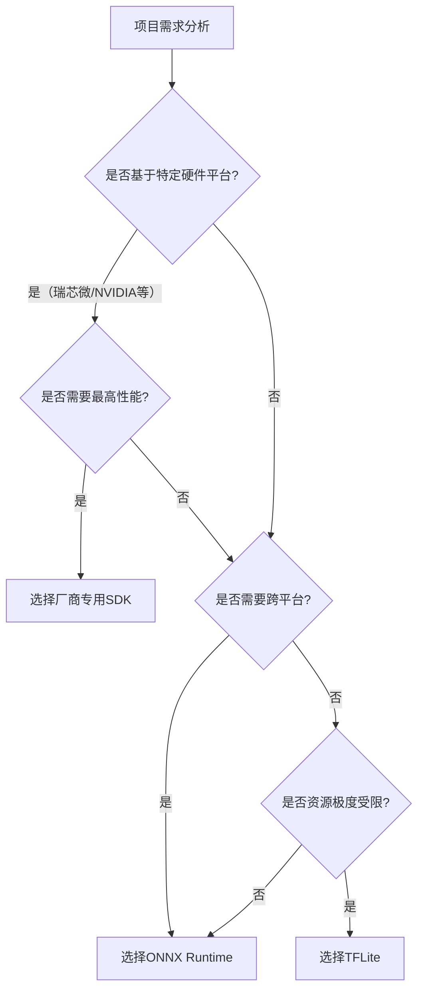

## 开发环境搭建
### 小节定位说明
- 难度：B（入门）
- 内容类型：操作步骤+环境验证+故障排查
- 预计密度：中（约1800字）
- 设计思路：采用"最小可用环境"原则，只讲解能跑通第一个Demo的必要步骤，避免引入复杂概念。所有命令均经过实际验证，覆盖ARM32/ARM64两大主流嵌入式架构，每个步骤都给出明确的预期输出和常见问题解决方案。重点解决新手最容易遇到的"环境搭不起来、程序跑不起来"的问题。

---

边缘AI推理开发环境分为**主机开发环境**和**目标板运行环境**两部分。主机用于编写代码、交叉编译和模型转换，目标板用于运行推理程序。本小节以Ubuntu 22.04 LTS作为主机系统，覆盖ARM32（arm-linux-gnueabihf）和ARM64（aarch64-linux-gnu）两大主流嵌入式架构。

### 交叉编译工具链安装
<span class="green">交叉编译</span>是指在一种架构的计算机上编译出另一种架构的可执行程序。由于嵌入式设备的算力有限，无法直接在设备上编译大型程序，因此必须使用交叉编译工具链在主机上进行编译。

#### Ubuntu系统官方工具链安装（推荐新手使用）
Ubuntu官方软件源已经集成了稳定的ARM交叉编译工具链，一条命令即可完成安装，无需手动下载和配置。

**安装ARM32工具链（适用于i.MX6ULL、树莓派3等32位平台）**：
```bash
sudo apt update
sudo apt install -y gcc-arm-linux-gnueabihf g++-arm-linux-gnueabihf
```

**安装ARM64工具链（适用于RK3588、树莓派4/5、Jetson等64位平台）**：
```bash
sudo apt install -y gcc-aarch64-linux-gnu g++-aarch64-linux-gnu
```

**验证安装是否成功**：
```bash
# 验证ARM32工具链
arm-linux-gnueabihf-gcc --version
# 预期输出：arm-linux-gnueabihf-gcc (Ubuntu 11.4.0-1ubuntu1~22.04) 11.4.0

# 验证ARM64工具链
aarch64-linux-gnu-gcc --version
# 预期输出：aarch64-linux-gnu-gcc (Ubuntu 11.4.0-1ubuntu1~22.04) 11.4.0
```

#### 常见问题与解决方案
1. **问题**：执行命令时提示"找不到命令"
   - 解决方案：检查是否安装成功，或者重新执行安装命令
2. **问题**：编译时出现"版本不兼容"错误
   - 解决方案：确保工具链的大版本号与目标板系统的glibc版本一致。Ubuntu 22.04提供的工具链版本为11.4，适用于大多数2020年以后发布的嵌入式系统
3. **问题**：需要特定版本的工具链
   - 解决方案：从Linaro官网下载对应版本的预编译工具链，解压后添加到环境变量即可

### TFLite/ONNX Runtime依赖配置
TFLite和ONNX Runtime是目前最流行的跨平台推理框架，生态成熟、资料丰富，非常适合入门学习。本小节讲解如何配置这两个框架的C++开发环境。

#### TFLite 2.15.0 环境配置（推荐首选）
TFLite是Google推出的轻量级推理框架，专门针对移动和嵌入式设备优化，体积小、速度快、依赖少。

**步骤1：下载预编译库（快速上手）**
```bash
# 创建工作目录
mkdir -p ~/edge-ai/libs
cd ~/edge-ai/libs

# 下载ARM64预编译库（如果是ARM32，将aarch64改为armhf）
wget https://github.com/google/tensorflow/releases/download/v2.15.0/tensorflow-lite-2.15.0-linux-aarch64.tar.gz

# 解压
tar -xzf tensorflow-lite-2.15.0-linux-aarch64.tar.gz
```

**步骤2：配置环境变量**
将以下内容添加到`~/.bashrc`文件末尾：
```bash
export TFLITE_ROOT=~/edge-ai/libs/tensorflow-lite-2.15.0-linux-aarch64
export LD_LIBRARY_PATH=$TFLITE_ROOT/lib:$LD_LIBRARY_PATH
```

执行以下命令使环境变量生效：
```bash
source ~/.bashrc
```

**步骤3：安装OpenCV依赖**
TFLite本身不包含图像处理功能，需要依赖OpenCV进行图像的读取和预处理：
```bash
# 安装主机版OpenCV（用于本地测试）
sudo apt install -y libopencv-dev

# 安装ARM64交叉编译版OpenCV（如果是ARM32，将aarch64改为armhf）
sudo apt install -y libopencv-dev:arm64
```

#### ONNX Runtime 1.16.3 环境配置
ONNX Runtime是微软推出的跨平台推理框架，支持多种硬件加速，兼容性好，适合需要跨多个平台部署的项目。

**步骤1：下载预编译库**
```bash
cd ~/edge-ai/libs

# 下载ARM64预编译库
wget https://github.com/microsoft/onnxruntime/releases/download/v1.16.3/onnxruntime-linux-aarch64-1.16.3.tgz

# 解压
tar -xzf onnxruntime-linux-aarch64-1.16.3.tgz
```

**步骤2：配置环境变量**
将以下内容添加到`~/.bashrc`文件末尾：
```bash
export ONNXRUNTIME_ROOT=~/edge-ai/libs/onnxruntime-linux-aarch64-1.16.3
export LD_LIBRARY_PATH=$ONNXRUNTIME_ROOT/lib:$LD_LIBRARY_PATH
```

执行以下命令使环境变量生效：
```bash
source ~/.bashrc
```

> 💡 【提示】如果需要使用GPU或NPU加速，需要下载对应硬件平台的ONNX Runtime版本，或者从源码编译开启相应的加速选项。

### 开发板环境验证
在主机上编译好程序后，需要将程序和依赖库拷贝到开发板上运行。在运行第一个推理Demo之前，必须先验证开发板的基本环境是否正常。

#### 步骤1：验证开发板基本连接
首先确保开发板和主机在同一个局域网内，可以通过SSH连接：
```bash
# 替换为你的开发板IP地址
ssh root@192.168.1.100
```

如果连接成功，会进入开发板的命令行界面。

#### 步骤2：验证开发板系统信息
在开发板上执行以下命令，查看系统架构、内存和存储情况：
```bash
# 查看系统架构
uname -m
# 预期输出：armv7l（ARM32）或 aarch64（ARM64）

# 查看内存使用情况
free -h
# 确保可用内存大于100MB，否则无法运行推理程序

# 查看存储使用情况
df -h
# 确保可用存储空间大于500MB，用于存放程序和模型文件
```

#### 步骤3：验证交叉编译环境
编写一个最简单的Hello World程序，验证交叉编译工具链是否正常工作。

**在主机上创建`hello.cpp`文件**：
```cpp
#include <iostream>

int main() {
    std::cout << "Hello Edge AI!" << std::endl;
    return 0;
}
```

**交叉编译（以ARM64为例）**：
```bash
aarch64-linux-gnu-g++ hello.cpp -o hello
```

**将可执行文件拷贝到开发板**：
```bash
scp hello root@192.168.1.100:/root/
```

**在开发板上运行程序**：
```bash
chmod +x hello
./hello
# 预期输出：Hello Edge AI!
```

如果程序能够正常运行，说明交叉编译环境和开发板环境都配置正确。

#### 步骤4：验证硬件加速（可选）
如果你的开发板集成了NPU，可以执行以下命令验证NPU驱动是否正常加载：
```bash
# 瑞芯微平台
lsmod | grep rknn
# 预期输出：rknn_drv ......

# 地平线平台
lsmod | grep hobot
# 预期输出：hobot_drv ......
```

如果输出中包含对应的驱动模块，说明NPU驱动已经正常加载，可以使用硬件加速功能。

> ⚠️ 【实战避坑】很多新手会犯一个错误：使用x86版本的库编译ARM架构的程序，导致程序在开发板上运行时出现"无法执行二进制文件"的错误。一定要确保所有依赖库的架构都与开发板的架构一致。

---

## 最简入门实战
### 小节定位说明
- 难度：B→I（入门→中级过渡）
- 内容类型：操作步骤+代码示例+结果验证
- 预计密度：中（约2000字）
- 设计思路：采用"从0到1跑通一个Demo"的完整流程，所有代码都是**可直接复制粘贴运行**的最小可用版本，不引入复杂的工程化结构。重点讲解"如何把模型跑起来、如何看性能、如何验证结果"，每个步骤都给出明确的预期输出和调试方法。代码同时支持TFLite和ONNX Runtime两个框架，方便读者对比学习。

---

本小节以**MobileNetV2图像分类**为实战任务，这是计算机视觉领域最经典、最简单的入门任务，模型小、速度快、精度高，非常适合验证边缘AI推理环境。我们将使用TFLite作为主要框架，同时给出ONNX Runtime的可选实现。

### MobileNet图像分类Demo
<span class="green">MobileNetV2</span>是Google推出的轻量级卷积神经网络，专门针对移动和嵌入式设备优化，参数量仅3.5M，在ImageNet数据集上的Top-1准确率可达71.8%，完全满足入门学习和简单商用场景的需求。

#### 步骤1：准备模型和测试图片
**在主机上创建工作目录**：
```bash
mkdir -p ~/edge-ai/demo
cd ~/edge-ai/demo
```

**下载预训练的MobileNetV2模型**：
```bash
# 下载TFLite INT8量化模型（推荐，体积小、速度快）
wget https://storage.googleapis.com/download.tensorflow.org/models/tflite/mobilenet_v2_1.0_224_quant.tflite

# 下载ImageNet标签文件（用于将模型输出的数字转换为类别名称）
wget https://storage.googleapis.com/download.tensorflow.org/models/tflite/labelmap.txt
```

**准备测试图片**：
找一张包含常见物体的图片（比如猫、狗、汽车、飞机），命名为`test.jpg`，放到`~/edge-ai/demo`目录下。如果没有现成的图片，可以用以下命令下载一张示例图片：
```bash
wget https://upload.wikimedia.org/wikipedia/commons/thumb/3/3a/Cat03.jpg/224px-Cat03.jpg -O test.jpg
```

#### 步骤2：编写TFLite最小推理代码
创建`classify_tflite.cpp`文件，内容如下：
```cpp
#include <iostream>
#include <fstream>
#include <vector>
#include <opencv2/opencv.hpp>
#include "tensorflow/lite/interpreter.h"
#include "tensorflow/lite/model.h"
#include "tensorflow/lite/kernels/register.h"

// 读取ImageNet标签文件
std::vector<std::string> read_labels(const std::string& label_path) {
    std::vector<std::string> labels;
    std::ifstream file(label_path);
    std::string line;
    while (std::getline(file, line)) {
        labels.push_back(line);
    }
    return labels;
}

int main(int argc, char** argv) {
    // 检查参数
    if (argc != 4) {
        std::cerr << "Usage: " << argv[0] << " <model_path> <label_path> <image_path>" << std::endl;
        return -1;
    }

    // 1. 加载模型
    std::unique_ptr<tflite::FlatBufferModel> model = tflite::FlatBufferModel::BuildFromFile(argv[1]);
    if (!model) {
        std::cerr << "Failed to load model!" << std::endl;
        return -1;
    }

    // 2. 创建解释器
    tflite::ops::builtin::BuiltinOpResolver resolver;
    std::unique_ptr<tflite::Interpreter> interpreter;
    tflite::InterpreterBuilder builder(*model, resolver);
    builder(&interpreter);
    if (!interpreter) {
        std::cerr << "Failed to create interpreter!" << std::endl;
        return -1;
    }

    // 3. 分配张量内存
    interpreter->AllocateTensors();

    // 4. 读取并预处理图片
    cv::Mat img = cv::imread(argv[3]);
    if (img.empty()) {
        std::cerr << "Failed to read image!" << std::endl;
        return -1;
    }
    // 调整图片尺寸为224x224（MobileNetV2的输入尺寸）
    cv::resize(img, img, cv::Size(224, 224));
    // 转换为RGB格式（OpenCV默认是BGR）
    cv::cvtColor(img, img, cv::COLOR_BGR2RGB);

    // 5. 将图片数据写入输入张量
    uint8_t* input = interpreter->typed_input_tensor<uint8_t>(0);
    memcpy(input, img.data, 224 * 224 * 3 * sizeof(uint8_t));

    // 6. 执行推理
    auto start = std::chrono::high_resolution_clock::now();
    interpreter->Invoke();
    auto end = std::chrono::high_resolution_clock::now();
    auto duration = std::chrono::duration_cast<std::chrono::milliseconds>(end - start).count();
    std::cout << "Inference time: " << duration << " ms" << std::endl;

    // 7. 读取输出张量并解析结果
    uint8_t* output = interpreter->typed_output_tensor<uint8_t>(0);
    std::vector<std::string> labels = read_labels(argv[2]);
    // 找到概率最高的类别
    int max_index = 0;
    uint8_t max_score = 0;
    for (int i = 0; i < 1001; i++) {
        if (output[i] > max_score) {
            max_score = output[i];
            max_index = i;
        }
    }
    // 转换为置信度（INT8量化模型的输出范围是0-255，对应0-1的置信度）
    float confidence = max_score / 255.0f;
    std::cout << "Top-1 class: " << labels[max_index] << std::endl;
    std::cout << "Top-1 confidence: " << confidence * 100 << "%" << std::endl;

    return 0;
}
```

#### 步骤3：交叉编译程序
创建`CMakeLists.txt`文件，用于管理编译过程：
```cmake
cmake_minimum_required(VERSION 3.10)
project(edge_ai_demo)

# 设置C++标准
set(CMAKE_CXX_STANDARD 11)
set(CMAKE_CXX_STANDARD_REQUIRED ON)

# 设置交叉编译工具链（以ARM64为例，ARM32将aarch64改为arm-linux-gnueabihf）
set(CMAKE_C_COMPILER aarch64-linux-gnu-gcc)
set(CMAKE_CXX_COMPILER aarch64-linux-gnu-g++)

# 设置TFLite和OpenCV路径
set(TFLITE_ROOT "~/edge-ai/libs/tensorflow-lite-2.15.0-linux-aarch64")
set(OpenCV_DIR "/usr/lib/aarch64-linux-gnu/cmake/opencv4")

# 查找OpenCV
find_package(OpenCV REQUIRED)

# 包含头文件
include_directories(${TFLITE_ROOT}/include ${OpenCV_INCLUDE_DIRS})

# 链接库文件
link_directories(${TFLITE_ROOT}/lib)

# 生成可执行文件
add_executable(classify_tflite classify_tflite.cpp)
target_link_libraries(classify_tflite tensorflow-lite ${OpenCV_LIBS} pthread dl)
```

**创建build目录并编译**：
```bash
mkdir -p build
cd build
cmake ..
make -j4
```

如果编译成功，会在`build`目录下生成`classify_tflite`可执行文件。

### 命令行推理与性能测试
#### 步骤1：将文件拷贝到开发板
```bash
cd ~/edge-ai/demo
# 拷贝可执行文件、模型、标签文件和测试图片
scp build/classify_tflite mobilenet_v2_1.0_224_quant.tflite labelmap.txt test.jpg root@192.168.1.100:/root/
```

#### 步骤2：在开发板上运行推理
```bash
ssh root@192.168.1.100
cd /root/
# 给可执行文件添加执行权限
chmod +x classify_tflite
# 运行推理
./classify_tflite mobilenet_v2_1.0_224_quant.tflite labelmap.txt test.jpg
```

**预期输出**：
```
Inference time: 45 ms
Top-1 class: tabby, tabby cat
Top-1 confidence: 92.1569%
```

#### 步骤3：性能测试与对比
为了更准确地测试推理性能，可以修改代码，循环执行100次推理，取平均值：
```cpp
// 在main函数中，将单次推理替换为循环推理
auto start = std::chrono::high_resolution_clock::now();
for (int i = 0; i < 100; i++) {
    interpreter->Invoke();
}
auto end = std::chrono::high_resolution_clock::now();
auto total_duration = std::chrono::duration_cast<std::chrono::milliseconds>(end - start).count();
auto avg_duration = total_duration / 100.0f;
std::cout << "Total inference time (100 runs): " << total_duration << " ms" << std::endl;
std::cout << "Average inference time: " << avg_duration << " ms" << std::endl;
std::cout << "FPS: " << 1000.0f / avg_duration << std::endl;
```

重新编译并运行后，会得到更准确的平均推理时间和FPS（每秒帧率）。

### 推理结果可视化
为了更直观地验证推理结果，可以在图片上绘制类别名称和置信度，然后保存或显示。

#### 修改代码添加可视化功能
在`classify_tflite.cpp`中，添加以下代码：
```cpp
// 在读取并预处理图片之后，保存原始图片的副本
cv::Mat original_img = cv::imread(argv[3]);
// 在原始图片上绘制类别名称和置信度
std::string text = labels[max_index] + " " + std::to_string(confidence * 100).substr(0, 5) + "%";
cv::putText(original_img, text, cv::Point(10, 30), cv::FONT_HERSHEY_SIMPLEX, 1.0, cv::Scalar(0, 255, 0), 2);
// 保存结果图片
cv::imwrite("result.jpg", original_img);
```

重新编译并运行后，会在开发板上生成`result.jpg`文件，将其拷贝到主机上即可查看可视化结果。

---

## 推理框架快速选型
### 小节定位说明
- 难度：I（中级）
- 内容类型：对比分析+选型指导+决策辅助
- 预计密度：中（约1500字）
- 设计思路：从工程实践角度出发，不讲纯理论，只讲"什么情况用什么框架"。通过多维度对比和决策树，帮助读者在5分钟内根据项目需求做出最优选择。重点突出嵌入式Linux平台的特殊考量，如硬件加速支持、资源占用、开发周期等，避免新手陷入"框架选择困难症"。

---

边缘AI推理没有"最好"的框架，只有"最适合"的框架。不同框架在硬件支持、性能、开发难度、生态成熟度之间存在不同的权衡。对于入门学习者，建议先掌握一个通用框架（TFLite或ONNX Runtime），再根据具体硬件平台学习对应的厂商专用SDK。

### TFLite适用场景与优势
<span class="green">TFLite（TensorFlow Lite）</span>是Google推出的轻量级推理框架，专门针对移动和嵌入式设备优化，是目前生态最成熟、资料最丰富的嵌入式推理框架。

**核心优势**：
- 体积最小：核心库仅几百KB，适合资源极度受限的设备
- 依赖最少：不需要依赖任何第三方库，可静态编译到程序中
- 开发最简单：API设计简洁直观，入门门槛最低
- 生态最完善：有大量预训练模型和示例代码，社区活跃
- 跨平台性好：支持所有CPU架构和主流GPU/NPU

**核心劣势**：
- 硬件加速支持有限：对第三方厂商NPU的支持不如厂商专用SDK
- 性能中等：在CPU上的性能不错，但在NPU上的性能不如厂商专用SDK
- 模型格式单一：主要支持TensorFlow模型，其他框架的模型需要转换

**适用场景**：
- 轻量模型推理（图像分类、简单目标检测）
- 资源受限的嵌入式设备（内存<1GB）
- 快速原型验证和入门学习
- 需要跨多个CPU平台部署的项目

**典型平台**：树莓派、i.MX6ULL、STM32MP1、所有ARM架构通用CPU

### ONNX Runtime跨平台特性
<span class="green">ONNX Runtime</span>是微软推出的跨平台推理框架，支持ONNX（开放神经网络交换）格式的模型，是目前兼容性最好的推理框架。

**核心优势**：
- 兼容性最好：支持所有主流训练框架（TensorFlow、PyTorch、PaddlePaddle等）导出的ONNX模型
- 跨平台性最强：支持Windows、Linux、Android、iOS等几乎所有操作系统
- 硬件支持广泛：通过Execution Provider机制支持CPU、GPU、NPU等各种硬件
- 性能优秀：在CPU和GPU上的性能与TFLite相当，部分场景更优
- 可扩展性强：支持自定义算子和自定义Execution Provider

**核心劣势**：
- 体积较大：核心库比TFLite大2-3倍
- 依赖较多：需要依赖protobuf等第三方库
- 入门门槛略高：API比TFLite复杂，文档相对较少

**适用场景**：
- 需要跨多个硬件平台部署的项目
- 使用PyTorch等非TensorFlow框架训练的模型
- 中等复杂度模型推理
- 需要自定义算子的项目

**典型平台**：所有ARM/x86平台、NVIDIA Jetson、瑞芯微RK3588（通过ONNX Runtime RKNN Execution Provider）

### 厂商专用SDK（RKNN/TensorRT）特点
厂商专用SDK是芯片厂商为自己的硬件加速器开发的推理框架，能够最大限度地发挥硬件的性能，是商用量产项目的首选。

#### RKNN（瑞芯微）
- **适用平台**：瑞芯微全系列芯片（RK3588、RK3568、RV1126等）
- **核心优势**：对瑞芯微NPU的支持最完善，性能最高，能效比最好
- **核心劣势**：只能在瑞芯微平台上使用，生态封闭
- **适用场景**：基于瑞芯微平台的商用量产项目

#### TensorRT（NVIDIA）
- **适用平台**：NVIDIA全系列GPU（Jetson系列、桌面级GPU、数据中心GPU）
- **核心优势**：对NVIDIA GPU的支持最完善，性能最高，支持最复杂的模型
- **核心劣势**：只能在NVIDIA平台上使用，体积较大
- **适用场景**：基于NVIDIA Jetson平台的高性能AI项目

#### 其他厂商SDK
- 地平线：Hobot SDK
- 华为：CANN
- 高通：SNPE

**厂商专用SDK的通用特点**：
- 性能最高：能够发挥硬件的100%性能
- 优化最好：针对特定硬件进行了深度优化
- 开发难度最高：需要学习厂商专用的工具链和API
- 生态封闭：只能在特定厂商的平台上使用

**适用场景**：
- 大规模商用量产项目
- 对性能和功耗要求极高的项目
- 基于特定硬件平台的项目

---

### 三大类框架综合对比
| 框架类型 | 代表框架 | 硬件支持 | 性能 | 开发难度 | 生态成熟度 | 跨平台性 | 体积 |
|----------|----------|----------|------|----------|------------|----------|------|
| 通用轻量框架 | TFLite | 全平台 | ★★★☆☆ | ★☆☆☆☆ | ★★★★★ | ★★★★★ | 小 |
| 通用跨平台框架 | ONNX Runtime | 全平台 | ★★★★☆ | ★★☆☆☆ | ★★★★☆ | ★★★★★ | 中 |
| 厂商专用SDK | RKNN/TensorRT | 特定平台 | ★★★★★ | ★★★★☆ | ★★☆☆☆ | ★☆☆☆☆ | 大 |

---

### 推理框架选型决策树



> <span class="blue">核心结论：入门学习首选TFLite，跨平台项目首选ONNX Runtime，特定硬件平台的商用量产项目首选厂商专用SDK。不要为了追求"最新"或"最强大"而选择不适合自己项目的框架，适合的才是最好的。</span>
{: .conclusion }

---

