# 异构架构与通信需求
> 📊 **本节难度等级：** **中级 (Intermediate)** → **高级 (Expert)** 
> 📚 **前置基础：** ARM 架构基础认知、操作系统基础概念 
> 🔗 **关联章节：** 硬件拓扑细节见「01-硬件层」模块，实时系统见「10-嵌入式 Linux 实时化技术」
---

## <strong>为什么需要异构多核</strong> I
> 💡 本节侧重建立认知动机，不涉及寄存器级细节，适合首次接触异构架构的读者建立全景图。
{: .tip }
  
异构多核不是架构师的技术炫技，而是嵌入式系统在面对实时性、功耗、安全三重约束时的工程妥协。 

单颗 Cortex-A 大核跑 Linux 能完成绝大多数业务，但当产品需要同时满足"毫秒级确定性响应""电池续航 8 小时""功能安全 ASIL-D 认证"时，单一架构必然顾此失彼。
异构设计的本质，是把<strong>不适合 Linux 大核做的事</strong> offload 到专用核上，让每颗核只承担其硬件形态最擅长的任务。 

---

### <strong>实时性缺口</strong>

工业机械臂的关节电机控制、汽车的线控制动（Brake-by-Wire）、医疗输液泵的流速闭环，这些场景的共性是：控制周期必须在几十到几百微秒内完成，且每次周期的执行时间抖动必须控制在 5% 以内。 

Linux 内核即使打上了 PREEMPT_RT（实时抢占补丁），其调度延迟在<strong>最好情况</strong>下可达 10–30 μs。 
但在<strong>最坏情况</strong>下——中断风暴、高优先级线程抢锁、RCU 宽限期、内存回收——延迟可能飙升到数百微秒甚至毫秒级。 
这种调度不确定性对通用计算可接受，对电机控制却是致命的。 

以永磁同步电机（PMSM）为例，FOC 算法通常以 10–20 kHz 频率采样（即 50–100 μs 周期）。 
在这个周期内，必须完成 ADC 采样、Clarke/Park 变换、PID 运算、SVPWM 输出。如果某次调度延迟导致控制周期滑到 150 μs，电流环相位滞后直接引发转矩脉动，机械臂末端抖动或汽车制动踏板顿挫。 

Cortex-M 系列 MCU 配合裸机或 RTOS（如 FreeRTOS、Zephyr）则完全不同。 
没有虚拟内存、没有复杂调度器、没有内核态/用户态切换，中断响应在 12–16 个时钟周期内完成，确定性时序由硬件保证。异构架构把实时控制闭环固定在 MCU 核上，Linux 大核只接收"结果上报"与"参数配置"，两者通过 Mailbox 或共享内存交互，从根本上隔离了调度抖动。 

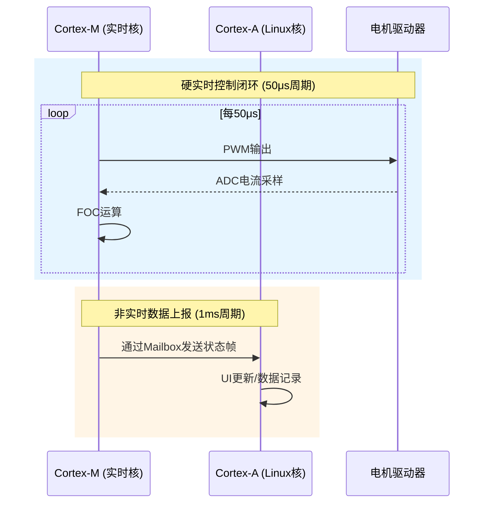

> ⚠️ 【关键区分】PREEMPT_RT 让 Linux 变得"更实时"，但它仍是通用操作系统，无法提供硬实时所需的确定性时序保证。需要确定性时，必须让 RTOS 或裸机接管控制闭环。
{: .conclusion }

---

### <strong>功耗与成本优化</strong>

一颗 Cortex-A72 即使在 idle 状态下，动态功耗加静态漏电也可能达到 200–500 mW； 
而一颗 Cortex-M4 在 80 MHz 运行复杂算法时功耗约 10 mW，sleep 模式下可低至 10 μW。 
数量级的功耗差异决定了：如果让大核持续轮询传感器或维持电机控制，电池将在数小时内耗尽。 

异构架构的功耗逻辑是<strong>核的按需唤醒</strong>。 
以智能摄像头为例：平时 Cortex-M4 以 32 kHz 低频维持 PIR 人体检测，检测到目标后通过 Mailbox 中断唤醒 Cortex-A53，A53 启动 Linux、初始化 ISP、运行 AI 推理，完成识别后再次休眠。整个过程中，A53 的活跃时间可能只占 5%，却承担了 95% 的计算复杂度。 

从 BOM（物料清单）成本看，"单颗异构 SoC" 相比 "应用处理器 + 外置 MCU + 额外电源管理 + 板间通信接口" 的方案，能节省一颗芯片、一层 PCB 面积、一组连接器、一套电源树。在十万级出货量的智能硬件中，异构 SoC 的 BOM 优化直接决定产品定价权。 

| 场景 | 单核大核方案功耗 | 异构方案功耗 | 差异来源 |
|------|-----------------|-------------|---------|
| 传感器轮询（100 Hz） | 大核无法深度睡眠，约 300 mW | MCU 维持，约 5 mW | 大核漏电 vs MCU 低功耗模式 |
| 电机控制（10 kHz） | 大核 100% 负载，约 1500 mW | MCU 80 MHz 运行，约 15 mW | 架构差异与指令效率 |
| AI 推理间歇触发 | 大核常驻，约 800 mW | 大核按需唤醒，平均 80 mW | 电源域隔离与动态调压 |

> 💡 【设计启示】异构不是"为了多核而多核"，而是把"必须持续运行"的低算力任务和"偶尔爆发"的高算力任务映射到不同功耗域，实现系统级能耗最优。
{: .tip }

---

### <strong>功能安全隔离</strong>

在汽车电子、轨道交通、医疗生命支持设备中，ASIL（Automotive Safety Integrity Level，汽车安全完整性等级） 是硬门槛。 
ASIL-D 要求单点故障检测率超过 99%，且不同安全等级的软件组件必须实现<strong>故障隔离</strong>——即一个组件的失效不能级联影响其他组件。 

Linux 内核代码量超过 3000 万行，任何内核模块的内存越界、空指针解引用、竞态条件都可能导致整个系统 panic。 
让 Linux 本身去承担制动控制、转向助力等 ASIL-D 功能，在认证层面几乎不可能通过。功能安全标准（如 ISO 26262）要求：高安全等级任务必须运行在独立的硬件执行环境上，与复杂操作系统物理隔离。 

异构架构天然满足这一要求。 
Cortex-M 核运行经过形式化验证的 RTOS 或裸机程序，代码量控制在数万行以内，可通过 ASIL-D 认证；Cortex-A 核运行 Linux 负责信息娱乐、网络通信、数据记录，即使 Linux 因 OOM 或驱动 bug 崩溃，Cortex-M 核上的安全监控任务仍在独立时钟域运行，持续执行故障检测、安全状态切换、紧急制动。 

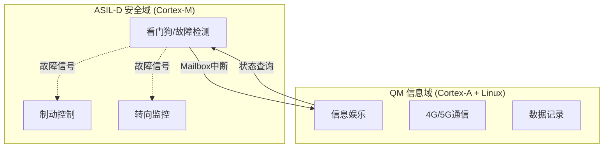

> ⚠️ 【认证现实】在功能安全领域，"软件隔离"（如 Linux 容器、进程隔离）不被视为有效的故障屏障。只有独立的硬件核、独立的时钟、独立的电源域，才能满足 ASIL-D 的故障独立性要求。
{: .warning }

---

## <strong>典型硬件拓扑</strong> I
> 💡 建立硬件拓扑认知框架，为后续协议栈学习提供物理层锚点
{: .tip }
  
异构多核不是单一形态，而是根据<strong>核的对称性</strong>和<strong>任务耦合度</strong>演化出的三种硬件拓扑。 
理解这三种拓扑的物理差异，是后续选择通信协议（共享内存还是消息传递）、决定固件加载策略（主从还是对等）的前提。 

选错拓扑认知，会导致后续所有软件设计建立在错误的硬件假设上。 

---

### <strong>同构 AMP 架构</strong>

同构 AMP（Asymmetric Multi-Processing，非对称多处理）指多颗<strong>完全相同</strong>的高性能处理器核，各自运行独立的操作系统实例，彼此之间没有共享调度器。 

这很容易与 SMP（Symmetric Multi-Processing，对称多处理）混淆。 
SMP 是我们最熟悉的模式：你的手机八核 Cortex-A 运行 Android，八个核共享同一个 Linux 内核调度器，任务可以在核间迁移。 
而 AMP 模式下，四颗 Cortex-A53 可能分别运行四个独立的 Linux，或者三颗跑 Linux、一颗跑 RTOS，<strong>每颗核拥有自己的内存空间、中断控制器、设备树</strong>。 

为什么嵌入式场景不直接用 SMP，而要搞同构 AMP？核心原因是<strong>故障隔离</strong>。 
在电信基站、工业 PLC 中，一颗核上的 Linux 因驱动 bug 崩溃，绝不能影响另一颗核上运行的实时任务。 
AMP 模式下，核 A 的 panic 不会触发核 B 的 NMI，两者通过片内互联（如 ARM CCI/CMN）或片外总线交换数据，物理上就是两台独立的计算机被封装在一颗芯片里。 

典型芯片：NXP QorIQ LS1046（四核 Cortex-A72，支持分区运行多个 Linux）、TI AM64x（双核 Cortex-A53 + 双核 Cortex-R5F，虽然严格算异构，但其 A53 域内部可配置为 AMP 模式）。 

通信方式：共享内存（通过 CCI 一致性互联）或 PCIe（片内虚拟 PCIe 通道）。 

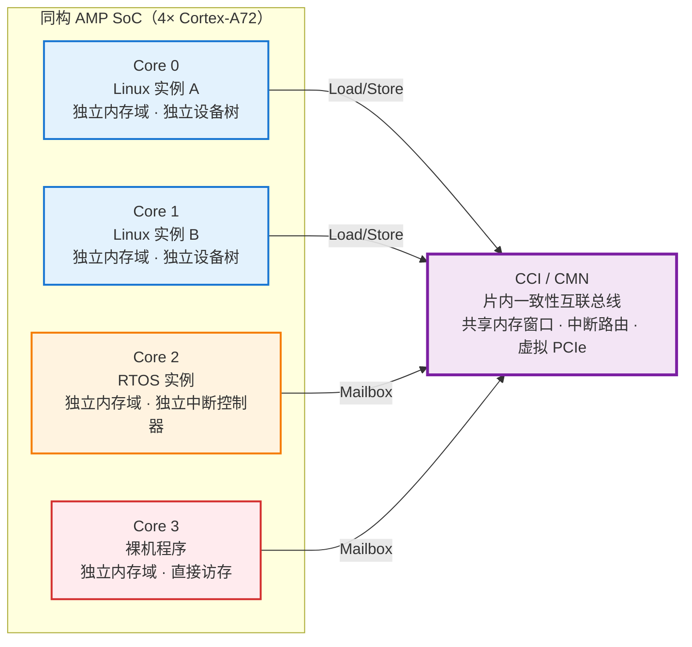

> 💡 【关键区分】同构 AMP 的"同构"仅指核的指令集相同，软件层面完全可以运行不同 OS。 不要把"同构"理解为"必须跑相同系统"。
{: .tip }

---

### <strong>CPU 加 MCU 异构</strong>

这是嵌入式 Linux 工程师最常接触的形态：应用处理器（AP）+ 微控制器（MCU）。 
AP 通常是 Cortex-A 系列（A53/A55/A72），运行完整的 Linux；MCU 通常是 Cortex-M 系列（M4/M7/M33）或 Cortex-R 系列（R5F/R52），运行 RTOS 或裸机。 

硬件上，这两颗核位于同一颗 SoC 内，通过<strong>片内总线矩阵</strong>（AXI/AHB/APB 互联）访问共享外设和内存。 
它们共享 DDR，但各自有独立的 SRAM/TCM（Tightly-Coupled Memory，紧耦合内存）。MCU 的 TCM 对 AP 不可见（或需特殊映射），这是为了保证 MCU 的实时性不被 AP 的 DMA 流量干扰。 

通信物理层通常有三条路径： 
1. 共享内存： carveout 出一块 DDR 区域，双方通过读写该区域的结构体交换数据 
2. Mailbox：SoC 内置的硬件 Mailbox IP，写寄存器触发对方中断 
3. 核间中断：通过 GIC（Generic Interrupt Controller）的 SGIs（Software Generated Interrupts）直接触发 

典型芯片：NXP i.MX8M Plus（Cortex-A53 ×4 + Cortex-M7）、TI AM62x（Cortex-A53 ×2 + Cortex-R5F）、Xilinx Zynq UltraScale+ MPSoC（Cortex-A53 ×4 + Cortex-R5F ×2）。 

这种拓扑的<strong>设计哲学</strong>是"分工明确、互不干扰"。 
AP 负责重负载、长延迟可容忍的任务；MCU 负责时间确定性任务。两者之间的通信带宽通常不高（几 KB 到几十 KB 每秒），但延迟要求极低（几十微秒级中断响应）。 

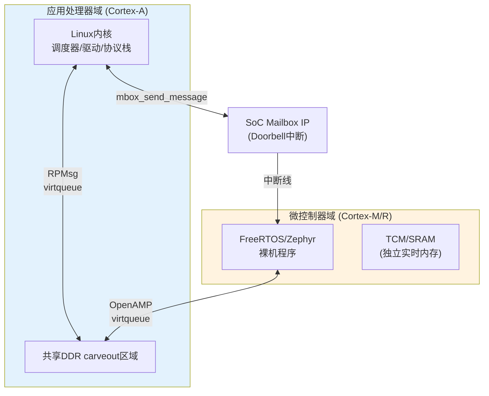

> ⚠️ 【硬件陷阱】很多工程师误以为 Cortex-M 的 TCM 就是普通的 SRAM。 实际上 TCM 通过独立总线直接连接到核，访问延迟固定为 1–2 个时钟周期，不受 AXI 总线矩阵的仲裁延迟影响。 把实时数据放在 TCM 而非 DDR，是控制环路稳定的关键。
{: .warning }

---

### <strong>计算扩展异构</strong>

第三种拓扑不是"多颗通用核分工"，而是<strong>主处理器 + 专用加速器</strong>的耦合形态。CPU 负责控制流，DSP/NPU/FPGA 负责数据流的密集计算。 

- CPU + DSP：TI 的经典设计，Cortex-A 跑 Linux，C66x/C7x DSP 跑信号处理算法。两者通过 SysLink（早期）或 RPMsg（现代）通信。DSP 通常有独立的本地 L2 SRAM，CPU 通过 PCIe 或专用总线加载固件。
- CPU + NPU：瑞芯微 RK3588（Cortex-A76 + NPU）、全志 A523（Cortex-A53 + NPU）。NPU 作为 PCI 或 AXI 从设备挂载，CPU 通过驱动提交推理任务，NPU 完成计算后通过中断通知 CPU。这里的"通信"不是传统意义上的核间消息，而是<strong>任务提交与结果回传</strong>。
- CPU + FPGA：Xilinx Zynq 系列（PS 处理系统 + PL 可编程逻辑）。FPGA 侧实现自定义加速器，通过 AXI HP（High Performance）端口与 CPU 共享 DDR。CPU 通过 remoteproc 加载 FPGA 比特流（或微处理器核固件），通过 DMA 传输大块数据。

与前两种拓扑的关键差异：<strong>加速器核通常不具备独立运行完整操作系统的能力</strong>。 
DSP 可能需要 RTOS 内核，NPU 通常只有固件，FPGA 里的软核（如 MicroBlaze）才具备 OS 能力。 
因此通信模型更偏向<strong>主从</strong>：CPU 是 master，负责 boot、配置、任务分发；加速器是 slave，负责执行。 

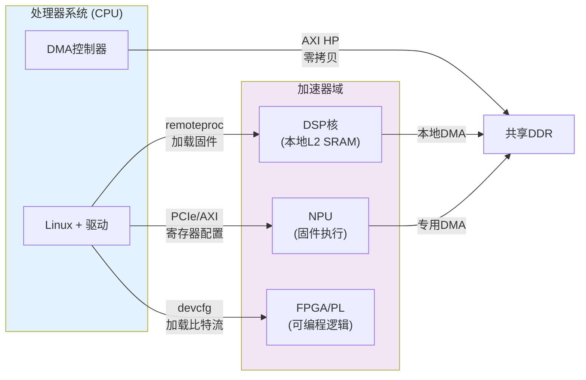

---

### <strong>三种拓扑的选型对照</strong>

| 拓扑类型 | 核间对称性 | 典型通信带宽 | 延迟要求 | 软件复杂度 | 典型场景 |
|---------|-----------|-------------|---------|-----------|---------|
| 同构 AMP | 指令集相同，OS 独立 | 高（百 MB/s 级） | 中（毫秒级） | 高（多 OS 维护） | 电信基站、多分区工业控制 |
| CPU+MCU | 指令集不同，能力差异大 | 低（KB/s–MB/s） | 极低（微秒级） | 中（OpenAMP/RPMsg） | 机器人主控、汽车网关、工业 PLC |
| 计算扩展 | 主从关系，加速器无 OS | 极高（GB/s 级 DMA） | 低（毫秒级） | 高（驱动+固件协同） | 边缘 AI、机器视觉、软件无线电 |

选型逻辑的本质，是判断"任务之间是否需要频繁、低延迟的细粒度交互"。 
 如果是，选 CPU+MCU 异构；如果各自独立运行、偶尔同步，选同构 AMP；如果一方只是另一方的计算卸载单元，选计算扩展。 

> ⚠️ 【架构陷阱】不要把"计算扩展异构"的通信模型硬套到"CPU+MCU 异构"上。 前者用 DMA 批量传输即可，后者必须用 Mailbox 保证确定性中断。 混淆两者的通信策略，是异构系统调试时最常见的架构级错误。
{: .warning }

---

## <strong>通信范式总览</strong> I
> 💡 建立通信范式的认知框架，不涉及寄存器级细节
{: .tip }

硬件拓扑决定了"有哪些核"，通信范式则决定"这些核怎么说话"。选错通信范式，轻则性能腰斩，重则系统不稳定。 

异构核间通信在软件层面抽象为两大模型：<strong>共享内存</strong>与<strong>消息传递</strong>。 
而在系统启动与资源管理上，又衍生出<strong>主从</strong>与<strong>对等</strong>两种架构关系。 
理解这四者的交叉组合，是后续深入 RPMsg、Mailbox、virtqueue 实现细节的认知地基。 

---

### <strong>共享内存模型</strong>

共享内存是最直观的通信方式：多颗核通过访问同一块物理内存区域交换数据，本质上是"把数据放在桌上，对方自己来看"。 

在嵌入式场景中，这块内存通常通过 carveout（ carve-out， carveout 预留）机制从 DDR 中划分出来，由设备树 `reserved-memory` 节点声明，双方核的页表各自映射到相同的物理地址。核 A 把传感器数据写入结构体，核 B 直接读取该地址，整个过程没有数据拷贝，也没有协议栈封装/解封装的开销。 

这种模型的优势是<strong>带宽高、延迟低</strong>。 
在视频处理场景中，一帧 1080p YUV 图像约 3 MB，通过共享内存传递只需一次内存写入；如果走消息传递，即使分片传输，协议头和拷贝开销也会吃掉大量 DDR 带宽。共享内存的物理极限，就是 DDR 控制器的带宽极限。 

但代价同样显著：<strong>同步复杂度极高</strong>。 
当核 A 正在写入结构体的一半时，核 B 开始读取，会得到一个"半新半旧"的损坏状态。解决这个问题的手段——原子操作、内存屏障、自旋锁、信号量——在跨核场景下比在单核多线程中更难调试，因为涉及不同核的缓存一致性状态、不同 OS 的调度策略，甚至不同架构的内存模型差异（如 ARM 的弱内存序 vs x86 的强内存序）。 

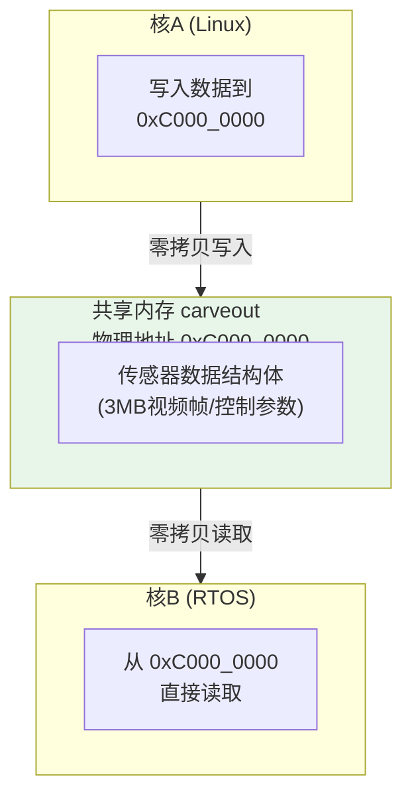

> ⚠️ 【架构陷阱】共享内存不是"免费午餐"。 很多工程师看到零拷贝就全盘采用共享内存，结果在跨核同步上踩坑数月。 共享内存适合<strong>大块数据、低频控制</strong>；如果数据量小于 1 KB 且交互频繁，消息传递反而更简单可靠。
{: .warning }

---

### <strong>消息传递模型</strong>

消息传递是"把数据装进信封，通过邮差送给对方"。 
发送方将数据封装成消息，写入通信通道，通过中断或轮询通知接收方；接收方收到通知后，从通道中取出消息并处理。 

在嵌入式异构系统中，消息传递的物理载体通常是 Mailbox（邮箱）或 RPMsg（Remote Processor Messaging）。 
Mailbox 是硬件 IP，通过写寄存器触发对方核的中断，适合传递极短的通知信号（如一个 32-bit 命令字）。 
RPMsg 则构建在 virtio 之上，提供类似 BSD Socket 的 API——`rpmsg_send()`、`rpmsg_recv()`、`rpmsg_create_ept()`——让工程师可以像写网络程序一样写核间通信。 

消息传递的核心优势是<strong>天然同步与错误隔离</strong>。 
消息有明确的边界，不会读到半包数据；如果通道满或对方崩溃，发送方会立即收到 `EAGAIN` 或 `EPIPE` 错误，而不是默默踩坏内存。 
在控制命令场景中，这种"有来有回"的语义比共享内存的"盲写盲读"更安全。 
消息传递的代价是带宽上限和延迟抖动：每发一条消息都要触发中断，中断路径的延迟（GIC 路由、Linux 调度、上下文切换）在几十到几百微秒之间波动。 

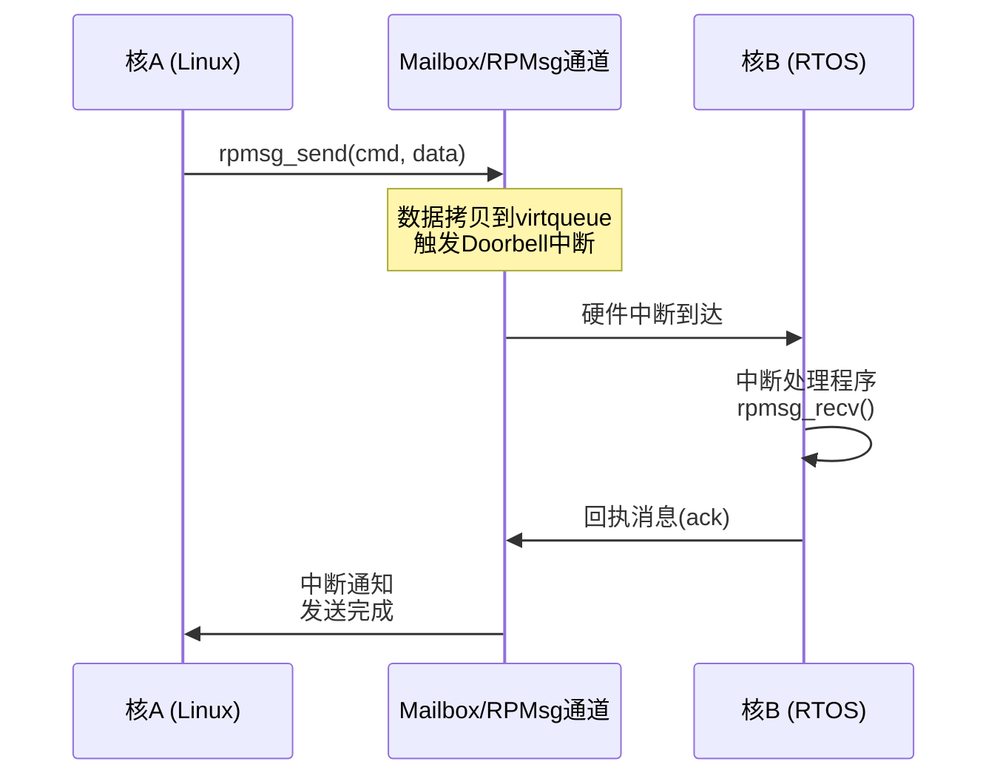

> 💡 【选型口诀】 数据量 > 1 KB 且对延迟不敏感 → 共享内存； 数据量 < 1 KB 且需要可靠送达确认 → 消息传递； 控制命令与状态上报 → 消息传递； 视频帧/音频流/批量传感器数据 → 共享内存。
{: .tip }

---

### <strong>主从架构 vs 对等架构</strong>

通信模型之上，还有一层<strong>系统架构关系</strong>：谁掌握全局资源，谁负责启动谁，谁说了算。 
这分为主从（Master-Slave）与对等（Peer-to-Peer）两种。 

主从架构中，一方是 master，通常是运行 Linux 的 Cortex-A 大核；另一方是 slave，通常是 Cortex-M/DSP/NPU。 
Master 掌握<strong>资源表</strong>（resource table），知道 carveout 内存的物理地址范围、Mailbox 通道的寄存器基址、virtqueue 的长度与对齐方式。 
Master 负责通过 remoteproc 加载 slave 的固件、配置其时钟与电源域、监控其运行状态。 
Slave 上电后处于等待状态，直到 master 通过 Mailbox 发送"启动完成"信号，才开始初始化自己的通信端点。 

这种架构适合<strong>大脑与四肢</strong>的关系：Linux 大核负责决策、调度、联网，MCU 负责执行、传感、控制。 
资源集中管理降低了配置复杂度，但也意味着 slave 无法独立存在——如果 master 崩溃，slave 通常会被硬件复位或进入安全模式。 

对等架构中，双方地位平等，各自管理自己的内存、外设、时钟。没有统一的 resource table，双方通过协商建立通信通道。 
典型的同构 AMP 多 Linux 实例就属于对等架构：每个核独立启动、独立解析自己的设备树，核间通过共享内存的约定区域或 PCIe 交换数据。 

对等架构的优势是<strong>故障独立性</strong>：核 A 的 Linux 崩溃不会导致核 B 被复位。 
代价是<strong>配置复杂</strong>：双方必须事先约定好内存地址、中断号、协议版本，任何一方升级固件都可能破坏这种约定。 

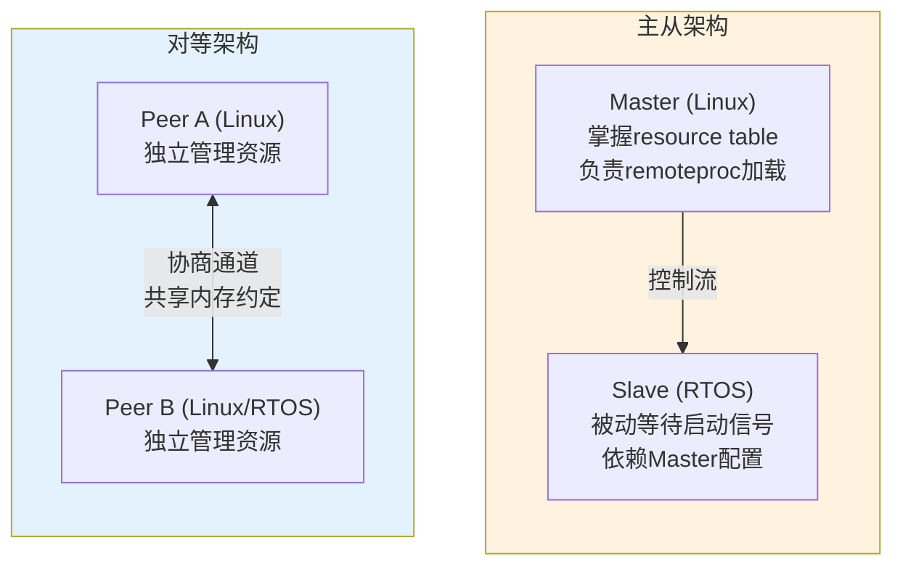

> ⚠️ 【设计陷阱】不要把"主从"和"消息传递"强行绑定。 主从架构下可以用共享内存（master 配置好地址后双方直接读写），对等架构下也可以用 RPMsg（双方协商出 virtio 参数后建立通道）。 架构关系与通信模型是正交的两个维度。
{: .warning }

---

### <strong>三种范式的嵌入式映射</strong>

实际项目中，三种范式很少单独使用，而是<strong>分层组合</strong>。 

以机器人关节驱动器为例： 
- 控制层：MCU 以 10 kHz 运行 FOC 算法，完全本地闭环，<strong>不跨核通信</strong> 
- 状态层：每 1 ms，MCU 通过 Mailbox 向 Linux 发送 16-byte 状态帧（位置、速度、电流、故障码），<strong>消息传递</strong> 
- 数据层：每 10 ms，Linux 通过共享内存向 MCU 下发轨迹规划点数组（100 个 float，约 400 byte），<strong>共享内存</strong> 
- 架构层：Linux 是 master，通过 remoteproc 加载 MCU 固件，初始化时配置 carveout 与 Mailbox，<strong>主从架构</strong>

优秀的异构通信设计，不是选择"哪一种"范式，而是为不同数据类型匹配最合适的范式，并在同一系统中让它们互不干扰地共存。 

---

## <strong>嵌入式场景的典型分工</strong> E
> 💡 不再是"是什么/为什么"，而是"在真实项目中怎么划清权责边界"，涉及架构决策与工程权衡
{: .tip }

知道有哪些核、有哪些通信方式，不等于能做出可用的系统。异构设计的成败，80% 取决于核间职责边界的划分。 

边界划得太粗，实时任务漏到 Linux 侧，系统必然抖动；边界划得太细，跨核通信流量爆炸，带宽和延迟双双恶化。本节基于前面已建立的认知——Linux 的调度不确定性使其无法承担硬实时闭环，Mailbox/RPMsg 适合控制命令而共享内存适合批量数据——直接讨论工程落地时的权责切割逻辑。 

---

### <strong>Linux 域职责边界</strong>

Linux 大核的核心价值不是"跑得快"，而是<strong>生态全、协议栈厚、开发效率高</strong>。凡是需要复杂协议栈、大内存、丰富中间件，且对时序抖动容忍度在毫秒级以上的任务，都应放在 Linux 域。 

网络协议栈是最典型的例子。 
TCP/IP 协议栈加上 TLS、HTTP、MQTT、DDS，代码量以百万行计，MCU 的 512 KB SRAM 根本无法承载。即使能裁剪 lwIP，其功能完整度、认证机制、QoS 策略也与 Linux 内核网络子系统相差甚远。因此 4G/5G 模组、Wi-Fi/BLE 协议栈、云端数据上报，天然归属 Linux。 

存储管理同样如此。 
eMMC 的 EXT4 文件系统、 wear-leveling 算法、坏块管理、日志型事务（journaling），这些复杂度对 MCU 是灾难。机器人需要记录运行日志、保存地图数据、OTA 升级包缓存，这些统统由 Linux 负责。MCU 只保留掉电安全的极小配置区（通常几十 KB 的 EEPROM 或 Flash 扇区）。 

UI 渲染与业务逻辑更是 Linux 的主场。 
基于 Qt/GStreamer 的 HMI、ROS2（Robot Operating System 2，机器人中间件框架）导航节点、SLAM 算法、AI 推理结果的后处理——这些任务需要浮点运算、大内存堆、多线程并发，且人类对 UI 卡顿的感知阈值在 100 ms 左右，远高于电机控制的 50 μs。 

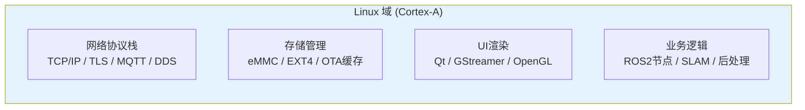

> 💡 【边界红线】Linux 域可以"请求"实时域执行某个动作（如"电机转速设为 1000 RPM"），但绝不能"参与"实时域的控制闭环。 Linux 发完命令后，实时域必须自治，不能等待 Linux 的下一步确认。
{: .warning }

---

### <strong>实时域职责边界</strong>

实时域的设计哲学是<strong>自治与确定性</strong>。实时域必须假设 Linux 域随时可能崩溃、冻结、重启，且自身的核心功能不能因此中断。 

传感器采集是实时域的第一道关口。 
以惯性测量单元（IMU）为例，MPU-9250 以 1 kHz 输出加速度/陀螺仪数据，MCU 通过 SPI 以严格定时的中断方式读取。如果把这个 SPI 驱动放在 Linux 侧，即使使用 `SCHED_FIFO` 实时线程，SPI 总线也可能因内核态的 eMMC DMA 中断而延迟几十微秒，导致采样时刻抖动。 
实时域的做法是：MCU 维护本地采样 FIFO，在严格时钟中断中读取，Linux 只读取 MCU 已经滤波融合后的姿态四元数（100 Hz）。 

电机控制是实时域的核心。 
前面已论证 FOC 算法必须在 MCU 上闭环，这里补充一个工程细节：PWM 波形生成（Pulse Width Modulation，脉宽调制）通常由 MCU 的硬件定时器模块独立完成，CPU 只负责每 50 μs 更新一次比较寄存器。即使 MCU 的 CPU 短暂被中断抢占，硬件定时器仍按上次寄存器值持续输出，不会导致电机失步。这种<strong>硬件自治</strong>是 Linux 的 GPIO 模拟 PWM 完全无法比拟的。 

安全监控是实时域的底线。 
急停按钮（E-Stop）、碰撞传感器、过流保护，这些回路必须在 MCU 侧形成<strong>硬接线逻辑</strong>：传感器信号通过 GPIO 直接进入 MCU 的中断输入，MCU 在几微秒内切断 PWM 使能，同时通过 Mailbox 通知 Linux"已触发急停"。整个安全回路不经过 Linux 的任何调度、驱动、协议栈。 
功能安全标准（如 ISO 26262、IEC 61508）明确要求：安全相关回路必须具备独立于主处理器的硬件执行路径。 

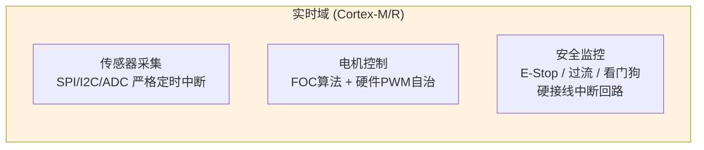

---

### <strong>通信边界设计原则</strong>

跨核通信不是"能通就行"，而是<strong>系统架构中最脆弱的耦合点</strong>。每增加一条跨核数据流，就引入一份带宽消耗、一份延迟不确定性和一份故障排查复杂度。 

<strong>最小通信原则</strong>：只传递"对方必须知道且无法本地推导"的信息。 
原始 ADC 采样点在 MCU 侧经过卡尔曼滤波后，只把融合后的姿态角发给 Linux；Linux 把目标速度发给 MCU，MCU 本地做 PID 闭环，不需要把每 50 μs 的电流采样值回传。很多工程师犯的错误，是把 MCU 当成数据采集前端，所有原始数据透传 Linux 处理——这在实验室可行，但在量产中 DDR 带宽和核间中断很快成为瓶颈。 

<strong>单向优先原则</strong>：跨核数据流尽量设计成单向管道，避免双向 RPC（Remote Procedure Call，远程过程调用）同步调用。 
例如 Linux 向 MCU 下发轨迹点数组后，MCU 独立执行，执行完成后通过 Mailbox 发送一个 4-byte 的完成标志，而不是 Linux 每发一个点就等待 MCU 回执。双向同步在 MCU 侧会引入不可预测的阻塞：如果 Linux 因 OOM 冻结 5 ms，MCU 的 RPC 等待超时可能误触发故障保护。 

<strong>异步解耦原则</strong>：跨核通信必须带时间戳和序列号，接收方按时间戳消费而非按到达顺序消费。 
网络延迟抖动、中断风暴、DMA 抢占都可能导致消息乱序。Linux 域的 ROS2 节点收到 MCU 上报的关节状态后，应检查 `timestamp` 和 `seq`，丢弃过期帧，而不是盲目使用最新到达的帧。 

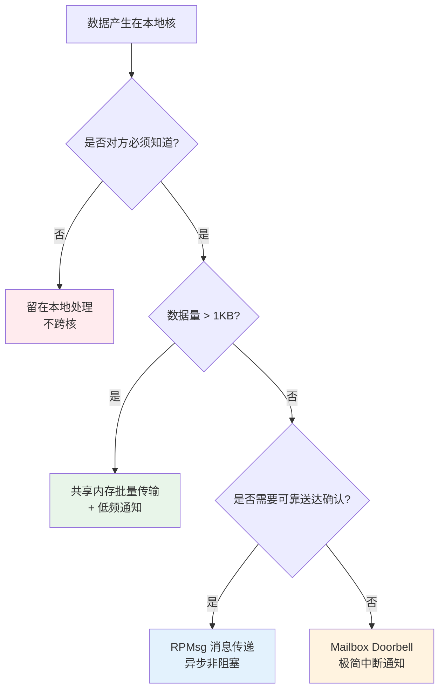

---

## <strong>典型反模式与整改案例</strong> E

> 💡 前三节阐述正向设计原则，本节补充三个来自真实项目复盘的反模式与整改案例，覆盖架构、通信、同步三个维度的常见工程错误。
{: .tip }

### <strong>反模式一：Linux 直接生成电机 PWM</strong>

某协作机器人项目初期，为简化架构，将电机驱动器通过 SPI 挂在 Linux 的 SPI 总线上，由 Linux 用户态 Python 脚本每 1 ms 计算 PWM 占空比并通过 `spidev` 下发。结果机械臂在负载突变时出现 2–3 ms 的抖动，末端轨迹偏离达 5 mm。 

<strong>根因</strong>：Linux 的 `SCHED_FIFO` 线程在 eMMC 写日志时被内核态 IO 抢占，SPI 传输延迟从 200 μs 飙升到 3 ms。 

<strong>整改</strong>：将 FOC 算法和 PWM 生成迁移到 Cortex-M4，Linux 只下发目标力矩（10 Hz），MCU 本地 10 kHz 闭环。整改后轨迹精度恢复到 0.1 mm。 

### <strong>反模式二：MCU 透传原始传感器数据</strong>

某 AGV 项目将 16 路超声波测距模块全部挂在 MCU 的 I2C 总线上，MCU 不做任何处理，每 100 ms 把 16 路原始距离值（32 byte）通过 RPMsg 发给 Linux，由 Linux 做障碍物融合算法。结果 RPMsg 通道在复杂地形下频繁丢包，融合算法收到残缺数据，误判安全距离。 

<strong>根因</strong>：16 路 × 10 Hz × 32 byte = 5.12 KB/s，看似不大，但 RPMsg 的 virtqueue 长度有限（默认 256 个 desc），突发流量导致溢出。且原始数据中的噪声点本可在 MCU 侧通过中值滤波剔除。 

<strong>整改</strong>：MCU 侧增加本地滤波与障碍物聚类，只向 Linux 上报"前方 2 m 处存在障碍物，宽度 0.5 m"这样的结构化语义（约 16 byte/100 ms）。RPMsg 通道负载降低 95%，丢包归零。 

### <strong>反模式三：跨核双向 RPC 同步调用</strong>

某医疗设备将生命体征监测放在 MCU，UI 和联网放在 Linux。设计时采用"Linux 请求 → MCU 执行 → MCU 回执 → Linux 确认"的四步 RPC。某次 Linux 因 Wi-Fi 驱动 bug 进入 20 ms 的软中断风暴，MCU 的 RPC 等待超时，误判通信故障，触发安全停机，导致正在进行的输液中断。 

<strong>根因</strong>：MCU 的故障保护逻辑与 Linux 的健康状态错误耦合。Linux 的 Wi-Fi 中断风暴本不影响 MCU 的本地监测功能，但 RPC 同步机制让 MCU"感知"到了 Linux 的异常。 

<strong>整改</strong>：改为单向异步模型。MCU 以固定频率（10 Hz）向 Linux 推送生命体征数据，无论 Linux 是否响应；Linux 向 MCU 发送的控制命令（如"调整滴速"）带递增序列号，MCU 收到即执行，不等待确认。MCU 的故障保护仅基于本地传感器（如气泡检测、压力超限），与 Linux 完全解耦。 

> 核心结论：异构系统的健壮性，不取决于通信通道有多快，而取决于两核在物理上能否在对方崩溃时继续独立履行自己的核心职责。
{: .conclusion }

---

