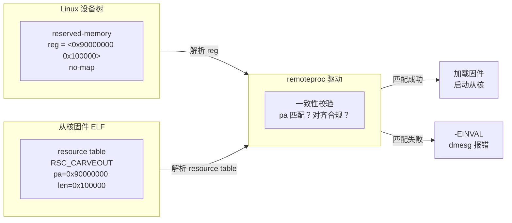
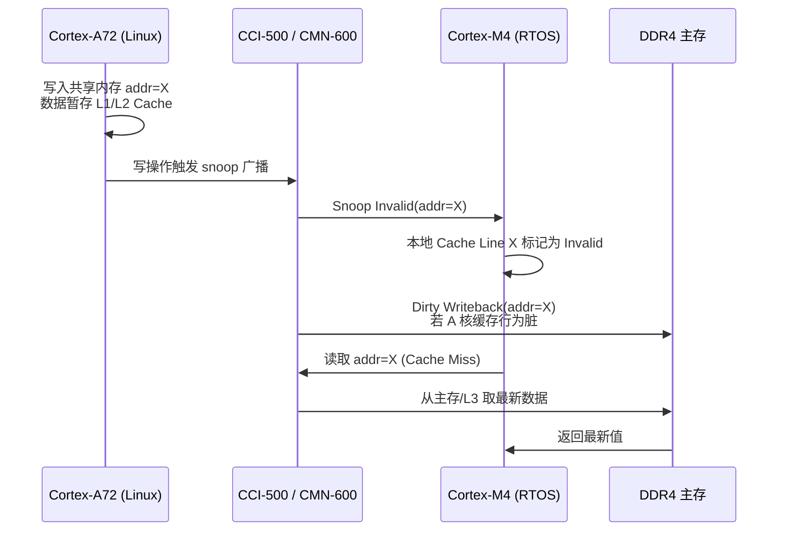
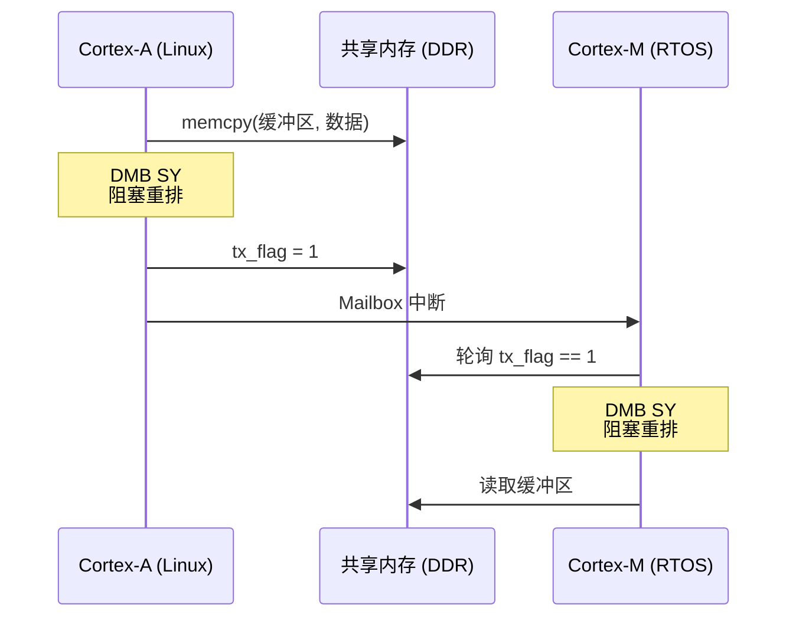
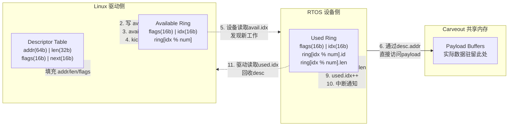
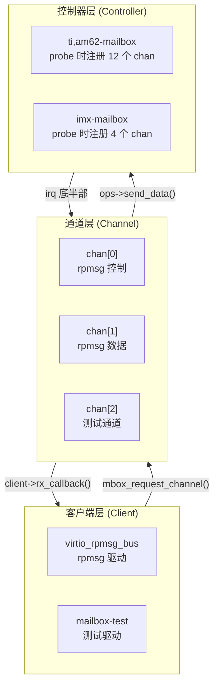

**小节定位说明**
- 难度：I（中级）
- 内容类型：原理解析与配置实操结合
- 预计密度：中密度
- 教学意图：建立"物理内存契约"概念，理解 Linux 与从核固件如何就同一块 DRAM 达成不冲突的共识。不触及缓存硬件机制（留给 2.2），也不展开 virtio 抽象（留给 2.4），只解决"如何安全地切出一块两人都能用的物理内存"。

---

## 2.1 物理内存 carveout 与设备树配置

### 为什么必须手动 carveout？

异构多核系统启动时，Linux 内核会接管整个 DRAM 地址空间，通过 memblock（内核早期的物理内存分配器）和后续的伙伴系统（Buddy Allocator）管理所有可用内存。如果 Cortex-M 实时核或 DSP 加速器也需要访问某段物理地址来交换数据，而 Linux 又不知情地把这段地址分配给了某个用户进程或内核缓冲区，那么从核一旦启动，就会直接踩踏（corrupt）Linux 的运行时内存。

 carveout（从物理地址空间中"切出"一块保留区域）的本质，是操作系统与从核固件之间的物理内存契约：Linux 主动放弃对这段地址的管理权，换取从核对内存的确定性、无冲突访问。

这种预留不是可选优化，而是功能正确性的前提。

---

### reserved-memory 节点与 no-map 语义

在设备树（Device Tree）中，`reserved-memory` 是位于根节点 `/` 之下的标准节点，用于向内核声明"这段物理地址请不要碰"。它的子节点通过 `reg` 描述地址范围，通过属性修饰符精确控制内核的行为粒度。

`#address-cells` 和 `#size-cells` 决定了 `reg` 属性的编码宽度。64 位 SoC（如 i.MX8M Plus、RK3588）通常设为 2，表示需要两个 32 位单元来描述一个 64 位地址或长度。

```dts
// 示例平台：NXP i.MX8M Plus（Cortex-A53 + Cortex-M7 异构）
// 文件路径：arch/arm64/boot/dts/freescale/imx8mp.dtsi

/ {
    reserved-memory {
        #address-cells = <2>;
        #size-cells = <2>;
        ranges;

        m7@0x80000000 {
            compatible = "shared-dma-pool";
            reg = <0x0 0x80000000 0x0 0x1000000>;  // 基址 0x80000000，长度 16MB
            no-map;
        };
    };
};
```

`no-map` 是最关键的属性。它告诉内核三件事：不要为该区域建立页表映射；不要将其纳入 memblock 的可分配池；在 `/proc/iomem` 中将其标记为 `reserved`。这意味着 Linux 几乎"看不到"这块内存，除非通过 `ioremap` 或 DMA API 显式映射。

与之相对的 `reusable` 则温和得多。它允许内核在从核未运行时将该区域回收进 CMA（Contiguous Memory Allocator，连续内存分配器）池，供摄像头、视频编解码器等需要大块连续物理内存的子系统临时借用。当 `remoteproc` 框架准备加载从核固件时，再从 CMA 池中申请一块同等大小的连续内存。这种动态借还节省了内存资源，但引入了分配延迟和迁移不确定性。

| 属性 | 内存归属 | 启动时延 | 适用场景 |
|------|----------|----------|----------|
| `no-map` | 永久剥离，内核不可回收 | 零分配延迟 | 电机控制、安全监控等硬实时任务 |
| `reusable` | CMA 池动态管理 | 含分配/迁移延迟 | 间歇性语音唤醒、传感器融合 |
| 无属性 | 内核直接管理，不推荐 | 不适用 | 仅做信息标注，不用于异构共享 |

选型原则很直接：如果从核承担硬实时闭环控制，必须 `no-map` 静态预留，任何分配抖动都可能导致控制周期违约；如果仅做非实时数据后处理，`reusable` 可以节省内存。

---

### 验证 carveout 是否生效

设备树修改后，最可靠的验证方式不是看源码，而是看内核启动后的实际内存布局。

```bash
# 查看保留内存区域的内核视角
$ cat /proc/iomem | grep -i "reserved"
  80000000-80ffffff : reserved        # 16MB 区域已被内核标记为保留

# 查看 memblock 日志（需开启 CONFIG_MEMBLOCK_DEBUG）
$ dmesg | grep -i "reserved memory"
[    0.000000] Reserved memory: created CMA memory pool at 0x0000000080000000, size 16 MiB
[    0.000000] reserved memory: node m7@0x80000000, compatible id shared-dma-pool

# 通过 debugfs 查看 remoteproc 已识别的资源
$ ls /sys/kernel/debug/remoteproc/
remoteproc0  remoteproc1
$ cat /sys/kernel/debug/remoteproc/remoteproc0/resource_table
# 输出固件 resource table 的解析结果，包含 carveout 的 pa/da/len
```

如果遗漏 `no-map`，`/proc/iomem` 中不会显示 `reserved` 标记，内核伙伴系统仍可能将该地址分配出去。从核固件启动后的第一次写操作就可能触发 Linux 的 slab 元数据损坏，表现为内核 panic 或难以解释的内存崩溃。

---

### 固件视角的内存契约

Linux 内核通过设备树知道了"不要碰这段内存"，但从核固件（通常是 FreeRTOS、Zephyr 或裸机程序）并不解析设备树。它通过另一种元数据结构声明自己的内存需求：resource table（资源表）。

resource table 是 ELF 固件中的一个特殊段（`RESOURCE_TABLE` 类型），由 Linux 侧的 `remoteproc` 驱动在加载固件时解析。其中 `RSC_CARVEOUT` 类型的条目明确告诉 Linux："我需要从物理地址 PA 开始、长度为 LEN 的一块内存，请确保它与我设备树中的声明一致。"

```c
// 典型 OpenAMP 固件中的 resource table 定义
// 文件路径：firmware/m4/rsc_table.c（以 TI AM62x 参考实现为例）

struct fw_rsc_carveout {
    uint32_t type;      // RSC_CARVEOUT (0x00000005)
    uint32_t da;        // Device Address：从核视角看到的地址
    uint32_t pa;        // Physical Address：必须与 Linux 设备树 reg 严格一致
    uint32_t len;       // 区域长度，字节为单位
    uint32_t flags;     // 标志位，通常置 0
    char name[32];      // 人类可读名称，出现在 /sys/kernel/debug/remoteproc 中
};

/* vring 使用的共享内存声明 */
struct fw_rsc_carveout vring_mem = {
    .type = RSC_CARVEOUT,
    .da   = 0x90000000,     // 从核侧通过该地址访问
    .pa   = 0x90000000,     // 物理地址，与 Linux 侧 carveout 对齐
    .len  = 0x100000,       // 1MB，容纳两个 vring 及 payload 缓冲区
    .flags = 0,
    .name  = "vring0",
};
```

这里存在一个极易踩坑的契约对齐问题。`pa` 字段必须与设备树 `reg` 声明的物理地址严格一致，且需满足 SoC 总线的对齐约束——通常是 4KB 页对齐，某些平台甚至要求 64 字节 cache line 对齐。如果固件中的 `pa` 与设备树不匹配，或者未按平台要求对齐，`remoteproc` 驱动在加载固件时会返回 `-EINVAL`，dmesg 中仅留下一行模糊的 `Failed to allocate memory for firmware`，排查时往往让人误以为是 CMA 池耗尽。



> 一个实战建议：在 bring-up 阶段，先在设备树中把 carveout 基址设为 0x90000000 这类"整兆"地址，固件侧也严格对齐。bring-up 通过后再考虑紧凑布局。异构通信的首次调通，比内存利用率更重要。

---

### CMA 与静态预留的深层取舍

`no-map` 和 `reusable` 的选择背后，是确定性时序与内存利用率之间的经典权衡。

静态预留（`no-map`）在系统启动时就把一段物理内存从 Linux 的管理域中彻底切除。无论从核是否实际运行，这段内存都不会被回收。对于承担 1kHz 电机 FOC 控制的 Cortex-M 核来说，这是必要的——控制回路不能在每次启动时等待 CMA 分配 16MB 连续物理内存，分配路径上的页面迁移和伙伴系统合并可能引入毫秒级抖动。

CMA（`reusable`）则更适合"间歇性工作负载"。比如从核仅在检测到语音唤醒词时才启动 AI 推理，推理结束后立即下电。此时如果永久预留几十兆内存，对 Linux 侧的运行时内存压力不小。通过 CMA，Linux 可以在从核休眠期间将这段内存借给视频编解码器或 DMA 缓冲区使用，从核唤醒前再回收。

但 CMA 有一个隐性成本：连续内存分配在内存碎片化严重时可能失败。如果系统运行数小时后，CMA 池中的大块连续页被切割成小块，`remoteproc` 加载固件时可能遇到 `-ENOMEM`。对于要求 100% 可用性的工业场景，这往往是不可接受的。

因此，工业级异构系统通常采用混合策略：控制相关的 carveout 用 `no-map` 永久预留；数据通路相关的 carveout 用 `reusable` 动态管理，并在用户态守护进程中监控 CMA 池水位，低水位时提前触发内存规整（compaction）。

---

**小节定位说明**
- 难度：I（中级）
- 内容类型：原理解析
- 预计密度：中密度
- 教学意图：建立"缓存不一致是功能正确性问题而非性能问题"的认知；理解硬件一致性互联如何自动维护多核缓存同步、内存属性如何决定跨核语义、以及软件在何时必须手动干预。不触及原子操作与重排序（留给 2.3），也不展开 virtio 数据结构（留给 2.4）。

---

## <strong>缓存一致性基础</strong> <span class="badge-i">I</span>

当 Linux 核（Cortex-A）与实时核（Cortex-M）约定好同一块 carveout 物理内存后，一个更隐蔽的问题立刻浮现：双方各自拥有 L1/L2 Cache。如果 A 核把传感器数据写进共享地址，数据可能只停留在 A 核的 Cache 中，并未写回 DDR；此时 M 核去读同一地址，拿到的可能是缓存里的旧值，甚至是完全无关的数据。

<span class="red">缓存一致性（Cache Coherency）</span>就是确保多核对同一块物理内存的读写，在所有缓存层级中看到的内容是一致的。在异构通信中，这不是"读慢一点"的性能问题，而是"读到错误数据"的功能正确性问题——控制指令失配、协议状态机跳变、电机驱动失控，都可能源于一次缓存不一致的访问。

---

### <strong>硬件一致性互联与 Snoop 机制</strong>

现代 ARM SoC（如 NXP i.MX8M Plus、TI AM62x、瑞芯微 RK3588）通常集成 <span class="green">CCI（Cache Coherent Interconnect）</span>或 <span class="green">CMN（Coherent Mesh Network）</span>作为片内一致性总线。它们的职责是：当某一 CPU 核修改了某条 Cache Line 时，自动通知其他持有该 Line 副本的核进行同步。

具体流程称为 <span class="red">snoop（侦听）</span>。当 A 核写入共享内存的一个 Cache Line 时，CCI/CMN 的 Snoop Control Unit 会向 M 核的缓存控制器广播 <span class="green">Snoop Invalid</span> 请求，要求 M 核将该地址的缓存行标记为无效。M 核下次访问该地址时，会触发 Cache Miss，自动从 L3 或主存重新拉取最新数据。如果 A 核修改的 Cache Line 是"脏的"（dirty，即仅存在于缓存、未写回内存），CCI 还会触发 <span class="green">dirty writeback</span>，先把脏数据写回主存，再允许 M 核读取。



> 📚 【关联指引】CCI 的 ACE 协议、CMN 的 CHI 协议、snoop filter 的目录式与侦听式实现细节，属于总线层硬件设计范畴，详见「09-总线协议」模块「片内 SoC 总线」大章。本节仅聚焦软件开发者可见的缓存行为与编程语义。
{: .tip }

并非所有平台都具备硬件一致性互联。早期的 Xilinx Zynq-7000（Cortex-A9 + Cortex-M3）以及部分 RISC-V 多核平台，A 核与 M 核之间没有 snoop 通道。此时缓存一致性完全依赖软件维护——这也是下面要讲的 clean/invalidate 操作的必要性来源。

---

### <strong>内存属性映射与跨核语义差异</strong>

ARM 架构通过内存类型（Memory Type）定义了 CPU 对某段地址的访问语义。三种核心类型直接决定了缓存一致性的硬件行为：

| 内存类型 | 缓存行为 | 写缓冲 | 访问顺序 | 典型用途 | 跨核注意点 |
|----------|----------|--------|----------|----------|------------|
| Strongly-ordered | 严格按序，无缓存 | 禁用 | 完全保序 | 系统控制寄存器、外设关键控制 | 天然一致，但每次访问穿透总线，性能极低 |
| Device | 可合并，无缓存 | 有条件合并 | 保序（相对同类型） | 外设 MMIO、DMA 描述符、Mailbox 寄存器 | 需显式内存屏障保证写入顺序；禁止 speculative access |
| Normal | 可缓存、可预取、可乱序 | 启用 | 可乱序优化 | 主存、堆、共享数据缓冲区 | 必须依赖硬件一致性或软件 clean/invalidate |

<span class="blue">共享内存 carveout 区域必须映射为 Normal 内存属性。</span> 只有 Normal 类型允许 CPU 启用缓存，否则每次读写都直接穿透到 DDR，吞吐量可能下降 10~100 倍，对于高频数据通路（如 1Gbps 网络透传或 1080p 视频帧交换）是不可接受的。

但控制寄存器（如 Mailbox 的 doorbell 寄存器、看门狗喂狗寄存器）必须映射为 Device 属性。Device 类型禁止 CPU 对访问进行合并、预取或乱序重排——如果 doorbell 寄存器被映射为 Normal，CPU 可能把"写数据"和"写标志"两次操作重排，导致从核先收到中断通知、却读到尚未写回的旧数据。

```c
// 文件路径: drivers/mailbox/imx-mailbox.c (i.MX 平台 Mailbox 驱动片段)
// 场景: 将 Mailbox 寄存器映射为 Device 属性，确保写顺序

static int imx_mbox_probe(struct platform_device *pdev)
{
    struct resource *res;
    void __iomem *base;
    
    res = platform_get_resource(pdev, IORESOURCE_MEM, 0);
    /* [L1] devm_ioremap_resource 内部自动将寄存器映射为 Device 属性 */
    base = devm_ioremap_resource(&pdev->dev, res);
    /* [L2] 若此处误用 ioremap_cache() 映射为 Normal，CPU 可能乱序合并写操作 */
    /* [L3] 导致 doorbell 触发时，共享内存数据尚未全局可见 */
    
    mbox->base = base;
    return 0;
}
```

> ⚠️ 【实战避坑】在异构通信驱动开发中，一个常见错误是把 carveout 共享内存用 `ioremap()`（默认 Device）映射。这会导致共享内存禁用缓存，性能暴跌。正确做法是使用 `memremap()` 或 `dma_alloc_coherent()`，让内核将其映射为 Normal 内存并参与一致性管理。
{: .warning }

---

### <strong>软件维护一致性场景</strong>

当平台不具备全硬件一致性（如 Zynq-7000），或者通信路径涉及 DMA 引擎（DMA 通常不经过 CPU 缓存，直接访问物理内存）时，软件必须显式执行 <span class="green">Cache Maintenance</span> 操作。

<span class="red">Cache Clean（写回）</span>将 Cache 中的脏数据写回主存，但不丢弃缓存行；<span class="red">Cache Invalidate（失效）</span>直接丢弃缓存行，下次访问强制从主存/L3 重载。两者的组合使用场景非常明确：

| 操作方向 | 软件动作 | 语义 |
|----------|----------|------|
| Linux → 从核 | clean + invalidate | 确保 A 核写入的数据全局可见，同时让 M 核读取时强制重载 |
| 从核 → Linux | invalidate | 丢弃 A 核缓存中的旧副本，强制从 DDR 拉取 M 核写入的新数据 |

```c
// 文件路径: drivers/rpmsg/imx_rpmsg.c (i.MX 平台 RPMsg 驱动，概念化片段)
// 场景: Linux 核向共享内存写入数据后，通知从核读取前的标准流程

void rpmsg_tx(struct imx_rpmsg *rp, void *data, size_t len)
{
    /* [L1] 将应用层数据拷贝到 carveout 的虚拟地址 */
    memcpy(rp->tx_buf_va, data, len);
    
    /* [L2] 关键步骤: 将 Cache 脏数据写回物理内存 */
    /* [L3] dma_sync_single_for_device 内部调用 arch_sync_dma_for_device */
    /* [L4] 在 ARM64 上对应 __dma_clean_cache，触发 clean 到 PoC (Point of Coherency) */
    dma_sync_single_for_device(rp->dev, rp->tx_buf_pa, len, DMA_TO_DEVICE);
    
    /* [L5] 内存屏障: 确保 clean 操作在触发 doorbell 之前完成 */
    wmb();
    
    /* [L6] 写 Mailbox doorbell 寄存器，触发从核中断 */
    writel(1, rp->mbox_base + MBOX_TX_REG);
}
```

在具备 CCI/CMN 硬件一致性的平台上（如 i.MX8M Plus、RK3588），如果共享内存通过 `dma_alloc_coherent()` 分配，则无需手动 clean/invalidate。`coherent` 一词的含义就是"硬件自动维护一致性"。重复执行 Cache Maintenance 不仅无意义，还会引入额外的几十到上百微秒延迟。

如何快速判断当前平台是否具备硬件一致性？可以通过设备树或内核日志确认：

```bash
# 查看设备树中一致性互联节点（以 i.MX8M Plus 为例）
$ grep -i "cci\|cmn\|snoop" /proc/device-tree/compatible 2>/dev/null || echo "无直接节点"

# 查看内核启动日志中的 CCI/CMN 初始化
$ dmesg | grep -i -E "cci|cmn|coherent"
[    0.000000] ARM CCI-500 driver enabled
[    0.123456] cache-coherent 属性已应用于 reserved-memory 区域

# 查看具体内存区域是否标记为 cache-coherent
$ cat /sys/kernel/debug/remoteproc/remoteproc0/carveout
physical: 0x90000000, size: 0x100000, dma-coherent: yes
```

> <span class="blue">核心结论：异构共享内存通信的可靠性，首先取决于对缓存一致性机制的正确认知。具备硬件一致性（CCI/CMN）的平台，应优先使用 dma_alloc_coherent 让硬件自动维护；不具备硬件一致性的平台，必须在数据交换边界显式插入 clean/invalidate 操作。内存属性映射（Normal vs Device）则是防止编译器和 CPU 乱序破坏时序的第一道防线。</span>
{: .conclusion }

---

**小节定位说明**
- 难度：E（高级）
- 内容类型：原理解析与实战结合
- 预计密度：高密度
- 教学意图：2.1 解决了"内存不被踩踏"，2.2 解决了"数据全局可见"，2.3 解决"操作顺序正确"。编译器优化和 CPU 乱序执行会让"先写数据、再写标志"的朴素假设直接崩溃，本节聚焦 ARM 架构提供的原子操作与屏障指令如何重建跨核时序。

---

## <strong>跨核原子操作与内存屏障</strong> <span class="badge-e">E</span>

共享内存 carveout 配置正确、缓存一致性硬件也正常工作，并不意味着核间通信就一定正确。一个经典的陷阱是：Linux 核向共享缓冲区写入 1KB 传感器数据，然后写入一个"数据就绪"标志位通知 Cortex-M 核读取。从 C 语言视角看，这两步有明确的先后顺序；但在编译器和 CPU 看来，只要它们访问的是不同地址，就可能被重排。

<span class="red">内存屏障（Memory Barrier）</span>不是性能优化工具，是重建程序语义顺序的必需品。在异构通信中，屏障的缺失不会报错，只会偶尔产生难以复现的数据损坏——这是最难调试的一类故障。

---

### <strong>ARM 独占监控与 LDREX/STREX</strong>

当 Linux 核与实时核共享一个状态标志（如环形缓冲区的头尾指针、连接状态字）时，双方可能同时读写该标志。普通的读-改-写序列（`read → modify → write`）在多核并发下存在竞态窗口：A 核读完旧值、正在修改时，M 核也读了同一旧值，最终一方的更新会被覆盖。

ARM 架构通过 <span class="green">`LDREX`</span>（Load Exclusive）和 <span class="green">`STREX`</span>（Store Exclusive）指令对提供硬件级原子操作。`LDREX` 从内存加载数据，并在 <span class="red">Exclusive Monitor</span>（独占监控器）中标记该物理地址为"本核独占"。随后的 `STREX` 尝试写回同一地址时，Monitor 会检查该地址在 `LDREX` 之后是否被其他主设备（包括 DMA、其他 CPU 核）修改过。若无修改，`STREX` 成功并返回 0；若有修改，返回非 0，软件必须重试整个读-改-写流程。

```c
// 文件路径: arch/arm/include/asm/atomic.h
// 场景: 内核层跨核标志位的原子递增

static inline int atomic_add_return(int i, atomic_t *v)
{
    unsigned long tmp;
    int result;

    __asm__ __volatile__(
    "1: ldrex   %0, [%3]\n"        // [L1] 独占加载当前值
    "   add     %0, %0, %4\n"     // [L2] 执行加法
    "   strex   %1, %0, [%3]\n"   // [L3] 独占尝试写回，tmp=0 成功
    "   teq     %1, #0\n"         // [L4] 测试 strex 返回值
    "   bne     1b"               // [L5] 失败则跳回标签 1 重试
    : "=&r" (result), "=&r" (tmp), "+Qo" (v->counter)
    : "r" (&v->counter), "Ir" (i)
    : "cc");

    return result;
}
```

独占监控器分为两级：<span class="orange">Local Monitor</span> 跟踪本核内的独占状态，防止本核上下文切换或中断嵌套导致的状态混乱；<span class="orange">Global Monitor</span> 跟踪跨主设备的独占状态，通常与 CCI/CMN 的 snoop 硬件协同。在异构系统中，Cortex-A 核的 `LDREX` 与 Cortex-M 核的 `LDREXH`（16 位版本）底层共享同一套 Global Monitor 物理资源，这是双方能够无锁协作的硬件前提。

> ⚠️ 【实战避坑】若从核固件使用 C11 的 `atomic_fetch_add` 而 Linux 内核使用 `atomic_add_return`，只要双方最终都映射到 `LDREX/STREX` 指令族，硬件层面是兼容的。但如果从核是裸机程序，直接用指针解引用 `*ptr++`，则完全绕过独占监控，必然产生竞态。异构通信的首次联调，务必确认从核侧也使用了原子原语。
{: .warning }

---

### <strong>屏障指令语义与核间通信实战</strong>

ARM 采用弱一致性内存模型（Weakly Ordered Memory Model），允许 CPU 对 Normal 内存的读写操作乱序执行、合并访问、延迟写回，以最大化流水线吞吐量。这对单核程序通常无害，但对跨核共享内存是致命的。

ARM 提供三类屏障指令，在异构通信中有明确分工：

| 指令 | 全称 | 约束范围 | 核间通信典型使用位置 |
|------|------|----------|---------------------|
| `DMB` | Data Memory Barrier | 仅显式数据访问（Load/Store） | 写入共享数据后、写标志位/触发中断前 |
| `DSB` | Data Synchronization Barrier | 数据访问 + Cache/TLB 维护 | `cache clean` 后、启动从核前 |
| `ISB` | Instruction Synchronization Barrier | 指令流水线刷新 | 修改 MMU/内存属性寄存器后 |

<span class="red">`DMB SY`</span>（System 域数据内存屏障）是核间通信最常用的屏障。`SY` 表示全系统范围，涵盖所有共享域内的主设备。它的语义是：确保该指令之前的所有显式数据内存访问，在该指令之后的显式数据内存访问之前全局可见。

```c
// 文件路径: 典型 OpenAMP 共享内存协议实现（概念代码）
// 场景: Linux 核完成数据写入后，确保时序正确再通知从核

void shm_tx_notify(struct shared_mem *shm, void *packet, size_t len)
{
    // [L1] 将数据拷贝到共享内存 carveout
    memcpy(shm->tx_buffer, packet, len);

    // [L2] 数据内存屏障: 确保 memcpy 的所有写操作全局可见
    // [L3] 防止 CPU 将下面的标志位写入重排到 memcpy 之前
    __asm__ volatile ("dmb sy" ::: "memory");

    // [L4] 设置标志位，从核轮询或中断感知该标志
    shm->tx_flag = 1;

    // [L5] 写 Mailbox doorbell，触发从核中断
    writel(1, shm->mbox_base + MBOX_TX_REG);
}
```

从核侧的读取路径同样需要屏障：

```c
// 文件路径: 从核固件侧轮询读取（FreeRTOS/OpenAMP 风格）
// 场景: Cortex-M 核等待标志位，确认后读取数据

void shm_rx_poll(struct shared_mem *shm)
{
    // [L1] 轮询标志位，必须使用 READ_ONCE 防止编译器优化（见下节）
    while (READ_ONCE(shm->tx_flag) == 0)
        ;

    // [L2] 数据内存屏障: 确保标志位读取完成后，再开始读数据缓冲区
    // [L3] 防止 CPU 将缓冲区读取重排到标志位确认之前
    __asm__ volatile ("dmb sy" ::: "memory");

    // [L4] 此时才能安全地读取共享缓冲区，保证拿到最新数据
    process_packet(shm->tx_buffer);
}
```



> <span class="blue">核心结论：DMB 在异构通信中的位置遵循"写数据后、写标志前"和"读标志后、读数据前"的对称模式。遗漏任意一侧的屏障，都会导致对方观察到"标志已就绪但数据未更新"的时序错乱。</span>
{: .conclusion }

---

### <strong>编译器屏障与 READ_ONCE/WRITE_ONCE</strong>

CPU 乱序只是问题的一半。编译器优化同样会破坏跨核共享内存的语义。

编译器在 `-O2` 级别下可能进行多种看似合理但对跨核通信致命的优化：将循环中的重复读取合并为寄存器复用；消除"不可能变化"的变量访问；重排无关地址的读写顺序。如果 Cortex-M 核更新了共享内存中的标志位，而 Linux 核侧的编译器认为该变量不会被修改（因为当前线程没有写入它），就可能把 `while(flag == 0)` 优化为无限循环。

<span class="green">`volatile`</span>关键字告诉编译器该变量可能被外部因素修改，禁止优化掉读写操作。但 `volatile` 仅约束编译器，不生成 CPU 屏障指令，无法防止处理器的乱序执行。

<span class="green">`barrier()`</span>是 Linux 内核提供的编译器屏障宏，通过内联汇编的 `"memory"` 破坏描述符，阻止编译器重排跨越屏障的内存访问。它不生成实际的 CPU 指令，成本为零，但仅对编译器有效。

<span class="green">`READ_ONCE`</span>和 <span class="green">`WRITE_ONCE`</span>是内核推荐的标准做法，同时解决编译器和 CPU 层面的问题：

```c
// 文件路径: include/linux/compiler.h

#define READ_ONCE(x) \
    (*(const volatile __unqual typeof(x) *)&(x))
// [L1] volatile 禁止编译器优化掉该次读操作
// [L2] const 防止内核侧意外修改从核数据
// [L3] __unqual 移除 const/volatile 限定，兼容 C 类型系统

#define WRITE_ONCE(x, val) \
    (*(volatile typeof(x) *)&(x) = (val))
// [L4] volatile 禁止编译器合并多次写入
// [L5] 保证赋值操作一定会生成对应的 store 指令
```

在异构通信中，对端核写入的任何标志位都必须用 `READ_ONCE` 读取；本核写入的任何状态位都必须用 `WRITE_ONCE` 输出。这是防止轮询死锁和写合并的最小代价方案。

```c
// 反例: 未使用 READ_ONCE，编译器优化后可能死锁
static int tx_ready = 0;  // 由从核写入，Linux 核轮询

void buggy_wait(void)
{
    while (tx_ready == 0)   // [L1] 编译器: tx_ready 从未在本线程修改
        ;                   // [L2] 优化为: if (!tx_ready) while(1);
}

// 正例: 使用 READ_ONCE，强制每次从内存重新读取
void correct_wait(void)
{
    while (READ_ONCE(tx_ready) == 0)  // [L3] 每次循环都生成真实的 load 指令
        cpu_relax();                   // [L4] 提示 CPU 降低功耗，避免忙转发热
}
```

> ⚠️ 【实战避坑】在从核固件侧（如 FreeRTOS），如果没有 `READ_ONCE` 宏，可以用 `volatile` 指针强制读取：`while(*(volatile int *)&tx_ready == 0)`。但务必确认工具链的 `volatile` 语义与 Linux 内核一致；某些嵌入式编译器对 `volatile` 的处理较弱，建议直接嵌入 `__asm__ volatile("":::"memory")` 作为编译器屏障。
{: .warning }

---

### <strong>实战：跨核无锁环形缓冲区</strong> <span class="badge-e">E</span>

> 【新增原因】2.3 涉及的原子操作与内存屏障在孤立讲解时较抽象。通过一个完整的 Linux ↔ RTOS 无锁环形缓冲区（SPSC，单生产者单消费者）实现，可以将 carveout 布局（2.1）、cache 一致性（2.2）、原子指针更新与屏障插入位置（2.3）串联为可编译、可测量的工程代码，符合高难度侧重实战的要求。

设计约束：Linux 核作为唯一生产者写入传感器数据，Cortex-M 核作为唯一消费者读取控制指令。双方不持有锁，仅靠原子指针和内存屏障保证正确性。

```c
// 文件路径: firmware/common/shm_ringbuf.h
// 场景: 异构核间无锁环形缓冲区，布局在 carveout 共享内存头部

#define RB_SIZE 1024

struct shm_ringbuf {
    // [L1] 控制区: 指针按 cache line 对齐，避免 false sharing
    volatile uint32_t head __attribute__((aligned(64)));  // [L2] 仅 A 核写入
    volatile uint32_t tail __attribute__((aligned(64)));  // [L3] 仅 M 核写入

    // [L4] 数据区: 紧跟控制区之后
    uint8_t buffer[RB_SIZE];
};

// [L5] 计算剩余可写空间（Linux 核调用，读 tail 写 head）
static inline uint32_t rb_free_space(struct shm_ringbuf *rb)
{
    uint32_t h = READ_ONCE(rb->head);  // [L6] 本核写入的，可直接读
    uint32_t t = READ_ONCE(rb->tail);  // [L7] 对核写入的，必须 volatile 语义
    return (t >= h) ? (t - h - 1) : (RB_SIZE - h + t - 1);
}
```

Linux 核写入流程：

```c
// 文件路径: drivers/rpmsg/shm_ringbuf_tx.c
// 场景: 生产者写入数据并推进 head 指针

int rb_tx(struct shm_ringbuf *rb, const uint8_t *data, uint32_t len)
{
    uint32_t h, t, avail;

    t = READ_ONCE(rb->tail);           // [L1] 读取对核消费进度
    h = READ_ONCE(rb->head);           // [L2] 读取本核生产进度

    avail = (t > h) ? (t - h - 1) : (RB_SIZE - h + t - 1);
    if (avail < len)
        return -ENOSPC;                // [L3] 缓冲区满，通知上层背压

    // [L4] 线性写入，处理回绕
    if (h + len <= RB_SIZE) {
        memcpy(rb->buffer + h, data, len);
    } else {
        uint32_t seg1 = RB_SIZE - h;
        memcpy(rb->buffer + h, data, seg1);
        memcpy(rb->buffer, data + seg1, len - seg1);
    }

    // [L5] 关键屏障: 确保 memcpy 数据全局可见后，再更新 head
    __asm__ volatile ("dmb sy" ::: "memory");

    // [L6] 原子更新 head，对核通过 READ_ONCE 观察新值
    WRITE_ONCE(rb->head, (h + len) % RB_SIZE);

    return 0;
}
```

Cortex-M 核读取流程：

```c
// 文件路径: firmware/m4/rb_rx.c (FreeRTOS 任务)
// 场景: 消费者读取数据并推进 tail 指针

void rb_rx_task(void *arg)
{
    struct shm_ringbuf *rb = arg;
    uint32_t h, t, len;

    while (1) {
        h = READ_ONCE(rb->head);       // [L1] 读取对核生产进度
        t = READ_ONCE(rb->tail);       // [L2] 读取本核消费进度

        if (h == t) {
            vTaskDelay(pdMS_TO_TICKS(1));  // [L3] 空缓冲区，挂起
            continue;
        }

        len = (h > t) ? (h - t) : (RB_SIZE - t + h);
        len = min(len, MAX_PKT_SIZE);  // [L4] 单次最多处理一包

        // [L5] 数据屏障: 确认 head 读取有效后，再拷贝数据
        __asm__ volatile ("dmb sy" ::: "memory");

        // [L6] 拷贝到本地栈缓冲区，避免长期占用共享内存总线
        if (t + len <= RB_SIZE) {
            memcpy(local_buf, rb->buffer + t, len);
        } else {
            uint32_t seg1 = RB_SIZE - t;
            memcpy(local_buf, rb->buffer + t, seg1);
            memcpy(local_buf + seg1, rb->buffer, len - seg1);
        }

        // [L7] 处理完成后，更新 tail 通知 Linux 核空间已释放
        WRITE_ONCE(rb->tail, (t + len) % RB_SIZE);

        process_packet(local_buf, len);
    }
}
```

> <span class="blue">核心结论：SPSC 无锁环形缓冲区的正确性建立在三个契约之上——head 与 tail 指针的单写者语义（避免原子竞争）、DMB 屏障保证的数据-指针时序（避免观察乱序）、READ_ONCE/WRITE_ONCE 防止编译器优化（避免轮询死锁）。在 bring-up 阶段，可通过在 memcpy 前后插入 `trace_marker` 配合 `ftrace` 验证屏障前后的时序是否符合预期。</span>
{: .conclusion }

---
**小节定位说明**
- 难度：E（高级）
- 内容类型：原理解析
- 预计密度：高密度
- 教学意图：2.1 解决了物理内存契约，2.2 解决了缓存可见性，2.3 解决了时序正确性，2.4 在此基础上引入 virtio 标准化抽象。本节聚焦 virtio 如何将"裸共享内存+中断"抽象为跨平台统一的半虚拟化接口，以及 virtqueue 数据结构如何支撑真正的零拷贝传输。这是理解后续 RPMsg（第4节）的底层基础。

---

## <strong>virtio 与 virtqueue 原理</strong> <span class="badge-e">E</span>

 carveout 配置完毕、缓存一致性机制就绪、内存屏障也正确插入后，异构核间通信仍然面临一个工程难题：不同 SoC 厂商的 Mailbox IP、共享内存布局、中断编号千差万别。如果每个平台都从头编写裸指针操作，驱动代码将无法移植，维护成本极高。

<span class="red">virtio</span>是 Linux 内核中标准化的半虚拟化（semi-virtualization）I/O 框架，最初为 KVM 虚拟机设计，后被 OpenAMP 项目复用为异构多核通信的底层传输机制。它的核心思想是：将平台相关的硬件差异（ Mailbox 寄存器地址、中断号、内存布局）封装为统一的"设备-驱动-配置空间-virtqueue"接口，使 Linux 核与 RTOS 核能以完全一致的语义交互。

<span class="blue">virtio 在异构通信中的价值不是性能提升，而是可移植性：同一套 RPMsg 驱动代码可以在 TI AM62x、NXP i.MX8M、Xilinx Zynq 上几乎无修改地运行。</span><br>

---

### <strong>virtio 设备标准化模型</strong>

virtio 设备通过三组标准化接口与驱动交互，屏蔽底层硬件差异：<br>

1. <span class="orange">Feature Bits</span>：64 位特征位掩码，双方通过协商确定支持的扩展能力。例如 `VIRTIO_F_RING_INDIRECT_DESC` 表示支持间接描述符，`VIRTIO_F_VERSION_1` 表示遵循 1.0 规范。
2. <span class="orange">Config Space</span>：设备特定的配置区域，驱动通过标准化的 `virtio_read_config` 访问。在异构通信中，config space 通常包含从核固件版本号、vring 数量、最大 payload 长度等元数据。
3. <span class="orange">Status Register</span>：8 位状态寄存器，驱动按固定顺序与设备握手，确保双方状态同步。

```c
// 文件路径: include/uapi/linux/virtio_config.h
// 场景: virtio 标准状态位定义，异构通信中从核固件侧也需实现对应语义

#define VIRTIO_CONFIG_S_ACKNOWLEDGE     1
// [L1] 驱动已发现该设备，开始初始化

#define VIRTIO_CONFIG_S_DRIVER          2
// [L2] 驱动知道如何操作该设备类型（如 VIRTIO_ID_RPMSG）

#define VIRTIO_CONFIG_S_DRIVER_OK       4
// [L3] 特征协商完成，vring 已配置，可开始数据交换

#define VIRTIO_CONFIG_S_FEATURES_OK     8
// [L4] 双方对 feature bits 达成一致，不可再修改

#define VIRTIO_CONFIG_S_NEEDS_RESET     64
// [L5] 设备检测到致命错误（如从核固件崩溃），要求驱动重置

#define VIRTIO_CONFIG_S_FAILED          128
// [L6] 驱动因错误放弃该设备，remoteproc 将触发恢复流程
```

握手流程是严格的顺序状态机。驱动发现设备后，依次设置 `ACKNOWLEDGE`、`DRIVER`，然后读取设备 feature bits、写入驱动支持的子集、设置 `FEATURES_OK`。设备确认 feature 合法后，驱动分配 vring 内存、写入配置，最后设置 `DRIVER_OK`。此时数据通路正式开通。

> 📚 【补充说明】在异构通信中，从核固件侧实现的 virtio 设备通常是"精简版"。例如 FreeRTOS 上的 OpenAMP 仅实现 `VIRTIO_ID_RPMSG`（设备 ID 为 7）及最小特征集，不处理虚拟网卡、块设备等复杂场景。Linux 侧的 `virtio_rpmsg_bus` 驱动负责完成完整的协商流程，并在 `DRIVER_OK` 后注册 RPMsg 端点。
{: .tip }

---

### <strong>virtqueue 三元组数据结构</strong>

<span class="red">virtqueue</span>是 virtio 的核心抽象，本质上是位于共享内存 carveout 中的环形队列。它的设计目标非常明确：数据本身始终留在共享内存的 payload buffer 中，环中传递的只是指向数据的描述符索引和元数据，从而实现零拷贝（zero-copy）。

virtqueue 由三个协作组件构成，全部位于共享内存中：

| 组件 | 名称 | 维护者 | 作用 |
|------|------|--------|------|
| Descriptor Table | 描述符表 | 驱动（Linux） | 每个条目描述一个缓冲区的物理地址、长度、标志位（只读/只写/下一个描述符链） |
| Available Ring | 可用环 | 驱动（Linux） | 驱动提交新工作后，将描述符索引放入此环，通过单调递增的 `idx` 通知设备 |
| Used Ring | 已用环 | 设备（RTOS） | 设备处理完毕后，将描述符索引放入此环，`idx` 递增通知驱动回收缓冲区 |



描述符表中的 <span class="green">`flags`</span>字段控制缓冲区方向：`VRING_DESC_F_WRITE` 表示设备可写（用于 RX 路径，设备向缓冲区填入接收到的数据）；无此标志表示设备只读（用于 TX 路径，驱动向缓冲区写入待发送数据）。`VRING_DESC_F_NEXT` 表示当前描述符链接到下一个，形成 scatter-gather 链，支持非连续物理页的大消息传输。

```c
// 文件路径: include/uapi/linux/virtio_ring.h
// 场景: virtqueue 核心数据结构定义

/* [L1] 描述符表条目，16字节对齐 */
struct vring_desc {
    __u64 addr;     // [L2] 缓冲区物理地址
    __u32 len;      // [L3] 缓冲区长度
    __u16 flags;    // [L4] VRING_DESC_F_NEXT | VRING_DESC_F_WRITE | VRING_DESC_F_INDIRECT
    __u16 next;     // [L5] 链式下一个描述符索引，若 F_NEXT 置位
};

/* [L6] Available Ring，驱动写入通知设备 */
struct vring_avail {
    __u16 flags;            // [L7] VRING_AVAIL_F_NO_INTERRUPT 等标志
    __u16 idx;              // [L8] 单调递增，设备通过对比上次读取值判断新条目数
    __u16 ring[];           // [L9] 描述符索引数组，长度等于 vring 大小
};

/* [L10] Used Ring 条目，设备写入通知驱动 */
struct vring_used_elem {
    __u32 id;       // [L11] 完成的描述符索引
    __u32 len;      // [L12] 设备实际写入的字节数（对 RX 路径至关重要）
};

/* [L13] Used Ring，设备写入通知驱动 */
struct vring_used {
    __u16 flags;            // [L14] VRING_USED_F_NO_NOTIFY 等标志
    __u16 idx;              // [L15] 单调递增，驱动通过对比判断完成进度
    struct vring_used_elem ring[];
};
```

<span class="blue">virtqueue 的零拷贝本质在于：一次消息传输中，CPU 永远不会把数据从共享内存拷贝到本地栈或堆。Linux 驱动把用户数据写入 carveout 的 payload buffer，virtqueue 环中只传递该 buffer 的物理地址索引；RTOS 设备通过同一索引直接读取物理地址。唯一的内存操作是 cache 一致性维护（若需要），而非数据拷贝。</span><br>

---

### <strong>通知抑制与轮询模式优化</strong>

每次向 Available Ring 写入后都触发中断通知（kick）会带来严重的路径开销：写 Mailbox 寄存器 → 硬件中断传播 → GIC 路由 → Linux 调度从核中断线程 → 上下文切换 → Cache 颠簸。在高频小消息场景（如 1kHz 传感器采样点），中断开销可能远超实际数据处理时间。

virtio 提供双向通知抑制机制，通过 `flags` 字段中的两个关键标志位实现流量控制：

| 标志位 | 全称 | 设置者 | 语义 |
|--------|------|--------|------|
| `VRING_USED_F_NO_NOTIFY` | 设备通知驱动"无需 kick" | 设备（RTOS） | 驱动提交后不必每次 kick，可批量提交后统一通知 |
| `VRING_AVAIL_F_NO_INTERRUPT` | 驱动通知设备"无需中断" | 驱动（Linux） | 设备处理完后不必每次发中断，可批量完成后统一通知 |

```c
// 文件路径: drivers/rpmsg/virtio_rpmsg_bus.c
// 场景: Linux 内核 RPMsg 发送路径中的通知优化

static int virtio_rpmsg_send(struct rpmsg_device *rpdev, void *data, int len)
{
    struct virtio_rpmsg_channel *vch = to_virtio_rpmsg_channel(rpdev);
    struct virtqueue *svq = vch->svq;   // [L1] 发送 virtqueue
    struct scatterlist sg;
    int err;

    /* [L2] 将消息挂载到 descriptor table */
    sg_init_one(&sg, data, len);
    err = virtqueue_add_outbuf(svq, &sg, 1, data, GFP_ATOMIC);
    // [L3] 1 个散集项，data 作为 cookie 用于完成回调匹配

    /* [L4] 关键优化: 检查设备是否要求抑制通知 */
    if (virtqueue_kick_prepare(svq)) {
        // [L5] 内部检查 used->flags 的 VRING_USED_F_NO_NOTIFY 位
        // [L6] 若设备未置位，则执行 kick；若已置位，则跳过
        virtqueue_notify(svq);
    }

    return err;
}
```

当双向通知抑制同时开启时，系统进入事实上的轮询模式：Linux 驱动批量填充多个消息到 vring，统一 kick 一次；RTOS 设备批量处理所有消息，统一中断一次或完全依赖 Linux 侧主动轮询 `used->idx`。这在延迟不敏感但吞吐量敏感的 AI 推理数据通路中非常有效。

> ⚠️ 【实战避坑】在 i.MX8M Plus 平台上，默认 vring 深度为 256。对于 1080p 视频帧透传（每帧约 6MB，分片为 4KB payload），256 个描述符很快耗尽，驱动被迫频繁等待回收，吞吐量卡在 400MB/s 左右。将 vring 深度提升至 1024 并开启 `VRING_USED_F_NO_NOTIFY` 后，实测吞吐量可提升至 950MB/s，接近 DDR4 带宽的理论极限。但需注意：vring 深度增加意味着 carveout 内存占用线性增长（每个描述符 16 字节 + 环索引 2 字节），需在内存资源与性能之间做权衡。
{: .warning }

轮询模式的极端形态是完全关闭中断，由 Linux 驱动以固定周期（如每 1ms）检查 `used->idx` 变化。这消除了中断延迟的不确定性，但会占用一个 CPU 核持续轮询，仅在实时性要求极高且核数充裕的场景（如 8 核 Cortex-A72 + 1 核 Cortex-M4）中值得考虑。

```c
// 文件路径: 概念代码，展示轮询模式的核心逻辑
// 场景: 高吞吐数据通路中关闭中断，纯轮询回收

void rx_poll_loop(struct virtqueue *rvq)
{
    __u16 last_used_idx = 0;

    while (!kthread_should_stop()) {
        // [L1] 内存屏障确保读取的是最新值，而非寄存器缓存
        __u16 current_idx = READ_ONCE(rvq->vring.used->idx);

        while (last_used_idx != current_idx) {
            // [L2] 处理完成的描述符，回收缓冲区
            process_used_elem(rvq, last_used_idx % rvq->num);
            last_used_idx++;
        }

        // [L3] 每次轮询间隔 10us，避免完全空转烧 CPU
        udelay(10);
    }
}
```

> <span class="blue">核心结论：virtio 通过标准化的设备模型和 virtqueue 数据结构，将异构核间通信从"平台相关的裸指针操作"升级为"可移植、可度量、可优化"的协议栈。通知抑制机制则在高吞吐场景中提供了从全中断到全轮询的连续谱系，工程师可以根据延迟-吞吐-CPU 占用的三角约束，选择最适合当前业务的工作模式。</span>
{: .conclusion }

---
**小节定位说明**
- 难度：I（中级）
- 内容类型：原理解析与操作步骤结合
- 预计密度：中密度
- 教学意图：3.1 建立了硬件层认知，本节转向 Linux 内核的软件抽象——理解 Mailbox 子系统如何将 TI/i.MX/Zynq 等差异巨大的硬件统一为一致的 API，使上层驱动（如 RPMsg）无需关心底层寄存器细节。不展开中断延迟优化（留给 3.3），也不展开多通道高级设计（留给 3.4）。

---

## <strong>Linux Mailbox 子系统</strong> <span class="badge-i">I</span>

不同 SoC 的 Mailbox IP 在寄存器布局、FIFO 深度、中断编号上千差万别。如果每个异构通信驱动都直接操作硬件寄存器，代码将无法跨平台移植，维护成本极高。Linux 内核的 <span class="red">Mailbox 子系统</span>提供了一套统一的软件抽象层：底层由厂商驱动适配硬件差异，上层由通用 API 屏蔽实现细节。

<span class="blue">Mailbox 子系统的核心价值是解耦：RPMsg 驱动只需调用 `mbox_send_message()`，无需知道底层是 TI 的 12 队列 FIFO 还是 Zynq 的直通型 OCM。</span><br>

---

### <strong>client/provider 三层架构</strong>

Mailbox 子系统采用经典的三层分离设计，对应内核中的三个核心结构体：

| 层级 | 结构体 | 职责 | 类比 |
|------|--------|------|------|
| 控制器层 | `struct mbox_controller` | 管理 Mailbox 硬件实例：注册中断、映射寄存器、维护通道池 | 类似 platform_driver |
| 通道层 | `struct mbox_chan` | 逻辑通道，对应硬件的一个 FIFO/队列或一对 TX/RX 寄存器 | 类似 net_device |
| 客户端层 | `struct mbox_client` | 上层使用者（如 RPMsg、测试驱动），持有通道并注册回调 | 类似 socket |



控制器层在平台驱动 probe 时向内核注册自身，同时根据硬件能力（如 TI 的 12 个 FIFO 或 i.MX 的 4 个消息寄存器）预分配通道池。每个通道维护一个 `mbox_chan_ops` 结构，包含 `send_data`、`startup、shutdown` 等硬件操作函数指针。

客户端层在自身驱动 probe 时，通过设备树解析出依赖的 Mailbox 通道，调用 `mbox_request_channel()` 建立绑定。绑定成功后，客户端向通道注册三个回调函数：`rx_callback`（收到消息时触发）、`tx_prepare`（发送前准备，可选）、`tx_done`（发送完成确认，可选）。

---

### <strong>API 调用流程</strong>

从上层驱动视角看，使用 Mailbox 的标准路径分为四步：设备树声明 → 通道申请 → 消息发送 → 异步回调处理。

```c
// 文件路径: drivers/rpmsg/rpmsg_core.c (概念化调用链)
// 场景: RPMsg 驱动在 probe 时申请 Mailbox 通道

struct rpmsg_device *rpdev;
struct mbox_client cl;
struct mbox_chan *chan;

/* [L1] 填充 client 结构体，声明回调与模式 */
cl.dev = rpdev->dev;
cl.tx_block = false;           // [L2] 非阻塞发送，ISR 上下文不可睡眠
cl.tx_tout = 0;                // [L3] 无超时，失败立即返回
cl.knows_txdone = false;       // [L4] 硬件不区分 TX done，依赖轮询或中断
cl.rx_callback = rpmsg_mbox_rx_cb;  // [L5] 收到 doorbell 时触发
cl.tx_done = NULL;             // [L6] 不注册发送完成回调

/* [L7] 通过设备树 phandle 申请通道，内核自动匹配 controller */
chan = mbox_request_channel(&cl, 0);
if (IS_ERR(chan)) {
    dev_err(cl.dev, "Failed to request mailbox channel\n");
    return PTR_ERR(chan);
}
```

`mbox_request_channel()` 的第二个参数是设备树中 `mboxes` 列表的索引。内核在调用时会遍历设备树，找到对应的 `mbox_controller`，从控制器通道池中分配一个空闲通道，并将客户端结构体绑定到该通道的 `con_priv` 字段。

发送路径极简，但语义上是非阻塞的：

```c
// 文件路径: drivers/mailbox/mbox-test.c (内核 Mailbox 测试驱动)
// 场景: 通过 Mailbox 发送 32 位触发码

static int mbox_test_send(struct mbox_chan *chan, u32 msg)
{
    void *data = (void *)(uintptr_t)msg;
    int ret;

    /* [L1] mbox_send_message 内部调用 controller->ops->send_data */
    /* [L2] 对于 TI Mailbox，即将 msg 写入 TX FIFO 并触发中断 */
    /* [L3] 对于 i.MX MU，即将 msg 写入 ACR 寄存器 */
    ret = mbox_send_message(chan, data);
    if (ret < 0)
        return ret;

    /* [L4] 非阻塞模式下，返回值表示已入队，不代表对方已收到 */
    /* [L5] 实际确认需依赖 rx_callback 或 tx_done 回调 */
    return 0;
}
```

接收路径完全异步。Mailbox 控制器的 ISR 在硬件中断触发后执行，通常分为顶半部（读取寄存器、清中断源）和底半部（tasklet 或工作队列）。底半部调用 `mbox_chan_received_data()`，内核根据通道绑定关系找到对应的客户端，触发 `rx_callback`。

```c
// 文件路径: drivers/mailbox/ti-mailbox.c (TI AM62x 控制器驱动片段)
// 场景: 中断底半部将数据递交给上层 client

static void ti_mbox_irq_process(struct mbox_chan *chan)
{
    struct ti_mbox_msg msg;
    u32 val;

    /* [L1] 从 RX FIFO 读取 32 位消息字 */
    val = readl(chan->priv->base + MAILBOX_RX_REG);

    /* [L2] 封装为 ti_mbox_msg，通过内核 Mailbox 框架递交 */
    msg.data = val;
    mbox_chan_received_data(chan, &msg);
    // [L3] 内部调用 chan->cl->rx_callback(chan, &msg)
    // [L4] 对于 RPMsg 驱动，rx_callback 会触发 virtio 的 kick 处理
}
```

> ⚠️ 【实战避坑】`mbox_send_message()` 的返回值在不同控制器实现下语义不一致：TI Mailbox 在 FIFO 满时返回 `-EBUSY`；i.MX MU 在对方未读走时可能阻塞或返回 `-ETIMEDOUT`。上层驱动在商用场景中必须处理所有错误码，不能假设"发送一定成功"。建议在发送路径增加指数退避重试，并在连续失败 3 次后触发故障上报。
{: .warning }

---

### <strong>设备树绑定解析</strong>

Mailbox 子系统的设备树绑定通过两个核心属性建立硬件与驱动的关联：`<span class="green">mboxes</span>` 指向控制器 phandle 和通道索引；`<span class="green">mbox-names</span>` 为每个通道赋予逻辑名称，驱动通过名称而非硬编码索引访问通道。

```dts
// 文件路径: arch/arm64/boot/dts/freescale/imx8mp.dtsi
// 场景: i.MX8M Plus 的 RPMsg 节点声明 Mailbox 依赖

&mu1 {
    status = "okay";
};

&rpmsg {
    compatible = "fsl,imx-rpmsg";
    mboxes = <&mu1 0>, <&mu1 1>, <&mu1 2>, <&mu1 3>;
    // [L1] &mu1: phandle 指向 Messaging Unit 控制器
    // [L2] 0/1/2/3: 通道索引，对应 MU 的 4 个消息寄存器对
    mbox-names = "tx", "rx", "rxdb", "txdb";
    // [L3] 逻辑名称，驱动通过 name 匹配而非数字索引
    // [L4] "tx"/"rx": 主数据通道；"db": doorbell 辅助通道
    memory-region = <&vdevbuffer>;
    status = "okay";
};
```

驱动代码中通过 `mbox_request_channel_by_name()` 解析设备树，消除硬编码索引：

```c
// 文件路径: drivers/rpmsg/imx_rpmsg.c (i.MX RPMsg 驱动 probe 片段)
// 场景: 通过名称申请 Mailbox 通道，适配不同设备树配置

static int imx_rpmsg_probe(struct platform_device *pdev)
{
    struct mbox_client *cl;
    struct mbox_chan *tx_chan;

    /* [L1] 通过 "tx" 名称申请通道，内核自动解析 mbox-names 索引 */
    tx_chan = mbox_request_channel_by_name(cl, "tx");
    if (IS_ERR(tx_chan)) {
        dev_err(&pdev->dev, "Failed to get tx mailbox channel\n");
        return PTR_ERR(tx_chan);
    }

    /* [L2] 通过 "rx" 名称申请接收通道 */
    cl->rx_chan = mbox_request_channel_by_name(cl, "rx");
    if (IS_ERR(cl->rx_chan)) {
        mbox_free_channel(tx_chan);  // [L3] 失败时回滚，避免资源泄漏
        return PTR_ERR(cl->rx_chan);
    }

    return 0;
}
```

> 📚 【补充说明】`mbox-names` 在商用固件中通常遵循固定命名约定：`tx`/`rx` 用于主数据通路，`txdb`/`rxdb` 用于 doorbell 通知。这种命名解耦使同一套驱动代码可以在仅有两通道的精简 SoC 和拥有十二通道的高端 SoC 上无修改运行，只需调整设备树即可。
{: .tip }

内核还提供了 `mbox_request_channel()` 的变体用于特殊场景：如果驱动明确知道通道索引（如测试驱动），可直接传入索引号；如果需要在运行时动态探测可用通道，可通过 `mbox_controller` 的 `num_chans` 字段遍历尝试。

```bash
# 调试命令：查看当前系统已注册的 Mailbox 控制器和通道状态
$ cat /sys/kernel/debug/mailbox/mailbox-chans
chan0: controller=imx-mailbox, cl=(null), txdone_method=irq
chan1: controller=imx-mailbox, cl=virtio_rpmsg_bus, txdone_method=irq
chan2: controller=imx-mailbox, cl=(null), txdone_method=irq
# [L1] cl=(null) 表示通道空闲，未被任何客户端申请
# [L2] txdone_method=irq 表示该控制器通过中断确认发送完成
```

> <span class="blue">核心结论：Linux Mailbox 子系统通过 controller/channel/client 三层架构，将 SoC 厂商各异的 Mailbox 硬件统一为一致的软件接口。上层驱动只需关注设备树中的 `mboxes`/`mbox-names` 声明和 `mbox_send_message()`/`rx_callback` 交互，底层寄存器操作由厂商控制器驱动隔离。这是异构通信驱动能够跨平台移植的关键基础设施。</span>
{: .conclusion }

---
