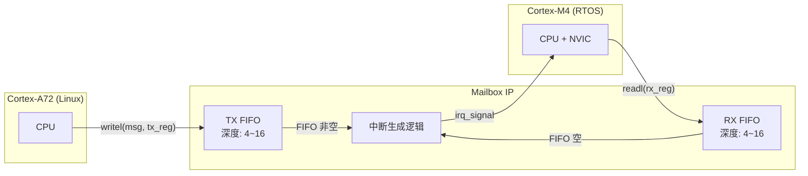
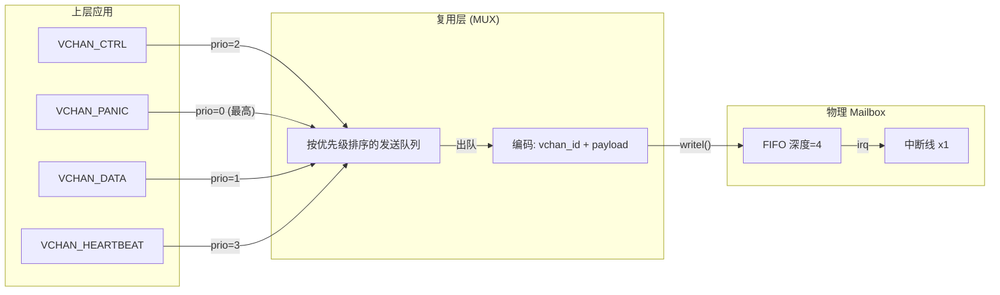

**小节定位说明**
- 难度：I（中级）
- 内容类型：原理解析
- 预计密度：中密度
- 教学意图：Mailbox 是异构核间通信的"门铃系统"，本节建立硬件层认知——理解 Mailbox IP 的寄存器触发逻辑、FIFO 缓冲机制和中断路由方式，为后续 Linux Mailbox 子系统（3.2）和延迟优化（3.3）提供硬件基础。不涉及 Linux 驱动 API（留给 3.2），也不展开共享内存（2.1 已讲透）。

---

## <strong>Mailbox 硬件框架</strong> <span class="badge-i">I</span>

 carveout 共享内存解决了"数据放在哪"，但还缺一个"对方何时来取"的信号机制。让从核持续轮询共享内存中的标志位会空耗 CPU 和总线带宽；而 Mailbox（邮箱）就是专门用来传递"通知信号"的硬件模块——它不负责传输 payload，只负责在纳秒级时间内告诉对方核"有新消息到了"。

<span class="red">Mailbox</span>是异构 SoC 中集成的一种轻量级核间中断触发器，通常由一组寄存器、小深度 FIFO 和中断路由逻辑构成。它的设计哲学是"最小化通知"：一次写寄存器操作即可触发对方核的中断线，软件无需关心底层中断传播路径。

---

### <strong>Mailbox IP 典型设计</strong>

Mailbox IP 的硬件实现因厂商而异，但核心结构遵循相似范式：发送方通过写寄存器投递消息，接收方通过读寄存器获取消息，同时触发或清除中断。

| 组件 | 功能 | 典型位宽 | 跨核注意点 |
|------|------|----------|------------|
| 发送寄存器（TX Register） | 发送方写入消息或触发码 | 32 位 | 写操作即触发中断，无需额外配置 |
| 接收寄存器（RX Register） | 接收方读取消息内容 | 32 位 | 读操作通常自动清除接收中断标志 |
| FIFO 缓冲 | 暂存多笔未读消息 | 1~16 深度 | 溢出时行为因 IP 而异（丢弃/阻塞/挂起） |
| 中断线 | 连接至 GIC 或 NVIC | 1~N 条 | 需确认中断目标核的 GIC SPI 编号 |



<span class="blue">Mailbox 的 FIFO 深度直接决定了突发消息的缓冲能力。深度为 1 的 Mailbox 是"直通型"——写一次触发一次中断，接收方必须在中断处理中立即读走，否则下一次写入可能覆盖或阻塞。深度为 4 或 8 的 Mailbox 允许发送方连续投递多条通知而无需等待接收方逐条确认。</span><br>

> ⚠️ 【实战避坑】在 bring-up 阶段，务必通过读取 Mailbox IP 的 `FIFO_STATUS` 寄存器确认实际深度。某些 SoC 数据手册标注 FIFO 深度为 4，但硬件实现中仅使用了 1 级缓冲，其余为保留位。若按 4 级深度做批量发送，后 3 条消息会被静默丢弃，导致从核只收到 1 条通知而遗漏 3 个数据包。
{: .warning }

---

### <strong>Doorbell 机制</strong>

<span class="red">Doorbell（门铃）</span>是 Mailbox 中最常用的触发模式：发送方写入一个无实际语义的消息字（通常只写 0x1 或消息 ID），Mailbox IP 检测到写操作后，立即向接收方核的中断控制器（GIC 或 NVIC）发起中断请求。接收方核被中断唤醒，进入 ISR（中断服务程序），读取 Mailbox 寄存器确认通知来源，然后转向共享内存取走实际 payload。

Doorbell 的核心价值在于"解耦通知与数据"：通知本身不含数据，仅含"哪个通道有数据"的提示。这种分离使 Mailbox 可以用极窄的位宽（32 位寄存器）承载任意长度 payload 的到达通知。

```c
// 文件路径: drivers/mailbox/imx-mailbox.c (NXP i.MX 平台 Mailbox 驱动)
// 场景: 通过写 MU 寄存器触发 Cortex-M 核中断

static int imx_mu_send_data(struct mbox_chan *chan, void *data)
{
    struct imx_mu_priv *priv = chan->priv;
    u32 *arg = data;

    /* [L1] 向 Mailbox ACR 寄存器写入 32 位触发码 */
    /* [L2] 写操作本身即触发硬件中断逻辑，无需额外配置 GIC */
    writel(*arg, priv->base + MU_ACR0);
    // [L3] 在 i.MX8M Plus 上，ACR 对应 Messaging Unit 的发送通道 0

    return 0;
}
```

接收方的 ISR 通常极简，只做两件事：读取 Mailbox 寄存器清除中断源；向 IPC 框架（如 RPMsg 或自定义协议）投递一个"通道 X 有数据"的事件。实际的数据拷贝和协议解析放在线程上下文或底半部（bottom half）中执行，避免 ISR 过长阻塞其他中断。

```c
// 文件路径: firmware/m4/mailbox_isr.c (FreeRTOS 从核侧 ISR 示例)
// 场景: Cortex-M 核响应 Mailbox 中断，通知 RPMsg 层处理

void MU_IRQHandler(void)
{
    uint32_t flag;
    BaseType_t xHigherPriorityTaskWoken = pdFALSE;

    /* [L1] 读取 Mailbox 状态寄存器，确认中断源 */
    flag = MU_GetStatusFlags(MU_BASE);

    /* [L2] 若标志位表明 A 核发来消息 */
    if (flag & kMU_Rx0FullFlag) {
        /* [L3] 读取数据清除中断（某些 IP 读即清，有些需显式写 ACK） */
        (void)MU_ReceiveMsgNonBlocking(MU_BASE, 0, &rx_word);

        /* [L4] 通知 RPMsg 线程，共享内存中有新数据待处理 */
        xSemaphoreGiveFromISR(rpmsg_rx_sem, &xHigherPriorityTaskWoken);
    }

    /* [L5] 上下文切换提示 */
    portYIELD_FROM_ISR(xHigherPriorityTaskWoken);
}
```

> 📚 【补充说明】Doorbell 的"消息字"通常不承载实际数据，但在某些简化设计中，32 位寄存器会被复用为"短消息通道"——直接传递 4 字节状态码或命令 ID。这省去了共享内存的访问延迟，但限制了消息大小，适用于"启动/停止/心跳"等控制类信令，不适合传感器数据 payload。
{: .tip }

---

### <strong>常见 SoC 实例对比</strong>

不同厂商的 Mailbox IP 在寄存器组织、FIFO 深度、中断映射上差异显著，直接影响驱动实现和设备树配置。

| 平台 | Mailbox IP | FIFO 深度 | 中断映射 | 特色机制 | 典型应用场景 |
|------|-----------|-----------|----------|----------|--------------|
| TI AM62x | MAILBOX | 4 级 FIFO | GIC SPI + NVIC | 支持 12 个独立消息队列 | 工业网关、PLC 控制 |
| Xilinx Zynq-7000 | OCM + MAILBOX | 无 FIFO（直通） | GIC PPI | 通过片上存储器中断触发 | FPGA+ARM 协同 |
| NXP i.MX8M Plus | Messaging Unit (MU) | 4 级 FIFO | GIC SPI | 支持通用中断 + 消息寄存器 | 语音处理、视觉 AI |
| STM32MP1 | IPCC | 2 通道 × 1 级 | NVIC + GIC | 硬件流控位（ occupied/free） | 工业 HMI、电机控制 |

<span class="red">TI MAILBOX</span>采用多队列设计，每个队列对应一对 TX/RX FIFO 和独立中断线。Linux 核可以通过不同队列向从核的不同任务发送通知，天然支持通道隔离。设备树中通过 `mboxes` 属性指定队列索引。

```dts
// 文件路径: arch/arm64/boot/dts/ti/k3-am62.dtsi
// 场景: TI AM62x 的 Mailbox 设备树配置

mailbox: mailbox@2900000 {
    compatible = "ti,am62-mailbox";
    reg = <0x00 0x2900000 0x00 0x1000>;
    interrupts = <GIC_SPI 10 IRQ_TYPE_LEVEL_HIGH>;  // [L1] GIC SPI 10 号中断
    #mbox-cells = <1>;  // [L2] 1 个 cell 表示队列索引
    ti,mbox-num-users = <4>;  // [L3] 4 个独立消息队列
    ti,mbox-num-fifos = <12>; // [L4] 12 个 FIFO 通道
};
```

<span class="red">Xilinx Zynq OCM（On-Chip Memory）Mailbox</span>则完全不同。它没有 FIFO，而是利用片上存储器的特定地址作为"触发窗口"：写该地址即触发中断，读该地址即清除中断。这种设计极简，但对软件流控要求极高——发送方必须在写之前确认接收方已读走上一次数据，否则直接覆盖。

```c
// 文件路径: drivers/mailbox/zynq-mailbox.c (概念化片段)
// 场景: Zynq OCM 直通型 Mailbox 的读写

static int zynq_mbox_send(struct mbox_chan *chan, void *data)
{
    struct zynq_mbox *mbox = chan->priv;
    u32 msg = *(u32 *)data;

    /* [L1] 直通型 Mailbox 无 FIFO，必须等待接收方读走 */
    /* [L2] 轮询 STATUS 寄存器的 ACK 位，超时约 1ms */
    if (readl_poll_timeout(mbox->base + STATUS, val,
                           val & ACK_BIT, 10, 1000)) {
        return -ETIMEDOUT;  // [L3] 接收方未响应，可能已崩溃
    }

    /* [L4] 写 OCM 触发地址，同时生成中断 */
    writel(msg, mbox->base + OCM_TRIGGER_ADDR);

    return 0;
}
```

<span class="red">NXP i.MX MU（Messaging Unit）</span>介于两者之间。它提供 4 个 32 位消息寄存器（MR0~MR3），每个寄存器对应独立的收发中断。MU 还支持"通用中断"模式：不传输数据，仅发送一个纯中断脉冲。这在需要极低延迟的同步信号场景（如电机控制中的周期触发）中非常有用。

```c
// 文件路径: firmware/m4/mu_init.c (i.MX8M 从核侧 MU 初始化)
// 场景: 配置 MU 为通用中断模式，用于 1kHz 控制周期同步

void mu_init_for_sync(void)
{
    /* [L1] 启用通用中断 0，禁用消息寄存器中断 */
    MU_EnableInterrupts(MU_BASE, kMU_GenInt0InterruptEnable);

    /* [L2] 配置 NVIC 优先级为最高（电机控制不可被其他中断延迟） */
    NVIC_SetPriority(MU_IRQn, configMAX_SYSCALL_INTERRUPT_PRIORITY - 1);
}
```

> <span class="blue">核心结论：Mailbox 的硬件差异直接决定了上层软件的流控策略。TI 的多队列 FIFO 适合高并发消息通道；Zynq 的直通型 OCM 适合极简控制信令但需软件 ACK；i.MX 的 MU 则在消息传输和通用中断之间提供了灵活选择。bring-up 时务必先确认 SoC TRM 中 Mailbox IP 的 FIFO 深度、中断清除方式和溢出行为，再设计上层协议。</span>
{: .conclusion }

---

**小节定位说明**
- 难度：E（高级）
- 内容类型：原理解析与实战结合
- 预计密度：高密度
- 教学意图：3.1 和 3.2 分别建立了硬件层和软件层的 Mailbox 认知。本节进入实战调优——Mailbox 中断路径的延迟分解、高吞吐场景下的批处理策略（NAPI 思想移植）、以及轮询模式的适用边界。这是从"能用"到"好用"的关键跃迁，直接决定异构通信在工业控制和高通量数据通路中的可用性。

---

## <strong>中断延迟与吞吐量权衡</strong> <span class="badge-e">E</span>

Mailbox 解决了"通知对方"的问题，但通知本身是有代价的。写一次 Mailbox 寄存器触发中断，从硬件信号传递到对方核真正开始处理数据，中间经历的每一个环节都会引入延迟。在 1kHz 电机控制闭环中，100μs 的延迟可能吃掉整个控制周期的 10%；在 1Gbps 网络透传场景中，每包都触发中断会让 CPU 80% 的时间耗在上下文切换上。

<span class="red">中断延迟与吞吐量是一对永恒的矛盾</span>：中断越频繁，单次延迟越低（响应快），但累积开销越大（吞吐差）；中断越稀疏，单次处理量越大（吞吐高），但首包等待时间越长（延迟高）。本节的目标不是消除矛盾，而是提供可量化的调参方法，让工程师根据业务场景找到最优平衡点。

---

### <strong>中断路径延迟分解</strong>

一次完整的 Mailbox 中断从发送方写寄存器到接收方用户态线程处理数据，时序链可以精确分解为六个阶段：

| 阶段 | 名称 | 典型耗时 | 决定因素 | 优化手段 |
|------|------|----------|----------|----------|
| T1 | 硬件传播 | 50~200 ns | Mailbox IP 到 GIC/ NVIC 的物理走线 | 不可优化，由 SoC 设计决定 |
| T2 | 中断仲裁 | 100~500 ns | GIC 优先级排序、SPI/PPI 路由延迟 | 提升 Mailbox 中断优先级 |
| T3 | 上下文保存 | 1~3 μs | CPU 寄存器压栈、模式切换（EL0→EL1→IRQ） | 精简 ISR 寄存器使用 |
| T4 | 顶半部执行 | 0.5~2 μs | ISR 中读取 Mailbox 寄存器、清中断源 | 顶半部只做最小操作 |
| T5 | 底半部调度 | 5~50 μs | tasklet/workqueue 调度延迟、CPU 负载 | 改用 threaded IRQ 或轮询 |
| T6 | 用户态唤醒 | 10~100 μs | 进程调度、上下文切换、Cache 冷启动 | CPU 亲和性绑定、预取 |

```mermaid
gantt
    title Mailbox 中断路径时序分解 (典型值)
    dateFormat X
    axisFormat %s μs
    
    section 硬件层
    T1 硬件传播       : 0, 0.15
    T2 中断仲裁       : 0.15, 0.5
    
    section 内核层
    T3 上下文保存     : 0.5, 2.5
    T4 顶半部执行     : 2.5, 4.0
    T5 底半部调度     : 4.0, 20.0
    
    section 用户层
    T6 用户态唤醒     : 20.0, 60.0
```

<span class="blue">在工业控制场景中，T5 和 T6 是主要矛盾点。Linux 内核的顶半部（hardirq）虽然可以强制抢占任何线程，但受限于 ISR 不能睡眠、不能持有复杂锁，实际数据处理必须推迟到底半部（softirq/tasklet）或线程化中断（threaded IRQ）。底半部的调度延迟直接受系统负载影响——如果同一 CPU 上正在运行一个 CPU 密集型的日志压缩任务，底半部可能被延迟数十微秒。</span><br>

测量方法是定位问题的第一步。内核提供了 `ftrace` 的 `irqsoff` tracer 和 `function_graph` tracer，可以精确捕获中断关闭时长和 ISR 执行时间：

```bash
# 测量中断关闭时长（找出延迟元凶）
$ echo irqsoff > /sys/kernel/debug/tracing/current_tracer
$ echo 1 > /sys/kernel/debug/tracing/tracing_on
# 运行 Mailbox 压力测试后
$ cat /sys/kernel/debug/tracing/trace
# 输出示例：
#  irqsoff latency: 45.3 us
#  => __schedule() 占 38.2 us（说明被调度延迟阻塞）

# 测量具体 ISR 执行时间
$ echo function_graph > /sys/kernel/debug/tracing/current_tracer
$ echo ti_mbox_irq_handler > /sys/kernel/debug/tracing/set_ftrace_filter
$ echo 1 > /sys/kernel/debug/tracing/tracing_on
$ cat /sys/kernel/debug/tracing/trace | head -20
# 输出示例：
#  0)   1.234 us    |  ti_mbox_irq_handler();
#  0)   0.456 us    |  mbox_chan_received_data();
#  0)   2.890 us    |  rpmsg_mbox_rx_cb();
```

> ⚠️ 【实战避坑】`irqsoff` tracer 会引入额外开销，测量值比真实值偏大 10%~20%。在延迟敏感型调优中，建议结合 `trace_marker` 在用户态和内核态关键位置打时间戳，通过 `ftrace` 的 `trace_clock=local` 获取纳秒级精度。另外，务必确认 GIC 配置中 Mailbox 中断未被标记为 IRQF_SHARED——共享中断会强制遍历所有 handler，增加 T2 仲裁延迟。
{: .warning }

---

### <strong>中断合并与批处理</strong>

当 Mailbox 承载高吞吐数据通路（如 1080p 视频帧分片、批量传感器采样）时，逐包中断的模式会让 CPU 陷入"中断风暴"：ISR 刚返回，新中断又到来，系统 80% 时间耗在上下文切换，有效吞吐远低于理论带宽。

Linux 网络子系统的 <span class="red">NAPI（New API）</span>思想可以直接移植到 Mailbox 场景：不是每来一个包就中断一次，而是首次中断唤醒轮询状态机，然后在轮询循环中批量处理所有待收消息，直到队列为空或达到预算上限，再重新开启中断。

```c
// 文件路径: drivers/mailbox/mbox-napi.c (概念实现，展示 NAPI 思想移植)
// 场景: Mailbox 接收路径的批处理优化

struct mbox_napi_ctx {
    struct napi_struct napi;
    struct mbox_chan *chan;
    int budget;           // [L1] 单次轮询最大处理数
};

static int mbox_napi_poll(struct napi_struct *napi, int budget)
{
    struct mbox_napi_ctx *ctx = container_of(napi, struct mbox_napi_ctx, napi);
    struct mbox_chan *chan = ctx->chan;
    int processed = 0;

    while (processed < budget) {
        /* [L2] 批量读取 Mailbox FIFO，直到空或达到 budget */
        void *msg = mbox_fetch_message(chan);
        if (!msg)
            break;

        /* [L3] 直接递交到上层，无额外调度延迟 */
        chan->cl->rx_callback(chan, msg);
        processed++;
    }

    if (processed < budget) {
        /* [L4] 队列为空，退出轮询模式，重新使能中断 */
        napi_complete_done(napi, processed);
        mbox_enable_irq(chan);
    } else {
        /* [L5] 达到 budget，保持轮询，再次调度本 napi */
        /* [L6] 避免单次占用 CPU 过久，平衡延迟与公平性 */
    }

    return processed;
}

static void mbox_napi_rx_callback(struct mbox_chan *chan, void *msg)
{
    struct mbox_napi_ctx *ctx = chan->con_priv;

    /* [L7] 首次中断：关闭硬中断，触发 NAPI 轮询 */
    mbox_disable_irq(chan);
    napi_schedule(&ctx->napi);
}
```

批处理策略的关键参数是 `budget`（单次轮询处理上限）和 `poll_interval`（轮询间隔）。`budget` 过大导致单次占用 CPU 过久，影响其他实时任务；`budget` 过小则退化为逐包中断模式。在 i.MX8M Plus 平台上，Mailbox FIFO 深度为 4，`budget=4` 是理论最优值——一次轮询刚好清空 FIFO，无需二次进入。

> 📚 【补充说明】NAPI 移植到 Mailbox 需要内核版本 ≥ 5.10，且 Mailbox 控制器驱动支持 `mbox_disable_irq()`/`mbox_enable_irq()` 的动态开关。旧版内核或简配 Mailbox IP 可能不支持中断屏蔽，此时需退化为"中断 + 忙轮询"的混合模式：ISR 中读取 FIFO 首条，然后启动一个高优先级内核线程持续轮询剩余条目。
{: .tip }

---

### <strong>轮询模式的适用边界</strong>

当延迟要求进入微秒级（如电机 FOC 控制 50μs 周期），中断路径的 T1~T6 累积延迟已不可接受。此时唯一的选择是<span class="red">轮询模式（Polling Mode）</span>：接收方核以固定频率检查 Mailbox 状态寄存器或共享内存标志位，完全绕过中断子系统。

轮询的代价是 CPU 占用。一个绑定到隔离 CPU 上的轮询线程会以 100% 利用率空转，直到检测到新消息。这仅在以下场景值得考虑：

- 核数充裕：8 核 Cortex-A72 中隔离 1 核专门轮询，剩余 7 核运行 Linux 业务
- 延迟极敏感：硬实时闭环控制，中断抖动不可接受
- 消息频率极高：消息间隔 < 中断处理开销（如 10μs 一条消息）

```c
// 文件路径: drivers/rpmsg/rpmsg_poll.c (概念实现)
// 场景: 隔离 CPU 上的 Mailbox 轮询线程

static int rpmsg_poll_thread(void *data)
{
    struct rpmsg_poll_ctx *ctx = data;
    u32 last_head = 0;

    /* [L1] 绑定到隔离 CPU，避免被调度器迁移 */
    cpumask_t cpu_mask;
    cpumask_clear(&cpu_mask);
    cpumask_set_cpu(ctx->cpu_id, &cpu_mask);
    sched_setaffinity(0, &cpu_mask);

    /* [L2] 提升为实时调度策略，优先级高于普通线程 */
    struct sched_param param = { .sched_priority = 80 };
    sched_setscheduler(current, SCHED_FIFO, &param);

    while (!kthread_should_stop()) {
        u32 head = READ_ONCE(ctx->shm->rx_head);

        /* [L3] 内存屏障确保读取的是最新值 */
        smp_rmb();

        if (head != last_head) {
            /* [L4] 批量处理所有新到消息 */
            while (last_head != head) {
                process_one_msg(ctx, last_head % ctx->ring_size);
                last_head++;
            }
        } else {
            /* [L5] 无消息时，短暂退让避免完全烧 CPU */
            /* [L6] 在实时内核中可用 sched_yield()，标准内核用 udelay(1) */
            cpu_relax();
        }
    }

    return 0;
}
```

CPU 亲和性绑定是轮询模式的关键配套措施。通过 `isolcpus` 内核启动参数隔离特定 CPU，再通过 `sched_setaffinity()` 将轮询线程绑定到该 CPU，可以避免线程被调度器迁移到其他核导致的 Cache 冷启动和 TLB 失效。

```bash
# 内核启动参数：隔离 CPU 2 和 3，专用于轮询线程
$ cat /proc/cmdline
... isolcpus=2,3 nohz_full=2,3 rcu_nocbs=2,3

# 确认隔离生效
$ cat /sys/devices/system/cpu/isolated
2-3

# 查看轮询线程的 CPU 亲和性
$ taskset -pc <pid_of_poll_thread>
pid <pid>'s current affinity list: 2
```

> <span class="blue">核心结论：Mailbox 中断路径的延迟是可分解、可测量、可优化的。T1~T4 的硬件和顶半部延迟通常不可调，T5~T6 的底半部和用户态延迟是主要优化空间。NAPI 批处理策略适用于高吞吐场景，将逐包中断转化为批量轮询；纯轮询模式适用于极延迟敏感场景，但需以隔离 CPU 和实时调度策略为代价。调优前务必通过 ftrace 量化当前基线，避免盲目优化。</span>
{: .conclusion }

---

**小节定位说明**
- 难度：E（高级）
- 内容类型：原理解析与实战结合
- 预计密度：高密度
- 教学意图：3.1 建立了硬件层认知，3.2 建立了软件抽象，3.3 解决了单通道的延迟与吞吐权衡。本节进入更复杂的工程场景——当单一物理 Mailbox 通道需要承载多种类型的消息（控制信令、数据流、心跳）时，如何通过软件层实现通道复用、优先级调度和流控。这是从"单通道能用"到"多通道好用"的架构级跃迁。

---

## <strong>多通道 Mailbox 设计</strong> <span class="badge-e">E</span>

TI AM62x 有 12 个 FIFO 通道，i.MX8M Plus 有 4 个消息寄存器对，Zynq 的 OCM 甚至只有 1 个直通寄存器。在复杂的异构系统中，这些物理通道数量往往远小于实际需要的逻辑通信端点：RPMsg 控制通道、RPMsg 数据通道、心跳检测、固件升级、调试日志、紧急停机信号——每个都需要独立的传输语义。

<span class="red">多通道 Mailbox 设计</span>的核心命题是：用有限的物理通道，承载无限（相对而言）的逻辑端点，同时保证高优先级消息不被低优先级流量阻塞，且发送方不会因接收方处理慢而无限堆积导致内存耗尽。

<span class="blue">这不是硬件问题，是软件架构问题。物理通道数量由晶圆厂决定，逻辑通道的复用、调度、流控由工程师设计。</span><br>

---

### <strong>通道复用与虚拟化</strong>

当物理通道数量不足时，最直接的方案是在单一 Mailbox 通道上复用多个逻辑端点。这需要在消息字（message word）或共享内存头部中增加<span class="red">虚拟通道 ID（vchan_id）</span>字段，接收方根据 ID 将消息分发给不同的处理模块。

```c
// 文件路径: firmware/common/mbox_multiplex.h
// 场景: 32 位 Mailbox 消息字的虚拟通道复用协议

#define MBOX_VCHAN_BITS     8
#define MBOX_VCHAN_SHIFT    24
#define MBOX_VCHAN_MASK     ((1U << MBOX_VCHAN_BITS) - 1)

#define MBOX_PAYLOAD_MASK   ((1U << MBOX_VCHAN_SHIFT) - 1)

/* [L1] 消息字编码: [31:24] 虚拟通道 ID, [23:0] 有效载荷或长度 */
static inline u32 mbox_encode(u8 vchan_id, u32 payload)
{
    return ((u32)vchan_id << MBOX_VCHAN_SHIFT) | (payload & MBOX_PAYLOAD_MASK);
}

/* [L2] 解码示例 */
static inline u8 mbox_decode_vchan(u32 word)
{
    return (word >> MBOX_VCHAN_SHIFT) & MBOX_VCHAN_MASK;
}

/* [L3] 虚拟通道分配表 */
enum {
    VCHAN_CTRL = 0,      // [L4] RPMsg 控制信令 (握手/断开)
    VCHAN_DATA = 1,      // [L5] RPMsg 数据 payload
    VCHAN_HEARTBEAT = 2, // [L6] 周期性心跳，用于存活检测
    VCHAN_PANIC = 3,     // [L7] 紧急停机，最高优先级
    VCHAN_MAX = 256,     // [L8] 8 位 ID 理论上限
};
```

虚拟通道复用的代价是：所有消息共享同一个 FIFO 深度和同一个中断线。如果低优先级的数据通道突发大量消息，会占满 FIFO，导致高优先级的控制信令无法入队。因此复用层之上必须叠加优先级调度机制。



> ⚠️ 【实战避坑】在 32 位 Mailbox 上复用虚拟通道时，有效载荷仅剩 24 位（约 16MB 范围）。如果 payload 需要传递共享内存偏移量，而 carveout 基址位于 0x90000000（超过 24 位可表示的 0xFFFFFF），必须改为传递"相对于 carveout 基址的偏移"而非绝对物理地址。这是一个极易在 bring-up 阶段踩坑的边界条件。
{: .warning }

---

### <strong>优先级与抢占</strong>

虚拟通道复用后，同一物理 FIFO 中可能混杂不同优先级的消息。Mailbox 硬件本身不具备优先级队列能力（FIFO 是严格的先进先出），因此优先级调度必须在软件发送端实现。

<span class="red">优先级发送队列</span>是最直接的实现：上层驱动将待发送消息按优先级插入有序队列，发送线程始终从队首取消息写入 Mailbox。高优先级消息（如 `VCHAN_PANIC` 紧急停机）可以插队到队首，低优先级消息（如 `VCHAN_DATA` 批量传感器数据）在队尾等待。

```c
// 文件路径: drivers/mailbox/mbox_prio.c (概念实现)
// 场景: 带优先级抢占的多通道 Mailbox 发送

struct mbox_prio_msg {
    struct list_head node;
    u8 vchan_id;
    u32 payload;
    int prio;               // [L1] 数值越小优先级越高
    ktime_t enqueue_time;   // [L2] 入队时间，用于老化检测
};

struct mbox_prio_queue {
    struct list_head queue;     // [L3] 按 prio 排序的有序链表
    spinlock_t lock;
    struct mbox_chan *chan;
};

static int mbox_prio_send(struct mbox_prio_queue *pq, u8 vchan, u32 payload, int prio)
{
    struct mbox_prio_msg *msg, *iter;
    unsigned long flags;

    msg = kzalloc(sizeof(*msg), GFP_ATOMIC);
    msg->vchan_id = vchan;
    msg->payload = payload;
    msg->prio = prio;
    msg->enqueue_time = ktime_get();

    spin_lock_irqsave(&pq->lock, flags);

    /* [L4] 按优先级插入有序队列，同优先级按 FIFO */
    list_for_each_entry(iter, &pq->queue, node) {
        if (prio < iter->prio) {
            list_add_tail(&msg->node, &iter->node);
            goto done;
        }
    }
    list_add_tail(&msg->node, &pq->queue);  // [L5] 优先级最低，放到末尾

done:
    spin_unlock_irqrestore(&pq->lock, flags);

    /* [L6] 触发发送线程处理（若当前空闲） */
    queue_work(pq->send_wq, &pq->send_work);

    return 0;
}

static void mbox_prio_send_worker(struct work_struct *work)
{
    struct mbox_prio_queue *pq = container_of(work, struct mbox_prio_queue, send_work);
    struct mbox_prio_msg *msg;

    while ((msg = mbox_prio_dequeue(pq)) != NULL) {
        u32 word = mbox_encode(msg->vchan_id, msg->payload);

        /* [L7] 调用底层 Mailbox 子系统发送 */
        int ret = mbox_send_message(pq->chan, (void *)(uintptr_t)word);
        if (ret == -EBUSY) {
            /* [L8] FIFO 满，重新入队队首，延迟重试 */
            mbox_prio_requeue_head(pq, msg);
            break;
        }

        kfree(msg);
    }
}
```

优先级机制必须配合<span class="red">背压（Backpressure）</span>才能避免低优先级消息饿死。如果高优先级通道持续产生消息，低优先级队列可能永远得不到发送机会。背压策略包括：为每个虚拟通道设置配额（quota），每轮调度中每个通道最多发送 N 条；或者为消息设置老化超时，超过阈值后强制提升优先级。

```c
// 文件路径: drivers/mailbox/mbox_prio.c (续)
// 场景: 老化超时与配额防饿死

#define MAX_MSG_AGE_US      5000    // [L1] 5ms 老化阈值
#define QUOTA_PER_VCHAN     4       // [L2] 每轮每通道最多 4 条

static struct mbox_prio_msg *mbox_prio_dequeue(struct mbox_prio_queue *pq)
{
    struct mbox_prio_msg *msg, *tmp;
    ktime_t now = ktime_get();
    int quota[VCHAN_MAX] = {0};

    list_for_each_entry_safe(msg, tmp, &pq->queue, node) {
        /* [L3] 老化检测: 低优先级消息等待过久，强制提升 */
        if (ktime_us_delta(now, msg->enqueue_time) > MAX_MSG_AGE_US) {
            msg->prio = 0;  // [L4] 提升到最高优先级
        }

        /* [L5] 配额检查: 该虚拟通道本轮已用完配额，跳过 */
        if (quota[msg->vchan_id] >= QUOTA_PER_VCHAN)
            continue;

        quota[msg->vchan_id]++;
        list_del(&msg->node);
        return msg;
    }

    return NULL;
}
```

> 📚 【补充说明】在硬实时场景中，优先级反转（Priority Inversion）是另一个隐患：如果高优先级任务持有某个锁，而低优先级任务正在该锁保护的临界区内发送 Mailbox 消息，高优先级任务会被阻塞。解决方案是采用优先级继承协议（Priority Inheritance），或在 Mailbox 发送路径中完全避免持有跨通道的共享锁——每个虚拟通道维护独立的发送队列和锁。
{: .tip }

---

### <strong>流控机制</strong>

即使有了优先级调度，如果接收方处理速度跟不上发送方，消息仍然会堆积。在 Mailbox 场景中，堆积可能发生在三个位置：发送端的软件队列、Mailbox 硬件 FIFO、接收端的处理线程。没有流控，最终必然导致内存耗尽或 FIFO 溢出丢包。

<span class="red">信用机制（Credit-Based Flow Control）</span>是 Mailbox 场景中最有效的流控方案。接收方定期向发送方通告"我还能处理多少条消息"（credit），发送方仅在 credit > 0 时发送，每发一条 credit 减一。当 credit 归零，发送方停止发送，等待接收方补充 credit。

```c
// 文件路径: firmware/common/mbox_credit.h
// 场景: 基于 Mailbox 的信用流控协议

struct credit_ctx {
    atomic_t tx_credit;         // [L1] 发送方剩余信用（从接收方通告更新）
    int max_credit;             // [L2] 信用上限，防止突发流量
    struct mbox_chan *chan;
};

/* [L3] 接收方周期性通告信用（通过 Mailbox 或共享内存） */
static void credit_advertise(struct credit_ctx *ctx, int available)
{
    int grant = min(available, ctx->max_credit);
    atomic_set(&ctx->tx_credit, grant);

    /* [L4] 通过 Mailbox 发送 credit 更新通告 */
    u32 word = mbox_encode(VCHAN_CREDIT, (u16)grant);
    mbox_send_message(ctx->chan, (void *)(uintptr_t)word);
}

/* [L5] 发送方在发送前检查信用 */
static int credit_send(struct credit_ctx *ctx, u8 vchan, u32 payload)
{
    int credit = atomic_dec_return(&ctx->tx_credit);

    if (credit < 0) {
        /* [L6] 信用耗尽，恢复计数，返回背压 */
        atomic_inc(&ctx->tx_credit);
        return -EAGAIN;  // [L7] 通知上层应用层缓冲或降速
    }

    u32 word = mbox_encode(vchan, payload);
    return mbox_send_message(ctx->chan, (void *)(uintptr_t)word);
}
```

信用机制的优势是解耦了发送速率与接收速率：发送方不需要知道接收方的具体处理延迟，只需要检查本地维护的信用计数器。缺点是引入了额外的控制消息（credit 通告），占用了少量 Mailbox 带宽。在双向通信场景中，可以将 credit 通告 piggyback（搭载）在反向数据消息的头部，避免单独发送。

对于更轻量的场景，<span class="red">发送窗口（Sliding Window）</span>机制是替代方案：发送方维护一个固定大小的窗口（如 16 条未确认消息），窗口满后停止发送，直到收到接收方的累计确认（ACK）。这类似于 TCP 的滑动窗口，但实现更简单——因为 Mailbox 通道是有序的（FIFO），无需处理乱序重组。

```c
// 文件路径: drivers/mailbox/mbox_window.c (概念实现)
// 场景: 滑动窗口流控，适用于有序 Mailbox 通道

#define WINDOW_SIZE     16

struct mbox_window {
    u32 unacked;            // [L1] 已发送未确认的消息数
    u32 next_seq;           // [L2] 下一个发送序号
    u32 expect_ack;         // [L3] 期望收到的确认序号
    spinlock_t lock;
};

static int mbox_window_send(struct mbox_window *win, u8 vchan, u32 payload)
{
    spin_lock(&win->lock);

    if (win->unacked >= WINDOW_SIZE) {
        spin_unlock(&win->lock);
        return -EAGAIN;     // [L4] 窗口满，触发背压
    }

    u32 seq = win->next_seq++;
    win->unacked++;

    spin_unlock(&win->lock);

    /* [L5] 将序号编码到消息字中，接收方回传 ACK 时携带 */
    u32 word = mbox_encode(vchan, (seq << 16) | (payload & 0xFFFF));
    return mbox_send_message(win->chan, (void *)(uintptr_t)word);
}

/* [L6] 接收方处理完成后回传 ACK */
static void mbox_window_ack(struct mbox_window *win, u32 ack_seq)
{
    spin_lock(&win->lock);

    if (ack_seq >= win->expect_ack) {
        win->unacked -= (ack_seq - win->expect_ack + 1);
        win->expect_ack = ack_seq + 1;
    }

    spin_unlock(&win->lock);

    /* [L7] 窗口释放，唤醒等待的发送线程 */
    wake_up(&win->tx_wait);
}
```

> <span class="blue">核心结论：多通道 Mailbox 设计是软件架构问题而非硬件问题。虚拟通道复用解决了物理通道数量不足；优先级调度与配额防饿死机制保证了关键信令的及时性；信用机制或滑动窗口则防止了接收方过载。这三层机制叠加后，单一 Mailbox 物理通道可以可靠地承载控制、数据、心跳、调试等多种流量，且在高负载下仍保持确定性行为。</span>
{: .conclusion }

---
