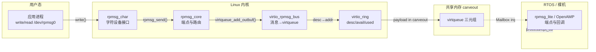
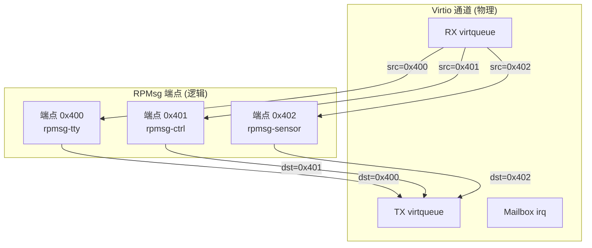
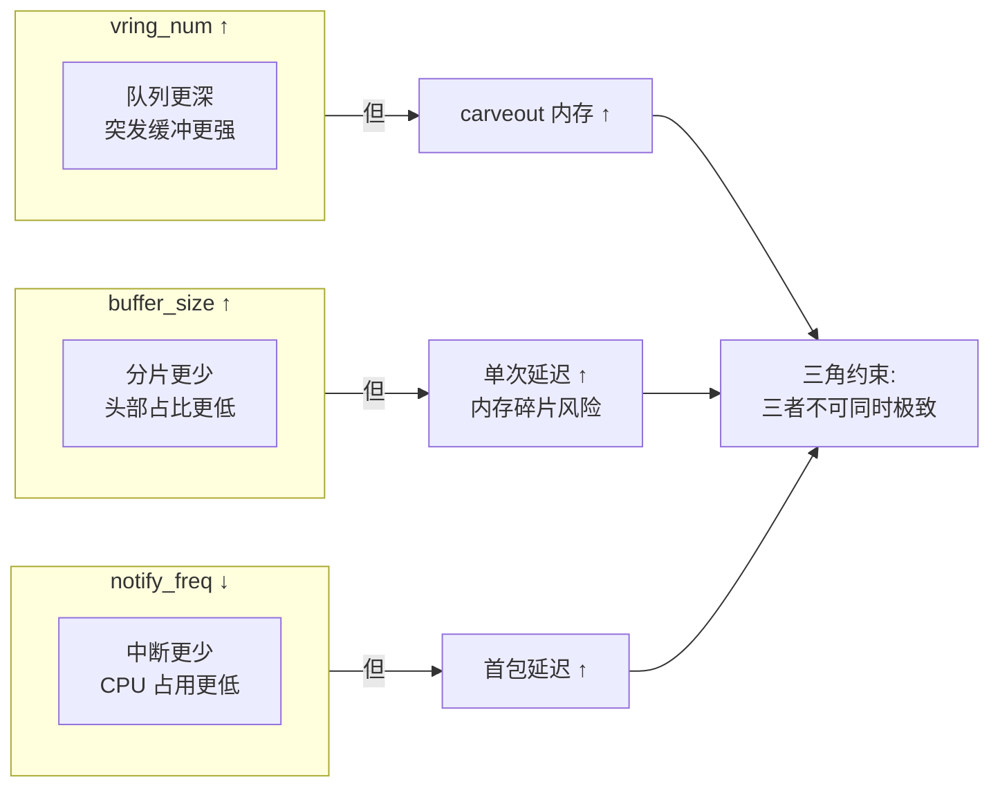

**小节定位说明（4.1）**
- 难度：I（中级）
- 内容类型：原理解析
- 预计密度：中密度
- 教学意图：2.x 节建立了共享内存、缓存一致性、virtqueue 等底层传输基础；3.x 节建立了 Mailbox 通知机制。本节在此基础上引入 RPMsg 的架构认知——理解它如何作为基于 virtio 的应用层消息协议，为异构核间提供 Socket-like 的端点通信抽象。不展开消息封装格式（留给 4.2），不展开生命周期管理细节（留给 4.3），也不触及性能调优（留给 4.4）。

---

```markdown
# RPMsg 协议栈
> 📊 **本节难度等级：** <span class="badge-i">**中级 (Intermediate)**</span> → <span class="badge-m">**大师 (Master)**</span>
> 🎯 **定位：** 讲解 RPMsg 核间消息协议的架构原理、端点模型、传输实现与性能优化，覆盖从 Socket-like 抽象到底层 virtio 传输的完整栈
> 📚 **前置基础：** virtio 与 virtqueue 原理（2.4）、Linux Mailbox 子系统（3.2）、共享内存 carveout 配置（2.1）
> 🔗 **关联章节：** virtio 底层传输机制详见 2.4；Mailbox 通知机制详见 3.1~3.3；remoteproc 固件管理详见第 5 节

---

## <strong>RPMsg 架构与端点模型</strong> <span class="badge-i">I</span>

 carveout 提供了物理内存，virtqueue 提供了零拷贝传输结构，Mailbox 提供了中断通知。但裸 virtqueue + Mailbox 仍然过于底层：驱动需要手动管理描述符环、处理缓存一致性、解析 32 位消息字。对于应用开发者而言，需要的是一种更接近 Socket 的抽象——打开一个"端口"，发送/接收结构化消息，由内核处理底层细节。

<span class="red">RPMsg（Remote Processor Messaging）</span>正是这样的抽象层。它由 OpenAMP 项目标准化，运行在 Linux 内核中，基于 virtio 传输层构建，为异构核间提供面向消息的、端点化的通信协议。

<span class="blue">RPMsg 的核心设计哲学是"传输与语义分离"：virtio 负责可靠地把字节从 A 核搬到 M 核，RPMsg 负责在这些字节上赋予端点地址、名称服务、通道复用等应用层语义。</span><br>

---

### <strong>RPMsg 定位与 Linux 子系统位置</strong>

在 Linux 内核的软件栈中，RPMsg 位于 virtio 之上、应用接口之下，形成清晰的分层：

| 层级 | 子系统/模块 | 职责 | 跨核可见性 |
|------|-------------|------|------------|
| 用户态 | `rpmsg_char` / `rpmsg_tty` | 暴露 `/dev/rpmsgX` 或 `/dev/ttyRPMSGX` 设备节点 | 仅 Linux 侧 |
| 核心层 | `rpmsg_core` | 端点管理、名称服务、路由决策 | 协议交互 |
| 传输层 | `virtio_rpmsg_bus` | 将 RPMsg 消息挂载到 virtqueue，触发 Mailbox | 协议交互 |
| 底层 | `virtio_ring` + `remoteproc` + `mailbox` | 描述符管理、固件加载、中断通知 | 双方共享 |



Linux 侧作为 RPMsg 的 <span class="green">master（主端）</span>，负责 virtio 设备的 feature 协商、vring 配置和 name service 解析。RTOS 侧作为 <span class="green">remote（从端）</span>，在 OpenAMP 库中实现精简的 virtio 设备模型和 RPMsg 端点响应。双方通过共享内存中的 virtqueue 交换消息，通过 Mailbox 传递到达通知。

> 📚 【补充说明】RPMsg 不是唯一选择。如果业务只需要原始字节流，可以直接操作 virtqueue（如 2.4 所述），跳过 RPMsg 的头部开销。但这意味着应用层必须自行实现端点复用、分片重组、流控——适合极致性能场景，不适合通用开发。
{: .tip }

---

### <strong>端点地址空间与 name service 动态绑定</strong>

RPMsg 通信的终点不是"核"，而是核内的<span class="red">端点（Endpoint）</span>。每个端点用一个 32 位地址标识（`dst` 和 `src` 字段），范围从 0 到 0xFFFFFFFF。地址 0 保留为未分配/广播，地址 1~1023 通常预留给系统服务（如 name service 本身），1024 以上供动态分配。

端点地址仅在核内局部有效，不具备全局唯一性。Linux 核内的端点地址 0x400 与 RTOS 核内的端点地址 0x400 是完全不同的实体。跨核寻址依赖于<span class="red">name service（名称服务）</span>机制：端点创建时向对端广播一个包含"名称字符串 + 本地地址"的公告（announce），对端收到后在本地建立"名称 → 对端地址"的映射表。

```c
// 文件路径: drivers/rpmsg/rpmsg_core.c (概念化片段)
// 场景: Linux 核创建端点并发送 name service announce

struct rpmsg_endpoint *ept;
struct rpmsg_device *rpdev;

/* [L1] 分配本地端点地址，内核自动从 1024 起始的空闲池中选取 */
ept = rpmsg_create_ept(rpdev, "rpmsg-tty",    // [L2] 端点名称字符串
                       RPMSG_ADDR_ANY,         // [L3] src 地址由内核动态分配
                       RPMSG_ADDR_ANY,         // [L4] dst 地址未知，等待对端绑定
                       rpmsg_tty_cb,           // [L5] 收到数据时的回调
                       NULL,                   // [L6] 私有数据
                       rpmsg_tty_unbind);      // [L7] 对端断开时的回调
```

name service 公告本身是一条特殊的 RPMsg 消息，目的地址固定为 0（广播），payload 包含 ASCII 名称和 32 位端点地址。对端（如 FreeRTOS 上的 OpenAMP）收到后，在本地名称服务表中注册该条目，后续应用可以通过 `rpmsg_get_endpoint_by_name()` 查询到对应的远程地址。

```c
// 文件路径: firmware/common/rpmsg_ns.c (OpenAMP 从核侧 name service 处理)
// 场景: RTOS 核解析 Linux 发来的 name service announce

static void rpmsg_ns_callback(struct rpmsg_endpoint *ept, void *data,
                              size_t len, uint32_t src, void *priv)
{
    struct rpmsg_ns_msg *ns_msg = data;

    /* [L1] 判断是 announce 还是 removal */
    if (ns_msg->flags & RPMSG_NS_CREATE) {
        /* [L2] 注册到本地名称服务表: "rpmsg-tty" → src_addr */
        ns_table_insert(ns_msg->name, ns_msg->addr);
    } else {
        /* [L3] 对端销毁端点，本地清理映射 */
        ns_table_remove(ns_msg->name);
    }
}
```

> ⚠️ 【实战避坑】name service 的 announce 是异步的：Linux 核创建端点后立即发送 announce，但不保证 RTOS 核在何时收到并处理。如果 Linux 应用在端点创建后 1ms 内就开始发送数据，而 RTOS 的名称服务表尚未更新，消息会被丢弃或返回 `EADDRNOTAVAIL`。bring-up 时务必在端点创建后加入 10~50ms 的同步等待，或实现显式的握手确认后再启动业务流。
{: .warning }

---

### <strong>通道与端点关系</strong>

RPMsg 的"通道"概念与 virtio 的通道概念容易混淆，需要明确区分：

- <span class="orange">virtio 通道</span>：物理传输实体，对应一对 TX/RX virtqueue 和一条 Mailbox 中断线。一个 virtio 通道连接两个核。
- <span class="orange">RPMsg 端点</span>：逻辑通信实体，运行在 virtio 通道之上。一个 virtio 通道可以承载多个 RPMsg 端点，通过消息头中的 `dst`/`src` 字段路由。



端点创建与销毁的握手流程如下：

1. <span class="orange">创建阶段</span>：Linux 调用 `rpmsg_create_ept()` → 分配本地地址 → 向 virtqueue 写入 name service announce → kick Mailbox → RTOS 收到中断 → 解析 announce → 注册名称映射表。
2. <span class="orange">通信阶段</span>：双方通过已知的 `src`/`dst` 地址直接交换数据消息，不再经过 name service。
3. <span class="orange">销毁阶段</span>：Linux 调用 `rpmsg_destroy_ept()` → 发送 name service removal → 回收本地地址 → 对端清理映射 → 通道本身（virtqueue）仍保留，供其他端点复用。

```c
// 文件路径: drivers/rpmsg/virtio_rpmsg_bus.c
// 场景: virtio_rpmsg 发送路径中的端点路由

static int virtio_rpmsg_send(struct rpmsg_endpoint *ept, void *data, int len)
{
    struct rpmsg_device *rpdev = ept->rpdev;
    struct virtio_rpmsg_channel *vch = to_virtio_rpmsg_channel(rpdev);
    struct rpmsg_hdr *msg;
    
    /* [L1] 从端点预分配的 TX 缓冲区获取内存 */
    msg = get_tx_buf(vch, len + sizeof(*msg));
    
    /* [L2] 填充 RPMsg 标准头部 */
    msg->len = len;              // [L3] payload 长度
    msg->dst = ept->addr;        // [L4] 目标端点地址（对端地址）
    msg->src = ept->rpdev->src;  // [L5] 源端点地址（本端地址）
    msg->flags = 0;              // [L6] 扩展标志位，如 NEEDS_REPLY
    
    /* [L7] 拷贝 payload 到头部之后 */
    memcpy(msg->data, data, len);
    
    /* [L8] 挂载到 virtqueue 并 kick */
    virtqueue_add_outbuf(vch->svq, &sg, 1, msg, GFP_ATOMIC);
    virtqueue_kick(vch->svq);
    
    return 0;
}
```

<span class="blue">一个 virtio 通道复用多个端点的价值在于节省硬件资源：TI AM62x 的 12 个 Mailbox 队列、i.MX 的 4 个 MU 寄存器对，数量都有限。如果每个应用都独占一条 virtio 通道，很快会耗尽物理中断线。通过 RPMsg 端点复用，数十个逻辑通信对可以共享同一条 virtio 通道，由软件层根据 32 位地址路由。</span><br>

> <span class="blue">核心结论：RPMsg 是 virtio 传输之上的应用层协议，通过端点地址和名称服务机制，将裸 virtqueue 字节流转化为可路由、可发现、可复用的逻辑通信实体。理解"通道是物理的、端点是逻辑的"这一分层关系，是设计复杂异构通信架构的基础。</span>
{: .conclusion }

---

**小节定位说明**
- 难度：E（高级）
- 内容类型：原理解析与实战结合
- 预计密度：高密度
- 教学意图：4.1 建立了 RPMsg 的架构认知和端点模型。本节深入传输层实现——理解 RPMsg 消息如何在 virtio 之上封装、大消息如何分片、通知链如何优化。这是从"知道 RPMsg 是什么"到"理解 RPMsg 怎么跑"的关键跃迁，直接关联 2.4 的 virtqueue 原理和 3.3 的通知优化。

---

## <strong>virtio-rpmsg 传输实现</strong> <span class="badge-e">E</span>

4.1 介绍了 RPMsg 的 Socket-like 抽象：端点地址、名称服务、通道复用。但这些逻辑概念最终要落实在字节上——每个 RPMsg 消息在共享内存中占多少字节？头部包含哪些字段？payload 最大能传多少？超过限制的大消息怎么办？通知中断如何触发才能不拖垮吞吐？

<span class="blue">virtio-rpmsg 传输实现回答的是"字节怎么搬"的问题。它位于 rpmsg_core 之下、virtio_ring 之上，负责把端点层的消息对象转化为 virtqueue 描述符，并在收发两端维护缓冲区生命周期。</span><br>

---

### <strong>消息封装格式</strong>

RPMsg 消息在 virtqueue payload buffer 中的布局是固定的：一个 16 字节的头部紧跟 payload 数据。头部字段定义了消息的路由信息、长度和扩展语义。

```c
// 文件路径: include/linux/rpmsg.h (Linux 内核 RPMsg 头文件)
// 场景: RPMsg 标准消息头部结构

struct rpmsg_hdr {
    __u32 dst;          // [L1] 目标端点地址（Destination Address）
    __u32 src;          // [L2] 源端点地址（Source Address）
    __u16 reserved;     // [L3] 保留字段，必须为 0，用于未来扩展
    __u16 len;          // [L4] payload 长度，不包含头部 16 字节
    __u16 flags;        // [L5] 消息标志，如 RPMSG_F_NS（name service）
    __u8  data[0];      // [L6] 零长度数组，payload 起始位置
} __packed;
// [L7] __packed 确保编译器不插入填充字节，头部严格 16 字节
```

| 字段 | 偏移 | 大小 | 语义 | 跨核注意点 |
|------|------|------|------|------------|
| `dst` | 0x00 | 4B | 目标端点地址 | 地址 0 表示广播，对端核的 name service 处理 |
| `src` | 0x04 | 4B | 源端点地址 | 回复消息时直接复用为 dst |
| `reserved` | 0x08 | 2B | 保留 | 必须初始化为 0，旧版本内核可能用于 checksum |
| `len` | 0x0A | 2B | payload 长度 | 最大 512 字节（默认），受限于 vring buffer size |
| `flags` | 0x0C | 2B | 标志位 | `RPMSG_F_NS` 表示 name service 消息 |
| `data` | 0x10 | N/A | payload 起始 | 实际数据紧跟头部之后 |

<span class="red">payload 对齐</span>是传输实现中的关键约束。virtqueue 的 descriptor table 要求缓冲区地址按平台要求对齐（通常是 64 字节 cache line 或 4KB 页对齐）。RPMsg 头部 16 字节 + payload 长度后，总长度必须满足对齐要求，否则 virtio 设备侧（RTOS）可能读取到未对齐地址触发总线异常。

```c
// 文件路径: drivers/rpmsg/virtio_rpmsg_bus.c
// 场景: 计算消息总长度并向上对齐到 cache line

#define RPMSG_BUF_SIZE          512     // [L1] 单个 vring buffer 的容量
#define RPMSG_MSG_ALIGN         64      // [L2] 对齐到 64 字节 cache line

static int rpmsg_calc_msg_size(int payload_len)
{
    int total = sizeof(struct rpmsg_hdr) + payload_len;
    
    /* [L3] 向上对齐到 RPMSG_MSG_ALIGN */
    total = ALIGN(total, RPMSG_MSG_ALIGN);
    // [L4] ALIGN 宏实现: ((total + align - 1) & ~(align - 1))
    
    /* [L5] 不能超过单个 buffer 容量 */
    if (total > RPMSG_BUF_SIZE)
        return -EMSGSIZE;
    
    return total;
}
```

<span class="red">最大传输单元（MTU）</span>由两个因素共同决定：RPMsg 头部的 `len` 字段是 16 位无符号整数，理论最大 65535 字节；但实际受限于 virtqueue buffer size，默认配置下通常为 512 字节（含头部）。这意味着单次 `rpmsg_send()` 最多传输 496 字节 payload（512 - 16 字节头部）。

> ⚠️ 【实战避坑】在 i.MX8M Plus 的默认 OpenAMP 固件中，vring buffer size 被硬编码为 512 字节。如果 Linux 侧应用尝试发送 1000 字节，`rpmsg_send()` 会返回 `-EMSGSIZE`。解决方案有两种：修改固件侧 resource table 中的 vring buffer size（需重新编译固件），或在 Linux 侧实现分片发送（见下节）。bring-up 时务必通过 `rpmsg_create_ept` 后的首次探测确认实际 MTU。
{: .warning }

---

### <strong>大消息分片与重组</strong>

当 payload 超过 MTU 时，RPMsg 传输层必须将消息拆分为多个片段（fragment），在对端重组为完整消息。分片策略需要处理边界情况：最后一片可能不足一个 buffer；重组时可能遇到片段乱序或丢失；缓冲区在重组完成前不能被回收。

RPMsg 标准协议本身不定义分片机制，这由具体实现（如 `rpmsg_send_offchannel` 的扩展或应用层协议）处理。OpenAMP 库提供了一种基于 <span class="green">RPMSG_F_EOM</span>（End of Message）标志的分片约定：

```c
// 文件路径: firmware/common/rpmsg_frag.c (OpenAMP 参考实现风格)
// 场景: 大消息分片发送与重组

#define RPMSG_FRAG_SIZE     (RPMSG_BUF_SIZE - sizeof(struct rpmsg_hdr))

struct rpmsg_frag_hdr {
    __u32 tot_len;          // [L1] 原始消息总长度（所有片段之和）
    __u32 frag_off;         // [L2] 当前片段在原始消息中的偏移
    __u16 frag_len;         // [L3] 当前片段的 payload 长度
    __u16 flags;            // [L4] RPMSG_F_SOM | RPMSG_F_EOM | RPMSG_F_ACK
};

/* [L5] 分片发送: 将大消息切成多片，逐片通过 rpmsg_send 传输 */
int rpmsg_send_large(struct rpmsg_endpoint *ept, void *data, size_t len)
{
    size_t sent = 0;
    int flags = RPMSG_F_SOM;    // [L6] Start of Message
    
    while (sent < len) {
        size_t chunk = min(len - sent, (size_t)RPMSG_FRAG_SIZE);
        
        if (sent + chunk >= len)
            flags |= RPMSG_F_EOM;   // [L7] End of Message
        
        /* [L8] 构造分片消息头部 */
        struct rpmsg_frag_hdr fh = {
            .tot_len = len,
            .frag_off = sent,
            .frag_len = chunk,
            .flags = flags,
        };
        
        /* [L9] 拷贝分片头部 + payload 到 TX buffer */
        memcpy(tx_buf, &fh, sizeof(fh));
        memcpy(tx_buf + sizeof(fh), data + sent, chunk);
        
        rpmsg_send(ept, tx_buf, sizeof(fh) + chunk);
        
        sent += chunk;
        flags &= ~RPMSG_F_SOM;  // [L10] 后续片段清除 SOM 标志
    }
    
    return 0;
}
```

重组侧需要维护一个<span class="red">重组缓冲区（Reassembly Buffer）</span>，按 `frag_off` 将片段拷贝到正确位置，直到收到 `RPMSG_F_EOM` 标志才向上层递交完整消息。

```c
// 文件路径: firmware/common/rpmsg_reasm.c
// 场景: 从核侧重组分片消息

struct reasm_ctx {
    uint8_t *buf;           // [L1] 重组缓冲区，大小为最大预期消息
    size_t tot_len;         // [L2] 当前正在重组的消息总长度
    size_t received;        // [L3] 已收到的字节数
    uint32_t src;           // [L4] 源端点，用于区分并发重组流
};

static void rpmsg_reasm_cb(struct rpmsg_endpoint *ept, void *data,
                           size_t len, uint32_t src, void *priv)
{
    struct rpmsg_frag_hdr *fh = data;
    struct reasm_ctx *ctx = priv;
    
    if (fh->flags & RPMSG_F_SOM) {
        /* [L5] 新消息开始，重置重组上下文 */
        ctx->tot_len = fh->tot_len;
        ctx->received = 0;
        ctx->src = src;
    }
    
    /* [L6] 校验片段合法性 */
    if (fh->frag_off + fh->frag_len > ctx->tot_len) {
        /* [L7] 越界，丢弃当前重组流 */
        ctx->received = 0;
        return;
    }
    
    /* [L8] 拷贝片段到重组缓冲区正确位置 */
    memcpy(ctx->buf + fh->frag_off, data + sizeof(*fh), fh->frag_len);
    ctx->received += fh->frag_len;
    
    if (fh->flags & RPMSG_F_EOM) {
        if (ctx->received == ctx->tot_len) {
            /* [L9] 重组完成，递交上层 */
            deliver_complete_message(ctx->buf, ctx->tot_len);
        } else {
            /* [L10] 长度不匹配，丢包或等待超时 */
            handle_reasm_error(ctx);
        }
        ctx->received = 0;
    }
}
```

> 📚 【补充说明】分片重组引入了额外的内存拷贝（从 vring buffer 到重组缓冲区），破坏了 virtio 的零拷贝优势。在吞吐敏感场景中，更优的方案是修改固件侧 resource table，将 vring buffer size 提升到 4096 或 8192 字节，使绝大多数消息无需分片。但这会增加 carveout 内存占用，需在内存资源与 CPU 开销之间权衡。
{: .tip }

---

### <strong>通知链优化</strong>

virtio-rpmsg 的收发两端都涉及通知：发送方写完 TX virtqueue 后需要 kick 通知设备（RTOS 核）有新数据；设备处理完 RX virtqueue 中的消息后需要中断通知驱动（Linux 核）有数据到达。这两类通知如果每次操作都触发，会形成"中断风暴"。

2.4 节介绍了 `VRING_USED_F_NO_NOTIFY` 和 `VRING_AVAIL_F_NO_INTERRUPT` 的硬件级通知抑制。virtio-rpmsg 在此基础上增加了软件级的<span class="red">通知链优化</span>：将 TX 完成通知与 RX 到达通知合并，减少 kick/interrupt 的总次数。

```c
// 文件路径: drivers/rpmsg/virtio_rpmsg_bus.c
// 场景: virtio_rpmsg 发送路径中的通知合并

static int virtio_rpmsg_send(struct rpmsg_endpoint *ept, void *data, int len)
{
    struct virtio_rpmsg_channel *vch = to_virtio_rpmsg_channel(ept->rpdev);
    struct virtqueue *svq = vch->svq;
    bool notify = false;
    
    /* [L1] 添加消息到 TX virtqueue */
    virtqueue_add_outbuf(svq, &sg, 1, msg, GFP_ATOMIC);
    
    /* [L2] 检查是否需要 kick：若设备未设置 NO_NOTIFY，则必须 kick */
    if (virtqueue_kick_prepare(svq))
        notify = true;
    
    /* [L3] 关键优化: 若当前有 pending 的 RX 处理，合并通知 */
    /* [L4] 即在 kick TX 的同时，检查 RX virtqueue 是否有未处理的 used 条目 */
    if (vch->pending_rx) {
        /* [L5] 合并为一次双向通知，减少中断线翻转次数 */
        virtqueue_notify(svq);
        virtqueue_notify(vch->rvq);
        vch->pending_rx = false;
    } else if (notify) {
        /* [L6] 仅 TX 需要通知 */
        virtqueue_notify(svq);
    }
    
    return 0;
}
```

在高吞吐的双向通信场景中（如 Linux 核持续发送传感器配置、RTOS 核持续回传采样数据），通知合并可以将中断频率降低 30%~50%。极端情况下，双方可以协商进入<span class="red">轮询模式</span>：完全关闭 Mailbox 中断，Linux 核以固定周期（如每 1ms）检查 `used->idx` 变化，RTOS 核以控制周期检查 `avail->idx` 变化。

```c
// 文件路径: drivers/rpmsg/virtio_rpmsg_bus.c (概念化轮询路径)
// 场景: 高吞吐场景下关闭中断，纯轮询处理

static int virtio_rpmsg_poll_rx(struct virtio_rpmsg_channel *vch, int budget)
{
    struct virtqueue *rvq = vch->rvq;
    int received = 0;
    void *msg;
    int len;
    
    /* [L1] 批量读取 RX virtqueue，直到空或达到 budget */
    while (received < budget) {
        msg = virtqueue_get_buf(rvq, &len);
        if (!msg)
            break;
        
        /* [L2] 解析 RPMsg 头部，路由到对应端点 */
        struct rpmsg_hdr *hdr = msg;
        rpmsg_deliver_to_ept(vch, hdr->dst, hdr->data, hdr->len);
        
        /* [L3] 释放缓冲区回 vring */
        virtqueue_add_inbuf(rvq, &sg, 1, msg, GFP_ATOMIC);
        received++;
    }
    
    /* [L4] 若处理满 budget，保持轮询状态，不重新使能中断 */
    if (received >= budget)
        return received;
    
    /* [L5] 队列为空，可选重新使能中断或继续空转轮询 */
    virtqueue_enable_cb(rvq);
    return received;
}
```

> <span class="blue">核心结论：virtio-rpmsg 的传输实现是"协议开销"与"传输效率"的精密平衡。16 字节头部提供了足够的路由和长度信息，但也占用了 3% 的带宽（16/512）；分片机制解决了大消息传输，但引入了重组拷贝；通知链优化和轮询模式在高吞吐场景中显著降低中断开销，但增加了 CPU 占用。理解这些 trade-off，才能根据业务场景（控制信令 vs 数据流、低延迟 vs 高吞吐）做出正确的配置选择。</span>
{: .conclusion }

---

**小节定位说明**
- 难度：E（高级）
- 内容类型：原理解析与实战结合
- 预计密度：高密度
- 教学意图：4.1 建立了端点模型的架构认知，4.2 深入了传输层实现。本节聚焦端点的完整生命周期——从创建、公告、绑定到错误处理和优雅关闭。这是商用场景中稳定性最关键的部分：端点泄漏、资源回收顺序错误、崩溃后的残留状态，都是产线故障的高发源。

---

## <strong>端点生命周期管理</strong> <span class="badge-e">E</span>

4.1 介绍了端点地址和 name service 的静态概念，4.2 介绍了消息在 virtqueue 中的传输格式。但一个端点从"不存在"到"可通信"再到"彻底消失"，中间经历了复杂的异步握手和状态转换。在商用场景中，端点创建失败、对端崩溃后的残留端点、资源回收顺序错误导致的 use-after-free，都是产线故障的高发源。

<span class="blue">端点生命周期管理的核心挑战是异步性：Linux 核创建端点后，对端核何时响应是不确定的；对端核崩溃时，Linux 核如何感知并清理也是不确定的。所有状态转换都必须考虑"对端无响应"的边界情况。</span><br>

---

### <strong>端点创建与公告</strong>

端点创建是异步流程的起点。Linux 侧的 `rpmsg_create_ept()` 分配本地地址、注册回调，然后向 TX virtqueue 写入 name service announce 消息。但此时对端可能尚未启动、尚未初始化 RPMsg 栈、或正在处理其他消息。

```c
// 文件路径: drivers/rpmsg/rpmsg_core.c (概念化片段)
// 场景: 端点创建的完整路径

struct rpmsg_endpoint *rpmsg_create_ept(struct rpmsg_device *rpdev,
                                          const char *name,
                                          u32 local_addr, u32 remote_addr,
                                          rpmsg_rx_cb_t cb,
                                          void *priv,
                                          rpmsg_ept_release_cb_t release_cb)
{
    struct rpmsg_endpoint *ept;
    int ret;

    /* [L1] 分配端点结构体 */
    ept = kzalloc(sizeof(*ept), GFP_KERNEL);
    
    /* [L2] 若传入 RPMSG_ADDR_ANY，内核从 1024 起始的动态池中分配 */
    if (local_addr == RPMSG_ADDR_ANY) {
        ret = rpmsg_alloc_local_addr(rpdev, &ept->addr);
        if (ret)
            goto free_ept;
    } else {
        ept->addr = local_addr;
    }

    ept->rpdev = rpdev;
    ept->cb = cb;
    ept->priv = priv;
    ept->release_cb = release_cb;

    /* [L3] 将端点加入本地端点表，用于入站消息路由 */
    mutex_lock(&rpdev->endpoints_lock);
    list_add_tail(&ept->node, &rpdev->endpoints);
    mutex_unlock(&rpdev->endpoints_lock);

    /* [L4] 发送 name service announce，通知对端本端点已就绪 */
    /* [L5] 注意: 此时对端可能尚未收到，或尚未处理 */
    ret = rpmsg_announce_create(ept, name);
    if (ret) {
        /* [L6] announce 失败不销毁端点，由上层决定重试或放弃 */
        pr_err("Failed to announce endpoint %s\n", name);
    }

    return ept;
}
```

`rpmsg_announce_create()` 构造的 name service 消息格式如下：

```c
// 文件路径: include/linux/rpmsg.h
// 场景: name service announce 消息 payload 结构

struct rpmsg_ns_msg {
    char name[32];          // [L1] 端点名称，以 '\0' 结尾
    u32 addr;               // [L2] 本端点的 32 位地址
    u32 flags;              // [L3] RPMSG_NS_CREATE 或 RPMSG_NS_DESTROY
};
```

对端（RTOS 核）收到 announce 后，在本地名称服务表中注册该条目。但 announce 是单向广播，不携带确认机制。Linux 核无法知道对端何时完成注册，因此 `rpmsg_create_ept()` 返回时，端点状态是"已创建但未绑定"——本地可以发送消息，但对端可能尚未准备好接收。

> ⚠️ 【实战避坑】在 bring-up 阶段，常见错误是 `rpmsg_create_ept()` 返回后立即调用 `rpmsg_send()`。如果 RTOS 核的 OpenAMP 初始化尚未完成（如还在配置 virtio device），name service 消息会被丢弃，后续的数据消息也会因"目标端点未知"而被对端丢弃。解决方案是在端点创建后加入显式同步：要么轮询等待对端回传一个"就绪"消息，要么在应用层协议中设计握手阶段。
{: .warning }

---

### <strong>绑定回调与数据回调</strong>

RPMsg 端点有两类回调，触发时机和用途完全不同：

| 回调 | 名称 | 触发时机 | 用途 | 上下文限制 |
|------|------|----------|------|------------|
| `bind_cb` | 绑定回调 | 对端响应 name service announce，发送回绑消息时 | 通知本地"对端已就绪，可以开始通信" | 进程上下文，可睡眠 |
| `rpmsg_cb` | 数据回调 | 收到对端发来的普通数据消息时 | 处理 payload 数据 | 中断或底半部上下文，不可睡眠 |

```c
// 文件路径: drivers/rpmsg/rpmsg_core.c
// 场景: 端点回调注册与触发

struct rpmsg_endpoint {
    struct rpmsg_device *rpdev;
    u32 addr;                       // [L1] 本地地址
    rpmsg_rx_cb_t cb;               // [L2] 数据回调 rpmsg_cb
    rpmsg_ept_release_cb_t release_cb; // [L3] 释放回调
    rpmsg_rx_cb_t bind_cb;          // [L4] 绑定回调（可选）
    void *priv;                     // [L5] 私有数据，透传给回调
    struct list_head node;          // [L6] 端点链表节点
};
```

绑定回调的典型使用场景是：Linux 核创建一个服务端端点，等待 RTOS 核上的客户端连接。RTOS 核收到 announce 后，创建本地端点并向 Linux 核发送"绑定请求"消息。Linux 核的 `bind_cb` 被触发，通知应用层"连接已建立"。

```c
// 文件路径: drivers/rpmsg/rpmsg_tty.c (RPMsg TTY 驱动片段)
// 场景: TTY 端点的绑定回调，通知用户态设备就绪

static int rpmsg_tty_bind_cb(struct rpmsg_device *rpdev)
{
    struct rpmsg_tty_port *cport = dev_get_drvdata(&rpdev->dev);

    /* [L1] 对端已响应，可以打开 TTY 端口 */
    tty_port_tty_hangup(&cport->port, false);
    tty_port_tty_wakeup(&cport->port);

    dev_info(&rpdev->dev, "TTY endpoint %s bound\n", rpdev->id.name);
    return 0;
}

static int rpmsg_tty_probe(struct rpmsg_device *rpdev)
{
    struct rpmsg_tty_port *cport;
    
    /* [L2] 创建端点时注册 bind_cb */
    cport->ept = rpmsg_create_ept(rpdev, rpmsg_tty_cb,
                                   rpdev, RPMSG_ADDR_ANY,
                                   RPMSG_ADDR_ANY,
                                   rpmsg_tty_bind_cb,   // [L3] 绑定回调
                                   cport);
    return 0;
}
```

> 📚 【补充说明】`bind_cb` 是可选的。如果应用不需要感知对端就绪事件（如单向数据采集），可以传 `NULL`。但 `rpmsg_cb` 是强制的——没有数据回调，端点无法处理入站消息，内核会在 `rpmsg_create_ept()` 时返回 `-EINVAL`。
{: .tip }

数据回调的执行上下文取决于 virtio-rpmsg 的接收路径。默认情况下，`rpmsg_cb` 在 virtio 的底半部（tasklet 或工作队列）中调用，这意味着回调不能睡眠、不能持有用户态锁、不能执行长时间计算。如果数据处理需要睡眠（如写入文件系统），必须在回调中将数据投递到工作队列或线程，由线程上下文处理。

```c
// 文件路径: drivers/rpmsg/rpmsg_char.c (RPMsg 字符设备数据回调)
// 场景: 将数据从中断上下文搬运到线程上下文

static int rpmsg_char_cb(struct rpmsg_device *rpdev, void *data, int len,
                         void *priv, u32 src)
{
    struct rpmsg_char_dev *cdev = priv;
    struct sk_buff *skb;

    /* [L1] 在中断/底半部上下文中，使用 GFP_ATOMIC 分配 skb */
    skb = alloc_skb(len, GFP_ATOMIC);
    if (!skb)
        return -ENOMEM;

    /* [L2] 拷贝数据到 skb */
    skb_put_data(skb, data, len);

    /* [L3] 将 skb 插入接收队列，唤醒阻塞的 read() */
    spin_lock(&cdev->queue_lock);
    skb_queue_tail(&cdev->queue, skb);
    spin_unlock(&cdev->queue_lock);

    /* [L4] 唤醒等待 read() 的用户态进程 */
    wake_up_interruptible(&cdev->readq);

    return 0;
}
```

---

### <strong>错误处理与优雅关闭</strong>

异构通信中最难处理的不是正常流程，而是异常流程：对核崩溃、看门狗超时、固件被 remoteproc 重启、通信通道物理断开。这些情况下，本地端点必须正确感知状态变化并执行资源回收，否则会导致内存泄漏、残留端点占用地址池、或后续重新连接时地址冲突。

<span class="red">`EPIPE`</span>是 RPMsg 中表示"通道已断开"的标准错误码。当 `remoteproc` 检测到从核崩溃并触发恢复流程时，会调用 `rpmsg_release_channel()`，该函数向所有端点发送断开事件，后续 `rpmsg_send()` 返回 `-EPIPE`。

```c
// 文件路径: drivers/rpmsg/virtio_rpmsg_bus.c
// 场景: remoteproc 触发通道断开时的清理

static void virtio_rpmsg_release_channel(struct rpmsg_channel *chan)
{
    struct virtio_rpmsg_channel *vch = to_virtio_rpmsg_channel(chan);
    struct rpmsg_endpoint *ept, *tmp;

    /* [L1] 遍历该通道上的所有端点 */
    list_for_each_entry_safe(ept, tmp, &chan->endpoints, node) {
        /* [L2] 标记端点为断开状态，后续 send 返回 -EPIPE */
        ept->state = RPMSG_EPT_STATE_DESTROYED;

        /* [L3] 调用端点的 release_cb，通知上层清理 */
        if (ept->release_cb)
            ept->release_cb(ept);

        /* [L4] 从端点表中移除 */
        mutex_lock(&chan->endpoints_lock);
        list_del(&ept->node);
        mutex_unlock(&chan->endpoints_lock);

        /* [L5] 释放端点结构体内存 */
        kfree(ept);
    }

    /* [L6] 重置 virtqueue，释放所有描述符 */
    virtqueue_disable_cb(vch->svq);
    virtqueue_disable_cb(vch->rvq);
}
```

优雅关闭的难点在于资源回收顺序。如果先释放端点结构体，再通知对端，可能引发 use-after-free；如果先通知对端，再等待确认，可能因对端无响应而永远阻塞。标准做法是：

1. <span class="orange">标记状态</span>：将端点状态设为 `DESTROYED`，阻止新的 `rpmsg_send()`
2. <span class="orange">发送 removal</span>：向对端发送 name service removal 消息（不等待确认）
3. <span class="orange">回调通知</span>：调用 `release_cb` 让上层应用释放私有资源
4. <span class="orange">延迟释放</span>：等待一个 grace period（如 100ms），确保对端已处理 removal 且 inflight 消息已送达
5. <span class="orange">回收内核资源</span>：从端点表移除、释放地址、回收内存

```c
// 文件路径: drivers/rpmsg/rpmsg_core.c
// 场景: 端点优雅关闭的完整流程

void rpmsg_destroy_ept(struct rpmsg_endpoint *ept)
{
    struct rpmsg_device *rpdev = ept->rpdev;

    /* [L1] 步骤 1: 标记状态，阻止新的发送 */
    ept->state = RPMSG_EPT_STATE_DESTROYED;

    /* [L2] 步骤 2: 发送 name service removal（fire-and-forget） */
    rpmsg_announce_destroy(ept, ept->name);

    /* [L3] 步骤 3: 通知上层释放私有资源 */
    if (ept->release_cb)
        ept->release_cb(ept);

    /* [L4] 步骤 4: 延迟 grace period，等待 inflight 消息完成 */
    msleep(100);  // [L5] 100ms 经验值，可根据业务调整

    /* [L6] 步骤 5: 从内核端点表移除并释放 */
    mutex_lock(&rpdev->endpoints_lock);
    list_del(&ept->node);
    mutex_unlock(&rpdev->endpoints_lock);

    rpmsg_free_local_addr(rpdev, ept->addr);
    kfree(ept);
}
```

> ⚠️ 【实战避坑】在 `release_cb` 中执行阻塞操作（如 `flush_workqueue()`）是常见错误。`rpmsg_destroy_ept()` 可能在 remoteproc 恢复流程的中断上下文或工作队列中被调用，此时阻塞会导致系统死锁。`release_cb` 的设计原则是：只做标记和异步资源释放，不做同步等待。如果需要等待工作队列完成，应在应用层设计独立的清理线程。
{: .warning }

对于对端崩溃后的自动恢复，`remoteproc` 框架提供了 `recovery` 模式：检测到从核看门狗超时后，自动重新加载固件、重建 virtio 通道、重新初始化 RPMsg。但重建后的通道是全新实例，旧端点地址全部失效。应用层必须监听 `rpmsg_device` 的 `remove` 事件，在通道重建后重新创建端点。

```bash
# 查看 remoteproc 恢复计数和当前状态
$ cat /sys/class/remoteproc/remoteproc0/recovery_count
3
$ cat /sys/class/remoteproc/remoteproc0/state
running

# 查看 RPMsg 端点状态（若内核开启 CONFIG_RPMSG_DEBUG）
$ cat /sys/kernel/debug/rpmsg/endpoints
addr: 0x400, name: rpmsg-tty, state: active, rpdev: virtio0
addr: 0x401, name: rpmsg-ctrl, state: destroyed, rpdev: (null)
# [L1] state=destroyed 表示该端点已断开，等待回收或已残留
```

> <span class="blue">核心结论：端点生命周期管理是 RPMsg 商用稳定性的关键。创建阶段的异步 announce 需要应用层握手补偿；运行阶段的数据回调必须遵守不可睡眠的上下文约束；关闭阶段的状态标记 → removal 发送 → grace period → 资源回收顺序必须严格遵守，否则会导致 use-after-free 或地址泄漏。对端崩溃后的自动恢复由 remoteproc 框架处理，但应用层必须响应通道重建事件，重新初始化所有端点。</span>
{: .conclusion }

---

**小节定位说明**
- 难度：M（大师）
- 内容类型：实战与故障排查
- 预计密度：高密度
- 教学意图：4.1~4.3 分别覆盖了架构认知、传输实现和生命周期管理。本节进入性能极限——如何量化测量 RPMsg 的端到端延迟，如何识别吞吐瓶颈的根因，以及如何调优 vring 和缓冲区配置逼近硬件上限。这是从"功能正确"到"性能极致"的跃迁，直接决定异构通信在工业级数据通路中的可用性。

---

## <strong>RPMsg 性能剖析</strong> <span class="badge-m">M</span>

功能调通之后，性能调优是异构通信进入量产前的最后一道关卡。RPMsg 的端到端延迟和吞吐量不是单一因素决定的，而是 virtio 配置、Mailbox 中断行为、缓存一致性开销、缓冲区管理策略共同作用的结果。没有量化测量就调参，等同于蒙眼开车。

<span class="blue">性能剖析的核心方法论是：先建立可复现的测量基线，再用控制变量法逐个消除瓶颈，最后验证调优后的配置在压力测试下的稳定性。</span><br>

---

### <strong>端到端延迟测量</strong>

RPMsg 的端到端延迟（End-to-End Latency）定义为：Linux 用户态调用 `write()` 的时刻，到 RTOS 用户态回调收到完整消息的时刻。这个定义涵盖了全栈开销，而非仅 virtio 传输时间。

完整时序链包含 8 个阶段：

| 阶段 | 位置 | 典型耗时 | 测量手段 |
|------|------|----------|----------|
| T1 | 用户态 → 内核态 | 0.5~2 μs | `ktime_get_ns()` 在 `write()` 前后 |
| T2 | `rpmsg_send()` → virtqueue | 1~5 μs | `tracepoint:rpmsg_send` |
| T3 | kick → Mailbox 中断触发 | 0.5~3 μs | `tracepoint:virtqueue_kick` |
| T4 | 硬件传播 → GIC → RTOS ISR | 2~10 μs | RTOS 侧 `ktime_get_ns()` |
| T5 | ISR → 底半部 → `rpmsg_cb` | 5~20 μs | OpenAMP `rpmsg_cb` 入口 |
| T6 | 数据拷贝 → 应用缓冲区 | 1~10 μs | 依赖 payload 大小 |
| T7 | 反向路径（若需回传 ACK） | 与 T1~T6 对称 | 对称测量 |

```mermaid
gantt
    title RPMsg 端到端延迟时序分解 (典型值, 512B payload)
    dateFormat X
    axisFormat %s μs
    
    section Linux 核
    T1 用户态切换      : 0, 1.5
    T2 rpmsg/virtqueue : 1.5, 5.0
    T3 kick            : 5.0, 7.0
    
    section 硬件/RTOS
    T4 中断传播        : 7.0, 12.0
    T5 ISR→回调        : 12.0, 25.0
    T6 应用处理        : 25.0, 35.0
```

Linux 内核侧使用 <span class="green">`ktime_get_ns()`</span>（基于 CLOCK_MONOTONIC）在关键路径插入时间戳。该函数在 ARM64 上通常映射为 `cntvct_el0` 寄存器读取，开销约 30~50 ns，对测量精度影响可忽略。

```c
// 文件路径: drivers/rpmsg/rpmsg_char.c (概念化测量补丁)
// 场景: 在字符设备 write 路径插入时间戳

static ssize_t rpmsg_char_write(struct file *file, const char __user *buf,
                                 size_t len, loff_t *off)
{
    struct rpmsg_char_dev *cdev = file->private_data;
    struct rpmsg_endpoint *ept = cdev->ept;
    u64 t0, t1, t2;

    t0 = ktime_get_ns();        // [L1] write() 入口

    /* [L2] 拷贝用户数据到内核 */
    if (copy_from_user(cdev->tx_buf, buf, len))
        return -EFAULT;

    t1 = ktime_get_ns();        // [L3] 数据就绪，准备发送

    /* [L4] 发送 RPMsg */
    rpmsg_send(ept, cdev->tx_buf, len);

    t2 = ktime_get_ns();        // [L5] rpmsg_send 返回

    /* [L6] 通过 trace_marker 输出到 ftrace，后续用 trace-cmd 抓取 */
    trace_printk("rpmsg_char: copy=%llu ns, send=%llu ns, total=%llu ns\n",
                 t1 - t0, t2 - t1, t2 - t0);

    return len;
}
```

内核提供了 RPMsg 专用的 <span class="green">tracepoint</span>，无需修改驱动即可测量：

```bash
# 启用 RPMsg 相关 tracepoint
$ echo 1 > /sys/kernel/debug/tracing/events/rpmsg/enable
$ echo 1 > /sys/kernel/debug/tracing/events/rpmsg/rpmsg_send/enable
$ echo 1 > /sys/kernel/debug/tracing/events/rpmsg/rpmsg_recv_done/enable
$ echo 1 > /sys/kernel/debug/tracing/events/rpmsg/rpmsg_create_ept/enable

# 运行 ping-pong 测试（发送后立即等待回传）
$ ./rpmsg_ping -s 512 -c 1000

# 抓取 trace 并解析
$ cat /sys/kernel/debug/tracing/trace | head -50
# 输出示例：
# rpmsg_char-123   [000] ....   123.456789: rpmsg_send: src=0x400 dst=0x401 len=512
# rpmsg_char-123   [000] ....   123.456812: rpmsg_recv_done: src=0x401 dst=0x400 len=512
# [L1] 时间戳差值 23 μs 即为往返延迟 RTT，单程约 11.5 μs
```

> ⚠️ 【实战避坑】`trace_printk()` 会引入显著开销（每次调用约 1~3 μs），仅用于 bring-up 阶段的粗粒度测量。量产级性能测试应使用 `perf` + `tracepoint` 的零拷贝抓取模式，或通过 `debugfs` 导出环形缓冲区时间戳，避免 `trace_printk` 的格式化开销污染测量结果。
{: .warning }

RTOS 侧（FreeRTOS/OpenAMP）同样需要测量。OpenAMP 的 `rpmsg_send()` 和 `rpmsg_recv_callback()` 入口是天然的插桩点：

```c
// 文件路径: firmware/common/rpmsg_perf.c (从核侧测量代码)
// 场景: FreeRTOS 任务中测量 RPMsg 往返延迟

static void ping_pong_cb(struct rpmsg_endpoint *ept, void *data,
                         size_t len, uint32_t src, void *priv)
{
    u64 rx_ns = ktime_get_ns();     // [L1] 收到消息时刻
    struct ping_pong_hdr *hdr = data;

    /* [L2] 计算单程延迟: Linux 发送时刻 -> 本核收到时刻 */
    u64 one_way_ns = rx_ns - hdr->tx_ns;

    /* [L3] 填充回传头部，附加上本核处理耗时 */
    hdr->rx_ns = rx_ns;
    hdr->processing_ns = ktime_get_ns() - rx_ns;

    /* [L4] 立即回传，形成 ping-pong */
    rpmsg_send(ept, data, len);
}
```

> 📚 【补充说明】ping-pong 测试（发送后立即回传）测得的是 RTT（Round-Trip Time）。在分析瓶颈时，必须将 RTT 除以 2 估算单程延迟，但需注意双向路径可能不对称——Linux → RTOS 路径经过 `rpmsg_send()` 和 Mailbox kick，RTOS → Linux 路径经过 virtio 中断和 Linux 调度，两者的延迟分布可能不同。
{: .tip }

---

### <strong>吞吐量瓶颈分析</strong>

RPMsg 吞吐量的理论上限受限于三个相互制约的参数，形成经典的<span class="red">三角关系</span>：

| 参数 | 符号 | 影响 | 调优方向 |
|------|------|------|----------|
| virtqueue 深度 | `vring_num` | 描述符数量决定未处理消息的队列深度 | 增加可减少等待回收，但占用更多 carveout |
| 缓冲区大小 | `buffer_size` | 单条消息最大 payload（含头部） | 增加可减少分片开销，但增加单次传输延迟 |
| 通知频率 | `kick/interrupt` | 每消息的 Mailbox 中断开销 | 批量处理可降低，但增加首包延迟 |



识别瓶颈根因需要控制变量测试。固定 payload 为 4KB，逐步调整单一参数，观察吞吐变化：

```bash
# 测试脚本: 控制变量法识别瓶颈
$ for vring in 16 32 64 128 256 512; do
    echo $vring > /sys/kernel/debug/rpmsg/vring_num  # [L1] 动态调整（若驱动支持）
    ./rpmsg_bench -s 4096 -t 10 | grep "Throughput"
  done

# 典型输出模式分析：
# vring=16,  throughput=120 MB/s   -> [L2] 描述符耗尽，发送线程阻塞等待回收
# vring=64,  throughput=380 MB/s   -> [L3] 瓶颈转移至通知频率
# vring=256, throughput=410 MB/s   -> [L4] 接近平台极限，继续增加无收益
# vring=512, throughput=405 MB/s   -> [L5] 内存占用增加，但 cache 效果下降
```

<span class="blue">当 `vring_num` 从 16 提升到 64 时吞吐跃升 3 倍，说明瓶颈是描述符不足；从 64 到 256 仅提升 8%，说明瓶颈已转移至 Mailbox 中断开销或 DDR 带宽。此时应转向通知抑制策略（3.3 和 4.2 已讲透）而非继续增加 vring。</span><br>

缓冲区大小对吞吐的影响呈非线性。RPMsg 头部固定 16 字节，当 `buffer_size=512` 时头部开销占 3.1%；当 `buffer_size=4096` 时降至 0.4%。但对于小消息（如 64 字节的传感器采样点），增大 buffer 不会提升有效吞吐，反而浪费 carveout 内存。

```bash
# 测量不同 payload 下的有效吞吐（扣除头部开销）
$ ./rpmsg_bench -s 64 -t 10    # payload=64,  实际利用率 64/80=80%
$ ./rpmsg_bench -s 512 -t 10   # payload=512, 实际利用率 512/528=97%
$ ./rpmsg_bench -s 4096 -t 10  # payload=4KB, 实际利用率 4096/4112=99.6%
```

> <span class="blue">核心结论：吞吐瓶颈的识别遵循"先队列、后通知、再带宽"的顺序。`vring_num` 不足表现为发送线程阻塞在 `virtqueue_add_outbuf()`；通知频率过高表现为 CPU 占用 80%+ 但有效吞吐低；DDR 带宽瓶颈表现为 `vring_num` 和通知频率调优后吞吐仍无法突破平台理论带宽的 60%。</span>
{: .conclusion }

---

### <strong>缓冲区池调优</strong>

virtqueue 的缓冲区池（buffer pool）是 carveout 共享内存中预分配的一块连续区域，每个 buffer 大小为 `buffer_size`，总数量为 `vring_num × 2`（TX 和 RX 各一套）。这块内存一旦分配，在通信期间通常不释放，属于静态预分配策略。

<span class="red">`vring_num`</span>的调优需要权衡三个因素：

| 场景 | 推荐 `vring_num` | 理由 |
|------|------------------|------|
| 控制信令（<1KB，低频） | 16~32 | 内存占用小，延迟敏感，无需深队列 |
| 传感器数据流（1~10KB，中频） | 64~128 | 平衡队列深度与内存占用 |
| 视频/AI 帧透传（>100KB，高频） | 256~512 | 避免分片，缓冲突发流量，但需确认 carveout 容量 |

```c
// 文件路径: firmware/common/rsc_table.c (从核固件 resource table)
// 场景: 调整 vring 数量和缓冲区大小

struct fw_rsc_vdev_vring {
    __u32 da;           // [L1] vring 设备地址
    __u32 align;        // [L2] 对齐要求，通常为 4096
    __u32 num;          // [L3] vring 描述符数量，即 vring_num
    __u32 notifyid;     // [L4] 通知 ID，对应 Mailbox 通道
};

/* [L5] 实例: 高吞吐视频透传配置 */
struct fw_rsc_vdev_vring vrings[2] = {
    [0] = {             // [L6] TX vring (Linux -> RTOS)
        .da = 0x90000000,
        .align = 4096,
        .num = 256,     // [L7] 256 个描述符
        .notifyid = 0,
    },
    [1] = {             // [L8] RX vring (RTOS -> Linux)
        .da = 0x90004000,
        .align = 4096,
        .num = 256,
        .notifyid = 1,
    },
};

/* [L9] 对应 carveout 总需求:
 * 描述符表: 256 × 16B = 4KB
 * avail/used ring: 256 × 2B × 2 ≈ 1KB
 * buffer pool: 256 × 4KB × 2 (TX+RX) = 2MB
 * 总计: 约 2.1MB carveout
 */
```

> ⚠️ 【实战避坑】`vring_num` 不是越大越好。在 i.MX8M Plus 的实测中，`vring_num` 从 256 提升到 512 后，吞吐反而下降 5%。原因是 buffer pool 从 2MB 膨胀到 4MB，超出了 L3 cache 的覆盖范围，导致 virtqueue 元数据（desc table、avail/used ring）的 cache miss 率上升。当 carveout 超过平台 cache 容量时，应优先增大 `buffer_size` 而非 `vring_num`。
{: .warning }

静态预分配 vs 动态分配的取舍在 2.1 节已有论述，但在 RPMsg 场景中有特殊考量。RPMsg 的 buffer pool 必须通过 `dma_alloc_coherent()` 或 `no-map` carveout 分配，因为 virtio 设备（RTOS 侧）需要直接通过物理地址访问这些缓冲区。如果缓冲区在 Linux 内核的 buddy allocator 中动态分配，RTOS 侧无法获得可靠的物理地址映射。

```bash
# 查看当前 RPMsg 通道的 vring 配置和内存占用
$ cat /sys/kernel/debug/rpmsg/virtio0/vring_info
vring 0 (TX): num=256, avail_idx=128, used_idx=127, free=128
vring 1 (RX): num=256, avail_idx=45, used_idx=45, free=255
# [L1] free 表示当前可用描述符数量，长期为 0 说明 vring_num 不足

# 查看 carveout 内存使用
$ cat /proc/iomem | grep -i "rpmsg\|vdev"
  90000000-901fffff : vdevbuffer    # [L2] 2MB carveout 区域
```

动态分配在 RPMsg 中仅适用于"按需创建端点"的场景，而非 buffer pool 本身。某些高级实现（如自定义 OpenAMP 协议）允许在端点创建时动态申请端点私有缓冲区，但 virtqueue 的公共 buffer pool 仍保持静态。

> <span class="blue">核心结论：缓冲区池调优是 carveout 内存、cache 容量、传输模式三者之间的工程权衡。`vring_num` 决定并发缓冲能力，`buffer_size` 决定单次传输效率，两者乘积决定总 carveout 占用。调优时应先通过 `ftrace` 和 `debugfs` 识别瓶颈类型，再针对性调整，避免盲目增大配置导致 cache 失效反噬性能。</span>
{: .conclusion }

---
