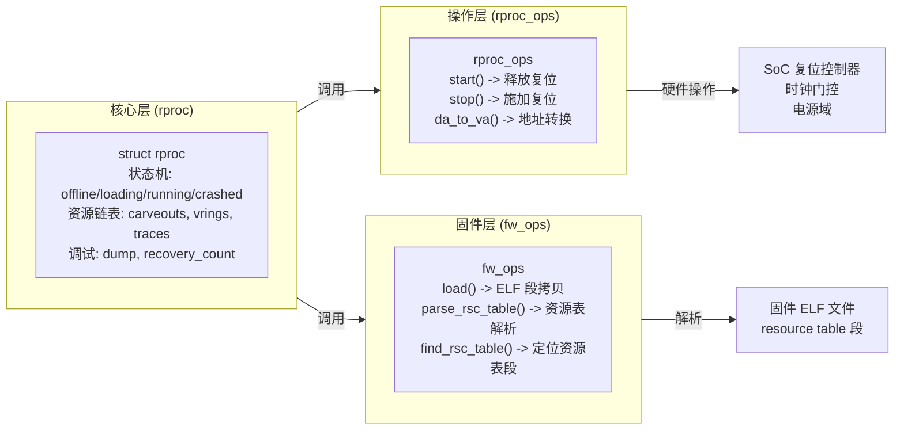
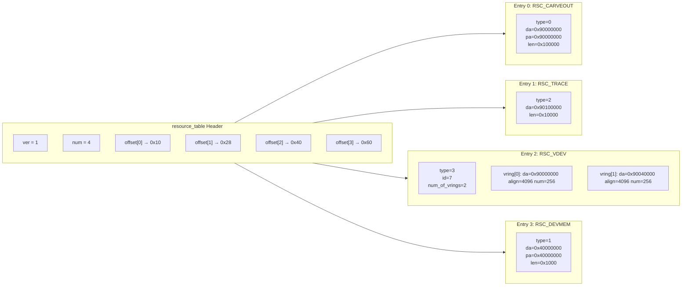
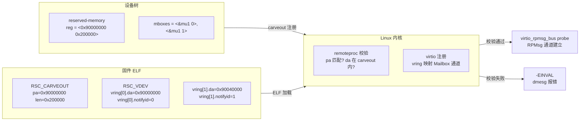
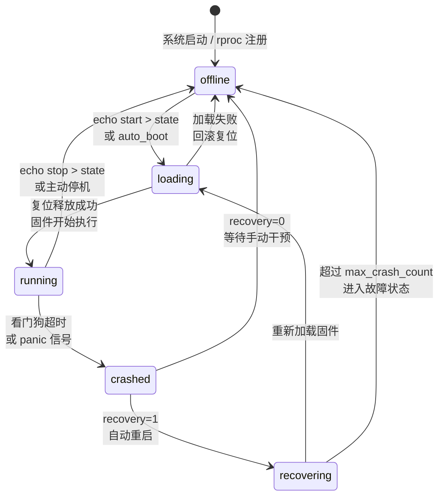
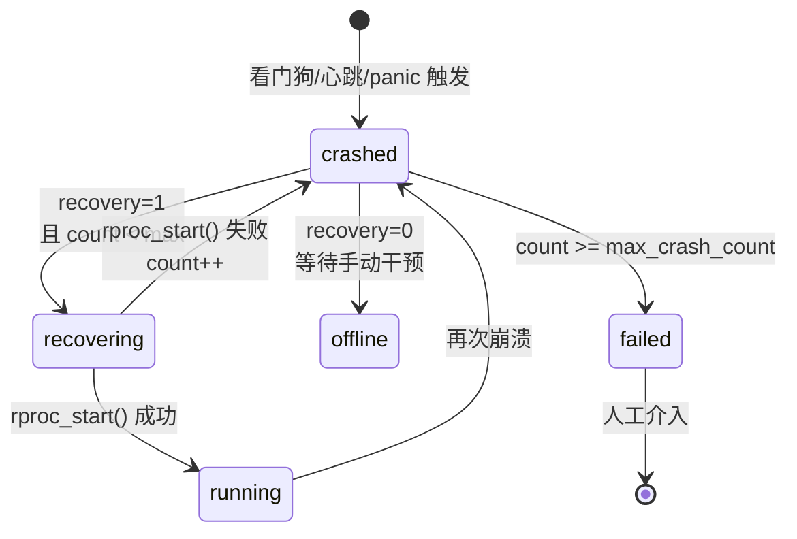
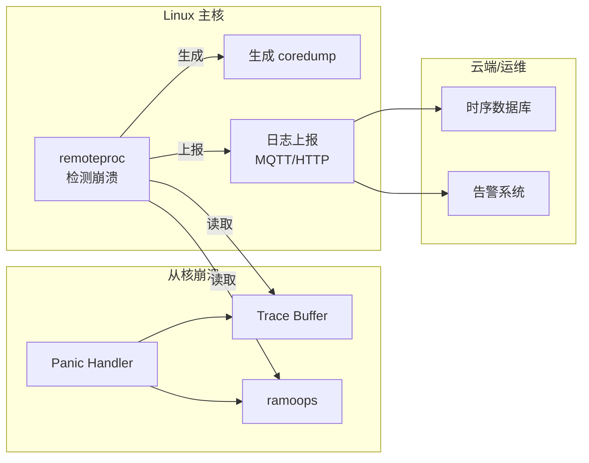

**小节定位说明**
- 难度：I（中级）
- 内容类型：原理解析
- 预计密度：中密度
- 教学意图：第2~4节覆盖了共享内存、Mailbox、RPMsg 等通信机制，但所有这些通信的前提是"从核固件已经启动并运行"。Remoteproc 就是负责加载、启动、监控从核固件的 Linux 内核框架。本节建立框架层认知——理解 remoteproc 的三层组件、平台驱动注册和用户态接口，为后续 ELF 解析（5.2）、启动流程（5.3）、崩溃恢复（5.4）提供基础。不展开 ELF 段解析细节（留给 5.2），不展开电源管理细节（留给 5.3）。

---

## <strong>remoteproc 框架架构</strong> <span class="badge-i">I</span>

异构多核系统中，Cortex-A 核运行 Linux，Cortex-M 核或 DSP 运行 RTOS/裸机固件。但 Linux 启动时，从核通常处于复位状态（held in reset），需要主核将固件镜像加载到 carveout 内存、设置入口地址、释放复位信号，从核才能开始执行。这个"加载-启动-监控"的全生命周期管理，由 Linux 内核的 <span class="red">remoteproc 框架</span>负责。

<span class="blue">remoteproc 的核心定位是"从核固件的生命周期管理器"：它不关心 RPMsg 消息内容，只关心固件 ELF 是否合法、资源表是否对齐、启动后是否存活、崩溃后是否重启。</span><br>

---

### <strong>核心组件分层</strong>

remoteproc 框架采用三层分离设计，对应内核中的三个核心结构体：

| 层级 | 结构体 | 职责 | 类比 |
|------|--------|------|------|
| 核心层 | `struct rproc` | 表示一个远程处理器实例，维护状态机、资源列表、调试信息 | 类似 `struct device` |
| 操作层 | `struct rproc_ops` | 平台相关的硬件操作：加载、启动、停止、复位 | 类似 `struct file_operations` |
| 固件层 | `struct fw_ops` | 固件解析操作：ELF 段加载、资源表解析、符号重定位 | 类似 `struct binfmt` |



`struct rproc` 是 remoteproc 的核心实例，每个从核对应一个 `rproc` 对象。它维护：

- <span class="orange">状态机</span>：`offline`、`loading`、`running`、`crashed`、`recovering`
- <span class="orange">资源链表</span>：carveout 内存区域、virtqueue 配置、trace buffer 地址
- <span class="orange">调试信息</span>：崩溃计数、最后一次 panic 日志、coredump 缓冲区

```c
// 文件路径: include/linux/remoteproc.h
// 场景: rproc 核心结构体定义

struct rproc {
    struct device dev;
    const char *name;               // [L1] 处理器名称，如 "m4@0"
    struct rproc_ops *ops;          // [L2] 平台操作函数表
    struct fw_ops *fw_ops;         // [L3] 固件解析函数表
    void *priv;                     // [L4] 平台私有数据
    
    struct list_head carveouts;     // [L5] carveout 内存区域链表
    struct list_head tracers;       // [L6] trace buffer 链表
    struct list_head rvdevs;        // [L7] virtio 设备链表
    
    int state;                      // [L8] 当前状态: RPROC_OFFLINE 等
    int recovery_count;             // [L9] 崩溃恢复计数
    bool auto_boot;                 // [L10] 是否自动启动
    bool recovery;                  // [L11] 是否启用自动恢复
};
```

> 📚 【关联指引】`rproc_ops` 中的 `da_to_va()`（Device Address to Virtual Address）是异构通信的关键函数。从核固件中的 resource table 使用"设备地址"（从核视角的地址），Linux 内核需要将其转换为内核虚拟地址才能访问。不同 SoC 的地址映射关系不同（如 i.MX8M 的 Cortex-M4 使用 0x80000000 作为本地地址，而物理地址也是 0x80000000），`da_to_va()` 由平台驱动实现这种转换。
{: .tip }

---

### <strong>平台驱动注册</strong>

remoteproc 平台驱动遵循标准的 Linux platform_driver 模型，在设备树匹配成功后 probe，分配 `rproc` 实例并注册到 remoteproc 子系统。

```c
// 文件路径: drivers/remoteproc/imx_rproc.c (NXP i.MX 平台 remoteproc 驱动)
// 场景: i.MX8M Plus Cortex-M7 的 remoteproc 平台驱动 probe

static int imx_rproc_probe(struct platform_device *pdev)
{
    struct device *dev = &pdev->dev;
    struct device_node *np = dev->of_node;
    struct rproc *rproc;
    struct imx_rproc *priv;
    int ret;

    /* [L1] 分配平台私有数据结构 */
    priv = devm_kzalloc(dev, sizeof(*priv), GFP_KERNEL);

    /* [L2] 从设备树解析固件名称 */
    ret = of_property_read_string(np, "firmware", &priv->firmware_name);
    if (ret)
        priv->firmware_name = "imx8mm_m4.bin";  // [L3] 默认固件名

    /* [L4] 分配 rproc 核心实例 */
    rproc = rproc_alloc(dev, pdev->name, &imx_rproc_ops,
                        priv->firmware_name, sizeof(*priv));
    // [L5] imx_rproc_ops 包含 start/stop/da_to_va 实现
    // [L6] firmware_name 指定默认加载的 ELF 固件

    /* [L7] 将私有数据绑定到 rproc */
    rproc->priv = priv;

    /* [L8] 解析设备树中的 memory-region 和 mboxes */
    ret = imx_rproc_parse_dt(pdev, rproc);
    if (ret)
        goto free_rproc;

    /* [L9] 向 remoteproc 子系统注册 */
    ret = rproc_add(rproc);
    if (ret)
        goto free_rproc;

    dev_info(dev, "remoteproc %s registered\n", rproc->name);
    return 0;
}
```

`rproc_add()` 将 `rproc` 实例加入全局 remoteproc 链表，并触发 `auto_boot` 逻辑：如果设备树中 `auto-boot` 属性为 true，remoteproc 会立即尝试加载固件并启动从核。

```dts
// 文件路径: arch/arm64/boot/dts/freescale/imx8mp.dtsi
// 场景: i.MX8M Plus 的 remoteproc 设备树配置

&m7 {
    compatible = "fsl,imx8mp-rproc";
    firmware = "imx8mp_m7.bin";     // [L1] 默认固件文件名
    memory-region = <&vdevbuffer>, <&m7_reserved>;  // [L2] carveout 引用
    mboxes = <&mu1 0>, <&mu1 1>;   // [L3] Mailbox 通道
    mbox-names = "tx", "rx";
    auto-boot;                       // [L4] Linux 启动后自动加载固件
    status = "okay";
};
```

> ⚠️ 【实战避坑】`auto-boot` 在开发阶段方便，但在量产中可能导致问题：如果固件文件系统（通常是 `/lib/firmware/`）尚未挂载（如根文件系统在 NFS 上），`auto-boot` 会失败并标记 `rproc` 状态为 `crashed`。建议在 bring-up 阶段关闭 `auto-boot`，通过用户态手动触发启动，确认固件路径和 carveout 配置无误后再开启。
{: .warning }

---

### <strong>用户态接口</strong>

remoteproc 框架通过 `sysfs` 和 `debugfs` 向用户态暴露控制和调试接口，无需编写内核代码即可管理从核固件。

`sysfs` 路径位于 `/sys/class/remoteproc/remoteprocX/`，提供核心控制和状态查询：

```bash
# 查看 remoteproc 状态和属性
$ ls /sys/class/remoteproc/remoteproc0/
coredump      firmware      name          recovery      state
# [L1] state: offline/loading/running/crashed
# [L2] firmware: 当前加载的固件文件名
# [L3] recovery: 自动恢复使能状态

# 查看当前状态
$ cat /sys/class/remoteproc/remoteproc0/state
running

# 手动停止从核
$ echo stop > /sys/class/remoteproc/remoteproc0/state
$ cat /sys/class/remoteproc/remoteproc0/state
offline

# 更换固件并重新启动
$ echo "new_firmware.bin" > /sys/class/remoteproc/remoteproc0/firmware
$ echo start > /sys/class/remoteproc/remoteproc0/state
$ cat /sys/class/remoteproc/remoteproc0/state
running
```

`debugfs` 提供更深层次的调试信息，通常挂载在 `/sys/kernel/debug/remoteproc/`：

```bash
# 查看 remoteproc 资源表解析结果
$ cat /sys/kernel/debug/remoteproc/remoteproc0/resource_table
Version: 1
Num resources: 4
  [0] type=CARVEOUT, da=0x90000000, pa=0x90000000, len=0x100000
  [1] type=TRACE, da=0x90010000, pa=0x90010000, len=0x10000
  [2] type=VDEV, id=7, num_vrings=2, vring_size=256
  [3] type=DEVMEM, da=0x40000000, pa=0x40000000, len=0x1000

# 查看 trace buffer 内容（从核固件的 printf 输出）
$ cat /sys/kernel/debug/remoteproc/remoteproc0/trace0
[    0.000000] FreeRTOS v10.4.3 started
[    0.001234] RPMsg init done, waiting for Linux...
# [L1] 从核固件的日志通过 trace buffer 透传到 Linux 用户态
```

remoteproc 还提供了命令行工具 `remoteproc`（部分发行版包含在 `linux-tools` 包中），用于批量管理：

```bash
# 列出所有 remoteproc 实例
$ remoteproc list
remoteproc0: m4@0 (running)
remoteproc1: dsp@0 (offline)

# 查看详细状态
$ remoteproc info remoteproc0
Name: m4@0
State: running
Firmware: imx8mp_m7.bin
Recovery count: 0
Carveouts: 2 (vdevbuffer, m7_reserved)
```

> <span class="blue">核心结论：remoteproc 框架通过 rproc/rproc_ops/fw_ops 三层分离，将平台相关的硬件操作（复位、时钟、地址映射）与通用的固件解析（ELF、resource table）解耦。用户态通过 sysfs 即可实现固件加载、启动、停止、调试，无需修改内核代码。理解这三层架构和接口路径，是后续分析 ELF 解析、启动流程和崩溃恢复的基础。</span>
{: .conclusion }

---

**小节定位说明**
- 难度：E（高级）
- 内容类型：原理解析与实战结合
- 预计密度：高密度
- 教学意图：5.1 建立了 remoteproc 框架的架构认知。本节深入固件加载的核心——ELF 文件在 remoteproc 场景中的特殊处理，以及 resource table 如何作为 Linux 与从核固件之间的资源契约。这是理解"固件如何告诉 Linux 它需要哪些内存、哪些 virtio 设备"的关键，直接关联 2.1 的 carveout 配置和 2.4 的 virtqueue 原理。

---

## <strong>ELF 解析与资源表</strong> <span class="badge-e">E</span>

remoteproc 加载的不是裸二进制（raw binary），而是标准的 <span class="green">ELF（Executable and Linkable Format）</span>文件。选择 ELF 的原因是：它自带段布局信息（哪些部分是代码、哪些是数据、哪些是 BSS）、符号表、重定位表，以及 remoteproc 最关心的——<span class="red">resource table（资源表）</span>自定义段。

<span class="blue">resource table 的本质是固件向 Linux 发出的资源需求清单：我需要一块 carveout 内存放 vring，我需要一块 trace buffer 输出日志，我实现了 virtio device id 为 7 的 RPMsg 设备。Linux 侧的 remoteproc 在加载固件时解析这张清单，按需分配资源、建立映射、注册 virtio 设备，然后才释放从核复位。</span><br>

---

### <strong>ELF 段类型与 remoteproc 特殊处理</strong>

标准 ELF 文件由 ELF 头部、程序头表（Program Header Table）和段数据组成。remoteproc 的固件加载器遍历程序头表，筛选类型为 <span class="red">`PT_LOAD`</span>的段——这些段包含了需要被搬运到物理内存并执行的代码和数据。

```c
// 文件路径: drivers/remoteproc/remoteproc_elf_loader.c
// 场景: remoteproc ELF 加载器遍历程序头表，拷贝 LOAD 段到 carveout

static int rproc_elf_load_segments(struct rproc *rproc, const struct firmware *fw)
{
    struct elf32_hdr *ehdr = (struct elf32_hdr *)fw->data;
    struct elf32_phdr *phdr;
    int i, ret = 0;
    u32 da, pa, offset, filesz, memsz;

    /* [L1] 校验 ELF 魔数，确认是 32 位小端 ARM 固件 */
    if (memcmp(ehdr->e_ident, ELFMAG, SELFMAG) != 0) {
        dev_err(&rproc->dev, "Invalid ELF magic\n");
        return -EINVAL;
    }

    /* [L2] 遍历程序头表，e_phnum 表示段数量 */
    for (i = 0; i < ehdr->e_phnum; i++) {
        phdr = (struct elf32_phdr *)(fw->data + ehdr->e_phoff +
                                     i * sizeof(*phdr));

        /* [L3] 仅处理需要加载到内存的 PT_LOAD 段 */
        if (phdr->p_type != PT_LOAD)
            continue;

        da    = phdr->p_vaddr;      // [L4] 固件链接时的虚拟地址（从核视角）
        offset = phdr->p_offset;    // [L5] 该段在 ELF 文件中的偏移
        filesz = phdr->p_filesz;    // [L6] 文件中实际占用的字节数
        memsz  = phdr->p_memsz;     // [L7] 内存中需要占用的字节数（含 .bss）

        /* [L8] 通过平台驱动的 da_to_va 转换为物理/内核虚拟地址 */
        pa = (u32)rproc->ops->da_to_va(rproc, da);
        if (!pa) {
            dev_err(&rproc->dev, "Failed to translate da %x\n", da);
            return -ENOMEM;
        }

        /* [L9] 将段数据从固件文件拷贝到 carveout */
        memcpy((void *)pa, fw->data + offset, filesz);

        /* [L10] 若 memsz > filesz，说明包含 .bss 未初始化数据段，清零 */
        if (memsz > filesz)
            memset((void *)(pa + filesz), 0, memsz - filesz);
    }

    return ret;
}
```

除了 `PT_LOAD`，remoteproc 还识别一种特殊段：<span class="red">`RESOURCE_TABLE`</span>。它不是标准 ELF 段类型，而是 OpenAMP/remoteproc 约定的自定义段，通常通过段名称 `.resource_table` 或特定的 `SHT_NOTE` 类型标识。`fw_ops->find_rsc_table()` 负责在 ELF 中定位这个段的首地址和长度。

```c
// 文件路径: drivers/remoteproc/remoteproc_core.c
// 场景: 在 ELF 中查找 resource table 段

static struct resource_table *rproc_find_rsc_table(struct rproc *rproc,
                                                      const struct firmware *fw,
                                                      int *tablesz)
{
    struct elf32_hdr *ehdr = (struct elf32_hdr *)fw->data;
    struct elf32_shdr *shdr;
    const char *name_table;
    int i;

    /* [L1] 段名称字符串表位于 e_shstrndx 指定的段中 */
    shdr = (struct elf32_shdr *)(fw->data + ehdr->e_shoff +
                                 ehdr->e_shstrndx * sizeof(*shdr));
    name_table = fw->data + shdr->sh_offset;

    /* [L2] 遍历段头表，寻找名为 ".resource_table" 的段 */
    for (i = 0; i < ehdr->e_shnum; i++) {
        shdr = (struct elf32_shdr *)(fw->data + ehdr->e_shoff +
                                     i * sizeof(*shdr));
        if (strcmp(name_table + shdr->sh_name, ".resource_table") == 0) {
            *tablesz = shdr->sh_size;
            return (struct resource_table *)(fw->data + shdr->sh_offset);
        }
    }

    return NULL;  // [L3] 未找到 resource table，部分平台允许无资源表启动
}
```

> 📚 【补充说明】某些旧版 OpenAMP 固件将 resource table 嵌入 `.note` 段而非独立的 `.resource_table` 段，remoteproc 的 `find_rsc_table()` 实现需要兼容这种历史格式。在 bring-up 阶段，若 `dmesg` 提示 `No resource table found`，应首先用 `readelf -S firmware.bin` 确认固件实际包含的段名。
{: .tip }

---

### <strong>resource table 结构</strong>

resource table 是固件与 Linux 之间的资源契约，其结构分为头部和变长资源条目数组两部分。

```c
// 文件路径: include/linux/remoteproc.h
// 场景: resource table 标准头部定义

struct resource_table {
    u32 ver;            // [L1] 版本号，目前标准化为 1
    u32 num;            // [L2] 紧随其后的资源条目数量
    u32 offset[0];      // [L3] 每个资源条目相对于 resource_table 首部的偏移数组
} __packed;
```

头部之后是 `num` 个资源条目，每个条目以 32 位 `type` 字段开头，标识条目类型。常见类型如下：

| 类型宏 | 值 | 用途 | Linux 侧处理 |
|--------|-----|------|--------------|
| `RSC_CARVEOUT` | 0 | 声明共享内存 carveout 区域 | 与设备树 reserved-memory 匹配或动态分配 |
| `RSC_DEVMEM` | 1 | 声明设备内存（如外设寄存器） | 映射为 `ioremap`，供固件直接访问 |
| `RSC_TRACE` | 2 | 声明 trace buffer 区域 | 映射为 `debugfs` 文件，供用户态读取固件日志 |
| `RSC_VDEV` | 3 | 声明 virtio 设备 | 注册到 virtio 总线，触发 `virtio_rpmsg_bus` probe |



各资源条目的 C 结构体定义如下：

```c
// 文件路径: include/linux/remoteproc.h
// 场景: 各类型资源条目的结构定义

/* [L1] carveout 声明 */
struct fw_rsc_carveout {
    u32 type;       // RSC_CARVEOUT
    u32 da;         // [L2] 设备地址（从核视角）
    u32 pa;         // [L3] 物理地址，0 表示由 Linux 动态分配
    u32 len;        // [L4] 区域长度
    u32 flags;      // [L5] 标志位，通常置 0
    u8 name[32];    // [L6] 人类可读名称，出现在 /sys/kernel/debug/remoteproc
};

/* [L7] trace buffer 声明 */
struct fw_rsc_trace {
    u32 type;       // RSC_TRACE
    u32 da;         // [L8] trace buffer 设备地址
    u32 len;        // [L9] buffer 长度
    u32 reserved;   // [L10] 保留，必须置 0
    u8 name[32];    // [L11] 名称，如 "trace0"
};

/* [L12] 设备内存声明 */
struct fw_rsc_devmem {
    u32 type;       // RSC_DEVMEM
    u32 da;         // [L13] 设备内存地址（从核视角）
    u32 pa;         // [L14] 物理地址
    u32 len;        // [L15] 映射长度
    u32 flags;      // [L16] 缓存属性标志
    u8 name[32];    // [L17] 名称
};
```

> ⚠️ 【实战避坑】`pa` 字段是排查启动失败的关键。若固件中硬编码了非零 `pa`，Linux 侧的 remoteproc 会严格校验该地址是否落在已注册的 carveout 范围内。若设备树中 `reg = <0x90000000 0x100000>`，而固件中 `pa = 0x90001000`（未对齐到 carveout 起始），`rproc_handle_carveout()` 会返回 `-EINVAL`，dmesg 仅留下一行 `Failed to allocate carveout`。务必确保固件 `pa` 与设备树 `reg` 严格一致。
{: .warning }

---

### <strong>vdev 资源声明</strong>

<span class="red">`RSC_VDEV`</span>是 resource table 中最复杂的条目，它声明从核侧实现的 virtio 设备，直接触发 Linux 侧的 virtio 子系统初始化。

```c
// 文件路径: include/linux/remoteproc.h
// 场景: virtio 设备资源条目的结构定义

struct fw_rsc_vdev_vring {
    u32 da;         // [L1] vring 设备地址（从核视角，需落在 carveout 内）
    u32 align;      // [L2] 对齐要求，通常为 4096（页对齐）
    u32 num;        // [L3] vring 描述符数量，即 vring_num
    u32 notifyid;   // [L4] 通知 ID，映射到 Mailbox 通道索引
};

struct fw_rsc_vdev {
    u32 type;           // [L5] RSC_VDEV
    u32 id;             // [L6] virtio device id，RPMsg 为 7 (VIRTIO_ID_RPMSG)
    u32 notifyid;       // [L7] vdev 级别的通知 ID，部分平台未使用
    u32 dfeatures;      // [L8] 设备支持的 feature bits（如 VIRTIO_F_VERSION_1）
    u32 gfeatures;      // [L9] 驱动确认的 feature bits，固件侧通常置 0
    u32 config_len;     // [L10] virtio config space 长度，RPMsg 通常为 0
    u8 status;          // [L11] 初始状态，通常为 0（由 Linux 驱动写入 ACK）
    u8 num_of_vrings;   // [L12] vring 数量，RPMsg 通常为 2（TX + RX）
    u8 reserved[2];     // [L13] 填充对齐
    struct fw_rsc_vdev_vring vring[0];  // [L14] 变长数组，实际长度为 num_of_vrings
};
```

Linux 侧解析 `RSC_VDEV` 时，会执行严格的合法性校验，任何违规都会导致固件加载失败：

```c
// 文件路径: drivers/remoteproc/remoteproc_virtio.c (概念化片段)
// 场景: remoteproc 解析 vdev 资源并创建 virtio 设备实例

static int rproc_handle_vdev(struct rproc *rproc, struct fw_rsc_vdev *rsc, int offset)
{
    struct device *dev = &rproc->dev;
    struct rproc_vdev *rvdev;
    int i;

    /* [L1] 校验 virtio device id 合法性 */
    if (rsc->id != VIRTIO_ID_RPMSG) {
        dev_err(dev, "Unsupported vdev id %d\n", rsc->id);
        return -EINVAL;
    }

    /* [L2] 校验 vring 数量 */
    if (rsc->num_of_vrings == 0 || rsc->num_of_vrings > VRING_MAX) {
        dev_err(dev, "Invalid num_of_vrings %d\n", rsc->num_of_vrings);
        return -EINVAL;
    }

    /* [L3] 逐个校验 vring 配置 */
    for (i = 0; i < rsc->num_of_vrings; i++) {
        struct fw_rsc_vdev_vring *vring = &rsc->vring[i];
        dma_addr_t da = vring->da;
        size_t size = vring_size(vring->num, vring->align);

        /* [L4] 校验对齐 */
        if (!IS_ALIGNED(da, vring->align)) {
            dev_err(dev, "Vring %d da %x not aligned to %x\n", i, da, vring->align);
            return -EINVAL;
        }

        /* [L5] 校验 vring 地址是否落在已注册的 carveout 内 */
        if (!rproc_da_to_pa(rproc, da) ||
            !rproc_da_to_pa(rproc, da + size - 1)) {
            dev_err(dev, "Vring %d da %x~%x out of carveout\n", i, da, da + size);
            return -EINVAL;
        }

        /* [L6] 校验 notifyid 不超出 Mailbox 通道数量 */
        if (vring->notifyid >= rproc->max_notifyid) {
            dev_err(dev, "Vring %d notifyid %d exceeds max %d\n",
                    i, vring->notifyid, rproc->max_notifyid);
            return -EINVAL;
        }
    }

    /* [L7] 所有校验通过，注册 virtio 设备到 virtio 总线 */
    rvdev = rproc_rvdev_register(rproc, rsc);
    if (IS_ERR(rvdev))
        return PTR_ERR(rvdev);

    dev_info(dev, "Registered vdev id %d with %d vrings\n",
             rsc->id, rsc->num_of_vrings);

    return 0;
}
```

vdev 资源声明与 Linux 设备树、Mailbox 子系统之间存在严格的契约链：



> <span class="blue">核心结论：resource table 是从核固件与 Linux 之间的资源契约书。`RSC_CARVEOUT` 定义物理内存边界，`RSC_TRACE` 定义日志出口，`RSC_VDEV` 定义 virtio 设备能力和 vring 布局。remoteproc 在加载固件时逐条校验这份契约：地址是否对齐、是否在 carveout 范围内、notifyid 是否合法。任何不一致都会导致加载失败，且错误信息往往模糊（如 `Failed to allocate memory`）。bring-up 阶段务必通过 `readelf -S` 确认固件段结构，通过 `xxd` 或 `objdump` 导出 resource table 原始字节，与设备树逐字段核对。</span>
{: .conclusion }

---

**小节定位说明**
- 难度：E（高级）
- 内容类型：原理解析与实战结合
- 预计密度：高密度
- 教学意图：5.1 建立了 remoteproc 框架架构，5.2 深入了 ELF 解析与资源表。本节聚焦从核固件的完整启动与停止流程——状态机转换、电源/时钟管理、入口点设置。这是理解"固件如何从 ELF 文件变成正在运行的从核程序"的关键，直接关联 5.1 的 rproc 状态机和 5.2 的 resource table 解析结果。不展开崩溃恢复（留给 5.4）。

---

## <strong>固件启动与停止流程</strong> <span class="badge-e">E</span>

remoteproc 解析完 ELF、校验完 resource table、分配好 carveout 和 vring 之后，还差最后一步：让从核 CPU 真正开始执行固件代码。这一步不是简单的"跳转"，而是涉及复位控制器、时钟门控、电源域、向量表配置等一系列硬件操作的精密时序。停止流程则更为棘手——如果时序错误，可能导致从核总线挂死、电源域无法关闭、甚至影响主核稳定性。

<span class="blue">启动与停止流程的核心挑战是硬件时序：复位释放必须在时钟稳定之后，时钟使能必须在电源域上电之后，向量表加载必须在复位释放之前。任何一步的顺序错误或延迟不足，都会导致从核取指失败、陷入未知状态。</span><br>

---

### <strong>状态机转换</strong>

remoteproc 为每个从核维护一个严格的状态机，所有外部操作（加载、启动、停止、恢复）都通过状态转换实现。

| 状态 | 名称 | 含义 | 允许的操作 |
|------|------|------|------------|
| `offline` | 离线 | 从核处于复位状态，无固件加载 | `start`（加载并启动） |
| `loading` | 加载中 | ELF 解析、resource table 处理、内存拷贝进行中 | 无（阻塞状态） |
| `running` | 运行中 | 从核已释放复位，正在执行固件 | `stop`（停止） |
| `crashed` | 崩溃 | 看门狗超时或 panic 检测到异常 | `recover`（恢复） |
| `recovering` | 恢复中 | 自动重启流程进行中 | 无（阻塞状态） |



状态转换的入口函数是 `rproc_start()` 和 `rproc_stop()`，它们调用平台驱动注册的 `rproc_ops` 回调：

```c
// 文件路径: drivers/remoteproc/remoteproc_core.c
// 场景: remoteproc 启动流程的主控函数

int rproc_start(struct rproc *rproc)
{
    struct device *dev = &rproc->dev;
    int ret;

    /* [L1] 状态校验：只能从 offline 或 crashed 状态启动 */
    if (rproc->state != RPROC_OFFLINE && rproc->state != RPROC_CRASHED) {
        dev_err(dev, "Can't start rproc %s: it's not offline\n", rproc->name);
        return -EBUSY;
    }

    /* [L2] 进入 loading 状态，阻止并发操作 */
    rproc->state = RPROC_LOADING;

    /* [L3] 解析并加载 ELF 固件（调用 fw_ops->load） */
    ret = rproc_fw_sanity_check(rproc, rproc->firmware);
    if (ret)
        goto err;

    ret = rproc_load_firmware(rproc);
    if (ret)
        goto err;

    /* [L4] 处理 resource table，分配 carveout、注册 virtio */
    ret = rproc_handle_resources(rproc);
    if (ret)
        goto err;

    /* [L5] 平台相关的启动前准备：时钟、电源、复位 */
    ret = rproc->ops->prepare(rproc);
    if (ret)
        goto err;

    /* [L6] 释放复位信号，从核开始执行 */
    ret = rproc->ops->start(rproc);
    if (ret)
        goto err;

    /* [L7] 标记为 running */
    rproc->state = RPROC_RUNNING;

    dev_info(dev, "remoteproc %s is now running\n", rproc->name);
    return 0;

err:
    rproc->state = RPROC_OFFLINE;
    return ret;
}
```

> ⚠️ 【实战避坑】`rproc_start()` 是原子操作，不支持并发调用。如果用户态脚本在 `loading` 状态期间再次写入 `start`，内核会返回 `-EBUSY`。在自动化测试脚本中，务必轮询 `state` 文件确认进入 `running` 后再执行后续操作，而非简单 sleep 固定时长。
{: .warning }

---

### <strong>电源域与时钟管理</strong>

从核启动前，其时钟和电源可能处于关闭状态以节省功耗。remoteproc 的平台驱动必须按正确顺序使能这些资源。

<span class="red">标准时序是：电源域上电 → 时钟使能 → 复位保持 → 固件加载 → 复位释放。</span> 这个时序由 `rproc_ops` 中的 `prepare()` 和 `start()` 分阶段实现。

```c
// 文件路径: drivers/remoteproc/imx_rproc.c (NXP i.MX 平台启动时序)
// 场景: Cortex-M7 的电源、时钟、复位管理

static int imx_rproc_prepare(struct rproc *rproc)
{
    struct imx_rproc *priv = rproc->priv;
    struct device *dev = rproc->dev.parent;
    int ret;

    /* [L1] 使能电源域：通过 genpd（Generic Power Domain）框架 */
    ret = pm_runtime_get_sync(dev);
    if (ret < 0) {
        dev_err(dev, "Failed to power up domain: %d\n", ret);
        return ret;
    }

    /* [L2] 使能时钟树：包括从核总线时钟、调试时钟 */
    ret = clk_bulk_prepare_enable(priv->num_clks, priv->clks);
    if (ret) {
        dev_err(dev, "Failed to enable clocks: %d\n", ret);
        goto err_power;
    }

    /* [L3] 保持从核在复位状态，确保固件加载完成前不取指 */
    ret = reset_control_assert(priv->rst);
    if (ret) {
        dev_err(dev, "Failed to assert reset: %d\n", ret);
        goto err_clk;
    }

    return 0;

err_clk:
    clk_bulk_disable_unprepare(priv->num_clks, priv->clks);
err_power:
    pm_runtime_put_sync(dev);
    return ret;
}

static int imx_rproc_start(struct rproc *rproc)
{
    struct imx_rproc *priv = rproc->priv;

    /* [L4] 设置从核启动地址（向量表地址） */
    writel(priv->bootaddr, priv->base + SRC_GPR2);
    // [L5] SRC_GPR2 是 i.MX 的启动地址寄存器

    /* [L6] 可选：配置入口模式（Thumb/ARM） */
    if (priv->entry->flags & RP_M4_ENABLE_MMUA)
        writel(readl(priv->base + SRC_GPR2) | 0x1, priv->base + SRC_GPR2);

    /* [L7] 释放复位信号，从核立即从 bootaddr 开始取指 */
    return reset_control_deassert(priv->rst);
}
```

<span class="green">`pm_runtime_get_sync()`</span>是 Linux 电源管理框架的接口，它会递归使能从核所属电源域及其所有父域。如果电源域已处于活动状态，调用几乎无开销；如果处于关闭状态，它会触发上电时序，可能需要数毫秒完成。

<span class="green">`clk_bulk_prepare_enable()`</span>批量使能时钟，包括从核 CPU 时钟、AXI 总线时钟、调试接口时钟。某些平台要求时钟使能后等待稳定（如 PLL 锁定），`prepare()` 阶段会插入 `usleep_range()` 等待。

> 📚 【补充说明】`reset_control_assert()`/`deassert()` 是 Linux 复位框架的标准接口。`assert` 表示施加复位（从核停止），`deassert` 表示释放复位（从核运行）。在 i.MX 平台上，复位控制器是 SRC（System Reset Controller）模块的一部分；在 TI AM62x 上，复位控制器是 PSC（Power and Sleep Controller）。不同 SoC 的复位寄存器语义可能相反（写 1 表示复位或写 0 表示复位），平台驱动必须正确处理。
{: .tip }

---

### <strong>固件入口点设置</strong>

从核释放复位后，第一条指令从哪取？这由 <span class="red">启动地址（boot address）</span>决定。ARM Cortex-M 核的启动地址不是任意值，必须指向 <span class="green">向量表（Vector Table）</span>的起始位置。

Cortex-M 的向量表布局固定：偏移 0x00 是初始 MSP（主栈指针）值，偏移 0x04 是 Reset Handler 地址，偏移 0x08 开始是各种异常向量（NMI、HardFault、MemManage 等）。

```c
// 文件路径: firmware/m4/startup.c (FreeRTOS 启动代码，概念化)
// 场景: Cortex-M 向量表的标准布局

__attribute__((section(".isr_vector")))
const uint32_t vector_table[] = {
    (uint32_t)&_estack,     // [L1] 0x00: 初始栈顶地址
    (uint32_t)Reset_Handler, // [L2] 0x04: 复位入口，固件执行起点
    (uint32_t)NMI_Handler,   // [L3] 0x08: 非屏蔽中断
    (uint32_t)HardFault_Handler, // [L4] 0x0C: 硬错误
    // ... 其他异常向量
};

void Reset_Handler(void)
{
    /* [L5] 复制 .data 段从 Flash 到 RAM */
    uint32_t *src = &_sidata;
    uint32_t *dst = &_sdata;
    while (dst < &_edata) *dst++ = *src++;

    /* [L6] 清零 .bss 段 */
    dst = &_sbss;
    while (dst < &_ebss) *dst++ = 0;

    /* [L7] 调用系统初始化函数 */
    SystemInit();

    /* [L8] 进入主程序（FreeRTOS 的 main） */
    main();
}
```

remoteproc 在加载 ELF 时，从 ELF 头部 `e_entry` 字段获取入口地址，通过平台驱动的 `start()` 写入 SoC 的启动地址寄存器。但这里存在一个关键约束：<span class="red">入口地址必须与向量表起始地址严格对齐</span>。Cortex-M 要求向量表按 256 字节边界对齐（即低 8 位为 0），某些平台甚至要求 512 字节或 1024 字节对齐。

```bash
# 读取固件 ELF 入口地址
$ readelf -h firmware.elf | grep Entry
  Entry point address:               0x80000000

# 确认入口地址对齐
$ python3 -c "print(0x80000000 & 0xFF)"
0
# [L1] 低 8 位为 0，满足 256 字节对齐

# 若对齐违规，链接脚本需调整
$ cat firmware.ld
MEMORY {
    RAM (rwx) : ORIGIN = 0x80000000, LENGTH = 16M
}
SECTIONS {
    .text : {
        *(.isr_vector)   /* [L2] 向量表必须放在最前面 */
        *(.text*)
    } > RAM
}
```

> ⚠️ 【实战避坑】一个常见错误是在链接脚本中将 `.text` 段放在 `.isr_vector` 之前，导致 ELF 入口地址指向 `main()` 而非向量表。从核释放复位后，将 `main()` 的代码解释为 MSP 初始值和 Reset Handler 地址，立即触发 HardFault 或进入不可预测状态。排查方法：通过 JTAG 读取从核 PC（程序计数器）和 MSP 寄存器，若 MSP 值看起来像一个代码地址而非 RAM 地址，即确认向量表位置错误。
{: .warning }

停止流程的时序与启动相反，但更为复杂：必须先施加复位（停止从核取指），再关闭时钟（避免总线事务中途断开），最后关闭电源域。如果先关电源再复位，从核可能处于亚稳态，总线事务未完成导致系统挂死。

```c
// 文件路径: drivers/remoteproc/imx_rproc.c (停止时序)
// 场景: 安全停止从核，避免总线挂死

static int imx_rproc_stop(struct rproc *rproc)
{
    struct imx_rproc *priv = rproc->priv;

    /* [L1] 步骤 1: 施加复位，停止从核执行 */
    reset_control_assert(priv->rst);

    /* [L2] 步骤 2: 等待几个时钟周期，确保正在进行的总线事务完成 */
    udelay(10);

    /* [L3] 步骤 3: 关闭时钟 */
    clk_bulk_disable_unprepare(priv->num_clks, priv->clks);

    /* [L4] 步骤 4: 关闭电源域 */
    pm_runtime_put_sync(rproc->dev.parent);

    return 0;
}
```

> <span class="blue">核心结论：固件启动与停止是硬件时序密集型操作，顺序错误会导致从核无法启动或系统挂死。启动时序：电源 → 时钟 → 复位保持 → 加载固件 → 设置入口 → 释放复位。停止时序：复位 → 等待 → 时钟 → 电源。入口地址必须与向量表对齐，且指向向量表起始而非任意函数。bring-up 阶段务必通过 JTAG 或 SoC 调试寄存器验证从核释放复位后的 PC 和 MSP 值，确认取指路径正确。</span>
{: .conclusion }

---

**小节定位说明**
- 难度：E（高级）
- 内容类型：原理解析与实战结合
- 预计密度：高密度
- 教学意图：5.1~5.3 覆盖了正常加载、启动、停止流程。本节聚焦异常路径——从核固件崩溃后，主核如何感知、如何自动恢复、如何保留诊断数据。这是商用异构系统的最后一道可用性防线：没有崩溃恢复，任何固件 bug 都会导致整机停机，且现场数据丢失后无法定位根因。

---

## <strong>崩溃检测与恢复机制</strong> <span class="badge-e">E</span>

从核固件跑飞、陷入死循环、或触发 HardFault 时，如果主核（Linux）毫不知情，RPMsg 通道会表现为"无响应"——`rpmsg_send()` 阻塞、`read()` 超时，应用层只能猜测"是不是从核死了"。崩溃检测与恢复机制的目标是让这种猜测变成确定性事件，并在秒级内完成自动恢复。

<span class="blue">崩溃恢复不是可选功能，是商用嵌入式系统的必选项。它包含三个环节：检测（知道从核死了）、恢复（把它救活）、诊断（搞清楚为什么死）。</span><br>

---

### <strong>看门狗超时检测</strong>

检测从核崩溃有三种互补机制，按可靠性从高到低排列：

| 机制 | 检测方式 | 延迟 | 适用场景 | 硬件依赖 |
|------|----------|------|----------|----------|
| 硬件看门狗（WDT） | 从核未按时喂狗，WDT 超时触发中断 | 毫秒级 | 死循环、任务挂死 | 需 SoC 集成 WDT |
| 软件心跳（Heartbeat） | 主核监控 Mailbox 心跳消息间隔 | 秒级 | 业务层卡死但 ISR 正常 | 无硬件依赖 |
| Panic 钩子 | 从核异常时主动写信号并触发 Mailbox | 微秒级 | 断言失败、HardFault | 需固件侧实现 |

<span class="red">硬件看门狗（Watchdog Timer，WDT）</span>是最可靠的检测手段。从核固件在 main loop 或 FreeRTOS 空闲任务中周期性"喂狗"（写 WDT 服务寄存器）；如果固件跑飞，喂狗停止，WDT 计数器递减到 0 时触发超时中断，该中断通过 GIC 路由到 Linux 核。

```c
// 文件路径: drivers/remoteproc/remoteproc_core.c
// 场景: remoteproc 注册看门狗超时回调

static void rproc_wdt_timeout(struct watchdog_device *wdd)
{
    struct rproc *rproc = watchdog_get_drvdata(wdd);

    /* [L1] WDT 超时，标记从核崩溃 */
    dev_crit(&rproc->dev, "Watchdog timeout! rproc %s crashed\n", rproc->name);

    /* [L2] 触发崩溃处理流程，进入 crashed 状态 */
    rproc_report_crash(rproc, RPROC_WATCHDOG_BREAK);
    // [L3] 内部将 state 设为 RPROC_CRASHED，并唤醒 recovery 工作队列
}
```

但硬件 WDT 只能检测"完全跑飞"，检测不到"业务层卡死但中断还在跑"的情况。此时需要<span class="red">软件心跳</span>：从核固件中的心跳任务以固定周期（如 1Hz）通过 Mailbox 发送一个无 payload 的心跳消息。Linux 侧的 remoteproc 维护一个超时定时器，若连续 N 个周期未收到心跳，则判定为"疑似崩溃"。

```c
// 文件路径: drivers/remoteproc/remoteproc_heartbeat.c (概念实现)
// 场景: 软件心跳监控

struct rproc_heartbeat {
    struct timer_list timer;
    int period_ms;          // [L1] 预期心跳周期，如 1000ms
    int missed_max;         // [L2] 允许连续丢失次数，如 3
    int missed_count;
};

static void rproc_hb_timeout(struct timer_list *t)
{
    struct rproc_heartbeat *hb = from_timer(hb, t, timer);
    struct rproc *rproc = hb->rproc;

    hb->missed_count++;

    if (hb->missed_count >= hb->missed_max) {
        dev_err(&rproc->dev, "Heartbeat lost %d times, declaring crash\n",
                hb->missed_count);
        rproc_report_crash(rproc, RPROC_HEARTBEAT_STOP);
    } else {
        /* [L3] 继续等待下一个周期 */
        mod_timer(&hb->timer, jiffies + msecs_to_jiffies(hb->period_ms));
    }
}
```

> ⚠️ 【实战避坑】软件心跳与硬件 WDT 并存时，必须确保心跳任务的优先级低于业务关键任务。如果心跳优先级过高，即使业务层卡死，心跳任务仍能抢占执行，导致主核误判"从核正常"。正确做法是让心跳在 FreeRTOS 空闲任务或最低优先级线程中执行，只有 CPU 真正空闲时才喂狗/发心跳。
{: .warning }

<span class="red">Panic Handler</span>是从核侧的主动上报机制。当固件触发断言失败、除以零、或 HardFault 时，异常向量表中的 handler 会执行预设的 panic 流程：先禁用中断防止级联错误，再向 trace buffer 写入崩溃信息（PC 值、LR 值、异常类型），最后通过 Mailbox 向 Linux 发送一个特殊的 panic 信号字。

```c
// 文件路径: firmware/m4/panic_handler.c (FreeRTOS 异常处理)
// 场景: Cortex-M HardFault 时主动通知 Linux

void HardFault_Handler(void)
{
    /* [L1] 保存现场到全局结构体 */
    crash_ctx.magic = CRASH_MAGIC;
    crash_ctx.type = CRASH_HARDFAULT;
    crash_ctx.pc = __get_PC();
    crash_ctx.lr = __get_LR();

    /* [L2] 写入 trace buffer（ramoops 区域） */
    memcpy((void *)TRACE_BUFFER_ADDR, &crash_ctx, sizeof(crash_ctx));

    /* [L3] 触发 Mailbox panic 信号，通知 Linux 立即处理 */
    MU_SendMsg(MU_BASE, 0, PANIC_SIGNAL_WORD);

    /* [L4] 进入死循环，等待 Linux 侧复位 */
    while (1);
}
```

---

### <strong>自动重启策略</strong>

检测到崩溃后，remoteproc 框架根据配置决定是否自动恢复。核心参数通过设备树或 sysfs 配置：

| 参数 | 路径 | 作用 | 推荐值 |
|------|------|------|--------|
| `recovery` | `sysfs` / 设备树 | 启用自动恢复 | 量产设为 1，调试设为 0 |
| `auto_boot` | 设备树 | 系统启动时自动加载 | 量产设为 true |
| `max_crash_count` | 设备树 | 防重启风暴阈值 | 5~10 次后进入故障状态 |
| `recovery_delay_ms` | 内核参数 | 两次恢复间的最小间隔 | 1000~5000ms |

```dts
// 文件路径: arch/arm64/boot/dts/freescale/imx8mp.dtsi
// 场景: remoteproc 恢复策略配置

&m7 {
    compatible = "fsl,imx8mp-rproc";
    recovery;                    // [L1] 启用自动恢复
    max-crash-count = <5>;      // [L2] 连续崩溃 5 次后停止恢复
    recovery-delay-ms = <2000>; // [L3] 每次恢复前等待 2 秒
    status = "okay";
};
```

恢复流程由 `rproc_trigger_recovery()` 触发，内部实现包含退避策略（backoff）：连续崩溃后逐步增加恢复延迟，避免"崩溃→重启→再崩溃"的无限循环烧坏硬件或刷爆日志。

```c
// 文件路径: drivers/remoteproc/remoteproc_core.c
// 场景: 带退避的自动恢复流程

static void rproc_recovery_work(struct work_struct *work)
{
    struct rproc *rproc = container_of(work, struct rproc, recovery_work);
    int ret;

    /* [L1] 检查是否超过最大崩溃次数 */
    if (rproc->recovery_count >= rproc->max_crash_count) {
        dev_crit(&rproc->dev, "Max crash count %d reached, entering failed state\n",
                 rproc->max_crash_count);
        rproc->state = RPROC_FAILED;
        return;
    }

    /* [L2] 退避延迟: 首次 1s，二次 2s，三次 4s... 上限 30s */
    unsigned int delay = min(1U << rproc->recovery_count, 30U);
    msleep(delay * 1000);

    rproc->recovery_count++;

    dev_info(&rproc->dev, "Recovery attempt #%d after %ds delay\n",
             rproc->recovery_count, delay);

    /* [L3] 执行恢复: 先 stop 再 start，复用 5.3 的正常启动路径 */
    ret = rproc_stop(rproc);
    if (ret)
        dev_warn(&rproc->dev, "Stop during recovery failed: %d\n", ret);

    ret = rproc_start(rproc);
    if (ret) {
        dev_err(&rproc->dev, "Recovery start failed: %d\n", ret);
        schedule_work(&rproc->recovery_work);  // [L4] 失败则再次调度恢复
    }
}
```



> 📚 【补充说明】`max_crash_count` 的设定需要权衡可用性与故障掩盖。设得太低（如 1 次），偶发的单粒子翻转（SEU）就会导致系统进入故障状态；设得太高（如 100 次），固件存在系统性 bug 时会被无限重启掩盖，直到硬件损坏才暴露。工业场景通常设为 5~10 次，并配合产线日志上报，将崩溃计数和现场数据回传到云端分析。
{: .tip }

---

### <strong>trace 与 coredump</strong>

崩溃检测和自动恢复解决了"活过来"的问题，但如果不保留死亡现场，同样的 bug 会反复出现而无法定位。remoteproc 提供了两类诊断数据收集机制：<span class="red">trace buffer</span>（轻量日志）和 <span class="red">coredump</span>（完整内存镜像）。

**trace buffer** 在 5.2 节已有提及，它是 resource table 中声明的一块 carveout 内存，从核固件通过类似 `printf` 的接口向其中写入日志。崩溃时，这部分数据通常能保留到最后一条日志，帮助定位崩溃前的执行路径。

```bash
# 实时查看从核固件日志
$ cat /sys/kernel/debug/remoteproc/remoteproc0/trace0
[    0.000000] FreeRTOS v10.4.3 started
[    0.001234] RPMsg init done
[    0.005678] Sensor task started, period=10ms
[   12.345678] ASSERT failed at main.c:156: queue != NULL
# [L1] 最后一条日志指向断言失败位置
```

**ramoops** 是一种更 robust 的崩溃保留机制。它利用预留的物理内存区域（通过设备树 `ramoops` 节点声明），在系统复位后仍然保留数据。从核 panic 时向 ramoops 写入崩溃上下文；即使 remoteproc 执行了恢复流程（stop → start），ramoops 区域因不在 carveout 回收范围内而得以保留。

```dts
// 文件路径: arch/arm64/boot/dts/freescale/imx8mp.dtsi
// 场景: ramoops 区域声明

/ {
    reserved-memory {
        ramoops@90020000 {
            compatible = "ramoops";
            reg = <0x0 0x90020000 0x0 0x10000>;  // [L1] 64KB 保留区域
            record-size = <0x4000>;              // [L2] 单条记录 16KB
            console-size = <0x8000>;               // [L3] 控制台日志 32KB
            ftrace-size = <0x2000>;              // [L4] ftrace 8KB
            no-map;
        };
    };
};
```

**coredump** 是最高级别的诊断手段。当 `max_crash_count` 达到上限或手动触发时，remoteproc 可以将从核的完整内存空间（包括代码段、数据段、堆栈）导出为一个 ELF 文件，供 GDB 离线分析。

```bash
# 手动触发 coredump
$ echo coredump > /sys/class/remoteproc/remoteproc0/state

# 导出 coredump 文件
$ cat /sys/class/remoteproc/remoteproc0/coredump > /tmp/m4_coredump.elf
$ ls -lh /tmp/m4_coredump.elf
-rw-r--r-- 1 root root 16M May  7 10:00 /tmp/m4_coredump.elf
# [L1] 大小等于 carveout 总容量，包含固件完整运行时内存

# 用 GDB 分析（需从核工具链）
$ arm-none-eabi-gdb firmware.elf /tmp/m4_coredump.elf
(gdb) info registers
(gdb) bt
# [L2] 可查看崩溃时的寄存器状态和调用栈
```

> ⚠️ 【实战避坑】coredump 导出会阻塞 remoteproc 恢复流程数秒到数十秒（取决于 carveout 大小和存储介质速度）。在延迟敏感的生产环境中，建议先完成自动恢复让系统快速恢复业务，再在后台异步执行 coredump 收集。内核配置 `CONFIG_REMOTEPROC_Coredump` 默认是同步的，需要打补丁或改用 `debugfs` 异步接口。
{: .warning }

远程诊断的完整数据流如下：



> <span class="blue">核心结论：崩溃检测与恢复是异构多核系统的可用性底线。硬件看门狗检测跑飞、软件心跳检测业务卡死、panic handler 保留主动上报；自动恢复配合退避策略避免重启风暴；trace buffer、ramoops 和 coredump 分层保留诊断数据。这三层机制叠加后，从核固件即使存在偶发 bug，系统也能在秒级内自愈，并保留足够信息供离线根因分析。</span>
{: .conclusion }

---

