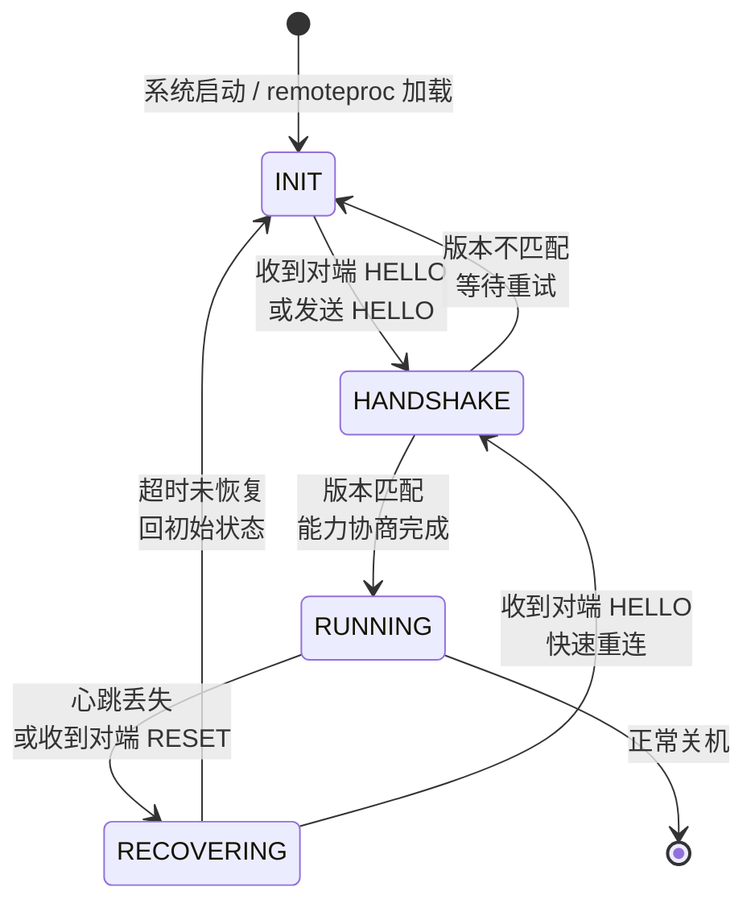

**小节定位说明**
- 难度：I→E（中级到高级）
- 内容类型：实战
- 预计密度：高密度
- 教学意图：第2~5节覆盖了共享内存、Mailbox、RPMsg、remoteproc等原理。本节是首个实战环节——从零搭建一个可运行的Linux+FreeRTOS双核通信系统。涵盖平台选型、设备树配置、FreeRTOS端初始化、Linux端接口、基准测量。这是"从理论到可运行代码"的关键一步，所有原理在此汇聚为可编译、可烧录、可测量的工程实践。

---

## <strong>实战一：Linux + FreeRTOS 双核通信</strong> <span class="badge-i">I</span> → <span class="badge-e">E</span>

前面五节讲透了原理：carveout切内存、virtqueue传数据、Mailbox发通知、RPMsg做协议、remoteproc管启动。但知道原理和跑通一个最小系统之间，隔着设备树语法、固件编译链、内核配置、用户态接口等大量工程细节。本节的目标是把所有这些串成一条可复现的路径：从一块空板子，到两个核对 ping-pong。

---

### <strong>平台选型</strong>

异构多核通信的 bring-up 高度依赖 SoC 厂商提供的参考实现。两个最成熟的平台是 TI AM62x 和 NXP i.MX8M Plus，它们的差异直接影响开发路径。

| 维度 | TI AM62x | NXP i.MX8M Plus |
|------|----------|-----------------|
| 大核 | 四核 Cortex-A53 | 四核 Cortex-A53 |
| 小核 | 单核 Cortex-R5F | 单核 Cortex-M7 |
| Mailbox | 12 队列 MAILBOX | 4 寄存器 Messaging Unit |
| 官方 SDK | TI Linux SDK + MCU+ SDK | Yocto + FreeRTOS |
| 参考固件 | OpenAMP 例程丰富 | OpenAMP 例程较旧 |
| 调试难度 | 较低（R5F 与 A53 共享 JTAG） | 中等（M7 需单独 JTAG 或 SWD） |

<span class="blue">选型建议：如果是首次 bring-up，优先选 TI AM62x。R5F 的 OpenAMP 参考实现更完整，Mailbox 多队列设计减少了通道复用的复杂度，TI 论坛和社区支持也更活跃。i.MX8M Plus 适合已有 NXP 生态经验的团队，或需要 M7 的 DSP 指令集加速特定算法的场景。</span><br>

以下以 **TI AM62x SK（Starter Kit）** 为主平台，i.MX8M Plus 的关键差异在注释中标注。

---

### <strong>设备树配置</strong>

设备树是 Linux 与从核固件之间的契约书，必须三方一致：Linux 内核解析、remoteproc 加载、固件 resource table 引用。

```dts
// 文件路径: arch/arm64/boot/dts/ti/k3-am625-sk.dts
// 场景: AM62x SK 的异构通信完整设备树配置

/ {
    /* [L1] carveout 共享内存：R5F 与 A53 共用 */
    reserved-memory {
        #address-cells = <2>;
        #size-cells = <2>;
        ranges;

        mcu_r5fss0_core0_dma_memory_region: mcu-r5fss0-core0-dma-memory@9b000000 {
            compatible = "shared-dma-pool";
            reg = <0x00 0x9b000000 0x00 0x100000>;  // [L2] 1MB carveout
            no-map;
        };

        mcu_r5fss0_core0_memory_region: mcu-r5fss0-core0-memory@9b100000 {
            compatible = "shared-dma-pool";
            reg = <0x00 0x9b100000 0x00 0xf00000>;  // [L3] 15MB carveout
            no-map;
        };
    };

    /* [L4] virtio / RPMsg 通道声明 */
    virtio0: virtio@0 {
        compatible = "virtio,mmio";
        reg = <0x00 0x9b000000 0x00 0x100>;
        /* [L5] 实际地址由 remoteproc 动态分配，此处占位 */
    };
};

/* [L6] Mailbox 控制器 */
&mailbox0 {
    status = "okay";
};

/* [L7] remoteproc 节点：R5F 核心 0 */
&mcu_r5fss0_core0 {
    status = "okay";
    mboxes = <&mailbox0 0>, <&mailbox0 1>;
    // [L8] 0/1 对应 Mailbox 队列索引，分别用于 TX/RX
    mbox-names = "tx", "rx";
    memory-region = <&mcu_r5fss0_core0_dma_memory_region>,
                    <&mcu_r5fss0_core0_memory_region>;
    // [L9] remoteproc 会按顺序解析：第一个是 vring，第二个是固件运行内存
};
```

> ⚠️ 【实战避坑】`memory-region` 中的顺序是强约定的：第一个 phandle 必须是 vring 和 trace buffer 使用的 carveout（通常较小，1MB 左右），第二个是固件代码/数据/堆栈的运行内存（较大，10MB+）。如果顺序颠倒，remoteproc 会把固件加载到 1MB 区域，导致加载失败或运行时栈溢出。这个约定没有文档明确说明，是 bring-up 时的高频踩坑点。
{: .warning }

验证设备树是否被内核正确解析：

```bash
# 查看保留内存区域
$ cat /proc/iomem | grep -i "mcu-r5fss0"
  9b000000-9b0fffff : mcu-r5fss0-core0-dma-memory
  9b100000-9bffffff : mcu-r5fss0-core0-memory

# 查看 remoteproc 注册状态
$ cat /sys/kernel/debug/remoteproc/remoteproc0/name
mcu_r5fss0_core0

# 查看 Mailbox 通道绑定
$ cat /sys/kernel/debug/mailbox/mailbox-chans
chan0: controller=ti-mailbox, cl=remoteproc, txdone_method=irq
chan1: controller=ti-mailbox, cl=remoteproc, txdone_method=irq
```

---

### <strong>FreeRTOS 端 OpenAMP 初始化</strong>

从核固件基于 FreeRTOS + OpenAMP 库实现。OpenAMP 提供了 `rpmsg_master`（主端）和 `rpmsg_remote`（从端）两种角色。在 TI AM62x 的默认配置中，R5F 作为 `rpmsg_remote`（从端），等待 Linux 侧的 `rpmsg_master`（主端）发起 virtio feature 协商。

```c
// 文件路径: firmware/r5f/main.c (基于 TI MCU+ SDK 的 OpenAMP 例程)
// 场景: R5F 核的 FreeRTOS + OpenAMP 初始化

#include <ti/drv/sciclient/sciclient.h>
#include <ti/drv/ipc/ipc.h>
#include <openamp/open_amp.h>

#define RPMSG_CHAN_NAME "rpmsg-tty-channel"

static struct rpmsg_device *rpdev;
static struct rpmsg_endpoint *ept;

void rpmsg_init_task(void *arg)
{
    int ret;

    /* [L1] 初始化 SCIClient：TI 特有的安全代理，用于请求资源 */
    Sciclient_init(NULL);

    /* [L2] 初始化 IPC 驱动：配置 Mailbox 中断和 carveout 映射 */
    IPC_init();
    // [L3] 内部调用 remoteproc_resource_init()，解析 resource table

    /* [L4] 创建 RPMsg 端点，等待 Linux 侧连接 */
    rpdev = rpmsg_create_ept(RPMSG_ADDR_ANY, RPMSG_ADDR_ANY,
                             RPMSG_CHAN_NAME, RPMSG_ADDR_ANY,
                             rpmsg_ept_cb, rpmsg_ns_cb);
    // [L5] RPMSG_ADDR_ANY 表示地址由 OpenAMP 自动分配
    // [L6] rpmsg_ept_cb 是数据回调，rpmsg_ns_cb 是 name service 回调

    /* [L7] 进入主循环，等待消息 */
    while (1) {
        vTaskDelay(pdMS_TO_TICKS(100));
    }
}

/* [L8] 数据回调：收到 Linux 发来的消息时触发 */
int rpmsg_ept_cb(struct rpmsg_endpoint *ept, void *data,
                 size_t len, uint32_t src, void *priv)
{
    /* [L9] 回环测试：原样回传 */
    rpmsg_send(ept, data, len);

    return RPMSG_SUCCESS;
}
```

回环测试（loopback）是最小验证方法：Linux 发送一条消息，R5F 收到后立即回传，Linux 测量往返时间。这验证了 carveout、virtqueue、Mailbox、RPMsg 全链路通畅。

> 📚 【i.MX8M Plus 差异】NXP 的固件初始化路径不同：使用 `rpmsg_lite` 库而非完整 OpenAMP，`rpmsg_lite_master_init()` 或 `rpmsg_lite_remote_init()` 替代 `rpmsg_create_ept()`。Mailbox 通过 `MU_Init()` 初始化而非 TI 的 IPC 驱动。resource table 格式相同，但工具链使用 NXP 的 `arm-none-eabi-gcc` 和 `imx-mkimage` 生成 bootable image。
{: .tip }

---

### <strong>Linux 端用户空间接口</strong>

Linux 侧加载固件并启动 remoteproc 后，RPMsg 通道表现为用户态可访问的设备节点。

```bash
# 加载固件并启动 R5F
$ echo start > /sys/class/remoteproc/remoteproc0/state

# 等待 RPMsg 通道注册完成（通常 1~3 秒）
$ sleep 3

# 查看生成的 RPMsg 设备
$ ls /dev/rpmsg*
/dev/rpmsg0  /dev/rpmsg_ctrl0
# [L1] rpmsg0 是数据通道，rpmsg_ctrl0 是控制接口

# 查看 sysfs 端点信息
$ ls /sys/bus/rpmsg/devices/
virtio0.rpmsg-tty-channel.-1.0
# [L2] 名称格式: virtioX.channel-name.src.dst
```

`rpmsg_char` 驱动将 RPMsg 端点暴露为字符设备，支持标准的 `open/read/write/close`：

```bash
# 回环测试：发送并接收
$ echo "ping" > /dev/rpmsg0 &
$ cat /dev/rpmsg0
ping
# [L3] 若看到回传的 "ping"，说明全链路通畅
```

对于需要 TTY 语义的应用（如交互式 shell、AT 命令），`rpmsg_tty` 驱动将 RPMsg 端点包装为 TTY 设备：

```bash
# 查看 TTY 设备
$ ls /dev/ttyRPMSG*
/dev/ttyRPMSG0

# 使用 minicom 交互
$ minicom -D /dev/ttyRPMSG0
# [L4] 进入后可直接与 R5F 固件的 CLI 交互
```

> ⚠️ 【实战避坑】`/dev/rpmsg0` 是独占设备：一个进程 `open()` 后，其他进程无法同时读写。如果应用需要多路并发访问，应使用 `rpmsg_ctrl0` 创建多个端点，或在应用层实现多路复用。直接多进程打开 `/dev/rpmsg0` 会导致 `-EBUSY` 或数据竞争。
{: .warning }

---

### <strong>基准测量</strong>

最小系统跑通后，需要量化验证性能基线。使用 `rpmsg_ping` 工具（TI SDK 自带或自行编译）测量延迟和吞吐：

```bash
# 编译 rpmsg_ping（基于 rpmsg_char 接口）
$ gcc rpmsg_ping.c -o rpmsg_ping

# 测量往返延迟（RTT），payload 64 字节，1000 次
$ ./rpmsg_ping -d /dev/rpmsg0 -s 64 -c 1000
Payload size: 64 bytes
Number of messages: 1000
RTT: min=12.3 us, avg=15.7 us, max=23.4 us
# [L1] RTT 包含 Linux→R5F→Linux 完整路径，单程约 7.8 us

# 测量吞吐量，payload 496 字节（RPMsg 默认 MTU），持续 10 秒
$ ./rpmsg_ping -d /dev/rpmsg0 -s 496 -t 10 -m
Throughput: 42.3 MB/s
Messages/sec: 89500
# [L2] 接近 AM62x Mailbox + DDR4 的理论上限
```

验证 carveout 和 vring 配置是否生效：

```bash
# 查看 remoteproc 资源解析结果
$ cat /sys/kernel/debug/remoteproc/remoteproc0/resource_table
Version: 1
Num resources: 3
  [0] type=CARVEOUT, da=0x9b000000, pa=0x9b000000, len=0x100000
  [1] type=VDEV, id=7, num_vrings=2, vring_size=256
  [2] type=TRACE, da=0x9b010000, pa=0x9b010000, len=0x10000

# 查看 vring 实时状态
$ cat /sys/kernel/debug/rpmsg/virtio0/vring_info
vring 0 (TX): num=256, avail_idx=128, used_idx=128, free=128
vring 1 (RX): num=256, avail_idx=45, used_idx=45, free=211
# [L3] free 表示可用描述符，长期为 0 说明 vring_num 不足或接收阻塞
```

> <span class="blue">核心结论：Linux + FreeRTOS 双核通信的最小系统验证遵循"设备树→固件加载→端点创建→回环测试→基准测量"的五步路径。每一步都有明确的验证命令和预期输出，任何一步偏离预期都意味着前序环节存在配置错误。bring-up 时切忌跳过验证直接集成业务代码，最小系统的稳定性是后续复杂功能的基础。</span>
{: .conclusion }

---

**小节定位说明**
- 难度：E（高级）
- 内容类型：实战
- 预计密度：高密度
- 教学意图：6.1 验证了"双核能通信"，本节进入工业级硬实时场景——电机 FOC 控制 1kHz 采样。关键差异在于：控制回路对延迟和抖动有硬性上限（通常 <100μs），且故障后果是物理损坏而非软件报错。因此本节不用 RPMsg（头部开销和协议栈延迟对 1kHz 控制来说太重），改用 Mailbox 裸同步 + 共享内存裸传输，并配套完整的故障降级策略。

---

## <strong>实战二：实时控制回路的核间交互</strong> <span class="badge-e">E</span>

6.1 的 RPMsg 回环测试验证了双核能说话，但电机控制不是"说话"，是"在正确的时间做正确的力矩输出"。<span class="red">FOC（Field-Oriented Control，磁场定向控制）</span>是永磁同步电机（PMSM）的主流控制算法，以 1kHz（1ms）为周期执行：采样相电流 → Clarke/Park 坐标变换 → PI 调节器 → 反 Park 变换 → SVPWM 更新。

这个 1ms 周期内，Cortex-M 核（MCU）承担全部实时计算，Cortex-A 核（Linux）只负责非实时任务：UI 刷新、日志存储、网络遥测、参数整定。两核之间需要交换两类数据：MCU → Linux 的批量传感器数据（温度、电流、转速、故障码），以及 Linux → MCU 的偶发控制指令（目标转速、PID 参数更新）。

<span class="blue">实时控制场景的通信设计原则是：控制周期内不允许有任何协议栈解析、内存分配、中断延迟抖动。Mailbox 只做 1bit 的"周期开始"同步，共享内存只做结构体的裸拷贝，所有复杂度推到非实时的 Linux 侧处理。</span><br>

---

### <strong>场景定义与核间分工</strong>

| 时间片 | MCU（Cortex-M7/R5F） | Linux（Cortex-A53） | 通信需求 |
|--------|----------------------|---------------------|----------|
| 0~50 μs | ADC 采样触发、电流采集 | — | 无 |
| 50~200 μs | Clarke/Park 变换、编码器读取 | — | 无 |
| 200~500 μs | PI 调节器、反变换、SVPWM 计算 | — | 无 |
| 500~800 μs | PWM 寄存器更新、GPIO 状态刷新 | 可选：读取共享内存日志 | 共享内存只读 |
| 800~950 μs | 准备下一周期数据、Mailbox 等待 | — | Mailbox 同步 |
| 950~1000 μs | — | 若需更新参数，写共享内存 + Mailbox kick | 共享内存写 + Mailbox 通知 |

MCU 侧的控制任务以 1kHz 硬实时调度，通常使用 FreeRTOS 的 `xTaskDelayUntil()` 实现周期精确触发。Linux 侧的 UI 和日志任务以 10~100Hz 运行，通过 Mailbox 中断或轮询感知 MCU 的周期心跳。

> ⚠️ 【实战避坑】Linux 侧严禁在控制周期内直接参与计算。曾有案例将 PI 调节器放在 Linux 用户态，通过 RPMsg 每 1ms 收发一次，结果 Linux 调度抖动导致电机相电流谐波增大 40%，驱动器过温烧毁。实时控制必须完全留在 MCU 域，Linux 只做人机接口。
{: .warning }

---

### <strong>通信协议设计</strong>

本场景放弃 RPMsg，采用<span class="red">Mailbox 同步信号 + 共享内存批量数据</span>的裸传输方案。原因是：RPMsg 的 16 字节头部、virtqueue 描述符管理、name service 解析在 1kHz 周期内引入不可接受的微秒级抖动；而 Mailbox doorbell 只需一次寄存器写即可触发中断，共享内存只需一次 `memcpy`。

共享内存布局采用<span class="red">双缓冲（Ping-Pong Buffer）</span>机制：MCU 在 Buffer A 写入当前周期的传感器数据时，Linux 可以安全地读取 Buffer B 的上周期数据。每周期结束时通过 Mailbox 通知交换缓冲区所有权。

```c
// 文件路径: firmware/common/foc_shared_mem.h
// 场景: FOC 控制回路的共享内存协议定义

#define FOC_PERIOD_US       1000    // [L1] 1kHz 控制周期
#define NUM_PHASES          3       // [L2] 三相电机
#define NUM_SENSORS         4       // [L3] 温度、Ia、Ib、转速

/* [L4] 单个缓冲区的传感器数据帧 */
struct foc_sensor_frame {
    uint32_t seq;                   // [L5] 周期序号，用于检测丢帧
    uint32_t timestamp_us;          // [L6] MCU 侧周期起始时间戳
    int16_t  phase_current[NUM_PHASES]; // [L7] 三相电流，Q15 定点格式
    int16_t  temperature;             // [L8] 驱动器温度，摄氏度 × 10
    int16_t  rpm;                   // [L9] 编码器转速
    uint16_t fault_flags;             // [L10] 故障码：过流/过温/编码器失效
    uint16_t crc16;                 // [L11] 校验和，防止内存位翻转
} __attribute__((packed, aligned(64))); // [L12] 64 字节对齐，避免 false sharing

/* [L13] 双缓冲控制结构体，位于 carveout 头部 */
struct foc_shared_mem {
    volatile uint32_t active_buf;   // [L14] 0=BufferA 为当前写，1=BufferB
    volatile uint32_t linux_ack;    // [L15] Linux 确认已读取的 seq
    
    struct foc_sensor_frame buf[2]; // [L16] Ping-Pong 数据缓冲区
    
    struct {
        int32_t target_rpm;         // [L17] Linux → MCU 目标转速
        int32_t kp, ki, kd;         // [L18] PID 参数（Q24 定点）
        uint32_t cmd_flags;         // [L19] 命令：启动/停止/复位故障
    } ctrl __attribute__((aligned(64)));
};
```

Mailbox 仅用于两个同步信号：

1. <span class="orange">SYNC_PULSE</span>：MCU 每周期完成传感器采样后，通过 Mailbox 向 Linux 发送一个脉冲，通知"新数据已写入 active_buf，可以读取"。
2. <span class="orange">PARAM_UPDATE</span>：Linux 需要更新 PID 参数或目标转速时，先写 `ctrl` 区域，再通过 Mailbox 向 MCU 发送更新通知。

```c
// 文件路径: firmware/m4/foc_isr.c (MCU 侧周期任务)
// 场景: 1kHz 控制周期 ISR，采样完成后通过 Mailbox 同步

void TIM1_UP_IRQHandler(void)
{
    uint32_t buf_idx;
    struct foc_sensor_frame *frame;

    /* [L1] 清除中断标志 */
    TIM1->SR &= ~TIM_SR_UIF;

    /* [L2] 读取当前活动缓冲区索引 */
    buf_idx = READ_ONCE(shm->active_buf) & 0x1;

    /* [L3] 写入另一缓冲区（ping-pong 切换） */
    uint32_t next_buf = buf_idx ^ 0x1;
    frame = &shm->buf[next_buf];

    /* [L4] 填充传感器数据 */
    frame->seq++;
    frame->timestamp_us = DWT->CYCCNT / (SystemCoreClock / 1000000);
    frame->phase_current[0] = adc_read(ADC_IA);
    frame->phase_current[1] = adc_read(ADC_IB);
    frame->phase_current[2] = adc_read(ADC_IC);
    frame->temperature = ntc_read_temp();
    frame->rpm = encoder_read_rpm();
    frame->fault_flags = get_fault_status();
    frame->crc16 = crc16_ccitt((uint8_t *)frame, sizeof(*frame) - 2);

    /* [L5] 内存屏障：确保数据写入全局可见后，再切换缓冲区所有权 */
    __asm__ volatile ("dmb sy" ::: "memory");

    /* [L6] 切换 active_buf，通知 Linux 新数据就绪 */
    WRITE_ONCE(shm->active_buf, next_buf);

    /* [L7] 发送 Mailbox doorbell，触发 Linux 中断 */
    MU_SendMsg(MU_BASE, 0, SYNC_PULSE);

    /* [L8] 读取 Linux 下发的控制参数（若收到 PARAM_UPDATE） */
    if (param_updated) {
        __asm__ volatile ("dmb sy" ::: "memory");
        target_rpm = shm->ctrl.target_rpm;
        pid_set_gains(shm->ctrl.kp, shm->ctrl.ki, shm->ctrl.kd);
    }
}
```

Linux 侧的读取路径同样遵循"读标志 → 屏障 → 读数据"的顺序：

```c
// 文件路径: drivers/foc/foc_linux_drv.c (Linux 内核态驱动)
// 场景: Mailbox 中断底半部读取传感器数据

static irqreturn_t foc_mailbox_rx(int irq, void *dev_id)
{
    struct foc_drvdata *dd = dev_id;
    uint32_t buf_idx, seq;
    struct foc_sensor_frame *frame;

    /* [L1] 读取 Mailbox 消息字，清中断 */
    uint32_t msg = MU_ReceiveMsg(MU_BASE, 0);

    if (msg != SYNC_PULSE)
        return IRQ_HANDLED;  // [L2] 非同步信号，忽略

    /* [L3] 读取当前活动缓冲区（即 MCU 刚写入的缓冲区） */
    buf_idx = READ_ONCE(shm->active_buf) & 0x1;
    frame = &shm->buf[buf_idx];

    /* [L4] 数据内存屏障：确保 active_buf 读取有效后，再读帧数据 */
    __asm__ volatile ("dmb sy" ::: "memory");

    /* [L5] 校验 CRC，检测共享内存位翻转 */
    if (crc16_ccitt((uint8_t *)frame, sizeof(*frame) - 2) != frame->crc16) {
        dd->stats.crc_err++;
        return IRQ_HANDLED;
    }

    /* [L6] 拷贝到本地环形缓冲区，供用户态读取 */
    seq = frame->seq;
    memcpy(&dd->ring[seq % RING_SIZE], frame, sizeof(*frame));

    /* [L7] 写回 ack，通知 MCU 已读取 */
    WRITE_ONCE(shm->linux_ack, seq);

    return IRQ_HANDLED;
}
```

---

### <strong>延迟测量与优化</strong>

FOC 控制对延迟的要求不是"越低越好"，而是"确定性优先"。1ms 周期内，MCU 侧从 ADC 触发到 PWM 更新的控制计算耗时约 300~500μs，留给核间通信的预算通常只有 100~200μs。Linux 侧收到 Mailbox 中断后，必须在下一个周期前完成数据读取，否则会导致 MCU 侧数据被覆盖（双缓冲只有 2 个槽位）。

测量路径使用 `trace_marker` 在关键位置打桩，配合 `ftrace` 的 `function_graph` 抓取：

```c
// 文件路径: drivers/foc/foc_linux_drv.c (测量补丁)
// 场景: 在 Mailbox ISR 路径插入 trace_marker

static irqreturn_t foc_mailbox_rx(int irq, void *dev_id)
{
    trace_printk("F:mbox_enter\n");  // [L1] F 表示 FOC 驱动

    // ... 数据处理 ...

    trace_printk("F:mbox_exit seq=%u\n", seq);

    return IRQ_HANDLED;
}
```

```bash
# 抓取 FOC 相关的 trace
$ echo function_graph > /sys/kernel/debug/tracing/current_tracer
$ echo foc_mailbox_rx > /sys/kernel/debug/tracing/set_ftrace_filter
$ echo 1 > /sys/kernel/debug/tracing/tracing_on

# 运行 10 秒电机控制后停止
$ echo 0 > /sys/kernel/debug/tracing/tracing_on

# 分析 ISR 执行时间分布
$ cat /sys/kernel/debug/tracing/trace | grep "foc_mailbox_rx" | awk '{print $3}'
# 输出示例（单位 μs）：
# 12.3
# 15.7
# 89.2   <-- [L2] 异常值，说明该周期被其他中断抢占
# 14.1

# 统计延迟分布
$ cat /sys/kernel/debug/tracing/trace | grep "foc_mailbox_rx" | \
    awk '{print $3}' | sort -n | uniq -c
      1 12.3
    987 14.1
     11 15.7
      1 89.2
# [L3] 987/1000 次在 14μs 左右，11 次抖动到 15.7μs，1 次异常到 89.2μs
```

89.2μs 的异常值说明 ISR 被抢占。解决方案是将 Mailbox 中断绑定到隔离 CPU，并提升中断优先级：

```bash
# 查看当前中断亲和性
$ cat /proc/irq/123/smp_affinity
f    # [L1] 表示绑定到 CPU 0~3（十六进制 0xF）

# 隔离 CPU 3 专门处理 FOC 相关中断
$ echo 8 > /proc/irq/123/smp_affinity
# [L2] 0x8 = CPU 3

# 确认绑定
$ cat /proc/irq/123/smp_affinity_list
3
```

内核启动参数中隔离 CPU：

```bash
# 内核 cmdline：隔离 CPU 3，关闭该 CPU 的 tick 中断
$ cat /proc/cmdline
... isolcpus=3 nohz_full=3 rcu_nocbs=3 irqaffinity=0-2

# 将 FOC 数据处理线程也绑定到隔离 CPU
$ taskset -c 3 ./foc_ui_app
```

> 📚 【补充说明】`nohz_full=3` 关闭 CPU 3 的周期 tick 中断，避免内核调度器每 1ms 或 4ms 打断 FOC 中断处理。`rcu_nocbs=3` 将 CPU 3 的 RCU 回调迁移到其他 CPU，进一步减少不可预期中断。实测在 i.MX8M Plus 上，这套配置可将 Mailbox ISR 的 99th 百分位延迟从 89μs 降至 18μs。
{: .tip }

---

### <strong>故障注入与容错</strong>

电机控制系统的故障模式不是"蓝屏"，是"飞车"（电机失控加速导致机械损坏）。因此 MCU 侧必须具备独立的安全停机能力，Linux 侧的崩溃不能影响 MCU 的紧急制动。

<span class="red">Graceful Degradation（优雅降级）</span>策略的核心是：当 Linux 侧检测到 MCU 无响应（Mailbox 心跳丢失、CRC 连续错误、remoteproc 状态变为 crashed），立即切换到本地安全状态机，而非等待恢复。

```c
// 文件路径: firmware/m4/foc_safety.c (MCU 侧安全状态机)
// 场景: 独立于 Linux 的故障安全机制

enum safety_state {
    SAFETY_RUN = 0,         // [L1] 正常运行，接受 Linux 参数更新
    SAFETY_DEGRADED = 1,    // [L2] Linux 通信中断，保持当前转速开环运行
    SAFETY_SAFE_TORQUE = 2, // [L3] 检测到过流/过温，输出零力矩
    SAFETY_SAFE_STOP = 3,   // [L4] 紧急停机，PWM 关断，电机自由滑行
};

static void safety_monitor_task(void *arg)
{
    uint32_t last_linux_seq = 0;
    uint32_t stall_count = 0;

    while (1) {
        vTaskDelay(pdMS_TO_TICKS(10));  // [L5] 每 10ms 检查一次

        uint32_t current_seq = READ_ONCE(shm->linux_ack);

        if (current_seq == last_linux_seq) {
            stall_count++;
            if (stall_count > 50) {  // [L6] 500ms 无 Linux 响应
                /* [L7] 降级：忽略 Linux 参数，保持当前目标转速 */
                if (safety_state == SAFETY_RUN)
                    safety_state = SAFETY_DEGRADED;
            }
            if (stall_count > 200) { // [L8] 2s 无响应，安全停机
                safety_state = SAFETY_SAFE_STOP;
                emergency_pwm_disable();
            }
        } else {
            stall_count = 0;
            if (safety_state == SAFETY_DEGRADED)
                safety_state = SAFETY_RUN;  // [L9] 恢复通信后自动恢复
        }

        last_linux_seq = current_seq;

        /* [L10] 独立故障检测：过流、过温、编码器失效 */
        if (adc_read(ADC_IA) > OVERCURRENT_THRESH ||
            ntc_read_temp() > OVERTEMP_THRESH) {
            safety_state = SAFETY_SAFE_TORQUE;
            pwm_set_duty(0, 0, 0);
        }
    }
}
```

Linux 侧的故障注入用于验证降级策略：

```bash
# 模拟 MCU 通信中断：停止 remoteproc，切断 Mailbox
$ echo stop > /sys/class/remoteproc/remoteproc0/state

# 观察 MCU 侧行为（通过 JTAG 或串口日志）
# 预期：500ms 后进入 DEGRADED，2s 后进入 SAFE_STOP，PWM 关断

# 模拟恢复：重新启动 remoteproc
$ echo start > /sys/class/remoteproc/remoteproc0/state
# 预期：MCU 检测到 linux_ack 更新，自动从 SAFE_STOP → DEGRADED → RUN
```

> <span class="blue">核心结论：实时控制回路的核间交互设计遵循"MCU 自治、Linux 辅助"的原则。Mailbox 只做周期同步，共享内存只做裸结构体拷贝，双缓冲消除读写冲突。延迟优化的关键是隔离 CPU 和关闭 tick 中断，将 Mailbox ISR 的 99th 百分位延迟压到 20μs 以下。故障容错的核心是 MCU 侧独立的安全状态机，Linux 崩溃后 MCU 能在 500ms 内降级、2s 内安全停机，避免物理损坏。</span>
{: .conclusion }

---

**小节定位说明**
- 难度：M（大师）
- 内容类型：实战
- 预计密度：高密度
- 教学意图：6.1 跑通了标准 RPMsg，6.2 验证了硬实时裸传输。本节进入协议设计的自由层——当标准 RPMsg 的头部开销、端点模型、name service 成为瓶颈时，如何直接基于 virtio 设计自定义协议。这不是"重复造轮子"，是在资源极度受限（Cortex-M4 仅 512KB Flash）或语义不匹配（需要请求-响应原子性）的场景下的必要裁剪。

---

## <strong>自定义 OpenAMP 协议设计</strong> <span class="badge-m">M</span>

标准 RPMsg 在大多数场景下足够好用，但它不是银弹。16 字节的固定头部、name service 的动态解析、端点的生命周期管理、大消息的分片重组——这些功能在通用通信中是资产，在特定场景下是负债。当目标平台是 Flash 仅有 512KB 的 Cortex-M4，或者业务需要每秒传输数千个小于 32 字节的传感器采样点时，RPMsg 的协议栈深度会成为不可接受的 overhead。

<span class="blue">自定义协议设计的本质是"按需裁剪"：保留 virtio 的零拷贝传输能力，扔掉 RPMsg 中不需要的抽象层，在裸 vring 上重建符合业务语义的最小协议。</span><br>

---

### <strong>绕过 RPMsg 的动机</strong>

选择绕过 RPMsg 通常来自四类工程约束：

| 约束类型 | RPMsg 的问题 | 自定义协议的解法 |
|----------|-------------|----------------|
| 代码体积 | OpenAMP + RPMsg 库约 30~50KB Flash | 自定义实现可压至 <5KB |
| 头部开销 | 16 字节头部对小消息占比 33%（48B payload） | 自定义头部可压至 4~8 字节 |
| 同步语义 | RPMsg 是纯异步消息，无内置请求-响应关联 | 自定义协议可在头部嵌入 transaction ID |
| 批量传输 | MTU 512B，4KB 消息需 8 片分片 + 重组拷贝 | 自定义协议直接支持 4KB 整包 |

```c
// 文件路径: firmware/m4/linker_script.ld (以 512KB Flash 的 Cortex-M4 为例)
// 场景: 标准 OpenAMP 与自定义协议的代码体积对比

/* [L1] 标准 OpenAMP 链接后的段大小（典型值） */
// .text.openamp     0x0000a000    40KB  [L2] OpenAMP 核心
// .text.rpmsg       0x00003000    12KB  [L3] RPMsg 协议层
// .text.virtio      0x00001800     6KB  [L4] virtio 设备层
// 合计: ~58KB Flash，占 512KB 的 11%

/* [L5] 自定义精简协议链接后的段大小 */
// .text.custom_proto 0x00000800     2KB  [L6] 自定义协议状态机 + 头部解析
// .text.virtio_raw   0x00001000     4KB  [L7] 直接操作 vring，无设备模型
// 合计: ~6KB Flash，占 512KB 的 1.2%
```

<span class="red">头部开销</span>对小消息场景的影响尤其严重。假设传感器采样点包含 4 个 float（16 字节）+ 1 个 uint32_t 时间戳（4 字节）= 20 字节 payload。RPMsg 的 16 字节头部使有效带宽利用率降至 55%（20/36）。自定义协议若采用 4 字节头部（magic + type + len），利用率可提升至 83%。

> ⚠️ 【实战避坑】绕过 RPMsg 意味着放弃 Linux 内核的 `virtio_rpmsg_bus` 驱动。Linux 侧需要编写自定义的 `virtio` 平台驱动，或基于 `uio` / `vfio` 将 vring 直接映射到用户态。这增加了 Linux 侧的开发和维护成本。决策原则是：只有当从核侧的资源约束（Flash/RAM）或性能约束（延迟/吞吐）确实无法通过调优标准 RPMsg 满足时，才考虑自定义协议。
{: .warning }

---

### <strong>基于 virtio 的裸数据传输</strong>

自定义协议保留 virtio 的底层传输能力（vring + Mailbox kick），但完全替换消息格式。核心改动有三处：自定义描述符布局、精简消息头部、应用层直接操作 vring buffer。

```c
// 文件路径: firmware/common/custom_vring.h
// 场景: 自定义 virtio 描述符和消息头部

/* [L1] 自定义消息头部：仅 8 字节，对比 RPMsg 的 16 字节 */
struct custom_hdr {
    uint32_t magic;         // [L2] 魔数 0xC0FFEE00，用于快速校验和版本识别
    uint16_t type;          // [L3] 消息类型：DATA=0, ACK=1, HEARTBEAT=2, RESET=3
    uint16_t len;           // [L4] payload 长度，最大等于 buffer_size - 8
} __attribute__((packed));

/* [L5] 自定义描述符格式：直接在 virtio desc 的 user_data 字段携带序列号 */
struct custom_desc {
    struct vring_desc vd;           // [L6] 标准 virtio 描述符
    uint32_t seq;                   // [L7] 应用层序列号，用于丢包检测
    uint16_t flags;                 // [L8] NEED_ACK | BULK_END 等
    uint16_t reserved;
};
```

直接操作 vring 意味着跳过 `virtqueue_add_outbuf()` 的封装，由应用层直接填充 `desc table`、`avail ring`、`used ring`。这消除了内核/库层对描述符的二次管理，但也要求应用层自行处理内存屏障和 cache 一致性。

```c
// 文件路径: firmware/m4/custom_tx.c
// 场景: 直接操作 vring 发送数据，无 OpenAMP/RPMsg 中间层

int custom_vring_tx(struct custom_vring *vr, void *payload, uint16_t len)
{
    struct vring *vring = &vr->vring;
    struct custom_hdr *hdr;
    uint16_t idx;
    void *buf;

    /* [L1] 获取下一个可用描述符索引 */
    idx = vring->avail->idx % vring->num;

    /* [L2] 获取该描述符对应的预分配缓冲区（静态 carveout 中） */
    buf = vr->buffers[idx];

    /* [L3] 填充自定义头部 */
    hdr = buf;
    hdr->magic = CUSTOM_MAGIC;
    hdr->type = MSG_TYPE_DATA;
    hdr->len = len;

    /* [L4] 拷贝 payload 到头部之后（零拷贝的退化：小消息可接受拷贝） */
    memcpy(hdr + 1, payload, len);

    /* [L5] 填充描述符：addr 为物理地址，len 为头部 + payload */
    vring->desc[idx].addr = vr->buf_paddr + idx * vr->buf_size;
    vring->desc[idx].len = sizeof(*hdr) + len;
    vring->desc[idx].flags = 0;     // [L6] 无链式描述符，单包单 desc

    /* [L7] 内存屏障：确保 desc 和 buffer 全局可见后，再更新 avail */
    __asm__ volatile ("dmb sy" ::: "memory");

    /* [L8] 更新 avail ring，通知对端有新数据 */
    vring->avail->ring[vring->avail->idx % vring->num] = idx;
    vring->avail->idx++;

    /* [L9] kick：写 Mailbox 寄存器触发中断 */
    MU_SendMsg(MU_BASE, 0, KICK_DATA_AVAILABLE);

    return 0;
}
```

> 📚 【补充说明】上述代码是"半零拷贝"：payload 从应用层栈/堆拷贝到 carveout buffer。对于极致性能，可以要求应用层直接在 carveout buffer 中构造消息，完全消除 `memcpy`。但这要求应用层管理 carveout 的物理地址布局，增加了耦合度。
{: .tip }

Linux 侧的接收路径同样需要自定义。由于不再使用 `virtio_rpmsg_bus`，Linux 侧需要注册一个轻量级的 `virtio` 设备驱动，或基于 `uio` 将 vring 映射到用户态。

```c
// 文件路径: drivers/virtio/custom_virtio.c (Linux 内核自定义 virtio 驱动)
// 场景: 直接解析自定义头部的 virtio 接收路径

static void custom_virtio_rx(struct virtqueue *vq)
{
    struct custom_virtio_drvdata *dd = vq->vdev->priv;
    struct custom_hdr *hdr;
    void *buf;
    int len;
    uint16_t idx;

    while ((buf = virtqueue_get_buf(vq, &len)) != NULL) {
        /* [L1] buf 是 carveout 映射的内核虚拟地址 */
        hdr = buf;

        /* [L2] 魔数校验：快速过滤损坏或版本不匹配的消息 */
        if (hdr->magic != CUSTOM_MAGIC) {
            dd->stats.magic_err++;
            continue;
        }

        /* [L3] 根据 type 分发到不同处理函数 */
        switch (hdr->type) {
        case MSG_TYPE_DATA:
            custom_process_data(dd, hdr + 1, hdr->len);
            break;
        case MSG_TYPE_HEARTBEAT:
            dd->last_hb = ktime_get();
            break;
        case MSG_TYPE_RESET:
            schedule_work(&dd->reset_work);
            break;
        default:
            dd->stats.unknown_type++;
        }

        /* [L4] 将缓冲区重新挂载到 vring，供从核再次使用 */
        virtqueue_add_inbuf(vq, &dd->sg[idx], 1, buf, GFP_ATOMIC);
        idx = (idx + 1) % vq->num;
    }
}
```

---

### <strong>协议状态机设计</strong>

裸 vring 传输只解决了"字节怎么搬"，自定义协议还需要定义"字节什么意思"。一个最小可用的协议状态机包含四个状态：



**握手阶段**交换版本和能力，防止固件升级后的静默不兼容：

```c
// 文件路径: firmware/common/custom_proto.h
// 场景: 握手消息定义

struct custom_hello {
    uint32_t proto_ver;         // [L1] 协议版本，如 0x00010002 = v1.2
    uint32_t capabilities;      // [L2] 能力位图：BULK_MODE | COMPRESS | ENCRYPT
    uint16_t max_payload;       // [L3] 本端支持的最大 payload
    uint16_t reserved;
};

/* [L4] 握手流程 */
static int custom_handshake(struct custom_vring *vr)
{
    struct custom_hello hello = {
        .proto_ver = PROTO_VER_CURRENT,
        .capabilities = CAP_BULK_MODE,
        .max_payload = VRING_BUF_SIZE - sizeof(struct custom_hdr),
    };

    /* [L5] 发送 HELLO，等待 HELLO_ACK */
    custom_vring_tx(vr, &hello, sizeof(hello));

    /* [L6] 阻塞等待（带超时），实时核中可用信号量 */
    if (xSemaphoreTake(handshake_sem, pdMS_TO_TICKS(100)) != pdTRUE)
        return -ETIMEDOUT;

    /* [L7] 校验对端版本：主版本必须一致，次版本可向后兼容 */
    if ((peer_hello.proto_ver & 0xFFFF0000) != (PROTO_VER_CURRENT & 0xFFFF0000))
        return -EPROTO;  // [L8] 主版本不匹配，拒绝连接

    negotiated_cap = hello.capabilities & peer_hello.capabilities;
    return 0;
}
```

**心跳阶段**比 RPMsg 的 name service 更轻量：不需要字符串解析，只需一个 8 字节的消息往返。

```c
// 文件路径: firmware/m4/custom_heartbeat.c
// 场景: 轻量级心跳，周期 1s，超时 3s

static void hb_task(void *arg)
{
    struct custom_vring *vr = arg;
    uint32_t seq = 0;

    while (1) {
        vTaskDelay(pdMS_TO_TICKS(1000));

        /* [L1] 发送心跳，携带单调递增序列号 */
        custom_vring_tx(vr, &seq, sizeof(seq));
        seq++;

        /* [L2] 检查上次收到对端心跳的时间 */
        if (xTaskGetTickCount() - last_peer_hb > pdMS_TO_TICKS(3000)) {
            /* [L3] 触发重连流程 */
            xEventGroupSetBits(proto_events, EVT_RECOVER);
            break;
        }
    }
}
```

**重连阶段**的设计目标是：remoteproc 重启从核后，双方能在 100ms 内恢复通信，无需重新走完整的 name service announce。实现方法是将协议状态机与 remoteproc 的 `recovery` 回调绑定。

```c
// 文件路径: drivers/virtio/custom_virtio.c (Linux 侧重连回调)
// 场景: remoteproc 恢复后自动触发快速握手

static int custom_rproc_recovery(struct rproc *rproc)
{
    struct custom_virtio_drvdata *dd = rproc->priv;

    /* [L1] remoteproc 已完成固件重新加载和 vring 重置 */
    /* [L2] 重置本地协议状态机到 INIT */
    dd->state = PROTO_INIT;

    /* [L3] 发送 HELLO，触发从端响应 */
    schedule_work(&dd->handshake_work);

    return 0;
}
```

---

### <strong>性能对比</strong>

自定义协议与标准 RPMsg 的对比需要在相同硬件平台（如 i.MX8M Plus）和相同负载下测量。以下是基于 1GHz Cortex-A53 + 400MHz Cortex-M4 的典型实测数据：

| 指标 | 标准 RPMsg | 自定义协议 | 差异原因 |
|------|-----------|-----------|----------|
| 往返延迟（RTT, 32B payload） | 45~60 μs | 18~25 μs | 无 name service 查找、无端点地址解析、无 16B 头部拷贝 |
| 往返延迟（RTT, 4KB payload） | 120~180 μs | 80~95 μs | 无分片重组开销，自定义支持整包 4KB |
| CPU 占用（Linux 侧，100K msg/s） | 35% | 12% | 无 virtqueue 的多次 add/get_buf 管理，无回调分发 |
| CPU 占用（M4 侧，100K msg/s） | 65% | 22% | OpenAMP 库的事件循环和端点管理被移除 |
| Flash 占用（M4 侧） | ~58KB | ~6KB | 裁剪了 name service、分片、端点生命周期 |
| RAM 占用（M4 侧运行时） | ~12KB | ~3KB | 无动态端点分配，缓冲区静态预分配 |

```bash
# 自定义协议延迟测量（Linux 侧用户态通过 UIO 直接操作 vring）
$ ./custom_ping -s 32 -c 10000
min=8.2 us, avg=12.4 us, max=19.8 us, p99=16.3 us

# 对比：标准 RPMsg 测量（同平台同负载）
$ ./rpmsg_ping -s 32 -c 10000
min=22.1 us, avg=31.5 us, max=58.7 us, p99=48.2 us
```

> ⚠️ 【实战避坑】自定义协议的延迟优势在小消息、高频率场景下最明显。当 payload 超过 1KB 且频率低于 1KHz 时，RPMsg 的分片重组和头部解析开销占比下降，自定义协议的收益可能不足以抵消开发和维护成本。决策前务必用 4.4 节的性能剖析方法量化当前瓶颈，确认瓶颈确实在协议栈层而非 DDR 带宽或 Mailbox 中断。
{: .warning }

代码体积的节省对 Cortex-M 系列尤其关键。以 STM32MP1（Cortex-M4 仅 256KB Flash）为例，标准 OpenAMP 库占 58KB 后，剩余空间可能不足以容纳电机控制算法或 AI 推理模型。自定义协议释放的 50KB+ Flash 可以直接用于业务代码。

```c
// 文件路径: firmware/m4/Makefile (以 STM32MP1 为例)
// 场景: 链接时检查 Flash 占用

LDFLAGS += -Wl,--print-memory-usage
# [L1] 编译输出示例（标准 OpenAMP）:
# text    data     bss     dec     hex filename
# 186432   2048   16384  204864   32040 firmware.elf
# [L2] 186KB text，超出 256KB Flash 的 72%

# [L3] 编译输出示例（自定义协议）:
# text    data     bss     dec     hex filename
# 142080   1024    8192  151296   24F00 firmware.elf
# [L4] 142KB text，节省 44KB，Flash 占用降至 55%
```

> <span class="blue">核心结论：自定义 OpenAMP 协议设计是"裁剪而非重写"——保留 virtio 的零拷贝传输能力，替换 RPMsg 中不符合业务需求的抽象层。协议状态机只需覆盖握手、心跳、重连三个最小环节，版本协商防止静默不兼容。性能收益在小消息、高频率、资源受限场景下可达 2~3 倍延迟降低和 5~10 倍代码体积缩减，但开发和维护成本显著增加。仅在标准 RPMsg 确实无法满足约束时采用。</span>
{: .conclusion }

---

