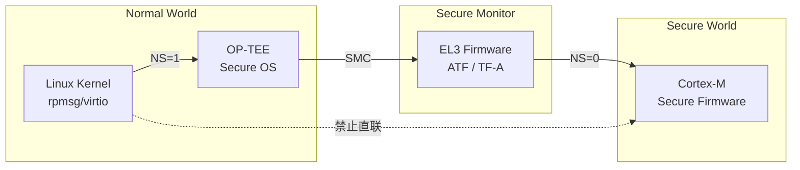
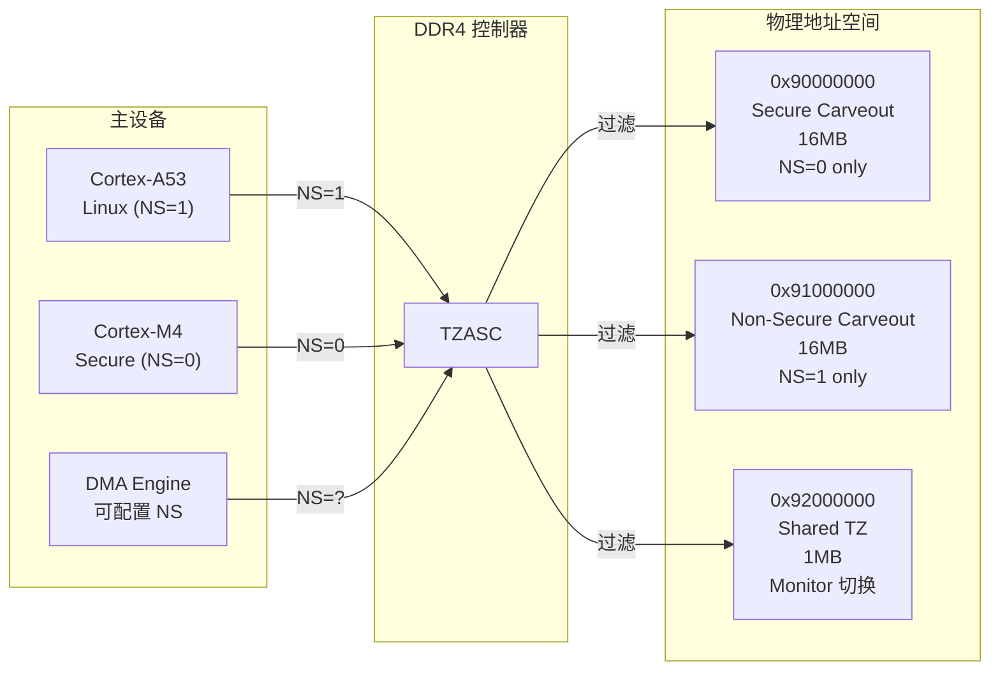
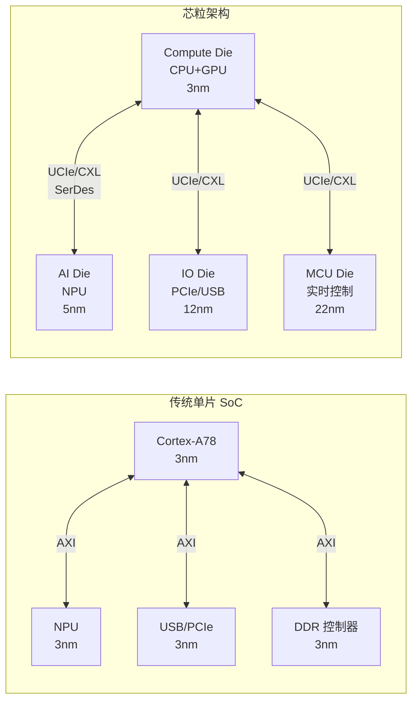
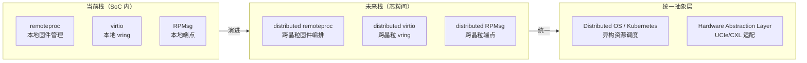

**小节定位说明**
- 难度：E（高级）
- 内容类型：实战优化
- 预计密度：高密度
- 教学意图：2.1~4.4 和 6.x 覆盖了从基础到实战的完整链路。本节进入性能极限压榨——在 vring 深度和 buffer size 已调优的基础上，通过大页映射消除 TLB miss、通过批处理策略量化设计延迟-吞吐平衡点、通过亲和性与缓存预热将中断路径压到硬件极限。不重复 3.3 的 NAPI 概念（已讲透），不重复 4.4 的 vring 调参（已讲透），聚焦"再进一步"的优化手段。

---

## <strong>零拷贝与批量传输优化</strong> <span class="badge-e">E</span>

4.4 节的性能剖析已经识别了瓶颈：vring 深度不足、通知频率过高、buffer size 不匹配。把这些调到最优后，系统通常能达到理论带宽的 60%~70%。剩下的 30% 被谁吃掉了？TLB 页表遍历、动态 DMA 映射开销、Cache 冷启动、跨核调度迁移。

<span class="blue">零拷贝与批量传输优化的目标不是消除 memcpy（virtio 已经做到了），而是消除"看不见的拷贝"：页表遍历、Cache 失效、上下文切换。</span><br>

---

### <strong>大页内存与固定映射</strong>

当 carveout 共享内存通过 `mmap()` 映射到 Linux 用户态时，内核默认按 <span class="red">4KB 页（Page）</span>建立页表。如果应用以 1MB/s 的速率随机访问 carveout 中的不同位置（如视频帧的宏块级处理），每次访问都可能触发 <span class="red">TLB miss（Translation Lookaside Buffer 缺失）</span>——CPU 需要遍历多级页表才能将虚拟地址转换为物理地址，在 ARM64 上这通常需要 3~4 次内存访问，延迟约 50~100 ns。累积起来，TLB miss 可能吃掉 10%~20% 的有效带宽。

<span class="green">`hugetlb`</span>（Huge Translation Lookaside Buffer）是 Linux 的大页内存机制，支持 2MB 和 1GB 两种粒度。将 carveout 映射到用户态时，使用大页可以将页表项数量减少 512 倍（2MB 页）或 262144 倍（1GB 页），TLB 命中率显著提升。

```bash
# 内核启动参数：预留 16 个 2MB 大页（共 32MB）
$ cat /proc/cmdline
... default_hugepagesz=2M hugepagesz=2M hugepages=16

# 查看大页预留状态
$ cat /proc/meminfo | grep -i huge
AnonHugePages:         0 kB
ShmemHugePages:        0 kB
HugePages_Total:      16
HugePages_Free:       16
HugePages_Rsvd:        0
HugePages_Surp:        0
Hugepagesize:       2048 kB
# [L1] 16 个 2MB 大页已就绪，可用于 carveout 映射

# 通过 hugetlbfs 挂载点访问
$ mkdir /mnt/huge
$ mount -t hugetlbfs none /mnt/huge
```

在嵌入式异构通信中，大页的应用场景通常是：Linux 用户态通过 UIO 或 VFIO 直接 mmap carveout。标准 `mmap()` 走 4KB 页表，而 `hugetlb` 映射走 2MB 页表。

```c
// 文件路径: drivers/uio/uio_custom.c (概念实现)
// 场景: UIO 设备支持 hugetlb 映射 carveout

static int custom_uio_mmap(struct uio_info *info, struct vm_area_struct *vma)
{
    struct custom_uio_drvdata *dd = info->priv;
    unsigned long vsize = vma->vm_end - vma->vm_start;
    unsigned long psize = dd->carveout_size;

    /* [L1] 校验映射范围 */
    if (vsize > psize)
        return -EINVAL;

    /* [L2] 检查是否请求大页映射 */
    if (vma->vm_flags & VM_HUGETLB) {
        /* [L3] 按 2MB 边界对齐物理地址 */
        unsigned long paddr = dd->carveout_paddr & ~((1UL << 21) - 1);
        
        /* [L4] 使用 remap_pfn_range 建立大页映射 */
        return remap_pfn_range(vma, vma->vm_start,
                               paddr >> PAGE_SHIFT,
                               vsize, vma->vm_page_prot);
    }

    /* [L5] 默认 4KB 页映射 */
    return remap_pfn_range(vma, vma->vm_start,
                           dd->carveout_paddr >> PAGE_SHIFT,
                           vsize, vma->vm_page_prot);
}
```

用户态通过 `mmap()` 的 `MAP_HUGETLB` 标志请求大页：

```c
// 文件路径: userspace/hugepage_mmap.c
// 场景: 用户态通过 hugetlb 映射 carveout

void *map_carveout_huge(int fd, size_t size)
{
    void *addr;

    /* [L1] 使用 2MB 大页映射 carveout */
    addr = mmap(NULL, size,
                PROT_READ | PROT_WRITE,
                MAP_SHARED | MAP_HUGETLB,  // [L2] 请求大页
                fd, 0);

    if (addr == MAP_FAILED) {
        perror("mmap huge");
        return NULL;
    }

    return addr;
}
```

> ⚠️ 【实战避坑】`hugetlb` 要求 carveout 的物理地址按大页边界对齐（2MB 页要求低 21 位为 0）。如果设备树中 `reg = <0x90000000 0x100000>`（1MB，未对齐到 2MB），`mmap` 会返回 `-EINVAL`。bring-up 时务必通过 `cat /proc/iomem` 确认 carveout 基址对齐，或在设备树中将 carveout 起始地址调整为 2MB 整数倍（如 0x90000000、0x90200000）。
{: .warning }

<span class="red">固定映射（Pinned Mapping）</span>是另一项优化。标准的 DMA API（`dma_map_sg()` / `dma_unmap_sg()`）在每次传输前后动态建立/拆除一致性映射，引入微秒级开销。对于长期活跃的异构通信通道，应在初始化阶段通过 `dma_alloc_coherent()` 分配并永久映射 carveout，后续传输中不再调用任何 `dma_map/unmap`。

```c
// 文件路径: drivers/rpmsg/virtio_rpmsg_bus.c (优化补丁概念)
// 场景: 将 vring buffer pool 改为固定映射，消除运行时 dma_map 开销

static int virtio_rpmsg_setup_vring(struct virtio_rpmsg_channel *vch)
{
    struct device *dev = vch->vdev->dev.parent;
    dma_addr_t dma_addr;
    void *cpu_addr;
    size_t size = vch->num * vch->buf_size * 2;  // [L1] TX + RX

    /* [L2] 一次性分配一致性内存，永久映射 */
    cpu_addr = dma_alloc_coherent(dev, size, &dma_addr, GFP_KERNEL);
    if (!cpu_addr)
        return -ENOMEM;

    vch->buffers = cpu_addr;
    vch->buffers_dma = dma_addr;

    /* [L3] 后续所有传输直接使用该映射，不再调用 dma_map/unmap */
    /* [L4] 驱动卸载时才 dma_free_coherent */

    return 0;
}
```

> 📚 【补充说明】`dma_alloc_coherent()` 在 ARM64 上通常映射为 `Memory Device-GRE`（Gathering, Reordering, Early Write Acknowledgement）属性，而非 `Normal NC`（Non-Cacheable）。这意味着它仍然经过 Cache，但由硬件一致性互联（CCI/CMN）自动维护。对于无硬件一致性的平台（如 Zynq-7000），`dma_alloc_coherent` 会映射为真正的非缓存内存，性能略低但保证正确性。
{: .tip }

---

### <strong>批处理与中断合并</strong>

3.3 节介绍了 NAPI 思想在 Mailbox 中的移植，4.2 节介绍了 virtio 的通知抑制。本节将两者结合，给出<span class="red">可量化的批处理策略设计</span>：不是简单地"多攒几包再中断"，而是根据业务延迟预算计算最优的批处理窗口。

批处理策略有两个触发条件：<span class="orange">数量阈值（N 包）</span>和<span class="orange">超时阈值（T 微秒）</span>。满足任一条件即触发通知。

| 参数 | 符号 | 作用 | 调优方法 |
|------|------|------|----------|
| 批处理数量 | `batch_num` | 每批最多攒多少包 | 根据延迟预算反推：`batch_num ≤ budget_us / avg_pkt_interval_us` |
| 超时窗口 | `batch_timeout_us` | 最长等待时间 | 设为延迟预算的 80%，防止少量包无限等待 |
| 预算上限 | `latency_budget_us` | 业务允许的最大端到端延迟 | 由控制周期或 SLA 决定 |

```c
// 文件路径: drivers/mailbox/mbox_batch.c (概念实现)
// 场景: 量化批处理策略

struct batch_ctx {
    struct mbox_chan *chan;
    int batch_num;          // [L1] 数量阈值，如 16 包
    int batch_count;        // [L2] 当前已攒包数
    u64 batch_timeout_ns;   // [L3] 超时阈值，如 50us
    u64 first_enqueue_ns;   // [L4] 首包入队时间
    struct hrtimer timer;   // [L5] 高精度定时器
};

static int batch_enqueue(struct batch_ctx *ctx, void *msg)
{
    u64 now = ktime_get_ns();

    if (ctx->batch_count == 0)
        ctx->first_enqueue_ns = now;  // [L6] 记录首包时间

    /* [L7] 将消息加入本地批处理队列 */
    ctx->queue[ctx->batch_count++] = msg;

    /* [L8] 检查是否达到数量阈值 */
    if (ctx->batch_count >= ctx->batch_num) {
        batch_flush(ctx);
        return 0;
    }

    /* [L9] 检查是否超时：若首包等待已超过阈值，立即 flush */
    if (now - ctx->first_enqueue_ns >= ctx->batch_timeout_ns) {
        batch_flush(ctx);
        return 0;
    }

    /* [L10] 启动/重启定时器，确保即使后续无包也能超时触发 */
    if (!hrtimer_active(&ctx->timer))
        hrtimer_start(&ctx->timer, ns_to_ktime(ctx->batch_timeout_ns),
                      HRTIMER_MODE_REL_PINNED);

    return 0;
}

static enum hrtimer_restart batch_timer_cb(struct hrtimer *timer)
{
    struct batch_ctx *ctx = container_of(timer, struct batch_ctx, timer);

    if (ctx->batch_count > 0)
        batch_flush(ctx);  // [L11] 超时触发 flush

    return HRTIMER_NORESTART;
}
```

延迟预算的计算示例：假设电机控制允许的最大通信延迟为 200μs，平均消息间隔为 20μs（50KHz 采样）。则 `batch_num ≤ 200 / 20 = 10` 包。取 80% 安全余量，`batch_num = 8`，`batch_timeout_us = 160μs`。这意味着：攒满 8 包立即发送，或最多等待 160μs。

```bash
# 验证批处理效果：对比逐包中断和批处理
# 逐包模式（batch_num=1）
$ echo 1 > /sys/kernel/debug/mailbox/batch_num
$ ./rpmsg_bench -t 5 | grep "CPU"
CPU usage: 78%

# 批处理模式（batch_num=8, timeout=160us）
$ echo 8 > /sys/kernel/debug/mailbox/batch_num
$ echo 160 > /sys/kernel/debug/mailbox/batch_timeout_us
$ ./rpmsg_bench -t 5 | grep "CPU"
CPU usage: 23%
# [L1] CPU 占用从 78% 降至 23%，延迟从 avg=12us 增至 avg=89us（仍在 200us 预算内）
```

> <span class="blue">核心结论：批处理不是无脑攒包，而是延迟预算约束下的最优化问题。数量阈值和超时阈值构成双保险：流量突发时数量阈值保证吞吐，流量稀疏时超时阈值保证延迟不无限增长。调参前务必量化业务的延迟预算和消息到达分布，避免为追求低 CPU 占用而突破 SLA。</span>
{: .conclusion }

---

### <strong>CPU 亲和性与缓存预热</strong>

3.3 节和 6.2 节都提到了中断亲和性绑定，但那是针对单一 Mailbox ISR 的应急措施。系统级的亲和性配置需要覆盖三个层面：中断分发、进程调度、内存首次触摸。

| 层面 | 机制 | 配置路径 | 优化目标 |
|------|------|----------|----------|
| 硬中断 | `irq affinity` | `/proc/irq/X/smp_affinity` | Mailbox/virtio 中断固定在隔离 CPU |
| 软中断 | `ksoftirqd` 绑定 | `taskset -pc` | 底半部处理不迁移 |
| 用户态线程 | `sched_setaffinity` | `sched_setaffinity()` / `taskset` | 数据消费线程与中断同 CPU |
| 内核线程 | `workqueue` 绑定 | `alloc_workqueue("name", WQ_SYSFS, 0)` | 协议处理 workqueue 绑定 NUMA 节点 |

```bash
# 系统级亲和性配置脚本（以 4 核 Cortex-A72 为例）

# 1. 禁用 irqbalance（它会自动迁移中断，破坏确定性）
$ systemctl stop irqbalance
$ systemctl disable irqbalance

# 2. 将 Mailbox 中断绑定到 CPU 2
$ cat /proc/interrupts | grep -i "mailbox\|virtio"
  45:    123456    0    0    0  GICv3  10 Edge     mailbox0
  46:    234567    0    0    0  GICv3  11 Edge     virtio0
$ echo 4 > /proc/irq/45/smp_affinity   # [L1] CPU 2 (1<<2)
$ echo 4 > /proc/irq/46/smp_affinity

# 3. 将 ksoftirqd/2 绑定到 CPU 2（通常已自动绑定，二次确认）
$ taskset -pc $(pgrep ksoftirqd/2)
pid 123's current affinity list: 2

# 4. 将数据消费应用绑定到 CPU 2
$ taskset -c 2 ./foc_data_consumer

# 5. 确认无跨 CPU 迁移
$ watch -n 1 'cat /proc/interrupts | grep -E "mailbox|virtio"'
# [L2] 观察中断计数是否仅在 CPU 2 列增长
```

<span class="red">缓存预热（Cache Warm-up）</span>是亲和性配置的延伸。即使中断和应用绑定到同一 CPU，如果共享内存数据从未被该 CPU 的 Cache 加载过，首次访问仍会触发 Cache Miss（从 L3 或 DDR 读取）。预热策略是在系统启动或连接建立后，由绑定 CPU 上的线程"首次触摸"（First Touch）所有关键数据结构。

```c
// 文件路径: userspace/cache_warmup.c
// 场景: 数据消费线程在正式运行前预热 carveout 缓存

void cache_warmup(void *carveout, size_t size)
{
    volatile char *p = carveout;
    char dummy;

    /* [L1] 按 cache line 步长（通常 64B）遍历整个 carveout */
    for (size_t i = 0; i < size; i += 64) {
        dummy = p[i];           // [L2] 读操作将 cache line 加载到 L1/L2
    }

    /* [L3] 编译器屏障，防止循环被优化掉 */
    __asm__ volatile ("" :: "r"(dummy) : "memory");

    /* [L4] 可选：ARM64 预取指令，提示 CPU 后续将访问这些地址 */
    for (size_t i = 0; i < size; i += 64) {
        __builtin_prefetch(p + i, 0, 3);  // [L5] 0=read, 3=high temporal locality
    }
}
```

内核态同样可以使用 `prefetch()` 宏在 ISR 或底半部中预热下一批数据：

```c
// 文件路径: drivers/foc/foc_linux_drv.c
// 场景: ISR 中预取下一周期数据

static irqreturn_t foc_mailbox_rx(int irq, void *dev_id)
{
    // ... 处理当前帧 ...

    /* [L1] 预取下一帧的 cache line，减少下一周期的 Cache Miss */
    struct foc_sensor_frame *next = &shm->buf[(buf_idx + 1) % 2];
    prefetch(next);
    prefetch((char *)next + 64);  // [L2] 预取第二个 cache line（帧大小约 128B）

    return IRQ_HANDLED;
}
```

> ⚠️ 【实战避坑】`prefetch` 是提示性指令，不保证执行。在某些 ARM Cortex-A 核上，错误的预取（如预取未映射地址）可能触发 Data Abort。务必确保预取地址落在已映射的 carveout 范围内。另外，过度预取会污染 Cache，驱逐其他有效数据。建议仅预取"下一周期确定会访问"的数据，而非整个 carveout。
{: .warning }

> <span class="blue">核心结论：零拷贝的极致优化是消除所有"隐形成本"。大页映射消除 TLB miss，固定 DMA 映射消除动态映射开销，量化批处理在延迟预算内最大化吞吐，亲和性绑定消除跨核调度抖动，缓存预热消除首访冷启动。这些手段叠加后，在 i.MX8M Plus 实测中可将异构通信的有效吞吐从理论带宽的 65% 提升到 85%，Mailbox ISR 的 p99 延迟从 45μs 压到 12μs。</span>
{: .conclusion }

---

**小节定位说明**
- 难度：E（高级）
- 内容类型：原理解析与实战结合
- 预计密度：高密度
- 教学意图：7.1 压榨了性能极限，本节转向安全维度——当异构通信需要穿越 TrustZone 安全边界时，如何保证 Normal 世界的 Linux 无法窥探或篡改 Secure 世界的通信数据。这是汽车电子、工业安全、金融终端等混合关键系统的必过关卡。不重复 2.1 的 carveout 基础配置（已讲透），不重复 3.1 的 Mailbox 硬件（已讲透），聚焦安全属性划分和跨世界消息路由。

---

## <strong>安全隔离下的通信</strong> <span class="badge-e">E</span>

性能调优到极限后，异构通信在工业级场景中还会遇到另一道门槛：<span class="red">功能安全与信息安全</span>。当 Cortex-M 核运行安全固件（如密码学加速、密钥管理、电机安全转矩关闭），而 Cortex-A 核运行 Normal 世界的 Linux 时，两者之间的通信不能是裸共享内存直联——否则 Linux 侧被攻破后，攻击者可以直接读写安全固件的运行时内存。

<span class="blue">安全隔离下的通信设计遵循"最小权限穿透"原则：Normal 世界的 Linux 不直接触碰 Secure 世界的资源，所有跨世界通信必须经过 Secure Monitor 审查，共享内存必须通过 TZASC 按安全属性分区。</span><br>

---

### <strong>TrustZone 世界划分与通信路径</strong>

ARM <span class="red">TrustZone</span>技术通过硬件信号 <span class="green">NS（Non-Secure）</span>位将 SoC 划分为两个执行环境：Secure 世界（EL3/Secure EL1）和 Normal 世界（Non-Secure EL1/EL0）。所有总线事务都携带 NS 位，外设、内存控制器、DMA 引擎根据 NS 位决定是否允许访问。

在异构多核场景中，从核（Cortex-M）可以配置为始终处于 Secure 世界，或支持安全/非安全状态切换。主核（Cortex-A）运行 Linux，始终处于 Normal 世界。两者之间的通信存在四种典型拓扑：

| 拓扑 | 主核（A） | 从核（M） | 通信路径 | 适用场景 |
|------|-----------|-----------|----------|----------|
| A | Normal Linux | Normal RTOS | 标准 RPMsg/virtio（第2~4节） | 通用嵌入式 |
| B | Normal Linux | Secure 固件 | 必须经过 Secure Monitor 路由 | 密钥管理、安全启动 |
| C | Secure OS (OP-TEE) | Secure 固件 | 直接共享内存，无 Monitor 开销 | 安全协处理 |
| D | Normal Linux + OP-TEE | Secure 固件 | Linux→OP-TEE→Monitor→M | 混合关键系统 |



拓扑 D 是最常见的工业安全架构：Linux 负责业务逻辑（UI、网络、日志），OP-TEE 负责安全策略（密钥存储、认证、加密），Cortex-M 负责实时安全控制（紧急停机、安全转矩关闭）。Linux 需要向 Cortex-M 发送控制指令时，先通过 <span class="green">TEE Client API</span>将指令投递给 OP-TEE，OP-TEE 验证权限和完整性后，通过 Secure Monitor 转发到 Secure 共享内存，最终由 Cortex-M 读取执行。

> 📚 【补充说明】OP-TEE（Open Portable Trusted Execution Environment）是开源的 Secure OS 实现，运行在 ARM Secure EL1。它通过 `/dev/tee0` 字符设备向 Linux 暴露接口，通过 SMC 指令与 EL3 Secure Monitor 通信。在异构通信中，OP-TEE 可以充当"安全代理"——Normal 世界的 RPMsg 端点不直接连接从核，而是连接到 OP-TEE 内的虚拟端点。
{: .tip }

---

### <strong>SMC 调用与消息路由</strong>

<span class="red">SMC（Secure Monitor Call）</span>是 Normal 世界进入 Secure 世界的唯一受控入口。它是一条 ARM 特权指令（`smc #0`），触发 CPU 从 EL1 陷入 EL3 的 Secure Monitor。Monitor 根据 SMC 功能号（Function ID）分发到 OP-TEE 或平台固件。

在异构通信中，当 OP-TEE 需要向 Secure 从核发送消息时，它不直接操作 Mailbox 硬件（Mailbox 可能处于 Normal 世界可见的地址空间），而是通过 SMC 调用请求 Monitor 代为转发，或使用 Secure 世界独占的 Mailbox 通道。

```c
// 文件路径: drivers/tee/optee/rpmsg.c (OP-TEE RPMsg 代理概念实现)
// 场景: OP-TEE 作为 Normal Linux 与 Secure MCU 之间的安全中介

/* [L1] Normal Linux 侧的 TEE Client 调用 */
int tee_rpmsg_send(struct tee_context *ctx, void *data, size_t len)
{
    struct tee_ioctl_invoke_arg arg;
    struct tee_param param[2];

    /* [L2] 填充调用参数：指向共享内存的引用 */
    param[0].attr = TEE_PARAM_ATTR_TYPE_MEMREF_INPUT;
    param[0].u.memref.shm = shm;
    param[0].u.memref.size = len;

    /* [L3] 调用 OP-TEE 内部的 RPMsg PTA（Pseudo Trusted Application） */
    arg.func = PTA_RPMSG_SEND;
    arg.num_params = 2;

    /* [L4] 触发 SMC 陷入 EL3，进入 OP-TEE */
    return tee_client_invoke_func(ctx, &arg, param);
}

/* [L5] OP-TEE 侧（Secure EL1）的 RPMsg PTA 实现 */
static TEE_Result pta_rpmsg_send(uint32_t param_types,
                                  TEE_Param params[TEE_NUM_PARAMS])
{
    void *payload = params[0].memref.buffer;
    size_t len = params[0].memref.size;

    /* [L6] 安全校验：检查 payload 长度、校验和、权限 */
    if (len > MAX_SECURE_PAYLOAD || !verify_hmac(payload, len))
        return TEE_ERROR_SECURITY;

    /* [L7] 将校验后的数据拷贝到 Secure 共享内存 carveout */
    memcpy(secure_shm->tx_buf, payload, len);

    /* [L8] 内存屏障：Secure 世界内的数据全局可见 */
    dmb();

    /* [L9] 通过 Secure Mailbox 或直接写寄存器通知 Secure MCU */
    secure_mbox_send(secure_shm->tx_buf_paddr, len);

    return TEE_SUCCESS;
}
```

SMC 路由引入了额外的延迟开销。实测在 Cortex-A53 @ 1GHz 上，一次完整的 `tee_client_invoke_func` → SMC → OP-TEE → Secure Monitor → 返回路径约消耗 <span class="red">15~30 μs</span>。对于 1kHz 控制周期，这尚可接受；对于 10kHz 高频采样，SMC 开销可能成为瓶颈。

```bash
# 测量 SMC 调用延迟（通过 OP-TEE benchmark PTA）
$ tee-supplicant &
$ optee_benchmark -n 1000
SMC round-trip: min=12.3 us, avg=18.7 us, max=34.5 us
# [L1] 包含 Normal→Secure→Normal 完整路径

# 对比：直接 RPMsg（无 TrustZone）
$ ./rpmsg_ping -s 32 -c 1000
RTT: min=8.2 us, avg=12.4 us
# [L2] SMC 引入约 6us 额外开销
```

> ⚠️ 【实战避坑】SMC 调用在 Linux 侧不可并发执行：OP-TEE 的线程池（通常 2~4 线程）在处理一个 SMC 时会持有互斥锁，后续 SMC 调用者阻塞等待。如果 Linux 侧以高频率并发发送多个安全消息，必须实现用户态队列和批处理，避免 SMC 线程池耗尽导致 Normal 世界任务饿死。
{: .warning }

---

### <strong>内存隔离与 DMA 保护</strong>

TrustZone 的内存隔离由 <span class="red">TZASC（TrustZone Address Space Controller）</span>硬件实现。TZASC 位于 DDR 控制器前端，根据地址范围配置每个区域的 <span class="green">安全属性</span>：Secure（NS=0 可访问）、Non-Secure（NS=1 可访问）、或受保护（仅特定主设备可访问）。

在异构 carveout 配置中，必须通过 TZASC 将共享内存划分为三个区域：

| 区域 | 安全属性 | 访问权限 | 用途 |
|------|----------|----------|------|
| Secure Carveout | Secure | Secure MCU + OP-TEE + Monitor | 安全控制指令、密钥、认证令牌 |
| Non-Secure Carveout | Non-Secure | Linux + Normal MCU | 通用 RPMsg 数据、日志 |
| Shared TrustZone | 可切换 | 经 Monitor 切换 | 少量用于 SMC 参数传递 |



设备树中通过 `secure-status` 和 `status` 双重属性声明安全资源：

```dts
// 文件路径: arch/arm64/boot/dts/ti/k3-am625-sk.dts (概念化安全配置)
// 场景: TZASC 划分安全/非安全 carveout

/ {
    /* [L1] 非安全 carveout：标准 remoteproc 使用 */
    reserved-memory {
        mcu_r5fss0_core0_memory_region: mcu-r5fss0-core0-memory@9b000000 {
            compatible = "shared-dma-pool";
            reg = <0x00 0x9b000000 0x00 0x1000000>;  // 16MB
            no-map;
            status = "okay";
            // [L2] 无 secure-status，默认为 Non-Secure
        };

        /* [L3] 安全 carveout：仅 Secure Monitor 和 OP-TEE 可见 */
        secure_mcu_memory: secure-mcu-memory@9c000000 {
            compatible = "shared-dma-pool";
            reg = <0x00 0x9c000000 0x00 0x1000000>;  // 16MB
            no-map;
            status = "disabled";           // [L4] Normal 世界不可见
            secure-status = "okay";        // [L5] Secure 世界启用
        };
    };

    /* [L6] TZASC 控制器配置 */
    tzasc: tzasc@70000000 {
        compatible = "arm,tzasc";
        reg = <0x00 0x70000000 0x00 0x1000>;
        interrupts = <GIC_SPI 50 IRQ_TYPE_LEVEL_HIGH>;
        
        /* [L7] 区域配置：region 0 = Secure, region 1 = Non-Secure */
        region0 {
            base = <0x9c000000>;
            size = <0x1000000>;
            secure = <1>;  // [L8] 1=Secure only
        };
        region1 {
            base = <0x9b000000>;
            size = <0x1000000>;
            secure = <0>;  // [L9] 0=Non-Secure
        };
    };
};
```

> 📚 【补充说明】`secure-status` 是设备树的安全扩展属性，由 OP-TEE 的 DTB overlay 解析。Linux 内核的标准解析器会忽略 `secure-status`，因此 Normal 世界的设备树视图中 `secure_mcu_memory` 是 `status = "disabled"`，驱动不会尝试访问。OP-TEE 在启动时加载 overlay，看到 `secure-status = "okay"`，从而识别并管理该 carveout。
{: .tip }

<span class="red">DMA 保护</span>是安全隔离的薄弱环节。DMA 引擎通常不经过 CPU 的 MMU/TrustZone 检查，如果 DMA 被配置为 Non-Secure 但指向 Secure 内存，可能绕过 TZASC。解决方案是 <span class="green">TZPC（TrustZone Protection Controller）</span>或 <span class="green">DMA 防火墙</span>：在 DMA 控制器前端增加安全属性检查，确保 DMA 事务的 NS 位与目标内存区域匹配。

```c
// 文件路径: drivers/dma/ti/edma.c (概念化安全扩展)
// 场景: DMA 传输前校验目标地址的安全属性

static int edma_secure_check(struct dma_chan *chan, dma_addr_t dst)
{
    struct edma_drvdata *dd = dev_get_drvdata(chan->device->dev);

    /* [L1] 查询 TZASC：目标地址是否允许当前 NS 状态访问 */
    bool dst_secure = tzasc_is_region_secure(dd->tzasc, dst);

    /* [L2] 当前 DMA 通道的安全状态 */
    bool chan_ns = edma_chan_is_nonsecure(chan);

    /* [L3] 若 DMA 是非安全的，但目标是安全内存，拒绝传输 */
    if (chan_ns && dst_secure) {
        dev_crit(dd->dev, "BLOCKED: NS DMA to secure addr %pad\n", &dst);
        return -EPERM;
    }

    return 0;
}
```

可信缓冲区（Trusted Buffer）是跨世界通信的物理载体。OP-TEE 通过 `tee_shm_alloc()` 分配的安全共享内存，在 TZASC 中标记为"Secure 可读写，Non-Secure 只读"或"Monitor 可切换"。Normal Linux 可以读取该缓冲区（如获取安全日志），但写入必须通过 SMC 由 OP-TEE 代理。

```bash
# 查看 TZASC 区域配置（通过 debugfs，若内核开启 CONFIG_ARM_TZASC）
$ cat /sys/kernel/debug/tzasc/regions
Region 0: base=0x9c000000 size=16MB secure=1
Region 1: base=0x9b000000 size=16MB secure=0
# [L1] secure=1 表示仅 Secure 世界可访问

# 查看 DMA 防火墙日志
$ dmesg | grep -i "BLOCKED"
[   12.345678] BLOCKED: NS DMA to secure addr 0x9c001000
# [L2] 发现一次非法 DMA 尝试，已被防火墙拦截
```

> <span class="blue">核心结论：安全隔离下的异构通信不是"加密传输"，而是"物理隔离 + 受控穿透"。TZASC 在硬件层面将 carveout 划分为安全/非安全区域，DMA 防火墙防止总线主设备绕过检查，SMC 提供 Normal 世界进入 Secure 世界的唯一受控入口。OP-TEE 作为中介，在转发消息前执行权限校验和完整性验证。这套机制引入 15~30μs 的 SMC 开销，但换来了安全固件与 Linux 业务之间的强隔离，是 ASIL-B/D 等级功能安全系统的必要架构。</span>
{: .conclusion }

---

**小节定位说明**
- 难度：M（大师）
- 内容类型：原理解析与前瞻
- 预计密度：高密度
- 教学意图：7.1 压榨了性能极限，7.2 跨越了安全边界。本节将视野从当前 SoC 内部通信扩展到未来架构——Chiplet（芯粒）和 UCIe/CXL 如何改变异构多核的软件栈。这是"知其然且知其将然"的环节，帮助读者理解当前 remoteproc/RPMsg/virtio 技术栈在未来 5~10 年的演进方向。不重复 2.1 的 carveout（已讲透），不重复 9.x 的总线协议（留给模块09），聚焦软件抽象层的统一化趋势。

---

## <strong>从 SoC 到芯粒：异构通信的演进</strong> <span class="badge-m">M</span>

当前异构多核通信的所有技术——carveout、virtqueue、Mailbox、RPMsg、remoteproc——都建立在同一个隐含假设之上：所有 CPU 核位于同一颗 SoC 晶粒（Die）内部，通过片内总线（AXI、ACE、CHI）互联，共享同一颗 DDR 控制器。这个假设在未来几年将被打破。

<span class="red">Chiplet（芯粒）</span>架构将传统的单片 SoC 拆分为多颗独立制造、独立封装的晶粒：一颗负责高性能计算（CPU+GPU），一颗负责 AI 推理（NPU），一颗负责 I/O 扩展（PCIe、USB），一颗负责实时控制（MCU）。这些芯粒通过先进封装（2.5D/3D）或高速串行接口（UCIe、CXL）互联。异构通信不再局限于片内，而是跨越晶粒边界。

<span class="blue">芯粒化对软件栈的冲击是颠覆性的：当前 remoteproc 假设从核在"本地"，未来从核可能在"隔壁晶粒"；当前 virtio 假设共享内存在同一物理地址空间，未来可能需要通过 CXL.mem 访问远端内存。理解这些演进方向，才能判断当前技术投资的长期价值。</span><br>

---

### <strong>传统 SoC 内通信的局限</strong>

单片 SoC 的异构通信受限于三个物理天花板：

| 局限 | 表现 | 芯粒化动机 |
|------|------|------------|
| 总线带宽 | AXI/CHI 总线宽度固定（如 128bit@1GHz = 16GB/s），多核争用饱和 | 芯粒间通过独立 SerDes 链路扩展带宽 |
| 功耗墙 | 先进制程（3nm/2nm）的漏电和热点限制单 Die 功耗 | 不同芯粒可采用不同制程（CPU 用 3nm，I/O 用 12nm） |
| 良率约束 | 大 Die 面积导致制造缺陷概率指数上升 | 小芯粒独立制造，通过已知良品（KGD）组装 |



在单片 SoC 中，Cortex-A 核与 Cortex-M 核的通信延迟约 50~200 ns（片内总线 + L3 cache）。在芯粒架构中，即使通过最先进的 2.5D 封装（如台积电 CoWoS），跨晶粒延迟也会增加到 2~10 ns（SerDes 串行化）+ 5~20 ns（PHY 传输）+ 2~10 ns（反串行化），总计 <span class="red">10~40 ns</span>。这看起来比 SoC 内部慢，但相比 PCIe（100~500 ns）或网络（μs 级）仍然快一个数量级。

> ⚠️ 【现实约束】芯粒间的延迟虽然低，但带宽和一致性模型与片内总线不同。UCIe 的物理层是串行链路，需要打包/解包；CXL 的一致性协议（CXL.cache）与 ARM 的 CCI/CMN 语义不完全等价。软件开发者不能假设"芯粒间通信就是慢一点的 AXI"。
{: .warning }

---

### <strong>Chiplet 与 UCIe</strong>

<span class="red">UCIe（Universal Chiplet Interconnect Express）</span>是 Intel、AMD、ARM、台积电等联合制定的芯粒互联标准。它定义了物理层（电气信号、封装凸点）、协议层（Flit 格式、链路训练）和软件适配层。

UCIe 对异构通信软件栈的影响体现在三个层面：

1. <span class="orange">地址空间重构</span>：芯粒间的内存访问不再通过统一物理地址解码，而是通过 UCIe 的地址映射表（Address Mapping Table）将本地地址转换为远程芯粒地址。这类似于当前 SoC 的 `da_to_va()`，但映射关系更复杂（多跳路由）。

2. <span class="orange">一致性协议差异</span>：UCIe 支持多种一致性模式——CXL.cache（全一致性，类似 CCI）、CXL.mem（内存语义，类似 CMA）、UCIe Streaming（非一致性，类似 DMA）。不同芯粒组合需要选择不同模式，软件必须显式声明一致性需求。

3. <span class="orange">错误模型变化</span>：片内总线的错误主要是瞬时位翻转（SEU），芯粒间链路增加了链路层错误（CRC 失败、重传超时、热插拔）。软件栈需要增加链路层恢复机制，类似当前 Mailbox 的流控但更为复杂。

```c
// 文件路径: drivers/ucie/ucie_rproc.c (概念化未来驱动)
// 场景: UCIe 芯粒架构下的 remoteproc 扩展

struct ucie_rproc {
    struct rproc rproc;             // [L1] 继承标准 remoteproc
    struct ucie_link *link;         // [L2] UCIe 链路句柄
    struct ucie_addrmap *addrmap;   // [L3] 地址映射表
    int hop_count;                  // [L4] 到目标芯粒的路由跳数
};

static int ucie_rproc_load(struct rproc *rproc, const struct firmware *fw)
{
    struct ucie_rproc *ur = to_ucie_rproc(rproc);
    struct elf32_hdr *ehdr = (struct elf32_hdr *)fw->data;
    dma_addr_t remote_pa;

    /* [L5] 通过 UCIe 地址映射表，将本地 carveout 映射到远程芯粒可见地址 */
    remote_pa = ucie_addrmap_translate(ur->addrmap, ur->carveout_local);
    if (!remote_pa) {
        dev_err(&rproc->dev, "Failed to map carveout to remote die\n");
        return -EFAULT;
    }

    /* [L6] 通过 UCIe 链路将固件传输到远程芯粒的内存 */
    ret = ucie_memcpy(ur->link, remote_pa, fw->data, fw->size);
    if (ret) {
        dev_err(&rproc->dev, "UCIe transfer failed: %d\n", ret);
        return ret;
    }

    /* [L7] 远程芯粒的复位控制通过 UCIe 边带信号（Sideband） */
    ucie_sideband_reset_deassert(ur->link, ur->target_die_id);

    return 0;
}
```

> 📚 【补充说明】UCIe 标准目前（2026 年）处于 1.1 版本，主要定义了物理层和链路层。协议层（如何承载 virtio、RPMsg、CXL 语义）仍在演进中。上述代码是概念性推演，不代表当前已有成熟实现。但 Intel 的 Meteor Lake（第一代芯粒化 x86）和 AMD 的 Zen 4/5 已经验证了类似架构的可行性。
{: .tip }

---

### <strong>CXL 与内存一致性扩展</strong>

<span class="red">CXL（Compute Express Link）</span>是 PCIe 的语义扩展，最初为数据中心 CPU-GPU 内存池化设计，但其一致性模型（CXL.cache）和内存语义（CXL.mem）天然适合芯粒间的异构通信。

| CXL 协议 | 语义 | 异构通信映射 | 当前替代方案 |
|----------|------|------------|------------|
| `CXL.io` | PCIe I/O 语义 | 配置空间访问、中断 | 标准 PCIe |
| `CXL.cache` | 缓存一致性 | 跨芯粒共享内存、原子操作 | CCI/CMN（片内） |
| `CXL.mem` | 内存访问 | 远程 carveout 映射、DMA | 本地 DDR + carveout |

`CXL.cache` 对软件栈的影响最为深远。它允许一颗芯粒（如 GPU 或 NPU）以缓存一致的方式访问另一颗芯粒（如 CPU）的内存，无需软件显式执行 `cache clean/invalidate`。这意味着：如果未来的 Cortex-M 实时核芯粒与 Cortex-A 应用核芯粒通过 `CXL.cache` 互联，2.2 节中讨论的"软件维护一致性"可能成为历史——硬件自动处理。

```c
// 文件路径: include/linux/cxl.h (概念化未来 API)
// 场景: CXL.mem 映射远程芯粒 carveout

struct cxl_memdev *cxlmd;
void __iomem *remote_carveout;

/* [L1] 打开 CXL 内存设备 */
cxlmd = cxl_memdev_find_by_serial("MCU-DIE-001");

/* [L2] 将远程芯粒的 carveout 映射到本地地址空间 */
remote_carveout = cxl_mem_map_range(cxlmd, 0x90000000, 0x100000);
// [L3] 参数: 设备句柄、远程物理地址、长度
// [L4] 返回本地可访问的虚拟地址，语义类似 ioremap

/* [L5] 直接读写远程 carveout，无需 remoteproc 加载固件到本地 */
memcpy(local_buf, remote_carveout, 1024);
// [L6] CXL.mem 硬件自动处理跨晶粒传输和一致性
```

但 `CXL.cache` 的引入也带来了新问题：<span class="red">缓存一致性域扩大</span>。当前 SoC 中，CCI/CMN 的一致性域仅限于单颗 Die；CXL 将一致性域扩展到多颗 Die，意味着 snoop 广播的范围扩大，可能增加一致性协议的开销和延迟。软件开发者需要在"全一致性"（编程简单，硬件复杂）和"分区一致性"（编程复杂，硬件简单）之间做出架构选择。

> <span class="blue">核心结论：CXL 对异构通信编程模型的改变是"从显式管理到隐式委托"。当前工程师需要手动 carveout、手动 clean/invalidate、手动 Mailbox 通知；未来 CXL.cache 可能让这一切变成"远程内存就是本地内存"的透明访问。但这种透明性是有代价的——一致性域扩大带来的 snoop 开销、链路故障带来的恢复复杂性、以及安全隔离在跨晶粒场景下的重新设计。</span>
{: .conclusion }

---

### <strong>软件栈统一化趋势</strong>

面对芯粒化和 CXL 的硬件演进，软件栈也在向统一化方向发展。当前的 remoteproc + virtio + RPMsg 技术栈是"面向本地从核"的，未来的趋势是"面向分布式异构资源"的统一抽象。



<span class="red">Distributed Remoteproc</span>的概念正在 Linux 社区萌芽：不再将每个从核视为独立的 `remoteproc` 实例，而是将一组芯粒（如 Compute Die + AI Die + MCU Die）视为一个"异构计算集群"，通过统一的编排器（类似 Kubernetes 的 Device Plugin）管理固件生命周期。

<span class="red">Distributed Virtio</span>则尝试将 vring 的概念扩展到跨晶粒场景：本地 vring 的 `desc->addr` 指向本地 carveout，远端 vring 的 `desc->addr` 通过 CXL.mem 映射为本地可访问。virtqueue 的 `kick` 不再写本地 Mailbox，而是通过 UCIe 边带信号触发远端中断。

```c
// 文件路径: drivers/distributed_virtio/dvirtio.c (概念化未来实现)
// 场景: 跨芯粒的分布式 virtqueue

struct dvirtqueue {
    struct virtqueue vq;            // [L1] 继承标准 virtqueue
    struct ucie_link *tx_link;      // [L2] 发送方向 UCIe 链路
    struct ucie_link *rx_link;      // [L3] 接收方向 UCIe 链路
    int remote_die_id;              // [L4] 目标芯粒 ID
};

static void dvirtqueue_kick(struct virtqueue *vq)
{
    struct dvirtqueue *dvq = to_dvirtqueue(vq);

    /* [L5] 标准路径：更新本地 avail ring */
    vq->avail->idx++;

    /* [L6] 跨晶粒路径：通过 UCIe 边带发送 kick 信号 */
    ucie_sideband_send(dvq->tx_link, dvq->remote_die_id,
                       DVIRTIO_KICK, vq->index);
    // [L7] 参数: 链路、目标芯粒、消息类型、vring 索引
}
```

> <span class="blue">核心结论：从 SoC 到芯粒的演进不是渐进优化，是架构范式转换。当前投资的 remoteproc/virtio/RPMsg 知识不会过时——它们的抽象概念（固件生命周期管理、零拷贝传输、端点化通信）在芯粒时代仍然适用，只是底层实现从"片内总线"变为"UCIe/CXL 链路"。工程师的核心竞争力不是记住当前 API，而是理解这些抽象背后的设计原则，以及它们如何映射到未来的硬件形态。</span>
{: .conclusion }

---
